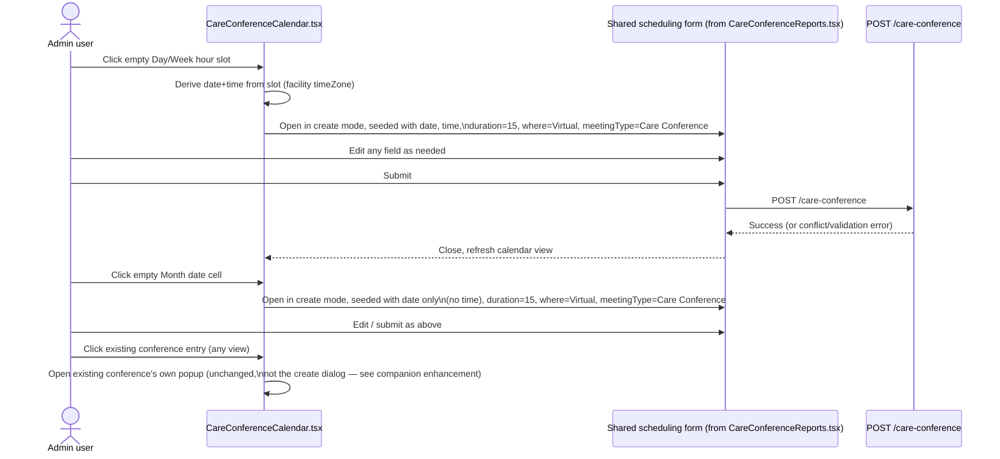

# Care Conference Calendar — Click-to-Create — Spec

**SNF | Developer Spec | derived from Enhancement Request v1 (Approved)**

| Field | Value |
|---|---|
| Source document | `SNF/02_prd/enhancements/care-conference-calendar-click-to-create/enhancement-request-care-conference-calendar-click-to-create.md`, v1 (Status: Approved) as of 2026-08-30 — **re-derive this spec if the source document's Revision History gets a new entry after this date** |
| Status | Draft |
| repo_status | not-promoted |
| last_promoted_revision | — |

## Feature overview

`CareConferenceCalendar.tsx` currently has no "create new conference" affordance —
clicking anywhere on the calendar (Day/Week hour grid, Month day cell) does
nothing unless it lands on an existing conference. This enhancement adds a
click-to-create entry point on all three views, opening the existing scheduling
form pre-filled from the clicked slot/date, bringing Care Conference's calendar
to parity with the pattern `TransportCalendar` already uses (TRN-FR-19c).

## Goals

- Give the calendar itself a scheduling entry point, not just browse/edit/delete.
- Reuse the existing creation form, validation, Zoom-limitation warning, and
  schedule-conflict check (`care-coordination.md` BR-12) unchanged — this is new
  *invocation wiring* on the calendar page, not a new form or a new backend
  endpoint.
- Pre-fill sensible defaults (15-minute duration, Virtual, Care Conference
  meeting type) from the clicked slot/date so the common case requires minimal
  data entry, while leaving every field editable before save.
- Preserve existing click-to-open behavior on an existing conference entry
  (unchanged; covered by the companion enhancement
  `care-conference-edit-delete-group-notifications` for that popup's own
  content/actions).

## Success criteria

- Clicking an empty Day/Week hour slot opens the create dialog with date and
  time pre-filled from that slot.
- Clicking an empty Month date cell (not an existing entry) opens the create
  dialog with date pre-filled, no time pre-fill.
- Clicking an existing conference entry in any view continues to open that
  conference's own popup, never the create dialog.
- A conference created from the calendar is created via the same
  `POST /care-conference` call the list screen ("Schedule Care Conference")
  already uses, with the same validation and conflict-check behavior.

## Scope

### In scope

- Click-to-open-create-dialog from an empty hour slot (Day/Week) or empty date
  cell (Month) on `CareConferenceCalendar.tsx`.
- Pre-fill behavior per view:
  - **Day/Week:** date and time pre-filled from the clicked slot.
  - **Month:** date pre-filled from the clicked cell; no time pre-fill (Month
    cells have no time granularity).
- Defaults applied in all views regardless of pre-fill: duration = 15 min,
  where = Virtual, meeting type = Care Conference. All fields (including these
  defaults) remain editable before saving.
- Reuse of the existing creation form/dialog, its existing field set
  (residents* multi-select, care team* multi-select, family members
  auto-derived, meeting type, date*, time*, duration, where, location, notes),
  existing validation, Zoom >40-minute warning, and existing schedule-conflict
  detection (`client-admin-web.md` §2.11's conflict-check prose; behavior
  covered by BR-12) — unchanged.
- Distinguishing an "empty slot/cell clicked" from an "existing conference
  entry clicked" reliably, including once the overlap-safe event layout
  (same-start-time events split into columns) and Month's "+N more"
  expand/collapse are in play.

### Out of scope

- Content/actions of the popup opened by clicking an **existing** conference —
  covered by the companion enhancement
  `care-conference-edit-delete-group-notifications`.
- Any change to the creation form's fields, validation, or the
  schedule-conflict logic itself, beyond the new pre-filled defaults.
- Facility-group chat notifications — covered by the companion enhancement (the
  "Schedule" notification already fires off the shared `POST /care-conference`
  call regardless of which screen triggered it, so no new wiring falls out of
  this enhancement).
- Fixing the calendar's `COMPLETED`-status filter omission (O-11,
  `care-coordination.md` BR-12) — pre-existing, unrelated to this enhancement.
- Correcting the as-built's inaccurate claim that Month view's day-click
  switches to Day view (`client-admin-web.md` §2.11 line: "clicking a day
  switches to day view") — Sathish has confirmed this does not happen in the
  current build; view switching is handled entirely by a separate
  view-switcher control, independent of clicking a day. This makes the
  day-click free to repurpose for click-to-create with no navigation
  side-effect. Correcting the as-built document itself is a documentation task
  for whoever maintains `client-admin-web.md`, not a deliverable here.

## Workflow diagram

## Data model diagram (ERD)

Not applicable — no schema change. This enhancement reads/writes the same
`CareConference` entity via the same `/care-conference` endpoints already
described in `care-coordination.md` CARE-FR-20/CARE-FR-25/CARE-FR-26a; see
Business rules below for the relevant constraints.

## Functional specification

| # | View | Trigger | Pre-fill | Defaults (editable) | Notes |
|---|---|---|---|---|---|
| 1 | Day | Click an empty hour slot | Date + time of the clicked slot | duration = 15 min, where = Virtual, meetingType = Care Conference | Same-start-time overlap layout must not swallow the click for an empty slot |
| 2 | Week | Click an empty hour slot | Date + time of the clicked slot | Same as Day | Same overlap-safe layout as Day |
| 3 | Month | Click the empty area of a date cell (not an existing entry) | Date only (no time — Month cells have no time granularity) | Same as Day/Week | Applies both before and after a day's "+N more" toggle is expanded |
| 4 | All views | Click an existing conference entry | — | — | Unchanged: opens that conference's own popup, never the create dialog |
| 5 | All views | Any field on the pre-filled create dialog | — | — | Every pre-filled/default value remains user-editable before save |
| 6 | All views | Save from the create dialog | — | — | Calls the existing `POST /care-conference` create endpoint; existing validation and schedule-conflict detection apply unchanged |

## Business rules

- **BR-CCC-01 — Reuse, not replacement.** The creation form, its field set,
  validation, Zoom >40-minute warning, and schedule-conflict detection are
  reused unchanged from the existing "Schedule Care Conference" flow
  (`CareConferenceReports.tsx`). This enhancement adds a new *create-mode
  invocation path* from the calendar; it does not add a second scheduling
  engine, a second form, or a new backend endpoint. (Grounded in
  `care-coordination.md` BR-12: the calendar is a second **view**, not a second
  **source of truth**, over the same `CareConference` records and the same
  `/api/care-conference` endpoints.)
- **BR-CCC-02 — Pre-fill scope by view.** Day and Week views pre-fill both date
  and time from the clicked hour slot. Month view pre-fills date only — Month's
  grid has no time granularity, so no time value is derived or guessed.
- **BR-CCC-03 — Default field values.** Regardless of view, a newly opened
  create dialog defaults to: duration = 15 minutes, where = Virtual, meeting
  type = Care Conference. These are starting values only; every field,
  including these three, remains editable before the user saves.
- **BR-CCC-04 — Existing-entry clicks are unaffected.** Clicking an existing
  conference entry, in any view, continues to open that conference's own detail
  popup (edit/delete), never the new create dialog. This behavior and the
  popup's own content/actions are unchanged by this enhancement — see the
  companion enhancement `care-conference-edit-delete-group-notifications` for
  that popup's scope.
- **BR-CCC-05 — Facility-timezone-correct pre-fill.** The pre-filled date/time
  must be derived using the facility's configured `timeZone` — the same
  convention this calendar already uses for "today" highlighting and its
  default landing date (`care-coordination.md` CARE-FR-26a) — not
  browser-local time, and not the Rehab Calendar's separate UTC-date-key
  convention (`client-admin-web.md` §4.4/§4.5, care-coordination.md §7 O-6
  context). Flagged explicitly because this is a new place timezone handling
  could regress silently.
- **BR-CCC-06 — Month-view day-click has no navigation side effect.** Per
  Sathish's direct confirmation (resolves EQ-01/EQ-02 below), clicking a Month
  view day does not switch to Day view in the current build — view switching is
  handled entirely by a separate view-switcher control on the page. This
  enhancement's repurposing of the Month day-click for click-to-create
  therefore has no navigation trade-off to preserve or replace.
- **BR-CCC-07 — No change to conflict/validation logic.** The existing
  schedule-conflict check and all existing form validation apply to a
  conference created from the calendar exactly as they do today from the
  "Schedule Care Conference" screen — unchanged by this enhancement.

## Open questions

| ID | Area | Question and current position | Priority |
|---|---|---|---|
| EQ-01 | UX | Resolved in the ER — Month view day-click conflict. Click-to-create applies to empty dates/slots in all three views; existing conferences still open their own popup. Carried forward here as **Resolved**, not re-opened. | Resolved |
| EQ-02 | UX | Resolved in the ER — Month-view navigation trade-off. View switching is handled by a separate control, not the day-click, so there is nothing to preserve or replace (see BR-CCC-06). Carried forward here as **Resolved**, not re-opened. | Resolved |
| EQ-03 | Technical (raised by SA Round 1, not yet dispositioned) | Whether Day/Week's hour-slot empty space remains an independently clickable target once same-start-time events split into columns within it, and whether Month's empty day-cell area is independently clickable both before and after "+N more" is expanded — and whether existing event elements need `stopPropagation()` added so an event click doesn't also bubble into the new create-on-click handler. SA has scoped this as a spike ("Calendar click-target isolation") to run before the Day/Week/Month stories are estimated. Not yet resolved as of this spec's derivation — carry forward into the Technical Design / `tech-spec-care-conference-calendar-click-to-create.md`. | High |

None of the source ER's open questions are unresolved product/scope questions —
EQ-01 and EQ-02 were resolved by Sathish directly in the ER. EQ-03 above is a
new item surfaced during SA Round 1 review (not present in the ER itself); it
is technical in nature and owned by System Architect, carried forward here per
the process's Open Question lifecycle rule so it isn't dropped between this
spec and the Technical Design.
