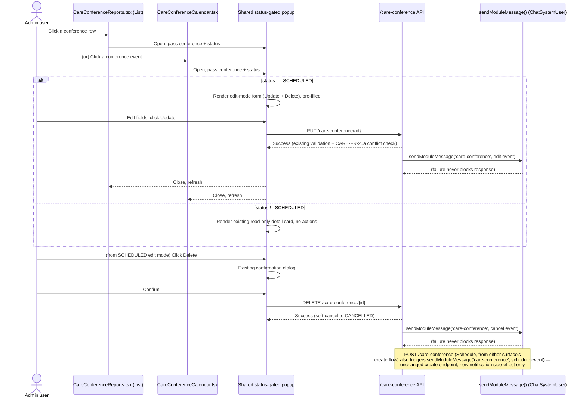

# Care Conference — Popup Edit/Delete Parity & Facility Group Notifications — Spec

**SNF | Developer Spec | derived from Enhancement Request v1 (Approved)**

| Field | Value |
|---|---|
| Source document | `SNF/02_prd/enhancements/care-conference-edit-delete-group-notifications/enhancement-request-care-conference-edit-delete-group-notifications.md`, v1 (Status: Approved) as of 2026-08-30 — **re-derive this spec if the source document's Revision History gets a new entry after this date** |
| Status | Draft |
| repo_status | not-promoted |
| last_promoted_revision | — |

## Feature overview

The Care Conference Calendar's event-detail popup is read-only today with no
Edit or Delete, while the List screen's row popup already has both. This
enhancement gives both surfaces one shared, status-gated popup (edit-mode for
`SCHEDULED`, read-only for every other status) and adds automated
facility-group chat notifications on schedule/edit/cancel — bringing Care
Conference to the same standard Transportation already meets
(`TRN-FR-19c` shared edit surface, `TRN-FR-26` chat-card notifications).

## Goals

- One shared popup — read-only detail card and edit-mode form — used
  identically from the List screen (`CareConferenceReports.tsx`) and the
  Calendar (`CareConferenceCalendar.tsx`), instead of each surface maintaining
  its own version.
- Whether a row-click/event-click opens edit mode or read-only mode is decided
  purely by the conference's status: `SCHEDULED` → edit mode (Update +
  Delete); every other status (`IN_PROGRESS`, `IN_REVIEW`, `COMPLETED`,
  `CANCELLED`) → the existing Calendar read-only detail card, reused as-is.
- No loosening of any existing status gating: Delete keeps its current
  `SCHEDULED`-only rule (`CARE-FR-21`/BR-2) unchanged. Update gains the same
  `SCHEDULED`-only restriction — a new restriction on the UI, and on the
  backend too if `PUT /care-conference/{id}` is not already so gated (see
  Business rules / Open questions).
- Grid row Actions column reduced to Delete only; Edit is reached by clicking
  into the row's own popup, not a separate icon.
- Automated facility-group chat notification on Schedule (create),
  Edit/reschedule (Update), and Cancel/Delete — one notification per
  lifecycle event, reusing the platform's `ChatSystemUser`/
  `Config.chat.moduleMessageBindings`/`sendModuleMessage()` mechanism
  (`MSG-FR-36`) the same way Transportation does (`TRN-FR-26`), under a new
  `'care-conference'` `ModuleKey`.
- Notification content is deliberately minimal: resident (patient) name,
  date, and time only — no notes, agenda, location, or attendee list.

## Success criteria

- Clicking a `SCHEDULED` conference from either the List row or the Calendar
  opens the same edit-mode form, pre-filled, with Update and Delete.
- Clicking a conference in any other status from either surface opens the
  same read-only detail card, with no Update or Delete control present.
- The grid's Actions column shows only a Delete icon (no separate Edit icon),
  gated the same as today.
- `PUT /care-conference/{id}` rejects a request when the conference's current
  status is not `SCHEDULED` (verified to already do so, or added if not — see
  Open questions), independent of what the UI offers.
- Scheduling, editing, or cancelling a conference posts exactly one chat card
  into the facility's configured "Care Conferences" chat group per event,
  containing only resident name, date, and time.
- A `sendModuleMessage()` failure never blocks or fails the calling
  create/update/delete API response (mirrors Transport's existing behavior).

## Scope

### In scope

- Status-gated popup mode, used identically from the List screen and the
  Calendar: edit-mode form (Update + Delete) for `SCHEDULED`; the existing
  read-only Calendar detail card for every other status.
- A shared read-only detail-card component and a shared edit-mode form
  component, used by both `CareConferenceReports.tsx` and
  `CareConferenceCalendar.tsx` instead of each surface having its own.
- Verifying `PUT /care-conference/{id}`'s current status gating, and adding a
  `SCHEDULED`-only check on it if it is not already restricted, so Update
  cannot be invoked from a non-`SCHEDULED` status via a direct API call
  either — a tightening, not a loosening.
- Grid row Actions column reduced to Delete only, under Delete's existing
  `SCHEDULED`-only gating (unchanged); Edit is reached via row-click into the
  edit-mode popup.
- A new `'care-conference'` module-message binding and chat-card template
  restricted to resident name, date, and time, firing on Schedule
  (create), Edit/reschedule (Update), and Cancel/Delete (the single
  `DELETE /:id` soft-cancel operation — one notification event, not two).
- Facility-level configurability of the destination chat group via the
  existing `Config.chat.moduleMessageBindings` config shape (manual
  provisioning — see Out of scope).

### Out of scope

- Building an admin-facing UI/API to create `ChatSystemUser` identities or to
  manage `moduleMessageBindings` — this enhancement uses **manual
  provisioning only**, the same mechanism Transportation uses today
  (`MSG-FR-36` §9 gap). A self-service admin UI for this is a candidate
  future enhancement in its own right, not drafted and not part of this work.
- Any change to who can *view* a conference (`CARE-FR-26` visibility rules
  unchanged) — this enhancement only adds a notification side-channel.
- The status machine itself, Zoom/Google Calendar integration, and the
  `COMPLETED`-conference summary edit/share flow (`CARE-FR-24`) — untouched.
  `COMPLETED` conferences show the read-only card under this enhancement's
  rule, same as `IN_REVIEW`/`CANCELLED`/`IN_PROGRESS`.
- The Calendar's click-to-**create** behavior on empty slots/cells — covered
  by the companion enhancement `care-conference-calendar-click-to-create`
  (separate slug, separate spec — not this one).
- A separate hard-delete or independent "Deleted" status — `DELETE /:id`
  remains the existing soft-cancel to `CANCELLED`; unlike Transport
  (`TRN-FR-19c`/24) there is no second delete concept here.
- Correcting `client-admin-web.md` §2.11's inaccurate claim that the Calendar
  "already offers Edit and Delete directly" — flagged for whoever maintains
  that as-built document; not a deliverable of this enhancement.

## Workflow diagram

## Data model diagram (ERD)

Not applicable — no schema change to `CareConference`. This enhancement reads/
writes the same entity via the existing `/care-conference` endpoints
(`CARE-FR-20`/21/24-26) and adds a new `ModuleKey` (`'care-conference'`) to
the existing `Config.chat.moduleMessageBindings` config shape already used by
Transportation (`MSG-FR-36`) — a config value, not a schema change.

## Functional specification

| # | Surface | Trigger | Conference status | Behavior |
|---|---|---|---|---|
| 1 | List row / Calendar event | Click | `SCHEDULED` | Opens shared edit-mode form, pre-filled with residents, care team, family members (auto-derived), date/time, duration, where, location, notes/agenda. Two actions: Update, Delete. |
| 2 | List row / Calendar event | Click | `IN_PROGRESS`, `IN_REVIEW`, `COMPLETED`, `CANCELLED` | Opens the existing Calendar read-only detail card (reused as-is): resident photo, status badge, date/time, location, care-team roster with host tagged, agenda/notes. No Update, no Delete. |
| 3 | Edit-mode form | Click Update | `SCHEDULED` only | Calls existing `PUT /care-conference/{id}`; existing validation and schedule-conflict check (`CARE-FR-25a`) unchanged. Fires `care-conference` chat notification (edit/reschedule event) on success. |
| 4 | Edit-mode form | Click Delete | `SCHEDULED` only (existing gate) | Existing confirmation dialog, then existing `DELETE /:id` soft-cancel to `CANCELLED`. Fires `care-conference` chat notification (cancel event) on success. |
| 5 | "Schedule Care Conference" create flow | Save | n/a (create) | Existing `POST /care-conference`, unchanged. Fires `care-conference` chat notification (schedule event) on success. |
| 6 | List screen grid | Row render | any | Actions column shows Delete icon only (no separate Edit icon), enabled per Delete's existing `SCHEDULED`-only rule. |
| 7 | `PUT /care-conference/{id}` (backend) | Any caller, direct or via UI | not `SCHEDULED` | Request rejected — verify existing gating; add a `SCHEDULED`-only check if not already present (see Business rules / Open questions). |
| 8 | Chat notification | Any of #3/#4/#5 succeeds | n/a | Posts one card into the facility's `Config.chat.moduleMessageBindings['care-conference']`-configured chat group. Content: resident name, date, time only. `sendModuleMessage()` failure does not fail the calling API response. |

## Business rules

- **BR-01 — Status decides popup mode, identically on both surfaces.**
  `SCHEDULED` opens the shared edit-mode form by default; every other status
  (`IN_PROGRESS`, `IN_REVIEW`, `COMPLETED`, `CANCELLED`) opens the existing
  read-only Calendar detail card. This rule is the same regardless of whether
  the popup was opened from the List row or the Calendar event.
- **BR-02 — Editing is not allowed outside `SCHEDULED`, including
  `IN_PROGRESS`.** Per Sathish's direct confirmation, this supersedes an
  earlier draft answer in the ER's history that had briefly allowed editing
  during `IN_PROGRESS`. The final rule is `SCHEDULED`-only for both Update
  and Delete, matching Delete's existing gate exactly.
- **BR-03 — No loosening of Delete's existing gate.** `DELETE /:id` keeps its
  current soft-cancel-to-`CANCELLED`, `SCHEDULED`-only behavior (`CARE-FR-21`/
  BR-2) completely unchanged by this enhancement.
- **BR-04 — Update gains a `SCHEDULED`-only restriction, front end and back
  end.** The UI only offers Update from the edit-mode form, which only opens
  for `SCHEDULED`. Independently, `PUT /care-conference/{id}` itself must
  reject calls when the conference is not `SCHEDULED`, so the restriction
  holds for a direct API call too, not just when hidden in the UI. If the
  endpoint is already `SCHEDULED`-only, no backend change is needed; if it is
  currently unrestricted, this is a new restriction to add — a tightening,
  not a relaxation of any existing behavior. (See Open questions — exact
  current gating to be confirmed by System Architect.)
- **BR-05 — One shared component pair, not two.** A read-only detail view
  (the Calendar's existing card, reused as-is) and an edit-mode form (new,
  following Transport's `useScheduleTransportModal` extraction pattern,
  `TRN-FR-19c`) are used identically from `CareConferenceReports.tsx` and
  `CareConferenceCalendar.tsx`, rather than each surface maintaining its own
  version.
- **BR-06 — Grid Actions column shows Delete only.** The List screen's row
  Actions column is reduced to the Delete icon, shown/enabled under Delete's
  existing `SCHEDULED`-only rule (unchanged). Edit is reached by clicking
  into the row itself, which opens the shared status-gated popup.
- **BR-07 — One notification per lifecycle event, three lifecycle events.**
  `'care-conference'` is added as a new `ModuleKey` consumer of the existing
  `ChatSystemUser`/`sendModuleMessage()` mechanism (`MSG-FR-36`). A message
  posts on: Schedule (create), Edit/reschedule (Update), and Cancel/Delete
  (the single `DELETE /:id` operation is one event, not two separate
  "cancel" and "delete" notifications, since there is no independent
  hard-delete concept for Care Conference).
- **BR-08 — Minimal notification content only.** Per Sathish, chat message
  content is restricted to resident (patient) name, date, and time only — no
  notes, agenda, location, or attendee list. This is a deliberately minimal
  payload, chosen as the minimum-necessary content set; see Impact/compliance
  note below.
- **BR-09 — Facility-configurable destination, manual provisioning.** The
  destination chat group is set per facility via
  `Config.chat.moduleMessageBindings['care-conference']`, the same config
  shape and manual-provisioning mechanism Transportation already uses. No
  admin UI to manage this binding or to create `ChatSystemUser` identities is
  part of this enhancement.
- **BR-10 — Notification failure never blocks the calling API.** Mirroring
  Transport's existing pattern, a `sendModuleMessage()` failure must not
  block or fail the create/update/delete API response it's attached to.
- **BR-11 — Per-event opt-out honored.** Mirrors Transport's card-per-event
  pattern: a per-event `messageNotifyPreference` opt-out, where applicable,
  is respected the same way it is for Transportation.
- **BR-12 — New PHI exposure surface; compliance register flag.** Even
  restricted to resident name/date/time, posting into a facility chat group
  is a new PHI exposure relative to today's host/admin-scoped visibility
  (`CARE-FR-26`): it discloses that a named resident has a care-coordination
  event to everyone in that facility's configured chat group. This should be
  flagged for the HIPAA compliance register
  (`SNF/03_architecture/compliance/hipaa-compliance-register.md`); the
  minimal name/date/time-only content set is the minimum-necessary outcome
  of that review, per Sathish.
- **BR-13 — No change to conference visibility rules.** `CARE-FR-26`'s
  existing rules for who can *view* a conference are unchanged; this
  enhancement only adds a notification side-channel on top of them.

## Open questions

None — all product/scope questions from the source ER were resolved by
Sathish; see the ER's Section 6 resolution table (EQ-01 through EQ-05),
carried forward here as settled product decisions, not re-opened:

| ID | Area | Resolution (settled — not open) |
|---|---|---|
| EQ-01 | As-built accuracy | Calendar popup has no buttons today; `client-admin-web.md` §2.11's contrary claim is inaccurate, flagged for correction by that doc's maintainer, independent of this enhancement. |
| EQ-02 | UX | Non-`SCHEDULED` statuses show read-only detail — the existing Calendar "Event detail popup" card, reused as-is (BR-01). |
| EQ-03 | UX | Editing is not allowed on an `IN_PROGRESS` conference — Update, like Delete, is `SCHEDULED`-only (BR-02). |
| EQ-04 | Compliance | Chat message content is restricted to resident (patient) name, date, and time only (BR-08). |
| EQ-05 | Platform | Manual provisioning only for `ChatSystemUser`/`moduleMessageBindings`; a self-service admin UI is a candidate future enhancement, not part of this work (BR-09). |

One item remains open for System Architect investigation, not product
decision — carried forward from the ER's Section 5 "Notes to System
Architect" for visibility, not as a product open question:

- Exact current status gating on `PUT /care-conference/{id}` is not
  documented in the as-built. If it is already `SCHEDULED`-only, BR-04
  requires no backend change; if unrestricted, BR-04 requires adding the
  restriction. This is a technical confirmation for the Technical Design,
  not a product ambiguity — the product rule (BR-04) is settled regardless
  of which case is true.
- Whether `CareConferenceReports.tsx` and `CareConferenceCalendar.tsx` can
  converge on the shared read-only-card and edit-mode-form components
  cleanly, or whether current divergence between the two makes it a
  non-trivial refactor, is a System Architect feasibility question — not a
  product open question; BR-05's requirement (one shared component pair)
  is the settled product decision regardless of implementation difficulty.
- Whether `moduleMessageBindings`/`ChatSystemUser` can support a second
  `ModuleKey` (`'care-conference'`) without changes beyond config plus a new
  template/`resolveMentions` restricted to the three approved fields is a
  System Architect confirmation for the Technical Design — not a product
  open question; BR-07/BR-08's requirements are the settled product
  decision.
