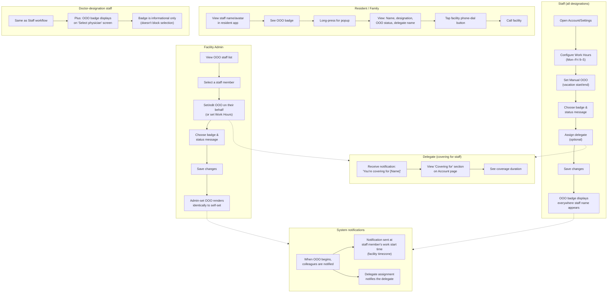

# Out of Office (OOO)

**Shashi Care | Product Requirements | v1.0**

| Field                  | Value                                                                                                                                                                                                                                                                                                                                                                                                                                                                                                                                                                                                                                          |
| ---------------------- | ---------------------------------------------------------------------------------------------------------------------------------------------------------------------------------------------------------------------------------------------------------------------------------------------------------------------------------------------------------------------------------------------------------------------------------------------------------------------------------------------------------------------------------------------------------------------------------------------------------------------------------------------- |
| Status                 | Draft                                                                                                                                                                                                                                                                                                                                                                                                                                                                                                                                                                                                                                          |
| Audience               | Product Manager (review & sign-off) → System Architect (Epic & Story creation)                                                                                                                                                                                                                                                                                                                                                                                                                                                                                                                                                                 |
| Product                | Senior Living + Skilled Nursing — this sits at the platform-foundation / messaging level (both tagged "Applies to: Both" in the as-built docs), not a SNF-only or SAL-only feature                                                                                                                                                                                                                                                                                                                                                                                                                                                             |
| Business goal          | Let staff — including physicians — signal planned or after-hours unavailability with a discoverable point of contact, so colleagues and residents/families know who to reach instead, without adding another push-notification channel to an already over-notifying platform.                                                                                                                                                                                                                                                                                                                                                                  |
| Success metrics        | Confirmed: (1) staff adoption rate of OOO setup; (2) reduction in "couldn't reach on-call staff" support/front-desk contacts during covered periods. **Measurability notes, per metric:** (1) is derivable from the Work Hours / manual-OOO records already scoped in §4 — no new product requirement needed. (2) is measured operationally, outside the product, from support/front-desk contact logs — no product requirement needed. (Metric (3), "delegate acknowledgment/response time," was evaluated and dropped per IQ-06 decision — see §11.)                                                                                         |
| Release shape          | Recommended: single release covering the Account/Settings surfaces (web + all three staff-app flows), the universal badge across every named surface (including resident apps), the Admin oversight list, and Pending-Sign-picker integration — see §10 for what's deferred instead of phased. This is a recommendation, not a decision you've made; confirm before story creation.                                                                                                                                                                                                                                                            |
| Sources                | As-built docs: `personas-and-roles.md`, `modules/platform-foundation.md`, `modules/messaging-chat.md`, `modules/care-coordination.md`, `modules/announcements-notifications.md`, `architecture-senior_living_staffapp.md`, `architecture-senior_living_admin.md`, `adr/ADR-006-digital-signature-contract.md`. Next step: Claude Design prototype or System Architect Epic & Story creation. |
| Related                | No existing PRD for this feature — it's net new. Explicit boundary: this PRD does **not** touch care-team assignment or resident-message routing (`care-coordination.md`); does **not** touch the notification/announcement pipeline; does **not** resolve the Pending Sign backend contract or audit posture already flagged as open in ADR-006 (this feature depends on that module existing and working, it doesn't fix it); does **not** introduce a facility-configurable badge catalog.                                                                                                                                                  |
| Open questions         | None. All requirements finalized. |                                                                                                                                                                                                                                                                                                                                                                                         |
| repo_status            | not-promoted                                                                                                                                                                                                                                                                                                                                                                                                                                                                                                                                                                                                                                   |
| last_promoted_revision | —                                                                                                                                                                                                                                                                                                                                                                                                                                                                                                                                                                                                                                              |

---

## 1. Assumptions

- **A1.** OOO has two independent triggers: **automatic** (outside a staff member's configured recurring Work Hours) and **manual** (an explicitly set vacation/leave date range with its own start/end).
- **A2.** Automatic (after-hours) OOO carries a default badge with no custom status or message. Manual OOO lets the staffer pick a badge from a system-provided, **platform-wide fixed** catalog, and write a free-text custom status message.
- **A3.** When both triggers are true at once (e.g., a staffer is on manually-set vacation during what would also be their off-hours), the manual OOO state and its custom badge/message take display precedence.
- **A4.** Manual OOO duration is fixed start/end only; there is no open-ended "until further notice" state.
- **A5.** Coverage/delegate assignment is single-cardinality, facility-wide eligibility with no care-team or designation restriction, and **purely informational** in this phase — it does not change `assignedStaff[]`, resident chat routing, or Pending Sign queue visibility.
- **A6.** Delegate-of-delegate chains are **not** auto-resolved. Each person's own delegate is shown independently, with no system-computed multi-hop resolution.
- **A7.** The OOO/Work Hours "Account" destination extends the existing admin-web `SettingsPage.tsx` Account tab on web (`architecture-senior_living_admin.md` §3.1/§3.16). On mobile it is new build for at least the MIGRATED flow (and possibly CHAT_HOME, unconfirmed) — only the LEGACY flow has an existing Settings screen today, and it doesn't cover this. **Note for System Architect:** The Work Hours + OOO editor component (includes manual OOO, badge picker, status message, and delegate assignment) should be built as a reusable unit, embedded both in the Account/Settings page and available for admin use when editing a staff member's Work Hours / OOO via a Staff profile view.
- **A8.** The OOO badge — and its web-hover / mobile-long-press detail — renders on every surface where a user's name or avatar appears, including a person's own name/avatar, across the staff app (all three flows), admin web, and resident-facing apps (SN/SL), with no permission constraints on who can see it. **Resident-app specific:** Residents/Family see OOO status and delegate name only (no staff personal contact details). The popup includes a facility phone-dial button instead of staff contact info.
- **A9.** The "select physician to send for signature" screen **already exists** as shipped, built functionality. This feature integrates the OOO badge into that existing screen, no changes to the screen's core flow required.
- **A10.** Admin-set OOO (a Facility Admin/Manager setting OOO on a staff member's behalf) is **visually identical** to self-set OOO everywhere it renders.
- **A11.** "No additional notification is sent" is a hard constraint on the badge/status itself: no FCM push, no socket event beyond normal presence, no `NotificationHistory`/announcement-pipeline entry **during ongoing OOO or when status changes**. This is a **deliberate divergence** from the platform's default "something changed → push" pattern (chat, announcements, and care-conference reminders all push today). **Two exceptions:** (1) Delegate notification: naming a delegate notifies that person via a separate path, (2) OOO start notification: when someone's OOO begins, colleagues are notified — the notification is sent at the time their regular work starts (facility timezone). This gives colleagues advance notice that the person is unavailable.
- **A12.** Facility timezone — not device timezone — governs Work Hours and OOO start/end evaluation, consistent with the platform's existing timezone-authority precedent (`ADR-005-facility-timezone-authority.md`).
- **A13.** Work Hours follow a standard schedule: staff work a general 9 AM–5 PM shift with no shift rotations or variable scheduling. Week-off days are standard weekend days (Saturday & Sunday, not configurable per staff member). This means Work Hours do **not** require a date-range picker or per-staff week-off configuration — the editor is a simple weekly recurring time-slot selector (e.g., Monday–Friday 9 AM–5 PM, with Saturday & Sunday always off). Future facility-specific or staff-specific scheduling complexity is deferred to Phase 2.

---

## 2. Scope

### 2.1 In scope

- Work Hours: a recurring weekly schedule staff configure for themselves.
- Automatic OOO trigger for time outside configured Work Hours (default badge, no custom message).
- Manual OOO trigger (vacation/leave) with a fixed start/end, a custom status message, and a badge chosen from a platform-wide fixed catalog.
- Coverage/delegate assignment: single delegate, any staff member at the facility, informational only.
- Delegate notification on assignment, and a "covering for" section in the delegate's own Account/profile view showing who they're covering for and for how long.
- OOO start notification: when someone's OOO begins (automatic or manual), colleagues are notified. The notification is sent at the start of their regular work time (facility timezone), giving the team advance notice of unavailability.
- Universal badge display: messaging (conversation list, header, new-conversation picker), the physician-selection step for sending a document to sign, grid/table columns that display users, and a person's own name/avatar — across the staff app (all three flows), admin web, and resident-facing apps (SN/SL, TV wherever staff names surface).
- Web hover tooltip and mobile long-press profile popup (Name, designation, office hours, OOO status/message), with a facility-contact affordance added specifically on the resident-facing version.
- Admin capability to set or clear OOO on a staff member's behalf, rendered identically to self-set.
- Admin-facing filterable list/view of all currently-OOO staff at the facility.
- Account/Settings destination on web (extending the existing Account tab) and on mobile (new, per app-flow).

### 2.2 Out of scope

- Any change to care-team assignment (`assignedStaff[]`), resident-message routing, or Pending Sign queue visibility as a result of naming a delegate — coverage is informational only in this phase.
- A facility-configurable badge catalog — the catalog is platform-wide and fixed.
- Automatic resolution or display of delegate-of-delegate chains.
- An open-ended / "until further notice" OOO duration.
- Any new push, socket, or `NotificationHistory` channel triggered by the badge or status change itself (the delegate-notification path is the one exception, and is a separate mechanism).
- Any change to the Pending Sign backend contract or its audit posture — ADR-006 remains open and independent of this feature; this PRD builds on top of that module, it doesn't resolve its outstanding questions.
- A Pending-Sign-screen-specific self-reminder banner for an OOO staffer — the staffer's own badge (A8) is the only self-indicator.
- Visually distinguishing admin-set OOO from self-set OOO.

---

## 2.3 Happy-path workflow (swim lane diagram)

---

## 3. Personas

| Persona                                       | Release (this phase / next phase)                                                                                                                                                                                      | Use of the feature                                                                                                                                                                                                                 |
| --------------------------------------------- | ---------------------------------------------------------------------------------------------------------------------------------------------------------------------------------------------------------------------- | ---------------------------------------------------------------------------------------------------------------------------------------------------------------------------------------------------------------------------------- |
| Staff (all designations, all three app-flows) | This phase                                                                                                                                                                                                             | Configures own Work Hours and manual OOO (status, badge, duration, delegate); sees own and others' badges everywhere names appear; gets notified when named as someone's delegate; sees a "covering for" list on their own profile |
| Facility Admin / Manager                      | This phase                                                                                                                                                                                                             | Can set or clear OOO on any staff member's behalf (renders identically to self-set); filters/views the facility-wide list of currently-OOO staff                                                                                   |
| Doctor-designation staff, specifically        | This phase                                                                                                                                                                                                             | Same as Staff, plus: their OOO badge surfaces on the "select physician to send for signature" picker used by whoever is routing a document for their signature                                                                     |
| Resident                                      | This phase                                                                                                                                                                                                             | Sees the OOO badge on assigned staff wherever a staff name is shown in the resident app / TV; the hover/long-press-equivalent surfaces the status message plus a facility-contact affordance                                       |
| Family Member                                 | This phase (**inference** — family members typically operate as the resident under the platform's existing family-as-resident normalization, `personas-and-roles.md` §4; flagged for explicit confirmation, see IQ-05) | Same as Resident, by extension of the shared account model                                                                                                                                                                         |
| Super Admin                                   | This phase, same behavior as Facility Admin (treated identically in role checks per `personas-and-roles.md` §1)                                                                                                        | Same as Facility Admin                                                                                                                                                                                                             |

---

## 4. Data & sources

- **Work Hours** is staff-authored and stored per staff member per facility. A simple weekly recurring schedule (e.g., Monday–Friday, 9 AM–5 PM, with Saturday & Sunday always off per A13) — no date ranges, no per-staff week-off customization, no shift rotations in Phase 1. There is no existing model to extend for this — the platform's only comparable field is a **different concept**: a buggy, typo'd rehab-therapist appointment-slot availability endpoint (`PUT staff/availabilty/:staffCName`, flagged in `platform-foundation.md` as returning 400 after staff creation succeeds). This feature should not reuse that endpoint or its underlying model; it needs its own.
- **Manual OOO record**: staff-authored (or admin-authored on the staff member's behalf), fixed start/end, custom status text, a badge selection from the fixed platform enum, and a delegate `cName`. Net-new backend model.
- **Badge catalog**: platform-shipped, fixed list — ships with the app, not stored as facility-configurable data.
- **Delegate eligibility list**: read (not written) from the facility's staff directory. No filtering against designation or care-team is needed — this is a simpler read than the personas/care-team model elsewhere on the platform.
- **Facility contact info** (for the resident-side "contact the facility" affordance): assumed to be sourced from existing facility config, following the platform's existing `GET /api/config` pattern (`platform-foundation.md`) — specifically a facility phone number field, rendered as a phone-dial button. Not confirmed which exact field — see IQ-04, §11.
- **Facility timezone**: reuses the existing timezone authority (`ADR-005-facility-timezone-authority.md`); no new timezone source.

---

## 5. Functional specification

### 5.1 Account / Settings — Work Hours & OOO setup (web + mobile)

| Element                | Behaviour & rules                                                                                                                                                                                                                                                 |
| ---------------------- | ----------------------------------------------------------------------------------------------------------------------------------------------------------------------------------------------------------------------------------------------------------------- |
| Work Hours editor      | Simple weekly recurring time-slot editor (e.g., "Monday–Friday, 9 AM–5 PM"). Saturday & Sunday are always off (not configurable per staff). Configurable by the staff member (self) or by Facility Admin/Manager on their behalf. Evaluated in facility timezone. |
| Manual OOO setup       | Fixed start/end date-time picker (no open-ended option); badge picker from the fixed platform catalog; free-text custom status field. Configurable by the staff member (self) or by Facility Admin/Manager on their behalf.                                       |
| Delegate picker        | Facility-wide staff directory, single-select, no eligibility filter. Assignable by the staff member (self) or by Facility Admin/Manager on their behalf.                                                                                                          |
| Save                   | Creates/updates the Work Hours and OOO records. If a delegate is named or changed, triggers a notification to the delegate (the one exception to the no-notification rule).                                                                                       |
| "Covering for" section | Read-only list, on the viewing staff member's own Account page, of anyone currently naming them as delegate, with the covering duration.                                                                                                                          |

### 5.2 Badge & profile popup — universal display

| Element              | Behaviour & rules                                                                                                                                                                                                                                                                                   |
| -------------------- | --------------------------------------------------------------------------------------------------------------------------------------------------------------------------------------------------------------------------------------------------------------------------------------------------- |
| Render surfaces      | Messaging conversation list and header, new-conversation staff/contact picker, the "select physician to send for signature" step, grid/table columns displaying users (e.g. SNF residents table's CM/SW/Doctor columns), and a staff member's own name/avatar wherever it appears                   |
| Web — hover          | Tooltip showing the custom status message (manual OOO) or a default label (automatic OOO)                                                                                                                                                                                                           |
| Mobile — long-press  | Opens a profile popup showing: Name, designation, office hours (Work Hours), OOO status/message, **and the delegate's name if one is assigned**                                                                                                                                                     |
| Staff-app variant    | Full popup as specified above (includes delegate name and any relevant details)                                                                                                                                                                                                                     |
| Resident-app variant | Same popup **except:** does not show staff personal contact details. Instead, includes a facility-contact affordance (phone-dial button linked to the facility's phone number) alongside the OOO status message, so residents/families can reach the facility when the staff member is unavailable. |
| Visibility           | All app users, no permission constraints                                                                                                                                                                                                                                                            |

### 5.3 Admin — OOO staff list & admin-set OOO

| Element        | Behaviour & rules                                                                                                                                                       |
| -------------- | ----------------------------------------------------------------------------------------------------------------------------------------------------------------------- |
| OOO staff list | Facility-wide, filterable view of who's currently OOO; exact placement (Staff management vs. a new area) is a System Architect / UI design decision, not specified here |
| Admin-set OOO  | Admin can create, edit, or clear an OOO record on a staff member's behalf; same validation as self-service; renders identically to self-set everywhere                  |

---

## 6. Business rules / state model

- **BR1.** A staff member's effective OOO state = manual OOO (if an active record's start ≤ now ≤ end) **OR** automatic OOO (if now falls outside their configured Work Hours). When both are true, the **manual** badge/status/message takes display precedence. *Stated explicitly as a rule, since "which one wins" isn't self-evident and shouldn't be left to whichever gets implemented first.*
- **BR2.** Manual OOO only exists within an explicitly configured, fixed date range — there is no indefinite state.
- **BR3.** Coverage assignment does not alter care-team membership, resident chat routing, or Pending Sign visibility. This is a Phase 2 candidate only, called out here specifically so a future "simplification" doesn't quietly start rerouting responsibility without the compliance review that would require (the same review this PRD explicitly does not attempt — see the ADR-006 boundary noted under Related).
- **BR4.** Delegate eligibility = any staff member at the facility; no designation or care-team filter applies.
- **BR5.** Delegate chains are never resolved by the system. Each OOO record's delegate is displayed independently; there is no traversal from "A's delegate is B" to "B's delegate is C."
- **BR6.** A badge or status change during ongoing OOO never triggers FCM push, a socket notification, or a `NotificationHistory` entry — a deliberate, stated divergence from the platform's default "something changed → push" pattern used by chat, announcements, and care-conference reminders. State this explicitly in any downstream design doc so it isn't "fixed" as an oversight later. **Exceptions:** (a) Delegate assignment notification (BR7), and (b) OOO start notification (BR6a below).
- **BR6a.** When someone's OOO begins (automatic or manual), a notification is sent to colleagues at the time of their regular work start (facility timezone). This gives the team advance notice of unavailability. No ongoing updates are sent (e.g., when the OOO ends or if it's cancelled).
- **BR7.** Naming or changing a delegate **does** notify the delegate — an exception to BR6, and a distinct code path from message-recipient notifications.
- **BR8.** Admin-set and self-set OOO render identically everywhere. The underlying record may still track who created/modified it for audit purposes even though the UI never surfaces that distinction — see IQ-01.
- **BR9.** The OOO signal on the "select physician to send for signature" step is purely informational; it never blocks selecting or sending to an OOO physician.
- **BR10.** No Pending-Sign-specific self-reminder is shown to an OOO staff member inside their own signature queue. Their own OOO state is visible to them only through the universal badge rule applied to their own name/avatar, not a dedicated banner — a deliberate choice, not an omission.
- **BR11.** OOO start notifications are sent to **all colleagues** at the facility (no filtering by care-team, role, or designation). The notification is informational only — it does not block any actions or change routing.

---

## 7. Data writes / mutations

| Write                                  | Trigger                                     | Constraints                                                                                                      |
| -------------------------------------- | ------------------------------------------- | ---------------------------------------------------------------------------------------------------------------- |
| Create/update Work Hours               | Staff edits their Account/Settings          | One record per staff member per facility; evaluated in facility timezone                                         |
| Create/update/cancel manual OOO record | Staff (self) or Admin (on staff's behalf)   | Fixed start/end required; badge from the fixed platform enum; status text free-form                              |
| Set/change delegate                    | Part of OOO record create/edit              | Single value; any facility staff member; triggers a delegate notification on create or change, not on every view |
| Admin sets OOO for staff               | Admin action from the OOO staff list (§5.3) | Same validation as self-service; renders with no visual distinction from self-set                                |

---

## 8. Permissions

| Action                                 | Staff (self)                  | Staff (other) | Facility Admin / Manager                | Resident / Family             |
| -------------------------------------- | ----------------------------- | ------------- | --------------------------------------- | ----------------------------- |
| Set/edit Work Hours                    | Yes (own)                     | No            | Yes (on any staff member's behalf)      | No                            |
| Set/edit manual OOO & assign delegate  | Yes (own)                     | No            | Yes (on any staff member's behalf)      | No                            |
| View own OOO status                    | Yes                           | —             | Yes                                     | —                             |
| View another person's OOO badge/status | Yes (everyone, no constraint) | Yes           | Yes                                     | Yes (for staff shown to them) |
| View facility-wide "who's out" list    | No                            | No            | Yes                                     | No                            |
| View "covering for" section            | Yes (own)                     | No            | Yes (any staff member's, for oversight) | No                            |

---

## 9. Non-functional requirements

- **Performance.** Badge/status lookups happen on every name render, across many high-traffic surfaces (messaging lists, grids, pickers). Recommend batching/caching this the way unread-badge aggregation already was for performance (`messaging-chat.md` MSG-FR-17a), rather than a live per-name query — this platform has already paid down one round of badge-performance debt and shouldn't reintroduce it here.
- **Data integrity / immutability.** No special requirement beyond standard CRUD; OOO records remain editable up to their own end time.
- **Audit.** Not specified whether OOO create/edit/admin-override actions need a dedicated audit trail. The platform's existing posture for comparable actions (profile edits, care-conference actions) is field-level timestamp attribution only, with **no** dedicated audit log (`technical-debt.md` SL-TD-05/06/DEF-04, referenced via ADR-006). Recommend the same here — created/modified-by + timestamp — consistent with existing platform posture rather than a new precedent, unless told otherwise.
- **Persistence.** Standard backend persistence. Per this project's PRD convention: nothing in this feature may be implemented against local/browser storage once a prototype exists.
- **Accessibility.** The web hover tooltip needs a keyboard/screen-reader-accessible equivalent, not a hover-only interaction. Flagged as a standard requirement, not something you specified directly.
- **Compliance (HIPAA-adjacent).** The custom status message is staffer-authored free text with no format constraint. Recommend facility guidance against including resident-identifying detail in it, though not technically enforced. Not specified whether this needs a compliance review; flagged, not decided.
- **Timezone.** Facility timezone governs all evaluation.

---

## 10. Next phase / explicitly deferred

- Active coverage — rerouting care-team responsibility or Pending Sign visibility to the delegate, rather than displaying the delegate's name informationally. Contingent on ADR-006's audit-posture question being resolved for the Doctor case specifically.
- A facility-configurable badge catalog, if ever requested in place of the fixed platform list.
- Delegate-of-delegate chain resolution or display.
- Open-ended ("until further notice") OOO duration.

---

## 11. Open questions

**None.** All requirements finalized. Feature ready for development.

---

## 12. Known prototype artifacts

Not applicable. No prototype artifacts to track.
