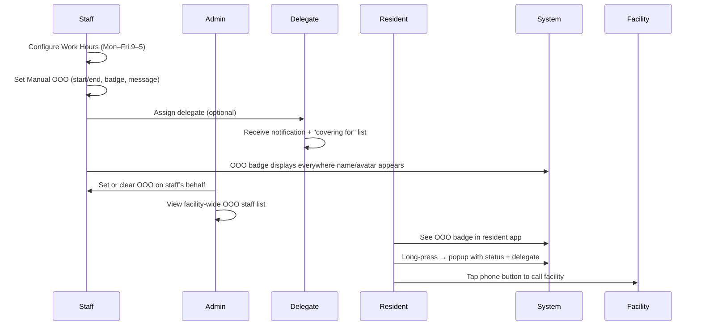
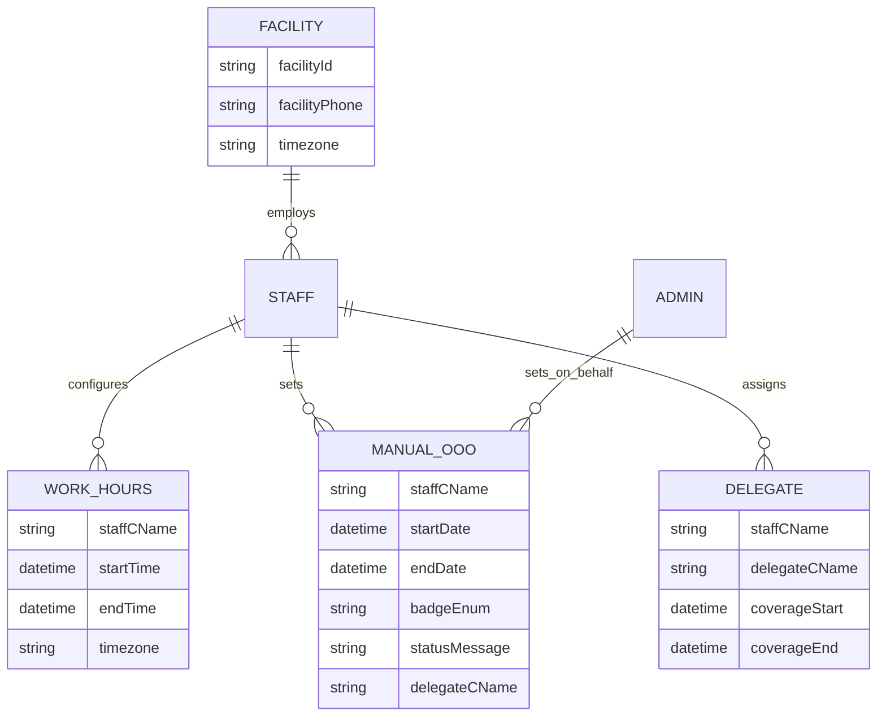

# spec.md — Out of Office (OOO)

## Feature Overview
Enable staff (including physicians) to mark themselves unavailable (after‑hours or planned leave) with a visible badge and delegate assignment. This ensures colleagues, residents, and families know who to contact, without introducing new notification channels.

## Goals
- Staff can configure recurring Work Hours.
- Automatic OOO outside Work Hours (default badge).
- Manual OOO with start/end, badge, custom message, and delegate.
- Universal badge display across staff, admin, and resident apps.
- Admins can set OOO for staff.
- Delegates notified when assigned.

## Success Criteria
- Staff adoption of OOO setup.
- Reduction in “couldn’t reach on‑call staff” incidents.

## Scope
### In Scope
- Work Hours editor (weekly recurring, Mon–Fri 9–5).
- Automatic OOO trigger outside Work Hours.
- Manual OOO trigger with badge + message.
- Delegate assignment (single staff member, informational only).
- Delegate notification + “covering for” section.
- OOO start notification at work start time (facility timezone).
- Badge display across all surfaces (staff apps, admin web, resident apps).
- Resident/family popup includes facility contact button.
- Admin OOO list + ability to set/clear OOO.

### Out of Scope
- Care‑team assignment changes.
- Resident message routing.
- Pending Sign backend contract resolution.
- Facility‑configurable badge catalog.
- Delegate chain resolution.
- Open‑ended OOO duration.
- Push/socket notifications for badge/status changes.

---

## Functional Specification
### Account / Settings
- **Work Hours editor:** Weekly recurring, Mon–Fri 9–5, Sat/Sun off.
- **Manual OOO setup:** Start/end picker, badge from fixed catalog, free‑text status.
- **Delegate picker:** Facility staff directory, single select.
- **Save:** Creates/updates records; notifies delegate if assigned.
- **Covering for section:** Read‑only list of staff currently covered.

### Badge & Popup
- **Surfaces:** Messaging lists, headers, new‑conversation picker, physician‑selection, staff tables, name/avatar.
- **Web hover:** Tooltip with status.
- **Mobile long‑press:** Popup with name, designation, Work Hours, OOO status, delegate.
- **Resident app variant:** No personal contact info; includes facility phone button.

### Admin
- **OOO staff list:** Filterable facility‑wide view.
- **Admin‑set OOO:** Same validation as self‑set; renders identically.

---

## Workflow Diagram (simplified)

---

## Data Model Diagram (ERD style)

---

## Business Rules
- **BR1:** Effective OOO = manual (if active) OR automatic (outside Work Hours). Manual takes precedence.
- **BR2:** Manual OOO requires fixed start/end; no indefinite state.
- **BR3:** Delegate assignment is informational only; no routing changes.
- **BR4:** Delegate eligibility = any staff member.
- **BR5:** No delegate chain resolution.
- **BR6:** Badge/status changes do not trigger notifications (except delegate assignment + OOO start).