# Architecture: Shashi Senior Living Platform (Overarching)

> **Doc status:** v3.1 (2026-07-03). Built on v3.0 (2026-06-21 — `staging` baseline). This revision
> reconciles the two backend/admin repos against their **production** HEADs (`465e88fb` / `59d22ea`);
> the four mobile/TV repos are unchanged. v3.0 re-verified every cross-cutting claim against staging,
> adding: chat decomposition + @mentions / reactions / soft-delete / reference-attachments; the
> `assignedStaff[]` care-team data-model refactor; Documo fax, AWS SES email, and Twilio SMS
> integrations; the Senior Living resident app's multi-tenancy fix; the staff app's three-way app-flow
> model with the Skilled Nursing module and Twilio Voice calling; HIPAA inactivity auto-logoff and
> force-update gates on the resident apps. v3.1 adds: Menu2U dining-tray integration + `cron-worker`
> container; `DiningTrayCard` (59th model); production temp-password posture correction (T-15 closed,
> BE-10 partially mitigated); new unauthenticated `pcc-patient-detail` route widening SL-TD-10;
> `DINING_TRAY_TEST_BYPASS` auth escape (SL-TD-18); CareConferenceCalendar now live in admin;
> additional resident/staff/family-member/config/IDTReport schema changes.
>
> **Delta v3.2 — 2026-07-18 (`staging`, post-production-refresh work not yet on a production HEAD).**
> Five themes landed since v3.1: **(1) Referrals re-platformed to fax** — agency delivery moved off
> AWS SES email onto a new **WestFax** integration (record-then-fax: `ReferralSentHistory` + `FaxLog`
> collections, `GET /webhooks/westfax` callback), referral status enum centralized/renamed, referral
> additional-document attachments (§2.5; referrals.md). **(2) Chat per-user Clear/Delete Conversation**
> — new `ConversationMemberState` per-member read-floor collection; `Conversation.unreadCounts` retired
> (messaging-chat.md MSG-FR-29). **(3) Transportation edit** — new-admission ("prospect") rides,
> traffic-aware distance, driver-update push, admin edit-permission + confirmation dialogs
> (transportation.md). **(4) PCC `patient.readmit` onboarding** — the full admit-style automation
> (create resident, provision Cognito, welcome-credential SMS, medication + contact sync) extended to
> `readmit`; onboarding extracted to a shared `residentOnboarding` service (clinical-records.md
> CLIN-FR-20a). **(5) User activity tracking** — new append-only `UserActivity` collection (login/
> logout/device, 180-day TTL) + latest-activity snapshot on Staff/Resident (platform-foundation.md
> PLAT-FR-71). WestFax + readmit are **staging-only**; transport/chat/user-activity reached
> **pre-production**; nothing is in **production** yet. New/notable gaps: WestFax webhook unauthenticated
> + callback hardcoded to staging (BE G-28).
> Code is the only source of truth; every non-trivial claim cites `file:line`. Half-built, mock,
> dead, or stubbed functionality is **not** described as a shipped feature — it is recorded under
> each module's Design Gaps and aggregated into the
> [Pre-Deployment Risk Register](#5-pre-deployment-risk-register). The operating rule remains "no
> missing cases" — this document is intentionally exhaustive.
>
> **Production HEADs (2026-07-03):**
> | Repo | Branch | HEAD | Notes |
> |---|---|---|---|
> | `senior_living_backend` | `production` | `465e88fb` | Menu2U integration + cron-worker; DiningTrayCard model; T-15 resolved; `sendDefaultPassword` re-added |
> | `senior_living_admin` | `production` | `59d22ea` | CareConferenceCalendar live; no other new cross-cutting changes vs staging |
> | `senior_living_reactnative` | `staging` | `97f75c4` | Unchanged — staging baseline carried forward |
> | `senior_living_staffapp` | `staging` | `d4f8169` | Unchanged — staging baseline carried forward |
> | `senior_living_tvapp` | `staging` | `696ac267` | Unchanged — identical to production HEAD |
> | `senior_living_skillednursing_resident` | `staging` | `026ea88` | Unchanged — staging baseline carried forward |
>
> **Risk-register caveat for v3.1.** The §5.1–§5.6 register was authored against production HEAD
> and refined against staging in v3.0 (§5.7). T-15 (`isDevelopmentEnv` pre-prod widening) is
> **resolved on production** (`465e88fb`). New production risks — `GET /api/residents/pcc-patient-detail`
> (unauthenticated, widens SL-TD-10) and `DINING_TRAY_TEST_BYPASS` auth escape (new SL-TD-18) — are
> noted in §5.7. Per-module register rows are maintained authoritatively in each repo's own
> architecture doc; the cross-cutting deltas are reconciled here.
>
> **v3.2 (2026-07-12) delta — cross-cutting review cycle.** Reconciled against newer HEADs on
> `senior_living_backend` (`production` @ `e075f578`), `senior_living_admin` (`production` @ `324840a`),
> `senior_living_staffapp` (`master` @ `4aa3849`, ≈`staging`), and `senior_living_reactnative`
> (`master` @ `3af3c3e`); `senior_living_skillednursing_resident` and `senior_living_tvapp` carried
> forward unchanged (the skilled-nursing pass this cycle was doc-verification-only, with one banner
> date correction — see
> [`review-senior_living_skillednursing_resident.md`](../reviews/2026-07-12/review-senior_living_skillednursing_resident.md)).
> Five cross-cutting facts newly captured here: (1) PCC `patient.admit` now fully automates resident
> onboarding — resident + Cognito account + welcome SMS + encrypted medication sync — and a **new
> unauthenticated `/pcc-sync/*` manual-sync tool** was added outside `/api` (§2.5; Critical finding
> tracked in `technical-debt.md` `SL-TD-19`); (2) chat gained a per-recipient `recipients[]`
> delivery/read model with group-quorum aggregation, plus an admin-web installable PWA with a
> `/messages`-scoped service worker and `BroadcastChannel` cross-window sync (§2.3; ADR-003 amended);
> (3) care-conference recording `transcript`/`summary` fields are now KMS-envelope encrypted, written
> by an **out-of-repo transcribe/summary Lambda that bypasses the backend API layer** (§2.5); (4) a
> facility-configured IANA timezone layer landed in the staff app (§2.7, new); (5) a doctor-gated
> digital-signature ("Pending Sign") module landed in the staff app, consuming a backend contract
> (`send-credentials`, digital-signature endpoints, `residency-details.timeZone`) not independently
> verified against `senior_living_backend` source this cycle (§2.8, new). Full per-repo detail is in
> the five 2026-07-12 review files under
> [`docs/reviews/2026-07-12/`](../reviews/2026-07-12/) and the product-wide synthesis at
> [`review-senior-living-product.md`](../reviews/2026-07-12/review-senior-living-product.md).
>
> **Updated HEADs (2026-07-12 cross-cutting pass):**
> | Repo | Branch | HEAD | Notes |
> |---|---|---|---|
> | `senior_living_backend` | `production` | `e075f578` | Chat production hardening; PCC automated onboarding rewrite; new unauthenticated `/pcc-sync/*` tool (G-26 Critical); hotel demo slideshows (G-27 Medium); care-conference recording encryption; resident phone now optional |
> | `senior_living_admin` | `production` | `324840a` | Chat installable PWA (`/messages` scope), React Query cache/socket reconciler layer, `BroadcastChannel` cross-window sync replacing `window.opener` |
> | `senior_living_staffapp` | `master` (≈`staging`) | `4aa3849` | Facility timezone layer, digital-signature "Pending Sign" module, chat reliability hardening, dead Reports tab (G11) |
> | `senior_living_reactnative` | `master` | `3af3c3e` | Small delta — cancel/reschedule added to Physical Therapy / Cognitive Evaluation / Outside Agency care appointments |
> | `senior_living_tvapp` | `staging` | `696ac267` | Unchanged — no material change this cycle |
> | `senior_living_skillednursing_resident` | `production` | `bd01f4c` | Unchanged — doc-verification pass only, one banner-date correction |

---

## 1. Overview & System Context

The Shashi Senior Living Platform is a multi-tenant facility-management and resident-care system
for assisted-living and skilled-nursing facilities. It is **one backend service plus five client
applications** — six repositories in total. All clients communicate with the single backend over
REST and (for staff, TV, and chat) Socket.io.

> **Correction vs prior docs (v2.0 and earlier):** earlier revisions of this overarching doc were
> generated covering only **five units** (`backend`, `reactnative`, `staffapp`, `tvapp`, `schema`) —
> the **admin web** (`senior_living_admin`) and the **Skilled Nursing resident** client
> (`senior_living_skillednursing_resident`) were either absent or carried only as findings. This
> revision (v2.1) promotes **both** to first-class modules, each with its own per-module architecture
> doc and a full set of severity-ranked Risk-Register rows (prefixes `ADMIN-*` and `SN-*`). The
> platform is now documented as **six repos** — one backend plus five client applications. Finding X-1
> (SN client undocumented) is **closed** — see [`architecture-senior_living_skillednursing_resident.md`](./architecture-senior_living_skillednursing_resident.md).

### 1.1 Product lines and which client serves which

The platform serves **two product lines** that share the same backend, the same MongoDB store,
the same Cognito auth, and the same `x-facility-id` tenancy model. They differ at the resident
client tier:

| Product line | Resident client | Staff client | TV client | Admin client | Notes |
|---|---|---|---|---|---|
| **Senior Living** (assisted living) | `senior_living_reactnative` | `senior_living_staffapp` | `senior_living_tvapp` | `senior_living_admin` | Wellness/lifestyle focus: services, dining, transport, activities |
| **Skilled Nursing** | `senior_living_skillednursing_resident` (app name **SkilledNursing**, bundle `com.shashigroup.sl.resident`) | `senior_living_staffapp` (shared) | `senior_living_tvapp` (shared) | `senior_living_admin` (shared) | Clinical focus: adds Rehab, Test Results, Brain Games, Cognitive Evaluation, Outside Agency to the Health surface |

The Skilled Nursing resident app is the **clinical-care variant** of the resident experience. It
targets the **same backend** (`https://api.sal.shashitech.com`, production default —
`senior_living_skillednursing_resident/src/utils/local.constants.ts:18,30`) and **correctly injects
`x-facility-id`** from local storage on every request
(`senior_living_skillednursing_resident/src/services/Api/index.tsx:87-89`). It connects to the
backend `/chat` Socket.io namespace
(`senior_living_skillednursing_resident/src/services/ChatSocket/index.ts:37`).

> **Staging update — the two resident apps have largely converged on tenancy; one base-URL gap
> remains:**
>
> - **`x-facility-id` — now both inject it (RN-1 RESOLVED on staging).** The Senior Living resident
>   app now injects `x-facility-id` from the `FACILITY_ID` AsyncStorage key in its Axios request
>   interceptor (`senior_living_reactnative/src/services/Api/index.tsx:86-90`), populated after the
>   Home screen reads `GET /api/config/residency-details`
>   (`senior_living_reactnative/src/screens/App/HomeScreen/index.tsx:765-766`). This closes the prior
>   Blocker RN-1. Residual: the header is best-effort — set only after Home loads. The Skilled Nursing
>   app continues to inject it (`.../skillednursing.../src/services/Api/index.tsx:87-89`) and still has
>   the connect-time socket race where the header is omitted on the first session before `HomeScreen`
>   writes `FACILITY_ID` (Risk Register SN-3, still open).
> - **Base-URL divergence (RN-2 partially open on staging).** The SN app's production/pre-prod default
>   targets the **correct** Senior Living backend `https://api.sal.shashitech.com`
>   (`.../skillednursing.../src/utils/local.constants.ts:18,30`). The Senior Living resident app's
>   default env changed `STAGING → PRE_PRODUCTION` and its PRE_PRODUCTION URL was corrected to
>   `preproduction-api.sal.shashitech.com`, but its **PRODUCTION** `API_BASE_URL` **still** points at
>   the **Shashi Hotels** backend (`api.hospitality.andmv.com`), not Senior Living — the production
>   environment still calls the wrong service (Risk Register RN-2, downgraded to "partially open").
>
> Net: tenant-isolation parity between the two resident apps is now achieved; the remaining cross-app
> divergence is the RN production base URL. Confirm before deploy which resident app(s) are in scope
> and fix the RN production URL.

### 1.2 Repo roles

| Repo | Type | Role |
|---|---|---|
| `senior_living_backend` | Node.js / Express 5 (TypeScript) | The only server. Residents, staff, admin, appointments (salon / massage / private-training / case-manager), meals & dining, transportation, housekeeping, activities, care conferences, IDT reports, **chat (now decomposed into `controllers/chat/` (10 files) + `services/chat/{conversation,message}/` sub-packages, with @mentions / emoji reactions / soft-delete / S3-reference attachments / soft group membership)**, notifications, Google Calendar sync, Zoom care conferences, PCC (PointClickCare) EHR + medication + **contact** sync, Lemedix lab integration, TELS work-order webhooks, AWS Cognito user provisioning, custom OTP password reset, S3 file storage, PDF report generation (Puppeteer + `@cantoo/pdf-lib` for password-protected referral PDFs). **New staging integrations: Documo (outbound fax), AWS SES (email with PDF attachments — referral flow), Twilio (transactional SMS).** Care-team data model refactored from five per-role resident fields to a single indexed `assignedStaff: string[]`. Port `7000`. |
| `senior_living_admin` | React **18** runtime + Vite (TypeScript) | Admin/staff web dashboard. Resident & staff CRUD, services config, dining, transport, housekeeping, therapy, dashboards, chat (Socket.io `/chat` + W3C Web Push). **Note:** `package.json` declares `react: ^18.2.0` (runtime) but `@types/react: ^19.2.5`; both CLAUDE.md files mislabel it "React 19" — see register row ADMIN-D11. |
| `senior_living_reactnative` | React Native 0.82 (TypeScript) | **Senior Living** resident mobile app. Home, services, schedule, health, announcements, appointments. **Staging: now injects `x-facility-id`; Salon / Massage / Private-Training booking, the Health care flows (Physical Therapy, Cognitive Evaluation, Outside Agency), MySchedule/Activities, Notifications, Resident Directory, and Upcoming Appointments are now API-backed (were mock at production HEAD); foreground FCM rendering via `@notifee/react-native`; TV-pairing QR via `react-native-camera-kit`; ProfileScreen rebuilt Redux-backed.** |
| `senior_living_staffapp` | React Native 0.84 (TypeScript) | Staff mobile app (both product lines). **Staging: a three-way app-flow model (`src/utils/featureAccess.ts`) resolves a staff designation to MIGRATED (Skilled Nursing), LEGACY (designation task queue), or CHAT_HOME.** Role-based "designation views" driven by `FacilityDesignation` (now 20 values); real-time task updates via the default Socket.io namespace **plus a new `/chat` namespace**. New ~45-screen **Skilled Nursing module** (care conferences with native audio recording, reports, residents, services, chat). **Twilio Programmable Voice** outbound resident calling. Auth migrated from email to phone-number + password; Cognito IDs and auth tokens moved out of source into `react-native-config` / `react-native-keychain`; 24 h inactivity logout. |
| `senior_living_tvapp` | Android / Kotlin (Jetpack Compose, Android TV) | In-room TV client (both product lines). Entertainment (live TV, music), dining, schedules, services, QR pairing to a resident. |
| `senior_living_skillednursing_resident` | React Native 0.84 (TypeScript) | **Skilled Nursing** resident mobile app. Same shape as the Senior Living app plus a clinical Health surface (Rehab, Test Results, Brain Games, Cognitive Evaluation, Outside Agency). **Staging: a resident Care Conference module, a HIPAA inactivity auto-logoff (`SessionGuard` — but `IDLE_TIMEOUT` is set to 7 days, neutralising the control, new HIGH), a force/optional app-update gate, resident acknowledgment and discharge gates, in-app Terms/Privacy WebView, app-wide font scaling, and a custom-OTP forgot-password flow (moved OFF Cognito to `POST /api/auth/{forgot,reset}-password`). The Message bottom-tab is commented out.** |

---

## 2. Cross-Cutting Architecture

### 2.1 Multi-tenancy (`facilityId`)

Tenancy is keyed by **`facilityId`**, carried on every request in the `x-facility-id` HTTP header
(alternate header `facilityid` also accepted). `facilityMiddleware` reads the header into
`req.facilityId`; query helpers (`getFacilityFilter`) inject `{ facilityId }` into Mongo queries.

**This is the single most fragile area for the deploy.** The DB-level tenant key is `required:false`
on most models (`senior_living_backend/src/models/resident.model.ts:98`,
`Staff.model.ts:178`, +30 others), so tenant isolation rests entirely on application query
discipline with no database-enforced floor. Two compounding Blocker-class defects exist on
production HEAD:

- **The facility guard never fires for a missing header.** `facilityId` is typed `string|undefined`;
  the header loop leaves it `undefined` when no header is sent, and the guard only checks
  `facilityId === null || facilityId === ''` — which is `false` for `undefined` — so `next()` runs
  with `req.facilityId === undefined`
  (`senior_living_backend/src/middleware/facilityMiddleware.ts:32,41,47`). The correct form already
  exists in `requireFacilityId` at `:70`. **Verified on HEAD.**
- **Empty filter ⇒ cross-tenant query.** When `facilityId` is absent, `getFacilityFilter` returns
  `{}` (`senior_living_backend/src/lib/facility.ts:51-54`), turning
  `Model.find({ ...getFacilityFilter(req) })` into an **all-facility** read/write. Combined with the
  guard gap, **any request omitting `x-facility-id` reads or writes across all tenants.** **Verified
  on HEAD.**

Client-side, tenancy parity has improved on staging: **both** resident apps now inject the header —
the Skilled Nursing app at `.../skillednursing.../src/services/Api/index.tsx:87-89`, and the Senior
Living resident app now at `senior_living_reactnative/src/services/Api/index.tsx:86-90` (RN-1
resolved). The staff app and admin web inject it as before. The remaining tenancy risk is therefore
**server-side** (BE-1/BE-2, both still present on staging HEAD `62de4747` —
`facilityMiddleware.ts:41` still checks only `=== null || === ''`, letting `undefined` through) plus
the SN socket first-connect race (SN-3). Note also a **new** staging escape hatch: the Documo fax
routes mount **before** the global `facilityMiddleware` (`app.ts:103` vs `:104`) and can bypass the
facility + auth guards entirely when `FAX_LOCAL_BYPASS=true`, with no production fail-closed (new
gap G-23 — see §5.7).

### 2.2 Identity & Auth

Three distinct identity mechanisms coexist:

- **AWS Cognito (JWT)** — web (`senior_living_admin`), and both resident mobile apps + the staff app.
  `USER_PASSWORD_AUTH` with optional TOTP/SMS MFA. **Staging: the staff app's sign-in changed from
  email to phone-number (E.164) + password, and its standalone MFA-enrollment screens were removed —
  it now only verifies an MFA challenge when the pool issues one.** Backend verifies JWTs against
  Cognito JWKS (`senior_living_backend/src/lib/jwksClient.ts` — 10 h JWKS cache; kid-miss does not
  force refresh). `authMiddleware` is the protective gate. **Multiple write/PII routes ship without
  it** — see RN/auth Blockers in §5 (residents, staff, admin, menu, zoom, test-notifications), plus
  the new unauthenticated `GET /api/residents/pcc-contacts` (§5.7).
- **Custom OTP password reset** — phone → OTP (delivered via **AWS SNS** SMS) → new password. Backend
  layer distinct from Cognito-native reset (ADR-002). The admin "staff" forgot-password hooks
  currently call the **phone-keyed resident** OTP endpoints, not `/api/auth/staff/*`
  (admin doc §Auth & session resilience). **Staging: the staff app and the Skilled Nursing resident
  app both moved their forgot/reset-password flow OFF Cognito onto this backend custom-OTP API
  (`POST /api/auth/forgot-password`, `POST /api/auth/reset-password`); the admin staff
  forgot-password now also verifies the OTP via `POST /auth/verify-otp` as a distinct step.**
- **Custom TV tokens** — TV devices have no Cognito user. They pair to a resident via a Socket.io QR
  flow (`/tv` namespace) and receive a custom backend-issued token thereafter
  (`senior_living_backend/src/socket/tvPairing.handler.ts`). The `/tv` namespace currently accepts
  connections and `pairing:create` with only a handshake-supplied facility id and no connection auth
  (Risk Register BE-11).

Default temp passwords — **resolved on production HEAD `465e88fb` (BE-10 partially mitigated, T-15 closed).**
`sendDefaultPassword` was **re-added** to `Config` (Boolean, `default: false`). Facilities that opt in
(`sendDefaultPassword=true`) receive the fixed `Test@123`; all others receive a cryptographically
random `XXXX-XXXX` password (unambiguous charset, Cognito policy guaranteed). `isDevelopmentEnv()`
now returns `env === 'local_development'` **only** — pre-production no longer triggers the static
literal (T-15 resolved, `senior_living_backend/src/lib/common.ts:12`). Two lookup helpers resolve
the flag: `getSendDefaultPasswordFlag(req)` (facility-header path) and
`getSendDefaultPasswordFlagByFacilityId(facilityId)` (public-auth path where the header is absent).

### 2.3 Real-time (Socket.io)

A single Socket.io server runs inside the backend process with multiple namespaces:

- **default** — TV pairing (`pairing:create` / exchange) and announcement broadcasts.
- **`/chat`** — staff/admin/resident chat. Consumed by `senior_living_admin`
  (a **two-tier callback registry** on staging — `registerGlobalChatCallbacks` for session-wide
  toasts+badge and `registerChatCallbacks` for the Messages page), both resident apps, and **now the
  staff app** (staging adds a process-wide `chatSocketService` singleton driven by
  `useChatSocketLifecycle`; events `chat:new`/`unread`/`status`/`reaction` in, `chat:delivered`/`read`
  out — previously the staff app used only the default per-designation namespace).
  **2026-07-12 delta — per-recipient delivery/read model + admin PWA.** `Message.recipients[]`
  (per-recipient delivery/read state) now backs a monotonic status ratchet
  (`earlierMessageStatuses()`, prevents concurrent-ack regressions) and group delivery/read **quorum**
  computed against `recipients ∩ current participants` — departed group members stop blocking old
  messages (`senior_living_backend/src/services/chat/message/status.service.ts`,
  `src/models/Message.model.ts`). `senior_living_admin` is now an **installable PWA scoped to
  `/messages` only** (`vite-plugin-pwa`, `injectManifest`, final app name "Shashi Messaging") —
  Web Push/SW registration only happens once a staff/admin user opens the Messages window (new Medium
  design gap, admin per-repo doc). Cross-window sync (Messages↔Main) moved from `window.opener` to a
  same-origin `BroadcastChannel` (`sal-chat-window-sync`) to cover installed-PWA launches, hand-typed
  `/messages` URLs, and independent admin tabs (`senior_living_admin/src/services/chatWindowMessages.ts`)
  — see ADR-003 (amended) and
  [`review-senior_living_admin.md`](../reviews/2026-07-12/review-senior_living_admin.md).
- **`/notifications`** — per-user notification rooms.

**Single-instance caveat (architecturally load-bearing, ADR-003).** Presence, the TV-pairing TTL
timers (`pairingExpiryTimers`), and the chat data-key cache (`chatKeyCache`) are **in-process,
per-instance** (`senior_living_backend/src/socket/tvPairing.handler.ts`,
`src/services/chat/chatKeyCache.ts`). On staging `chatKeyCache` now runs an **active sweep
`setInterval`** that proactively zeroizes expired keys (`chatKeyCache.ts:33-45`, `unref()`-ed) —
resolving the prior lazy-eviction debt BE-D8 — but the cache is still per-instance, so the
single-instance constraint below is unchanged. The platform is correct **only as a single
instance**:

- Horizontal scaling breaks presence, breaks TV pairing if `create` and `exchange` land on different
  pods, and multiplies chat-key KMS unwraps across pods.
- Cron jobs (notification, appointment-completion, announcement, care-conference enable/review) start
  in **every** instance with no distributed lock (`senior_living_backend/src/server.ts:75-81`). Only
  notifications dedupe (unique index `{scheduleId, offsetMinutes}`); the others **double-execute**
  under multi-pod. **Verified on HEAD.**

### 2.4 Notification Platform

Multi-channel, with an explicit dual-channel chat model:

- **Firebase FCM** — push to resident and staff mobile apps. Chat push is **offline-recipients only**
  (the socket covers online users; FCM fills the offline window) — ADR-003.
- **W3C Web Push (VAPID)** — browser chat notifications for `senior_living_admin`. Fires to **all**
  recipients (to cover the socket-disconnect window), with a three-layer client-side dedupe contract
  (SW skips if a tab is visible; in-page handler bails on `document.hidden`; focus dismisses tagged OS
  notifications). Requires `VITE_VAPID_PUBLIC_KEY` (admin doc §Messaging).
- **Care-team fan-out** — notifications fan out to a resident's **assigned care team** (per-user
  `/notifications` rooms + FCM/Web Push).
- **AWS SNS** — SMS, used by the custom OTP password-reset flow (ADR-002).

Client-side delivery improved on staging but remains **incompletely wired** and must still be treated
as a deploy risk:
- The Senior Living resident app now wires **foreground** FCM rendering — `App.tsx` registers
  `setupForegroundNotificationListener`, which renders `messaging().onMessage` payloads via the new
  `@notifee/react-native` dependency (RN-5 partially resolved). Background/terminated **tap** routing
  is still missing (RN/DG-04 partial).
- The Skilled Nursing app still registers **no** background FCM handler — `index.js` contains only
  `AppRegistry.registerComponent` with no `messaging().setBackgroundMessageHandler()` (verified absent
  on staging HEAD `026ea88`), so backgrounded/killed care-team messages and appointment reminders are
  silently dropped (SN-1, still a Blocker), and there is no `onTokenRefresh` (SN-10).
- The staff app's FCM background handler is no longer a strict no-op (it now logs) but data-only
  background pushes are still not surfaced (SA-3, downgraded High→Medium), and token rotation is still
  unhandled (SA-7).

### 2.5 Integrations (external systems)

| System | Direction | Purpose | Production caveat |
|---|---|---|---|
| **PointClickCare (PCC)** | inbound webhooks + outbound pulls | Patient-lifecycle + medication sync; convergent-state (ADR-001). **Staging: webhook registry grew 12→14 handlers — added `patient.admit` and `patient.updateContactInfo`, which now sync resident **and** `familyMember` contact data; plus a new on-demand `GET /api/residents/pcc-contacts` contact fetch.** **2026-07-12: `patient.admit`/`patient.updateResidentInfo` rewritten to fully automate resident onboarding** — resolves facility by `orgUuid`, creates the `Resident` doc, provisions a Cognito account (`suppressInvite:true`), sends a custom welcome SMS, and fetches+encrypts+upserts PCC medications; the same Cognito-provisioning + medication re-migration now also fires on `patient.updateResidentInfo` when a phone is added/changed on an existing resident. | Webhook has **no auth / no signature verification** — forged PHI mutations possible (BE-5, Blocker), now extended to the familyMember write surface (G-5 widened) and, as of 2026-07-12, to Cognito account creation + welcome SMS + medication sync via the same unverified `patient.admit` path. No retry/DLQ (BE-15). OAuth `clientSecret`/`token` stored **plaintext** in Mongo (D2, Blocker). PHI snapshots appended unbounded to `Resident.pcc_patient_details` (D3). `GET /api/residents/pcc-contacts` is UNAUTHENTICATED (G-3 widened — see §5.7). **New (2026-07-12): an unauthenticated manual-sync tool `POST /pcc-sync/residents[/map]` (`senior_living_backend/src/controllers/pccSync.controller.ts`) is mounted outside `/api` — bypasses both `facilityMiddleware` and any auth — and accepts an arbitrary `facilityId` in the request body. Critical finding; see `technical-debt.md` `SL-TD-19`.** |
| **Lemedix** | inbound webhooks | Lab patient / lab report ingestion | **No signature verification** (BE-6). Lab PHI stored **unencrypted** (T4). |
| **TELS** | inbound webhooks | Facility work orders | Auth **skipped** (open) when `TELS_WEBHOOK_SECRET` is unset (BE-7). |
| **Zoom** | per-staff OAuth | Care-conference meeting provisioning + recordings/transcripts | Webhook signature **conditionally skipped** when any header is absent (BE-6b). Meeting create / unlink endpoints lack auth (BE-9). Staff `zoomRefreshToken` stored plaintext (T3). |
| **Care-conference transcribe/summary Lambda** *(new, out-of-repo, 2026-07-12)* | inbound — direct MongoDB write, bypasses backend API | An AWS Lambda **outside `senior_living_backend`** (referenced in code comments as `SAL_*_SUMMARY_PROVIDER`) writes KMS-envelope-encrypted `transcript`/`summary`/`updatedSummary` directly into `CareConference.recordings[]`. | **No shared type/schema contract** — any other reader/writer must independently reconstruct the same KMS encryption context (`{facilityId, careConferenceId, model:'CareConference', field}`). Name, IAM role, deployment location, and retry/failure semantics are not visible from this repo — recommend a first-class external-dependency writeup once the Lambda's owning team is identified. |
| **Google Calendar** | per-staff OAuth + push channels | Staff calendar sync for appointment slot availability | Channel-expiry **unmonitored**; silent renewal failure stops sync (BE-18). Staff `googleRefreshToken` stored plaintext (T3). |
| **AWS Cognito** | outbound | User auth, MFA, provisioning | See §2.2. |
| **Documo** | outbound HTTP | Fax send + account/history (`src/integrations/documo/`, `POST /api/fax/send`, `GET /api/fax/account`, `POST /api/fax/history`) | **NEW on staging.** Basic auth, base `https://api.documo.com`, env-gated on `DOCUMO_API_KEY`. Routes mount **before** the global facility gate and per-route guards are bypassable via `FAX_LOCAL_BYPASS=true` with no production fail-closed (G-23, High). No send retry/idempotency; per-facility credential isolation unverified (G-24). |
| **AWS SES** | outbound | Transactional email with PDF attachments (`@aws-sdk/client-ses`, `SendRawEmailCommand`). | **NEW on staging (v1.2).** The referral-email path (`POST /api/referrals/send-referrals-emails`) is **superseded by WestFax fax** as of the 2026-07 refresh; SES remains the platform email transport for other flows. |
| **WestFax** | outbound HTTP + inbound webhook | **Referral agency delivery by fax** — the as-built referral-send channel. `POST /api/fax/westfax/send { referenceId }` background-dispatches each `ReferralSentHistory` document to each agency `faxNumber`; per-fax `FaxLog`; `GET /webhooks/westfax` status callback. Per-facility creds from `IntegrationAvailable(name:'westfax')`. (`src/integrations/westfax/`) | **NEW on staging (2026-07).** Replaces referral email. **Webhook is unauthenticated + callback URL hardcoded to staging (G-28, High)** — staging-only until fixed. |
| **Twilio** | outbound | Transactional SMS (`sendSms` in `src/services/sms.service.ts`); **Programmable Voice** outbound resident calling from the staff app | **NEW on staging** (`twilio 6.0.2`), env-gated on `TWILIO_ACCOUNT_SID`/`AUTH_TOKEN`/`FROM_NUMBER`. AWS SNS is retained for the reset-OTP `sendOtpSms`. Voice token minted from `TWILIO_FUNCTIONS_URL/token.js` — confirm the mint function requires backend auth (staff app G10). |
| **Menu2U (menu2plus)** | outbound Puppeteer scrape | Dining tray-card ingestion — headless Chromium scrapes `menu2plus.com`; result written to the `DiningTrayCard` MongoDB collection (59th model, `src/models/diningTrayCard.model.ts`). Deployed as a **separate `cron-worker` container** from the same Docker image (`src/cron-worker.ts`; `command: ["node", "dist/cron-worker.js"]`) to prevent Chromium competing with the REST API for memory/CPU. Cron runs daily (default `0 5 * * *`); env-gated on `DINING_TRAY_SOURCES` (JSON array of per-facility source configs with `facilityId`, `scraper`, `url`, or `filePath`). REST surface: `POST /api/dining-tray/ingest` (manual push) + `GET /api/dining-tray/menu` (resident view) + `GET /api/dining-tray/residents-menu` (admin/staff). | **NEW on production HEAD `465e88fb`.** `GET /api/dining-tray/menu` auth is bypassable when `DINING_TRAY_TEST_BYPASS=true` and `residentId` query present — no `NODE_ENV=production` fail-closed (same pattern as G-23 `FAX_LOCAL_BYPASS`; new debt SL-TD-18). Source feed ships empty `resident_id` so resident matching is fuzzy (room → room+name → name fallback). Scrape reliability depends on `menu2plus.com` DOM stability. |
| **AWS SNS** | outbound | OTP SMS | — |
| **AWS S3** | outbound | Profile pictures, documents | — |
| **AWS Secrets Manager** | outbound (startup) | `Senior_Assisted_Living` (us-west-1) | Secrets cache **never refreshes**; rotation needs a restart (BE-17). |
| **AWS KMS** | outbound | Envelope encryption for medication / chat / rehab PHI | **Three divergent envelope schemes** coexist (T6); coverage is uneven (legacy medication fields, lab PHI, OAuth tokens all plaintext — T2/T3/T4). |
| **Firebase** | outbound | FCM, Crashlytics, Analytics | Config files committed to repo on staff/SN/TV apps (SA-1, X-2, secret exposure). |

### 2.6 Data

Single MongoDB store (Mongoose 9), facility-scoped at the application layer. Full model-by-model
detail, index list, encryption schemes, and 18 design gaps + 10 debt items are in
[`data-schema.md`](./data-schema.md). The deploy-critical data facts are surfaced in §5
(plaintext PCC/OAuth/lab credentials, optional tenant key, unbounded PHI array, un-scoped gallery).

**Material staging schema changes (cross-cutting — full detail in the per-repo docs):**
- **Care-team refactor.** A resident's five legacy per-role fields (`nurse`/`caseManager`/
  `socialWorker`/`doctor`/`dietitian`) are replaced by a single indexed `assignedStaff: string[]`
  (staff `cName` array) plus an `assignedStaffDocs` populate virtual. New helpers
  `src/lib/assignedStaff.ts` (queries) and `src/utils/assignedStaff.ts` (`notifyAssignedStaff`) drive
  the notification care-team filter. The consolidation is performed by a **one-time manual migration
  script** `src/scripts/migrateAssignedStaff.ts` that is **not wired into CI/CD or boot** — a missed
  run silently empties care-team filters (new T-14, Medium). The admin web and both resident/staff
  clients consume `assignedStaff[]` (admin via the new shared `ui/StaffMultiSelect.tsx`).
- **Chat model additions.** `Message` gained `mentions[]` (indexed mentions-inbox query),
  `reactions[]`, a `deletedAt` soft-delete tombstone, and S3-reference attachment fields
  (`isReference`/`sourceModel`/`sourceModelAttachmentId`, never S3-deleted by chat). `Conversation`
  gained denormalized `mediaAttachmentCount`/`fileAttachmentCount`, soft group membership
  (`exitedMembers[]` with frozen counts), and a structured `lastMessage` snapshot. New indexes
  `{conversationId,deletedAt}` and `{'mentions.cName',facilityId,createdAt}`.
- **`familyMember`** gained `phone`/`pcc_contactId`/`pcc_is_guarantor` with a unique-sparse
  `{residentId,countryCode,phone}` index (PCC contact-sync). Other additions: `Admin`/`Staff`
  `isTermsAccepted(+At)`; `CareConference` `pstnPassword`/`dialInNumbers[]` (PAC phone conference);
  `Agency.faxNumber`; `Referral.assignedPhysician` + typed `ReferralStatus`; `IDTReport.pdfUrl`;
  `announcement.startTime/endTime`. The `config.sendDefaultPassword` flag was removed on staging but **re-added on production HEAD** — see production additions below.

**Production schema additions (backend `465e88fb`, cross-cutting — full detail in `data-schema.md`):**
- **Resident.** `admissionDate: String` added as **required** (`YYYY-MM-DD`). `emergencyContact` /
  `emergencyContactCountryCode` **removed** from both TypeScript interface and Mongoose schema.
- **FamilyMember.** `isAuthorizedAppAccess: Boolean` (default `false`) — gates whether a Cognito
  user is created for this family member on registration.
- **Staff.** `acknowledgement` / `acknowledgedAt` fields **removed** from both interface and schema.
- **Config.** Facility-identity fields added: `facilityName`, `facilityLicenseNumber`,
  `facilityAddress`, `facilityPhone`, `facilityFax`, `facilityEmail`, `facilityType` (all String,
  trimmed). `staffAssignmentRequirements` (Mixed, default `undefined`) added. `sendDefaultPassword`
  (Boolean, default `false`) **re-added** — see §2.2 for the temp-password posture.
- **IDTReport.attendingMD.** Changed from `ObjectId→Staff` to **`String`** (free-text attending
  physician name).
- **CareConference.** `smsSentOneDayBefore` (Boolean, default `false`) and
  `smsSentOneHourBefore` (Boolean, default `false`) added — idempotency guards preventing duplicate
  SMS reminders from the care-conference reminder cron.
- **TransportationRequest.** `isOutsideAgency` (Boolean, default `false`) and `driverName` (String,
  trimmed) added for outside-agency driver support. `createdByType` enum extended to include `ADMIN`.
  `toJSON` transform injects a synthetic `driver: { name: driverName ?? 'Outside Agency' }` when
  `isOutsideAgency=true`.
- **Conversation.lastMessage.** `deleted?: boolean` (tombstone) added to `UserConversationLastMessage`
  so the inbox can render "message was deleted" without fetching the full message.
- **NEW: DiningTrayCard collection** (`diningtraycard`) — 59th Mongoose model. One document per
  facility per calendar day (upsert). Holds an embedded array of `TrayCardResident` entries with
  per-meal cards, fuzzy resident match results (`residentId`, `cName`, `matchedBy`), and source
  metadata. See `data-schema.md §2.59` for full schema.

**2026-07-12 schema additions (cross-cutting — full detail in the per-repo docs and `data-schema.md`):**
- **`Message.recipients: string[]`** (new, internal-only) plus 2 new indexes — backs the per-recipient
  delivery/read/quorum model in §2.3. (`senior_living_backend/src/models/Message.model.ts`)
- **`Resident.phone`/`countryCode`** are now **optional** (were required); new `isSynced`/
  `pccSyncStatus` fields track PCC linkage state, shared by the automated onboarding webhook and the
  new manual `/pcc-sync` tool (§2.5). A resident can now exist with no phone and hence no Cognito
  account. (`senior_living_backend/src/models/resident.model.ts`)
- **`CareConference.recordings[].transcript`/`summary`/`updatedSummary`** are now KMS-envelope
  encrypted (previously plaintext) — see the external-Lambda-writer note in §2.5.
- **New `HotelDemoSlideshow` collection** (60th Mongoose model) — facility-scoped, config-gated
  (`Config.showSlideShowModal`) CRUD for a hidden sales/demo slideshow (image/video/audio/PDF slides).
  Uploader has **no file-size cap** (`s3UploadUnlimited`) — Medium finding, see `technical-debt.md`
  `SL-TD-20`.
- **`Config.timeZone`** (pre-existing field, `default: 'America/Los_Angeles'`) is now actively
  consumed by `senior_living_staffapp` as an IANA timezone via a new client-side layer — see §2.7. No
  backend schema change; documenting the new consumer because it makes the field load-bearing for
  client-side date/time correctness for the first time.
- **Likely new backend model — digital-signature / "pending sign" documents.** `senior_living_staffapp`
  ships a doctor-gated "Pending Sign" module against a `POST /api/auth/send-credentials` endpoint and
  unnamed digital-signature list/detail endpoints (§2.8). **Not independently verified against
  `senior_living_backend` source this cycle** — flagged as an inferred schema surface pending a
  backend-side confirmation pass.

### 2.7 Facility timezone layer (new, 2026-07-12)

`senior_living_staffapp` added a facility-configured **IANA timezone** layer: `src/utils/timezone.ts`
(backed by `@date-fns/tz`), consuming `Config.timeZone` via `GET /api/config/residency-details`
(`residency-details.timeZone`), cached to a new `APP_TIME_ZONE` AsyncStorage key. iOS carries a
FormatJS force-polyfill for `Intl.DateTimeFormat` to work around a documented Hermes bug
(`facebook/hermes` #1100/#1172) that `@date-fns/tz`'s offset computation depends on; Android is an
intentional no-op (native ICU is already correct). This is the first client to treat the pre-existing
`Config.timeZone` field as load-bearing for date/time correctness rather than a display-only value.
Whether `senior_living_admin` and the two resident apps render appointment/schedule times in the same
facility timezone or in device-local time was **not verified this cycle** — open question for the
next cross-repo pass. See
[`review-senior_living_staffapp.md`](../reviews/2026-07-12/review-senior_living_staffapp.md).

### 2.8 Digital signature / "Pending Sign" module (new, 2026-07-12)

`senior_living_staffapp` added a doctor-gated digital-signature surface — `PendingSignScreen`,
`PendingSignDetailScreen`, `SignedPdfPreviewScreen` — generating multi-signature-per-page signed PDFs
client-side (`jspdf`/`pdf-lib`). For doctor-designation staff (`isDoctorDesignation()`), this
**replaces** the My Schedule tab in the MIGRATED tab bar. The module consumes a backend contract not
previously documented anywhere in this platform doc: `POST /api/auth/send-credentials` (a
lighter-weight credential-resend path alongside the existing OTP reset) and unnamed digital-signature
list/detail endpoints. **Caveat:** none of this backend contract was independently verified against
`senior_living_backend` source this cycle (out of scope for that repo's 2026-07-11 review window) —
treat the endpoint shapes above as client-inferred, not backend-confirmed, until the next backend doc
pass. No audit/compliance requirement for these legally-relevant signed documents has been confirmed
on the backend side either. See
[`review-senior_living_staffapp.md`](../reviews/2026-07-12/review-senior_living_staffapp.md).

---

## 3. System Architecture Diagram

```mermaid
flowchart TB
    subgraph Users["Users & Devices"]
        SLRes["Senior Living Residents"]
        SNRes["Skilled Nursing Residents"]
        Staff["Facility Staff"]
        Admin["Facility Admins / Staff (web)"]
        TVDev["In-room TV Devices"]
    end

    subgraph Clients["Client Applications (5 repos)"]
        RN["senior_living_reactnative<br/>RN 0.82 — Senior Living resident<br/>(Cognito; injects x-facility-id — RN-1 resolved;<br/>PRODUCTION URL still → Shashi Hotels backend — RN-2)"]
        SN["senior_living_skillednursing_resident<br/>RN 0.84 — Skilled Nursing resident<br/>(Cognito + custom-OTP reset; injects x-facility-id;<br/>prod URL → api.sal.shashitech.com;<br/>no bg FCM handler — SN-1)"]
        SA["senior_living_staffapp<br/>RN 0.84 — staff (both lines)<br/>(phone+password Cognito; default + /chat Socket.io;<br/>Twilio Voice; three-way app-flow + Skilled Nursing module)"]
        TV["senior_living_tvapp<br/>Kotlin/Compose — TV (both lines)<br/>(custom TV token via QR pairing;<br/>unchanged prod→staging)"]
        WEB["senior_living_admin<br/>React 18 runtime + Vite — admin/chat<br/>(Cognito; client secret in bundle — ADMIN-1;<br/>Web Push; /chat two-tier callbacks)"]
    end

    subgraph Backend["senior_living_backend (Node/Express 5 TS, port 7000)"]
        REST["REST API"]
        SIO["Socket.io<br/>default(/tv pairing,announce)<br/>/chat • /notifications<br/>(single-instance presence)"]
        CRON["node-cron jobs<br/>(no distributed lock)"]
        PDF["Puppeteer PDF render"]
    end

    subgraph AWS["AWS"]
        COG["Cognito (auth + MFA)"]
        SNS["SNS (OTP SMS)"]
        S3["S3 (files)"]
        SM["Secrets Manager<br/>Senior_Assisted_Living"]
        KMS["KMS (PHI envelope)"]
        MONGO[("MongoDB<br/>facility-scoped")]
    end

    subgraph External["External Integrations"]
        PCC["PointClickCare EHR<br/>(webhooks + pulls + contact sync)"]
        LEMEDIX["Lemedix (labs)"]
        TELS["TELS (work orders)"]
        ZOOM["Zoom (care conf)"]
        GCAL["Google Calendar"]
        FB["Firebase<br/>FCM + Crashlytics"]
        DOCUMO["Documo (fax) — NEW"]
        SES["AWS SES (email) — NEW"]
        TWILIO["Twilio (SMS + Voice) — NEW"]
    end

    SLRes --> RN
    SNRes --> SN
    Staff --> SA
    Admin --> WEB
    TVDev --> TV

    RN -->|REST| REST
    SN -->|REST| REST
    SA -->|REST + Socket.io| REST
    SA --> SIO
    TV -->|REST + Socket.io| SIO
    WEB -->|REST + /chat + Web Push| REST
    WEB --> SIO

    RN --> COG
    SN --> COG
    SA --> COG
    WEB --> COG
    RN --> FB
    SN --> FB
    SA --> FB
    TV --> FB

    REST --> PDF
    REST --> MONGO
    SIO --> MONGO
    CRON --> MONGO
    REST --> COG
    REST --> SNS
    REST --> S3
    REST --> SM
    REST --> KMS
    REST -->|webhooks in / pulls out| PCC
    REST -->|webhooks in| LEMEDIX
    REST -->|webhooks in| TELS
    REST -->|OAuth| ZOOM
    REST -->|OAuth + push channels| GCAL
    REST -->|push| FB
    REST -->|fax send/account/history| DOCUMO
    REST -->|email + PDF attach| SES
    REST -->|SMS| TWILIO
    SA -->|Voice token + outbound call| TWILIO

    style Clients fill:#e8f5e9,stroke:#2e7d32
    style Backend fill:#c8e6c9,stroke:#2e7d32
    style AWS fill:#fff3e0,stroke:#e65100
    style External fill:#fce4ec,stroke:#c62828
    style Users fill:#f3e5f5,stroke:#6a1b9a
```

---

## 4. Module Index

| Document | Scope (one line) |
|---|---|
| [`architecture-senior_living_backend.md`](./architecture-senior_living_backend.md) | Node/Express 5 backend — REST, Socket.io, crons, integrations (PCC/Lemedix/TELS/Zoom/GCal + **Documo/SES/Twilio**), Cognito, S3, KMS, PDF. **Staging: chat decomposed, `assignedStaff[]` care-team refactor, PCC contact-sync.** **2026-07-12: PCC automated resident-onboarding rewrite (§2.5); new unauthenticated `/pcc-sync/*` tool (Critical); chat `recipients[]`/quorum hardening (§2.3); care-conference recording encryption via out-of-repo Lambda (§2.5); hotel demo slideshows; resident phone now optional.** |
| [`architecture-senior_living_admin.md`](./architecture-senior_living_admin.md) | React 18 (runtime) + Vite admin/staff web — CRUD, dashboards, chat (Socket.io `/chat` + Web Push), MFA/OTP auth, session resilience. **Staging: chat re-architecture, real Transport Calendar, Notifications page, Settings split, `StaffMultiSelect` assignedStaff editing.** **2026-07-12: chat is now an installable PWA scoped to `/messages` (§2.3), React Query cache/socket reconciler layer, `BroadcastChannel` cross-window sync replacing `window.opener`.** |
| [`architecture-senior_living_reactnative.md`](./architecture-senior_living_reactnative.md) | React Native 0.82 **Senior Living** resident app — home, services, schedule, health, appointments. **Staging: injects `x-facility-id`; booking/health/schedule now API-backed; foreground push.** **2026-07-12: small delta — cancel/reschedule added to Physical Therapy / Cognitive Evaluation / Outside Agency care appointments (shared `CancelOutsideAgencyService`, naming debt TD-17).** |
| [`architecture-senior_living_staffapp.md`](./architecture-senior_living_staffapp.md) | React Native 0.84 staff app (both lines) — designation-based views, Socket.io task refresh, Cognito. **Staging: three-way app-flow + Skilled Nursing module, `/chat` real-time chat, Twilio Voice, phone+Keychain auth.** **2026-07-12: facility-configured IANA timezone layer (§2.7, new); doctor-gated digital-signature "Pending Sign" module (§2.8, new); dead Reports tab (G11); Terms-acceptance persistence gap (G12); Freshworks support widget with hardcoded fallback (TD14).** |
| [`architecture-senior_living_tvapp.md`](./architecture-senior_living_tvapp.md) | Android/Kotlin Compose TV app (both lines) — live TV/music, dining, services, QR pairing, custom TV token. **Unchanged production→staging.** |
| [`architecture-senior_living_skillednursing_resident.md`](./architecture-senior_living_skillednursing_resident.md) | React Native 0.84 **Skilled Nursing** resident app — Senior-Living shape + clinical Health surface (Rehab, Test Results, Brain Games, Cognitive Evaluation, Outside Agency). Injects `x-facility-id`; targets `api.sal.shashitech.com`. **Staging: resident Care Conference module, HIPAA auto-logoff (idle-timeout inert at 7d), force-update / acknowledgment / discharge gates, custom-OTP reset.** First-class module (X-1 closed). **2026-07-12: no material change — doc-verification pass only, one banner-date correction.** |
| [`data-schema.md`](./data-schema.md) | All Mongo models, indexes, encryption schemes; 18 design gaps + 10 debt items. |
| [`adr/`](./adr/) | Architecture Decision Records — see §6. |

---

## 5. Pre-Deployment Risk Register

This is the deliverable that drives "design changes ASAP." It aggregates **every** Design Gap and
Technical Debt item from all **six** module docs (plus the schema doc) into one severity-ranked
table, plus items surfaced by this rewrite (prefix `X-`). Severity order: **Blocker → High
(deploy-decision) → High (debt) → Medium → Low**. Within Blocker and High, **deploy-decision items
are listed first**. `Module` legend: `BE`=backend, `ADMIN`=admin web, `RN`=Senior Living resident
app, `SN`=Skilled Nursing resident app, `SA`=staff app, `TV`=tvapp, `DATA`=schema, `X`=surfaced by
this rewrite (cross-module / documentation).

> **v3.0 (staging) reader note.** §5.1–§5.6 below are the **production-baselined** register, retained
> as the comprehensive enumeration. For the staging delta — which rows are now RESOLVED/downgraded and
> which gaps are newly introduced — read **§5.7 Staging reconciliation** first; it is the authoritative
> "what changed since production" view as of 2026-06-21.

> **`Decision before deploy?`** = the item requires an explicit go/no-go or design decision **before**
> production cutover (security/tenancy/PHI/correctness that ships in the binary or server). Items
> marked **No** are real debt to track but do not, by themselves, block the cutover decision.

### 5.0 Summary counts

| Severity bucket | Count | Of which "decision needed before deploy" |
|---|---|---|
| **Blocker** | 14 | 14 |
| **High (deploy-decision)** | 46 | 45 (X-1 is now CLOSED — No) |
| **High (debt — not a cutover decision)** | 24 | 1 (DATA-T1) |
| **Medium** | 75 | 8 (RN-9, RN-12, RN-14, RN-16, SA-4, TV-5, SN-8, SN-10) |
| **Low** | 59 | 0 |
| **Total** | **218** | **68** |

> Counts include the newly-merged `ADMIN-*` (24 rows = 10 gaps + 14 debt) and `SN-*` (31 rows = 11
> gaps + 20 debt; the SN `sendChat`-duplication gap is carried under `SN-D6` for ID continuity).
> The **68** "decision needed before deploy" items are listed in full in §5.6. The Medium
> deploy-decision items are correctness defects (wrong payloads, broken navigation, disabled crash
> reporting, stale push tokens) severe enough to warrant a go/no-go even at Medium severity.

### 5.1 BLOCKERS (deploy-decision)

| # | Severity | Issue | Module | Decision before deploy? | Recommended fix | Evidence |
|---|---|---|---|---|---|---|
| BE-1 | **Blocker** | Facility guard never fires for a missing header — `facilityId` left `undefined`, guard checks only `=== null || === ''`, so `next()` runs with `req.facilityId` undefined. | BE | **Yes** | Use `if (facilityId === undefined \|\| === null \|\| === '')` (correct form already at `:70`). | facilityMiddleware.ts:32,41,47 |
| BE-2 | **Blocker** | Cross-tenant leak via empty filter — absent `facilityId` ⇒ `getFacilityFilter` returns `{}` ⇒ all-facility read/write. With BE-1, any request without `x-facility-id` spans all tenants. | BE | **Yes** | Return a never-match sentinel or throw when id absent; pair with BE-1. | lib/facility.ts:51-54 |
| BE-3 | **Blocker** | Unauthenticated resident PII access — `POST/GET /api/residents`, `GET/PUT/DELETE /api/residents/:id`, `GET /check-temp-password` have no `authMiddleware`. | BE | **Yes** | Add `authMiddleware` + role/permission middleware. | residents.route.ts:53-60,62,131-133 |
| BE-4 | **Blocker** | Unauthenticated staff/admin enumeration & mutation — `GET /api/staff`, `DELETE /api/staff/:id`, `PATCH /api/staff/:id/toggle`, `GET /api/admin`, `GET /api/admin/getAdminData` open. | BE | **Yes** | Require auth + admin role. | staff.route.ts; admin.routes.ts:23,25 |
| BE-5 | **Blocker** | PCC webhook has no auth/signature verification — any caller can POST forged patient/medication events that mutate residents/Medication (incl. KMS-encrypted PHI); responds 200 then processes async. | BE | **Yes** | Verify PCC shared secret/signature before dispatch. | pcc.webhook.controller.ts:8-37 |
| RN-1 | **Blocker** | `x-facility-id` header never injected by the Senior Living resident app — every API call runs without tenant isolation. | RN | **Yes** | Inject from `profile.facilityId` in the Axios interceptor; confirm backend enforcement. | reactnative Api/index.tsx:47-79 |
| RN-2 | **Blocker** | PRODUCTION and PRE_PRODUCTION `API_BASE_URL` both point at **Shashi Hotels** backends (`api.hospitality.andmv.com`), not Senior Living — both environments call the wrong service. | RN | **Yes** | Set correct Senior Living prod/pre-prod URLs; introduce `react-native-config` for build-time injection. | reactnative local.constants.ts PRODUCTION/PRE_PRODUCTION |
| TV-1 | **Blocker** | TV "Calls" feature is a complete stub — audio/video onClick are empty comments, hardcoded `randomuser.me` contacts, no ViewModel/API/signaling; a resident can tap dead buttons. | TV | **Yes** | Hide the Calls tab from server category config or show an explicit "Coming Soon"; do not ship a tappable dead feature. | CallContent.kt:203,227 |
| DATA-D2 | **Blocker** | PCC EHR OAuth `clientSecret`/`token` stored **plaintext** in Mongo — DB read = live EHR credentials; inconsistent with KMS scheme used elsewhere. | DATA | **Yes** | KMS-wrap via existing `src/utils/kmsEnvelope.ts`; security sign-off before deploy. | IntegrationAvailable.model.ts:28-29 |
| SA-2 | **Blocker** | `CognitoStorage.getItem()` always returns `null` (sync return before async resolves) — works only because all active paths bypass the adapter; any future SDK-managed storage call silently fails. | SA | **Yes** | Audit all Cognito SDK call sites confirm none rely on it; document non-functional, or replace with synchronous MMKV. | staffapp cognito.storage.ts:9-17 |
| ADMIN-1 | **Blocker** | Cognito Client Secret exposed in the browser bundle — `VITE_COGNITO_CLIENT_SECRET` is baked into shipped JS at build time; any user can extract it from DevTools and call Cognito token APIs directly. Confidential-client pattern wrong for a browser SPA. | ADMIN | **Yes** | Option A: reconfigure the Cognito App Client to **public** (remove the secret, eliminating `SECRET_HASH`). Option B: proxy all Cognito token operations through the backend so the secret never reaches the browser. | tokenService.ts:122,132; helpers.ts:68,79; MFASetup.tsx:25; PasswordChange.tsx:23 |
| ADMIN-2 | **Blocker** | Root Socket.IO namespace `/` sends no auth credentials — `initializeSocket()` connects with no `auth` object/token; if the backend `/` namespace enforces no auth, unauthenticated browsers may connect and receive facility announcement events. | ADMIN | **Yes** | Add `auth: { token: accessToken, facilityId }` to the root `io()` call, matching `notifSocket`. Verify the backend `/` namespace validates the token. | socket.ts:37 |
| SN-1 | **Blocker** | No background FCM message handler registered — `index.js` contains only `AppRegistry.registerComponent`; no `messaging().setBackgroundMessageHandler()`. Backgrounded/killed FCM messages are silently dropped in JS, so care-team messages and appointment reminders never fire Notifee channels, badge logic, or deep-links for residents. | SN | **Yes** | Register `messaging().setBackgroundMessageHandler(async remoteMessage => { … })` in `index.js` before `registerComponent`; mirror `displayForegroundNotification` from `foregroundNotifications.ts`. Also register a Notifee background event handler for tap. | index.js (handler absent) |
| SN-2 | **Blocker** | Security-scan CI job (Snyk/Semgrep/Trivy/Gitleaks) runs only on `master` — neither the `production` branch being deployed nor `staging` (which also triggers full build+sign+deploy) triggers the scan. The hardcoded Discord webhook URL at `android/fastlane/Fastfile:10` is exactly the class of secret Gitleaks would catch, and it was not caught. | SN | **Yes** | Add `production` and `staging` to the `security-scan` job's `only:` list, or enforce a verified merge trail from `master` so security scans gate both branch promotions. | .gitlab-ci.yml:293 (`only: - master`); android/fastlane/Fastfile:10 |

### 5.2 HIGH (deploy-decision)

| # | Severity | Issue | Module | Decision before deploy? | Recommended fix | Evidence |
|---|---|---|---|---|---|---|
| BE-6 | High | Lemedix webhook has no signature verification — forged lab/patient events accepted. | BE | **Yes** | Add shared-secret/HMAC check before processing. | lemedix.webhook.routes.ts |
| BE-6b | High | Zoom webhook signature conditionally skipped — validated only when secret+timestamp+signature all present; else warn + continue (same on recordings path). | BE | **Yes** | Reject (401) when signature headers missing. | zoom.controller.ts:227,271 |
| BE-7 | High | TELS webhook auth skipped when secret unset — empty `TELS_WEBHOOK_SECRET` ⇒ `next()` (open). | BE | **Yes** | Fail closed in production when secret unset. | telsWebhookAuth.middleware.ts:13-17 |
| BE-8 | High | Open notification fire endpoint — `POST /api/test-notifications/fire-all` has no auth/env guard; fires all notification types for any `residentCName`. | BE | **Yes** | Gate behind env flag + auth, or strip from production build. | testNotification.routes.ts |
| BE-9 | High | Open Zoom meeting create/unlink — `POST /api/zoom/meetings`, `DELETE /api/zoom/link/:staffCName` lack `authMiddleware`. | BE | **Yes** | Add `authMiddleware` + role check. | zoom.routes.ts |
| BE-10 | High | Default temp password reachable in production — literal `'TempP@ssword123'` returned when dev env **or** per-facility `sendDefaultPassword=true` (a prod-settable flag). | BE | **Yes** | Forbid the literal in production regardless of `sendDefaultPassword`. | lib/common.ts:46-49 |
| BE-11 | High | TV pairing socket has no connection auth — `/tv` namespace accepts connections and `pairing:create` with only a handshake facility id. | BE | **Yes** | Validate facility/origin on connect; rate-limit pairing. | socket/tvPairing.handler.ts |
| BE-12 | High | Cron jobs run in every instance with no distributed lock — appointment-completion & care-conference crons double-execute in multi-pod (only notifications dedupe). | BE | **Yes** | Single-instance scheduler / leader election / Mongo lock. | server.ts:75-81; jobs/* |
| BE-13 | High | TV-pairing TTL timers and chat-key cache are process-local — pairing breaks if create/exchange hit different pods. | BE | **Yes** | Move pairing TTLs to Redis/Mongo; share/recompute chat keys per instance. | tvPairing.handler.ts; chat/chatKeyCache.ts |
| BE-Menu | High | Open menu read endpoints — on `/api/menu`, `GET /getMenuForAdmin` and `GET /price-and-time` have no auth (only `GET /` protected); facility menu/pricing readable unauthenticated. | BE | **Yes** | Add `authMiddleware` to the two open GETs; admin variant also needs a role check. | menu.routes.ts:7-9 |
| SA-1 | High | Firebase config files (`google-services.json`, `GoogleService-Info.plist`) committed & git-tracked on production — functional secrets extractable from history/binary. | SA | **Yes** | `.gitignore` both; rotate Firebase keys; CI secret-inject. (Verified tracked on HEAD `6307ac0`.) | staffapp android/app/google-services.json, ios/GoogleService-Info.plist |
| SA-3 | High | FCM background handler registered as no-op — `setBackgroundMessageHandler(async () => {})` discards every backgrounded/killed push; staff miss task assignments unless app foregrounded. | SA | **Yes** | Implement a real background handler (display notification) before `registerComponent`. | staffapp index.js:11 |
| SA-7 | High | FCM token rotation not handled — no `onTokenRefresh`; after reinstall/data-clear/rotation push silently stops (backend keeps stale token). | SA | **Yes** | Register `onTokenRefresh` + `getToken()` on foreground. | not found under staffapp src/ |
| SA-8 | High | Live Google Places API key committed in source, compiled into binary, no corresponding feature. | SA | **Yes** | Restrict in GCP console or revoke; never ship an unrestricted live key. | staffapp local.constants.ts:6 |
| RN-3 | High | `AppScreens.PROFILE` registered but unreachable — ships hardcoded stub data (Andrew Smith) + Change-Password that only `console.log`s. | RN | **Yes** | Remove from AppStack before shipping, or implement + wire navigation. | reactnative appstack/index.tsx:263-265; ProfileScreen/index.tsx:273,278,313 |
| RN-4 | High | Salon booking submits no API call — `handleBookAppointment` navigates to confirmation with no POST. | RN | **Yes** | Implement `createSalonAppointment`; call before navigation. | SalonBookAppointmentScreen/index.tsx:226-246 |
| RN-5 | High | Push notifications not wired — FCM token sent to backend but `onMessage`/`onNotificationOpenedApp`/`getInitialNotification` absent; OS receives payloads, app does nothing. | RN | **Yes** | Implement all three handlers; wire to Notifications screen. | @react-native-firebase/messaging installed; no handler in src/ |
| RN-6 | High | MySchedule tab entirely mock — no API on date select; Reschedule has no `onPress`. | RN | **Yes** | Implement schedule fetch; replace hardcoded `TASKS`. | MyScheduleScreen/index.tsx:42-61,385 |
| RN-7 | High | `PhysicalTherapyList` "Make Appointment" navigates to `ScheduleScreen` — route not in AppStack; runtime navigation error. | RN | **Yes** | Register `ScheduleScreen` or fix target. | PhysicalTherapy/PhysicalTherapyList/index.tsx:253 |
| RN-8 | High | `PrivateTrainingScreen` "Continue" navigates to `SessionDetailScreen` — route not in AppStack; crashes at runtime. | RN | **Yes** | Register `SessionDetailScreen` or fix target. | PrivateTrainingScreen/index.tsx:205 |
| TV-2 | High | Logout unreachable — `SocketService.logout()` only `clearAllData()`, never disconnects socket (disconnect only in `onDestroy`); UI logout lambda commented out; logged-out device keeps WS alive; no re-pair. | TV | **Yes** | Uncomment logout trigger; call `socket?.disconnect()` in `logout()`; or add logout in dev/pairing screen. | HomeScreen.kt:274-275; SocketService.kt:228-231,204 |
| TV-3 | High | `residentId = ""` hardcoded in every housekeeping request — backend must identify resident from bearer token alone. | TV | **Yes** | Read `residentId` from home-data API; persist; pass in request. | HousekeepingViewModel.kt:55 |
| TV-Sign | High | Release APK signed with **debug** keystore — `signingConfigs` nested inside `defaultConfig {}` (non-standard) so release falls back to `getByName("debug")`; Gradle property names are `321@SeniorLiving`/`seniorliving`. | TV | **Yes** | Move `signingConfigs` to `android {}` level; set release `signingConfig`; supply correct Gradle props to CI. | tvapp build.gradle.kts:32-39,63 |
| TV-SSL | High | SSL certificate bypass in production — `MyTrustManager` trusts all certs; hostname verifier always true; applies to all flavors; MITM trivial. | TV | **Yes** | Remove bypass for production flavor; validate cert chain; retain only for staging if truly needed. | NetworkModule.kt:74,89-92 |
| TV-Log1 | High | Access token logged to logcat on every API call (ERROR priority, all flavors); `DetailedLoggingInterceptor` logs full headers. | TV | **Yes** | Remove both log statements before production. | SeniorRepositoryImpl.kt:278; DetailedLoggingInterceptor.kt:30 |
| TV-Log2 | High | Refresh token logged to logcat in release builds — credential exfiltration via USB debug. | TV | **Yes** | Remove the `Log.e` line. | SocketService.kt:169 |
| TV-Clear | High | Production Socket.IO URL is cleartext HTTP — `auth:tokens` exchange travels unencrypted. | TV | **Yes** | Change to `https://`; set `usesCleartextTraffic` false (or localhost-only). | build.gradle.kts:100 |
| TV-NSC | High | `network_security_config.xml` permits cleartext for **all** origins (base-config), system trust anchors only; no path enforces pinning/cleartext restriction. | TV | **Yes** | Restrict cleartext to localhost (NanoHTTPD); domain-config prod API/socket with cleartext false. | res/xml/network_security_config.xml |
| TV-KS | High | Release keystore (`senior_living_jks.jks`) committed to repo — anyone with read access has the signing key. (Verified tracked on HEAD `696ac267`.) | TV | **Yes** | Move to CI secret store; remove from repo; rotate if cloned externally. | senior_living_jks.jks (repo root) |
| TV-Tok | High | Token refresh does not update `refreshToken` — if backend rotates on use, next 401 fails and device must re-pair via QR. | TV | **Yes** | Update `preferenceManager.refreshToken` after refresh; confirm rotation policy. | TokenAuthenticator.kt:71-72 |
| DATA-D1 | High | `facilityId` is `required:false` on most models — tenant key optional at DB level; app-layer only, no DB floor. | DATA | **Yes** | Audit query guards before deploy; make `facilityId` required at schema level. | resident.model.ts:98; Staff.model.ts:178 +30 |
| DATA-D3 | High | `Resident.pcc_patient_details` is an unbounded append-only `[Mixed]` array of full PHI snapshots — no cap/TTL/schema; unencrypted; risks 16MB BSON limit. | DATA | **Yes** | Cap/rotate, separate collection or TTL; encrypt PHI. | resident.model.ts:143 |
| DATA-D12 | High | `GalleryImage` has no `facilityId` — gallery images not tenant-scoped; every facility sees every other's images. | DATA | **Yes** | Confirm gallery is intended global; if not, add `facilityId` + scope queries. | galleryImage.model.ts |
| DATA-T2 | High | Inconsistent encryption within a record — `Medication.medication_data` encrypted but legacy `medicationName/strength/route/frequency/prescribingDoctor` plaintext PHI in the same doc. | DATA | **Yes** | Encrypt legacy fields or migrate/deprecate; PHI plaintext sign-off. | Medication.model.ts |
| DATA-T3 | High | Plaintext OAuth refresh tokens on Staff — `googleRefreshToken`/`zoomRefreshToken` plaintext; DB compromise = long-lived Google/Zoom delegation. | DATA | **Yes** | KMS-wrap/encrypt at rest; credential plaintext sign-off. | Staff.model.ts |
| DATA-T4 | High | Lab PHI stored unencrypted — `LabPatient` (name/DOB/insurance), `LabReport` (name/values/rawPayload) plaintext, same PHI class as encrypted medication/rehab. | DATA | **Yes** | Envelope-encrypt lab PHI; PHI plaintext sign-off. | LabPatient.model.ts; LabReport.model.ts |
| X-1 | ~~High~~ **CLOSED** | **No module architecture doc for `senior_living_skillednursing_resident`** — **RESOLVED in v2.1.** A per-module doc now exists ([`architecture-senior_living_skillednursing_resident.md`](./architecture-senior_living_skillednursing_resident.md)) and its full gap/debt set is merged into this register as the `SN-*` rows. Retained for history. | X | No (closed) | n/a — superseded by `SN-*` rows. | skillednursing module doc (HEAD bd01f4c) |
| X-2 | High | Skilled Nursing app commits `google-services.json` + `GoogleService-Info.plist` (and a `debug.keystore`) — same secret-exposure class as SA-1; tracked on HEAD `bd01f4c`. (See also `SN-*` register rows for the rest of the SN audit.) | X | **Yes** | `.gitignore` Firebase config + keystore; rotate keys; CI secret-inject. | skillednursing android/app/google-services.json, debug.keystore, ios/GoogleService-Info.plist |
| ADMIN-3 | High | `DEFAULT_FACILITY_ID = 'R101'` hardcoded in OAuth hooks — all Google Calendar and Zoom OAuth calls send `x-facility-id: R101` regardless of the logged-in facility; OAuth tokens link to facility `R101` for every non-`R101` facility. | ADMIN | **Yes** | Pass `facilityStorage.getFacilityId()` as the explicit argument at both call sites in `SettingsPage.tsx`. | useCalendarLink.ts:6; useZoomLink.ts:6 |
| ADMIN-4 | High | `api` Axios falls back to wrong port 3000 — backend runs on port 7000; if `VITE_PROD_URL` is absent from the production build, all API calls fail silently with generic network errors. | ADMIN | **Yes** | Change fallback to `http://localhost:7000`. Add a startup assertion in `main.tsx` if `VITE_PROD_URL` is unset. | api.ts:7 |
| ADMIN-5 | High | Transport Calendar nav item maps to `ComingSoon` — blank screen with no functionality; if enabled in any production facility's access-pages config, users navigate to nothing. | ADMIN | **Yes** | Mark the item `comingSoon: true` to suppress it in nav, or set `transport-calendar` to `isHidden: true` in the facility config for all production facilities before launch. | AppContent.tsx:258 (transport-calendar → ComingSoon) |
| SN-3 | High | Socket `FACILITY_ID` race condition — `useChatSocketLifecycle` reads `AsyncStorage[FACILITY_ID]` at AppStack mount before `HomeScreen` writes it (set after `GET /api/config/residency-details`). The socket connects with `x-facility-id` omitted from `extraHeaders` on the first session, with no reconnect after the value lands. If the backend does not enforce `x-facility-id` on socket connections, messages could cross facility boundaries. | SN | **Yes** | Verify the backend rejects socket connections without `x-facility-id`. Client-side: delay socket connect until `FACILITY_ID` is non-null, or add a `useEffect[facilityId]` that triggers reconnect when it first becomes available. | useChatSocketLifecycle.ts:28; HomeScreen/index.tsx:798-799 |
| SN-4 | High | TV pairing QR logic bug — when `qrValue.length <= 20` the payload is `{ qrToken: '' }`, discarding the scanned value; the backend receives an empty `qrToken` and fails or silently rejects the pairing. | SN | **Yes** | Change to `{ qrToken: qrValue }`. Confirm with the TV app team the QR code format/length and adjust the branching condition if needed. | LoginTvApp/QRScannerScreen.tsx:147-148 |
| SN-5 | High | `trustAllCerts={true}` on the lab-report PDF viewer — accepts any TLS cert (incl. expired/self-signed) when fetching clinical documents; exposes lab reports to MITM on facility WiFi. | SN | **Yes** | Remove `trustAllCerts={true}`. Ensure the backend serves lab-report PDFs over HTTPS with a valid CA-signed certificate. | HealthScreen/TestResult/PDFViewerScreen/index.tsx:44 |
| SN-7 | High | 401 refresh does not queue concurrent in-flight requests — when multiple calls 401 at token expiry, only the request that first sets `isRefreshing` is retried; others fail immediately, so HomeScreen shows a partial load with no user-visible error. | SN | **Yes** | Implement a promise queue: push original request configs while `isRefreshing` is true; drain and replay all queued requests after a successful refresh. | services/Api/index.tsx:158-195 |
| SA-9 | High | 11 of 17 staff designation roles have no functional UI — only 6 render operational views; the other 11 show "No Data Available". | SA | **Yes** | Before go-live, enumerate which designations exist at the target facility; implement or confirm-and-document the deferral. | HomeScreen:268-304; App/type.ts:2-20; DefaultDesignationView.tsx |

### 5.3 HIGH (debt — not a cutover decision)

| # | Severity | Issue | Module | Decision before deploy? | Recommended fix | Evidence |
|---|---|---|---|---|---|---|
| BE-D1 | High | God-class controllers (8 files >1000 lines) — validation/orchestration/business logic co-mingled. | BE | No | Extract services/repositories incrementally; do not grow these files. | resident.controller.ts ~2924; transportationRequest ~2203; salonAppointment ~1878; housekeeping ~1784; staff ~1308; massageAppointment ~1298; privateTrainingAppointment ~1270; caseManagerSchedule ~1217 |
| BE-D2 | High | No automated tests — Jest configured but no `*.test.ts` in `src/`. | BE | No | Add regression tests for facility-guard, auth, webhook paths first. | package.json scripts; absent tests |
| BE-D3 | High | Duplicate `/api/reports` mount — mounted twice (Express 5 last-match); internal router has no per-route auth (auth only at mount). | BE | No | Remove duplicate mount; consider per-route auth. (Verified at app.ts:202,209.) | app.ts:202,209 |
| RN-D1 | High | `dayjs` used in two screens but not declared in `package.json` — clean install may fail. | RN | No | Add `dayjs` to dependencies. | OtherServiceRequest/index.tsx:244; ServiceRequestListScreen/index.tsx:15 |
| RN-D2 | High | Three date libs installed (moment, date-fns, dayjs) — inconsistent formatting, bundle weight. | RN | No | Standardize on one (date-fns already partial); remove others. | TransportationScreen / TransportationListScreen / OtherServiceRequest |
| SA-D1 | High | Three unguarded `console.log` in all variants — email + full CognitoUser on mount; session-refresh success; auth-state transitions incl. refresh-token presence. | SA | No | Wrap in `if (__DEV__)` or remove. | ChangePasswordScreen:36-37; cognito.service.ts:316; SplashScreen:51,55,58 |
| SA-D2 | High | Auth tokens (ACCESS/ID/REFRESH) in unencrypted AsyncStorage on Android — readable on rooted devices; `react-native-keychain` already a dep. | SA | No | Migrate to keychain (`WHEN_UNLOCKED_THIS_DEVICE_ONLY`). | token.manager.ts:27-33 |
| SA-D3 | High | "Remember Me" stores plaintext email + password in Keychain. | SA | No | Store only the refresh token (or nothing). | authStorage.ts:4-9 |
| SA-D4 | High | Cognito pool/client IDs hardcoded in source (compiled into binary); a commented-out prior pool also present — uncommenting silently switches pools. | SA | No | Inject via build config; remove all constants incl. commented pool. | cognito.config.ts:2-5 |
| SA-5 | High | `MassageTherapistView` has no pull-to-refresh and uses `initial` (visible spinner) for socket reloads vs `silent` elsewhere. | SA | No | Add `RefreshControl`; switch to `fetchPage(1,'silent')`. | MassageTherapistView.tsx:83-150 |
| SA-6 | High | Dark mode implemented but permanently locked to light (`initialMode="light"`); no toggle path. | SA | No | Confirm with product; document deferral or wire a toggle. | App.tsx:37; theme/index.tsx |
| TV-D1 | High | Token storage is plaintext SharedPreferences (no EncryptedSharedPreferences) — rooted-device read of all tokens. | TV | No | Migrate to EncryptedSharedPreferences. | PreferenceManager.kt:24 |
| TV-4 | High | Channel bandwidth reporting dead — DB populated but `callAPIFor()` body fully commented; server never receives telemetry. | TV | No | Implement the call or remove the DB + dead code. | MainActivity.kt:221-233 |
| DATA-T1 | High | Plaintext PCC credentials (same as D2). | DATA | **Yes** | KMS-wrap; tracked jointly with D2. | IntegrationAvailable.model.ts:28-29 |
| ADMIN-6 | High | Reports top-level nav section is empty — `subItems: []`; `ReportsOverview` makes no API calls and renders no content, yet appears in the sidebar for any facility with Reports enabled. | ADMIN | No | Consolidate IDT Report, Care Conference Reports, and Activity Attendance Report as sub-items under Reports, or hide the Reports parent by disabling it in the facility config. | AppContent.tsx:200-205; ReportsOverview.tsx |
| ADMIN-D1 | High | Cognito Client Secret in browser bundle (architectural debt counterpart of ADMIN-1) — the app was built on a confidential-client pattern wrong for browser SPAs. | ADMIN | No | Proxy Cognito token calls through the backend, or switch the App Client to public mode. | tokenService.ts:122,132; helpers.ts:68,79 |
| ADMIN-D2 | High | `console.log` with user phone number active in production — `helpers.ts:74` logs the E.164 phone on every `calculateHash()`; `chatSocket.ts` has 29 unguarded log calls; no release-mode log stripping in `vite.config.ts`. | ADMIN | No | Wrap calls in `if (import.meta.env.DEV)`; add `esbuild: { drop: ['console'] }` to `vite.config.ts` for the production build. | helpers.ts:74; chatSocket.ts (29 logs); vite.config.ts (no esbuild.drop) |
| ADMIN-D3 | High | Dual redundant Cognito auth libraries — `@aws-sdk/client-cognito-identity-provider` (v3, active) and `amazon-cognito-identity-js` (dead) both installed; the dead library adds bundle weight and its polyfills (`global: 'window'`) may conflict with Vite tree-shaking. | ADMIN | No | Remove `amazon-cognito-identity-js` + polyfills; delete `src/authConfig.ts` and the dead `refreshSession()`; remove `global: 'window'` from `vite.config.ts`. | package.json:26; helpers.ts:4; authConfig.ts:1; vite.config.ts:7-9 |
| SN-6 | High | AppStack uses `@react-navigation/stack` (JS-thread driven) for all 60 leaf screens while RootStack/AuthStack use `@react-navigation/native-stack`. On a New-Architecture build (RN 0.84.1), transitions are JS-thread bound, causing jank under memory pressure with 60 registered screens. | SN | No | Post-launch: migrate AppStack to `@react-navigation/native-stack`. | navigation/appstack/index.tsx (createStackNavigator; commented-out native-stack import) |
| SN-D1 | High | Discord webhook URL with token hardcoded in `android/fastlane/Fastfile:10` — anyone with repo read access can post to the CI Discord channel. Gitleaks would catch it, but `security-scan` does not run on `production`/`staging` (SN-2). | SN | No | Move to a GitLab CI variable (`$DISCORD_WEBHOOK_URL`); reference the variable in Fastfile. | android/fastlane/Fastfile:10 |
| SN-D2 | High | `CognitoStorage.getItem()` always returns `null` — synchronous function wraps async `AsyncStorage.getItem()`; the `.then()` fires after return, so the Cognito SDK never receives a non-null value. Works only because all active paths bypass it; future `CognitoUserPool.getCurrentUser()` will silently fail. | SN | No | Rewrite `getItem` over a synchronous store (react-native-mmkv), or document the adapter as permanently non-functional and remove the misleading "block until value is read" comment. | services/Auth/cognito.storage.ts:8-17 |
| SN-D3 | High | Auth tokens (ACCESS/ID/REFRESH) stored in unencrypted AsyncStorage — on Android readable by privileged apps; `react-native-keychain` is already a dependency. | SN | No | Migrate `saveTokens`/`getAccessToken`/`clearTokens` to `react-native-keychain` with `ACCESSIBLE.WHEN_UNLOCKED_THIS_DEVICE_ONLY`. | services/Auth/token.manager.ts:26-34 |
| SN-D4 | High | Remember-me stores plaintext password in Keychain — the refresh token alone suffices to restore the session. | SN | No | Store only the Cognito refresh token (or phone number) for remember-me prefill; remove the plaintext password. | utils/authStorage.ts:4-9 |
| SN-D5 | High | 14+ unguarded `console.log` in `cognito.service.ts` (no `__DEV__` guard) run in every production build — log `username` on every sign-in (line 49), all auth-state transitions, and "Session refreshed successfully" (line 180). Also unguarded in `SplashScreen` (auth state + token presence every launch) and `TransportationScreen` (address + lat/lng). | SN | No | Wrap all unguarded logs in `if (__DEV__)` or remove; prioritise `cognito.service.ts` (username on every sign-in) and `SplashScreen` before deploy. | cognito.service.ts:49,55,66,71,79,87,126,136,180,199,212,216,230,242; SplashScreen/index.tsx:43-85; TransportationScreen/index.tsx:437,450 |

### 5.4 MEDIUM

| # | Severity | Issue | Module | Decision before deploy? | Recommended fix | Evidence |
|---|---|---|---|---|---|---|
| BE-14 | Medium | Health check unconditional — `GET /health` returns OK without checking Mongo/Secrets/Firebase/sockets. | BE | No | Add dependency probes / `/health/deep`. | app.ts:167-169 |
| BE-15 | Medium | PCC webhook has no retry/DLQ — handler errors logged and dropped after 200 ack. | BE | No | Persist failed events for retry. | pcc.webhook.controller.ts:32-36 |
| BE-16 | Medium | PDF generation unbounded — Puppeteer spawned per request, no queue/concurrency cap. | BE | No | Add render queue / concurrency limit. | report controllers; Dockerfile |
| BE-17 | Medium | Secrets cache never refreshes — rotation needs a restart. | BE | No | Add TTL/refresh hook. | utils/secretsManager.ts |
| BE-18 | Medium | Google Calendar channel expiry unmonitored — silent renewal failure stops staff sync. | BE | No | Track expiry; alert + auto-renew. | services/googleCalendarSync.service.ts |
| BE-19 | Medium | Booking off-by-default with no documented seed — `bookingContextMiddleware` 403s unless `Config.bookingPermission[modelKey]` exists. | BE | No | Document/seed default booking permissions. | middleware/bookingContextMiddleware.ts |
| BE-D4 | Medium | No structured logging / correlation IDs — morgan `dev` + `console.*`. | BE | No | Adopt structured logger; add request IDs. | app.ts:94 |
| BE-D5 | Medium | PHI logged in plaintext — PCC & Lemedix webhooks `console.log(JSON.stringify(payload))`. | BE | No | Remove/redact payload logging. | pcc.webhook.controller.ts:19; lemedix.webhook.routes.ts:21,33,45 |
| BE-D6 | Medium | No idempotency on mutating routes — resident/appointment/medication creates duplicate on retry. | BE | No | Add idempotency keys on POSTs. | resident/appointment controllers |
| BE-D7 | Medium | JWKS cache 10h — Cognito key rotation may fail verification until expiry. | BE | No | Reduce TTL or force refresh on kid-miss. | lib/jwksClient.ts |
| RN-9 | Medium | `updateSalonAppointment` passes `{ headers }` as request body instead of Axios config — cancel sends wrong payload. | RN | **Yes** | Separate body and config args in `put()`. | services/services/salon/index.tsx |
| RN-12 | Medium | Cognitive Evaluation card commented out — tapping does nothing. | RN | **Yes** | Uncomment/fix navigation if in launch scope. | HealthScreen/index.tsx:118 |
| RN-14 | Medium | Profile screens show hardcoded names — not read from Redux `user.profile` or API. | RN | **Yes** | Wire profile data from Redux. | ProfileScreen:101-107; ManageAccountScreen:25-26; PhysicalTherapyForm:33-36 |
| RN-16 | Medium | `Alert.alert` fires after navigation in salon booking — confirmation screen + system dialog shown simultaneously. | RN | **Yes** | Remove redundant alert or reorder before navigation. | SalonBookAppointmentScreen:240-246 |
| RN-10 | Medium | Resident Directory shows 9 hardcoded contacts; client-side search on mock data; no API. | RN | No | Connect `fetchResidents`; replace mock. | ResidentDirectoryScreen |
| RN-11 | Medium | Upcoming Appointments shows 2 hardcoded entries; Print/Share `console.log`-only; Cancel/Reschedule no `onPress`. | RN | No | Implement appointments API; wire buttons. | UpcomingAppointment/index.tsx:211,216,263,268 |
| RN-13 | Medium | All Health screens (Medication, ACD, PT, Cognitive, Outside Agency) entirely mock — no backend integration. | RN | No | Define launch-scope health features; implement or hide. | src/screens/App/HealthScreen/ |
| RN-15 | Medium | Notification preferences toggles local-state-only — no persistence; dead `setSalonAlert`. | RN | No | Implement save/load API; remove dead ref. | NotificationsSettingScreen/index.tsx:19 |
| RN-17 | Medium | `CustomBackground` pub/sub preset system fully built but inactive — DisplayScreen calls `goBack()` instead of `setBackgroundPreset()`. | RN | No | Wire DisplayScreen rows to `setBackgroundPreset` or defer + document. | CustomBackground:57-67; DisplayScreen:46,51,56 |
| RN-18 | Medium | `fetchResidentContacts` (`GET /api/residents/getContact`) defined but never called — dead service code. | RN | No | Connect to directory or remove. | services/Home/index.tsx:80-105 |
| RN-D3 | Medium | Mixed navigator types — root/auth use native-stack, app screens use legacy JS stack — cross-stack animation inconsistency. | RN | No | Migrate AppStack to native-stack. | appstack/index.tsx:36,50 |
| RN-D4 | Medium | `createHousekeepingRequest` payload typed `any` — typed version commented out. | RN | No | Restore typed payload; define interface. | services/services/housekeeping/index.ts:43-74 |
| RN-D5 | Medium | Hardcoded fallback facility coords (Vadodara, India 22.29,73.14) — wrong complimentary-ride calc for any non-India facility. | RN | No | Require non-null `profile.location`; derive coords server-side; log config error. | TransportationScreen (profile.location fallback) |
| RN-D6 | Medium | `serializableCheck:false` in Redux store disables all non-serializable warnings; exact trigger uncertain at HEAD. | RN | No | Identify source; remove non-serializable state; re-enable. | store/store.ts:12 |
| RN-D7 | Medium | No ErrorBoundary anywhere — render crash = white screen, no recovery. | RN | No | Add root ErrorBoundary + Crashlytics report. | absence in src/ |
| RN-D8 | Medium | Default environment is a source constant, no build-time injection — prod builds require editing `local.constants.ts`. | RN | No | Introduce `react-native-config` / build flavors. | local.constants.ts:17 |
| SA-4 | Medium | `moveSalonAppointment` silently falls back PATCH→POST on 404/405 — masks env method drift; backend method errors invisible in prod logs. | SA | **Yes** | Confirm prod method; remove fallback before go-live. | staffapp App/index.tsx:479-504 |
| SA-D5 | Medium | `PAGE_LIMIT=10` hardcoded in each of 5 paginated views. | SA | No | Extract to shared constant. | MassageTherapistView:12 + 4 others |
| SA-D6 | Medium | Socket lifecycle tied to HomeScreen mount/unmount — Settings round-trip reconnects; notification-driven nav bypassing Home leaves it disconnected. | SA | No | Global socket-manager singleton surviving navigation. | HomeScreen:197-265 |
| SA-D7 | Medium | Axios interceptor awaits `AsyncStorage.getItem(CURRENTENVIRONMENT)` on every request — serial I/O latency tax per call. | SA | No | Cache env in a module variable; update only on change. | staffapp Api/index.tsx:41-48 |
| SA-D8 | Medium | `ChangePasswordScreen` calls `StyleSheet.create()` in body every render (others use `useMemo`). | SA | No | Refactor to `useMemo`. | ChangePasswordScreen:40-97 |
| SA-D9 | Medium | No error boundary in navigation tree — uncaught render error crashes app, no recovery UI. | SA | No | Add top-level ErrorBoundary around RootNavigator. | absence in src/ |
| SA-D10 | Medium | `MassageTherapistView` socket reload uses full `initial` mode vs `silent` elsewhere — inconsistent UX. | SA | No | Add a `silent` branch matching HousekeepingStaffView:144. | MassageTherapistView.tsx:149 |
| TV-5 | Medium | Firebase Crashlytics silently disabled in production — `CrashReportingTree` no-op; `recordException` commented; prod crashes unreported. | TV | **Yes** | Uncomment Crashlytics; verify `google-services.json` targets prod project. | SeniorLivingApp.kt:44-45 |
| TV-Refresh | Medium | Token refresh uses a different (bare) OkHttpClient without `MyTrustManager` — self-signed cert ⇒ refresh fails while other calls succeed (inconsistent). | TV | No | After SSL fix, share validated TLS config across clients. | TokenAuthenticator.kt:46 |
| TV-6 | Medium | Video background on home double-dead — `VideoPlayerSlider()` body fully commented; call site always passes `videoUrls=null`. | TV | No | Implement or remove the dead composable + param. | SliderScreen.kt:184; HomeScreen.kt:371 |
| TV-7 | Medium | Developer Settings dialog non-functional — password captured but never validated against `PASSWORD_DEVELOPER`. | TV | No | Add validation or remove the dialog. | DeveloperSettingsDialog.kt |
| TV-8 | Medium | "Clear Credentials" card does nothing — `onClick = { }`. | TV | No | Wire to `clearAllData()` + disconnect, or remove. | AppsContent.kt:296 |
| TV-9 | Medium | Music does not pause on screen-off — `pausePlayer()` empty stub. | TV | No | Call music pause from `ACTION_SCREEN_OFF` handler. | MainActivity.kt:179-181 |
| TV-D2 | Medium | Music cache: no size limit / eviction — MP3s accumulate; 4-8GB TV storage. | TV | No | Add LRU eviction (e.g. 500MB DiskLruCache). | MusicCacheManager.kt:32-33 |
| TV-D3 | Medium | Log file unbounded growth + PII at rest — `app_logs.txt` appends forever, contains email/room/device. | TV | No | Size-based rotation; redact/encrypt PII. | TVLogger.kt:169-206 |
| TV-D4 | Medium | Deprecated WiFi APIs — `wifiManager.connectionInfo` removed on API 33+ (target 35); may null/crash. | TV | No | Migrate to NetworkCallback + transportInfo. | WifiUtils.kt |
| TV-D5 | Medium | Fragments mixed with Compose (5 fragments via AndroidView) — competing lifecycles, back-stack hazards. | TV | No | Migrate to pure Compose; document boundary. | LiveTvFragment.kt et al. |
| TV-D6 | Medium | Single ExoPlayer shared between music and live TV — concurrent playback needs undocumented coordination. | TV | No | Separate instances or document ownership. | MediaModule.kt |
| DATA-D4 | Medium | `DailySpecial.libraryFileId` is a `String` ref to ObjectId-keyed `MenuLibrary` — `.populate()` silently null; linkage broken. | DATA | No | Change to ObjectId ref + migrate. | dailySpecial.model.ts:42 |
| DATA-D5 | Medium | `TransportationRule` complimentary-distance pre-save validation commented out — invalid rules persist; pricing may misbehave. | DATA | No | Re-enable guard or enforce at service layer. | transportationRule.model.ts:53-65 |
| DATA-D6 | Medium | `PrivateTrainingService` uses misspelled `isDelete` vs project-wide `isDeleted` — `{isDeleted:false}` filters silently ignore it. | DATA | No | Rename to `isDeleted` with migration. | PrivateTrainingService.model.ts:18,62 |
| DATA-D13 | Medium | `Resident.status` enum drift — TS type narrower than schema enum (schema also allows `Transferred`); typed readers may mis-handle. | DATA | No | Add `Transferred` to the TS type. | resident.model.ts:11 vs :120 |
| DATA-D9 | Medium | `Config.mealRates.*`/`maxGuest.*` typed `String` for numeric values — arithmetic silently fragile. | DATA | No | Change to `Number` + migrate. | config.model.ts:599-607 |
| DATA-D14 | Medium | Misspelled `Config.rehab` keys (`physicalThearapy`, `rehabAvaulation`) canonical in interface + schema — rename is a migration. | DATA | No | Decide keep vs migrate; document canonical names. | config.model.ts:193,197,200,205 |
| DATA-T5 | Medium | No distributed cache — resident-key/chat-key/PCC-token caches are in-process Maps; horizontal scaling multiplies KMS unwraps + PCC refreshes per instance. | DATA | No | Introduce shared cache (Redis) or document per-instance cost; monitor rate limits. | pcc/residentKeyCache.ts; chat/chatKeyCache.ts; pcc.service.ts:105 |
| DATA-T6 | Medium | Three divergent envelope-encryption schemes coexist (shared-key-no-wrap / per-conversation / per-field) — decrypt-context mismatch risk. | DATA | No | Converge schemes where feasible; document divergence. | kmsEnvelope.ts:27-37,191-203; Conversation.model.ts:19 |
| DATA-T7 | Medium | Three soft-delete conventions + TTL deletes coexist (`deletedAt`/`isDeleted`/`isDelete`/TTL) — no single "is-live" predicate. | DATA | No | Standardize; at minimum fix `isDelete` (D6). | data-schema.md §1.3/4.2 |
| DATA-T8 | Medium | Tenant key optional at DB level (see D1) — no DB-enforced floor for a multi-tenant PHI system. | DATA | No | Make `facilityId` required + DB enforcement; coordinate with D1. | resident.model.ts:98; Staff.model.ts:178 |
| SN-8 | Medium | PROFILE bottom tab commented out (`BottomTabNavigator.tsx:252-281`) — residents reach Profile only via the HomeScreen avatar tap; whether deliberate or incomplete is undocumented. | SN | **Yes** | Confirm with product whether the Profile-tab absence is final; if it should be present, uncomment lines 252-281. | BottomTabNavigator.tsx:252-281 |
| SN-10 | Medium | No `onTokenRefresh` listener — after Firebase rotates the FCM token the cached `AsyncStorage[FCM_TOKEN]` goes stale; the backend keeps pushing to the old token. Silent push-failure risk for appointment reminders in a healthcare context. | SN | **Yes** | Register `messaging().onTokenRefresh(newToken => setItem(FCM_TOKEN, newToken))` in `App.tsx`; re-call `getToken()` on every foreground event. | no `messaging().onTokenRefresh` in src/ |
| SN-9 | Medium | `MESSEGE` tab-name constant has a typo (missing second `s`). Functional impact is nil but causes confusion in navigation debugging. | SN | No | Rename `TabScreens.MESSEGE` to `TabScreens.MESSAGE` and update the single usage site. | BottomTabNavigator.tsx:25 (`MESSEGE: 'MessegeTab'`) |
| SN-D6 | Medium | `sendChatMessage` and `sendNewChatMessage` are two exported functions both POSTing to `/api/chat/messages` with identical URL+method; their distinction is unclear — a future change to one path may not apply to the other. | SN | No | Audit which screens call each and whether payloads differ; consolidate into one function. | services/Chat/index.ts:52,67 |
| SN-D7 | Medium | `staging` branch triggers the full build+sign+deploy pipeline (Play Store internal + TestFlight) with no quality/security gates beyond lint; artifacts can reach external testers without Semgrep/Snyk/Trivy/Gitleaks having run. | SN | No | Add `staging` to the `security-scan` job's `only:` list, or enforce a verified merge trail from `master` before staging deploys. | .gitlab-ci.yml:331-334,410-412,451-453,495-497; :293 |
| SN-D8 | Medium | `moment` (2.30.1, ~232 KB minified, maintenance mode) and `date-fns` both in the bundle. | SN | No | Replace all `moment` usages with `date-fns`; remove `moment` from `package.json`. | package.json (moment + date-fns) |
| SN-D9 | Medium | `jspdf` (4.2.1) in dependencies — a browser/server PDF-generation library with no obvious use in a mobile app that only reads PDFs; if unused, adds significant bundle size. | SN | No | Audit whether `jspdf` is called anywhere in `src/`; remove if unused. | package.json (jspdf) |
| SN-D10 | Medium | `serializableCheck: false` in the Redux store disables all non-serializable-state detection — hides bugs where Dates/class instances/functions are stored. | SN | No | Enable the check; fix any non-serializable values surfaced. | store/store.ts:17 |
| SN-D11 | Medium | No `ErrorBoundary` in the navigation tree — an uncaught render error in any of the 60 screens crashes the app to a blank screen with no recovery path. | SN | No | Add a root `ErrorBoundary` wrapping `RootNavigator` with a user-visible fallback and `Crashlytics.recordError()`. | absent from src/ |
| SN-D12 | Medium | AppStack uses `@react-navigation/stack` (JS thread) while RootStack/AuthStack use native-stack — animation inconsistency and degraded performance with 60+ screens on a New-Architecture build. (Pairs with deploy-decision row SN-6.) | SN | No | Migrate AppStack to `@react-navigation/native-stack` post-launch. | navigation/appstack/index.tsx |
| SN-D13 | Medium | Axios request interceptor `await getItem(CURRENTENVIRONMENT)` on every API call adds a serial AsyncStorage I/O step before each HTTP request — invisible latency tax and interceptor misuse. | SN | No | Cache the environment in a module-level variable, updated only on explicit environment change. | services/Api/index.tsx:49-56 |
| SN-D14 | Medium | No data-fetching cache layer — every screen refetches on mount/focus; only the dashboard has a 5000 ms TTL in HomeScreen local state. Generates unnecessary backend load. | SN | No | Introduce RTK Query or React Query post-launch for request dedup and caching. | no RTK Query/SWR in package.json; per-screen `useEffect` fetches |
| ADMIN-7 | Medium | Inactivity timeout has no fallback value — `config?.inactivityTimeout?.web ?? 0` means a mis-configured facility has no session expiry. | ADMIN | No | Apply a hardcoded fallback: `config?.inactivityTimeout?.web ?? 60` (60 minutes). | use-inactivity-logout.ts:18 |
| ADMIN-8 | Medium | `VITE_STAGING_URL` documented in two CLAUDE.md files but absent from source — source uses `VITE_PROD_URL`; the documented variable name has no effect. | ADMIN | No | Update both CLAUDE.md files to document `VITE_PROD_URL` as the correct variable name. | api.ts:7 vs shashi.ai/CLAUDE.md and senior-living/CLAUDE.md |
| ADMIN-D4 | Medium | SettingsPage Save button does not save — `handleSaveSettings()` fires a success toast and nothing else; name/email fields are not persisted to the backend. | ADMIN | No | Wire `handleSaveSettings` to a mutation (`PUT /staff/profile` or equivalent), or remove the Save button if no endpoint supports name/email edits. | SettingsPage.tsx:52 |
| ADMIN-D5 | Medium | `settingsSlice` hardcodes default user values — `firstName: 'Admin'` and `email: 'admin@seniorliving.com'` in initial state surface in SettingsPage until the real profile loads. | ADMIN | No | Remove `firstName`/`email` from `settingsSlice` initial state; derive from `authSlice.user.name`/`.email` in the component. | store/settingsSlice.ts:35-56 |
| ADMIN-D6 | Medium | Duplicate hook files — `use-fetch-housekeeping.ts/.tsx`, `use-get-staff.ts/.tsx`, `use-fetch-residents.ts/.tsx` and `commonUtils.ts/.tsx` all exist, creating ambiguous imports. | ADMIN | No | Audit which variant each consumer imports; delete unused variants; enforce `.tsx` for JSX hooks, `.ts` for pure logic. | use-fetch-housekeeping.ts/.tsx (+ staff/residents); commonUtils.ts/.tsx |
| ADMIN-D7 | Medium | No test suite — `package.json` defines no test script/runner; zero test files across 303 TypeScript source files. | ADMIN | No | Add Vitest; unit-test at minimum `tokenService.ts` refresh + concurrent-queue, `accessUtils.ts` permission resolution, `persistenceMiddleware.ts`, and the chat postMessage bridge. | package.json (no test script); src/ (no *.test.ts(x)) |
| ADMIN-D8 | Medium | `authRefresh.ts` is an empty (0-byte) file, never imported — its name implies a planned standalone refresh utility that was never written. | ADMIN | No | Delete the file; create it under a ticket if a standalone refresh utility is planned. | utils/authRefresh.ts (0 bytes) |
| ADMIN-D9 | Medium | `any` types in auth-critical paths — `jwtDecode` result, `handleLoginSuccess` tokens param, and `tokenService` reject error all typed `any`. | ADMIN | No | Define typed interfaces for the decoded JWT payload, token-response shape, and error type; replace `any` throughout the auth layer. | authSlice.ts:48; MainApp.tsx:195; tokenService.ts:36 |
| ADMIN-D10 | Medium | `activeView` not cleared on logout — `tokenService.clearTokens()` does not remove it; a subsequent login resumes at the previous user's last-visited view; on a shared machine reveals prior session navigation history. | ADMIN | No | Add `localStorage.removeItem('activeView')` to `clearTokens()`. | tokenService.ts (no removeItem('activeView')); AppContent.tsx (writes activeView) |

### 5.5 LOW

| # | Severity | Issue | Module | Decision before deploy? | Recommended fix | Evidence |
|---|---|---|---|---|---|---|
| BE-D8 | Low | `chatKeyCache` eviction is lazy (no background sweep) — 5-min TTL but expiry is access-triggered; idle plaintext data key lingers past TTL. | BE | No | Add periodic sweep / clear-on-idle. | chat/chatKeyCache.ts:31-34,49,57-62; constants/chat.ts:252 |
| BE-D9 | Low | Env-name typo tolerance — `isDevelopmentEnv()` accepts `developement`; `getEnvPrefix()` accepts `DEVELOPEMENT`. | BE | No | Normalize env names; drop misspelling tolerance. | lib/common.ts:12,21 |
| BE-D10 | Low | Silent unknown booking-group skip — unknown `staffDesignationGroupAllowed` keys skipped, not errored. | BE | No | Validate group keys against a known set. | bookingContextMiddleware.ts |
| BE-D11 | Low | Dead code — `src/middleware/upload.ts` (local multer) unused; commented-out multipart route. | BE | No | Remove if confirmed unused. | upload.ts; app.ts:172-181 |
| BE-D12 | Low | Lemedix catch-all route mislabeled — `POST /` routes unknown payloads to `handleReportSubmit` with duplicated doc comment. | BE | No | Fix handler/doc; reject unknown events. | lemedix.webhook.routes.ts:44-52 |
| BE-D13 | Low | Misspelled `contants/` directory alongside `constants/` (incl. doubly-misspelled `cognnito.types.ts`) — edit-misrouting-prone. | BE | No | Merge into `constants/`; delete `contants/`; rename file. | src/contants/ |
| RN-19 | Low | DisplayScreen (Theme/Font) and SettingsScreen (Change Password) are stubs — interactions call `goBack()`/`() => {}`. | RN | No | Implement or hide before launch. | DisplayScreen; SettingsScreen |
| RN-20 | Low | `OUTSIDE_AGENCY_LIST` and `OUTSIDE_AGENCY_REQUEST` both render the same request form — list route misleading; no list screen. | RN | No | Create a real list screen or rename route. | appstack/index.tsx:230-237 |
| RN-21 | Low | `MassageTherapyBookAppointmentScreen`/`PrivateTrainingBookAppointmentScreen` exist on disk but unregistered in AppStack — unreachable. | RN | No | Register if planned; delete if abandoned. | files under MassageTherapy/ and PrivateTrainingSessions/ |
| RN-22 | Low | Massage Therapy "Book Appointment" `onPress={() => {}}` — does nothing. | RN | No | Implement or hide. | MassageTherapyScreen/index.tsx:239 |
| RN-23 | Low | Salon slot response backend typo `solts` worked around client-side (`slots ?? solts`). | RN | No | Fix backend typo; remove workaround. | SalonBookAppointmentScreen:173 |
| RN-D9 | Low | StatusBar hardcoded `dark-content` — ignores ThemeProvider dark mode. | RN | No | Derive from theme. | App.tsx |
| RN-D10 | Low | `API_BASE_URL_SECOND` defined for all 4 envs but referenced nowhere — dead config. | RN | No | Remove or document the second-service consumer. | local.constants.ts:24,31,36,40 |
| RN-D11 | Low | `MassageTherapyScreenlist`/`PrivateTrainingSessionsScreenlist` render hardcoded single-item lists with no-op Cancel/Reschedule. | RN | No | Connect to real API or feature-flag. | Screenlist files:21-28,21-32 |
| RN-D12 | Low | `console.log` in production paths not `__DEV__`-guarded — leaks auth state, identity, coords, service IDs (SplashScreen, TransportationScreen highest risk). | RN | No | Wrap in `if (__DEV__)`/remove; prioritise Splash + Transportation. | SplashScreen:25-65; TransportationScreen:362,373 + many |
| RN-D13 | Low | Three external placeholder CDNs hardcoded (pravatar.cc, unsplash, picsum) in shipped screens. | RN | No | Replace with API URLs or local assets. | ProfileScreen/Resident/Massage/PrivateTraining/MySchedule |
| RN-D14 | Low | `PhysicalTherapyFormScreen` hardcodes resident identity (Mary Johnson) instead of Redux profile. | RN | No | Read from `state.user.profile`. | PhysicalTherapyForm/index.tsx:33-36 |
| RN-D15 | Low | `setSalonAlert;` bare identifier — dead statement. | RN | No | Remove. | NotificationsSettingScreen/index.tsx:19 |
| RN-D16 | Low | `react-native-qrcode-svg` and `@react-native-firebase/auth` in package.json but unused in src/. | RN | No | Remove or document planned consumer. | package.json:21,45 |
| SA-10 | Low | Salon reschedule fetches slots using the appointment's original date, not today — can't browse future dates. | SA | No | Confirm same-day-only intent or add a date picker. | RescheduleSalonAppointmentScreen |
| SA-D11 | Low | Four developer LAN IPs committed (3 commented, 1 active LOCAL target) — reveals internal topology. | SA | No | Move LOCAL config to gitignored `.env.local`; remove IPs. | local.constants.ts:36-40 |
| SA-D12 | Low | CLAUDE.md claims Google Places address-autocomplete feature; no such feature/UI exists. | SA | No | Remove CLAUDE.md ref + key together, or ticket if planned. | staffapp CLAUDE.md:173; local.constants.ts:6 |
| SA-D13 | Low | `DEVICE_ID` preserved in `clearForLogout()` but never written by any path — permanent no-op. | SA | No | Remove guard or document the native writer. | Localstorage/index.tsx:39 |
| SA-D14 | Low | `@react-navigation/bottom-tabs` in deps, zero usage — dead dependency in every build. | SA | No | Remove. | package.json |
| SA-D15 | Low | `acorn-typescript`/`acorn-walk`/`write-good` (quality-report.js deps) in `dependencies` not `devDependencies` — bundled into prod. | SA | No | Move to devDependencies. | package.json |
| SA-D16 | Low | Auth screen tests exist (7) but HomeScreen, all 6 designation views, interceptor, services untested. | SA | No | Add tests for Home mount, each view load/pagination/socket, 401 refresh path. | __tests__/screens/Auth/ |
| TV-10 | Low | No Jetpack Navigation graph — `when (viewType)` string dispatch; no back-stack/deep-links/type-safe routes. | TV | No | Document as intentional or migrate. | HomeScreen.kt:297 |
| TV-11 | Low | No `SavedStateHandle` in any ViewModel — process death loses booking progress, slot, music position. | TV | No | Add to booking-flow ViewModels. | all 10 @HiltViewModel |
| TV-12 | Low | QR code generated from `sessionId`, not `qrToken` — `qrToken` broadcast via `SERIAL_NUMBER` but unused for QR. | TV | No | Confirm with backend which value the companion app scans. | SliderScreen.kt:130-131 |
| TV-D7 | Low | No code obfuscation (R8/ProGuard) — `isMinifyEnabled=false`; class names/API paths/crypto params visible. | TV | No | Enable minify + add reflection rules. | build.gradle.kts:61 |
| TV-D8 | Low | Legacy hotel-app `PreferenceKeys` — 86 keys, many unused (HOTEL_CODE, HVAC_DETAIL, etc.). | TV | No | Audit and remove unused keys. | PreferenceKeys.kt:84-119 |
| TV-D9 | Low | Gson used only in `MyContentProvider` — inconsistent with kotlinx.serialization elsewhere. | TV | No | Migrate to kotlinx.serialization; drop Gson. | MyContentProvider.kt:70 |
| TV-D10 | Low | `WRITE_SECURE_SETTINGS` declared but unused — signature-level permission, likely hotel-app remnant. | TV | No | Remove. | AndroidManifest.xml:10 |
| TV-D11 | Low | Minimal test coverage — 3 tests total; 8 ViewModels, repo layer, booking flows untested. | TV | No | Add ViewModel/repo/registration+pairing tests. | app/src/test, androidTest |
| TV-D12 | Low | `CommonUtils.kt` hotel-app legacy constants — `shashi_reservation_app_logs` namespace; `speedTestToServer="dummy"` dead. | TV | No | Rename to senior-living namespace; remove/implement dead telemetry. | CommonUtils.kt:10-14 |
| TV-D13 | Low | `androidx.navigation.compose` declared but unused — no NavHost/NavController anywhere. | TV | No | Remove the dependency. | build.gradle.kts:140 |
| DATA-D16 | Low | `IntegrationAvailable.timzone` misspelled — canonical persisted name; rename = migration. | DATA | No | Rename to `timezone` + migrate, or document. | IntegrationAvailable.model.ts:31 |
| DATA-D7 | Low | `Category.order` in interface but absent from schema — never stored; ordering uses `orderKey`. | DATA | No | Remove unused field or add to schema. | category.model.ts:11 vs :37 |
| DATA-D8 | Low | `Config.salon` is a raw schema-free Object — ad-hoc JSON, undocumented contract. | DATA | No | Define a sub-schema. | config.model.ts:616 |
| DATA-D10 | Low | `IDTReport` uses untyped `mongoose.Schema` (no generic); `facilityId` required but only `{cName}` indexed ⇒ facility queries scan. | DATA | No | Add `Schema<IType>` generic + `facilityId` index. | IDTReport.model.ts:3 |
| DATA-D11 | Low | `AndroidCategories` effectively schemaless — `[Object]`/`Object` fields, no validation. | DATA | No | Define typed sub-schemas if validation desired. | AndroidCategories.ts:9-11 |
| DATA-D17 | Low | `CareConference` care-team/care `String` refs (`ref:'Staff'` on cName) won't `.populate()` by default — needs `foreignField:'cName'`; maintainer trap. | DATA | No | Document virtual/foreignField pattern; consider explicit virtuals. | CareConference.model.ts:85-89 |
| DATA-D18 | Low | `NotificationSentLog.scheduleId` is a bare ObjectId with no ref — no populate, no referential integrity; OK for idempotency-only but undocumented. | DATA | No | Add `ref:'UnifiedSchedule'` if needed, or document omission. | notificationSentLog.model.ts:13 |
| DATA-D19 | Low | `ScheduleAttendance` declares the compound index `{facilityId,scheduleId,scheduleDate}` twice (unique + plain) — redundant write overhead. | DATA | No | Remove the duplicate non-unique declaration. | ScheduleAttendance.model.ts:78,80 |
| DATA-T9 | Low | `Config` is a god-document — `Mixed`/`Object` bags hold RBAC/theme/meals/transport/PMS/chat policy; change-risk concentrated. | DATA | No | Decompose into typed sub-schemas/collections. | config.model.ts |
| DATA-T10 | Low | Untyped models reduce schema safety — `IDTReport` (bare Schema) + `AndroidCategories` (`[Object]`) bypass `Schema<IType>`. | DATA | No | Add generics + typed sub-schemas. | IDTReport.model.ts:3; AndroidCategories.ts:9-11 |
| ADMIN-9 | Low | Dead code — `ForgotPassword.tsx`, `TransportManagement.tsx`, `ActivitiesEvents.tsx`, `Housekeeping.tsx` are never imported or rendered anywhere; add bundle weight and confusion. | ADMIN | No | Delete all four after verifying no dynamic import/lazy-load path references them. | ForgotPassword.tsx; TransportManagement.tsx; ActivitiesEvents.tsx; Housekeeping.tsx |
| ADMIN-10 | Low | `authApi.ts` unconditionally injects `x-facility-id` on all requests — latent risk if `authApi` is ever reused for non-OAuth endpoints. | ADMIN | No | Add a code comment at `authApi.ts:22` noting the injection is intentional for OAuth endpoints and this instance must not be reused for facility-agnostic endpoints. | authApi.ts:22-23 |
| ADMIN-D11 | Low | `@types/react` version mismatch — `react: ^18.2.0` runtime but `@types/react: ^19.2.5`; two CLAUDE.md files incorrectly document "React 19" for this app. | ADMIN | No | Pin `@types/react` to `^18.x`, or upgrade the runtime to React 19 intentionally; update both CLAUDE.md files. | package.json:26,49; senior-living/CLAUDE.md; shashi.ai/CLAUDE.md |
| ADMIN-D12 | Low | Dead code — `refreshSession()` using `amazon-cognito-identity-js` (`helpers.ts:26-62`) is never called and contains a bug (string passed where a `CognitoUserPool` instance is required). | ADMIN | No | Delete `refreshSession()` and its imports (see ADMIN-D3). | helpers.ts:26-62 |
| ADMIN-D13 | Low | Hardcoded CloudFront domain in 4 auth screens — `d3lqr5il1ej7ba.cloudfront.net` requires touching 4 files on a CDN domain change. | ADMIN | No | Extract to a single constant (e.g. `VITE_CDN_BASE_URL` env var or a `constants.ts` entry). | LoginPage.tsx:198; MFAVerification.tsx:206; StaffForgotPassword.tsx:176; PasswordChange.tsx:114 |
| ADMIN-D14 | Low | `figma/ImageWithFallback.tsx` and the `chatWindowMessages.ts` postMessage contract were previously undocumented — documentation gaps now closed in admin doc §3.16/§3.21/§3.24. | ADMIN | No | No code change needed — documentation gap closed. | figma/ImageWithFallback.tsx; services/chatWindowMessages.ts |
| SN-11 | Low | `@react-native-firebase/auth` installed in `package.json` but never imported in `src/` — ships as unused native-module weight. | SN | No | Remove from `package.json` and rebuild native layers. | package.json (@react-native-firebase/auth ^23.8.3); zero imports in src/ |
| SN-D15 | Low | Two image-picker libraries installed simultaneously — `react-native-image-crop-picker` (0.51.1) and `react-native-image-picker` (8.2.1); both link native modules. | SN | No | Audit which screens use each; consolidate to one library. | package.json |
| SN-D16 | Low | `react-native-qrcode-svg` (6.3.21) installed but never imported in `src/` — dead dependency shipping unused native module weight. | SN | No | Remove from `package.json` and rebuild native layers. | package.json; zero imports in src/ |
| SN-D17 | Low | Developer LAN IPs committed to source — `http://192.168.168.163:7000` (active) plus 5 commented-out developer IPs/ngrok URLs; reveals internal network topology in the production binary. | SN | No | Move LOCAL config to a gitignored `.env.local` read via `react-native-config`; remove all IPs from committed source. | utils/local.constants.ts:36-41 |
| SN-D18 | Low | `clearForLogout()` preserves `'DEVICE_ID'` (hardcoded literal) never written by any current `src/` path — a permanent no-op preserve. | SN | No | Determine whether a native module writes `'DEVICE_ID'`; if not, remove the preserve guard; if yes, document the module and add a named constant. | utils/Localstorage/index.tsx:48 |
| SN-D19 | Low | `StatusBar` rendered twice in `App.tsx` (inside `GestureHandlerRootView` and `LoaderProvider`), both `dark-content`; the second is redundant and neither responds to `ThemeProvider`'s dark-mode toggle. | SN | No | Remove the duplicate; derive `barStyle` from `ThemeProvider` (`isDark ? 'light-content' : 'dark-content'`). | App.tsx:28-31 and :36 |
| SN-D20 | Low | No test coverage for HomeScreen, the entire chat flow (ChatSocketService, useChatSocketLifecycle, ConversationScreen, MessageScreen), all service API modules, or the Axios 401 refresh interceptor — the highest-risk runtime paths (58 test files exist but cover none of these). | SN | No | Add tests for HomeScreen mount + facility data flow, ChatSocketService connect/disconnect/dispatch, the FACILITY_ID race (SN-3), and the 401 refresh success + concurrent-failure path (SN-7). | no `__tests__/` for the above |

### 5.6 "Decision needed before deploy" — full list (68 items)

Every item marked **Yes** in §5.1–§5.4, grouped by module. This is the explicit go/no-go checklist
for the one-week cutover.

**Backend (BE) — 15:** BE-1, BE-2, BE-3, BE-4, BE-5 (Blockers); BE-6, BE-6b, BE-7, BE-8, BE-9,
BE-10, BE-11, BE-12, BE-13, BE-Menu (High).

**Admin web (ADMIN) — 5:** ADMIN-1, ADMIN-2 (Blockers); ADMIN-3, ADMIN-4, ADMIN-5 (High).

**Senior Living resident app (RN) — 12:** RN-1, RN-2 (Blockers); RN-3, RN-4, RN-5, RN-6, RN-7,
RN-8 (High); RN-9, RN-12, RN-14, RN-16 (Medium correctness — each a user-visible wrong-payload /
wrong-navigation / duplicate-dialog defect).

**Skilled Nursing resident app (SN) — 8:** SN-1, SN-2 (Blockers); SN-3, SN-4, SN-5, SN-7 (High);
SN-8 (Profile-tab confirmation), SN-10 (FCM token rotation) (Medium, decision-gated).

**Staff app (SA) — 7:** SA-2 (Blocker); SA-1, SA-3, SA-7, SA-8, SA-9 (High); SA-4 (Medium —
PATCH→POST silent fallback masks prod method drift).

**TV app (TV) — 12:** TV-1 (Blocker); TV-2, TV-3, TV-Sign, TV-SSL, TV-Log1, TV-Log2, TV-Clear,
TV-NSC, TV-KS, TV-Tok (High); TV-5 (Medium — Crashlytics disabled in prod).

**Schema / data (DATA) — 8:** DATA-D2 (Blocker); DATA-D1, DATA-D3, DATA-D12, DATA-T2, DATA-T3,
DATA-T4 (High); DATA-T1 (High debt — plaintext PCC creds, tracked jointly with D2).

**Cross-module (X) — 1:** X-2 (SN Firebase config + keystore committed). *(X-1 is CLOSED — the SN
module doc now exists.)*

> The four cross-cutting decisions these items force are captured as proposed records
> **ADR-004…ADR-008** in §6 (multi-tenant enforcement floor, PHI-at-rest encryption, inbound-webhook
> auth standard, SN client scope, single-instance vs horizontal scaling). The admin Blockers
> (ADMIN-1/ADMIN-2) and the SN CI Blockers (SN-1/SN-2) are **new inputs to ADR-005/ADR-007 and to a
> proposed ADR-009 (CI security-gate coverage across all deploy branches)**.

### 5.7 Staging reconciliation (delta vs the production-baselined register above)

The §5.1–§5.6 register was authored against **production** HEAD. The cross-cutting items below changed
on **staging** (verified against the staging HEADs in the Doc-status header). Per-module register rows
are maintained authoritatively in each repo's own architecture doc; this subsection reconciles only
the cross-cutting movements.

**Resolved / downgraded on staging:**

| Register row | Status on staging | Evidence |
|---|---|---|
| **RN-1** (Blocker — `x-facility-id` never injected by the Senior Living resident app) | **RESOLVED** — interceptor now injects it from `FACILITY_ID` AsyncStorage. | `senior_living_reactnative/src/services/Api/index.tsx:86-90`; `HomeScreen/index.tsx:765-766` |
| **RN-2** (Blocker — prod + pre-prod URLs both wrong) | **Downgraded — partially open.** Pre-prod corrected to `preproduction-api.sal.shashitech.com`, default env now `PRE_PRODUCTION`; PRODUCTION URL still points at Shashi Hotels. | `senior_living_reactnative/src/utils/local.constants.ts` |
| RN-3/RN-4/RN-5(part)/RN-6/RN-7/RN-8/RN-9..RN-23 (mock screens, broken nav, wrong payloads) | **Largely RESOLVED** — Salon/Massage/Private-Training booking, Health care flows, MySchedule/Activities, Notifications, Directory, Upcoming Appointments now API-backed; legacy ProfileScreen tree deleted and rebuilt. RN-5 foreground push wired (background tap still open). | reactnative per-repo doc (HEAD `97f75c4`) |
| **SA-2 / SN-D2** (CognitoStorage `getItem` always null) | **RESOLVED** — staff app uses a synchronous in-memory cache hydrated at splash; SN still carries the lazy-async adapter (SN-D2 open). | staffapp `cognito.storage.ts`; SN `cognito.storage.ts:8-17` |
| **SA-D2 / SA-D4** (auth tokens in AsyncStorage; Cognito IDs hardcoded) | **RESOLVED** — tokens moved to `react-native-keychain`; Cognito pool/client IDs injected via `react-native-config`. | staffapp `token.manager.ts`, `cognito.config.ts` |
| **ADMIN-5** (Transport Calendar → ComingSoon) | **RESOLVED** — real day/week/month `TransportCalendar.tsx`; `ComingSoon` now orphaned. | admin `TransportCalendar.tsx`, `AppContent.tsx` |
| **ADMIN-D2** (chatSocket 29 unguarded logs) | **Downgraded to Medium** — chatSocket logs now `import.meta.env.DEV`-guarded; only `helpers.ts:74` phone log remains. | admin `chatSocket.ts`, `helpers.ts:74` |
| **ADMIN-D4** (SettingsPage Save no-op) | **Mostly resolved/downgraded** — Account-tab name/email + profile photo now persist via `api.put`; NotificationSettings + Accessibility-tab Save remain toast-only. | admin `SettingsPage.tsx` |
| **BE-D3** (duplicate `/api/reports` mount) | **RESOLVED** — single mount. | `app.ts:209` |
| **BE-D8** (chatKeyCache lazy eviction) | **RESOLVED** — active sweep `setInterval`. | `chatKeyCache.ts:33-45` |

**Still open on staging (re-verified):** BE-1, BE-2 (`facilityMiddleware.ts:41` still checks only
`=== null || === ''` — `undefined` still passes the guard; HEAD `62de4747`); BE-3/BE-4 (unauth
resident/staff/admin routes); BE-5 (PCC webhook no auth); SN-1 (no background FCM handler — verified
absent on HEAD `026ea88`); SN-3 (socket FACILITY_ID race); the DATA plaintext-credential / optional
tenant-key / unbounded-PHI gaps; and all TV rows (the TV app is unchanged production→staging).

**New cross-cutting gaps introduced on staging:**

| ID | Severity | Issue | Module | Evidence |
|---|---|---|---|---|
| **G-3 (widened)** | **Blocker-class** | New **unauthenticated** `GET /api/residents/pcc-contacts` — on-demand PCC contact fetch with no `authMiddleware`. | BE | `residents.route.ts:64` |
| **G-5 (widened)** | High | PCC contact-sync handlers (`patient.admit`, `patient.updateContactInfo`) extend the forge-able unauthenticated-webhook write surface to `familyMember`. | BE | `pcc.webhook.controller.ts` registry (12→14) |
| **G-23** | High | `/api/fax/*` facility + auth guards bypassable via `FAX_LOCAL_BYPASS=true`, routes mount before the global facility gate, no production fail-closed. | BE | `app.ts:103-104`; `fax.routes.ts:14-19` |
| **G-24** | Medium | Documo fax — no send retry/idempotency; per-facility credential isolation on account/history endpoints unverified before GA. | BE | `src/integrations/documo/` |
| **T-14** | Medium | `assignedStaff` consolidation migration (`migrateAssignedStaff.ts`) is a manual one-time script, not wired into CI/CD or boot — a missed run silently empties care-team notification filters. | BE | `src/scripts/migrateAssignedStaff.ts` |
| **T-15** | Low | `isDevelopmentEnv()` now treats **pre-production** as dev-like, widening dev-only branches (incl. the static `'TempP@ssword123'` temp password, BE-10 reclassified High→Medium/partially mitigated) into pre-prod. | BE | `lib/common.ts` |
| **SN idle-timeout** | High | `IDLE_TIMEOUT` is set to **7 days** (`local.constants.ts:11`) with realistic test values commented out — the new HIPAA inactivity auto-logoff (`SessionGuard`) is effectively inert. | SN | `senior_living_skillednursing_resident/src/utils/local.constants.ts:11` |
| **Staff client-side gating** | Medium | Staff app app-flow gating is off a hardcoded `ROLE_GROUP_FLOW_MAP`; `DietitianView` exists but is unreachable; `src/services/App/index.tsx` is a ~2,300-line / ~80-function god file. | SA | staffapp `featureAccess.ts`, `App/index.tsx` |

> Net deploy posture on staging: the **client-side** tenancy and mock-screen Blockers improved
> substantially (RN-1 closed; staff Keychain/Cognito-config Blockers closed; admin Transport Calendar
> closed), but the **server-side** tenancy floor (BE-1/BE-2) and inbound-webhook auth (BE-5, now plus
> the unauthenticated `pcc-contacts` route and the `FAX_LOCAL_BYPASS` escape hatch) remain the
> dominant Blockers, and the SN background-FCM and idle-timeout gaps are unresolved. ADR-004/ADR-006
> (multi-tenant floor, inbound-webhook auth) are unchanged in priority; G-23 and the unauthenticated
> `pcc-contacts` route are **new inputs to ADR-006**.

**Additional changes on production HEAD (`465e88fb` / `59d22ea`) — reconciled 2026-07-03:**

| Item | Change | Evidence |
|---|---|---|
| **T-15 RESOLVED** | `isDevelopmentEnv()` = `env === 'local_development'` only; pre-production no longer triggers static literal. | `src/lib/common.ts:12` |
| **BE-10 partially mitigated** | Default temp password is now a random `XXXX-XXXX`; `sendDefaultPassword` re-added (default `false`) so `Test@123` is facility opt-in only. | `src/lib/common.ts:generateCognitoTemporaryPassword`; `src/models/config.model.ts` |
| **SL-TD-10 widened** | `GET /api/residents/pcc-patient-detail` added without `authMiddleware` — extends the unauthenticated resident-route surface. | `src/routes/residents.route.ts` (new `getPccPatientDetail` handler) |
| **SL-TD-18 (new)** | `GET /api/dining-tray/menu` auth bypassable when `DINING_TRAY_TEST_BYPASS=true` and `residentId` query present; no production fail-closed — same pattern as G-23. | `src/routes/diningTrayCard.routes.ts:27-36` |
| **CareConferenceCalendar live in admin** | `care-conference-calendar` nav route now maps to a real `<CareConferenceCalendar />` component (previously no route or placeholder). | admin `src/components/AppContent.tsx` (HEAD `59d22ea`) |
| **DiningTrayCard + cron-worker** | New 59th Mongoose model and second container entry point. Architecturally significant: first instance of a Puppeteer-based scraper running in a separate container from the API; sets a deployment precedent. | `src/models/diningTrayCard.model.ts`; `src/cron-worker.ts` |

> Net deploy posture on production `465e88fb`: T-15 is closed and the default temp-password
> posture is materially safer. The two new unauthenticated-route escapes (pcc-patient-detail and
> `DINING_TRAY_TEST_BYPASS`) widen the same surface tracked under SL-TD-10 and G-23 — they are
> documented as debt but do not open new Blocker-class holes beyond those already in the register.
> ADR-004/ADR-006 remain the dominant deploy blockers. The cron-worker deployment pattern is a
> new operational unit; it must be included in the deploy checklist and monitored independently.

---

## 6. ADR Index

Decision records live under [`adr/`](./adr/):

| ADR | Title | Summary |
|---|---|---|
| [ADR-001](./adr/ADR-001-pcc-webhook-convergent-state.md) | PCC webhook convergent state | Inbound PCC webhooks are treated as triggers to re-pull authoritative state, not as authoritative payloads — converging local resident/medication state to PCC. |
| [ADR-002](./adr/ADR-002-custom-otp-password-reset.md) | Custom OTP password reset | A backend OTP layer (phone → SNS SMS → OTP → new password) sits alongside Cognito-native reset. |
| [ADR-003](./adr/ADR-003-chat-dual-channel-push.md) | Chat dual-channel push + single-instance presence | Chat delivers via Socket.io for online users and FCM/Web Push for offline; presence/pairing/chat-key state is in-process, so the platform is single-instance-correct only. **Amended 2026-07-12** — admin PWA scoped to `/messages` only; `BroadcastChannel` replaces `window.opener` for cross-window sync. |
| [ADR-005](./adr/ADR-005-facility-timezone-authority.md) | Facility timezone authority for client-side date/time rendering | **Proposed (2026-07-12).** `senior_living_staffapp` now treats `Config.timeZone` as authoritative; the other five client surfaces + backend cron scheduling are unverified — no platform-wide decision made yet. |
| [ADR-006](./adr/ADR-006-digital-signature-contract.md) | Digital-signature ("Pending Sign") document contract and audit posture | **Proposed (2026-07-12).** The staff app's new doctor-gated signing module implies a backend contract and data model not yet confirmed or reviewed for audit posture. |

### New decisions this rewrite surfaces (ADR candidates — not yet written)

These were not material at v1.1 but are now load-bearing for deploy and warrant ADRs:

- **ADR-004 (proposed) — Multi-tenant enforcement floor.** The platform currently relies entirely
  on application-layer `facilityId` filtering with two Blocker-class holes (BE-1/BE-2) and an optional
  DB key (D1/T8). Decide: fail-closed middleware + never-match sentinel + required `facilityId` at the
  schema level. **Blocks deploy.**
- **ADR-005 (proposed) — PHI-at-rest encryption policy.** Coverage is uneven across PCC credentials
  (D2/T1), legacy medication fields (T2), Staff OAuth tokens (T3), and lab PHI (T4). Decide a single
  envelope scheme (T6) and which fields must be encrypted before a HIPAA-class deploy. **Blocks deploy.**
- **ADR-006 (proposed) — Inbound webhook authentication standard.** PCC (BE-5), Lemedix (BE-6),
  TELS (BE-7), and Zoom (BE-6b) each handle (or skip) signature verification differently. Decide one
  fail-closed verification contract for all inbound integrations. **Blocks deploy.**
- **ADR-007 (proposed) — Skilled Nursing client scope & documentation.** The sixth, fully-built client
  (`senior_living_skillednursing_resident`) is now documented (X-1 closed) and its full gap/debt set
  is in this register as `SN-*`. Two SN Blockers (SN-1 no background FCM handler; SN-2 CI security scan
  not on the deploy branch) plus the SN secret-exposure pattern (X-2) remain. Decide whether the SN
  app is in the launch scope and which SN Blockers must be cleared first. **Blocks deploy.**
- **ADR-008 (proposed) — Single-instance vs horizontal scaling.** Crons, presence, TV-pairing timers,
  and chat-key caches are all in-process (BE-12/BE-13, T5). Decide and document the operational
  constraint: single instance for launch, or build the distributed-lock/shared-cache layer first.
- **ADR-009 (proposed) — CI security-gate coverage across all deploy branches.** The SN app runs the
  Snyk/Semgrep/Trivy/Gitleaks security scan only on `master`, while `production` **and** `staging`
  trigger full build+sign+deploy without it (SN-2, SN-D7); a committed Discord webhook secret
  (SN-D1) is exactly what the missing Gitleaks pass would catch. Decide one contract: security scans
  must gate every branch that can produce a deployable artifact, across all six repos. **Blocks
  deploy for the SN client.**
