# Architecture: senior_living_admin

> **Doc status:** Re-verified v2.2 against **production HEAD 59d22ea**, 2026-07-03. (Latest checkpoint: **Delta v2.8 — 2026-08-27, against `pre-production` HEAD `f5b461c6`** — see below.) Staging branch (d2b8d05, 2026-06-21) was promoted to production; this pass re-verifies each change against the actual production branch file state. Supersedes the v2.1 staging-HEAD-d2b8d05 baseline (2026-06-21). Production adds a Care Conference Calendar (new nav sub-item + component), a `ReferralPrintView` print-view component, physician-only staff filter + `signedPdfUrl` on referrals, Agencies column removal, `DatePickerInput` across transport forms, transport conflict-confirmation dialog + outside-agency driver input + `residentFreeAt` field, `admissionDate` (required) + `isAuthorizedAppAccess`/`hasPortalAccess` on residents/family members, emergency-contact validation removal, designation-requirement enforcement in resident modals, phone cross-validation, PCC contacts lazy load, payment-history button/handler removed (modal import remains unreachable dead code), duplicate-pagination fix, indeterminate-checkbox + in-use delete gating in DesignationManagement, staff-directory-roles and chat-staff-designation-allowed config hooks, `countryCode` in settings, email validation + read-only-until-focus in SettingsPage, remember-me persistent token storage, login logo update, staff designation in header profile dropdown, `UserInfoPanel` / `ChatToast` / `ShareWithModal` in the chat module, infinite-scroll pagination for user and conversation search, deleted-message tombstone + hover-delete in conversation list, `maxGroupMembers` numeric enforcement, attachment limits + size validation from config, mention-click profile panel, IDT-report share to chat with prefilled composer, reaction double-count fix, and IDT nav label fix (`iDT` → `IDT`).
>
> **Delta re-verification v2.3 — 2026-07-12, against production HEAD `324840a`** (merge of `feature/chat-production`). The dominant change since v2.2 is that chat became an **installable PWA** ("Shashi Messaging", scoped to `/messages` only — briefly named "SAL Chat" mid-rollout, renamed back in the final commit `3664adb`): a hand-written `public/sw.js` is now built by `vite-plugin-pwa` (`injectManifest` strategy, precaches the static app shell only, never API/PHI data), registered at **scope `/messages`** (not `/` as previously documented), and only from `MessagesWindowShell` (i.e. only once a user has opened the chat popup at least once — see new Design Gap). Cross-window sync for badge/read/focus signals moved from a `window.opener`-targeted `postMessage` to a same-origin `BroadcastChannel` (`sal-chat-window-sync`) so it reaches every admin tab and the installed PWA, not just the one tab that called `window.open()`; the typed `ChatWindowMessage` union grew an 8th variant (`ACTIVE_CONVERSATION_CHANGED`). The message-thread cache was rebuilt on a React Query `useInfiniteQuery` (cursor-paginated, keyed per conversation) with a single `applyServerEvent` reconciler + Zod runtime validation (`socketSchemas.ts`) gating every inbound socket payload; optimistic send moved into `useSendMessage`'s own `onMutate`/`onError`; the old hand-rolled status-buffering ("Race A/B/C") was deleted outright. `ChatAttachment.tsx` (787 lines) was split into `ChatAttachment.tsx` (141 lines) + a new `attachment/AttachmentViewerModal.tsx`. Chat hooks were consolidated under `src/hooks/chat/` (19 files) — though `useChatSearch.ts`, `useMentionResidents.ts`, `useConversationInfo.ts`, `useConversationSearch.ts`, and `use-chat-staff-designation-allowed.ts` remain at the top level of `src/hooks/`, so the consolidation is partial, not total. Also since v2.2 (non-chat): a new config-gated **`HotelDemoSlideshowModal`** sales-demo tool (§3.16), an `AppointmentsTransport` resident-query simplification, and a "Residents Management" → "Resident Management" header-text fix.
> **Delta v2.4 — 2026-07-18, against `staging`** (post-v2.3 work not yet re-verified against a production HEAD). Four themes: **(1) Referrals** — "Send to Agencies" re-platformed from SES email to **sent-history + WestFax fax** with **document CRUD** in the send-referral modal (attach/manage additional documents, medication-list PDF, Select-All/Clear, sizing/layout fixes); referral status labels renamed to `Incomplete | Pending Signature | Ready to send | Sent`. **(2) Chat** — per-user **Clear Chat (groups) / Delete Conversation (direct)** action on the conversation list (`PUT /chat/conversations/:id/clear`; hides the thread for the current user only); a **Message Info** panel exposing per-recipient Delivered/Read lists with tabs + a flat alphabetical "All" recipient list + @mention resolution; unified message-options menu. **(3) Transportation** — **new-admission ("prospect") ride** mode in Schedule Transport (name/phone/notes, optional appointment-duration, pickup-time preserved), **update-confirmation** and **discard-changes** dialogs on edit, and **edit permissions gated by user role + request status** (admin-panel flag). **(4) Dining** — "Nutrition design" UI work. Verify against a production HEAD once these promote past staging.
> **Delta v2.6 — 2026-08-08, against `pre-production` HEAD `a3805627`.** New/changed themes: **(1) KPI Dashboard** — a new admin-only analytics surface (`KpiDashboardTab.tsx`, Recharts) over `GET /reports/daily-summary`, reached via a header "KPI Dashboard" button (admin-only) + a Settings tab; renders resident onboarding/discharge tiles, transport/care-conference workflow bars, an onboarding-source donut, and per-staff messaging leaderboards with a Chart⇄Table toggle. **(2) Resident UI redesign** — `ResidentsManagement.tsx` rebuilt around new columns (Resident/Room · Type of Admission · Length of Stay · Payer Source · Physician; sortable; new payer/admission filters; pagination hidden behind a flag; Nutrition Orders removed) + a new full-page `ResidentDetails.tsx` (only the Profile tab renders — `details-hide`), family-member panel with health-info-access **revoke-confirmation**, and new resident type fields (`admissionType`/`payerSource`/`isResponsibleParty`/`hasLoginAccount`/`hasConsentForm`/`hasUnviewedSignedDocument`). **(3) Consent Forms** — `SignConsentFormModal.tsx` + `ConsentFormPreview.tsx` + `ui/SignatureCanvas.tsx` (dependency-free canvas signature pad) → `GET/POST /consent-forms`; signing optimistically grants co-signers portal access. **(4) Login overhaul** — `LoginPage.tsx` phone/email toggle, `EMAIL_OTP`/`SELECT_MFA_TYPE` handling, MFA-channel pinning (`POST /auth/login-mfa-channel`), legacy user-pool migrator Lambda, an **orphaned** passwordless `ResidentLogin.tsx`, logout hardening (`appReload.ts`, bounded RevokeToken race). **(5) Referral med-list** now a separately-signable doc (`SignatureProgressChips`, `use-download-referral-medication-list.ts`). **(6) Chat** URL linkification (Lexical AutoLink, new `@lexical/link` dep) + build-version/PWA update-toast (`registerType:'prompt'`); residents temporarily removed from @mention. **(7) Transport** calendar edit/delete (soft-delete), schedule modal extracted to `useScheduleTransportModal`, "Transportation"→"Transport" label sweep. ⚠ **Env:** `api.ts`/sockets now read **`VITE_PREPROD_URL`/`VITE_SOCKET_PREPROD_URL`** (not the documented `_PROD_` vars) — reconcile before production. New dep: `@lexical/link`.
> **Delta v2.5 — 2026-07-30, against `pre-production` HEAD `26b1378`** (the v2.4 staging themes above are now on `pre-production`; nothing in `production`). Referral hardening: the nav item was renamed **"Referrals" → "Home Health Referrals"** (`AppContent.tsx`); the list gained **server-side pagination** + a status filter (`use-fetch-referrals.ts` sends `page`/`limit`/`search`/`status`); the Send-to-Agencies modal added a **hover "which agencies are new per document"** preview (`POST /referrals/:id/sent-history/preview`) that only faxes what an agency hasn't already received, and blocks agencies with no fax number; a new **Fax Delivery History** modal (`ReferralHistoryModal`) shows per-document DELIVERED/FAILED/PENDING status with **per-agency retry** (`POST /fax/westfax/retry`, optimistic feedback) and **7-second polling**; **DOB backfill** (3 sources) and a **discharge-date off-by-one** fix (local-date parse in `ReferralPrintView.fmtDate`); Physician Certification now prints unconditionally; `pcpFollowUp` removed from the form, `additionalNotes`/`includeMedicationList` added. **~15 new referral hooks** (`use-create-referral-sent-history`, `use-retry-westfax`, `use-fetch-referral-sent-history-{agencies,by-agency,preview}`, `use-upload/rename/delete/download-referral-document`, …); `use-send-referral-emails.ts` **deleted**. The mock-driven `GenerateReferralModal` (uses `MOCK_AGENCIES`) is now **dead/unreachable** (its open state is never set) — delete candidate. Chat: **Message Info** panel + per-recipient receipt plumbing (`chat:status` carries `{status, byCName, at}`), reconnect ack-replay (`pendingAcks`), and per-user Clear/Delete reached pre-production; the `/messages` PWA was **re-iconed to Shashi Care** (`public/shashi_care_logo_*`; manifest `name` still "Shashi Messaging"). ⚠ **Flag:** on this branch `chatSocket.ts` reads the socket base URL from **`VITE_SOCKET_PREPROD_URL`** (fallback `localhost:7000`) — a var neither the prod path nor this doc's env table documents; verify before promoting. **Only one new npm dep:** `@radix-ui/react-context-menu` (chat conversation right-click). No new routes (state-driven `AppContent` nav, not React Router).
> **Delta v2.7 — 2026-08-20, against `pre-production` HEAD `6b65ff77`** (49 commits / 12 merges since the v2.6 baseline `a3805627`; `package.json` unchanged — no new npm deps). **(1) Chat — editing, forwarding, pinning, drafts.** Message editing lands end-to-end (`chat:edited` socket event, `editorDeserializer.ts` as the inverse of the existing mention serializer, an "Edited" bubble label, edit hidden once the facility's configured edit window elapses); a **Forward** flow (`ForwardTargetPicker.tsx`, `useForwardFlow.ts`, `useForwardMessages.ts`) selects one or more messages and sends them to one or more targets (existing conversations, groups, or brand-new DMs) in one action with fully optimistic UI and per-target rollback on partial failure; conversations can be **pinned** per-user (`usePinConversation.ts`, optimistic, personal-only, never shared with other participants); unsent composer text now **persists as a per-conversation draft** in localStorage (`chatDrafts.ts`, tab/window-close-safe, deliberately not synced live across windows); plus a Copy-Text hover option, a Jump-to-Present unread-badge fix (now derived, not accumulated), a new-DM header/first-message fix, and sent-message notification sound disabled. Chat's own `chat.version.json` changelog now runs through **v1.1.1** (was v1.0.0 at v2.6). **(2) Resident Documents & Advance Care Directives (new).** A real **Documents** tab now renders in `ResidentDetails.tsx` (`ResidentDocuments.tsx`, new) — upload/sort/filter resident directives and **AI-summarized secure-call transcripts**, with an optional "Send to Physician for Verification & Signature" flow, image→PDF conversion on upload, and a print/download document viewer. New endpoints: `GET advance-care-directives/admin/resident/:id`, `POST advance-care-directives/staff`, `PATCH advance-care-directives/:id/view`, `GET secure-calls/:id`, `PUT secure-calls/:id/update-summary` (approval workflow — `CallSummaryModal.tsx`, new, shows AI summary/transcript + a reviewed-summary approval action). The previously-tabbed **`ResidentHealthRecords` is now unmounted** (import commented out in `ResidentDetails.tsx`) — dead-code candidate, not deleted. This is a new PHI-adjacent backend surface not yet cross-checked against the backend architecture doc in this pass — flag for a backend-side re-verification of facility-scoping and auth on the five endpoints above. **(3) Two documented v2.6 features were reversed.** The **Payer Source column/filter was removed** from `ResidentsManagement.tsx` (`new-resident-UI-payersource-column-hide`) — `payerSource` is still read from the API but no longer rendered or filterable. **Family-member phone-number uniqueness validation was removed** (contradicts the v2.6-documented "phone cross-validation prevents duplicate numbers" behaviour) and replaced, at the top-level resident record, with a soft **duplicate phone/email warning + user-confirmation dialog** (`GET /residents/check-duplicate`, fail-open on error) in `AddResidentModal.tsx` — duplicates are now allowed if the admin confirms, not blocked. **(4) KPI Dashboard** gained a "Care & Referral Activity" tile group (Secure Calls Made, Referrals Sent, Documents Signed, from `GET /reports/daily-summary`); a same-day "Facility Occupancy" tile group was added and then reverted (`07fad93b` → `19125c79`, "Error resolved") — not present at HEAD. **(5) Default staff assignment** — a facility-config-gated (`config.allowDefaultStaff`) checkbox in `CareTeam.tsx`'s add/edit staff forms sets `isDefaultStaff` per staff member (excluded for the `Physician` designation); consumed on the resident side per `new-resident-UI-added-staff-pre-prod`. **(6) Transport** — a busy-driver confirmation dialog now surfaces on overlapping-ride assignment (`AppointmentsTransport.tsx`, `useScheduleTransportModal.tsx`, `errorMiddleware.ts`). **(7) Referrals** — `GenerateReferralForm.tsx`'s Discharge Date field now enforces a facility-configured backdating window (`appConfig.dischargeDateMaxPastDays`, falls back to 28 days client-side; backend is the actual source of truth) instead of allowing an arbitrary past date. **(8) Consent forms** — `ConsentFormPreview.tsx`'s `onSigned` callback now returns the signed PDF URL to the caller (`AddResidentModal.tsx` was substantially trimmed, 347 lines removed, as family-member/consent handling was consolidated into `ResidentDetails.tsx`/`EditFamilyMemberModal.tsx`). No nav/route surface change — `AppContent.tsx` untouched in this range.
> **Delta v2.8 — 2026-08-27, against `pre-production` HEAD `f5b461c6`** (4 commits / 1 merge since the v2.7 baseline `6b65ff77`; `package.json` unchanged — no new npm deps). **(1) Chat — message pinning (new).** Any participant can pin/unpin an individual message for the whole conversation — distinct from the existing per-user, personal-only conversation pin (`usePinConversation.ts`, v2.7) — via a new Pin/Unpin item on the message hover menu (`MessageBubble.tsx`): `PUT`/`DELETE /chat/messages/:messageId/pin` (optional `durationMinutes`; `-1` sentinel = "forever", `PIN_DURATION_FOREVER` in `Message/constants.ts`), duration chosen from facility-configured options (`Config.chat.pinMessageDurationOptions`, client fallback `[60, 420, 1440, 10080, -1]`) in a new `PinMessageModal.tsx` (re-syncs its selected value if the real config resolves after mount with a different option set). Pinned state lives in one cache, not a per-message flag — `usePinnedMessages.ts` (`GET /chat/conversations/:id/pinned-messages`, unpaginated) — which re-filters against each item's `expiresAt` on a 2s-ticking local clock (`EXPIRY_POLL_INTERVAL_MS`) so the bubble's **"Pinned" indicator** (styled to match the existing "Forwarded" row — icon + italic label, its own row above the message content, per `cdc8be11`, superseding an interim icon-only footer treatment from `af813064`), the new `PinnedMessageBanner.tsx` (shows the most-recently-pinned not-yet-expired message, tracked by message id rather than array index so an unrelated pin's expiry can't silently swap what's shown, advances through the remaining pins on repeated clicks), and the new `PinnedMessagesPanel.tsx` ("show all", rendered as a flex sibling of the conversation view alongside `MessageInfoPanel`/`GroupInfoPanel`/`DirectInfoPanel` — not a floating overlay) all agree within the same tick instead of drifting independently until each one's own next refetch. `usePinMessage.ts`'s pin mutation is optimistic when the caller supplies a `messagePreview` (trivially built from the already-rendered message) plus the current user; both pin and unpin reconcile via `invalidateQueries` rather than patching the tray directly, because neither mutation response carries the full row shape (text/attachments/sender/reactions) the tray needs to render a new row. Real-time fan-out is a new **broadcast-to-every-participant** event, `chat:message-pin-changed` (`reason: 'MANUAL'|'EXPIRED'|'MESSAGE_DELETED'`, Zod-validated via new `zChatMessagePinChanged` in `socketSchemas.ts`) — distinct from the existing device-local-only `chat:pin-changed` (conversation pin) — wired in `usePageChatSocket.ts`/`useGlobalChatSocket.tsx` to unconditionally invalidate the pinned-tray cache and, when the event is for the currently-open conversation, additionally refetch the thread's latest page to pick up the backend-persisted `MESSAGE_PINNED`/`MESSAGE_UNPINNED` SYSTEM pill (new `SystemEventType` values in `types.ts`/`systemEventDomain.ts`). Per-conversation clear (`useClearConversation.ts`'s `onSuccess`, and the cross-window `chat:cleared` handler in `useGlobalChatSocket.tsx`) now also resets the pinned-tray cache for that conversation, matching the existing message-cache reset — the backend's clear floor hides a cleared user's own view of pre-clear pins without affecting other participants' view of them. **Cap enforcement is a client-side pre-check only, not the enforcement boundary:** `MessageBubble.tsx` dims-but-still-clicks the Pin action once `maxPinnedMessagesPerUser`/`maxPinnedMessagesPerConversation` (facility config, fallback 5/5) is reached, showing a deliberately number-free tooltip (`domain/pinDomain.ts`'s `pinLimitMessage`) whose wording is kept in sync with the backend's own rejection copy; the component's own code comment is explicit that "`pinMessageForConversation` enforces both caps atomically" server-side and a stale client-side count (e.g. another tab pinned moments ago) still fails there. **Cross-reference:** this pass takes the backend's atomic dual-cap enforcement and pin-expiry design as given from `architecture-senior_living_backend.md`'s own delta for this window (documented in parallel against the same `feature/chat-v2-pre-production` merge) and does not independently re-verify the backend enforcement/expiry semantics here. **(2) A reusable jump-to-message engine (new, general-purpose — not pin-specific).** `useAnchorMessages.ts` + `useScrollIntent.ts` + `domain/scrollWindow.ts` together add the ability to scroll to an arbitrary historical message, including one far outside the currently-loaded window — first consumer is the pin banner/panel's "go to message," but the primitive is deliberately general (see its own module doc comments) and is a candidate for reuse anywhere else a jump-into-history need arises (e.g. search-result navigation). `useAnchorMessages` runs a second, parallel `useInfiniteQuery` — keyed separately (`MESSAGE_KEYS.anchor(conversationId, anchorMessageId)`, new in `messageKeys.ts`) from the "latest" query so returning to the live view is a pure view-mode flip, no refetch — against the backend's existing `?anchor=<messageId>` param; because the anchor slice is newest-first up to and including the anchor, the hook always pulls exactly one additional newer page after the anchor page resolves so the target lands mid-list (centrable) instead of pinned to the bottom edge auto-paging forward into the present, which is the bug this replaces. `useScrollIntent` models a scroll request as a declared intent with a guaranteed terminal state (resolved/expired/replaced/cancelled, via a monotonic token) specifically to fix a reported "click the pin banner, nothing happens, UI got broke" failure mode where the prior index-lookup implementation could silently strand a request forever. `domain/scrollWindow.ts` extracts the pure prefetch-runway (`PREFETCH_VIEWPORT_PX`) and unread-accounting math out of `ConversationView.tsx` so it can be reasoned about independent of the `react-virtuoso` wiring. `useClearConversation.ts`/`useGlobalChatSocket.tsx`'s `chat:cleared` handling also resets any open anchor window for the conversation (`isAnchorQueryForConversation`, new in `messageKeys.ts` — the anchor key deliberately shares no prefix with `MESSAGE_KEYS.conversation()`, so it needs its own predicate-based reset). **(3) Known-incomplete: scroll-to-bottom reliability (`cd8a204e`, WIP — not a shipped fix, see Design Gaps).** A same-window commit lands diagnostic-logged fixes for three separately-reported scroll bugs (a conversation not landing exactly at the bottom on open, occasionally with visible jitter; a just-sent message settling short of the true bottom; rapid successive sends/arrivals not reliably following to the tail) — disabling native `overflow-anchor` on the message-list scroller (`src/index.css`, scoped to that scroller only), a hide-until-settled mount-position fix (holds the list `visibility: hidden` until its measured height stops changing for a few frames, then sets `scrollTop` and reveals, rather than correcting a wrong position after the fact), and a `followOutput` auto-scroll fix that also checks a locally-tracked "should be at tail" belief rather than only Virtuoso's live viewport read. Per the commit's own message, **the underlying issue is explicitly confirmed NOT yet fully resolved in all cases** — this is a progress checkpoint, not a completed fix; recorded below as an open Design Gap rather than described as shipped.
> Related: [../architecture-senior-living-product.md](../architecture-senior-living-product.md) | [./adr/](./adr/) | [../data-schema.md](../data-schema.md)

---

## 1. Purpose

`senior_living_admin` is the browser-based single-page administration dashboard for the Shashi.AI Senior Living platform. It is the **only** admin surface for the platform — there is no separate back-office or management portal. ADMIN and STAFF users (not residents or family members) use it to manage every operational domain of an assisted-living or skilled-nursing facility from one browser window.

**Concrete production responsibilities (all code-verified):**

- Authenticate staff and admins via AWS Cognito (`USER_PASSWORD_AUTH`) with mandatory MFA (TOTP or SMS). Login supports **remember-me** (persistent `localStorage` token storage vs session-only `sessionStorage`). Source: `src/components/LoginPage.tsx`, `src/utils/tokenService.ts`.
- Gate every API call behind `x-facility-id` injected from `facilityStorage`. Source: `src/services/api.ts:19`.
- Provide real-time in-app chat with 1:1 and group channels running in a standalone popup window that is also an **installable PWA** ("Shashi Messaging", scoped to `/messages` only — see §2, §3.23), backed by Socket.io `/chat` namespace and W3C Web Push for background delivery. The chat module is organised as a **domain-driven structure** (`Message/domain/`, `Message/message/`, `Message/attachment/`, plus dedicated `useReadAck` / `usePageChatSocket` / `useConversationNav` / `useConversationPreviewSync` hooks under `src/hooks/chat/`) and the `/chat` socket carries a **two-tier callback registry** (global = AppContent toasts/badges, page = Messages window). The message thread is backed by a React Query `useInfiniteQuery` per conversation with a single `applyServerEvent` reconciler + Zod-validated socket payloads (`src/hooks/chat/socketSchemas.ts`); optimistic send is owned by `useSendMessage`'s own mutation lifecycle. Cross-window sync (badge bump, read receipts, focus state) travels over a `BroadcastChannel`, not `window.opener`. Enhancements: infinite-scroll pagination for user/conversation search, deleted-message tombstone in the conversation list, hover-delete on conversations, `maxGroupMembers` enforcement, per-type attachment count and size limits validated from facility config (via `ChatToast`), @mention dropdown shows resident unit numbers and is configurable for the current user, clicking a staff @mention opens a `UserInfoPanel` profile panel, IDT reports can be shared to chat via a `ShareWithModal` conversation picker with a prefilled Lexical composer, and an app-icon unread badge relayed through the `/messages`-scoped service worker (§3.23). Source: `src/services/chatSocket.ts`, `src/hooks/chat/`, `public/sw.js`. Decision rationale: [./adr/ADR-003-chat-dual-channel-push.md](./adr/ADR-003-chat-dual-channel-push.md).
- Support `@mention` of residents in group chat, scoped server-side (STAFF → their `assignedStaff[]` residents; ADMIN → all facility residents). Source: `src/hooks/useMentionResidents.ts`, `src/services/chatApi.ts` (`GET /chat/mention-residents`).
- Manage the full resident lifecycle: create, edit, view, delete residents; send credentials via email; import residents from PointClickCare (PCC) patient records, including dynamic PCC **contact (family-member) sync** (lazy-loaded) with multiple phone options and mandatory-field validation. Residents carry an `assignedStaff[]` roster (replacing the legacy four care-team dropdowns) edited via the shared `StaffMultiSelect`; `admissionDate` is required on create/edit; family members carry `isAuthorizedAppAccess` / `hasPortalAccess` flags; phone cross-validation prevents duplicate numbers between resident and family-member records; per-designation assignment is enforced in Add/Edit modals. Source: `src/components/ResidentsManagement.tsx`, `src/components/AddResidentModal.tsx`, `src/hooks/use-fetch-pcc-contacts.ts`.
- Manage dining: all-day menu, daily specials, family meal requests and pricing, diet plans. Source: `src/components/AllDayMenu.tsx`, `src/components/Specials.tsx`, `src/components/FamilyMealRequests.tsx`, `src/components/DietManagement.tsx`.
- Manage services: salon (services + appointments), massage therapy, private training, activities scheduling, transportation (rules + requests + a full **week/day/month Transport Calendar** view with timezone-aware event times, Pending status indicator, resident availability (`residentFreeAt`), conflict-confirmation dialog, and outside-agency driver assignment). Source: `src/components/Salon.tsx`, `src/components/MassageTherapy.tsx`, `src/components/MySchedule.tsx`, `src/components/AppointmentsTransport.tsx`, `src/components/TransportCalendar.tsx`.
- Manage housekeeping and maintenance: extra room cleaning, extra laundry, miscellaneous and maintenance requests. Source: `src/components/ExtraRoomCleaning.tsx`, `src/components/MaintenanceRequests.tsx`.
- Manage a **facility-type-conditional** clinical/rehab module:
  - **Assisted Living (AL):** therapy evaluations, physical therapy, cognitive sessions, private training sessions, outside agency services.
  - **Skilled Nursing (SNF):** rehab calendar, rehab appointments, rehab service catalogue, rehab messages, rehab team, and per-staff rehab availability.
  Source: `src/components/TherapyEvaluations.tsx` through `src/components/RehabMyAvailability.tsx`.
- Manage staff: care team (CRUD, profile, designations with indeterminate-checkbox permission selection and in-use delete gating), access permissions, admin creation, staff directory roles, and chat-accessible designation configuration. Source: `src/components/CareTeam.tsx`, `src/components/AccessManagement.tsx`, `src/components/DesignationManagement.tsx`.
- Publish announcements with icon or image to residents and family. Source: `src/components/Announcements.tsx`.
- Generate home-health referral forms (physician certification fields, physician-only staff filter), manage referral agencies (fax number, assigned-staff handling, all agency fields optional), **send referrals to one or more agencies by fax**, and render a **print view** (`ReferralPrintView`) of discharge orders with physician certification. The referral list table no longer shows an Agencies column. Terminology updated: "Doctor" → "Physician" in column headers. **Send flow re-platformed (staging):** "Send to Agencies" now (a) records a send via `POST /referrals/:id/sent-history` (sent-history tracking + optional medication-list PDF) and (b) triggers a **WestFax fax** dispatch (`POST /fax/westfax/send`), replacing the prior `POST /referrals/send-referrals-emails` SES-email path. The send-referral modal added **document CRUD** (attach/manage additional documents), a Select-All/Clear multiselect, and layout/sizing fixes. Referral **status labels** were renamed to match the backend (`Incomplete | Pending Signature | Ready to send | Sent`). Source: `src/components/Referrals.tsx`, `src/components/GenerateReferralForm.tsx`, `src/components/ReferralPrintView.tsx`, send-referral modal + document CRUD hooks, `src/hooks/use-delete-referral.ts` (the `use-send-referral-emails.ts` email hook is superseded).
- Track activity attendance and view attendance reports, including **PDF export** of the attendance calendar (theme-aware accent colour). Source: `src/components/ActivityAttendance.tsx`, `src/components/ActivityAttendanceReport.tsx`, `src/utils/pdfTemplate.ts`.
- Produce IDT (interdisciplinary team) reports — capturing `birthDate`, `admissionDate`, `caseManager`, `socialWorker`, and `rehabMembers`; `attendingMD` handles both string and object shapes — and care conference records (schedule-conflict detection, delete-confirm dialog, 12h time formatting, virtual-meeting join, JoinByPhoneSection, summary Textarea replacing the removed MarkdownEditor). A **Care Conference Calendar** (`CareConferenceCalendar`) provides a full calendar view of scheduled conferences. Source: `src/components/IDTReport.tsx`, `src/components/CareConferenceReports.tsx`, `src/components/CareConferenceCalendar.tsx`.
- Configure account and accessibility settings: edit name/email (persisted via `PUT staff/{id}` or `admin/{id}`; email field is read-only until focused with format validation before save), upload and crop a **profile photo** (capped at 512 px, 5 MB), **change password** (Cognito `ChangePasswordCommand`), set font size / high-contrast / read-aloud. Staff designation (when present) is shown in the header profile dropdown instead of the role label. `countryCode` field is surfaced in the settings account tab. Notification preferences are a **standalone top-level page** (`NotificationSettings`). Source: `src/components/SettingsPage.tsx`, `src/components/ChangePassword.tsx`, `src/components/NotificationSettings.tsx`.
- Provide facility-level configuration at runtime: theme colour, logo, facility type (AL vs SNF), inactivity timeout, transportation config, chat config (including attachment limits and `maxGroupMembers`) — all loaded once via `GET /api/config`. Source: `src/hooks/use-initialize-facility-config.ts`.
- Deliver in-app and Web Push notifications for chat messages, with per-recipient online/offline deduplication handled by the service worker. The `useChatWindow` hook uses a single `window.open()` path that is popup-blocker-safe. Source: `public/sw.js`, `src/hooks/usePushNotifications.ts`. See ADR-003.

**Out of scope (not present in production code):** resident-facing views, TV control, billing or payment processing, resident health record editing, PMS reservation sync.

---

## 2. Tech Stack

| Layer | Technology | Version |
|---|---|---|
| UI Framework | React | ^18.2.0 |
| Build | Vite | ^7.2.4 |
| Language | TypeScript | ~5.9.3 |
| Styling | Tailwind CSS v4 via `@tailwindcss/vite` plugin | ^4.1.18 |
| State (client) | Redux Toolkit | ^2.11.2 |
| State persistence | Custom `persistenceMiddleware.ts` to localStorage/sessionStorage | — |
| State (server) | TanStack React Query v5 | ^5.90.19 |
| Auth (SDK) | `@aws-sdk/client-cognito-identity-provider` (v3) | ^3.894.0 |
| Auth (legacy, mostly dead) | `amazon-cognito-identity-js` | ^6.3.16 |
| HTTP | Axios (two instances: `api`, `authApi`) | ^1.15.0 |
| Real-time | socket.io-client (3 connections) | ^4.8.3 |
| Rich text (chat) | Lexical + @lexical/react | ^0.45.0 |
| Charts | Recharts | ^3.6.0 |
| Maps | @react-google-maps/api | ^2.20.8 |
| PDF (referral forms) | react-pdf | ^10.4.1 |
| Image crop (profile photo) | react-easy-crop | ^6.0.2 |
| React internals helper | react-is | ^19.2.7 |
| Crypto (SECRET_HASH) | crypto-js | ^4.2.0 |
| Cookies | js-cookie | ^3.0.5 |
| JWT decode | jwt-decode | ^4.0.0 |
| Forms | react-hook-form | ^7.69.0 |
| Date utilities | date-fns + react-day-picker | ^3.6.0 / ^8.10.1 |
| Date picker (transport/scheduling) | `react-datepicker` (wrapped by `DatePickerInput`) | ^7.6.0 |
| List virtualization (chat conversation list) | `react-virtuoso` | ^4.18.10 |
| Toasts | Sonner | ^2.0.7 |
| QR (TOTP setup) | qrcode.react | ^4.2.0 |
| Phone input | react-phone-input-2 | ^2.15.1 |
| OTP input | input-otp | ^1.4.2 |
| Carousel | embla-carousel-react | ^8.6.0 |
| Emoji picker (chat) | emoji-picker-react | ^4.19.1 |
| UI primitives | Radix UI (`radix-ui` ^1.4.3, `@radix-ui/react-label`, `@radix-ui/react-slot`) | various |
| Component variants | class-variance-authority, clsx, tailwind-merge | ^0.7.1 / ^2.1.1 / ^3.4.0 |
| Icons | lucide-react | ^0.562.0 |
| Themes | next-themes | ^0.4.6 |
| Help widget | Freshworks (injected script from `VITE_FRESH_WORK_WIDGET_URL`) | — |
| Service Worker | `/public/sw.js` — hand-written push/notificationclick/badge-relay logic, built by `vite-plugin-pwa` (`injectManifest` strategy) which injects `precacheAndRoute(self.__WB_MANIFEST)` for the static app shell (JS/CSS/HTML/icons only — no API/PHI data). **Registration scope `/messages`**, not `/` — see §3.23 Design Gap. | `vite.config.ts`, `public/sw.js` |
| PWA build plugin | `vite-plugin-pwa` (`strategies: 'injectManifest'`, `registerType: 'autoUpdate'`, `devOptions.enabled: true`) + `workbox-build`/`workbox-core`/`workbox-precaching`/`workbox-routing`/`workbox-strategies` | ^1.3.0 / ^7.4.1 |
| PWA manifest | `/public/manifest.json` — `start_url`/`scope` both `/messages`; `name`/`short_name` **"Shashi Messaging"** (renamed from "SAL Chat" mid-rollout, final commit `3664adb`); standalone display mode. `index.html` injects `<link rel="manifest">` only when `location.pathname` matches `/messages` — Chrome evaluates installability per-page against whatever manifest link is present in the served document, not against `manifest.json`'s own `scope` field, so an unconditional link would have made the whole admin panel "installable". | `public/manifest.json`, `index.html` |
| Backend (production) | `VITE_PROD_URL` (required) / fallback `http://localhost:3000` (wrong port — see Design Gap H3) | `src/services/api.ts:7` |
| Auth backend | `VITE_PROD_AUTH_URL` / fallback `http://localhost:7000` | `src/services/authApi.ts:12` |
| Socket.IO server | `VITE_SOCKET_PROD_URL` / fallback `http://localhost:7000` | `src/services/socket.ts:37` |
| Cognito pool | `VITE_USER_POOL_ID`, `VITE_COGNITO_CLIENT_ID`, `VITE_COGNITO_CLIENT_SECRET` | `src/authConfig.ts` |
| VAPID (Web Push) | `VITE_VAPID_PUBLIC_KEY` | `src/hooks/usePushNotifications.ts` |
| Freshworks widget | `VITE_FRESH_WORK_WIDGET_ID`, `VITE_FRESH_WORK_WIDGET_URL` | `src/components/FreshWorksWidget.tsx` |
| CDN (logos) | `d3lqr5il1ej7ba.cloudfront.net` (hardcoded in 4 auth screens) | `src/components/LoginPage.tsx:19` |

> **Note — `@types/react` version mismatch:** `package.json` declares `react: ^18.2.0` but devDependencies declare `@types/react: ^19.2.5`. The type definitions include React 19 APIs that do not exist in the runtime. See Technical Debt TD11.

---

## 3. Key Components

### 3.1 Auth Screens (6 active + 1 dead)

| Component | File | Purpose |
|---|---|---|
| LoginPage | `src/components/LoginPage.tsx` | Phone + password login; initiates Cognito `USER_PASSWORD_AUTH`. Exports `loginScreenLogo` constant (CloudFront URL, changed to `Shashi_Care_Logo.svg`). Supports **remember-me** (checkbox at login; when true, phone is stored in `localStorage.rememberedPhone` and tokens persist to localStorage rather than sessionStorage). |
| AuthFlow | `src/components/AuthFlow.tsx` | Post-login challenge router (`NEW_PASSWORD_REQUIRED`, `MFA_SETUP`, `SOFTWARE_TOKEN_MFA`, `SMS_MFA`) |
| MFASetup | `src/components/MFASetup.tsx` | TOTP QR code setup (`AssociateSoftwareTokenCommand` + `VerifySoftwareTokenCommand`) |
| MFAVerification | `src/components/MFAVerification.tsx` | TOTP code entry and SMS OTP verification (`RespondToAuthChallengeCommand`). Also contains an embedded forgot-password sub-flow (`ForgotPasswordCommand` / `ConfirmForgotPasswordCommand` called directly from Cognito SDK at `MFAVerification.tsx:66,102`) — distinct from `StaffForgotPassword`. |
| StaffForgotPassword | `src/components/StaffForgotPassword.tsx` | Forgot-password flow: 3-step (phone → OTP → reset via backend API). This is the active forgot-password path, triggered from `LoginPage.tsx`. On production the OTP step is verified via `useVerifyOtpStaff` (`POST /auth/verify-otp`) before the reset step; step titles/subtitles are state-driven (`'phone' \| 'otp' \| 'reset'`). Also supports sending temporary login credentials via SMS. |
| PasswordChange | `src/components/PasswordChange.tsx` | New-password entry when Cognito returns `NEW_PASSWORD_REQUIRED` challenge (first-login forced password set). Rendered by `AuthFlow.tsx`. Requires accepting Terms & Conditions (via `useAcceptTerms` → `POST /auth/accept-terms`) and links the privacy policy, with match validation. **Not** the forgot-password reset path — that is `StaffForgotPassword`. |
| ~~ForgotPassword~~ (dead) | `src/components/ForgotPassword.tsx` | **Dead code — never imported anywhere.** Uses direct Cognito SDK `ForgotPasswordCommand`/`ConfirmForgotPasswordCommand`. Superseded by `StaffForgotPassword`. See Design Gaps. |

> **Authenticated change-password (not an auth screen):** `src/components/ChangePassword.tsx` is the in-Settings change-password form for an **already-logged-in** user. It calls Cognito `ChangePasswordCommand` with the current access token and is rendered inside `SettingsPage.tsx` (Account tab), not the auth flow. It is distinct from both `PasswordChange` (first-login forced set) and `StaffForgotPassword` (reset).

### 3.2 Authenticated App Shell (1)

| Component | File | Purpose |
|---|---|---|
| AppContent | `src/components/AppContent.tsx` | Authenticated shell: sidebar nav (19 top-level items, 29 sub-items), state-keyed view renderer, socket init, push-notification setup, facility-pages gating, staff-permissions gating, inactivity timeout, chat popup bridge. Uses `useGetAdminProfileQuery` to display the ADMIN profile picture in the header. Staff designation (when present on `userData.designation`) is shown in the header profile dropdown instead of the role label. |

### 3.3 Dashboard (1)

| Component | File | Purpose |
|---|---|---|
| DashboardOverview | `src/components/DashboardOverview.tsx` | Home: stats cards, upcoming appointments, recent activity feed (`GET unified-schedule/recent-activity`) |

### 3.4 Residents (8 — 6 tracked pre-v2.6 + 2 new since v2.6: `ResidentDetails`, `ResidentDocuments`)

| Component | File | Purpose |
|---|---|---|
| ResidentsManagement | `src/components/ResidentsManagement.tsx` | Resident list with search, filter, pagination; PCC patient import. Duplicate bottom-pagination bug fixed. Payment-history button and `handleViewPaymentHistory` handler removed (see Design Gap). |
| AddResidentModal | `src/components/AddResidentModal.tsx` | Create resident; accepts PCC patient prefill (`pcc_patientId`, `pcc_facId`, `pcc_orgUuid`, `pcc_patient_details`). `admissionDate` is a required field (validated). PCC contacts are lazy-loaded (not fetched until user opens the family member section). `isAuthorizedAppAccess` / `hasPortalAccess` flags on family members. Phone cross-validation prevents duplicates with resident's own phone. Per-designation assignment requirements enforced. |
| EditResidentModal | `src/components/EditResidentModal.tsx` | Edit resident. Emergency-contact field validation removed (field commented out). |
| ViewResidentModal | `src/components/ViewResidentModal.tsx` | Resident detail (original version) |
| ViewResidentModalNew | `src/components/ViewResidentModalNew.tsx` | Resident detail (newer version; both coexist in production) |
| SendEmailModal | `src/components/SendEmailModal.tsx` | Send credential email to resident or family member |
| ResidentDetails | `src/components/ResidentDetails.tsx` | Full-page resident detail/edit view (replaces the old view modals for the primary flow). Two tabs render: **Details** and **Documents**; a `healthRecords` tab id remains in the `TABS` array but is excluded from `VISIBLE_TAB_IDS`, and the corresponding `ResidentHealthRecords` import is commented out — pointing at a **file that no longer exists in the repo** (deleted before this doc's baseline). Harmless while commented out, but should be removed outright rather than left as a stale reference. Embeds `SignConsentFormModal` / `ConsentFormPreview` for family-member consent signing and `EditFamilyMemberModal`. |
| ResidentDocuments | `src/components/ResidentDocuments.tsx` | **NEW (v2.7).** Documents tab body: lists/sorts/filters resident **advance care directives** and **AI-summarized secure-call transcripts**, supports directive upload (with image→PDF conversion) and an optional "Send to Physician for Verification & Signature" routing. Reads `GET advance-care-directives/admin/resident/:id`, writes via `POST advance-care-directives/staff` and `PATCH advance-care-directives/:id/view`. Opens `CallSummaryModal` for secure-call rows. Source: `src/hooks/use-fetch-resident-directives.ts`, `use-upload-resident-directive.ts`, `use-mark-directive-viewed.ts`. |
| CallSummaryModal | `src/components/CallSummaryModal.tsx` | **NEW (v2.7).** Renders a secure call's AI summary + transcript with an approve action (`PUT secure-calls/:id/update-summary { approvalStatus: "APPROVED" }`). Reads via `src/hooks/use-fetch-secure-call.ts` (`GET secure-calls/:id`). Opened from `ResidentDocuments`. |

### 3.5 Dining (4)

| Component | File | Purpose |
|---|---|---|
| AllDayMenu | `src/components/AllDayMenu.tsx` | All-day menu categories and items management |
| Specials | `src/components/Specials.tsx` | Daily specials management |
| FamilyMealRequests | `src/components/FamilyMealRequests.tsx` | Family meal booking management and pricing/blackout date configuration |
| DietManagement | `src/components/DietManagement.tsx` | Diet plans management per resident |

### 3.6 Transportation (3 active + 2 dead)

| Component | File | Purpose |
|---|---|---|
| ComplimentaryTransport | `src/components/ComplimentaryTransport.tsx` | Transportation rules configuration |
| AppointmentsTransport | `src/components/AppointmentsTransport.tsx` | Schedule and manage transport requests. Uses `DatePickerInput` (replacing raw `<input type="date">` fields). Supports outside-agency assignment with optional driver-name input. Conflict-confirmation dialog (`pendingConflicts` state) fires when the backend returns scheduling conflicts or a driver conflict on approve. Staff-specific resident queries (STAFF sees only their assigned residents). Expandable notes for special requests. |
| **TransportCalendar** | `src/components/TransportCalendar.tsx` | Full day/week/month calendar of transport requests, colour-coded by status (`Completed`/`Approved`/`Pending`/`Requested`/`Unassigned`/`Cancelled`). **Pending** is now included in the status-indicator options. Event date/time is formatted **timezone-aware** using the facility timezone. Appointment details include `residentFreeAt` (resident availability after the appointment). Reads `useTransportRequestsQuery`. |
| ~~TransportManagement~~ (dead) | `src/components/TransportManagement.tsx` | **Dead code — never imported or rendered anywhere.** Not present in `AppContent.tsx` `VIEW_COMPONENTS`. Orphaned legacy component. See Design Gaps. |
| ~~ComingSoon~~ (orphaned) | `src/components/ComingSoon.tsx` | **No longer referenced.** Previously backed `transport-calendar`; that route now renders `TransportCalendar`. The file still exists but is imported nowhere — orphaned. See Design Gaps. |

> **`use-transport-requests` change:** `TransportRequestApi` and `TransportRequestUi` now carry a `residentFreeAt?: string` field (resident availability after the appointment) alongside the existing `requestedBy` (`createdByName`). Source: `src/hooks/use-transport-requests.ts`.

### 3.7 Salon and Services (3)

> **Navigation correction:** The nav group label is `"Salon & Services"` (`AppContent.tsx:140`), not "Salon & Therapy." It has exactly **2 sub-items**: `salon-settings` and `salon-appointments`. `MassageTherapy` and `PrivateTrainingSessions` are **not** sub-items of this group — see notes below.

| Component | File | Purpose |
|---|---|---|
| Salon | `src/components/Salon.tsx` | Salon settings and service configuration (nav: `salon-settings`) |
| Appointments | `src/components/Appointments.tsx` | Salon appointment management (nav: `salon-appointments`) |
| AddServiceModal | `src/components/AddServiceModal.tsx` | Add / edit salon service (modal, no nav item) |

**`MassageTherapy`** (`src/components/MassageTherapy.tsx`) is a **standalone top-level nav item** (`{ id: "Massage-Therapy" }` at `AppContent.tsx:158`), not a Salon sub-item.

**`PrivateTrainingSessions`** (`src/components/PrivateTrainingSessions.tsx`) is a sub-item of the **Rehab / Therapy** group (`AppContent.tsx:179`), shared between AL and SNF. See §3.10 and §3.11.

### 3.8 Housekeeping (4)

| Component | File | Purpose |
|---|---|---|
| ExtraRoomCleaning | `src/components/ExtraRoomCleaning.tsx` | Extra room cleaning requests |
| ExtraLaundry | `src/components/ExtraLaundry.tsx` | Extra laundry requests |
| MiscellaneousService | `src/components/MiscellaneousService.tsx` | Miscellaneous housekeeping requests |
| MaintenanceRequests | `src/components/MaintenanceRequests.tsx` | Maintenance request management |

### 3.9 Activities (3)

| Component | File | Purpose |
|---|---|---|
| MySchedule | `src/components/MySchedule.tsx` | Activities schedule management (create/edit/delete) |
| ActivityAttendance | `src/components/ActivityAttendance.tsx` | Mark attendance for scheduled activities |
| ActivityAttendanceReport | `src/components/ActivityAttendanceReport.tsx` | Activity attendance reporting |

### 3.10 Clinical — Assisted Living (5)

| Component | File | Purpose |
|---|---|---|
| TherapyEvaluations | `src/components/TherapyEvaluations.tsx` | Therapy evaluation appointments (AL) |
| PhysicalTherapy | `src/components/PhysicalTherapy.tsx` | Physical therapy sessions (AL) |
| CognitiveSessions | `src/components/CognitiveSessions.tsx` | Cognitive therapy sessions (AL) |
| PrivateTrainingSessions | `src/components/PrivateTrainingSessions.tsx` | Private training sessions (AL) |
| OutsideAgencyServices | `src/components/OutsideAgencyServices.tsx` | Outside agency service appointments (AL) |

### 3.11 Clinical — Skilled Nursing (6)

| Component | File | Purpose |
|---|---|---|
| RehabCalendar | `src/components/RehabCalendar.tsx` | Rehab calendar view (SNF) |
| RehabAppointments | `src/components/RehabAppointments.tsx` | Rehab appointment management (SNF) |
| RehabService | `src/components/RehabService.tsx` | Rehab service catalogue (SNF) |
| RehabMessage | `src/components/RehabMessage.tsx` | Rehab messages and notes (SNF) |
| RehabTeam | `src/components/RehabTeam.tsx` | Rehab team roster (SNF) |
| RehabMyAvailability | `src/components/RehabMyAvailability.tsx` | Per-staff rehab availability schedule (SNF) |

### 3.12 Staff Management (3)

| Component | File | Purpose |
|---|---|---|
| CareTeam | `src/components/CareTeam.tsx` | Staff CRUD, profile management, designation assignment. Phone numbers displayed with country-code prefix. Undefined email values sanitized to em-dash placeholder. |
| AccessManagement | `src/components/AccessManagement.tsx` | Staff access permission management |
| DesignationManagement | `src/components/DesignationManagement.tsx` | Designation CRUD with permission selection (indeterminate-checkbox state for partial grant), in-use delete gating (delete button hidden if designation is assigned to any staff member), staff-directory-role mapping, and chat-accessible designation configuration (`useChatStaffDesignationAllowedQuery`). |

### 3.13 Communication and Notifications (2)

| Component | File | Purpose |
|---|---|---|
| Announcements | `src/components/Announcements.tsx` | Broadcast announcement management with icon/image |
| NotificationPanel | `src/components/NotificationPanel.tsx` | In-app notification bell panel |

### 3.14 Referrals and Reports (7)

| Component | File | Purpose |
|---|---|---|
| Referrals | `src/components/Referrals.tsx` | Home-health referral form management. Referral list table: columns are Resident, Physician Name, Status, Actions (Agencies column removed). `signedPdfUrl` field surfaced. |
| GenerateReferralForm | `src/components/GenerateReferralForm.tsx` | Detailed referral form generation with physician certification section. Staff filter restricted to physician-designated staff only. `physicianNamePrint` logic simplified. |
| ReferralPrintView | `src/components/ReferralPrintView.tsx` | **NEW.** Standalone print-view component rendering discharge orders + physician certification (Section 4) for a completed referral. Accepts `{ facility, form, dynamicFields, config }` props. Used within `Referrals.tsx` to render the printable output. |
| DynamicReferralFields | `src/components/DynamicReferralFields.tsx` | Dynamic form field helper for referral forms |
| IDTReport | `src/components/IDTReport.tsx` | Interdisciplinary team report management. `IDTReportRecord` type now carries `birthDate` and `admissionDate` fields (auto-filled from the resident). `attendingMD` handles both legacy string and new object (`{ name?: string }`) shapes. IDT reports can be shared to chat via `ShareWithModal`. Calls `/rehab/appointments/by-resident/:cName`, `/reports/*`. |
| CareConferenceReports | `src/components/CareConferenceReports.tsx` | Care conference records. Enhancements: schedule-conflict detection (`scheduleConflicts` state + `ConflictPanel`), delete-confirm dialog (`confirmDeleteId` state), 12h time formatting (`formatTime12h` exported), summary uses `Textarea` (MarkdownEditor dependency removed), virtual-meeting buttons (Video icon), `JoinByPhoneSection` exported component, `meetingType` field. Calls `/care-conference/*`. |
| CareConferenceCalendar | `src/components/CareConferenceCalendar.tsx` | **NEW.** Full calendar view of scheduled care conferences. Team member handling with expand/collapse (`TEAM_PREVIEW_COUNT`). Resident profile picture display. Exported via the `schedule-care-conference` → `care-conference-calendar` nav sub-item. |
| ReportsOverview | `src/components/ReportsOverview.tsx` | Container for the Reports nav section — **no API calls, no content** |

### 3.15 Chat Module — domain-driven architecture

> **Re-architecture (commit `1014383` "re-architect Chat Module into domain-driven modular structure" + follow-ups):** the chat module was decomposed from a monolithic `Message.tsx` into a layered structure. `Message.tsx` is now ~532 lines and delegates pure logic to `Message/domain/*`, small presentational pieces to `Message/message/*` and `Message/attachment/*`, and side-effect/state logic to dedicated `src/hooks/use*` hooks (§3.26). All file names below verified against production HEAD.

**Components & shell (`src/components/Message/`):**

| Component | File | Purpose |
|---|---|---|
| MessagesWindowShell | `Message/MessagesWindowShell.tsx` | Root of the standalone chat popup window; owns page-level socket callbacks, 5 s localStorage heartbeat, USER_ACTIVITY postMessage to parent |
| ConversationList | `Message/ConversationList.tsx` | Inbox list container with unread badges |
| ConversationListItem | `Message/ConversationListItem.tsx` | Single inbox row — preview text (including deleted-message tombstone: "You deleted a message" / "Message was deleted"), unread badge, system-event label, hover-delete button for conversations |
| ConversationView | `Message/ConversationView.tsx` | Message thread view. Accepts `onMentionClick` prop: when a staff/admin @mention in a message is clicked, fires the callback to open `UserInfoPanel`. |
| MessageComposer | `Message/MessageComposer.tsx` | Lexical rich-text editor, emoji picker, attachment upload, @mention typeahead. Attachment limits: per-type count and total file-count caps read from facility config (`chatConfig`); per-type size limits also config-driven; violations surface via `showChatErrorToast` (chat-scoped toast, not global Sonner). |
| Message | `Message/Message.tsx` | Per-conversation message-area orchestrator; emits `CONVERSATION_UNREAD_BUMP` / `CONVERSATION_READ` postMessages |
| MessageBubble | `Message/MessageBubble.tsx` | Bubble layout for a single message |
| MessageActionMenu | `Message/MessageActionMenu.tsx` | Per-message action menu (react/delete/copy) |
| GroupCreationModal | `Message/GroupCreationModal.tsx` | Group conversation creation modal. Enforces `maxGroupMembers` limit from facility config (numeric guard applied before comparison). User search uses `useInfiniteScrollSentinel` for infinite-scroll pagination. Long member selection list scrolls. |
| AddGroupMembersModal | `Message/AddGroupMembersModal.tsx` | Add members to an existing group conversation. Same `maxGroupMembers` enforcement. |
| NewConversationModal | `Message/NewConversationModal.tsx` | Start a new 1:1 conversation |
| ConversationInfoPanel | `Message/ConversationInfoPanel.tsx` | Shared conversation info wrapper |
| DirectInfoPanel | `Message/DirectInfoPanel.tsx` | Info panel for 1:1 conversations |
| GroupInfoPanel | `Message/GroupInfoPanel.tsx` | Info panel for group conversations |
| UserInfoPanel | `Message/UserInfoPanel.tsx` | **NEW.** Profile panel opened when a staff or admin @mention in a message is clicked (`onMentionClick` callback from `ConversationView`). |
| ChatAttachment | `Message/ChatAttachment.tsx` (141 lines — split from a 787-line god file; the lightbox/viewer was extracted to `attachment/AttachmentViewerModal.tsx`) | Attachment rendering / lightbox |
| MediaAttachmentTile | `Message/MediaAttachmentTile.tsx` | Shared media grid tile |
| ChatAvatar | `Message/ChatAvatar.tsx` | User avatar for chat |
| ChatSpinner | `Message/ChatSpinner.tsx` | Loading spinner for chat |
| ChatErrorBoundary | `Message/ChatErrorBoundary.tsx` | React error boundary wrapping the chat surface |
| ChatToast | `Message/ChatToast.tsx` | **NEW.** `showChatErrorToast()` — chat-scoped Sonner toast for attachment validation errors (size limit exceeded, count exceeded). Keeps attachment errors out of the global toast queue. |
| ShareWithModal | `Message/ShareWithModal.tsx` | **NEW.** Conversation picker used when sharing IDT reports to chat. Searches existing conversations, lets user select one, generates a PDF URL for each report if absent, then sends a single chat message with `existingAttachments` (marked `isReference: true` to prevent S3 deletion) and a prefilled Lexical composer text including an @mention of the resident. |
| ForwardTargetPicker | `Message/ForwardTargetPicker.tsx` | **NEW (v2.7).** Target picker for the message-forward flow — select one or more existing conversations/groups or start a new DM as the destination for one or more selected messages. Orchestrated by `useForwardFlow.ts` (optimistic write + per-target rollback semantics — see its module doc comment) and `useForwardMessages.ts` (the `POST` mutation). |
| SystemMessagePill | `Message/SystemMessagePill.tsx` | System message (join/leave/rename) pill rendering |

**Presentational sub-components:**

| File | Purpose |
|---|---|
| `Message/message/ReactionBar.tsx` | Emoji reaction bar under a bubble |
| `Message/message/ReplyQuote.tsx` | Quoted reply-context block above a bubble. Reply quote text wraps (no truncation). |
| `Message/message/StatusTick.tsx` | Sent/Delivered/Read status tick glyph |
| `Message/attachment/ImageAttachment.tsx` | Image attachment renderer |
| `Message/attachment/VideoAttachment.tsx` | Video attachment renderer (with poster thumbnail) |
| `Message/attachment/AudioAttachment.tsx` | Audio attachment renderer |
| `Message/attachment/DocumentAttachment.tsx` | Document attachment renderer |

**Domain logic — pure functions, no React (`src/components/Message/domain/`, all production-verified):**

| File | Purpose |
|---|---|
| `domain/conversationDomain.ts` | Build `ConversationLastMessage` previews (USER + SYSTEM) from `chat:new` payloads |
| `domain/messageTransforms.ts` | Convert a `chat:new` socket payload into a full `Message` domain object (with reply-name resolution) |
| `domain/optimisticDomain.ts` | `tempId()` + `buildOptimisticMessage()` for optimistic send |
| `domain/reactionDomain.ts` | `patchReactions()` — pure reducer for `chat:reaction` events. Deduplication prevents double-counting on a re-broadcast of the same reaction event (guard: re-applying the same reaction must not increment the count). |
| `domain/systemEventDomain.ts` | `buildSystemEventLabel()` — single source of truth for "You/you" personalised join/leave/rename labels (shared by chat area + inbox) |
| `domain/attachmentDomain.ts` | `resolveAttachmentType()` (MIME→type) + `extractVideoThumbnail()` |
| `domain/statusRank.ts` | `STATUS_RANK` + `outranks`/`higherRank` for monotonic SENT→DELIVERED→READ status |

**React Query cache & socket reconciler layer (`src/hooks/chat/`, all production-verified):**

> This layer replaced a previous hand-rolled "Race A/B/C" status-buffering implementation inside `useChatMessages`, deleted outright once the cache below made it unnecessary (a real-time event for a message not yet in cache is now a safe no-op — the next server fetch is authoritative).

| File | Purpose |
|---|---|
| `messageKeys.ts` | `MESSAGE_KEYS.conversation(id)` — the React Query key factory for the per-conversation message cache. |
| `messageCache.ts` | Pure cache-mutation helpers (`upsertMessage`, `removeMessage`, `markDeleted`, `restoreMessage`, `patchStatus`, `replaceReactions`, `flattenMessages`, `reconcileInitialPage`) plus **pending-event buffers** for reactions/status/delete events that name a message not yet reconciled into the cache (most commonly the sender's own send, still under its optimistic temp id) — replayed the instant the real message lands. |
| `applyServerEvent.ts` | The single reconciler every real-time `/chat` socket event flows through for the message-thread cache (`new`/`status`/`deleted`/`reaction`). Scope is message-thread cache only — `CONVERSATION_KEYS.all` (inbox list) updates remain in `usePageChatSocket`/`useGlobalChatSocket` via `conversationListStore.ts`. |
| `socketSchemas.ts` | Zod schemas (`zChatNew`, `zChatStatus`, `zChatDeleted`, `zChatReaction`, **`zChatEdited`** — v2.7) validating the fields the reconciler actually reads before `applyServerEvent` runs; a malformed payload is rejected + logged rather than silently corrupting the cache. `safeParse()` returns the original (precisely-typed) payload, not the Zod-narrowed one, by design — see the file's doc comment. |
| `conversationListStore.ts` | Single source of truth for mutating the `CONVERSATION_KEYS.all` (inbox) cache from socket events — used by both `useGlobalChatSocket.tsx` and `usePageChatSocket.ts` to avoid the drift risk of each independently constructing `Conversation` objects. Adds a bounded duplicate-delivery guard (`recentlyAppliedMessageIds`, capped at 50 per conversation) for redelivered `chat:new` events, and unifies `unmarkLocallyRead` handling across both windows. |
| `useChatMessages.ts` | Per-conversation message thread backed by `useInfiniteQuery` (`MESSAGE_KEYS.conversation(id)`, cursor pagination, page size 30, `staleTime` 30 s). Holds no message array of its own — the query cache is the sole source of truth. Optimistic writes for send/delete/react no longer flow through this hook (see `useSendMessage` / direct `messageCache` calls from `Message.tsx`). |
| `useSendMessage.ts` | `POST /chat/messages` mutation. Owns the entire optimistic-send lifecycle itself via `onMutate` (writes `optimisticMessage` into the target conversation's cache keyed by `tempId`) / `onError` (removes it) — the caller only supplies the optimistic message, not the cache-write logic. A brand-new DM with no `conversationId` yet is intentionally skipped (nothing to key the write on). |

**Shared module files:**

| File | Purpose |
|---|---|
| `Message/constants.ts` | `QUICK_EMOJIS`, emoji-picker dimensions, and the `CHAT_STRINGS` user-facing copy table (errors, notifications, ui) |
| `Message/chatUtils.ts` | Shared chat utility functions |
| `Message/types.ts` | Chat-module TypeScript types (system-event shapes, mention profiles, attachment types) |
| `Message/lexical/MentionNode.ts` | Lexical custom node for @mentions |
| `Message/lexical/MentionPlugin.tsx` | Lexical plugin wiring @mention suggestions. Shows all candidates on empty query. Mention dropdown includes resident unit numbers. Current user inclusion in the mention list is configurable. |
| `Message/lexical/editorSerializer.ts` | Lexical editor state serializer/deserializer (exports `MentionEntry`) |

### 3.16 Settings, Shell, and Utility Components (18 active + 6 dead/orphaned)

> **Settings layout:** `SettingsPage` has an **Account** tab (profile photo crop/upload, name/email edit, embedded `ChangePassword`) and an **Accessibility** tab (font size / high-contrast / read-aloud). The notification preferences moved out to a **standalone top-level page** (`NotificationSettings`, nav id `Notifications`). Two further extracted pages — `AccessibilitySettings` and `IntegrationSettings` — were created but then de-integrated and are not imported anywhere (dead, see Design Gaps). Google Calendar / Zoom OAuth linking is still wired through `SettingsPage` / the `authApi` OAuth hooks.

| Component | File | Purpose |
|---|---|---|
| SettingsPage | `src/components/SettingsPage.tsx` | Account tab (profile photo crop via react-easy-crop, name/email save via `PUT staff/{id}` or `admin/{id}`, embedded `ChangePassword`) + Accessibility tab (font size, high contrast, read-aloud). 512 px / 5 MB image caps. Email field is read-only on render and becomes editable on focus (prevents autofill conflicts); email format is validated (`/^[^\s@]+@[^\s@]+\.[^\s@]+$/`) before save. `countryCode` from the staff/admin profile is displayed in the account tab. |
| ChangePassword | `src/components/ChangePassword.tsx` | Authenticated change-password form (Cognito `ChangePasswordCommand`) with live requirements checklist + match validation; rendered inside the SettingsPage Account tab. See §3.1. |
| NotificationSettings | `src/components/NotificationSettings.tsx` | Standalone notification-preferences page (top-level `Notifications` nav). Currently a static toggle list whose Save only toasts (no persistence — see Technical Debt). |
| SessionTimeoutModal | `src/components/SessionTimeoutModal.tsx` | Inactivity warning modal with 60 s countdown |
| FloatingChatButton | `src/components/FloatingChatButton.tsx` | FAB that opens the chat popup window |
| PageManagerModal | `src/components/PageManagerModal.tsx` | Facility page management (show/hide pages, ranking) |
| FontSizeSync | `src/components/FontSizeSync.tsx` | Applies Redux `fontSize` to CSS `--font-size` custom property |
| FreshWorksWidget | `src/components/FreshWorksWidget.tsx` | Freshworks help widget script loader |
| NetworkError | `src/components/NetworkError.tsx` | Error screen for profile fetch failures |
| AccessDenied | `src/components/AccessDenied.tsx` | Access-denied fallback view |
| ImageSelectionModal | `src/components/ImageSelectionModal.tsx` | S3 gallery image selection |
| DeleteConfirmationModal | `src/components/DeleteConfirmationModal.tsx` | Generic delete confirmation dialog |
| PaymentHistoryModal | `src/components/PaymentHistoryModal.tsx` | Transport payment history modal. **Import and render still present in `ResidentsManagement.tsx` but unreachable** — the handler that set `showPaymentHistoryModal = true` (`handleViewPaymentHistory`) was removed along with the trigger button. See Design Gaps. |
| CalendarPdfPreview | `src/components/CalendarPdfPreview.tsx` | PDF calendar preview (react-pdf) |
| SidebarUserProfile | `src/components/SidebarUserProfile.tsx` | Logged-in user name and avatar component. **Import and render are commented out in `AppContent.tsx`** (`// import SidebarUserProfile` at line 100; `{/* <SidebarUserProfile /> */}` at line 891). Not currently rendered in the sidebar footer. |
| RowsPerPageSelect | `src/components/RowsPerPageSelect.tsx` | Reusable rows-per-page selector used across paginated feature components |
| StaffSelectDropdown | `src/components/StaffSelectDropdown.tsx` | Shared staff selection dropdown used across multiple components |
| StaffMultiSelect | `src/components/ui/StaffMultiSelect.tsx` | Shared portal-based staff **multi-select** with chips, search, and a hover popup. Used for resident `assignedStaff[]` in Add/Edit Resident modals and as the editor for team members in CareConferenceReports. |
| **HotelDemoSlideshowModal** | `src/components/HotelDemoSlideshowModal.tsx` | **NEW.** Config-gated sales-demo tool (unrelated to resident care operations) — CRUD for a slideshow of image/video/PDF slides plus optional audio, with a per-slide duration field. Opened automatically from `AppContent.tsx` when `facilityConfig.showSlideShowModal === true`. Backed by `src/hooks/use-hotel-demo-slideshows.ts` (`GET/POST/PUT/DELETE hotel-demo-slideshows`). Not part of the resident/staff/clinical domain — flagged here for completeness; scope/ownership of this feature should be confirmed with product before extending it. |
| ~~ActivitiesEvents~~ (dead) | `src/components/ActivitiesEvents.tsx` | **Dead code — never imported anywhere.** Uses hardcoded mock data. See Design Gaps. |
| ~~Housekeeping~~ (dead) | `src/components/Housekeeping.tsx` | **Dead code — never imported anywhere.** Uses hardcoded schedule data. Not the same as the Housekeeping nav group (which maps to `ExtraRoomCleaning`, `ExtraLaundry`, etc.). See Design Gaps. |
| ~~ForgotPassword~~ (dead) | `src/components/ForgotPassword.tsx` | **Dead code — never imported anywhere.** See §3.1. |
| ~~AccessibilitySettings~~ (dead) | `src/components/AccessibilitySettings.tsx` | **Dead.** Created as a standalone accessibility page, then de-integrated. Not imported anywhere; its functionality lives in the SettingsPage Accessibility tab. See Design Gaps. |
| ~~IntegrationSettings~~ (dead) | `src/components/IntegrationSettings.tsx` | **Dead.** Created as a standalone integration-preferences page, never wired into nav or `VIEW_COMPONENTS`. Not imported anywhere. See Design Gaps. |
| ~~ComingSoon~~ (orphaned) | `src/components/ComingSoon.tsx` | **No longer referenced** — `transport-calendar` now renders `TransportCalendar`. File remains but `ComingSoon` is imported nowhere. See §3.6 and Design Gaps. |

### 3.17 Navigation

`senior_living_admin` does **not** use React Router for page routing. `AppContent.tsx` maintains an `activeView` string in localStorage and resolves it to a component via a `VIEW_COMPONENTS` record (keyed by nav item id). URL-based routing is used only to detect the standalone chat popup (`/messages` path mapped via `PATH_TO_NAV_ID` in `src/MainApp.tsx`).

**Navigation inventory (`BASE_NAVIGATION` in `AppContent.tsx`) — 19 top-level items, 29 sub-items (production HEAD 59d22ea):**

> **Production delta vs. v2.1 (staging d2b8d05):**
> - **Care Conference restructured:** the old standalone top-level `care-conference-reports` item has been replaced by a new top-level group `schedule-care-conference` (label "Care Conference") with **2 sub-items**: `care-conference-reports` ("Schedule Care Conference" → `CareConferenceReports`) and `care-conference-calendar` ("Care Conference Calendar" → `CareConferenceCalendar`). Top-level count remains 19; sub-item count increases from 27 to **29**.
> - **IDT Report label corrected:** `idt-report` label was `iDT Report`; now `IDT Report`.
> - The `transport-calendar` sub-item (already present) continues to map to the real `TransportCalendar` component.

| Top-level item (`id`) | Label | Sub-items |
|---|---|---|
| `Dashboard` | Home | — |
| `Residents` | Residents | — |
| `Dining` | Dining | All Day Menu, Specials, Family Meal Requests, Diet (4) |
| `Transport` | Transportation | Transportation Rules, Schedule Transport, Transport Calendar (→ `TransportCalendar`) (3) |
| `Salon` | Salon & Services | Salon, Appointments (2) |
| `Housekeeping` | Housekeeping | Extra Room Cleaning, Extra Laundry, Miscellaneous Service, Maintenance Requests (4) |
| `Massage-Therapy` | Massage Therapy | — (top-level, no sub-items) |
| `Activities` | Activities | Activities Schedule, Activity Attendance, Activity Attendance Report (3) |
| `Rehab` | Rehab / Therapy | Therapy Evaluations (AL), Physical Therapy (AL), Cognitive Sessions (AL), Private Training (AL), Outside Agency Services (AL), Rehab Calendar (SNF), Rehab Appointment (SNF), Rehab Services (SNF), Rehab Message (SNF), Rehab Team (SNF), My Availability (SNF) (11) |
| `idt-report` | IDT Report | — (top-level, no sub-items) |
| `Staff` | Staff | — |
| `Access-Management` | Access Management | — |
| `Announcements` | Announcements | — |
| `Referrals` | Referrals | — |
| `Messages` | Messages | — |
| `schedule-care-conference` | Care Conference | Schedule Care Conference (→ `CareConferenceReports`), Care Conference Calendar (→ `CareConferenceCalendar`) (2) |
| `Reports` | Reports | (empty `subItems: []` — container only, maps to `ReportsOverview` with no content) |
| `Notifications` | Notifications | — (top-level; maps to `NotificationSettings`) |
| `Settings` | Settings | — |

Sub-item totals: Dining 4 + Transport 3 + Salon 2 + Housekeeping 4 + Activities 3 + Rehab 11 + Care Conference 2 = **29**.

Navigation items are filtered by two independent gates applied in sequence:
1. **Facility-enabled pages** from `GET /api/config/access-pages/all` — controls which items are enabled for this facility.
2. **Staff access permissions** from `staff.accessPermissions[]` on the profile response — controls which items a given staff member can access. ADMIN role bypasses gate 2 entirely.

### 3.18 Redux Slices (6)

| Slice | File | State owned | Persisted? |
|---|---|---|---|
| auth | `src/store/authSlice.ts` | `isAuthenticated`, `accessToken`, `idToken`, `refreshToken`, `tokenExpiry`, `expiresIn`, user (`email`, `name`, `groups`, `role`, `designation`, `cName`) | Yes → `authState` in localStorage or sessionStorage (controlled by `rememberMe`) |
| settings | `src/store/settingsSlice.ts` | `fontSize`, `highContrast`, `readAloud`, 5 notification toggles, 4 integration toggles | Yes → `userSettings` in localStorage |
| permissions | `src/store/permissionsSlice.ts` | `accessiblePages[]`, `writablePages[]`, `isLoaded` | Yes → `permissionsState` in localStorage |
| notifications | `src/store/notificationSlice.ts` | `notifications[]`, `unreadCount` | No |
| facility | `src/store/facilitySlice.ts` | `facilityId`, `facilityType` (`ASSISTED_LIVING` or `SKILLED_NURSING`), `facilityLogo`, coordinates (`lat`, `lng`), transportation config | No (facilityId/type/logo stored separately via `facilityStorage.ts`) |
| chat | `src/store/chatSlice.ts` | `pendingConversationId` (cross-component conversation routing) | No |

`src/store/persistenceMiddleware.ts` intercepts every Redux dispatch and writes the auth, settings, and permissions slices to storage on change.

### 3.19 React Contexts (1)

| Context | File | Purpose |
|---|---|---|
| FontSizeContext | `src/contexts/FontSizeContext.tsx` | Propagates `fontSize` to `FontSizeSync` without prop-drilling |

### 3.20 TanStack React Query Hooks (93+ total)

**Selected query hooks (reads):**

| Hook | Endpoint | Notes |
|---|---|---|
| `useGetAdminProfileQuery` | `GET admin/profile` | Triggers facilityId hydration for ADMIN role; also used in `AppContent.tsx` for header profile-picture display |
| `useGetStaffProfileQuery` | `GET staff/profile` | Triggers facilityId + permissions hydration for STAFF role |
| `useFetchResidentsQuery` | `GET residents?page=&limit=&search=&status=` | Pagination, search, status filter |
| `useFetchResidentQuery` | `GET residents/${id}` | Single resident detail |
| `useConfigQuery` | `GET config` | Facility config (theme, facilityType, transportation, chat, inactivityTimeout); staleTime 5 min |
| `useFetchFacilityPagesQuery` | `GET config/access-pages/all` | Facility-enabled page list with ranks and visibility |
| `useStaffDirectoryRolesQuery` | `GET config/staff-directory-roles` | Map of viewer-designation → list of designations they may see in the staff directory. Used in `DesignationManagement`. |
| `useChatStaffDesignationAllowedQuery` | `GET config/chat/staff-designation-allowed` | List of staff designations permitted to participate in chat. Used in `DesignationManagement`. |
| `useMenuQuery` | `GET /menu/getMenuForAdmin` | All-day menu categories and items |
| `useFetchAnnouncementsQuery` | `GET /announcements?page=&limit=` | Paginated announcements |
| `useFetchSalonQuery` | `GET salon` | Salon settings |
| `useFetchSalonServicesQuery` | `GET salon/services?page=&limit=` | Salon service list |
| `useFetchSalonScheduleQuery` | `GET salon/schedule` | Salon operating hours |
| `useFetchSalonAppointmentsQuery` | `GET salon/appointments?page=&limit=` | Salon appointment list |
| `useFetchSchedulesQuery` | `GET schedules?page=&limit=` | Activities schedule list |
| `useFetchScheduleAttendanceQuery` | `GET schedule-attendance/schedules?...` | Attendance schedule list |
| `useFetchScheduleAttendanceDetailsQuery` | `GET schedule-attendance/${id}?...` | Per-schedule attendees |
| `useFetchHousekeepingQuery` | `GET housekeeping?type=&page=&limit=10` | Paginated housekeeping requests |
| `useGetStaffQuery` | `GET staff?page=&limit=` | Paginated staff list |
| `useGetStaffDesignationListQuery` | `GET staff/staff-designation-list` | Staff designation list |
| `useGetAdminsQuery` | `GET /admin` | Admin user list |
| `useGetDesignationsQuery` | `GET config/designations` | Designation configuration list |
| `useFetchRehabAppointmentsQuery` | `GET rehab/appointments?...` | Rehab appointment list (SNF) |
| `useFetchRehabTherapyQuery` | `GET rehab/therapy` | Rehab therapy catalogue (SNF) |
| `useFetchRehabStaffQuery` | `GET rehab/staff?...` | Rehab staff list (SNF) |
| `useFetchRehabMessagesQuery` | `GET rehab/rehab-message?...` | Rehab messages (SNF) |
| `useFetchDietPlansQuery` | `GET diet-plans?...` | Diet plan list |
| `useFetchReferralsQuery` | `GET /residents/referrals?...` | Referral list |
| `useFetchAgenciesQuery` | `GET /agencies?...` | Agency list |
| `useFetchFamilyMealRequestsQuery` | `GET /family-meal-requests?...` | Family meal request list |
| `useTransportRequestsQuery` | `GET resident-transportation?...` | Transport request list; result shape now includes `residentFreeAt` |
| `useRecentActivityQuery` | `GET unified-schedule/recent-activity?...` | Dashboard recent activity feed |
| `useConversations` | `GET /chat/conversations?limit=50` | Chat conversation inbox; staleTime 30 s |
| `useChatMessages` | `GET /chat/messages?conversationId=&cursor=` | Chat message list (cursor-paginated) |
| `useConversationInfo` | `GET /chat/conversations/${id}/info` | Conversation info panel |
| `useGalleryQuery` | `GET /gallery` | S3 image gallery |
| `useConfigPermissionsQuery` | `GET /config/permissions` | Roles/permissions configuration |

**Mutation hooks (writes — 47+ total):** Full CRUD mutations for residents, staff, admins, schedules, salon services/appointments, announcements (incl. `startTime`/`endTime`), diet plans, rehab therapy/appointments, agencies (incl. `faxNumber`, all fields optional), referrals, transport rules/requests, designations, housekeeping status, facility pages, plus `POST /push/subscribe` and `DELETE /push/subscribe` for Web Push lifecycle, `POST /residents/send-credentials`, `PUT config/staff-directory-roles` (`useSetStaffDirectoryRoles`), and `PUT config/chat/staff-designation-allowed/{designation}` (`useSetChatStaffDesignationAllowedEntry`).

**Write/query hooks (production-verified full list):** `use-delete-referral.ts` (`DELETE /referrals/{id}`), `use-send-referral-emails.ts` (`POST /referrals/send-referrals-emails`), `use-fetch-pcc-contacts.ts` (`GET residents/pcc-contacts`), `use-accept-terms.ts` (`POST /auth/accept-terms`), `use-verify-otp-staff.ts` (`POST /auth/verify-otp`), `useMentionResidents.ts` (`GET /chat/mention-residents`), `useChatGroupMutations` / `useChatMessageMutations` (reactions, group lifecycle), `use-staff-directory-roles.ts` (`GET/PUT config/staff-directory-roles`), `use-chat-staff-designation-allowed.ts` (`GET config/chat/staff-designation-allowed`, `PUT config/chat/staff-designation-allowed/{designation}`). Profile edits are written directly via `api.put('staff/{id}'|'admin/{id}')` from `SettingsPage` (no dedicated hook).

### 3.21 API Services (9 files — 5 HTTP-layer + 2 socket + 2 postMessage contracts)

| Service | File | Purpose |
|---|---|---|
| `api` | `src/services/api.ts` | Main Axios instance. `baseURL = VITE_PROD_URL \|\| 'http://localhost:3000'`. Injects `Authorization: Bearer <token>` at line 16 and `x-facility-id` on every request; handles 401 → token refresh → single retry. |
| `authApi` | `src/services/authApi.ts` | Auth Axios instance. `baseURL = VITE_PROD_AUTH_URL \|\| 'http://localhost:7000'` (line 12). Same interceptors — injects `Authorization: Bearer <token>` at line 20 and `x-facility-id` at line 22–23 on every request. Used exclusively for OAuth redirect URL calls (Zoom, Google Calendar). |
| `tokenService` | `src/services/tokenService.ts` | `TokenService` class: save/refresh/revoke Cognito tokens via `GetTokensFromRefreshTokenCommand` and `RevokeTokenCommand`. Concurrent-refresh deduplication via `refreshQueue[]`. `SECRET_HASH` computed via HMAC-SHA256 (`crypto-js`). |
| `chatApi` | `src/services/chatApi.ts` | Axios-based helpers (uses the main `api` instance via `api.get(...)`) for chat conversation detail, info panel, attachments, and **`@mention` residents** (`GET /chat/mention-residents`, exporting `MentionResidentItem` / `MentionResidentsMeta` with the `STAFF_ASSIGNED \| FACILITY_ALL \| NONE` filter discriminant). Not routed through TanStack Query directly — `useMentionResidents` (§3.26) wraps the mention fetch. |
| `errorMiddleware` | `src/services/errorMiddleware.ts` | Centralised error parser and toast handler: maps PCC/OAuth2 error codes, HTTP status messages, and network errors to human-readable Sonner toasts. |
| `socket` | `src/services/socket.ts` | Manages the announcements (`/`) and notifications (`/notifications`) Socket.IO connections. |
| `chatSocket` | `src/services/chatSocket.ts` | Manages the `/chat` Socket.IO connection with dynamic token auth callback. Exposes a **two-tier callback registry**: `registerGlobalChatCallbacks()` (AppContent — toasts + badge, registered for the whole session) and `registerChatCallbacks()` (Messages page tier, registered only while the page is mounted); `fire()` dispatches each event to both tiers. Also exports `ackDelivered` / `ackRead`. Verbose logging is gated behind `import.meta.env.DEV`. Socket auth payload includes `platform` field. |
| `chatWindowMessages` | `src/services/chatWindowMessages.ts` | Type-safe **window↔window** contract: the `ChatWindowMessage` discriminated union (**8** typed variants — grew by one, `ACTIVE_CONVERSATION_CHANGED`), the `isChatWindowMessage` type guard, and (for the Messages→Main direction) `notifyMainWindow()` / `subscribeToMainWindowBroadcasts()` over a `BroadcastChannel`. **`notifyOpener()` no longer exists** — replaced by the BroadcastChannel transport (see §3.24). |
| `swMessages` | `src/services/swMessages.ts` | Type-safe **service-worker↔page** contract, distinct from the window↔window one above — the SW delivers on `navigator.serviceWorker`'s message channel, not the window `message` event. Exports the `SwToPageMessage` union (currently one variant, `CHAT_NOTIFICATION_CLICK`), the `isSwToPageMessage` guard, and the `CHAT_NOTIF_*` query-param constants used when the SW has to freshly open the main window (no client to `postMessage` to). See §3.24. |

### 3.22 Socket.IO Connections (3 per authenticated session)

| Connection | Namespace | Base URL | Auth credentials sent | Inbound events handled |
|---|---|---|---|---|
| `socket` (announcements) | `/` (root) | `VITE_SOCKET_PROD_URL` | **None — no token or facilityId sent** | `new-announcement` → notificationSlice + Sonner toast |
| `notifSocket` (in-app notifications) | `/notifications` | Same | `{ token, facilityId }` | `notification:new` → notificationSlice + Sonner toast |
| `chatSocket` | `/chat` | Same | Dynamic auth callback re-fetches `accessToken` on every reconnect; also sends `platform` | `chat:new`, `chat:status`, `chat:deleted`, `chat:reaction`, `chat:group`, `chat:unread`, `chat:error`; emits `chat:delivered`, `chat:read` |

Source: `src/services/socket.ts`, `src/services/chatSocket.ts`.

### 3.23 Push Notification Wiring (Web Push / VAPID)

`src/hooks/chat/usePushNotifications.ts` — **mounted only in `MessagesWindowShell.tsx`** (the standalone `/messages` popup/PWA), **not** in `AppContent.tsx` (the main admin window). This is a correctness requirement, not an oversight: `navigator.serviceWorker.ready` never resolves on a page outside the service worker's registration scope, and that scope is `/messages` (see §2, §3.23 below). Steps:
1. **Unconditionally** calls `registerSW({ immediate: true })` (from `vite-plugin-pwa`'s `virtual:pwa-register`) to register `/sw.js` at scope `/messages` — done before any permission check, because `useAppBadge`'s badge relay depends on a live registration existing regardless of whether the user ever grants Notification permission. `registerType: 'autoUpdate'` means a new SW build activates automatically rather than sitting in "waiting" until every tab closes.
2. Requests `Notification` permission (only if `Notification.permission === 'default'`) — required by both the VAPID subscribe below and the SW's `showNotification()` call.
3. If VAPID is supported and permission is granted: calls `pushManager.subscribe({ applicationServerKey: VITE_VAPID_PUBLIC_KEY, userVisibleOnly: true })` (or reuses an existing subscription) and POSTs `{ endpoint, keys: { p256dh, auth } }` to `POST /push/subscribe`.
4. Re-POSTs the subscription on every `visibilitychange` back to `visible` (best-effort self-heal against the backend's subscription record being pruned, e.g. a server restart clearing MongoDB; the backend upserts on `endpoint` so this is idempotent).
5. Logout: the standalone `unsubscribePushNotifications()` export (not a value returned from the hook, since logout is a main-window action against a possibly-different window's SW registration) looks up the registration via `getRegistration('/messages')`, sends `DELETE /push/subscribe { endpoint }`, and calls `subscription.unsubscribe()`.

**Consequence — see new Design Gap:** a staff/admin user who has never opened the `/messages` popup at least once has no service worker registration at all, and therefore no Web Push subscription and no app-icon badge relay (§3.23's `useAppBadge`) — only the live Socket.IO-based in-app toast (while the main tab itself stays open) reaches them.

**`src/hooks/chat/useAppBadge.ts`** — mounted in **both** `AppContent.tsx` and `MessagesWindowShell.tsx`. Does not call `navigator.setAppBadge()` directly (a page outside the SW's own scope cannot badge the installed app's icon that way); instead it relays the current unread-conversation count — read from the same `useChatUnreadConversationCount()` React Query selector in both windows — to the `/messages`-scoped SW via `registration.postMessage({ type: 'CHAT_BADGE_UPDATE', count })`. It self-heals on `visibilitychange`/`focus` against `sw.js`'s own direct badge write in its `push` handler (see below), since that server-computed count can be stale by the time the push arrives.

**Service worker (`public/sw.js`) — Web Push lifecycle:**
- `push` event: parses the payload (`title`, `body`, `icon`, `profilePicture`, `conversationId`, `unreadConversationCount`, `messageId`). Determines `anyFocused` from `clients.matchAll({ type: 'window', includeUncontrolled: true })` — **suppresses only when a client has actual OS focus** (`c.focused === true`), not merely visibility; a visible-but-unfocused tab still gets the SW notification (the live socket handler no longer calls `new Notification()` itself for that case — the SW is now the sole owner of "not focused" delivery). When no window is focused, also mirrors `unreadConversationCount` onto the badge (this is the only path that can update the badge while every window is closed).
- **Dedup is keyed by `messageId`** (`notifiedMessageIds`, 60 s TTL, in-memory — reset on SW idle-restart, an accepted harmless failure mode), not by `tag`/conversationId — `tag: 'chat-${conversationId}'` + `renotify: true` only controls OS-bubble **collapsing**, it does not prevent a redelivered push from re-alerting.
- `notificationclick`: three cases, each performing exactly one window action (a notificationclick's user-activation is single-use): (1) chat popup already open at `/messages` → `postMessage({ type: 'CHAT_NOTIFICATION_CLICK', ... })` on the SW channel (see `swMessages.ts`) + focus; (2) only the main admin window open → same postMessage + focus, and `useChatNotificationClick` shows a toast whose "Open" button carries a fresh user gesture to launch the chat popup via `window.open()`; (3) nothing open anywhere → `clients.openWindow('/messages?convId=...')` directly (no admin-window hop — `clients.openWindow()` is exempt from popup-blocking, and opening `/` first used to land as an orphaned out-of-scope tab that never registered as `display-mode: standalone`).

Service worker (`public/sw.js`):
- `push` event: shows OS notification only when **no visible browser client** is present (deduplication with in-app socket handler). Uses `tag: 'chat-${convId}'` with `renotify: true`.
- `notificationclick`: focuses the existing chat popup, or opens `/messages?convId=...`, or opens both the main app and the chat popup. Notification payload is carried through so avatar and message text are available on click even when the tab was closed.

Design rationale documented in [./adr/ADR-003-chat-dual-channel-push.md](./adr/ADR-003-chat-dual-channel-push.md).

### 3.24 Cross-Window Communication (postMessage + BroadcastChannel)

There are now **two independent, differently-transported** message contracts, defined in two separate files — do not conflate them:

1. **`src/services/chatWindowMessages.ts`** — the standalone `/messages` window ↔ the main admin window. **Direction determines transport:**
   - **Main → Messages** (`OPEN_CONVERSATION`, `PARENT_LOGGED_OUT`): targeted `window.postMessage` to a specific window reference (the tab that opened it) or a specific named window (`window.open('', CHAT_WINDOW_NAME)`). 1:1 delivery is correct here — only the one popup this tab knows about should be told to open a conversation or log out.
   - **Messages → Main** (`CONVERSATION_READ`, `CONVERSATION_UNREAD_BUMP`, `CONVERSATIONS_INVALIDATE`, `CHAT_WINDOW_FOCUS_CHANGED`, `USER_ACTIVITY`, `ACTIVE_CONVERSATION_CHANGED`): a same-origin **`BroadcastChannel`** (`sal-chat-window-sync`, via `notifyMainWindow()` / `subscribeToMainWindowBroadcasts()`), reaching every admin-panel window in the browser profile regardless of how the Messages window was opened. **This replaced a `window.opener.postMessage` transport** (the old `notifyOpener()` helper, now deleted) precisely because `window.opener` is `null` for an installed PWA launched from its OS icon, a `/messages` URL typed by hand into a new tab, or a second independent admin-panel tab that did not itself call `window.open()` — all cases where the old transport silently failed to update the badge. `BroadcastChannel` is feature-detected and a silent no-op on unsupported browsers (none of this project's targets lack it).
2. **`src/services/swMessages.ts`** — the service worker (`public/sw.js`) ↔ a page client, over `navigator.serviceWorker`'s message channel (a different channel from the window `message` event above). One variant today: `CHAT_NOTIFICATION_CLICK` (see §3.23's `notificationclick` walkthrough), consumed by `useChatNotificationClick` (main window) and `MessagesWindowShell` (chat popup, when already open).

**`ChatWindowMessage` union — 8 typed variants** (grew by one, `ACTIVE_CONVERSATION_CHANGED`):

| Message type | Direction | Transport | Purpose |
|---|---|---|---|
| `PARENT_LOGGED_OUT` | Main → Messages | targeted `postMessage` | Tells popup to show session-expired screen |
| `OPEN_CONVERSATION` | Main → Messages | targeted `postMessage` | Routes popup to a specific conversation |
| `CONVERSATION_READ` | Messages → Main | `BroadcastChannel` | Zero the unread badge for a conversation in every admin window's React Query cache; sent from `useReadAck.ts` |
| `CONVERSATION_UNREAD_BUMP` | Messages → Main | `BroadcastChannel` | A new message arrived for a conversation the user is not currently viewing; every admin window increments its badge |
| `CONVERSATIONS_INVALIDATE` | Messages → Main | `BroadcastChannel` | Invalidate every admin window's conversation-list cache |
| `CHAT_WINDOW_FOCUS_CHANGED` | Messages → Main | `BroadcastChannel` | Notify every admin window of popup focus state (suppresses in-app toasts while the popup itself has focus) |
| `USER_ACTIVITY` | Messages → Main | `BroadcastChannel` | Forward user activity to the parent's inactivity timer (throttled to ≤1/s in `MessagesWindowShell`) |
| `ACTIVE_CONVERSATION_CHANGED` | Messages → Main | `BroadcastChannel` | **NEW.** Which conversation (if any, `null` for the empty/closed state) is currently open in the Messages window, sent by `Message.tsx` on every `activeConv` change — lets `useGlobalChatSocket`'s `onNew` skip a redundant toast for a message already visible live there |

`swMessages.ts`'s `SwToPageMessage` union (SW ↔ page, separate channel):

| Message type | Direction | Transport | Purpose |
|---|---|---|---|
| `CHAT_NOTIFICATION_CLICK` | Service worker → page client | `navigator.serviceWorker` message channel | On notification click with a client already open, route it to `conversationId` (carries optional `title`/`body`/`profilePicture` to mirror the OS notification text) |

For the "nothing open anywhere" `notificationclick` case, the SW threads the destination through the launch URL instead (`?convId=` for `clients.openWindow('/messages?convId=...')`, or `?chatNotif=...&chatNotifTitle=...` etc. when it has to fall back to opening the main admin window) — no postMessage is possible against a client that doesn't exist yet.

Popup liveness detected via localStorage heartbeat: `SAL_CHAT_WINDOW_ALIVE` updated every 5 s by `MessagesWindowShell.tsx`; checked by the parent before sending postMessages.

**Popup-blocker safety:** `useChatWindow` uses a single `window.open()` call per user gesture. Re-targeting an existing named window via `window.open('', CHAT_WINDOW_NAME)` is a reuse-open, not a new popup — it does not trip the popup blocker and does not consume the gesture token. The module-level window ref ensures exactly one `window.open()` call per open path. Source: `src/hooks/chat/useChatWindow.ts`.

### 3.25 Inactivity Logout

`src/hooks/use-inactivity-logout.ts` reads `config.inactivityTimeout.web` (minutes) from facility config. Monitors `mousemove`, `mousedown`, `keydown`, `touchstart`, and `scroll` events. Shows `SessionTimeoutModal` 60 seconds before expiry with a live countdown. Pauses the timer on `document.hidden`. Chat popup forwards `USER_ACTIVITY` postMessage to reset the parent timer.

### 3.26 Key Utility Modules

**`src/utils/` (15 files — all verified on production HEAD):**

| File | Purpose |
|---|---|
| `facilityStorage.ts` | Thin localStorage wrapper for `facilityId`, `facilityType`, `facilityLogo` with a `facility-storage-changed` DOM event for cross-component subscription |
| `helpers.ts` | CognitoClient instance, `calculateHash()` HMAC-SHA256 for SECRET_HASH, cookie helpers, dead `refreshSession()` (see TD12) |
| `accessLevel.ts` | `canRead()`, `canWrite()` on `StaffAccessPermission[]`; `getAccessiblePageNames()`, `getWritablePageNames()` for permissions slice hydration |
| `accessUtils.ts` | `resolvePermissionFlags()` with legacy backward-compatibility, `hasReadAccess()`, `hasWriteAccess()` |
| `s3Utils.ts` | `resolveDisplayUrl()` prioritises `signedUrl > imageUrl > image` |
| `pdfTemplate.ts` | PDF template utility for referral form generation |
| `distance.ts` | Google Maps distance calculation for transport routing |
| `commonUtils.ts` / `commonUtils.tsx` | Text truncation and date-parsing helpers. Both `.ts` and `.tsx` variants exist — migration artifact (see Technical Debt TD6). |
| `datetime.ts` | Canonical weekday constants (`WEEK_DAYS` array, Monday-first) |
| `pagination.ts` | `DEFAULT_ROWS_PER_PAGE_OPTIONS` constant |
| `rehabTherapyStyle.ts` | Badge and card styling lookup for rehab therapy types |
| `roleBasedAccess.ts` | `ALL_ACCESS_ITEMS` map of permission keys to human-readable labels; consumed by `AccessManagement` |
| `types.ts` | Shared TypeScript types: `ApiResponse`, `ApiErrorResponse`, `TimeOnly`, `Housekeeping`, and others used across multiple feature components |
| `authRefresh.ts` | **Empty file (0 bytes) — dead.** Never imported. See Technical Debt TD8. |

**Selected hooks from `src/hooks/` (selected highlights; see §3.20 for query/mutation hooks):**

> **Chat hooks (the side-effect/state layer of the chat re-architecture):**
> - `usePageChatSocket.ts` — registers the **page-tier** `/chat` callbacks for the lifetime of the Messages page (`initChatSocket()` + `registerChatCallbacks({...})`), reading all mutable state through stable refs.
> - `useReadAck.ts` — read-acknowledgement subsystem: focus/visibility tracking, scroll-position guard, per-message dedup, debounced `PUT` mark-read, ex-member guard.
> - `useConversationNav.ts` — owns `activeConv`/`pendingDM` and the open/openPendingDM/auto-open actions; resets the read-ack subsystem on every conversation switch.
> - `useConversationPreviewSync.ts` — keeps the React Query conversation-list last-message preview in agreement with the local message store (status-race + cascade-gap reconciliation).
> - `useChatGroupMutations.ts` — group lifecycle mutations (create/update/delete/members/admins/leave); supersedes most of the old `useChatGroup.ts`.
> - `useChatMessageMutations.ts` — per-message mutations: `useToggleReaction` (`POST /chat/messages/{id}/reactions`), delete, mark-read.
> - `useMentionResidents.ts` — cached query of @mention-eligible residents (staleTime 5 min, gcTime 30 min); scope enforced server-side by role.
> - `useChatSearch.ts` — upgraded to `useInfiniteQuery` for infinite-scroll pagination of user search results.

| File | Purpose |
|---|---|
| `useCalendarLink.ts` | Calls `authApi GET /auth/google/url`; hardcoded `DEFAULT_FACILITY_ID = 'R101'` (see Design Gap H4) |
| `useZoomLink.ts` | Calls `authApi GET /auth/zoom/url`; same hardcoded default (see Design Gap H4) |
| `useGlobalChatSocket.tsx` | Global chat socket init, badge cache updates, pending unread stash before REST cache populates (registers the **global** callback tier) |
| `useChatWindow.ts` | Opens / focuses the `/messages` popup using a single popup-blocker-safe `window.open()` call; manages `SAL_CHAT_WINDOW_OPEN` localStorage key |
| `use-accept-terms.ts` | `POST /auth/accept-terms` — terms acceptance during first-login password set |
| `use-verify-otp-staff.ts` | `POST /auth/verify-otp` — OTP step of the staff forgot-password flow |
| `use-fetch-pcc-contacts.ts` | `GET residents/pcc-contacts?pid=<base64>` — PCC family-member contacts for a patient (lazy-loaded; not fetched until user opens the family-member section in AddResidentModal) |
| `use-delete-referral.ts` | `DELETE /referrals/{id}` |
| `use-send-referral-emails.ts` | `POST /referrals/send-referrals-emails` `{ referralId, agencyIds }` |
| `use-staff-directory-roles.ts` | `GET config/staff-directory-roles` (query) + `PUT config/staff-directory-roles` (mutation). Returns a map of viewer-designation → visible-designation list. Used in `DesignationManagement` to control staff-directory visibility. |
| `use-chat-staff-designation-allowed.ts` | `GET config/chat/staff-designation-allowed` (query) + `PUT config/chat/staff-designation-allowed/{designation}` (mutation). Returns the list of designations permitted to participate in chat. Used in `DesignationManagement` for the chat access toggle per designation. |
| `useRoleBasedAccess.ts` | Normalizes permission names against `ALL_ACCESS_ITEMS`; used broadly across feature components |
| `useFacility.ts` | Subscribes to `facilityStorage` `facility-storage-changed` DOM events reactively |
| `useSendMessage.ts` | Chat message send mutation |
| `useChatGroup.ts` | Group management mutations (create, add members, rename) |
| `useChatSearch.ts` | Chat search query hook (upgraded to `useInfiniteQuery` for user/conversation search with infinite-scroll sentinel) |
| `useDebounce.ts` | Generic debounce hook |
| `use-fetch-staff-profile.ts` | Fetches a single staff member's profile (distinct from `use-fetch-profile.ts`) |
| `use-massage.ts` | Massage therapy appointment hooks |
| `use-private-training.ts` | Private training session hooks |
| `use-fetch-payment-history.ts` | Transport payment history for `PaymentHistoryModal`. **PaymentHistoryModal import and render still exist in `ResidentsManagement.tsx` but are unreachable** — the `handleViewPaymentHistory` handler and trigger button were removed. |
| `use-menu-library-mutations.ts` | Menu library CRUD mutations |
| `use-mark-schedule-attendance.ts` | Mark attendance mutation |
| `use-fetch-rehab-available-slots.ts` | Rehab available slot query |
| `use-update-rehab-availability.ts` | Rehab availability update mutation |
| `use-update-rehab-message-status.ts` | Rehab message status update mutation |
| `use-toggle-salon-service.ts` | Salon service enable/disable mutation |
| `use-update-salon-schedule.ts` | Salon schedule update mutation |

### 3.27 UI Component Library

52 files in `src/components/ui/` (50 shadcn/ui-pattern `.tsx` components + `utils.ts` + `use-mobile.ts` hook), built on Radix UI primitives. Includes **`StaffMultiSelect.tsx`** (shared chip/search/hover multi-select; see §3.16):

accordion, alert, **alert-dialog**, **aspect-ratio**, avatar, badge, **breadcrumb**, button, calendar, card, carousel, chart (Recharts wrapper), checkbox, **collapsible**, command, confirmation-dialog, **context-menu**, date-picker-input, dialog, drawer, dropdown-menu, form, **hover-card**, input, input-otp, label, **menubar**, month-picker, **navigation-menu**, pagination, popover, **progress**, radio-group, resizable, scroll-area, select, separator, sheet, **sidebar**, skeleton, slider, sonner (toast bridge), switch, table, tabs, textarea, toggle, **toggle-group**, tooltip.

`src/components/ui/utils.ts` exports `cn()` (clsx + tailwind-merge). `src/components/ui/use-mobile.ts` is a responsive breakpoint hook.

> **Note:** Items shown in **bold** were absent from the v2.0 doc; confirmed present on production HEAD.

---

## 4. Architecture Diagram and Key Flows

```mermaid
flowchart TD
    subgraph Browser["Browser (ADMIN/STAFF user)"]
        subgraph Main["Main Window (/)"]
            LP["LoginPage / AuthFlow / MFASetup\n(Cognito challenge chain)"]
            AC["AppContent\n(sidebar + state-keyed view router)"]
            VIEWS["Feature Components\n(Residents, Dining, Salon, Rehab, etc.)"]
            NP["NotificationPanel"]
            FCB["FloatingChatButton"]

            subgraph Store["Redux Store (6 slices)"]
                AUTH_S["auth"]
                SETS_S["settings"]
                PERMS_S["permissions"]
                NOTIF_S["notifications"]
                FAC_S["facility"]
                CHAT_S["chat"]
            end

            RQ["TanStack React Query\n(93+ hooks, memory cache only)"]
            PERSIST["persistenceMiddleware\n→ localStorage / sessionStorage"]
        end

        subgraph Popup["Chat Popup (/messages)"]
            SHELL["MessagesWindowShell\n(own socket + heartbeat)"]
            CONV["ConversationList + ConversationView\n+ Lexical MessageComposer"]
        end

        PM["postMessage bridge\n(7 typed + 1 SW postMessage)"]
        SW["Service Worker\npublic/sw.js\n(Web Push dedup + click routing)"]
    end

    subgraph APIs["Axios Layer"]
        MAIN_API["api.ts\nVITE_PROD_URL\n+ Bearer + x-facility-id"]
        AUTH_API["authApi.ts\nVITE_PROD_AUTH_URL\n(OAuth URL calls only)"]
    end

    subgraph Sockets["Socket.IO (3 connections)"]
        SIO_ROOT["/ (root)\nAnnouncements\nno auth sent"]
        SIO_NOTIF["/notifications\nIn-app notifs\n+ facilityId auth"]
        SIO_CHAT["/chat\nChat events\n+ dynamic token auth\n+ platform"]
    end

    subgraph Backend["Senior Living Backend (port 7000)"]
        REST["REST API /api/*"]
        SOCKET_SRV["Socket.io Server"]
        WEBPUSH_SRV["webPush.service.ts\n(VAPID send)"]
    end

    subgraph Cognito["AWS Cognito"]
        COG["Cognito User Pool\nUSER_PASSWORD_AUTH\nTOTP / SMS MFA"]
    end

    LP -->|InitiateAuthCommand + challenge responses| COG
    COG -->|tokens| LP
    LP -->|setAuthTokens dispatch| AUTH_S
    AUTH_S --> PERSIST

    AC --> VIEWS
    AC --> NP
    AC --> FCB
    VIEWS --> RQ
    RQ --> MAIN_API
    MAIN_API -->|REST calls| REST
    AUTH_API -->|OAuth URL calls| REST

    AC -->|initializeSocket| SIO_ROOT
    AC -->|initializeNotifSocket + facilityId| SIO_NOTIF
    AC -->|initChatSocket dynamic auth| SIO_CHAT
    SIO_ROOT -->|new-announcement| NOTIF_S
    SIO_NOTIF -->|notification:new| NOTIF_S
    SIO_CHAT -->|chat:new chat:unread| CHAT_S

    FCB -->|window.open /messages| Popup
    Main <-->|PM| Popup
    SHELL -->|initChatSocket| SIO_CHAT

    SW -->|showNotification push event| Browser
    WEBPUSH_SRV -->|VAPID Web Push| SW
    MAIN_API -->|POST /push/subscribe| REST
```



### Flow 4.1: Authentication (Cold Start)

```
LoginPage:
  phone input → normalizePhoneUsername(+countryCode+digits)
  CognitoClient.send(InitiateAuthCommand {
    AUTH_FLOW: USER_PASSWORD_AUTH,
    USERNAME, PASSWORD,
    SECRET_HASH = HMAC-SHA256(USERNAME + CLIENT_ID, CLIENT_SECRET)
  })
  Challenge dispatch:
    NEW_PASSWORD_REQUIRED → AuthFlow → new-password form
    MFA_SETUP             → AuthFlow → MFASetup
                             AssociateSoftwareTokenCommand → QR code display
                             VerifySoftwareTokenCommand → confirm TOTP
    SOFTWARE_TOKEN_MFA    → AuthFlow → MFAVerification (TOTP 6-digit entry)
    SMS_MFA               → AuthFlow → MFAVerification (SMS OTP entry)
    No challenge          → tokens extracted from AuthenticationResult directly

  tokenService.saveTokens(accessToken, refreshToken, idToken, expiresIn, rememberMe)
  localStorage.setItem('COGNITO_USERNAME', phoneNumber)  ← required for SECRET_HASH on refresh
  if rememberMe → localStorage.setItem('rememberedPhone', phone)
  dispatch(setAuthTokens)
    authSlice decodes idToken (base64 split), extracts groups/name/email/cName
  persistenceMiddleware → localStorage (rememberMe=true) or sessionStorage

Session resume (MainApp.tsx:120–187):
  hydrate Redux from localStorage
  token within 5-min buffer  → CognitoClient.send(GetUserCommand) to verify liveness
  token expired              → tokenService.refreshAccessToken() (3 retries: 1 s, 2 s backoff)
  NotAuthorizedException     → clearTokens() + redirect to login
  Transient error            → preserve localStorage, clear Redux, show login
```

### Flow 4.2: Post-Login Initialization

```
AppContent mount:

  useInitializePermissions:
    Cognito group === ADMIN → GET admin/profile
    Cognito group === STAFF → GET staff/profile
    → facilityStorage.setFacilityId(profile.facilityId)
    → dispatch(setFacilityId, setFacilityType, ...)

  useInitializeFacilityConfig (once facilityId set):
    GET config
    → applyTheme(config.themeColor) → document.documentElement
         sets CSS custom property --primary
    → localStorage.setItem('appConfig', JSON.stringify(config))
    → dispatch(setFacilityType, setFacilityLogo, setTransportationConfig, ...)

  useFetchFacilityPages (once facilityId set):
    GET config/access-pages/all
    → produces facilityEnabledPages[]

  useInitializePermissions (STAFF only):
    resolvePermissionFlags(profile.accessPermissions[])
    getAccessiblePageNames() → dispatch(setAccessiblePages)
    getWritablePageNames()   → dispatch(setWritablePages)
    dispatch(setIsLoaded: true)

  → AppContent renders sidebar (items filtered by both gates)
  → initializeSocket()        → SIO /  (no auth)
  → initializeNotifSocket()   → SIO /notifications { token, facilityId }
  → useGlobalChatSocket()
      → initChatSocket()      → SIO /chat (dynamic auth callback + platform)
      → registerGlobalChatCallbacks
  → useAppBadge()              → relay unread count to the /messages-scoped SW (no-op if that SW was never registered — see §3.23)
  → useChatNotificationClick() → listen for SW CHAT_NOTIFICATION_CLICK + ?chatNotif= URL param
  → useInactivityLogout()     → start timer from config.inactivityTimeout.web

  NOTE: usePushNotifications() (SW registration + VAPID subscribe + POST /push/subscribe)
  does NOT run here. It is mounted only in MessagesWindowShell.tsx (the standalone
  /messages window/PWA) — see §3.23. A user who never opens the Messages window gets
  no SW registration, no push subscription, and no badge relay.
```

### Flow 4.3: Chat Message Delivery (all paths)

```
Backend emits chat message → SIO /chat namespace:

Socket path (chatSocket event: chat:new), independent of window focus:
  → applyServerEvent (src/hooks/chat/applyServerEvent.ts) reconciles the message-thread
    React Query cache for whichever conversation is currently open, after
    socketSchemas.safeParse(zChatNew, ...) validates the payload
  → conversationListStore.applyNewMessage patches the inbox cache (CONVERSATION_KEYS.all)
    — idempotent via a bounded recently-applied-messageId guard (redelivery-safe)
  → useGlobalChatSocket (admin window) and/or usePageChatSocket (Messages window) decide,
    independently, whether to show a toast / play a sound / bump the badge — see the
    focus/open-state decision table in useGlobalChatSocket.tsx's own doc comment
  → if Messages window is open: badge updates flow via BroadcastChannel
    (CONVERSATION_UNREAD_BUMP / CONVERSATION_READ), not a direct cache write, to avoid
    double-counting across windows
  → chatSocket emits chat:delivered back to server

Service-worker path (public/sw.js push event), fires on EVERY push regardless of
whether a socket connection is also live — the two are not mutually exclusive gates,
only "who is allowed to alert/notify" is arbitrated:
  Backend sends VAPID Web Push to all cNames (ADR-003 — browser recipients always notified)
  → sw.js push event, payload includes messageId + unreadConversationCount
  → wasAlreadyNotified(messageId)? → skip (60s in-memory dedup; a redelivered push for
    the SAME message must not re-alert, independent of tag-based OS-bubble collapsing)
  → clients.matchAll({ includeUncontrolled: true, type: 'window' })
  → any client has OS FOCUS (c.focused === true) → suppress showNotification
    (a visible-but-unfocused tab is NOT suppressed here — the in-app socket handler no
    longer owns that case; the SW does)
  → no focused client → registration.showNotification(title, {
                            tag: 'chat-${conversationId}', renotify: true })
                       + if 'setAppBadge' in navigator: mirror unreadConversationCount
                         onto the OS badge directly (self-healed later by useAppBadge's
                         visibilitychange/focus re-assert — see §3.23)
  → notificationclick (single user-activation, one action only):
      1. /messages window already open → SW postMessage CHAT_NOTIFICATION_CLICK + focus
      2. only main admin window open   → same postMessage + focus; useChatNotificationClick
                                          shows a toast whose "Open" click supplies the
                                          fresh gesture window.open() needs
      3. nothing open anywhere         → clients.openWindow('/messages?convId=...') directly

Token refresh on 401 (api.ts interceptor):
  _retry=true (prevents loop)
  tokenService.refreshAccessToken():
    GetTokensFromRefreshTokenCommand {
      REFRESH_TOKEN,
      CLIENT_ID,
      SECRET_HASH = HMAC-SHA256(COGNITO_USERNAME + CLIENT_ID, CLIENT_SECRET)
    }
    ← COGNITO_USERNAME read from localStorage (set at LoginPage)
    concurrent refresh deduped via refreshQueue[]
  retry original request with new accessToken
  if refresh fails → clearTokens() + redirect to login
```

### Flow 4.4: Staff Access Permission Gating

```
Staff login:
  GET staff/profile → profile.accessPermissions: StaffAccessPermission[]
  accessUtils.resolvePermissionFlags():
    normalizes legacy allowed-only entries (isRead=true, isWrite=false)
  accessLevel.getAccessiblePageNames(): pages where isRead === true
  accessLevel.getWritablePageNames():   pages where isWrite === true
  dispatch(setAccessiblePages, setWritablePages)

AppContent sidebar render:
  for each nav item:
    if !facilityEnabledPages.includes(item.id) → hide (gate 1: facility config)
    if role !== ADMIN && !accessiblePages.includes(item.id) → hide (gate 2: staff permissions)
  renders only items passing both gates

Per-feature component:
  usePageAccess(pageName) → { canRead, canWrite }
  write actions (add/edit/delete buttons) rendered only when canWrite === true
```

---

## 5. Data and State

### 5.1 Client-Owned Persistence (localStorage / sessionStorage)

| Key | Storage | Content |
|---|---|---|
| `authState` | localStorage or sessionStorage (`rememberMe`) | Full Redux auth slice snapshot |
| `accessToken`, `idToken`, `refreshToken`, `tokenExpiry` | localStorage or sessionStorage (`rememberMe`) | Individual Cognito JWT tokens |
| `COGNITO_USERNAME` | localStorage | E.164 phone number — required for `SECRET_HASH` on token refresh |
| `rememberedPhone` | localStorage | Phone number prefill for login form (written when `rememberMe=true`) |
| `rememberMe` | localStorage | `'true'` / `'false'` |
| `userSettings` | localStorage | Redux settings slice snapshot |
| `permissionsState` | localStorage | Redux permissions slice snapshot |
| `facilityId` | localStorage | Facility identifier (via `facilityStorage.ts`) |
| `facilityType` | localStorage | `ASSISTED_LIVING` or `SKILLED_NURSING` (via `facilityStorage.ts`) |
| `facilityLogo` | localStorage | Logo URL (via `facilityStorage.ts`) |
| `activeView` | localStorage | Last-visited nav section key |
| `appConfig` | localStorage | Serialised `AppConfig` response (facility config cache) |
| `SAL_CHAT_WINDOW_OPEN` | localStorage | Signal that chat popup is open in any tab |
| `SAL_CHAT_WINDOW_ALIVE` | localStorage | Heartbeat timestamp updated every 5 s by the chat popup |
| `SAL_CHAT_FOCUS_REQUEST` | localStorage | Cross-tab focus request key |

### 5.2 TanStack React Query (memory cache, no persistence)

All server data — residents, staff, schedules, salon, chat conversations and messages, diet plans, rehab, announcements, transport, referrals, reports, galleries — is held in React Query's in-memory cache. Cache times: `config` staleTime 5 minutes; `conversations` staleTime 30 seconds; all other queries staleTime 0 (refetch on mount).

### 5.3 Data Owned by the Backend

`senior_living_admin` reads and modifies data stored in the `senior_living_backend` MongoDB instance. It holds no authoritative copy of any domain data. For the complete schema, see [../data-schema.md](../data-schema.md). Relevant collections include: Resident, Staff, Admin, FamilyMember, Schedule, ScheduleAttendance, Transport, TransportationRule, Menu, DietPlan, Salon, SalonAppointment, MassageAppointment, PrivateTrainingAppointment, Referral, Agency, Housekeeping, RehabAppointment, RehabTherapy, RehabAvailability, RehabMessage, RehabTeam, Announcement, Conversation, Message, WebPushSubscription, Config, AccessPage, Permission, and Designation.

**Field-shape changes the admin now reads/writes (production HEAD 59d22ea, verify against [../data-schema.md](../data-schema.md) and the backend):**
- **Resident** carries `assignedStaff[]` (array of staff cNames) plus optionally populated `assignedStaffDocs[]`, replacing the four discrete care-team fields. `admissionDate` is now a required field (string, ISO date). Family members carry `isAuthorizedAppAccess` / `hasPortalAccess` boolean flags, dynamic **phone options**, and an optional PCC linkage; PCC contacts are fetched lazily via `GET residents/pcc-contacts`. Emergency-contact field validation removed from EditResidentModal.
- **Agency** carries `faxNumber` (optional). **Referral** carries `signedPdfUrl` and participates in a `send-referrals-emails` action. Referral list table no longer renders the Agencies column.
- **IDT report** records carry `birthDate` / `admissionDate` (auto-filled from resident) and populated `caseManager`, `socialWorker`, and `rehabMembers` (objects with `name`), surfaced as columns/inputs in `IDTReport`. `attendingMD` field handles both string (legacy) and `{ name?: string }` object shapes.
- **Announcement** carries `startTime` / `endTime` (time-of-day) in addition to date.
- **Transport request** UI consumes `createdByName` (rendered as `requestedBy`) and `residentFreeAt` (resident availability after the appointment).
- **Config** carries staffDirectoryRoles map and chatStaffDesignationAllowed list, both editable from `DesignationManagement` via `GET/PUT config/staff-directory-roles` and `GET/PUT config/chat/staff-designation-allowed`.
- **v2.7:** **Config** additionally carries `allowDefaultStaff` (bool, gates the `isDefaultStaff` staff checkbox in `CareTeam.tsx`) and `dischargeDateMaxPastDays` (referral discharge-date backdating window, default 28). **Staff** carries `isDefaultStaff` (bool, not applicable to the `Physician` designation). **Resident** `payerSource` is still read from the API but is **no longer rendered or filterable** in `ResidentsManagement.tsx` (column/filter removed — reverses the v2.6-documented addition). Two **new backend-owned collections are now surfaced in the admin**, not yet in [../data-schema.md](../data-schema.md) as of this pass: an **advance-care-directive** record (`_id`, `type: 'directive' | 'secure_call'`, `title`/`fileName`/`fileUrl`, `createdBy(Name)`, `isNeedSignature`, `physicianCName`, `signedBy`/`signedAt`, `isUnviewed`) and a **secure-call** record (`_id`, `summary`, `recordings[] : { transcript?, summary? }`, `status`, `approvalStatus`, `approvedBy`/`approvedAt`) — see `src/hooks/use-fetch-resident-directives.ts` and `use-fetch-secure-call.ts`.

### 5.4 Session Clear (Logout)

`tokenService.clearTokens()` removes: `accessToken`, `idToken`, `refreshToken`, `tokenExpiry`. `persistenceMiddleware` writes the reset auth slice on the `clearAuth` dispatch, clearing `authState`. The following are **not** cleared on logout: `COGNITO_USERNAME`, `rememberedPhone`, `rememberMe`, `userSettings`, `permissionsState`, `facilityId`, `facilityType`, `facilityLogo`, `activeView`, `appConfig`, and the chat window keys. See Technical Debt TD10.

---

## 6. External Dependencies

| System | Kind | Direction | Auth method | Notes |
|---|---|---|---|---|
| AWS Cognito | HTTPS SDK | Outbound | `USER_PASSWORD_AUTH` + `SECRET_HASH` (HMAC-SHA256); TOTP MFA; SMS MFA | `VITE_USER_POOL_ID`, `VITE_COGNITO_CLIENT_ID`, `VITE_COGNITO_CLIENT_SECRET`. **Client secret exposed in browser bundle — see Design Gap H1.** |
| Senior Living Backend (REST) | HTTP | Outbound | `Authorization: Bearer <Cognito access token>` + `x-facility-id` header | `VITE_PROD_URL`. All domain data operations. |
| Senior Living Backend (OAuth redirect) | HTTP | Outbound | `x-facility-id` header | `VITE_PROD_AUTH_URL`. Used by `authApi` for Google Calendar and Zoom OAuth URL endpoints only. |
| Senior Living Backend (Socket.IO) | WebSocket | Bidirectional | `/notifications`: `{ token, facilityId }`; `/chat`: dynamic token callback + `platform`; `/` (root): none | `VITE_SOCKET_PROD_URL`. Three simultaneous connections per session. |
| W3C Web Push / VAPID | HTTPS | Inbound | VAPID application server key | `VITE_VAPID_PUBLIC_KEY`. Backend sends push via `webPush.service.ts`. Service worker (scope `/messages`, registered only from `MessagesWindowShell.tsx`) deduplicates by `messageId` against redelivery and suppresses only when a client has OS focus. See [./adr/ADR-003-chat-dual-channel-push.md](./adr/ADR-003-chat-dual-channel-push.md) and new Design Gap on registration scope below. |
| AWS CloudFront CDN | HTTPS | Outbound | None (public assets) | Domain `d3lqr5il1ej7ba.cloudfront.net` hardcoded in 4 auth screens. Logo asset changed from `Group+1000017125.svg` to `Shashi_Care_Logo.svg`. Source: `src/components/LoginPage.tsx:19`. |
| PointClickCare (PCC) | Backend-proxied | N/A (frontend passes PCC identifiers) | N/A | Admin receives PCC patient list from the backend; attaches `pcc_patientId`, `pcc_facId`, `pcc_orgUuid`, `pcc_patient_details` on resident creation. Also fetches PCC **family-member contacts** lazily via `GET residents/pcc-contacts?pid=<base64 patientId>` (`use-fetch-pcc-contacts.ts`) and syncs them into the resident's family-member list with mandatory-field validation. |
| Google Maps | HTTPS | Outbound | Google Maps API key (injected at runtime via `@react-google-maps/api`) | Used for address search in transportation routing (`distance.ts`). |
| Freshworks | 3rd-party script injection | Outbound | Widget ID | `VITE_FRESH_WORK_WIDGET_ID`, `VITE_FRESH_WORK_WIDGET_URL`. In-app help widget loaded by `FreshWorksWidget.tsx`. |

---

## 7. Security and Multi-tenancy

### 7.1 Authentication

Every `api` and `authApi` request carries `Authorization: Bearer <Cognito access token>` injected at `src/services/api.ts:16` and `src/services/authApi.ts:20`. Token expiry is checked client-side with a 5-minute buffer on cold start (`MainApp.tsx:155`). The Axios response interceptor handles reactive 401 refresh — one retry per request, `_retry` flag prevents loops. MFA is enforced at the Cognito pool level; the app cannot skip an active challenge.

### 7.2 Multi-tenancy (Facility Scoping)

`x-facility-id` is injected on every `api` and `authApi` request via `facilityStorage.getFacilityId()` in the request interceptors (`api.ts:19`, `authApi.ts:22`). The `/notifications` and `/chat` Socket.IO namespaces pass `facilityId` in their auth objects at connection time. **The root `/` announcement socket sends no `facilityId` and no token** — see Design Gap H2. The backend is the authoritative tenant isolation fence; `x-facility-id` is the client-side contract.

### 7.3 RBAC and Page-Level Authorization

Two independent layers gate every navigation item:
1. Facility-enabled pages from `GET config/access-pages/all` — what the facility has enabled.
2. Staff access permissions from `profile.accessPermissions[]` — what this staff member can see and write. ADMIN role bypasses layer 2.

Per-component enforcement is via `usePageAccess(pageName)` → `{ canRead, canWrite }`. Write controls (add/edit/delete buttons) are conditionally rendered on `canWrite === true`.

### 7.4 Active Security Concerns

| ID | Severity | Concern | Evidence |
|---|---|---|---|
| G1 | BLOCKER | Cognito Client Secret baked into the JS bundle — extractable from DevTools by any user | `src/services/tokenService.ts:122,132`; `src/utils/helpers.ts:68,79`; `src/components/MFASetup.tsx:25`; `src/components/PasswordChange.tsx:23` |
| G2 | HIGH | Root `/` Socket.IO connection sends no auth credentials | `src/services/socket.ts:37` |
| G3 | HIGH | `api` Axios fallback to wrong port 3000 (backend is 7000) | `src/services/api.ts:7`. Note: `vite.config.ts:7-9` defines `global: 'window'` as a polyfill required by `amazon-cognito-identity-js` — this can be removed when TD3 (dead library removal) is addressed. |
| G4 | MEDIUM | Phone number stored plaintext in localStorage as `COGNITO_USERNAME` | `LoginPage.tsx:89,124` |
| G5 | MEDIUM | Phone number logged to browser console in production via `console.log({normalizedUsername})` | `src/utils/helpers.ts:74` |
| G6 | MEDIUM | `x-facility-id` injection timing gap: null until profile fetch completes | `src/services/api.ts:19` |
| G7 | MEDIUM | Cognito tokens in localStorage by default (not httpOnly cookies) | `src/services/tokenService.ts` |
| G8 | LOW | `DEFAULT_FACILITY_ID = 'R101'` in OAuth hooks (see Design Gap H4) | `src/hooks/useCalendarLink.ts:6`, `useZoomLink.ts:6` |

---

## 8. Design Gaps

Functional gaps, correctness defects, security holes, or user-visible missing capabilities. Re-evaluated against **production HEAD 59d22ea** (2026-07-03); the chat-PWA row below was added in the v2.3 delta pass against HEAD `324840a` (2026-07-12); the scroll-to-bottom-reliability row was added in the v2.8 delta pass against `pre-production` HEAD `f5b461c6` (2026-08-27). Some file:line citations may have shifted a few lines after churn — the file is correct; treat line numbers as approximate where a file was heavily modified (notably `AppContent.tsx`, `SettingsPage.tsx`, the auth screens, and `chatSocket.ts`). All items cite the evidence file.

| Severity | Issue | Evidence (file:line) | Decision needed before deploy? | Recommended fix |
|---|---|---|---|---|
| **MEDIUM** | **Scroll-to-bottom reliability work is a WIP checkpoint, not a completed fix (`cd8a204e`, v2.8).** Diagnostic-logged fixes landed for three separately-reported bugs — a conversation not landing exactly at the bottom on open (occasionally with visible jitter), a just-sent message settling short of the true bottom, and rapid successive sends/arrivals not reliably following to the tail (native `overflow-anchor` disabled on the message scroller; a hide-until-settled mount fix; `followOutput` now also checks a locally-tracked "should be at tail" belief). Per the commit's own message, the underlying issue is **explicitly confirmed not yet fully resolved in all cases** — do not describe this as shipped/closed in any downstream ticket or release note. | `src/components/Message/ConversationView.tsx` (commit `cd8a204e`); `src/index.css` | NO — not a regression from a working baseline (the bugs predate this commit), but do not treat as resolved. | Continue the diagnostic-logged investigation in a follow-up ticket; do not close out any "scroll reliability" ticket referencing this commit until independently reproduced as fixed. |
| **MEDIUM** | **New Advance Care Directive / Secure Call admin endpoints not yet re-verified against the backend architecture doc.** `ResidentDocuments.tsx` (v2.7) reads/writes `advance-care-directives/admin/resident/:id`, `advance-care-directives/staff`, `advance-care-directives/:id/view`, `secure-calls/:id`, and `secure-calls/:id/update-summary`. The admin client sends the standard `x-facility-id` + Bearer token on every call (§7.2), but facility-scoping and role enforcement on these five specific routes has not been confirmed against `senior_living_backend` source in this pass — this is clinically sensitive data (advance directives, AI call transcripts). | `src/hooks/use-fetch-resident-directives.ts`; `use-upload-resident-directive.ts`; `use-mark-directive-viewed.ts`; `use-fetch-secure-call.ts`; `src/components/ResidentDocuments.tsx`, `CallSummaryModal.tsx` | YES — confirm backend-side facility scoping + RBAC before this surface is considered production-ready. | Cross-check these five routes against `architecture-senior_living_backend.md` / `data-schema.md` in the next backend re-verification pass; add them to that doc's endpoint inventory if absent. |
| **BLOCKER** | **Cognito Client Secret exposed in browser bundle.** `VITE_COGNITO_CLIENT_SECRET` is baked into the shipped JS at Vite build time. Any user can extract it from DevTools → Sources. With `clientId + clientSecret + any phone number`, an attacker can call Cognito token APIs directly without going through the app. A Cognito App Client secret is designed for server-side confidential clients only. | `src/services/tokenService.ts:122,132`; `src/utils/helpers.ts:68,79`; `src/components/MFASetup.tsx:25`; `src/components/PasswordChange.tsx:23` | YES — architectural decision required before launch. | Option A (lower effort): reconfigure the Cognito App Client to **public** (remove Client secret) — eliminates `SECRET_HASH` and the secret requirement entirely. Verify that `GetTokensFromRefreshTokenCommand` works for public clients before switching. Option B: proxy all Cognito token operations (`InitiateAuth`, `GetTokensFromRefreshToken`, `RevokeToken`) through the backend so the secret never reaches the browser. |
| **BLOCKER** | **Root `/` Socket.IO namespace sends no auth credentials.** `initializeSocket()` connects to the announcement namespace with no `auth` object and no token. If the backend `/` namespace handler enforces no authentication middleware, unauthenticated browsers can connect and receive facility announcement events. | `src/services/socket.ts:37` | YES — verify backend middleware. If `/` enforces no auth, this is an unprotected broadcast channel open to any browser. | Add `auth: { token: accessToken, facilityId }` to the `io()` call for the root socket, matching the pattern used by `notifSocket` (`socket.ts:88-96`). Verify backend `/` namespace validates the token. |
| **HIGH** | **`DEFAULT_FACILITY_ID = 'R101'` hardcoded in OAuth hooks.** `useCalendarLink` and `useZoomLink` both default `facilityId` to `'R101'`. `SettingsPage.tsx` calls both with no argument. All Google Calendar and Zoom OAuth redirect calls send `x-facility-id: R101` regardless of the logged-in facility. OAuth tokens will be linked to facility `R101` for every facility that is not `R101`. | `src/hooks/useCalendarLink.ts:6`; `src/hooks/useZoomLink.ts:6` | YES — one-line fix; if any production facility has id other than `'R101'`, OAuth linking is silently broken. | Pass `facilityStorage.getFacilityId()` or the Redux `facilityId` as the explicit argument at both call sites in `SettingsPage.tsx`. |
| **HIGH** | **`api` Axios falls back to wrong port.** `VITE_PROD_URL || 'http://localhost:3000'` — backend runs on port 7000. If `VITE_PROD_URL` is absent from the production build, all API calls fail silently with generic network errors and no diagnostic. | `src/services/api.ts:7` | YES — validate `VITE_PROD_URL` is set in the CI build. | Change fallback to `'http://localhost:7000'`. Add a startup assertion: `if (!import.meta.env.VITE_PROD_URL) console.error('VITE_PROD_URL is not set — all API calls will fail')` in `main.tsx`. |
| **HIGH** | **Reports section is empty.** The `Reports` top-level nav item has `subItems: []`. `VIEW_COMPONENTS["reports"]` maps to `<ReportsOverview />` which makes no API calls and renders no content. IDT Report, Care Conference, and Activity Attendance Report exist as separate top-level items unrelated to this parent. The empty section appears in the sidebar for any facility with Reports enabled. | `src/components/AppContent.tsx:210–215`; `src/components/ReportsOverview.tsx` | MEDIUM — confusing UX but not a hard failure. | Either consolidate the report screens under the Reports parent (move them as sub-items and remove standalone entries), or hide the Reports parent by disabling it in the facility config. |
| **MEDIUM** | **Web Push / badging is silently unavailable until the user opens the chat popup at least once.** `usePushNotifications` (SW registration, VAPID subscribe, `POST /push/subscribe`) and the app-icon badge relay (`useAppBadge`'s `postMessage` to the `/messages`-scoped SW) both require a live service-worker registration at scope `/messages`. That registration is created only from `MessagesWindowShell.tsx`, never from `AppContent.tsx`. A staff/admin user who never opens `/messages` gets no push subscription and no OS badge, ever — only the live in-app Sonner toast while the main tab itself stays open and focused. This is a `/messages`-scope-is-correct trade-off (see the code comment explaining why root-scope was rejected), not a bug, but it is an unstated product/UX assumption: notification reachability now depends on a discovery action (opening chat once) that nothing in the admin UI currently prompts for. | `src/hooks/chat/usePushNotifications.ts` (module doc + mount site); `src/components/Message/MessagesWindowShell.tsx:122`; `src/components/AppContent.tsx` (no `usePushNotifications` call) | NO — intentional trade-off, not a regression, but worth a product decision. | Either prompt/auto-open the Messages window once on first login for STAFF/ADMIN roles that have chat access, or accept the gap and document it as expected behaviour in onboarding materials. |
| **MEDIUM** | **`PaymentHistoryModal` import and render are unreachable dead code.** `handleViewPaymentHistory` (the only handler that set `showPaymentHistoryModal = true`) and the trigger button were removed from `ResidentsManagement.tsx`. However, the `PaymentHistoryModal` import, the `showPaymentHistoryModal` state, and the `<PaymentHistoryModal open={showPaymentHistoryModal} .../>` render still exist. The modal can never be opened; the import and state add unnecessary bundle weight. | `src/components/ResidentsManagement.tsx:19,37,629–632` | NO — not a functional regression. | Remove the `PaymentHistoryModal` import, `showPaymentHistoryModal` state, and the associated `<PaymentHistoryModal>` render from `ResidentsManagement.tsx`. Also evaluate whether `use-fetch-payment-history.ts` can be deleted if no other consumer exists. |
| **MEDIUM** | **Inactivity timeout has no fallback value.** `config?.inactivityTimeout?.web ?? 0` — if `inactivityTimeout` is absent from facility config, `timeoutMs` is 0 and the inactivity timer is disabled. No hardcoded minimum is applied. A mis-configured or slow-loading facility has no session expiry. | `src/hooks/use-inactivity-logout.ts:18` | NO — security concern but not a launch blocker if every facility config includes this field. | Apply a hardcoded fallback: `config?.inactivityTimeout?.web ?? 60` (60 minutes) so that every session has a maximum lifetime regardless of server config. |
| **LOW** | **Dead code (8 files):** `ForgotPassword.tsx`, `TransportManagement.tsx`, `ActivitiesEvents.tsx`, `Housekeeping.tsx`, `AccessibilitySettings.tsx`, `IntegrationSettings.tsx`, `ComingSoon.tsx`, and the unreachable `PaymentHistoryModal` render path in `ResidentsManagement.tsx`. None are reachable at runtime. All add bundle weight and obscure the active code paths. | `src/components/ForgotPassword.tsx`; `src/components/TransportManagement.tsx`; `src/components/ActivitiesEvents.tsx`; `src/components/Housekeeping.tsx`; `src/components/AccessibilitySettings.tsx`; `src/components/IntegrationSettings.tsx`; `src/components/ComingSoon.tsx`; `src/components/ResidentsManagement.tsx:19,37,629` | NO — not a functional regression, but should be deleted before the codebase grows further. | Delete the seven standalone dead files. Remove unreachable `PaymentHistoryModal` wiring from `ResidentsManagement.tsx`. Verify no dynamic import or lazy-load path references them. |
| **LOW** | **Empty `.codex` file committed at repo root.** A zero-byte `.codex` file exists. No purpose. | `.codex` (0 bytes) | NO. | Delete; add to `.gitignore` if it is tooling scratch. |
| **LOW** | **`authApi.ts` injects `x-facility-id` on all requests, not just OAuth calls.** The `authApi` interceptor at `authApi.ts:22-23` unconditionally injects `x-facility-id` on every request. Today `authApi` is only called for Google Calendar and Zoom OAuth URL endpoints, so this is harmless. If `authApi` is ever used for non-OAuth endpoints by mistake, facility scoping will be silently applied. | `src/services/authApi.ts:22-23` | NO — latent risk, not a current defect. | Add a code comment at `authApi.ts:22` noting that `x-facility-id` injection is intentional for OAuth endpoints and that this instance must not be reused for endpoints that should be facility-agnostic. |
| **MEDIUM** | **`VITE_STAGING_URL` documented but does not exist in source.** The root platform `CLAUDE.md` and `senior-living/CLAUDE.md` both document `VITE_STAGING_URL` as the env variable for the admin backend URL. The source uses `VITE_PROD_URL`. The documented variable name has no effect on the app. | `src/services/api.ts:7` vs both CLAUDE.md files | NO — documentation inconsistency only. | Update both CLAUDE.md files to document `VITE_PROD_URL` as the correct variable name. |
| **LOW** | **`SidebarUserProfile` import and render commented out.** The `SidebarUserProfile` component exists at `src/components/SidebarUserProfile.tsx` but its import (`// import SidebarUserProfile`) and render (`{/* <SidebarUserProfile /> */}`) are commented out in `AppContent.tsx`. The sidebar footer shows no user avatar/name. Profile picture display is available via the header dropdown (via `useGetAdminProfileQuery` for ADMIN). | `src/components/AppContent.tsx:100,891` | NO — not a regression. | Either re-integrate `SidebarUserProfile` using `useGetAdminProfileQuery` / `useGetStaffProfileQuery` data, or delete the file. |

---

## 9. Technical Debt

| Severity | Issue | Evidence (file:line) | Recommended fix |
|---|---|---|---|
| **HIGH** | **Cognito Client Secret in browser** (see Design Gap H1). Architectural debt — the app was built on a confidential-client pattern that is wrong for browser SPAs. | `src/services/tokenService.ts:122,132`; `src/utils/helpers.ts:68,79` | Proxy Cognito token calls through the backend, or switch the App Client to public mode. |
| **MEDIUM** (was HIGH) | **`console.log` with user phone number active in production — partially resolved.** `helpers.ts:74` **still** logs `{ normalizedUsername }` (E.164 phone) unguarded on every `calculateHash()` call (also tracked as Active Security Concern G5). `chatSocket.ts`'s log calls are **DEV-guarded**: all verbose log calls are wrapped in `import.meta.env.DEV` blocks, so they are stripped from production builds. The `helpers.ts` phone-number log remains the open item. No global release-mode log stripping is configured in `vite.config.ts`. | `src/utils/helpers.ts:74` (open); `src/services/chatSocket.ts` (DEV-guarded) | Guard the `helpers.ts:74` log behind `import.meta.env.DEV`. Add `esbuild: { drop: ['console'] }` to `vite.config.ts` for the production build target as a backstop. |
| **HIGH** | **Dual redundant Cognito auth libraries.** Both `@aws-sdk/client-cognito-identity-provider` (v3 SDK) and `amazon-cognito-identity-js` are installed. All active code paths use the v3 SDK only. `amazon-cognito-identity-js` is used solely in dead code (`helpers.ts:26-62`). Dead library adds bundle weight and its `buffer`/`process` polyfills may conflict with Vite tree-shaking. | `package.json:26`; `src/utils/helpers.ts:4`; `src/authConfig.ts:1` | Remove `amazon-cognito-identity-js` and its polyfills from `package.json`. Delete `src/authConfig.ts` and the dead `refreshSession()` function. |
| **LOW** (was MEDIUM, mostly resolved) | **SettingsPage Account-tab now persists; two `toast`-only Save buttons remain.** The Account tab's Save persists name/email via `api.put('staff/{id}'|'admin/{id}', { name, email })`, and profile-photo crop uploads via the same endpoint with `multipart/form-data`. Residual no-op Saves: (a) the Accessibility tab's `handleSaveSettings()` only toasts (accessibility settings already dispatch to Redux on change, so the button is cosmetic); (b) the standalone `NotificationSettings.tsx` page's Save only toasts — notification preferences are **not** persisted to any backend. | `src/components/SettingsPage.tsx` (`handleSaveSettings`); `src/components/NotificationSettings.tsx` (`handleSaveSettings`) | Either wire `NotificationSettings` Save to a preferences mutation, or remove the button until an endpoint exists. Remove or repurpose the Accessibility-tab Save. |
| **MEDIUM** | **`settingsSlice.ts` hardcodes default user values.** `firstName: 'Admin'` and `email: 'admin@seniorliving.com'` appear in initial state and surface in the SettingsPage account section until the real profile is loaded from `authSlice`. These fields are not the correct place for user identity (that is `authSlice.user`). | `src/store/settingsSlice.ts:35–56` | Remove `firstName` and `email` from `settingsSlice` initial state. Derive them from `authSlice.user.name` and `authSlice.user.email` in the component. |
| **MEDIUM** | **Duplicate hook files for housekeeping, staff, and residents.** `use-fetch-housekeeping.ts` and `use-fetch-housekeeping.tsx` both exist, as do `use-get-staff.ts`/`use-get-staff.tsx` and `use-fetch-residents.ts`/`use-fetch-residents.tsx`. Both `.ts` and `.tsx` variants may contain different implementations, creating ambiguous imports. Migration artifacts. | `src/hooks/use-fetch-housekeeping.ts` and `.tsx`; same for staff and residents | Audit which variant each consumer imports. Delete the unused variant. Enforce `.tsx` for hooks containing JSX and `.ts` for pure logic. |
| **MEDIUM** | **No test suite.** `package.json` defines no `test` script and no test runner. Zero test files exist in the repository. Ships with zero automated coverage across all TypeScript source files — and the chat re-architecture's pure `domain/*` modules (`reactionDomain`, `statusRank`, `optimisticDomain`, etc.) are ideal, easily-testable targets that remain untested. | `package.json` (no test script); `src/` (no `*.test.ts(x)` found) | Add Vitest (compatible with Vite). Prioritise the new `Message/domain/*` pure functions, plus `tokenService.ts` refresh/queue logic, `accessUtils.ts` permission resolution, `persistenceMiddleware.ts`, and the chat postMessage bridge. |
| **LOW** | **Dead components from the settings split and transport migration.** `AccessibilitySettings.tsx`, `IntegrationSettings.tsx`, and `ComingSoon.tsx` are not imported anywhere. Plus `SidebarUserProfile` is commented out. | `src/components/AccessibilitySettings.tsx`; `src/components/IntegrationSettings.tsx`; `src/components/ComingSoon.tsx` | Delete (see Design Gaps dead-code row). Re-evaluate `SidebarUserProfile` for reinstatement or deletion. |
| **MEDIUM** | **`authRefresh.ts` is an empty file.** Exists at `src/utils/authRefresh.ts` with 0 bytes. Never imported anywhere. Name implies it was intended as a standalone refresh utility but was never written. | `src/utils/authRefresh.ts` | Delete the file. If a standalone refresh utility is planned, create it with content under a ticket. |
| **MEDIUM** | **`any` types in auth-critical paths.** `authSlice.ts:48`: `const decoded: any = jwtDecode(...)`. `MainApp.tsx:195`: `handleLoginSuccess = (tokens?: any)`. `tokenService.ts:36`: `reject: (error: any)`. TypeScript type safety is bypassed in the most security-sensitive code path. | `src/store/authSlice.ts:48`; `src/MainApp.tsx:195`; `src/services/tokenService.ts:36` | Define typed interfaces for the decoded JWT payload, token response shape, and error type. Replace `any` throughout the auth layer. |
| **MEDIUM** | **`activeView` not cleared on logout.** `tokenService.clearTokens()` does not remove `activeView` from localStorage. A subsequent login resumes at the previous user's last-visited nav section. On a shared machine this reveals the previous session's navigation history and may attempt to load a view the new user cannot access. | `src/services/tokenService.ts` (no `removeItem('activeView')`); `src/components/AppContent.tsx` (writes `activeView`) | Add `localStorage.removeItem('activeView')` to `clearTokens()`. |
| **LOW** | **`@types/react` version mismatch.** `package.json` declares `react: ^18.2.0` (React 18 runtime) but `@types/react: ^19.2.5` (React 19 types). Type definitions include React 19-only APIs that do not exist at runtime. Both CLAUDE.md files incorrectly document "React 19" for this app. | `package.json:26,49` | Pin `@types/react` to `^18.x` to match the runtime, or upgrade the runtime to React 19 intentionally. Update both CLAUDE.md files to reflect the actual version. |
| **LOW** | **`figma/ImageWithFallback.tsx` is undocumented.** `src/components/figma/ImageWithFallback.tsx` is a utility component for image rendering with fallback (handles broken image URLs). Not referenced anywhere in the architecture doc. | `src/components/figma/ImageWithFallback.tsx` | No fix needed beyond documentation. Component is in use; note its existence in §3.16 or as a shared utility. |
| **LOW** | **Dead code: `refreshSession()` using `amazon-cognito-identity-js`.** `helpers.ts:26-62` defines `refreshSession()` using `CognitoUser`/`CognitoRefreshToken` — never called. Also contains a bug: `Pool: import.meta.env.VITE_USER_POOL_ID` passes a string where a `CognitoUserPool` instance is required. | `src/utils/helpers.ts:26-62` | Delete `refreshSession()` and its imports. See also TD3 (dual auth libraries). |
| **LOW** | **Hardcoded CloudFront domain in 4 auth screens.** `d3lqr5il1ej7ba.cloudfront.net` appears at `LoginPage.tsx:19` (as `loginScreenLogo`), `MFAVerification.tsx`, `StaffForgotPassword.tsx`, `PasswordChange.tsx`. A CDN domain change requires touching 4 files. The logo asset changed to `Shashi_Care_Logo.svg` but the domain remains hardcoded. | `src/components/LoginPage.tsx:19` (and 3 others) | Extract to a single constant (e.g. `VITE_CDN_BASE_URL` env var or a `src/utils/constants.ts` entry). |
| **LOW** | **Commented-out import references a deleted file.** `ResidentDetails.tsx` has `// import { ResidentHealthRecords } from "./ResidentHealthRecords";` (added v2.7, `9cbb5653`) — `src/components/ResidentHealthRecords.tsx` was deleted from the repo before this doc's `a3805627` baseline. Harmless while commented out (dead reference, not a build break), but should be deleted rather than left as a misleading breadcrumb. | `src/components/ResidentDetails.tsx` (commented import line) | Delete the commented import line and the unused `healthRecords` entry in `ResidentDetails.tsx`'s `TABS` array. |
| **LOW** | **Partial `PaymentHistoryModal` removal.** The `handleViewPaymentHistory` handler and trigger button were removed from `ResidentsManagement.tsx`, but the `PaymentHistoryModal` import, `showPaymentHistoryModal` state, and render remain. The modal is unreachable. | `src/components/ResidentsManagement.tsx:19,37,629–632` | Complete the removal: delete the import, state, and render. See Design Gap for full context. |
