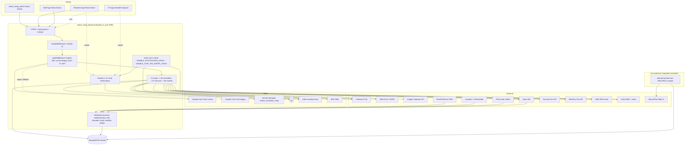

# Architecture: senior_living_backend

> **Doc status:** v2.3 re-verified against production HEAD `e075f578`, 2026-07-11 (delta review; prior doc baseline was production HEAD `465e88fb`, 2026-07-03).
> **v2.5 delta — 2026-08-08, against `pre-production` HEAD `bddd6bac`.** New features (all `pre-production`, none in `production`): **Secure Call** — recorded staff→resident/family Twilio voice calls (`SecureCall` model, `secureCall.controller/service`, `/api/secure-calls` + `/api/secure-call`), KMS-encrypted per-part transcript/summary (`secureCallRecordingCrypto.ts`, external summary Lambda), and a **signature-verified** Twilio webhook (`/webhooks/twillio`, `twilioSignature` middleware — best-effort unless `TWILIO_ENFORCE_WEBHOOK_SIGNATURE=true`). **Consent Forms** — `ConsentForm` model + `/api/consent-forms` (resident + family co-signing, per-signature PDF regen); **3 of 5 routes unauthenticated → new Design Gap G-29.** **Unified signature service** — `/api/signatures` (`GET /pending`, `PUT /:id/sign`) serving `directive|referral|medication-list`, gated `requireAnyStaffDesignation([DOCTOR, PHYSICIAN])`; `/api/advance-care-directives` kept as deprecated aliases. **KPI dashboard backend** — `GET /reports/daily-summary` (`dailySummaryReport.controller.ts`), query-time facility-scoped aggregations over Resident/Message/TransportationRequest/CareConference. **Referral medication list** is now a separately physician-signable document (`Referral.medicationListDocId`/`medicationList{Unsigned,Signed}PdfUrl`/`medicationListSignatureAudit`). **Login/MFA** — `POST /api/auth/login-mfa-channel` (channel pinning, rate-limited) + Cognito `EMAIL_OTP`/`SELECT_MFA_TYPE`. **Medication** gained `strength`/`prescribingDoctor` (bulk-backfill scripts). **Resident** gained `admissionType`/`payerSource`/`isResponsibleParty`. New collections: `SecureCall`, `ConsentForm`. Env: `TWILIO_ENFORCE_WEBHOOK_SIGNATURE`, `PCC_MAX_5XX_RETRIES`.
> **v2.6 delta — 2026-08-20, against `pre-production` HEAD `27361392`** (58 commits / 17 merges since the v2.5 baseline `bddd6bac`, 70 files changed, +5177/-1133, **no new npm dependencies**). All still `pre-production` only. **Chat v2** — message **edit** (`PUT /api/chat/messages/:messageId`, configurable `Config.chat.maxEditWindowMinutes`, no version history kept), message **forward** (`POST /api/chat/messages/forward`, `forward.service.ts`, batched/rollback-safe, capped by `maxForwardMessages`/`maxForwardTargets`), per-user conversation **pin** (`PUT`/`DELETE /api/chat/conversations/:id/pin`, `ConversationMemberState.pinnedAt`, capped by `maxPinnedConversations`), and a new automated **ChatSystemUser** identity (`ChatSystemUser` model, `chat/systemUser/` services) that lets a backend module post cards into a facility group via `Config.chat.moduleMessageBindings` — first consumer is Transportation (request-created/updated cards, `services/transportation/transportationChatTemplates.ts`, fire-and-forget/never-throwing). **Chat retention policy reversed to fully non-destructive** (HIPAA / CA 7-year rationale in code comments): soft-deleted messages and destroyed GROUP conversations are never physically removed or S3-purged any more — `Message.deletedAt`/`Conversation.deletedAt` are now display-only flags, superseding the prior "eager S3 delete on soft-delete" behavior (see §4.3, §5.2). **Resident/family-member phone uniqueness enforcement removed** — both the DB unique-sparse index on `FamilyMember` and the app-level `validatePhoneUniqueness` resident-phone check were dropped (multiple residents/family members may now share a phone); two new **unauthenticated** advisory-only endpoints were added instead, `GET /api/residents/check-duplicate` and `POST /api/consent-forms/validate-members` (see Design Gaps). **New Critical Design Gap G-30**: two new `/pcc-sync/*` bulk endpoints (`syncUpdateResidentBulk`, `syncResidentCognitoBulk`) reuse a **hardcoded, non-env-sourced shared-secret literal** as their only gate (same string already present, undocumented, on the pre-existing `bulkMedicationSync` since before this window). **Legacy Cognito pool migration** — `forgotPassword`/`resetPassword` now fall back to a second, legacy user pool (new env `OLD_USER_POOL_ID`) and lazily migrate matched Admin/Staff accounts (`oldPoolMigration.service.ts`, `Staff.migratedFromOldPool(At)`, `Admin.migratedFromOldPool(At)`). **PCC resident onboarding gained email as a fallback identifier** (previously phone-only-or-nothing) plus an optional welcome email, and a new **default-staff auto-assignment** (`Config.allowDefaultStaff`/`defaultAllowedStaff[]`, `Staff.isDefaultStaff`) for PCC-onboarded residents. **Transportation** driver/resident booking conflicts are now reported together in one confirmable `409` (`forceBook`/`forceDriverAssign`). **KPI dashboard** gained `secureCallsMade`/`referralsSent`/`documentsSigned`. **Referral** gained a server-enforced discharge-date floor (`Config.dischargeDateMaxPastDays`, default 28). New admin-only `GET /api/advance-care-directives/admin/resident/:residentId` (properly authenticated). **T-17 (Mongo connection string logged in plaintext) confirmed already absent at both the `bddd6bac` baseline and this HEAD — doc-only correction, marking RESOLVED** (not a fix made in this window). See §8/§9/Appendix for full evidence.
> **v2.4 delta — 2026-07-30, against `pre-production` HEAD `ff3e6ac5`.** The WestFax referral-delivery, per-user chat-clear + chat-hardening, transportation new-admission/edit, PCC-readmit onboarding, and `UserActivity` themes previously described here as `staging`-only have reached **`pre-production`** (nothing in `production` yet). Hardening folded in: WestFax **retry** (`POST /api/fax/westfax/retry`) + `FaxLog.retryCount`/`lastRetryAt`/`referralId`/`origCSID`, facility-name CSID, and a **config-driven callback URL** (`buildCallbackUrl(baseUrl)` — the hardcoded-staging literal is gone, resolving the callback half of **G-28**; the webhook is still unauthenticated — the auth half of G-28 remains). Referral **send dedup** (`referralSentHistoryDedup.service.ts`), **notify-after-PDF**, a `GET /referrals/pending-signature/:id` PDF endpoint, new referral fields `additionalNotes`/`includeMedicationList` (and `pcpFollowUp` removed; `selectedHHA` now vestigial). PCC read **resilience** (401 token-cache retry + 5xx backoff/skip, `pccRateLimiter.ts` / `pcc.service.ts`); medication-PDF row-flatten + re-term. Chat **key-cache concurrency fix** (`cacheOrReuseConversationKey`) + receipt-integrity vs the per-user clear floor. **No new npm deps; no new cron jobs.**
> **v2.7 delta — 2026-08-27, against `pre-production` HEAD `e6469276`** (5 commits / 2 merges since the v2.6 baseline `27361392`, 19 files changed, +1671/-78, **no new npm dependencies** — `git diff 27361392..pre-production -- package.json` is empty). Still `pre-production` only. Two unrelated changes, from two independently-merged branches: **(1) Message pin (Chat v2, continued)** — a new **conversation-wide, shared pinned-messages tray**: `PUT`/`DELETE /api/chat/messages/:messageId/pin` (`pin.controller.ts`, new → `chat/message/pin.service.ts`, 520 lines, new) and `GET /api/chat/conversations/:id/pinned-messages` (active-participant only, no ex-member exception unlike message history). This is distinct from the existing per-user `ConversationMemberState.pinnedAt` conversation-pin from v2.6 — this one is per-*message*, visible/unpinnable by any active participant, and backed by a **new model `ConversationPinState`** (one document *per conversation*, not per pin — `pinnedMessages[]: {messageId, pinnedBy, pinnedByRole, pinnedAt, expiresAt?}`, `conversationId` unique index). **Atomicity is a single-document compare-and-push, not a Mongo transaction**: an idempotent upsert (`$setOnInsert`, E11000 swallowed on the losing side of a concurrent first-pin) guarantees the row exists, then one `updateOne` checks **both** caps — `Config.chat.maxPinnedMessagesPerConversation` (default 5) and `maxPinnedMessagesPerUser` (default 5) — together in a single `$expr`/`$filter` against that one document's array, so there's no read-then-write race between the two caps; a `modifiedCount === 0` result is disambiguated into already-pinned / per-user-cap / conversation-cap and the two cap cases throw `413 PAYLOAD_TOO_LARGE` with copy the code says is intentionally byte-identical to the admin app's own pre-check string. Unpin uses `findOneAndUpdate({new:false})` to read the pre-image atomically with its own `$pull` (avoids a double-`MESSAGE_UNPINNED` race between concurrent unpins). **No TTL index** — Mongo TTL only expires whole documents, never array elements — so `durationMinutes` (`Config.chat.pinMessageDurationOptions`, default `[60, 420, 1440, 10080, -1]` minutes, `-1` = `PIN_DURATION_FOREVER`, validated by new `isValidPinDurationOption`) is enforced live on every cap check/read, with cleanup **primarily demand-driven** (unpin and the tray-list read both sweep expired siblings as a side effect) plus a **new daily backstop cron** `src/jobs/pinExpiry.cron.ts` (`0 3 * * *`, gated by **new env `ENABLE_CHAT_PIN_EXPIRY_CRON`**, registered in `server.ts` independently of `ENABLE_NOTIFICATION_CRON`). Pinning is auto-reversed by message soft-delete (`delete.service.ts` now `$pull`s the deleted message out of `ConversationPinState` and reports `unpinned`/`totalPinnedCount`, surfaced as a `MESSAGE_DELETED`-reason pin-change event) — consistent with v2.6's fully-non-destructive retention posture (content stays, but a deleted message can't stay in the shared tray). New system-message types `MESSAGE_PINNED`/`MESSAGE_UNPINNED` (actor-driven only — never for expiry sweeps or delete-triggered auto-unpin) and a new socket event `chat:message-pin-changed` (`CHAT_SOCKET_EVENT.MESSAGE_PIN_CHANGED`, emitted directly by `chatNotification.service.ts`, socket-only, no FCM/web push — distinct from the existing per-viewer `chat:pin-changed`). All three new routes sit under `chat.routes.ts`'s existing router-level `authMiddleware, facilityMiddleware` + `requireAnyRole(anyAuthedRole)` gate — **same as every other 2026-08 chat addition; no new chat auth gap.** This is the **backend half of a cross-repo feature** — the entire user-facing surface plus a new general-purpose jump-to-message engine ship in `senior_living_admin` (documented in parallel, this same pass, in that repo's own architecture doc); see the new shared design doc `docs/chat/feature/pin-message.md` (476 lines) for the full spec and the rejected-alternatives discussion (a TTL-ticket-collection + change-stream design was considered and rejected as more moving parts for a problem the demand-driven-plus-daily-cron approach already covers). **(2) Welcome message on passwordless Cognito sync (unrelated, separate branch)** — `bulkResidentCognitoSync` (`POST /pcc-sync/syncResidentCognitoBulk`) now also fires a fire-and-forget welcome SMS-or-email (`sendPasswordlessWelcome` — a **pre-existing** service already used by PCC's `patient.admit` onboarding, §3.10; this is a new call site, not new code) after successfully creating a resident's Cognito account, phone preferred, email fallback, same never-throws/logged-and-swallowed-per-channel contract as its existing callers. **No new endpoint, no new auth, no schema change** — but this executes *inside* the already-Critical **Design Gap G-30** endpoint and does not touch the secret check itself; it does mean G-30's practical blast radius now includes triggering outbound contact to a resident, not just a DB/Cognito write, for anyone holding the hardcoded secret (see §3.10, §8). **No new Design Gaps or Technical Debt entries this window** — the pin feature repeats the "well-scoped new service file" pattern T-1 already calls out as a counter-example to the god-class controllers, and the welcome-message change is a single new call site inside an existing, already-tracked gap.
> **v2.8 delta — 2026-08-28, against `pre-production` HEAD `5fbe9a3c`** (10 commits / 1 merge since the v2.7 baseline `e6469276`, 15 files changed, +1009/-1, **no new npm dependencies** — `git diff e6469276..origin/pre-production -- package.json` is empty). Still `pre-production` only, all from one merged branch (`assign-practitioner-directly-via-pcc-pre-prod`). **(1) PCC practitioner sync + automated care-team staff assignment (new)** — two new PCC webhook events, `medicalProfessional.add`/`medicalProfessional.remove` (registry now **16** handlers, was 14), back a new `Practitioner` collection (`src/models/Practitioner.model.ts`) that stores the full PCC practitioner payload **field-encrypted** under a resident-scoped KMS data key (`practitioner_data: Record<string, SharedKeyEncryptedPayload>`), unique on `{facilityId, cName, practitionerId}`. `medicalProfessional.add` (`syncPractitionersByResourceId`) does a **full** practitioner-list re-fetch for the patient (not filtered to the one added ID — deliberate, to dodge a PCC list-read-lags-webhook race) and re-persists via `syncAndStorePractitioners` (`pcc.practitioners.ts`, new), then **auto-assigns** any Staff member whose `name` case-insensitively matches a practitioner's `firstName + lastName` into `Resident.assignedStaff[]` (`assignStaffFromPractitioners`) — an ambiguous (>1 Staff) name match is **not guessed**: assignment is skipped and a **new** email alert fires instead (§4.10, `DUPLICATE_STAFF_ALERT_EMAILS`). `medicalProfessional.remove` (`practitionerStatusOnly`) marks the stored `Practitioner` row `inactive` then **auto-unassigns** every Staff cName sharing that practitioner's name from `assignedStaff[]` (`unassignStaffForRemovedPractitioners`) — see new Design Gap **G-32** for the collateral-unassignment risk this creates. Both `patient.admit` and `patient.readmit` now also run the same practitioner sync (`syncResidentPractitioners`, new shared helper in `residentOnboarding.ts`) as part of onboarding/re-sync. A practitioner event for a patient **not yet in our DB** now triggers the **same onboarding path `patient.admit` uses** (`onboardMissingResidentForPractitionerEvent`, no welcome message) — see new Design Gap **G-31** for the duplicate-Resident race this opens alongside the pre-existing `patient.admit` path. **New shared-key encryption redesign underpinning this:** `resolveResidentPccKey` (`pcc.residentKeys.ts`, new) replaces the old one-wrapped-key-per-PCC-resource-type pattern with a **single shared KMS-wrapped key per resident** (`Resident.pcc_wrappedKeyB64`, new field) intended for "all PCC resources going forward," with an atomic `findOneAndUpdate({pcc_wrappedKeyB64:{$exists:false}})` claim to converge concurrent first-time key generation on one winner; the old per-resource keys (`pcc_medication_wrappedKeyB64` and four more not yet used) are kept as a **read-only legacy fallback** (`resolveLegacyResidentPccKey`) — existing medication encryption is unchanged this window, only the new `Practitioner` model uses the new shared key. **(2) Duplicate-staff alert email (four incremental commits on the same branch)** — `sendDuplicateStaffAlert` (§4.10) emails a **fixed, hardcoded, cross-facility** recipient list (`DUPLICATE_STAFF_ALERT_EMAILS`, `src/constants/pccAlerts.ts`, new — 3 addresses) whenever the ambiguous-match case above fires, for **any** facility — no per-facility notification-email `Config` field exists today, so this is a real cross-facility PHI fan-out (resident name + facility name in the email body) to the same 3 inboxes regardless of which facility triggered it, by explicit current-requirements design per the constant file's own comment; see new Technical Debt **T-19**. **New Technical Debt also opened this window: T-18** — `pcc.core.ts` (new) is a functional duplicate of `resolvePccConfig`/`getPccAccessToken`/`getPccHttpsAgent`/token-cache already in `pcc.service.ts`, imported only by the new `pcc.practitioners.ts` — the practitioner-sync path now runs its **own independent OAuth-token cache and HTTPS agent** rather than sharing `pcc.service.ts`'s; **T-20** — code comments in `pcc.practitioners.ts:114-115` and `pcc.residentKeys.ts:14` describe a "manual `/pcc-sync/practitioners` endpoint" and an "auto-sync-on-read" call site as existing consumers — **neither exists yet** at this HEAD (`pccSync.routes.ts`/`pccSync.controller.ts` are untouched in this diff), same class as T-16. **No changes to routes, controllers, or `src/services/` this window** — 73 routes / 86 controllers unchanged; all net-new logic landed under `src/integrations/pms/pcc/` (11→15 files) and `src/models/` (68→69: `Practitioner.model.ts`). See §4.10 for the full design writeup.
> This document describes what is present on the noted HEAD. Half-built, mock, or dead functionality is recorded under **Design Gaps** / **Technical Debt**, not stated as a feature.
>
> Related docs: [`../architecture-senior-living-product.md`](../architecture-senior-living-product.md) (product-level architecture), `adr/ADR-001-pcc-webhook-convergent-state.md`, `adr/ADR-002-custom-otp-password-reset.md`, `adr/ADR-003-chat-dual-channel-push.md`, `docs/chat/feature/pin-message.md` (2026-08-27 — shared pin-message design doc, backend + `senior_living_admin`). Backend data model: see `../data-schema.md` (forward reference — Mongoose collection inventory summarized in §5 below until that file lands; note `data-schema.md`'s own source of truth is the `production` branch, so `pre-production`-only models like `Practitioner`, `ConversationPinState`, `ChatSystemUser`, `SecureCall`, `ConsentForm` intentionally do not appear there yet).

---

## 1. Purpose

`senior_living_backend` is the single REST + real-time API server for the Senior Living (assisted-living facility management) platform. It is a multi-tenant Node.js/Express service (port `7000`) consumed by the admin web app (`senior_living_admin`), the resident mobile app (`senior_living_reactnative`), the staff mobile app (`senior_living_staffapp`), and the in-room TV app (`senior_living_tvapp`).

Tenancy is keyed on the `x-facility-id` HTTP header; all domain collections carry a `facilityId` discriminator field. A single AWS Cognito user pool backs human authentication (admin/staff/resident/family-member) — plus, as of 2026-08, a lazy-migration fallback to a **second legacy pool** for pre-existing Admin/Staff accounts (§3.10a); TV devices use a custom DB-backed JWT issued through a Socket.io QR-pairing flow.

**Responsibilities (verified against `src/app.ts` route mounts and `src/server.ts`):**

1. Facility-scoped multi-tenancy — `x-facility-id` enforced for all `/api/*` routes via `facilityMiddleware` (`src/app.ts:124`).
2. Resident lifecycle — residents, linked family members, profile pictures, payment history, notification preferences (`src/routes/residents.route.ts`).
3. Staff management — Cognito provisioning, designations, access permissions, Google Calendar OAuth (`src/routes/staff.route.ts`, `src/controllers/staff.controller.ts`).
4. Clinical / care — medications, advance care directives, test results, lab reports, care plans, care conferences, IDT reports, diet plans, referrals, agencies, case-manager schedules; **practitioners are now a first-class synced clinical record (PCC `medicalProfessional.add/remove`, new 2026-08-28, KMS-encrypted `Practitioner` collection, §4.10)**.
5. Wellness services — salon, massage, private training, rehab: services, schedules, appointments, waitlists (`src/app.ts:122-154`).
6. Dining — menus, daily specials, menu library, categories, items, family meal requests, diet plans.
7. Dining tray cards (Menu2U, **new**) — `DiningTrayCard` model + routes at `/api/dining-tray`; data is populated by a Puppeteer-based Menu2Plus scraper running in a separate `cron-worker.ts` process. Three endpoints: `POST /ingest` (direct JSON dump), `GET /menu` (per-resident mobile view), `GET /residents-menu` (admin/staff view with backfill-match detail). Backfill logic matches resident records by room, bed, and name at ingest time.
8. Activities & content — announcements, gallery, brain games, Android-TV categories, unified schedule, schedule attendance.
9. Transportation — request lifecycle + rule management; designation-based routing; outside-agency driver support; conflict detection with `forceBook` override; **driver-busy conflicts are now reported alongside resident-schedule conflicts in a single confirmable `409` (`forceDriverAssign`, 2026-08)**; request create/update now optionally posts an automated chat card via the new ChatSystemUser mechanism (§4.3a).
10. Notifications — FCM mobile push, Web Push / VAPID browser push, in-app via Socket.io, SMS (Twilio for transactional messages, AWS SNS for reset-OTP), cron-driven reminders (`src/jobs/`, `src/services/notification.service.ts`, `src/services/sms.service.ts`). Per-module appointment/request notification services have been consolidated into `src/services/activity.notification.service.ts` (salon, massage, PT, rehab, referral, IDT) and `src/services/transportRequest.notification.service.ts` (transport). Care-conference SMS notifications live in `src/services/careConference.notification.service.ts`.
11. Real-time — TV pairing (`/tv`), KMS-encrypted chat (`/chat` — now with edit/forward/pin, message-pin, and automated system-user messages, §4.3a/§4.3b), live notification streaming (`/notifications`).
12. External integrations — PCC PointClickCare (PMS, patient/medication events; **`patient.admit`/`patient.readmit`/`patient.updateResidentInfo` now fully automate resident onboarding, and as of 2026-08 accept email as a fallback identifier alongside phone**; **and, new 2026-08-28, `medicalProfessional.add/remove` practitioner events with automated `Resident.assignedStaff[]` add/remove — see §4.5, §4.10**), Lemedix/CrelioHealth (lab events), TELS (work orders/housekeeping), Zoom (meetings/recordings/webhooks), Google Calendar (staff sync), WestFax (referral fax delivery — the as-built agency-delivery channel, superseding referral email), Documo (generic outbound fax + account/history lookups), AWS SES (notification email with PDF attachments; referral email superseded by WestFax; **new (2026-08): optional PCC-onboarding welcome email; new (2026-08-28): duplicate-staff alert email**, §4.5/§4.10), Menu2U/menu2plus (tray-card scraping), Twilio Programmable Voice (Secure Call recordings).
13. PDF generation — IDT reports (`idtReport.pdf.service.ts`), referrals (password-protected), medication lists via Puppeteer/Chromium.
14. File storage — AWS S3 presigned PUTs (client-direct) and multer-S3 (server-side).
15. **Clinical care-team model** — each resident carries a single flat `assignedStaff[]` array (cName list) in place of the five legacy per-role fields (nurse, caseManager, socialWorker, doctor, dietitian). See §5 and `src/lib/assignedStaff.ts` / `src/utils/assignedStaff.ts`. **New (2026-08): optional default-staff auto-assignment** — when `Config.allowDefaultStaff` is true, PCC-onboarded residents automatically get the facility's configured `defaultAllowedStaff[]` appended to `assignedStaff[]` (§4.5). **New (2026-08-28): PCC practitioner sync now also drives this array automatically** — add on a `medicalProfessional.add` name match, remove on a `medicalProfessional.remove` name match, matched by Staff `name` only (no PCC-ID cross-reference on the Staff side) — see §4.10, and Design Gap **G-32** for the collateral-unassignment risk this creates (the array carries no provenance marker distinguishing manual, default-staff, and PCC-driven entries).
16. Hotel demo slideshows — `HotelDemoSlideshow` model + `/api/hotel-demo-slideshows` CRUD (image/video/audio/pdf slides for the admin panel's hidden demo mode, gated by `Config.showSlideShowModal`); consumed by `GET /api/android-tv` and `GET /api/config`.
17. PCC manual resident-sync tool (unauthenticated) — `POST /pcc-sync/residents`, `/residents/map`, `/medications/bulk-sync`, and **new (2026-08): `/syncUpdateResidentBulk`, `/syncResidentCognitoBulk`** — mounted outside `/api` with no `facilityMiddleware`/`authMiddleware`; the two new endpoints add a shared-secret gate but see Design Gap **G-30** (the secret is hardcoded in source, not env-sourced). **`syncResidentCognitoBulk` gained a welcome-message side effect, 2026-08-27** — see §3.10/§4.5. See §4.5 and Design Gaps **G-26**/**G-30**.
18. Recorded voice calls (Secure Call) — staff↔resident/family Twilio calls, KMS-encrypted transcript/summary, signature-verified webhook. See §3.10/§4.6.
19. Consent forms — resident + family co-signing PDFs, `/api/consent-forms`; **partially unauthenticated**, see Design Gap **G-29** (now 4 of 6 routes open as of 2026-08 — see §8).
20. PCC practitioner sync (new, 2026-08-28) — `medicalProfessional.add`/`medicalProfessional.remove` webhook events maintain a new `Practitioner` collection (KMS-field-encrypted under a resident-scoped shared key) and automatically add/remove matched Staff cNames from `Resident.assignedStaff[]` (item 15 above); a practitioner event for a not-yet-onboarded patient now also triggers full resident onboarding. See §3.10, §4.10, Design Gaps **G-31**/**G-32**, Technical Debt **T-18**/**T-19**/**T-20**.

---

## 2. Tech Stack

| Layer | Technology | Version / Notes |
|---|---|---|
| Runtime | Node.js | 20 Alpine (Dockerfile), non-root `appuser`, port 7000 |
| Framework | Express | 5.2.1 |
| Language | TypeScript | 5.9.3 |
| DB / ODM | MongoDB / Mongoose | Mongoose 9.1.6 |
| Auth (humans) | AWS Cognito JWT | `jwks-rsa` 3.2.0, `aws-jwt-verify` 5.1.1; `token_use === 'access'` required (`src/middleware/authMiddleware.ts:73`); **legacy-pool lazy-migration fallback for Admin/Staff forgot-password, 2026-08 (§3.10a)** |
| Auth (TV) | Custom JWT | `jsonwebtoken` 9.0.3; DB-backed revocation via `TvAuthToken` (`authMiddleware.ts:191`) |
| Secrets | AWS Secrets Manager | `@aws-sdk/client-secrets-manager` 3.965.0; secret `Senior_Assisted_Living`, region `us-west-1` |
| Object storage | AWS S3 | `@aws-sdk/client-s3` 3.971.0, `@aws-sdk/s3-request-presigner` 3.971.0 |
| SMS | AWS SNS + Twilio | `@aws-sdk/client-sns` 3.1067.0 (reset-OTP via `sendOtpSms`); `twilio` 6.0.2 (transactional `sendSms`, env-gated on `TWILIO_*`) — both in `src/services/sms.service.ts` |
| Email | AWS SES | `@aws-sdk/client-ses` 3.1072.0 (`src/config/ses.ts`, `src/services/email.service.ts`; `SendRawEmailCommand` for PDF attachments, `SendEmailCommand` otherwise) |
| Fax (generic) | Documo HTTP API | `axios` + `form-data`; `src/integrations/documo/` (`documo.service.ts`, `documoConfig.ts`); env-gated on `DOCUMO_API_KEY` |
| Fax (referral delivery) | WestFax REST API | `src/integrations/westfax/westfax.service.ts`; per-facility creds from `IntegrationAvailable(name:'westfax')`; the as-built referral agency-delivery channel (§4.9) |
| Encryption | AWS KMS (envelope, AES-256-GCM) | `@aws-sdk/client-kms` 3.971.0 (`src/utils/kmsEnvelope.ts`) |
| Identity mgmt | AWS Cognito IdP | `@aws-sdk/client-cognito-identity-provider` 3.966.0; **two pools as of 2026-08** — current (`USER_POOL_ID`) + legacy (`OLD_USER_POOL_ID`, read-only lookup source for migration) |
| Mobile push | Firebase Admin FCM | `firebase-admin` 13.8.0 |
| Browser push | Web Push / VAPID | `web-push` 3.6.7 |
| Real-time | Socket.io | 4.8.3 (3 namespaces) |
| Background jobs | node-cron | 4.2.1 (**9** job files as of 2026-08-27 — see §3.8) |
| Validation | Zod | 4.3.5 |
| PDF | Puppeteer + pdf-lib | Puppeteer 24.43.1 (`PUPPETEER_EXECUTABLE_PATH=/usr/bin/chromium-browser`); `@cantoo/pdf-lib` 2.7.1 (referral PDF password protection) |
| Calendar | Google APIs | `googleapis` 170.1.0 |
| Rate limiting | express-rate-limit | 8.5.2 (applied only to auth-reset / login-mfa-channel routes) |
| Password hash | bcrypt | 6.0.0 |
| File upload | multer 2.0.2 / multer-s3 3.0.1 | |
| HTTP client | axios | 1.15.2 |
| Date ops | date-fns 4.1.0, @date-fns/tz 1.4.1 | |
| In-process cache | node-cache 5.1.2 | |
| HTTP logging | morgan 1.10.1 (`'dev'` format, `src/app.ts:94`) | No structured logger; app code uses `console.*` |
| CI/CD | GitLab CI + ESLint + SonarQube + Semgrep/Snyk | |
| Container | Docker multi-stage, non-root, port 7000 | |

**No new npm dependencies were added in the 2026-08-08 → 2026-08-20 window** (`package.json` diff is empty across `bddd6bac..pre-production`). **Nor in the 2026-08-20 → 2026-08-27 window** (`git diff 27361392..pre-production -- package.json` is also empty). **Nor in the 2026-08-27 → 2026-08-28 window** (`git diff e6469276..origin/pre-production -- package.json` is also empty).

---

## 3. Key Components (full inventory, grouped)

### 3.1 Entry points
- **`src/server.ts`** — loads env (`dotenv`), `initConfig()`, `validateEnv()` (requires `AWS_S3_BUCKET_NAME`, `TV_JWT_SECRET`, and — **restored on production** — `ALLOWED_ORIGINS`; `PRE_ALLOWED_ORIGINS` commented out at `server.ts:31`), then `initSocket(server)` before `connectDB()`, then conditionally starts **5 cron starts gated by `ENABLE_NOTIFICATION_CRON === 'true'`**: `startNotificationCron`, `startAppointmentCompletionCron`, `startCareConferenceEnableCron`, `startCareConferenceReviewCron`, `startCareConferenceSmsReminderCron`; **plus, as of 2026-08-27, a 6th start independently gated by its own flag** — `startPinExpiryCron` behind `ENABLE_CHAT_PIN_EXPIRY_CRON === 'true'` (§3.8). The two announcement crons (`startAnnouncementNotificationCron` / `startAnnouncementReminderCron`) that were present on staging have been **deleted** along with `src/jobs/announcement.cron.ts`. The dining-tray cron is intentionally **not started here** — see `cron-worker.ts`.
- **`src/cron-worker.ts`** — standalone process for the dining-tray (Menu2Plus / Chromium) cron. Contains no HTTP server; deployed as a second container from the same image (`node dist/cron-worker.js`). Calls `initConfig()` + `connectDB()` then `startDiningTrayCardCron()`. This isolation prevents the heavy Puppeteer scrape from competing with the API for memory/CPU.
- **`src/app.ts`** — Express construction: CORS from `ALLOWED_ORIGINS` (`app.ts:85-95`), 12 MB JSON/urlencoded body limit (`app.ts:98-99`), morgan, route mounting (**73 route modules**, unchanged count since 2026-07-11 — see Appendix), presigned-upload endpoint, `errorHandler` last.

### 3.2 Route mount order & facility-guard boundary (`src/app.ts`)
Mounted **before** `facilityMiddleware` (no global `x-facility-id` gate): `/api/config` (117), `/api/app-version` (118), `/api/auth` reset routes (119-120), and `/api/fax` (123) — fax routes manage their own guards, so they mount before the global gate. The global `facilityMiddleware` is applied at `app.ts:124`; everything after it is nominally facility-scoped (but see Design Gap **G-1**). Webhook/callback mounts live **outside** `/api`: `/auth` callbacks (225), `/webhooks/pcc` (239), `/pcc-sync` (242), `/webhooks/tels` (245), `/webhooks/lemedix` (248), `/zoom` recordings (251), `/webhooks/zoom` (254), `/webhooks/westfax` (261), `/webhooks/twillio` (Secure Call) — these never pass through `facilityMiddleware` or `authMiddleware`. `/pcc-sync` additionally has no route-level auth of its own on its original two endpoints (unlike the webhook receivers, which at least gate on PCC/TELS/Zoom payload shape); its two new bulk endpoints (2026-08) add a shared-secret check but the secret is a source-code literal, not env-sourced — see Design Gaps **G-26**/**G-30**. The new `medicalProfessional.add/remove` events (2026-08-28) ride the same unauthenticated `/webhooks/pcc` receiver as every other PCC event — no change to this mount's own guard posture.

### 3.3 Auth posture per route group

**Globally auth-protected (`router.use(authMiddleware)` or all-route auth):** `chat.routes.ts` (`router.use(authMiddleware, facilityMiddleware)` at the top **plus** per-route `requireAnyRole(...)` RBAC — mounted `/api/chat`, `app.ts:155`; **all 2026-08 additions (edit/forward/pin/unpin, and the new 2026-08-27 message-pin/unpin/pinned-tray routes) follow the same gate — no new chat auth gaps**), `webPush.routes.ts` (mounted `/api/push`), `medication.routes.ts`, `cognito.routes.ts` (`GET /api/cognito/export`, per-route `authMiddleware`, mounted `app.ts:186`), `reports.routes.ts` (auth applied at mount via `app.ts:227` — **still mounted twice**, see T-3), `fax.routes.ts` (mounted `/api/fax` at `app.ts:123`; `facilityMiddleware` + `authMiddleware` applied per-route unless `FAX_LOCAL_BYPASS=true`), `hotelDemoSlideshow.routes.ts` (mounted `/api/hotel-demo-slideshows`, `app.ts:184`; every route carries `authMiddleware` directly, plus `facilityMiddleware` via the `/api` prefix), `advanceCareDirective.routes.ts`'s new **`GET /admin/resident/:residentId`** (`authMiddleware` + ADMIN/SUPER_ADMIN/STAFF role check, 2026-08).

**Mixed auth — partial open (verified):** `menu.routes.ts` (mounted `/api/menu`, `app.ts:116`) — only `GET /` carries `authMiddleware`; `GET /getMenuForAdmin` and `GET /price-and-time` are **unauthenticated** (`menu.routes.ts:7-9`). See G-21. **`consentForm.routes.ts`** (mounted `/api/consent-forms`) — only `POST /pdf` and `POST /sign` carry `authMiddleware`; `POST /`, `GET /`, `GET /:id`, and **new (2026-08) `POST /validate-members`** are unauthenticated. See G-29 (now 4 open routes).

**Per-route mixed auth:** `staff.route.ts` (`GET /` uses `optionalAuthMiddleware`), `admin.routes.ts`, `testResult.routes.ts`, `referral.routes.ts`, `care.routes.ts`, `gallery.routes.ts`, `labreports.routes.ts`, `housekeeping.routes.ts`.

**Zero application-layer auth (verified):**
- `residents.route.ts` — `POST /` (create), `GET /` (list all PII), `GET /check-temp-password`, `GET /pcc-contacts`, `GET /pcc-patient-detail`, `GET/PUT/DELETE /:id`, and **new (2026-08) `GET /check-duplicate`** (phone/email existence check — see G-3) are all unauthenticated.
- `staff.route.ts` — `GET /`, `DELETE /:id`, `PATCH /:id/toggle`.
- `admin.routes.ts` — `GET /`, `GET /getAdminData`.
- `category.route.ts`, `announcement.routes.ts`, `dailySpecial.routes.ts`, `menuLibrary.routes.ts`, `transportationRule.routes.ts`, `salon.routes.ts`, `massageSchedule.routes.ts`, `salonSchedule.routes.ts`, `privateTrainingSchedule.routes.ts`, `privateTraining.routes.ts`, `item.routes.ts` — config/CRUD with no auth.
- `testNotification.routes.ts` — `POST /api/test-notifications/fire-all` (no auth, no env guard).
- `zoom.routes.ts` — `POST /api/zoom/meetings`, `DELETE /api/zoom/link/:staffCName`.
- `pccSync.routes.ts` — `POST /pcc-sync/residents`, `/residents/map` (no auth at all); `/medications/bulk-sync`, and new `/syncUpdateResidentBulk`, `/syncResidentCognitoBulk` (hardcoded shared-secret only — functionally unauthenticated to anyone with source access, see G-30; `syncResidentCognitoBulk` also now sends a resident-facing welcome SMS/email on success as of 2026-08-27, same gate, no change to the auth story). **Untouched in the 2026-08-28 window** — the new practitioner-sync feature does not add or change any `pccSync.*` route.
- `consentForm.routes.ts` — `POST /`, `GET /`, `GET /:id`, and new `POST /validate-members`.

**Public by design:** `appVersion.routes.ts`, `config.routes.ts`, `callback.routes.ts`, `authReset.routes.ts` / `authStaffReset.routes.ts` (rate-limited pre-auth flows including `POST /api/auth/send-credentials`, `POST /api/auth/login-mfa-channel`; **2026-08: `forgotPassword`/`resetPassword` transparently fall back to the legacy Cognito pool — see §3.10a**).

**Webhook receivers:** `pcc.webhook.routes.ts` (no auth/signature — **now also the receiver for the new `medicalProfessional.add/remove` events, 2026-08-28**), `lemedix.webhook.routes.ts` (no signature), `tels.webhook.routes.ts` (HMAC X-API-KEY, conditional), `zoom.webhook.routes.ts` / `zoom.recordings.routes.ts` (HMAC, conditional per-request), `westfax.webhook.routes.ts` (no auth/signature — G-28), `twilio` Secure Call webhook (`twilioSignature` middleware — signature-verified, best-effort unless `TWILIO_ENFORCE_WEBHOOK_SIGNATURE=true`).

### 3.4 Middleware (`src/middleware/`, 13 files)
- `facilityMiddleware.ts` — reads `x-facility-id` / `facilityid`, sets `req.facilityId` (has correctness/security bug — G-1). Also exports `requireFacilityId` (correct guard, `:70`).
- `authMiddleware.ts` — branches on `istv`/`is-tv` header: TV path (`authTv`, DB revocation lookup) vs Cognito path (`setCognitoUserFromToken` via shared JWKS). Side effects: FCM token upsert from `x-fcm-token` header on every authenticated request (`authMiddleware.ts:98-101`); family-member identity normalization to resident `cName` (`authMiddleware.ts:103-154`). Also exports `optionalAuthMiddleware`, `isStaffOnlyRequest`, `isResidentOnlyRequest`, `isFamilyMemberOnlyRequest`.
- `roleMiddleware.ts` — `requireAnyRole`, `requireAllRoles`, `requireRoleWithAdmin`, `requireAnyStaffDesignation(designations[])`.
- `bookingContextMiddleware.ts` — resolves resident `cName`, checks per-facility `Config.bookingPermission`, writes `req.bookingContext`; also loads `Config.staffDirectoryRoles` and resolves parent-designation inheritance via `resolveParentDesignation`.
- `designationDispatch.middleware.ts` — `dispatchByStaffDesignation(map, options)` factory; routes STAFF requests to designation-specific handlers based on the caller's `Staff.designation`.
- `accessPermissionsMiddlewares.ts` — `requireAnyStaffPermission`, `requireAnyStaffWritePermission`.
- `telsWebhookAuth.middleware.ts` — HMAC X-API-KEY via `crypto.timingSafeEqual` (skips if env secret absent).
- `middleware.ts` — Zod `validate`, `validateQuery`, `normalizeBracketBody`.
- `s3upload.ts` — multer-S3 with `sanitizeFilename`; also `buildMulterUnlimited`/`s3UploadUnlimited` (no file-size cap — G-27).
- `chatUpload.ts` — `chatFileUpload` (multer for chat attachments) + `validateChatMessage`.
- `upload.ts` — local multer (no active route reference — T-11/dead-code).
- `error-handler.ts` — global Express error handler.
- `twilioSignature.middleware.ts` — Secure Call webhook signature verification (best-effort unless `TWILIO_ENFORCE_WEBHOOK_SIGNATURE=true`).

### 3.5 Controllers (74 top-level files, unchanged, + `controllers/chat/` sub-package of **12 files** [+1, 2026-08-27: `pin.controller.ts`] = **86 total**; 0 new controller files 2026-08-08→2026-08-20 despite substantial content growth that window, e.g. `resident.controller.ts` (+713/-… lines), `transportationRequest.controller.ts` (+373 lines), `pccSync.controller.ts` (+370 lines), `staff.controller.ts` (+147 lines), `advanceCareDirective.controller.ts` (+192 lines). **2026-08-20→2026-08-27: +1 controller file** (`controllers/chat/pin.controller.ts` — pin/unpin/list-pinned-tray handlers) **plus a further +24 lines in `pccSync.controller.ts`** for the new welcome-message call site in `bulkResidentCognitoSync` (§4.5)). **2026-08-27→2026-08-28: 0 new controller files** — the practitioner-sync feature landed entirely under `src/integrations/pms/pcc/` and its `webhooks/shared/` package, not `controllers/`; `pccSync.controller.ts` itself has an empty diff this window.

God-class controllers (>1000 lines, approximate): `resident.controller.ts` (now well over 3000, grew again this window), `transportationRequest.controller.ts` (~2800, grew), `salonAppointment.controller.ts` (~1878), `housekeeping.controller.ts` (~1876), `staff.controller.ts` (~1450, grew), `massageAppointment.controller.ts` (~1300), `privateTrainingAppointment.controller.ts` (~1270), `caseManagerSchedule.controller.ts` (~1250). See T-1 — both `resident.controller.ts` and `transportationRequest.controller.ts` are on the path of this window's changes and grew further; no service extraction accompanied the growth. **Counter-example, 2026-08-27:** the new `pin.controller.ts`/`pin.service.ts` pair again lands as its own appropriately-scoped file, same pattern T-1 already praises for the 2026-08-20 chat-v2 additions. **Counter-example, 2026-08-28:** the practitioner-sync feature is entirely new, appropriately-scoped files under `src/integrations/pms/pcc/`; it does not touch either god-class controller directly (it mutates `Resident.assignedStaff[]` via `Resident.updateOne` from webhook-shared code, not through `resident.controller.ts`).

### 3.6 Services (top-level **50** [+2: `oldPoolMigration.service.ts`, `referral.validation.service.ts`] + `chat/` **14** [unchanged] + `chat/conversation/` **8** [unchanged file count; `memberState.service.ts` substantially expanded for pin/unpin, +149 lines] + `chat/message/` **11** [+3 as of 2026-08-20: `edit.service.ts`, `forward.service.ts`, `mentionValidation.service.ts`; **+1 more as of 2026-08-27: `pin.service.ts`, 520 lines**] + `chat/systemUser/` **2, new 2026-08-20** [`chatSystemUser.service.ts`, `moduleMessage.service.ts`] + `transportation/` **1, new 2026-08-20** [`transportationChatTemplates.ts`] + `pcc/` **1** [unchanged] = **87 total**, up from 78 at the 2026-08-08 baseline and 86 at the 2026-08-20 baseline). **2026-08-27→2026-08-28: `src/services/` count unchanged (87)** — the new practitioner-sync code (`pcc.core.ts`, `pcc.practitioners.ts`, `pcc.residentKeys.ts`) lives under `src/integrations/pms/pcc/` instead, alongside the pre-existing `pcc.service.ts`; see §3.10 for that directory's own inventory (11→15 files this window).

**Notification service consolidation (unchanged from prior baseline):** 9 per-module notification services remain deleted, folded into `activity.notification.service.ts` and `transportRequest.notification.service.ts`.

**New 2026-08-08→2026-08-20:**
- `oldPoolMigration.service.ts` — legacy-Cognito-pool lazy migration for Admin/Staff on forgot-password (§3.10a).
- `referral.validation.service.ts` — `loadDischargeDateMaxPastDays`/`earliestAllowedDischargeDate`, backing the new server-side discharge-date floor in `referral.controller.ts`.
- `services/transportation/transportationChatTemplates.ts` — renders Transportation's automated chat cards (`REQUEST_CREATED`, etc.) consumed by `sendModuleMessage`.
- **`chat/message/edit.service.ts`** (171 lines) — in-place message text edit, no version history, gated by `Config.chat.maxEditWindowMinutes`.
- **`chat/message/forward.service.ts`** (490 lines) — multi-message, multi-target forward with batched persistence and rollback on partial failure; attachments referenced, never re-uploaded.
- **`chat/message/mentionValidation.service.ts`** (323 lines) — validates `@mention` candidates server-side.
- **`chat/systemUser/chatSystemUser.service.ts`** + **`moduleMessage.service.ts`** — resolve a facility's `Config.chat.moduleMessageBindings` for a given module/event and post an automated message as the bound `ChatSystemUser`; `sendModuleMessage` is designed to never throw, so a chat-automation failure cannot break the calling module's own request.

**New 2026-08-20→2026-08-27:**
- **`chat/message/pin.service.ts`** (520 lines) — `pinMessageForConversation`/`unpinMessageForConversation`/`listPinnedMessagesForConversation`; atomic dual-cap pin/unpin plus the pinned-tray read path (decrypts content, resolves mentions/reactions/reply-preview, applies the requester's own clear-chat floor). See §4.3b.

**2026-08-27→2026-08-28: no new files under `src/services/`** — all new code for this window lives under `src/integrations/pms/pcc/`, not here (see §3.10).

**`chat/` (14 top-level, unchanged file list):** same as the 2026-08-08 baseline (incl. `profile.service.ts`).
- **`chat/conversation/` (8 files):** `index.ts` barrel, `conversation.service.ts`, `info.service.ts`, `inbox.service.ts`, `unread.service.ts`, `attachments.service.ts`, `careTeam.service.ts`, `memberState.service.ts` (this window: gains `pinConversationForUser`/`unpinConversationForUser`, enforcing `maxPinnedConversations` and driving `inbox.service.ts`'s pinned-first sort).
- **`chat/message/` (11 files as of 2026-08-27):** `index.ts` barrel, `send.service.ts`, `list.service.ts`, `status.service.ts`, `reaction.service.ts`, `delete.service.ts` (reworked 2026-08-20 for non-destructive soft-delete, **reworked again 2026-08-27 to auto-unpin on delete** — see §4.3b), `system.service.ts`, `edit.service.ts`, `forward.service.ts`, `mentionValidation.service.ts`, `pin.service.ts` (new, 2026-08-27).

**New util (unchanged from 2026-08-08):** `src/utils/careConferenceRecordingCrypto.ts`.

### 3.7 Models (**69** Mongoose models — +1 since 2026-08-08 [`ChatSystemUser.model.ts`], +1 since 2026-08-20 [`ConversationPinState.model.ts`], **+1 more since 2026-08-27 [`Practitioner.model.ts`, new 2026-08-28 — see §4.10/§5.2]**). `resident.model.ts` also gained one field this window (`pcc_wrappedKeyB64`, §4.10/§5.2) without becoming a new model file.

### 3.8 Background jobs (`src/jobs/`, **9** job files as of 2026-08-27 [+1: `pinExpiry.cron.ts`] — **6** cron starts in `server.ts` [was 5], 1 in `cron-worker.ts`, 1 defined-only/not started, 1 defined for Secure Call/other). **Unchanged in the 2026-08-27→2026-08-28 window** — practitioner sync is entirely webhook-triggered, no new cron.

| Cron start | Process | Default schedule | Action |
|---|---|---|---|
| `startNotificationCron` (`notification.cron.ts`) | server.ts | `* * * * *` | Reads all `NotificationConfig`, fans out `sendScheduledNotificationsForOffset` per offset |
| `startAppointmentCompletionCron` (`appointmentCompletion.cron.ts`) | server.ts | `*/15 * * * *` | `runAppointmentCompletion()` |
| `startCareConferenceEnableCron` (`careConferenceEnable.cron.ts`) | server.ts | `* * * * *` | SCHEDULED→IN_PROGRESS for conferences starting in next 5 min |
| `startCareConferenceReviewCron` (`careConferenceReview.cron.ts`) | server.ts | `* * * * *` | IN_PROGRESS→IN_REVIEW once end time passed (7-day lookback) |
| `startCareConferenceSmsReminderCron` (`careConferenceSmsReminder.cron.ts`) | server.ts | `*/5 * * * *` | Sends 1-day-before and 1-hour-before SMS reminders |
| `startPinExpiryCron` (`pinExpiry.cron.ts`, new 2026-08-27) | server.ts | `0 3 * * *` (daily) | Sweeps **every facility's** `ConversationPinState.pinnedMessages` for expired entries (`$pull` on `expiresAt <= now`) — a low-stakes backstop; primary pin-expiry cleanup is demand-driven at read/unpin time (§4.3b) |
| `startDiningTrayCardCron` (`diningTrayCard.cron.ts`) | **cron-worker.ts** | `DINING_TRAY_SOURCES` JSON | Scrapes menu2plus UI (Puppeteer) or fetches a URL/file per-facility source |
| `startServiceRequestCancellationCron` (`serviceRequestCancellation.cron.ts`) **NOT started** | — | `0 0 * * *` | `cancelOverdueServiceRequests()`; function defined/exported but not imported/called from any entry point (G-25, unchanged) |

**Deleted (unchanged from prior baseline):** `announcement.cron.ts`.

All `server.ts` crons **except `startPinExpiryCron`** are gated by `ENABLE_NOTIFICATION_CRON=true`. `startPinExpiryCron` has its own, independent gate — **`ENABLE_CHAT_PIN_EXPIRY_CRON=true`** (new, 2026-08-27) — checked separately in `server.ts`, so pin-expiry cleanup can be turned on (or off) without touching the notification-cron bundle. The dining-tray cron in `cron-worker.ts` is independent of both gates.

### 3.9 Socket.io namespaces (`src/socket/`, **5 files** — unchanged — + shared `socketAuth.ts`)
No socket-layer files added/changed structurally in the 2026-08-20→2026-08-27 or 2026-08-27→2026-08-28 windows; `chat.handler.ts` gained ~20 lines wiring the edit/forward/pin events into the existing connection-registry/notification flow (2026-08-20, see §4.3a) but the namespace/auth contract is unchanged. **2026-08-27: one more event added to the existing `/chat` contract without touching `chat.handler.ts`** — `chat:message-pin-changed` (`CHAT_SOCKET_EVENT.MESSAGE_PIN_CHANGED`) is emitted directly by `chatNotification.service.ts`'s new `notifyMessagePinChanged`, the same way the existing delete/edit notifiers already bypass the handler file — still the same 3-namespace/auth contract. **Practitioner sync (2026-08-28) has no socket-layer footprint** — it is pure webhook-in/DB-out; no new socket event was added.

| Namespace | Handler | Connection auth |
|---|---|---|
| `/tv` | `tvPairing.handler.ts` | **None** — facility from handshake headers (G-7 — note: numbering per §8; do not confuse with the Zoom-signature G-7, cross-check evidence column) |
| `/chat` | `chat.handler.ts` | Cognito JWT verified on connect; `platform` mandatory; family identity normalized; per-platform counts tracked via `connectionRegistry`; offline fan-out to Web Push + FCM |
| `/notifications` | `notifications.handler.ts` | Cognito JWT verified on connect; joins `user:${cName}` room |

### 3.10 External integration handlers
- PCC: `src/integrations/pms/pcc/` — `pcc.service.ts`, `pccRateLimiter.ts`, `pccErrors.ts`, `pccAuditLog.ts`, `types/`, `webhooks/registry.ts` (**16** event handlers, +2 2026-08-28: `medicalProfessional.add/remove`), `webhooks/shared/` (`medicationSync.ts`, `patientData.ts`, `residentOnboarding.ts`, **+2 new 2026-08-28: `practitionerSync.ts`, `practitionerStaffAssignment.ts`**). **New sibling modules (2026-08-28, not under `webhooks/`):** `pcc.core.ts`, `pcc.practitioners.ts`, `pcc.residentKeys.ts` — see §4.10. Inbound receiver `src/controllers/pcc.webhook.controller.ts` (unchanged).
  - **`onboardNewResident` (`webhooks/shared/residentOnboarding.ts`) reworked, 2026-08 — email is now a fallback identifier, not just phone.** Both phone and email (if present in the PCC payload) are pre-checked against Cognito (`cognitoUserExists`) before any account is created: phone-and-email both already taken → anonymous `randomUUID()` `cName`, no Cognito account (unchanged terminal case); phone taken / email free → **new** email-only Cognito account (`createCognitoUserByEmailOnly`) + optional welcome **email** (new `sendWelcome` param, SES); email taken / phone free → phone-only account + welcome SMS (prior behavior, unchanged); neither taken → phone-first as before. Shared by `patient.admit`, `patient.readmit` (Path B), and `patient.updateResidentInfo`. Both branches ultimately call the same `sendPasswordlessWelcome` service now also reused by `bulkResidentCognitoSync` (below, 2026-08-27). **As of 2026-08-28, `onboardNewResident` also runs `syncResidentPractitioners` (§4.10) in the same `Promise.all` as its medication/contact sync** — see Design Gap **G-31** for the new duplicate-onboarding race this creates when combined with the practitioner-event-triggered onboarding path below.
  - **Default-staff auto-assignment (new, 2026-08):** at the end of onboarding, if `Config.allowDefaultStaff` is true and `Config.defaultAllowedStaff[]` is non-empty, those Staff `_id`s are resolved and appended to the new resident's `assignedStaff[]` (`residentOnboarding.ts:~498-503`). Config also gained `Staff.isDefaultStaff` as the admin-facing flag for which staff are eligible to be added to `defaultAllowedStaff`.
  - **New admin sync tool, extended 2026-08:** `src/controllers/pccSync.controller.ts` (+370 lines) + `src/routes/pccSync.routes.ts`, mounted at `/pcc-sync` (`app.ts:242`) — outside `/api`. Existing: `POST /pcc-sync/residents`, `/residents/map` (**no auth at all**), `/medications/bulk-sync` (hardcoded-secret gate, pre-existing but previously undocumented here). **New this window:** `POST /pcc-sync/syncUpdateResidentBulk` (refreshes PCC-linked residents' demographic fields one at a time) and `POST /pcc-sync/syncResidentCognitoBulk` (idempotent Cognito-account backfill, phone-then-email, never modifies existing accounts) — both gated by the **same hardcoded literal** `'A879B3C-4D5E-6F7G-8H9I-0J1K2L3M4N5O'` checked via `x-sync-secret` header or `secretKey` body field (`pccSync.controller.ts:332-334,542-544,690-692` — three call sites, byte-identical string). This is not read from env/Secrets Manager anywhere in the codebase; the in-code comment ("Replace with your actual secret key") indicates it was never intended to ship as-is. See Design Gaps **G-26** (mount-level gap, pre-existing) and **G-30** (new — the secret itself). **Untouched in the 2026-08-28 window** (empty diff on both `pccSync.controller.ts` and `pccSync.routes.ts`) — the new practitioner-sync feature does not add a manual sync endpoint of its own, despite a code comment implying one exists (see Technical Debt **T-20**).
  - **2026-08-27: `bulkResidentCognitoSync` (`syncResidentCognitoBulk`) gained a welcome-message side effect.** After successfully creating a resident's Cognito account, it now calls the pre-existing `sendPasswordlessWelcome` service (same one PCC onboarding uses, above) — phone preferred, email fallback, fire-and-forget, never throws. This is a new call site only — it does not touch the shared-secret gate at `:332-334,542-544,690-692` — but it does widen **G-30**'s practical blast radius: anyone holding the hardcoded secret can now also trigger an outbound SMS/email to a resident's phone or email, not just write DB/Cognito state. See §8 (G-30 addendum).
  - **Practitioner sync (new, 2026-08-28):** see §4.10 for the full design — new `Practitioner` model, two new webhook events, automated `Resident.assignedStaff[]` add/remove by staff-name match, and a redesigned single-shared-key-per-resident PCC encryption scheme.
- **Menu2U / menu2plus, WestFax, Documo, Zoom, TELS, Lemedix, Google Calendar:** unchanged this window — see prior-baseline detail retained below.
  - **Menu2U / menu2plus:** `src/integrations/menu2plus/menu2plus.scraper.ts` — Puppeteer-based scraper; env `WMP_URL`/`WMP_USERNAME`/`WMP_PASSWORD`; called by `diningTrayCard.cron.ts` in `cron-worker.ts`.
  - Documo (fax): `src/integrations/documo/` — `documo.service.ts`, `documoConfig.ts`. Controller `src/controllers/fax.controller.ts`, routes `src/routes/fax.routes.ts`.
  - **WestFax (referral fax delivery):** `src/integrations/westfax/westfax.service.ts`; send orchestration `src/controllers/westfaxSend.controller.ts`; delivery webhook `src/routes/westfax.webhook.routes.ts` + `src/controllers/westfax.webhook.controller.ts` (`GET /webhooks/westfax`, outside `/api`, **still no auth/signature** — G-28). Models `ReferralSentHistory.model.ts`, `FaxLog.model.ts`.
  - Lemedix: `src/routes/lemedix.webhook.routes.ts` + `src/services/lemedix.service.ts`.
  - TELS: `src/integrations/pms/tels/`, `src/integrations/pms/workOrder.integration.ts`, `src/services/tels.webhook.service.ts`, auth via `src/middleware/telsWebhookAuth.middleware.ts`.
  - Zoom: `src/controllers/zoom.controller.ts`, `zoom.routes.ts`, `zoom.recordings.routes.ts`, `zoom.webhook.routes.ts`.
  - Google Calendar: `src/controllers/googleAuth.controller.ts`, `src/services/googleCalendarSync.service.ts`, `src/services/googleAuth.ts`.

### 3.10a Legacy Cognito pool migration (new, 2026-08)
`authReset.controller.ts`'s `forgotPassword`/`resetPassword` now resolve an Admin/Staff identifier against the **current** Cognito pool first, then — only for the `sms` channel, since old-pool accounts predate email-based login — fall back to a **second, legacy pool** (`getOldPoolUserByPhone`, `cognitoReset.service.ts`, new env `OLD_USER_POOL_ID` via `getOldUserPoolId()` in `src/lib/common.ts:19-20`). A match found only in the old pool, and only if it maps to an existing `Admin`/`Staff` DB record (Resident/FamilyMember are explicitly out of scope), is eligible for migration. `resetPassword` re-resolves (not trusting the `forgotPassword`-time result) and calls `migrateFromOldPool` (`src/services/oldPoolMigration.service.ts`) before setting the new password: creates the account in the current pool by phone (random temp password, `suppressInvite:true`; `UsernameExistsException` swallowed for concurrent-migration safety), copies the MFA preference, adds the Cognito group matching the DB role, then marks `Staff.migratedFromOldPool`/`migratedFromOldPoolAt` (or the `Admin` equivalent — both fields new on both models). All branches log with phone-masked `console.info`. This is a genuinely new AWS dependency (a second Cognito user pool) — confirm `OLD_USER_POOL_ID` is provisioned in Secrets Manager (`Senior_Assisted_Living`, `us-west-1`) alongside `USER_POOL_ID` before this reaches an environment where old-pool accounts exist.

---

## 4. Architecture Diagram & Key Flows

### 4.1 Authenticated request lifecycle
Client → CORS (`app.ts:85`) → body parser (12 MB) → morgan → `facilityMiddleware` (`app.ts:124`, sets `req.facilityId`) → route handler → `authMiddleware`:
- **TV branch** (`is-tv`/`istv` truthy): `authTv()` verifies the custom TV JWT (`verifyTvAccessToken`) and confirms a non-revoked, unexpired `TvAuthToken` exists for `{facilityId, cName, deviceId}` (`authMiddleware.ts:163-213`).
- **Cognito branch:** JWKS verify via `sharedJwksClient`, require `token_use === 'access'` and non-empty `sub`/`username` (`authMiddleware.ts:60-93`); upsert FCM token if `x-fcm-token` present; enrich family-member identity (`authMiddleware.ts:103-154`). (Applies to the **current** pool only — the legacy pool, §3.10a, is used solely as a one-time forgot-password migration source, never for live token verification.)

Then optional `roleMiddleware` / `bookingContextMiddleware` / `accessPermissionsMiddlewares` / `designationDispatch.middleware`, Zod validation, controller → service → model. Errors funnel to `errorHandler`.

### 4.2 TV pairing (Socket.io `/tv`)
Unchanged. Source: `src/socket/tvPairing.handler.ts`.

### 4.3 Chat (Socket.io `/chat` + `/api/chat/*` REST)
Connect → Cognito JWT verified → `platform` header checked (mandatory) → family identity resolved → `addConnection(cName, platform, socketId)` in `connectionRegistry` → join `user:${cName}` + `facility:${facilityId}` → `markAllPendingDelivered` reconnect catch-up + unread push. Messages are AES-256-GCM encrypted with a per-conversation KMS data key (§4.6). Source: `src/socket/chat.handler.ts`, `src/services/chat/chatEncryption.service.ts`, `src/services/chat/chatNotification.service.ts`. See `adr/ADR-003-chat-dual-channel-push.md`.

**§4.3a Chat v2 (new, 2026-08-10 → 2026-08-18, several `feature/chat-v2-*` merges):**

- **Message edit** — `PUT /api/chat/messages/:messageId` (`editMessageHandler` → `chat/message/edit.service.ts`). Only the original sender may edit; text and `mentions` are overwritten in place — **no prior version is retained**. Editability window is server-authoritative: `Config.chat.maxEditWindowMinutes` (default 15, `CHAT_CONFIG_DEFAULTS.maxEditWindowMinutes` — mirrors the WhatsApp convention per the code comment); the client-side "Edit" affordance hiding after the window is UX-only. Sets `Message.editedAt`.
- **Message forward** — `POST /api/chat/messages/forward` (`forwardMessagesHandler` → `chat/message/forward.service.ts`, 490 lines). Forwards one or more existing messages into one or more target conversations (existing or new DMs); attachments are referenced (never re-uploaded/duplicated), text copied verbatim with mentions/reply-context stripped. Best-effort per target — one failing target doesn't block the others (per-target `status`/`code` in the response). Capped by `Config.chat.maxForwardMessages` (default 30) / `maxForwardTargets` (default 5). Route-ordering note baked into the code comment: `/messages/forward` must stay registered before any future `POST /messages/:messageId`-shaped route or Express would misroute "forward" as a `:messageId`. Sets `Message.forwarded`/`forwardedFrom.messageId` (internal-only, never serialized to any client response).
- **Conversation pin** — `PUT`/`DELETE /api/chat/conversations/:id/pin` (`pinConversationHandler`/`unpinConversationHandler` → `memberState.service.ts`). Per-user, per-conversation (`ConversationMemberState.pinnedAt`); capped by `Config.chat.maxPinnedConversations` (default 5); idempotent; a partial+sparse index (`{facilityId,cName,pinnedAt}`, `pinnedAt:{$type:'date'}`) keeps the index tiny since most rows never pin. `inbox.service.ts` sorts pinned conversations first, ranked by their own message recency (not pin time). **Distinct from the new per-message pin, §4.3b.**
- **Automated module messages (ChatSystemUser)** — new `ChatSystemUser` model (facility-scoped, non-human identity; no auth capability, no operational fields; provisioning is currently **manual, direct-document-write only, no creation API** per its own doc comment) + `chat/systemUser/chatSystemUser.service.ts` / `moduleMessage.service.ts`. A backend module calls `sendModuleMessage({facilityId, moduleKey, eventKey, buildContent})`; the service resolves `Config.chat.moduleMessageBindings[moduleKey]` (an array — one module can broadcast into multiple groups/identities), checks the binding is active and not opted out for `eventKey` via `messageNotifyPreference`, and only then invokes `buildContent` to render+send. **Designed to never throw** — a chat-automation failure cannot break the calling module's own request/response. First (only) consumer: Transportation (`transportationRequest.controller.ts` + `services/transportation/transportationChatTemplates.ts`) posts "Request Created"/"Request Updated" cards on create and on any displayed-field change (driver, destination, schedule, travel time, special request, round trip).
- **Retention policy reversed to fully non-destructive (HIPAA / California 7-year rationale, per code comments):**
  - **Message soft-delete** (`delete.service.ts`, reworked): previously, S3 objects backing an attachment were **deleted eagerly** before `Message.deletedAt` was written, with a "CRITICAL: must never delete" guard specifically protecting `isReference` attachments owned by other modules. Now, **no S3 object is ever deleted by the chat module, regardless of `isReference`** — the eager-delete step and its guard comment are both gone (the guard is now moot, not violated). `content`/`attachments`/`reactions` are **never cleared**; `deletedAt` is purely a display/access flag that every client-facing read path (list/preview/gallery) gates on, and is **never serialized to any API or socket response**. New `Message.deletedBy` records who deleted it (currently always the sender — no admin override exists). **2026-08-27: also `$pull`s the message out of `ConversationPinState` if it was pinned — see §4.3b.**
  - **Conversation (GROUP) destruction** (`group.service.ts`, reworked): explicit delete-by-creator and automatic last-member-leave cleanup are now **soft** (`Conversation.deletedAt`/`deletedBy`) rather than a hard document delete — mirrors the message pattern exactly. Every conversation-loading/listing path must (and does, per the diff) filter `deletedAt: null`; a new index `{facilityId, deletedAt}` backs this.
  - **Architectural implication (flagging for compliance/product awareness, not a code defect):** "deleted" chat content — including attachments — is now permanently recoverable at the DB/S3 layer for any conversation or message a user believes they deleted. This is an intentional retention-compliance decision per the code comments, but it changes the actual data-lifecycle guarantee from "gone" to "hidden," which is worth confirming against the platform's stated privacy/retention policy documentation (not verified as part of this backend-only review).
- **`isSystemUser` flag** — `Message.isSystemUser`/`Conversation.lastMessage.isSystemUser` (both optional, additive) mark messages authored by a `ChatSystemUser` so clients can render them distinctly; absent for all ordinary human messages.

**§4.3b Message pin — conversation-wide shared tray (new, 2026-08-20 → 2026-08-27):**

Any active participant can pin or unpin **any** message (not just their own) to a conversation-wide tray, distinct from §4.3a's per-user, per-*conversation* pin. Endpoints: `PUT`/`DELETE /api/chat/messages/:messageId/pin` (`pin.controller.ts` → `chat/message/pin.service.ts`) and `GET /api/chat/conversations/:id/pinned-messages` (requires ACTIVE participation only — no ex-member exception, unlike message history). All three sit under the same router-level `authMiddleware, facilityMiddleware` + `requireAnyRole(anyAuthedRole)` gate as every other chat route — no new auth gap.

- **Model — `ConversationPinState`** (new, `src/models/ConversationPinState.model.ts`): one document **per conversation**, not per pin or per user — `{conversationId (unique index), facilityId, pinnedMessages: [{messageId, pinnedBy, pinnedByRole, pinnedAt, expiresAt?}]}`. This "one array, one document" shape is what makes atomic dual-cap enforcement possible without a transaction.
- **Atomic dual-cap enforcement (no Mongo transaction):** `pinMessageForConversation` does two sequential single-document operations. Step 1 — an idempotent, unconditional `updateOne({conversationId}, {$setOnInsert:...}, {upsert:true})` guarantees the row exists (a concurrent first-pin race is resolved by swallowing the loser's `E11000`). Step 2 — one `updateOne` whose filter combines **both** caps in a single `$expr`: `Config.chat.maxPinnedMessagesPerConversation` (default 5, count across all pinners) and `Config.chat.maxPinnedMessagesPerUser` (default 5, count for the requesting user), each computed via `$filter`/`$size` over the same array snapshot, both excluding already-expired entries via a shared `notExpired` sub-expression — so the two cap checks can never race each other. `modifiedCount === 0` is disambiguated (already-pinned / per-user-cap-hit / conversation-cap-hit) into a `413 PAYLOAD_TOO_LARGE`, with user-facing copy the code comments say is kept byte-identical to `senior_living_admin`'s own client-side pre-check string (`pinLimitMessage` in that repo's `domain/pinDomain.ts`) so a user isn't shown different wording depending on whether their client's cached count was stale.
- **Unpin** uses `findOneAndUpdate({new:false})` to read the pinned-state pre-image atomically with its own `$pull` — avoids a check-then-act race where two concurrent unpins of the same message could both read "currently pinned" and both announce `MESSAGE_UNPINNED`.
- **Expiry — deliberately not a TTL index.** MongoDB TTL indexes only expire whole documents, never array elements, so a native TTL index on `pinnedMessages.expiresAt` was never viable. `durationMinutes` resolves via `Config.chat.pinMessageDurationOptions` (default `[60, 420, 1440, 10080, -1]` minutes; `-1` = `PIN_DURATION_FOREVER`, a named sentinel chosen over `Infinity` — which serializes to `null` via `JSON.stringify` — and over `0`, which reads ambiguously as "expires immediately"; validated by shared helper `isValidPinDurationOption`, reused by both the Mongoose config validator and the pin-request Zod schema). Every cap check and every read filters live by `expiresAt`, so correctness never depends on physical-removal timing. Cleanup is layered: **(1) primary, demand-driven** — unpin's `$pull` and the pinned-tray `GET` both sweep any expired sibling as a side effect of an action that already touches the row; **(2) secondary, a new daily backstop cron** `src/jobs/pinExpiry.cron.ts` (`node-cron`, `0 3 * * *`, `America/Los_Angeles` default via `FACILITY_TIMEZONE` — matching `notification.cron.ts`'s existing convention), gated by **new env `ENABLE_CHAT_PIN_EXPIRY_CRON`** and registered in `server.ts` independently of `ENABLE_NOTIFICATION_CRON` (§3.8) — closes the one gap demand-driven cleanup can't (a conversation whose pins expire and is never revisited).
- **Delete interaction:** `delete.service.ts`'s `softDeleteMessageRecord` now also `$pull`s the message out of `ConversationPinState` on soft-delete and reports `unpinned`/`totalPinnedCount` back up; `deleteMessageHandler` emits a `chat:message-pin-changed` event with `reason: 'MESSAGE_DELETED'` when that happened. Consistent with v2.6's fully-non-destructive retention posture — message content is retained, but a deleted message can no longer occupy a slot in the shared pinned tray.
- **Notifications:** new system-message types `MESSAGE_PINNED`/`MESSAGE_UNPINNED` (`SYSTEM_EVENT_TYPE`, via `insertSystemMessage`) fire only for actor-driven pin/unpin — never for expiry sweeps or delete-triggered auto-unpin, since those have no actor to attribute a system-message pill to. New socket event `chat:message-pin-changed` (`CHAT_SOCKET_EVENT.MESSAGE_PIN_CHANGED`, `notifyMessagePinChanged` in `chatNotification.service.ts`) fans out to all participants, socket-only (no FCM/web push — same rationale as the existing delete notifier: a pin/unpin is a state update, not a new notification). Distinct from the existing per-viewer `chat:pin-changed` (conversation pin, §4.3a).
- **Not a tenant-scoping gap, but worth noting:** `ConversationPinState` lookups are keyed by `conversationId` (a globally-unique ObjectId, already resolved through a facility-scoped conversation lookup upstream) rather than filtered by `facilityId` directly in every query — consistent with how the collection is designed to be accessed, not a new instance of G-1/G-2, but flagged here for whoever next extends this model.
- **Cross-repo:** this is the backend half only. The entire user-facing surface (pin affordance, pinned-tray UI) plus a new, more general **jump-to-message** engine are implemented in `senior_living_admin` and documented there in parallel this same pass. Full shared spec, including the rejected TTL-ticket-collection-plus-change-stream alternative: `docs/chat/feature/pin-message.md` (new, 476 lines).

**FCM push delivery, chat-production hardening (unchanged from prior baseline — see 2026-07-30/07-11 notes retained below):** FCM mobile push gated on mobile socket presence (`isUserOnMobile`); FCM Android channel `chat_messages_v2`; per-recipient badge counts via `getChatUnreadSummaryForUsers`; quorum-aware GROUP delivery/read aggregates; `earlierMessageStatuses(status)` ratchet guard prevents status regression.

**REST surface (unchanged from prior baseline, retained for reference):** `GET /api/chat/profile/:cName`, `PUT /api/chat/messages/:messageId/delivered`, `PUT /api/chat/conversations/:id/delivered`, `POST /api/chat/bootstrap-redwood`, `GET`/`PUT /api/config/chat/staff-designation-allowed[/:designation]`, paginated `GET /chat/search`, `replyTo` mention-resolution, tombstoned `lastMessage` on delete.

### 4.4 Notification delivery
Unchanged this window. `notification.cron.ts` (every minute) reads all `NotificationConfig`, fans out `sendScheduledNotificationsForOffset(offset)`.

**Transport notification refactor (unchanged, prior baseline):** `notifyCreatorStaff` in `transportRequest.notification.service.ts` notifies only the request's creating staff member on creation/start/completion.

**Transport chat automation (new, 2026-08):** independent of the FCM/SMS notification path above — see §4.3a's ChatSystemUser description. `sendTransportMessageOnRequestCreate`/`sendTransportMessageOnRequestUpdate` fire alongside (not instead of) existing notifications; the update variant only fires when a caller-supplied `anyFieldChanged` flag is true, computed by comparing every card-displayed field (driver, destination type/address, pickup schedule, travel time, special request, round trip) before vs after.

**Transportation booking-conflict UX (new, 2026-08):** a resident-schedule clash and a busy-driver clash are now reported together in a single `409 requiresConfirmation` response (`respondBookingConfirmation`) rather than two separate flows; the client shows one "book anyway?" prompt and can retry with `forceBook` and/or the new `forceDriverAssign`. New `isFromMobileRequest(req)` helper reads the lowercased `isfrommobilerequest` header (native apps only; browsers never send it).

### 4.5 PMS / lab / facilities webhooks
PCC: `POST /webhooks/pcc` responds `200` immediately then dispatches async to `PCC_EVENT_HANDLERS[eventType]` (`registry.ts`, **16** handlers as of 2026-08-28); errors are logged and swallowed — no retry/DLQ. Convergent-state design in `adr/ADR-001-pcc-webhook-convergent-state.md`. `patient.admit`, `patient.readmit` (Path B), and `patient.updateResidentInfo` share `onboardNewResident` (§3.10) — as of 2026-08 this accepts **email as a fallback identifier alongside phone** and can auto-assign default staff (§3.10); as of 2026-08-28 it also runs practitioner sync (§4.10). `pccAuditLog.ts` emits a structured (but still `console.*`-based) success/failure log line, redacting `patientId`/`orderId`. Lemedix / TELS / Zoom webhooks unchanged this window.

**Manual PCC sync tool, extended 2026-08:** `POST /pcc-sync/residents`, `/residents/map` (no auth), `/medications/bulk-sync`, `/syncUpdateResidentBulk` (new 2026-08-20), `/syncResidentCognitoBulk` (new 2026-08-20) — the last three gated by a hardcoded shared secret, not env-sourced (see §3.10, Design Gaps G-26/G-30). **2026-08-27:** `syncResidentCognitoBulk` also now fires the same pre-existing PCC-onboarding welcome SMS/email (`sendPasswordlessWelcome`) after each Cognito account it successfully creates or backfills — phone preferred, email fallback, fire-and-forget. New call site only; see §3.10 for the G-30 blast-radius note. **2026-08-28: no change to this tool** — see Technical Debt **T-20** for a code comment that implies a manual practitioner-sync endpoint exists here; it does not.

### 4.6 KMS envelope encryption (`src/utils/kmsEnvelope.ts`)
Two modes: single-shot (PCC medication PHI, unchanged) and shared-key (`generateConversationDataKey`/`unwrapConversationKey`/`chatKeyCache`, originally chat-only). **2026-08-28: a second consumer of the shared-key mode joins chat** — PCC practitioner data (`Practitioner.practitioner_data`, §4.10) is field-encrypted (`encryptWithDataKey`/`decryptWithDataKey`) under a new **resident-scoped** key (`resolveResidentPccKey`, distinct from chat's per-conversation key) that is intended to become the single shared key for all PCC resources going forward; existing PCC medication encryption (single-shot mode, `pcc_medication_wrappedKeyB64`) is untouched this window — see §4.10 for the full key-management design and its legacy-fallback path. Care-conference recording PHI (`careConferenceRecordingCrypto.ts`) unchanged; Secure Call recording PHI (`secureCallRecordingCrypto.ts`, introduced at the 2026-08-08 baseline) unchanged.

### 4.7 S3 upload (presigned PUT)
Unchanged.

### 4.8 Google Calendar sync
Unchanged.

### 4.9 Email, referral PDF & fax
Unchanged this window except: **referral discharge-date floor (new, 2026-08)** — `createReferral`/`updateReferral` (`referral.controller.ts`) now reject a `dischargeDate` further in the past than `Config.dischargeDateMaxPastDays` (default 28, `DISCHARGE_DATE_MAX_PAST_DAYS`) via new `referral.validation.service.ts` (`loadDischargeDateMaxPastDays`/`earliestAllowedDischargeDate`). WestFax/Documo/SES/referral-PDF flows otherwise unchanged — see prior-baseline detail (§4.9 in the 2026-08-08 revision, retained in full in this file's history).

- **Referral agency delivery (WestFax) — unchanged this window.** Record-then-fax pipeline (`ReferralSentHistory` → `POST /api/fax/westfax/send` → `FaxLog` per fax → `GET /webhooks/westfax` delivery callback, still unauthenticated — G-28) and retry (`POST /api/fax/westfax/retry`) both unchanged.
- **Email (SES):** unchanged; **new consumer, 2026-08** — the PCC-onboarding welcome email (§3.10) uses the same `email.service.ts`/`SendEmailCommand` path when a resident is provisioned by email instead of phone. **The 2026-08-27 `syncResidentCognitoBulk` welcome message reuses this exact same path** (`sendPasswordlessWelcome` → `sendEmail`/`sendCredentialsSms`), not a new integration. **2026-08-28: a third consumer** — the duplicate-staff alert email (§4.10) calls `email.service.ts`'s `sendEmail` directly with a 3-address `to` array; this is the first call site to actually exercise `sendEmail`'s pre-existing multi-recipient support (`to: string[]` was already the parameter type).
- **Fax (Documo):** unchanged.

### 4.10 PCC practitioner sync + automated care-team assignment (new, 2026-08-28)

Two new PCC webhook events extend the existing `PCC_EVENT_HANDLERS` registry (`src/integrations/pms/pcc/webhooks/registry.ts`, **14→16** handlers): `medicalProfessional.add` → `handleMedicalProfessionalAdd` → `syncPractitionersByResourceId`; `medicalProfessional.remove` → `handleMedicalProfessionalRemove` → `practitionerStatusOnly(..., 'inactive')`. Both ride the same unauthenticated/unsigned `POST /webhooks/pcc` receiver as every other PCC event — no new auth surface, and no auth hardening either (still **G-5**).

**Storage — new `Practitioner` model** (`src/models/Practitioner.model.ts`): one document per `{facilityId, cName, practitionerId}` (compound unique index), full PCC practitioner payload stored key-by-key in `practitioner_data: Record<string, SharedKeyEncryptedPayload>` — every field name is visible, every value is KMS-envelope-encrypted (`encryptWithDataKey`/`decryptWithDataKey`, same primitive as chat, §4.6). `status: 'active'|'inactive'` tracks add/remove without deleting the row (a non-destructive posture arrived at independently of, but consistent with, the chat module's v2.6 retention reversal). A second index `{facilityId, pcc_patientId, status}` backs per-resident active-practitioner lookups.

**Key management redesign** (`src/integrations/pms/pcc/pcc.residentKeys.ts`, new) — `resolveResidentPccKey(cName, facilityId)` introduces a **single KMS-wrapped key per resident** (`Resident.pcc_wrappedKeyB64`, new field), intended per its own comments to back "every PCC resource going forward," superseding the prior one-wrapped-key-per-resource-type convention (`pcc_medication_wrappedKeyB64` etc.). First-time key generation is race-safe across instances via an atomic conditional `findOneAndUpdate({pcc_wrappedKeyB64:{$exists:false}}, {$set:{pcc_wrappedKeyB64}})` claim — losers discard their own generated key and unwrap the winner's instead, so every caller converges on one key. A process-local `inFlightResolution` map only dedupes concurrent same-process callers (a latency/KMS-cost optimization, not a correctness guarantee — the DB claim is what actually guarantees it across instances, per the code's own comment). The five other legacy per-resource wrapped-key fields (medication, nutritionOrder, allergyIntolerance, observation, diagnosticReport) are kept as a **read-only fallback** (`resolveLegacyResidentPccKey`) for data already encrypted under them; **medication encryption itself is unchanged this window** — only the new `Practitioner` model uses the new shared key so far.

**Sync flow** (`syncPractitionersByResourceId`, `webhooks/shared/practitionerSync.ts`, new): resolves the resident by `{pcc_patientId, pcc_orgUuid}`; if found, does a **full** practitioner-list re-fetch for that patient (`fetchPccPractitionerList`, paginated) rather than filtering to just the webhook's `resourceId` — the code comments explain this deliberately dodges a race where PCC's list-read endpoint hasn't yet caught up with the webhook that announced the new practitioner. Upserts all returned practitioners via `syncAndStorePractitioners` (`pcc.practitioners.ts`, new — the encrypt + `bulkWrite` step), then calls `assignStaffFromPractitioners` (below). **If no resident is found** for the event's `{patientId, orgUuid}`, it now calls `onboardMissingResidentForPractitionerEvent`, which runs the **same `onboardNewResident` onboarding path `patient.admit` uses** (Cognito account, medications, contacts, and practitioner sync) with `sendWelcome: false` — see Design Gap **G-31** for the duplicate-Resident race this opens. Both `patient.admit`'s own onboarding and `patient.readmit` (`syncResidentPractitioners`, called after `applyPatientUpdate` for the existing-resident path) now run this same sync as a matter of course.

**Staff auto-assignment / auto-unassignment** (`webhooks/shared/practitionerStaffAssignment.ts`, new): matches are by **exact, case-insensitive full name** (`firstName + lastName`, title ignored) against active `Staff` in the facility — no PCC-ID cross-reference exists on the `Staff` side, so a name match is the entire correctness bar.
- **Add** (`assignStaffFromPractitioners`): exactly one Staff name match → `$addToSet` into `Resident.assignedStaff[]`. Zero matches → silently skipped (no alert — a practitioner simply not on staff is treated as expected, not an error). **More than one match → not guessed**: assignment is skipped and `sendDuplicateStaffAlert` fires instead (below).
- **Remove** (`unassignStaffForRemovedPractitioners`): resolves **every** active Staff cName sharing the removed practitioner's name (`matchAllStaffCNamesByName` — no ambiguity check, unlike the add path) and `$pull`s all of them from `assignedStaff[]`. The code comment's rationale is that `$pull` only removes cNames actually present, so an extra candidate that was never assigned is a no-op — but see Design Gap **G-32**: if a *different*, coincidentally-same-named Staff member was legitimately assigned to this same resident through any other path (manual admin action, or the pre-existing default-staff auto-assignment), this automated remove strips them too, because `assignedStaff[]` carries no marker for *why* or *how* a given cName got there.

**Duplicate-staff alert email** (`sendDuplicateStaffAlert`): on an ambiguous add-match, emails a **fixed list of 3 hardcoded addresses** (`DUPLICATE_STAFF_ALERT_EMAILS`, `src/constants/pccAlerts.ts`, new) — not per-facility, not `Config`-driven — with the resident's name+ID, facility name, and the ambiguous practitioner's name+ID in a plaintext HTML/text body, via the existing `email.service.ts` (`sendEmail`, whose `to: string[]` already supported multiple recipients — this is the first caller to actually use more than one, §4.9). See Technical Debt **T-19** for the cross-facility PHI-fan-out and config-debt angle; the recipient list, subject line, and multi-recipient support each shipped as separate incremental commits on this branch.

**Not yet wired up, despite a code comment implying otherwise:** `syncAndStorePractitioners`'s own doc comment (`pcc.practitioners.ts:114-115`) describes itself as "the single shared implementation used by the webhook handler, the manual `/pcc-sync/practitioners` endpoint, and auto-sync-on-read" — at this HEAD only the webhook handler exists; see Technical Debt **T-20**.

---

## 5. Data & State

### 5.1 Ownership
The backend **owns** all MongoDB collections (single database per deployment, Mongoose 9) — **69 model files at this HEAD** (+1 since 2026-08-08: `ChatSystemUser`; +1 since 2026-08-20: `ConversationPinState`; +1 since 2026-08-27: `Practitioner`). Tenant isolation key is `facilityId: String` on domain collections; `ChatSystemUser` is itself facility-scoped (`facilityId`+`active` index) despite being a non-human identity; `Practitioner` is likewise facility-scoped (`facilityId`+`cName`+`practitionerId` unique index). `ConversationPinState` carries `facilityId` too but its actual lookups are keyed on `conversationId` (see §4.3b). Facility-agnostic / shared collections (no per-facility scoping observed): `AppVersion`, `BrainGame`, `IntegrationAvailable`, `category`, `item`, `menuLibrary`, `AndroidCategories` — **verify before relying on cross-facility behavior** (relates to G-13).

It **reads** identity from AWS Cognito — **now two pools**, current (`USER_POOL_ID`, live auth) and legacy (`OLD_USER_POOL_ID`, forgot-password migration source only, §3.10a) — secrets from Secrets Manager, and pulls patient/medication/lab/work-order/practitioner data from PCC, Lemedix, and TELS into its own collections.

### 5.2 Collection groups (full inventory, delta-annotated through 2026-08-28)
- **Identity/auth:** `Admin` (**new: `migratedFromOldPool: Boolean`, `migratedFromOldPoolAt: Date|null`**), `Staff` (**new: `isDefaultStaff?: Boolean`, `migratedFromOldPool: Boolean`, `migratedFromOldPoolAt: Date|null`**), `resident` (**changed 2026-08-28: new `pcc_wrappedKeyB64?: String` — single shared KMS-wrapped key for all PCC resources going forward, see §4.10**; care-team `assignedStaff[]` — **now also auto-mutated by PCC practitioner add/remove events, §4.10, in addition to manual edits and the existing default-staff auto-assignment** —, optional `phone`/`countryCode`, `isSynced`/`pccSyncStatus` from the 2026-07-11 baseline all still present), `familyMember` (**changed: `countryCode` now `required:false, default:''` (was `required:true, default:'+1'`); `phone` now plain-optional (no `default:''`); the unique-sparse index `{residentId, countryCode, phone}` was REMOVED — see §7/Design Gaps for the phone-uniqueness policy change**), `tvAuthToken`, `tvPairingSession`, `tvDevice`, `PasswordResetOtp`.
- **Clinical/PHI:** `Medication`, `AdvanceCareDirective`, `TestResult`, `LabReport`, `LabPatient`, `IDTReport`, `Care`, `CareConference`, `DietPlan`, `Agency`, `Referral` (**new: implicit `dischargeDateMaxPastDays`-governed validation, no schema field added — enforced via `Config`**), `ReferralSentHistory`, `FaxLog`, `SecureCall` (2026-08-08 baseline, unchanged this window), `ConsentForm` (unchanged this window at the schema level; see §8 for its route-auth gap growing). **`Practitioner` (new model, 2026-08-28)** — one document per `{facilityId, cName, practitionerId}` (unique index), full PCC payload field-encrypted under the resident's shared PCC key (`practitioner_data`), `status: 'active'|'inactive'`; see §4.10.
- **Scheduling/appointments:** unchanged this window — `UnifiedSchedule`, `schedule`, `ScheduleAttendance`, Salon/Massage/PrivateTraining/Rehab appointment+schedule+service+base sets, `TransportationRequest`/`transportationRule`, `familyMealRequest`.
- **Content/config:** `config` — fields as of 2026-08-20: `dischargeDateMaxPastDays?: number` (default `DISCHARGE_DATE_MAX_PAST_DAYS`), `chat.maxEditWindowMinutes?`/`maxForwardMessages?`/`maxForwardTargets?`/`maxPinnedConversations?` (all optional, code-default fallback), `chat.moduleMessageBindings?: Partial<Record<ModuleKey, Array<{conversationId, systemUserId, messageNotifyPreference?}>>>` (`ModuleKey` currently only `'TRANSPORTATION'`; stored as `Schema.Types.Mixed`), `allowDefaultStaff?: Boolean` (default false), `defaultAllowedStaff?: ObjectId[]` (ref `Staff`, default `[]`). Fields as of 2026-08-27: `chat.maxPinnedMessagesPerUser?: number` (min 1, default 5), `chat.maxPinnedMessagesPerConversation?: number` (min 1, max 100, default 5), `chat.pinMessageDurationOptions?: number[]` (Mongoose-validated non-empty, every entry `-1` or `>= 60`, via `isValidPinDurationOption`; default `[60, 420, 1440, 10080, -1]` — see §4.3b). **No `config.model.ts` changes in the 2026-08-28 window** — the duplicate-staff alert recipient list is a source-code constant, not a `Config` field (see Technical Debt **T-19**). Otherwise unchanged (`showSlideShowModal`, `staffAssignmentRequirements`, facility identity fields, `sendDefaultPassword`, `bookingPermission`, `staffDirectoryRoles`, etc. all from prior baselines).
- **Chat:** `Conversation` (**new: `deletedAt?: Date`, `deletedBy?: String`** — soft-destroy for GROUP conversations, replaces hard delete; **new: `lastMessage.isSystemUser?: Boolean`**; new index `{facilityId, deletedAt}`), `Message` (**new: `isSystemUser?: Boolean`; `deletedBy?: String`; `editedAt?: Date`; `forwarded?: Boolean`; `forwardedFrom?: {messageId: ObjectId}` (internal-only, never serialized); `deletedAt`'s semantics changed from "eager S3 delete happened" to "display-only flag, content retained indefinitely" — see §4.3a**), `ConversationMemberState` (**new: `pinnedAt?: Date|null`**, new partial+sparse index `{facilityId, cName, pinnedAt}`), **`ChatSystemUser`** (2026-08-20) — `facilityId`, `cName` (globally unique, convention `sys:<facilityId>:<slug>`), `name`, `profilePicture?`, `active` (soft-disable); no auth fields, no operational fields; manual provisioning only (no creation API yet). **`ConversationPinState` (2026-08-27)** — one document per conversation (`conversationId` unique index), `facilityId: String`, `pinnedMessages: [{messageId: ObjectId (ref Message), pinnedBy: String, pinnedByRole: enum, pinnedAt: Date, expiresAt?: Date}]`; see §4.3b for the atomicity/expiry design this shape enables.
- **Activity/audit:** `UserActivity` — unchanged this window.
- **Dining tray cards:** `DiningTrayCard` — unchanged this window.
- **Transportation:** `TransportationRequest` — unchanged schema this window.
- **Family member:** see Identity/auth above — phone/countryCode now optional and the uniqueness index dropped, in addition to the pre-existing `phoneList?`.

> Full field-level schema is forward-referenced to `../data-schema.md` (not yet present at HEAD). **Note:** `data-schema.md`'s own stated source of truth is the `production` branch, not `pre-production` — so `Practitioner` (and, from earlier windows, `ConversationPinState`/`ChatSystemUser`/`SecureCall`/`ConsentForm`) intentionally do not appear there yet. This is scope, not staleness; do not backfill `pre-production`-only models into that file.

### 5.3 In-memory / process-local state (not shared across instances)
Unchanged this window: `chatKeyCache`, `connectionRegistry`, `pairingExpiryTimers`, shared JWKS cache (10h TTL), Secrets Manager cache (no refresh), VAPID flags, the `configCache` (`chatAccessPolicy.ts`) chat-limit caching. **New, 2026-08-28:** `pcc.residentKeys.ts`'s `inFlightResolution` map (per-process single-flight dedup for concurrent first-time PCC-key generation, §4.10 — latency optimization only, not a correctness guarantee); `pcc.core.ts`'s **independent** module-local PCC OAuth-token cache and `https.Agent` (separate from `pcc.service.ts`'s own copies of the same — see Technical Debt **T-18**).

### 5.4 Env-gated behavior
| Feature | Guard |
|---|---|
| All server.ts cron jobs except `startPinExpiryCron` (5 starts) | `ENABLE_NOTIFICATION_CRON=true` (`server.ts`) |
| Chat message-pin expiry cron (2026-08-27) | `ENABLE_CHAT_PIN_EXPIRY_CRON=true` — independent of `ENABLE_NOTIFICATION_CRON`; gates `startPinExpiryCron` (`src/jobs/pinExpiry.cron.ts`), a daily `0 3 * * *` backstop sweep; primary pin-expiry cleanup is demand-driven (§4.3b/§3.8) |
| Service-request cancellation cron (defined, not started) | `ENABLE_SERVICE_REQUEST_CANCELLATION_CRON !== 'false'` — still not wired to any entry point (G-25) |
| Admin bootstrap endpoint | `ALLOW_ADMIN_BOOTSTRAP=true` (`admin.routes.ts:42`) |
| Firebase push | all 3 `FIREBASE_*` env vars present |
| Web Push | all 3 `VAPID_*` env vars present (silent skip if absent) |
| KMS encryption | `KMS_ARN` or `KMS_ALIAS` present — **now also gates the new Practitioner-record encryption path (§4.10), same env** |
| TELS webhook auth | `TELS_WEBHOOK_SECRET` present (else skipped with warning) |
| Zoom webhook auth | per-request `secretToken + timestamp + signature` all present |
| Twilio SMS (`sendSms`) | all of `TWILIO_ACCOUNT_SID` / `TWILIO_AUTH_TOKEN` / `TWILIO_FROM_NUMBER` present |
| Twilio Secure Call webhook signature | `TWILIO_ENFORCE_WEBHOOK_SIGNATURE=true` for hard enforcement; otherwise best-effort |
| Documo fax | `DOCUMO_API_KEY` present |
| Fax route guard bypass | `FAX_LOCAL_BYPASS=true` strips facility + auth on `/api/fax/*` (G-23) |
| Default temp password (`'TempP@ssword123'`) | only `isDevelopmentEnv()` — strictly `NODE_ENV === 'local_development'` |
| Per-facility default password (`'Test@123'`) | `Config.sendDefaultPassword === true` |
| Dining tray-card cron (cron-worker.ts) | `DINING_TRAY_SOURCES` JSON array; `WMP_URL`/`WMP_USERNAME`/`WMP_PASSWORD` required for menu2plus |
| Welcome-credentials SMS app links | `STAFF_APP_LINK` / `RESIDENT_APP_LINK` (optional, fall back to a default) |
| PCC 5xx retry cap | `PCC_MAX_5XX_RETRIES` (2026-08-08 baseline) |
| Legacy Cognito pool fallback | `OLD_USER_POOL_ID` — required for `resolveUserAcrossPools`'s old-pool branch to function; if absent, `getEnvVar('OLD_USER_POOL_ID')` throws when the old-pool lookup path is reached (i.e. only when the current pool misses on an `sms`-channel reset) |
| `/pcc-sync/syncUpdateResidentBulk`, `/syncResidentCognitoBulk`, `/medications/bulk-sync` gate | Hardcoded literal `'A879B3C-4D5E-6F7G-8H9I-0J1K2L3M4N5O'` compared against `x-sync-secret` header or `secretKey` body field — NOT an env var. See G-30. |
| **Practitioner sync / staff auto-(un)assignment (new, 2026-08-28)** | **No env gate at all** — `medicalProfessional.add/remove` webhook events always run staff auto-assignment/unassignment when the corresponding PCC integration is configured; there is no facility-level or global opt-out flag. |

---

## 6. External Dependencies

| Service | Kind | Direction | Auth / protocol & notes (file) |
|---|---|---|---|
| AWS Cognito (current pool) | Identity provider | Backend → AWS (verify) | JWKS (10h cache); `token_use=access`. `lib/jwksClient.ts`, `authMiddleware.ts` |
| AWS Cognito (legacy pool) | Identity provider (migration source) | Backend → AWS (`AdminGetUserCommand` lookup only) | `OLD_USER_POOL_ID`; read-only lookup, never issues/verifies live session tokens. `services/cognitoReset.service.ts:getOldPoolUserByPhone`, `services/oldPoolMigration.service.ts` |
| AWS Secrets Manager | Secrets store | Backend → AWS (startup) | IAM role; secret `Senior_Assisted_Living`, `us-west-1`. `utils/secretsManager.ts` |
| AWS S3 | Object storage | Backend ↔ AWS; client → S3 (presigned PUT) | IAM role; 1h presigned URLs. `config/s3.ts`, `services/s3.service.ts`, `app.ts:184` |
| AWS SNS | SMS (reset-OTP) | Backend → AWS | IAM role; `sendOtpSms`. `config/sns.ts`, `services/sms.service.ts` |
| Twilio | SMS (transactional) + Voice (Secure Call) | Backend → Twilio | Account SID + auth token + from-number; env-gated. `services/sms.service.ts`, Secure Call recording flow |
| AWS SES | Email | Backend → AWS | IAM role; also the transport for the optional PCC-onboarding welcome email (§3.10) and, as of 2026-08-27, the `syncResidentCognitoBulk` welcome email (same code path, not a new integration). **2026-08-28: also the transport for the new duplicate-staff alert email (§4.10) — same `sendEmail`, first caller to use its pre-existing multi-recipient `to: string[]` for more than one address.** `config/ses.ts`, `services/email.service.ts` |
| Documo | Outbound fax | Backend → Documo HTTP API | `DOCUMO_API_KEY`. `integrations/documo/*`, `controllers/fax.controller.ts` |
| AWS KMS | Envelope encryption | Backend → AWS | IAM role; AES-256-GCM. `utils/kmsEnvelope.ts` — **now also backs the new resident-scoped PCC practitioner key, §4.10** |
| AWS Cognito IdP | User provisioning | Backend → AWS | IAM role; admin/staff/resident controllers + `oldPoolMigration.service.ts` |
| Firebase FCM | Mobile push | Backend → Firebase | Service account. `config/firebase.ts`, `notification.service.ts`, `chatNotification.service.ts` |
| Web Push / VAPID | Browser push | Backend → push endpoints | VAPID keys; prunes 410 stale. `services/webPush.service.ts` |
| Google Calendar | Calendar sync | Backend ↔ Google (OAuth + webhook) | OAuth2 per-staff tokens on `Staff`. `services/googleCalendarSync.service.ts` |
| Zoom (meetings) | Video | Backend → Zoom | S2S OAuth. `services/zoomMeeting.service.ts` |
| Zoom (webhooks/recordings) | Video callbacks | Zoom → Backend | HMAC-SHA256 — conditional/bypassable. `controllers/zoom.controller.ts:227,271` |
| WestFax | Outbound referral fax | Backend → WestFax; WestFax → Backend (delivery webhook) | Per-facility creds; delivery webhook **no auth** (G-28). `integrations/westfax/*` |
| PCC PointClickCare | PMS | Backend ↔ PCC; PCC → webhook | OAuth2 + custom HTTPS agent + outbound rate limiter. `integrations/pms/pcc/*`. **Note (2026-08-28): the new practitioner-sync code path (`pcc.core.ts`) runs its own independent OAuth-token cache/HTTPS agent rather than sharing `pcc.service.ts`'s — see Technical Debt T-18.** Now also delivers `medicalProfessional.add/remove` events (§4.10). |
| Lemedix / CrelioHealth | Lab data | Lemedix → Backend (webhook) | No signature verification. `routes/lemedix.webhook.routes.ts` |
| TELS | Work orders / housekeeping | TELS → Backend (webhook) | HMAC X-API-KEY — conditional. `middleware/telsWebhookAuth.middleware.ts` |
| Menu2Plus | Dining tray cards | cron-worker → Menu2Plus Web UI | Puppeteer scrape. `integrations/menu2plus/menu2plus.scraper.ts` |
| Puppeteer / Chromium | PDF rendering + scraping | In-process / cron-worker | Local Chromium |
| MongoDB | Primary datastore | Backend ↔ DB | Mongoose 9. `config/db.ts` |

---

## 7. Security & Multi-tenancy

- **Tenancy model:** Single Cognito user pool (`USER_POOL_ID`) for live auth; a **second, legacy pool** (`OLD_USER_POOL_ID`, new 2026-08) is consulted read-only during Admin/Staff forgot-password, never for live session verification (§3.10a). No pool-per-tenant isolation. Facility separation is **entirely backend-enforced** via the `x-facility-id` header and the `facilityId` collection field — making the integrity of `facilityMiddleware` and `getFacilityFilter` load-bearing (and broken — G-1, G-2, unchanged).
- **Cognito JWT:** `token_use === 'access'` required; issuer pinned; JWKS cached 10h.
- **TV JWT:** custom-signed, DB-backed revocation via `TvAuthToken`. Strongest auth surface in the codebase, unchanged.
- **Family-member identity:** normalized to the linked resident's `cName` in `authMiddleware` only; unauthenticated routes never resolve this (G-14).
- **Encryption:** chat messages, PCC medication PHI, and (new, 2026-08-28) PCC practitioner records are KMS-envelope AES-256-GCM encrypted. Other PHI not app-layer encrypted — relies on MongoDB at-rest encryption if configured.
- **Practitioner PHI (new, 2026-08-28):** `Practitioner.practitioner_data` is KMS-envelope-encrypted per field under the same shared-key primitive as chat/medication PHI (§4.10/§4.6) — a positive, consistent-with-precedent choice. **Not consistent with precedent:** the duplicate-staff alert email (§4.10) sends resident name + facility name to a hardcoded, cross-facility recipient list rather than a per-facility `Config`-driven one — see Technical Debt **T-19**.
- **Phone-number uniqueness enforcement removed (2026-08 — policy change, not a bug per se, but material).** Previously: `Resident`/`FamilyMember` phones were checked for global uniqueness in `validatePhoneUniqueness` (app-level) and `FamilyMember` additionally had a DB unique-sparse index `{residentId,countryCode,phone}`. Both are now gone: `validatePhoneUniqueness`'s resident-phone check was deleted entirely (parameter renamed to `_residentPhone`, unused); the `FamilyMember` unique index was dropped. **Multiple residents and/or family members can now share one phone number**, with no DB-level guard and, for residents, no app-level guard either (family-member-to-family-member duplication is still checked in-app, non-atomically). Two new **unauthenticated, advisory-only** endpoints partially compensate: `GET /api/residents/check-duplicate?phone=&email=` and `POST /api/consent-forms/validate-members` — both return existence/conflict information but do not block the underlying create/update calls, and (being unauthenticated) can be bypassed entirely by calling the mutating endpoint directly. **Interaction to watch:** Cognito still requires phone-as-username uniqueness at the IdP layer for resident/staff/admin accounts, so a duplicate-phone resident will still fail (or fall back to email/anonymous `cName`) at the Cognito-provisioning step even though the DB now permits it — this is the same `phoneExistsInCognito` pre-check described in §3.10. Also interacts with the existing G-22 (`cName`-reuse-on-readmission, keyed off phone) — worth an explicit architect/product follow-up on whether `cName` generation still holds its invariants once phone uniqueness is no longer guaranteed anywhere in the app layer. **2026-08-28: also interacts with the new G-31** — the practitioner-event onboarding path is a second unguarded route into `Resident.create`.
- **Message pin:** all three new routes (`PUT`/`DELETE /messages/:messageId/pin`, `GET /conversations/:id/pinned-messages`) confirmed under `chat.routes.ts`'s existing router-level `authMiddleware`+`facilityMiddleware`+`requireAnyRole` gate — no new chat auth gap. `ConversationPinState` is looked up by `conversationId` rather than filtered by `facilityId` per-query — not a cross-tenant gap (the conversationId itself is only ever obtained through a facility-scoped lookup), but a pattern worth being deliberate about if this model is extended.
- **Rate limiting:** present only on `authReset`/`authStaffReset`/`login-mfa-channel` routes; the rest of the API — including the unauthenticated `/pcc-sync/*` (G-26/G-30), `/api/consent-forms/*` (G-29), and (new) PCC `medicalProfessional.*` webhook events (riding the pre-existing unsigned `/webhooks/pcc` receiver, G-5) — is unprotected (H-1).
- **CORS:** unchanged.
- **Transport/secret hygiene:** secrets fetched from Secrets Manager for essentially everything **except** the new `/pcc-sync` bulk-sync shared secret, which is a plaintext literal in source (G-30) — the one clear regression from the "secrets live in Secrets Manager" convention this window. **2026-08-27:** that same endpoint (`syncResidentCognitoBulk`) now also triggers outbound SMS/email — see G-30 addendum in §8. **2026-08-28: a second, milder regression** — the duplicate-staff alert recipient list is a hardcoded source constant rather than a `Config`/Secrets-Manager value (T-19); unlike G-30 it is not a security secret, but it shares the "requires a redeploy to change" and "not per-facility" characteristics.
- **PHI in logs:** PCC and Lemedix webhook handlers still log full payloads to stdout — unchanged (T-5). The old-pool migration and PCC-onboarding-email flows both mask phone numbers in their `console.info` lines (`phone.slice(0,4)+'****'`) — a good pattern, not yet applied to the older PCC/Lemedix logging. The new practitioner-sync logging (`console.log`/`console.warn`) logs practitioner IDs and resident IDs, not raw PCC payload bodies — consistent with the better pattern, not the worse one.

---

## 8. Design Gaps

> Functional/architectural defects affecting correctness, security, or multi-instance operation at HEAD. Severity: **Critical → High → Medium → Low**.

| Severity | Issue | Evidence (file:line) | Decision before deploy? | Recommended fix |
|---|---|---|---|---|
| **Critical (G-1)** | **Facility guard never fires for missing header.** *(Unchanged.)* | `src/middleware/facilityMiddleware.ts:32,41,47` | **YES** | Use `if (facilityId === undefined \|\| facilityId === null \|\| facilityId === '')`. |
| **Critical (G-2)** | **Cross-tenant leak via empty filter.** *(Unchanged.)* Now also reachable via the new `GET /api/residents/check-duplicate` (falls back to an all-facility existence check when `x-facility-id` is omitted, same class). | `src/lib/facility.ts:51-54` | **YES** | Return a never-match sentinel or throw when id absent. |
| **Critical (G-3)** | **Unauthenticated access to resident PII — extended, 2026-08.** All prior routes unchanged, **plus new `GET /api/residents/check-duplicate`** (`checkResidentDuplicate`) — no `authMiddleware`, returns `{phoneExists, emailExists}` booleans for an arbitrary phone/email query param; a low-PHI but non-zero reconnaissance/enumeration surface. | `src/routes/residents.route.ts` (`check-duplicate` route, added this window); `src/controllers/resident.controller.ts` (`checkResidentDuplicate`) | **YES** | Add `authMiddleware`; require `x-facility-id` (reject, don't fall back) per G-1/G-2. |
| **Critical (G-4)** | **Unauthenticated staff/admin enumeration & mutation.** *(Unchanged.)* | `src/routes/staff.route.ts`, `src/routes/admin.routes.ts:23,25` | **YES** | Require auth + admin role. |
| **Critical (G-5)** | **PCC webhook has no auth or signature.** *(Unchanged; blast radius extended, 2026-08-28 — the new `medicalProfessional.add/remove` events, and the automated Resident/Staff writes they trigger, also ride this unverified webhook.)* | `src/controllers/pcc.webhook.controller.ts:1-36`; `integrations/pms/pcc/webhooks/registry.ts` | **YES** | Verify PCC shared secret/signature before dispatch. |
| **High (G-6)** | **Lemedix webhook has no signature verification.** *(Unchanged.)* | `src/routes/lemedix.webhook.routes.ts` | YES | Add shared-secret/HMAC check. |
| **High (G-7)** | **Zoom webhook signature conditionally skipped.** *(Unchanged.)* | `src/controllers/zoom.controller.ts:227,271` | YES | Reject (`401`) when signature headers missing. |
| **High (G-8)** | **TELS webhook auth skipped when secret unset.** *(Unchanged.)* | `src/middleware/telsWebhookAuth.middleware.ts:13-17` | YES | Fail closed in production. |
| **High (G-9)** | **Open notification fire endpoint.** *(Unchanged.)* | `src/routes/testNotification.routes.ts` | YES | Gate behind env flag + auth, or strip from prod build. |
| **High (G-10)** | **Open Zoom meeting create / unlink.** *(Unchanged.)* | `src/routes/zoom.routes.ts` | YES | Add `authMiddleware` + role check. |
| **Medium (G-11)** | **Per-facility fixed password via `sendDefaultPassword`.** *(Unchanged.)* | `src/lib/common.ts:10,48-55`; `src/models/config.model.ts` | Recommend | Require a one-time password change on first login when enabled. |
| **High (G-12)** | **TV pairing socket has no connection auth.** *(Unchanged.)* | `src/socket/tvPairing.handler.ts` | YES | Validate facility/origin on connect; rate-limit pairing. |
| **High (G-13)** | **Cron jobs run in every instance, no distributed lock.** *(Unchanged; the new `startPinExpiryCron` inherits this same class — a daily sweep double-running across instances is low-stakes but still un-locked.)* | `src/server.ts`; `src/jobs/*` | YES (if >1 instance) | Single-instance scheduler / leader election / Mongo lock. |
| **High (G-14)** | **TV pairing, chat key cache, and connection registry are process-local.** *(Unchanged.)* | `src/socket/tvPairing.handler.ts`, `src/services/chat/chatKeyCache.ts`, `src/socket/connectionRegistry.ts` | YES (if >1 instance) | Move pairing TTLs to Redis/Mongo; share/recompute chat keys; move connection registry to Redis. |
| **Medium (G-15)** | **Health check unconditional.** *(Unchanged.)* | `src/app.ts:167-169` | Recommend | Add dependency probes / `/health/deep`. |
| **Medium (G-16)** | **PCC webhook has no retry/DLQ.** *(Unchanged; now also covers the practitioner events — a lost/failed `medicalProfessional.add` silently never syncs.)* | `src/controllers/pcc.webhook.controller.ts:32-36` | Recommend | Persist failed events for retry. |
| **Medium (G-17)** | **PDF generation unbounded.** *(Unchanged.)* | report controllers; Dockerfile | Recommend | Add render queue / concurrency limit. |
| **Medium (G-18)** | **Secrets cache never refreshes.** *(Unchanged.)* | `src/utils/secretsManager.ts` | Recommend | Add TTL/refresh hook. |
| **Medium (G-19)** | **Google Calendar channel expiry unmonitored.** *(Unchanged.)* | `src/services/googleCalendarSync.service.ts` | Recommend | Track expiry; alert + auto-renew. |
| **Medium (G-20)** | **Booking off-by-default, no documented seed.** *(Unchanged.)* | `src/middleware/bookingContextMiddleware.ts` | Recommend | Document/seed default booking permissions. |
| **Medium (G-21)** | **Open menu read endpoints.** *(Unchanged.)* | `src/routes/menu.routes.ts:7-9` | YES | Add `authMiddleware` to the two open GETs. |
| **High (G-22)** | **Resident `cName` (= phone) is not uniquely indexed; re-admission duplicates.** *(Unchanged code-wise, but now interacts with both the 2026-08 phone-uniqueness removal — see §7 — and the new G-31 below.)* | `resident.controller.ts`; `resident.model.ts:128` | YES | Re-admission shall reactivate existing record; add partial unique index. |
| **High (G-23)** | **Fax route auth/facility guard bypassable by env flag.** *(Unchanged.)* | `src/routes/fax.routes.ts:14-30` | YES | Hard-fail if `FAX_LOCAL_BYPASS=true` and `NODE_ENV` is production-like. |
| **Medium (G-24)** | **Documo fax has no retry or per-facility credential isolation check.** *(Unchanged.)* | `src/integrations/documo/documo.service.ts` | Recommend | Add retry/idempotency; confirm per-facility credential isolation. |
| **Medium (G-25)** | **`serviceRequestCancellation.cron.ts` is defined but never started.** *(Unchanged.)* | `src/jobs/serviceRequestCancellation.cron.ts:5` | Recommend | Wire into an entry point or remove. |
| **Critical (G-26)** | **Unauthenticated PCC resident-sync endpoints write PHI for an operator-supplied facility.** *(Unchanged this window.)* `POST /pcc-sync/residents` and `/residents/map` remain fully unauthenticated (mounted outside `/api`, no `facilityMiddleware`/`authMiddleware`). `/syncUpdateResidentBulk` and `/syncResidentCognitoBulk` add a shared-secret check, but see **G-30** — the secret is a hardcoded source literal, not a real credential. All five `/pcc-sync/*` endpoints (three now secret-gated, two fully open) read `facilityId` from the request body with no session/tenant binding. | `src/routes/pccSync.routes.ts`; `src/controllers/pccSync.controller.ts:186-215,325-352,537-620,685-760` | **YES** | Require `authMiddleware` + admin/ops role (and `facilityMiddleware`, deriving `facilityId` from the header) before any `/pcc-sync/*` route ships to an environment reachable outside a trusted operator network. |
| **Medium (G-27)** | **Hotel-demo-slideshow upload has no file-size limit.** *(Unchanged.)* | `src/middleware/s3upload.ts` | Recommend | Add an explicit `fileSize` limit, or stream to S3. |
| **High (G-29)** | **Consent-form routes are partly unauthenticated — 4 of 6 routes open.** *(Unchanged this window.)* `POST /`, `GET /`, `GET /:id` remain unauthenticated (only `POST /pdf` and `POST /sign` carry `authMiddleware`); `POST /validate-members` (2026-08) is also unauthenticated. | `src/routes/consentForm.routes.ts`; `src/controllers/consentForm.controller.ts` (`validateConsentMembers`) | **YES** | Add `authMiddleware` (+ facility scoping) to all four open consent-form routes before production. |
| **High (G-28 — partially resolved)** | **WestFax delivery webhook is unauthenticated** (auth half **OPEN**, unchanged this window). Callback-URL-hardcoding half remains **RESOLVED** (fixed prior to this window). | `src/controllers/westfax.webhook.controller.ts` | **YES** | Verify the WestFax callback before mutating `FaxLog`, before promoting to `production`. |
| **Critical (G-30, opened 2026-08-20)** | **Hardcoded, non-env-sourced shared secret gates three PHI-writing `/pcc-sync/*` bulk endpoints.** *(Unchanged this window.)* `bulkMedicationSync`, `bulkUpdateResidentSync`, `bulkResidentCognitoSync` all check `x-sync-secret` header / `secretKey` body field against the literal string `'A879B3C-4D5E-6F7G-8H9I-0J1K2L3M4N5O'`, hardcoded in source, present in git history. **2026-08-27 addendum:** `bulkResidentCognitoSync` also sends a resident-facing welcome SMS/email on every account it successfully (re)provisions. | `src/controllers/pccSync.controller.ts:332-334` (`bulkMedicationSync`), `:542-544` (`bulkUpdateResidentSync`), `:690-692` (`bulkResidentCognitoSync`) | **YES** | Move the secret to Secrets Manager / env var immediately; rotate it; consider requiring `authMiddleware` + admin role instead of/in addition to a shared secret. |
| **High (G-31, opened 2026-08-28)** | **Practitioner-event-triggered onboarding widens the pre-existing duplicate-Resident race (G-22).** A `medicalProfessional.add`/`remove` event for a `{patientId, orgUuid}` not yet in our DB now calls the same unguarded `onboardNewResident` → `Resident.create` path `patient.admit` uses, with **no pre-existing-resident check and no locking** at either call site. If `patient.admit` and a practitioner event for the same never-before-seen patient arrive close together (plausible — PCC can fire both around a real admission), both can race to `Resident.create` a duplicate record for the same patient before either commit finishes. | `src/integrations/pms/pcc/webhooks/shared/practitionerSync.ts` (`onboardMissingResidentForPractitionerEvent`, ~L22-66); `src/integrations/pms/pcc/webhooks/shared/residentOnboarding.ts:271` (`Resident.create`); `src/integrations/pms/pcc/webhooks/handlers/patient/admit.ts` (no dedup check) | **YES** | Add an atomic `findOneAndUpdate`/upsert claim on `{pcc_patientId, pcc_orgUuid}` (same pattern already used for the new PCC key claim, §4.10) before `Resident.create`, or a short-lived per-patient lock around onboarding. |
| **High (G-32, opened 2026-08-28)** | **Automated practitioner-remove can silently strip a manually-assigned or unrelated Staff member sharing the same name.** `unassignStaffForRemovedPractitioners` matches **every** active Staff record whose name equals the removed practitioner's name and `$pull`s all of them from `Resident.assignedStaff[]` — `assignedStaff[]` carries no marker for how/why a cName was added (manual admin action, PCC add-match, or default-staff auto-assign all look identical), so a same-named Staff member assigned through any other path is removed too, with only a `console.log` as a trace. | `src/integrations/pms/pcc/webhooks/shared/practitionerStaffAssignment.ts:149-166` (`unassignStaffForRemovedPractitioners`, `matchAllStaffCNamesByName`) | Recommend | Tag `assignedStaff` entries (or a parallel collection) with provenance (`source: 'pcc-practitioner'\|'manual'\|'default-staff'`) so automated removal only ever touches what automation itself added. |

---

## 9. Technical Debt

| Severity | Issue | Evidence | Recommended fix |
|---|---|---|---|
| High (T-1) | **God-class controllers — several grew further in the 2026-08-20 window; untouched by the 2026-08-27/2026-08-28 windows.** `resident.controller.ts` (+713 lines) and `transportationRequest.controller.ts` (+373 lines) are both now larger; no service extraction accompanied the growth. | `resident.controller.ts`, `transportationRequest.controller.ts`, `salonAppointment.controller.ts`, `housekeeping.controller.ts`, `staff.controller.ts`, `massageAppointment.controller.ts`, `privateTrainingAppointment.controller.ts`, `caseManagerSchedule.controller.ts` | Extract services/repositories incrementally; do not grow these files further. **Counter-examples to follow:** chat-v2 (edit/forward/mention-validation/system-user/message-pin) and, as of 2026-08-28, the entire practitioner-sync feature all landed as new, appropriately-scoped files rather than growing an existing god-class. |
| High (T-2) | **No automated tests.** *(Unchanged.)* | `package.json` scripts; absence of `*.test.ts` | Add regression tests for facility-guard, auth, and webhook paths first — the new practitioner-sync race conditions (G-31/G-32) are exactly the kind of behavior unit/integration tests would catch before deploy. |
| **High (T-3)** | **Duplicate `/api/reports` mount — still present.** *(Unchanged.)* | `src/app.ts:227,234` | Remove the duplicate mount. |
| Medium (T-4) | **No structured logging / correlation IDs.** *(Unchanged.)* | `src/app.ts:94` | Adopt structured logger; add request IDs. |
| Medium (T-5) | **PHI logged in plaintext (PCC/Lemedix webhooks).** *(Unchanged — the newer old-pool-migration, PCC-onboarding-email, and practitioner-sync code all mask/avoid raw PHI in logs, a better pattern not yet backported to the older PCC/Lemedix webhook logging.)* | `pcc.webhook.controller.ts:11-19`, `lemedix.webhook.routes.ts:21,33,45` | Remove/redact payload logging; adopt the phone-masking pattern from `oldPoolMigration.service.ts`/`authReset.controller.ts` elsewhere. |
| Medium (T-6) | **No idempotency on mutating routes.** *(Unchanged.)* | resident/appointment controllers | Add idempotency keys on POST mutations. |
| ~~Low (T-7)~~ **RESOLVED** | ~~`chatKeyCache` eviction is lazy.~~ *(Unchanged from prior baseline — still resolved.)* | `src/services/chat/chatKeyCache.ts:33-45` | — |
| Medium (T-8) | **JWKS cache 10h.** *(Unchanged.)* | `src/lib/jwksClient.ts` | Reduce TTL or force refresh on `kid`-miss. |
| Low (T-9) | **Env-name typo tolerance partially removed.** *(Unchanged.)* | `src/lib/common.ts:10,21` | Normalize `getEnvPrefix()`. |
| Low (T-10) | **Silent unknown booking-group skip.** *(Unchanged.)* | `src/middleware/bookingContextMiddleware.ts` | Validate group keys against a known set. |
| Low (T-11) | **Dead code — `src/middleware/upload.ts`.** *(Unchanged.)* | `src/middleware/upload.ts` | Remove if confirmed unused. |
| Low (T-12) | **Lemedix catch-all route mislabeled.** *(Unchanged.)* | `src/routes/lemedix.webhook.routes.ts:44-52` | Fix handler/doc; reject unknown events explicitly. |
| Low (T-13) | **Misspelled `contants/` directory — still spreading.** *(Unchanged this window — not touched again by the practitioner-sync feature, which imports only from the correctly-spelled `src/constants/`.)* | `src/contants/` | Merge into `src/constants/`; delete `contants/`; rename `cognnito.types.ts`. |
| Low (T-16) | **Doc comment references a nonexistent file.** *(Unchanged.)* | `src/models/resident.model.ts` | Confirm/fix the stale CSV-import-v2 comment. |
| ~~Medium (T-17)~~ **RESOLVED (doc correction — not fixed in this window)** | ~~Debug `console.log` left in the admin-profile path, including a Mongo connection string.~~ *(Unchanged from the v2.6 correction.)* | `src/controllers/admin.controller.ts` (checked at both HEADs — clean) | — |
| ~~Medium (T-14)~~ **RESOLVED** | *(Unchanged from prior baseline.)* | — | — |
| ~~Low (T-15)~~ **RESOLVED** | *(Unchanged from prior baseline.)* | `src/lib/common.ts:10` | — |
| Medium (T-18, opened 2026-08-28) | **Duplicate PCC OAuth-token-cache / HTTPS-agent module.** `pcc.core.ts` (new) re-implements `resolvePccConfig`/`getPccAccessToken`/`getPccHttpsAgent` and its own module-local token `Map` + `https.Agent`, functionally identical to (not imported from) the existing copies in `pcc.service.ts`. Only `pcc.practitioners.ts` imports from `pcc.core.ts`; every other PCC call site still uses `pcc.service.ts`'s versions — two independent token caches per process, doubling PCC OAuth-token-endpoint calls, and a maintenance trap if the two copies drift (e.g. a token-refresh bugfix applied to one and not the other). | `src/integrations/pms/pcc/pcc.core.ts` (new); `src/integrations/pms/pcc/pcc.service.ts:63,77,119` (pre-existing originals) | Extract one shared module (e.g. have `pcc.service.ts` import from `pcc.core.ts`, or vice versa) rather than maintaining two copies. |
| Medium (T-19, opened 2026-08-28) | **Duplicate-staff alert email recipients are hardcoded and cross-facility.** `DUPLICATE_STAFF_ALERT_EMAILS` (`src/constants/pccAlerts.ts`, new) is a fixed 3-address list with no per-facility `Config` field backing it (the file's own comment says as much) — every facility's ambiguous-practitioner-match alert, containing that facility's resident name + facility name, goes to the same 3 inboxes regardless of facility. Also a config-debt smell generally — a source change + redeploy is required to update the recipient list; the list, subject line, and multi-recipient support each shipped as separate incremental commits on this branch. | `src/constants/pccAlerts.ts`; `src/integrations/pms/pcc/webhooks/shared/practitionerStaffAssignment.ts:12-41` (`sendDuplicateStaffAlert`) | Add a per-facility `Config.pccAlertEmails[]` (or similar) field; fall back to the current hardcoded list only if unset. |
| Low (T-20, opened 2026-08-28) | **Code comments describe consumers that don't exist yet.** `pcc.practitioners.ts:114-115` calls `syncAndStorePractitioners` "the single shared implementation used by the webhook handler, the manual `/pcc-sync/practitioners` endpoint, and auto-sync-on-read" — only the webhook handler exists at this HEAD; `pccSync.routes.ts`/`pccSync.controller.ts` are untouched in this diff (no manual endpoint), and no auto-sync-on-read call site was found. `pcc.residentKeys.ts:14`'s comment makes the same auto-sync-on-read reference. Forward-looking/aspirational, same class as T-16. | `src/integrations/pms/pcc/pcc.practitioners.ts:114-115`; `src/integrations/pms/pcc/pcc.residentKeys.ts:14` | Confirm intent with the author; either build the referenced call sites or soften the comments to say "planned," not "used by." |

---

### Appendix — verification basis

**2026-08-27 pass** (retained): re-verified against **`pre-production` HEAD `e6469276`** (`Merge branch 'feature/chat-v2-pre-production' into 'pre-production'`), 2026-08-27; prior doc baseline `pre-production` HEAD `27361392`, 2026-08-20 (`git log 27361392..origin/pre-production` = 5 commits / 2 merges — `8238bbad` welcome-message + its merge `f7e09d3b`, `b7aa5bf8` message-pin + a lint-only reorder `991b7cb9` + the merge `e6469276` — 19 files changed, +1671/-78; **`git diff 27361392..origin/pre-production -- package.json` is empty — no new npm dependencies**). This pass used `git -C` against the fetched `origin/pre-production` ref only — no checkout, pull, or reset of the working tree.

Counts confirmed at the `e6469276` HEAD via `git ls-tree -r --name-only <rev> -- <dir>` (anchored to one path segment below `<dir>` for top-level-only counts) at both `27361392` and `e6469276`:
- **Routes:** 73 at both revisions (no new route *files*; the 3 new pin routes were added inside the existing `chat.routes.ts`).
- **Controllers:** top-level 74 at both revisions (0 new files) + `controllers/chat/` **11→12** (+1: `pin.controller.ts`) = **85→86 total**.
- **Models:** **67→68** (+1: `src/models/ConversationPinState.model.ts`).
- **Services:** top-level 50→50 (unchanged); `services/chat/message/` **10→11** (+1: `pin.service.ts`). **Total: 86→87.**
- **Jobs:** **8→9** (+1: `src/jobs/pinExpiry.cron.ts`).
- **Socket handlers:** 5→5 (unchanged).
- **Middleware:** 13→13 (unchanged).

**2026-08-28 pass** (this pass): re-verified against **`pre-production` HEAD `5fbe9a3c`** (`Merge branch 'assign-practitioner-directly-via-pcc-pre-prod' into 'pre-production'`); prior doc baseline `pre-production` HEAD `e6469276`, 2026-08-27 (`git log e6469276..origin/pre-production --oneline` = 10 commits / 1 merge, 15 files changed, +1009/-1; **`git diff e6469276..origin/pre-production -- package.json` is empty — no new npm dependencies**). This pass used `git -C` against the fetched `origin/pre-production` ref only — no checkout, pull, or reset of the working tree.

Counts confirmed via `git ls-tree -r --name-only <rev> -- <dir>` at both `e6469276` and `origin/pre-production`:
- **Routes:** 73 at both revisions (unchanged — no route/controller changes this window).
- **Controllers:** 74 top-level + 12 `controllers/chat/` = 86 at both revisions (unchanged; confirmed `pccSync.controller.ts` diff is empty).
- **Models:** **68→69** (+1: `src/models/Practitioner.model.ts`, confirmed via `git diff --name-status e6469276..origin/pre-production -- src/models` = `A src/models/Practitioner.model.ts` and `M src/models/resident.model.ts` only).
- **Services (`src/services/`):** unchanged this window — the new code lives under `src/integrations/pms/pcc/`.
- **PCC integration files (`src/integrations/pms/pcc/`, excluding `webhooks/`):** **11→15** (+4: `pcc.core.ts`, `pcc.practitioners.ts`, `pcc.residentKeys.ts`, `types/pcc.practitioners.types.ts`; `types/index.ts` modified to re-export the new type).
- **PCC webhook handlers (`webhooks/handlers/`):** **14→16** (+2: `handlers/practitioner/medicalProfessionalAdd.ts`, `medicalProfessionalRemove.ts`).
- **PCC webhook shared modules (`webhooks/shared/`):** **3→5** (+2: `practitionerStaffAssignment.ts`, `practitionerSync.ts`).
- **Jobs, socket handlers, middleware:** unchanged (9 / 5 / 13).

Load-bearing claims re-read directly from source at the `5fbe9a3c` HEAD (`git diff e6469276..origin/pre-production -- <path>` and full-file reads via `git show origin/pre-production:<path>`):
- `src/models/Practitioner.model.ts` (new, full file read) — confirmed the compound unique index `{facilityId, cName, practitionerId}` and the separate `{facilityId, pcc_patientId, status}` index; `practitioner_data` typed `Record<string, SharedKeyEncryptedPayload>`.
- `src/integrations/pms/pcc/pcc.residentKeys.ts` (new, full file read) — confirmed the atomic `findOneAndUpdate({pcc_wrappedKeyB64:{$exists:false}})` claim pattern and the read-only legacy-key fallback for the 5 pre-existing per-resource key fields.
- `src/integrations/pms/pcc/pcc.core.ts` (new, full file read) vs `src/integrations/pms/pcc/pcc.service.ts` (`git show origin/pre-production:src/integrations/pms/pcc/pcc.service.ts`) — confirmed `resolvePccConfig`/`getPccAccessToken`/`getPccHttpsAgent` are independent, functionally-duplicate implementations with separate module-local caches, not a shared import (T-18).
- `src/integrations/pms/pcc/webhooks/shared/practitionerSync.ts` (new, full file read) — confirmed `onboardMissingResidentForPractitionerEvent` calls the same `onboardNewResident` as `patient.admit`, `sendWelcome: false`, no pre-existing-resident guard beyond the initial `Resident.findOne` already inside `syncPractitionersByResourceId`/`practitionerStatusOnly` (G-31).
- `src/integrations/pms/pcc/webhooks/shared/practitionerStaffAssignment.ts` (new, full file read) — confirmed `matchStaffCNameByName` (add path) treats >1 match as ambiguous-and-alert, while `matchAllStaffCNamesByName` (remove path) has no equivalent ambiguity guard (G-32); confirmed `DUPLICATE_STAFF_ALERT_EMAILS` is imported from the new `src/constants/pccAlerts.ts` with no per-facility `Config` lookup (T-19).
- `src/integrations/pms/pcc/webhooks/handlers/patient/readmit.ts` diff — confirmed `syncResidentPractitioners` is now called after `applyPatientUpdate` on the existing-resident path, in addition to `onboardNewResident`'s own `Promise.all` call for the new-resident (`patient.admit`) path.
- `src/services/email.service.ts` — confirmed unchanged; `sendEmail`'s `to: string[]` parameter already supported multiple recipients before this window (§4.9/§4.10's duplicate-staff alert is simply its first multi-recipient caller).
- `src/routes/pccSync.routes.ts`, `src/controllers/pccSync.controller.ts` — confirmed **empty diff** this window (T-20: code comments reference a "manual endpoint" that isn't here).
- `package.json` diff — confirmed empty (no new npm dependencies).

Unchanged from the prior baseline and re-confirmed at this HEAD: facility guard bug (`facilityMiddleware.ts:32,41,47`), `getFacilityFilter` (`lib/facility.ts:51-54`), G-30 hardcoded `/pcc-sync/*` secret (`pccSync.controller.ts` untouched this window), all chat-v2/message-pin behavior from v2.7, PCC medication encryption (`pcc_medication_wrappedKeyB64` path unchanged — only `Practitioner` uses the new shared key), cron gating split (`ENABLE_NOTIFICATION_CRON` vs `ENABLE_CHAT_PIN_EXPIRY_CRON`), duplicate `/api/reports` mount (T-3), `src/contants/` typo directory (T-13, not touched again this window).
