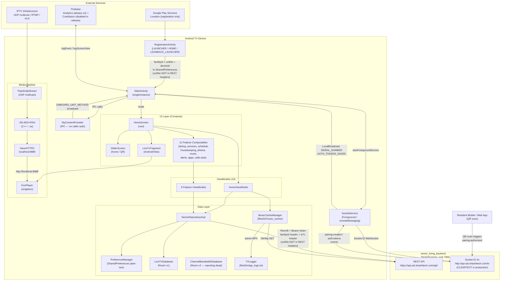

# Architecture: senior_living_tvapp

> **Doc status:** From-scratch v2.0, production HEAD 696ac267, 2026-06-17.
> Code is the sole source of truth. Every non-trivial claim cites a file:line.
> Related docs: [architecture-senior-living-product.md](./architecture-senior-living-product.md),
> [adr/ADR-001-pcc-webhook-convergent-state.md](./adr/ADR-001-pcc-webhook-convergent-state.md),
> [adr/ADR-003-chat-dual-channel-push.md](./adr/ADR-003-chat-dual-channel-push.md).
> **Production deployment in one week — see Design Gaps (§8) and Technical Debt (§9) for blockers.**

---

## 1. Purpose

`senior_living_tvapp` is an Android TV in-room resident companion for senior-living
facilities. It is installed on Android TV sets in individual resident units and
provides a D-pad-navigable (no touch required) interface covering:

- **Live TV** — encrypted IPTV stream playback (RTMP, DASH, HLS, UDP multicast)
  with hardware AES/RSA decryption via a custom JNI layer
- **Personal schedule** — unified calendar of facility activities and resident appointments
- **Dining** — daily menu display and today's specials; family-meal request submission
- **Wellness services** — salon, massage, and personal-training booking with real-time
  slot inquiry and appointment confirmation
- **Housekeeping** — service request submission (known empty-`residentId` bug; see §8)
- **Family photos** — resident photo gallery retrieved from backend
- **Music** — background music playback with offline MP3 cache
- **Embedded apps launcher** — launches third-party Android TV apps by package name
- **Notifications/alerts** — paginated facility-broadcast alert display
- **Calls** — UI-only stub; all handlers are empty; no real signaling exists (see §8)

Every HTTP request carries a `facilityId` header and an `isTv` header (value `"true"`).
`unitNo` is NOT sent as a REST header — it is persisted to `SharedPreferences` during
registration but not injected into the `getHeaders()` map (`SeniorRepositoryImpl.kt:267-281`).
`isTv` is a **header**, not a query parameter. The one exception is `getLiveTv`, which
additionally passes `isTVos=true` as a query parameter (`LiveTVNewViewModel.kt:64`,
`AppConstants.PARAM_IS_TVOS`).
Tenant isolation is header-driven and enforced server-side.

Sister repos in the same workspace: `senior_living_backend`, `senior_living_admin`,
`senior_living_reactnative`, `senior_living_staffapp`.

---

## 2. Tech Stack

| Layer | Technology | Version / Notes |
|---|---|---|
| Language | Kotlin | JVM 11 target (`app/build.gradle.kts:67-70`) |
| Min SDK | Android 8.0 (API 26) | `app/build.gradle.kts:19` |
| Compile SDK | 36 | `app/build.gradle.kts:15`; targetSdk 35 |
| UI framework | Jetpack Compose + AndroidX TV Material + TV Foundation | `androidx.tv.material`, `androidx.tv.foundation`; `app/build.gradle.kts:143-144` |
| Architecture pattern | MVVM + Clean Architecture (partial — no use-case layer) | |
| Dependency injection | Hilt (KSP processor) | `@HiltAndroidApp`, `@AndroidEntryPoint`, `@HiltViewModel` |
| Networking | Retrofit + OkHttp + kotlinx.serialization converter | `app/build.gradle.kts:147-151` |
| JSON | kotlinx.serialization | `ignoreUnknownKeys=true`, `isLenient=true` (`NetworkModule.kt:50-56`) |
| WebSocket | socket.io-client | Foreground service; Socket.IO protocol (`app/build.gradle.kts:196`) |
| Media | Media3 ExoPlayer (RTMP extension, DASH, HLS) | `app/build.gradle.kts:167-171` |
| JNI / NDK | Custom AES + RSA + base64 via OpenSSL | C++ in `app/src/main/cpp/`; `.so` for armeabi-v7a and arm64-v8a |
| Local relay | NanoHTTPD | Port 8888 localhost; bridges UDP multicast to HTTP for ExoPlayer (`app/build.gradle.kts:187`) |
| Local DB | Room v2 (SQLite) | Two separate databases: `LiveTVDatabase` (v1), `ChannelBandwidthDatabase` (v2) |
| Preferences | SharedPreferences (`PreferenceManager`) | Plain-text; no encryption; `PreferenceManager.kt:24` |
| Image loading | Coil (with SVG decoder) + Glide | Coil for Compose; Glide for live TV channel logo and EPG icon loading in Fragment/XML interop (`CustomChannelPresenter.kt:57-59`, `LiveTvFragment.kt:370-372`) |
| Paging | AndroidX Paging 3 | Alerts only (`AlertPagingSource.kt`) |
| Analytics | Firebase Analytics | `setAnalyticsCollectionEnabled(true)` hardcoded in all builds (`TVAnalytics.kt:25`) |
| Crash reporting | Firebase Crashlytics | Configured but `recordException()` commented out in release (`SeniorLivingApp.kt:44-45`) |
| Logging | Timber (DebugTree in debug; `CrashReportingTree` no-op in release) + `TVLogger` local JSON file | |
| File logging | `TVLogger` writes to `filesDir/app_logs.txt` | JSON array, unbounded growth, contains PII (`TVLogger.kt:136-167`) |
| Location | Google Play Services `FusedLocationProviderClient` | Registration only (`app/build.gradle.kts:198`) |
| QR codes | `QRCodeHelper` (local module) | Device pairing display |
| Animation | KenBurnsView | Live TV channel EPG image transitions in `LiveTvFragment` (`fragment_live_tv_new_design.xml:43`; import at `LiveTvFragment.kt:26`) — not the photo gallery |
| Shimmer | Facebook Shimmer | Loading skeletons |
| CI/CD | GitLab CI + Fastlane | Play Store internal track via Fastlane `deploy` lane |
| Code quality | SonarQube, Android Lint, Semgrep, Snyk, Trivy, Gitleaks | |
| Build | Gradle Kotlin DSL | `app/build.gradle.kts` |
| ABI filters | armeabi-v7a, arm64-v8a | `app/build.gradle.kts:30-32` |
| Signing | `senior_living_jks.jks` committed at repo root | Release `buildType` references `signingConfigs.getByName("debug")` — see §9 |

---

## 3. Key Components

### 3.1 Application and Entry Points

| Component | Class | Notes |
|---|---|---|
| Application class | `SeniorLivingApp` | `@HiltAndroidApp`; Coil image loader with SVG decoder; Timber init; `CrashReportingTree` is a no-op stub in release (`SeniorLivingApp.kt:37-47`) |
| Registration entry point | `RegistrationActivity` | `LAUNCHER + HOME + LEANBACK_LAUNCHER` (`AndroidManifest.xml:49`); `exported=true`; facility selection; `ONBOARD_UNIT_METHOD` broadcast receiver. No QR pairing — QR bootstrap is in `MainActivity`/`SocketService`. |
| Main app shell | `MainActivity` | `exported=true`; `launchMode=singleInstance`; hosts Compose content; registers 6 BroadcastReceiver actions; starts `SocketService`; uncaught exception handler writes to local log file |

### 3.2 Fragments (5, embedded in Compose via AndroidView)

| Class | Role |
|---|---|
| `RegistrationFragment` | Registration flow: facility list and geo-filter |
| `UnitEntryFragment` | Unit number entry in registration |
| `LiveTvFragment` | Live TV channel browser and preview player (`@AndroidEntryPoint`) |
| `ChannelBrowseFragment` | Leanback `BrowseFragment` channel category rows |
| `VideoStreamingForLiveTvFragment` | Full-screen live TV player |

### 3.3 Services (1)

| Class | Type | Notes |
|---|---|---|
| `SocketService` | Foreground, `foregroundServiceType="remoteMessaging"` | Persistent Socket.IO connection; QR pairing flow; token exchange; `logout()` exists (`SocketService.kt:228-231`) but is never called from any UI path |

### 3.4 Compose Screens / Root Composables (12)

Navigation is a `when (viewType)` string dispatch in `HomeScreen.kt:297` (inside `HomeScaffold`). No Jetpack
Navigation graph. No back-stack. No deep links.

| Composable | Dispatch Key (`viewType`) | Feature |
|---|---|---|
| `HomeScreen` | root navigation | Top-level tab and subcategory routing |
| `SliderScreen` | default (no match) | Home/welcome; image slideshow; QR display when no access token |
| `AlertContent` | `"Alert"` | Paginated facility alerts |
| `PhotosContent` | `"Photos"` / `"photoFrameWithoutText"` | Resident photo gallery |
| `ServiceReservation` | `"cardWithDateTimeSelection"` | Salon / massage / personal training booking |
| `HousekeepingContent` | `"housekeeping"` | Housekeeping request form |
| `TodaySpecials` | `"singleCenterImage"` | Today's food specials |
| `DinningContent` | `"timeWithRecyclerView"` | Dining menu |
| `MyScheduleScreen` | `"My_Schedules"` | Personal schedule calendar |
| `CallContent` | `"calls"` | Call contacts UI — **all handlers are empty stubs** |
| `AppsContent` | `"apps"` | Embedded app launcher |
| `MusicContent` | `"music"` | Music player |

### 3.5 Dialog Composables (5)

| Class | Purpose |
|---|---|
| `RequestFamilyMealDialog` | Family meal ordering |
| `HousekeepingCalendarDialog` | Housekeeping scheduling |
| `TimeSelectionDialog` | Appointment time slot picker |
| `DeveloperSettingsDialog` | Debug entry (password captured but never validated) |
| `SeniorLivingConfirmationDialog` | App-wide error/confirmation dialog; invoked from `MainActivity.kt:156` (`features/dialogs/familymeal/CommonConfirmationDialog.kt`) |

### 3.6 ViewModels (10, all `@HiltViewModel`)

| Class | Key Responsibilities |
|---|---|
| `HomeViewModel` | Home data fetch and offline cache; music playback; TV screen-off state; QR pairing data |
| `AlertViewModel` | Paging 3 alert feed |
| `LiveTVNewViewModel` | Channel list (Room cache + API, 24h TTL) |
| `DinningContentViewModel` | Dining menu and family meal request |
| `TodaysSpecialsViewModel` | Today's specials |
| `HousekeepingViewModel` | Housekeeping form submission (`residentId = ""` bug at line 55) |
| `MyScheduleViewModel` | Unified schedule |
| `PhotosViewModel` | Resident photos |
| `RegistrationViewModel` | Registration and facility fetch |
| `ServicesViewModel` | Service catalog, slot fetch, booking |

No ViewModel uses `SavedStateHandle`. Process death or configuration change loses
all transient state (booking progress, slot selection, music position).

### 3.7 Repository Layer

| Interface | Implementation | Notes |
|---|---|---|
| `SeniorRepository` | `SeniorRepositoryImpl` | All remote API calls; wraps `TvHomeApiService` via `BaseRepository.performNetworkCall` |
| `DbRepository` | `DbRepositoryImpl` | Room DB access; wraps `CategoryDao` and `ChannelBandwidthDao` |

`BaseRepository.performNetworkCall` normalizes `HttpException`, `SerializationException`,
`UnknownHostException`, and `IOException` into `Resource.Error` / `Resource.Failure`.
Broadcasts errors through `GlobalErrorManager` when `showErrorMessage=true`.

### 3.8 Retrofit API Interface (16 endpoints)

`TvHomeApiService` (`TvHomeApiService.kt`). Paths from `ApiEndPoints.kt`.

| # | Method | Path | Auth |
|---|---|---|---|
| 1 | GET | `android-tv/get-android-categories/{facilityId}` | Bearer |
| 2 | GET | `v1/livetv` | Bearer |
| 3 | GET | `menu` | Bearer |
| 4 | GET | `unified-schedule` | Bearer |
| 5 | GET | `salon/tv/services` | Bearer |
| 6 | GET | `massage/tv/services` | Bearer |
| 7 | GET | `private-training/tv/services` | Bearer |
| 8 | POST | `{category}/{serviceId}/available-slots` | Bearer |
| 9 | POST | `{category}/book-appointment` | Bearer |
| 10 | GET | `family-meal-requests/weekly-meals` | Bearer |
| 11 | POST | `family-meal-requests` | Bearer |
| 12 | POST | `housekeeping` | Bearer |
| 13 | POST | `tv/register` | `facilityId` header only (no token) |
| 14 | GET | `notifications` | Bearer |
| 15 | GET | `config/getAllfacility` | None |
| 16 | GET | `residents/pictures` | Bearer |

Token refresh (called directly by `TokenAuthenticator`, not via `TvHomeApiService`):
`POST tv/auth/refresh` (`ApiEndPoints.kt:20`).

### 3.9 Hilt DI Modules (5)

| Module | Provides |
|---|---|
| `NetworkModule` | Singleton `OkHttpClient` (SSL-bypassing `MyTrustManager`), `Retrofit`, `TvHomeApiService`, `DetailedLoggingInterceptor`, `Json` |
| `DatabaseModule` | `LiveTVDatabase`, `ChannelBandwidthDatabase`, `CategoryDao`, `ChannelBandwidthDao` |
| `RepositoryModule` | Binds `SeniorRepositoryImpl` to `SeniorRepository` |
| `DbRepositoryModule` | Binds `DbRepositoryImpl` to `DbRepository` |
| `MediaModule` | Singleton `ExoPlayer` instance (shared by music and live TV preview) |

### 3.10 Room Databases (2 databases, 2 entities)

| Database | Version | Entity | Migration |
|---|---|---|---|
| `LiveTVDatabase` | 1 | `CategoryEntity` | None defined |
| `ChannelBandwidthDatabase` | 2 | `ChannelBandwidthEntity` | v1 to v2 adds `exception` + `exception_message` columns |

`ChannelBandwidthDatabase` is populated by bandwidth tests but the API reporting call
body is entirely commented out (`MainActivity.kt:222-233`). Data is written, never
consumed by the server.

### 3.11 Paging Sources (1)

`AlertPagingSource` — page-key paging for the `GET notifications` endpoint.

### 3.12 Content Provider (1)

`MyContentProvider` — `exported=false`; authority `com.shashigroup.sal.tvapp.provider`.
Handles IPC `call()` for four methods:

- `ONBOARD_UNIT_METHOD` — facility/unit reassignment via Gson-parsed `UnitOnBoardItem`; no caller authentication (`MyContentProvider.kt:68-76`)
- `OPEN_PLAY_STORE_METHOD` — opens Play Store URL
- `OPEN_MANAGE_GOOGLE_ACCOUNT` — opens account settings
- `OPEN_SETTINGS` — broadcasts settings intent

### 3.13 Player / Media Utilities

`ExoPlayerManager`, `CommonExoPlayer`, `DecryptedDataSourceWithNewBuffer` (AES/RSA
decryption in the ExoPlayer data-source pipeline), `KotlinDemo` (JNI bridge to C++),
`PipedHttpServer` (NanoHTTPD at localhost:8888), `PipedHttpStream`, `PipedUdpStream`.

### 3.14 JNI / NDK Layer

`app/src/main/cpp/`: `aes/aes_wrapper.cpp`, `aes/aes_wrapper.h`, `aes/base64.cpp`,
`b64/b64.cpp`, `common.h`, OpenSSL headers under `include/crypto/`.
Pre-built `.so` libraries in `app/src/main/jniLibs/armeabi-v7a/` and
`app/src/main/jniLibs/arm64-v8a/`.
Kotlin bridge: `KotlinDemo.kt`.

### 3.15 Build Flavors (3)

| Flavor | App ID Suffix | REST Base URL | Socket.IO URL |
|---|---|---|---|
| `staging` | `.staging` | `https://staging-api.sal.shashitech.com/api/` | `http://staging-api.sal.shashitech.com/tv` |
| `preproduction` | `.preproduction` | `https://preproduction-api.sal.shashitech.com/api/` | `https://preproduction-api.sal.shashitech.com/tv` |
| `production` | _(none)_ | `https://api.sal.shashitech.com/api/` | `http://api.sal.shashitech.com/tv` |

The production Socket.IO URL uses `http://` — cleartext (`app/build.gradle.kts:100`).

### 3.16 Annotation Constant Objects (15)

`AnalyticsConstants`, `AppConstants`, `BroadcastConstants`, `BroadcastType`,
`DatabaseConstants`, `ErrorConstants`, `FormatConstants`, `LogConstants`,
`NetworkConstants`, `Parameters`, `PlayerConstants`, `PreferenceKeys` (86
keys — many are hotel-app legacy remnants; `PreferenceKeys.kt` has 86 `const val`
declarations across 168 lines), `ProviderConstants`, `StorageConstants`,
`ThemeConstants`.

### 3.17 Utility Classes

`TVLogger`, `TVAnalytics`, `MusicCacheManager`, `GlobalErrorManager`, `WifiUtils`
(deprecated WiFi APIs on API 33+), `Utils`, `ImageUtils`, `TimeProcessing`,
`DateFormatType`, `BroadcastActions`, `BandwidthResult`, `Resource<T>` (sealed
class: Success / Error / Failure / Loading), `MyBindingAdapter`,
`generateQrCodeFromLib`.

**Total Kotlin source files: 151.**

---

## 4. Architecture Diagram and Key Flows

### 4.1 Architecture Diagram



### 4.2 Startup and Registration Flow

```
Power on → RegistrationActivity (LAUNCHER / HOME)
  ├── facilityId empty in PreferenceManager?
  │    YES → GET config/getAllfacility (no auth token required)
  │           → FusedLocationProviderClient (fine + coarse location)
  │           → filter facilities by distance radius
  │           → user D-pad selects facility → UnitEntryFragment
  │           → user enters unit number
  │           → POST tv/register {deviceId, unitNo} with facilityId header
  │           → save facilityId, unitNo, deviceId, pimKey, liveTvServerUrl,
  │             isUdpAvailable to SharedPreferences
  │           → startActivity(MainActivity)
  │    NO  → startActivity(MainActivity) directly
  │
  └── ONBOARD_UNIT_METHOD ContentProvider IPC can reassign facilityId + unitNo
      at any time from any app on the device (no caller authentication)
```

Device ID derivation: `Utils.getWidevineDeviceId()` reads `MediaDrm` with Widevine
UUID `edef8ba9-79d6-4ace-a3c8-27dcd51d21ed`; falls back to `Settings.Secure.ANDROID_ID`.

### 4.3 QR Pairing and Authentication Flow

```
MainActivity.onCreate()
  → startForegroundService(SocketService)

SocketService.onStartCommand()  (SocketService.kt:71-82)
  → new bare OkHttpClient (no SSL bypass) with facilityId + unitNo + deviceId headers
  → IO.socket(BASE_URL_SOCKET, {transports: [WebSocket]})
  → socket.connect()

Socket EVENT_CONNECT
  └── accessToken empty? → emit pairing:create {facilityId, deviceId}

Backend emits pairing:created {qrToken, sessionId}  (SocketService.kt:125-139)
  → currentSessionId = sessionId
  → broadcast SERIAL_NUMBER {qrToken, sessionId}

MainActivity.pairingReceiver (SERIAL_NUMBER)  (MainActivity.kt:63-68)
  → HomeViewModel.updatePairingData(sessionId, qrToken)
  → SliderScreen shows QR code generated from `sessionId` (NOT `qrToken`)
    (SliderScreen.kt:130-131: `generateQrCodeFromLib(sessionId, ...)`)
    qrToken is broadcast but never used for QR generation

Resident scans QR on companion mobile app
Backend emits pairing:authorized  (SocketService.kt:149-157)
  → SocketService emits auth:exchange {sessionId}

Backend emits auth:tokens {accessToken, refreshToken}  (SocketService.kt:158-176)
  → preferenceManager.accessToken = accessToken         [plain-text SharedPreferences]
  → preferenceManager.refreshToken = refreshToken       [plain-text SharedPreferences]
  → Log.e(TAG, "refreshToken: ${tokensResponse.refreshToken}")  ← SECURITY BUG line 169
  → broadcast AUTH_TOKENS_SAVED

MainActivity.pairingReceiver (AUTH_TOKENS_SAVED)  (MainActivity.kt:103-106)
  → HomeViewModel.loadInitialData(isSilent=true)

pairing:expired  (SocketService.kt:145-148)
  → re-emit pairing:create (loop restart)
```

### 4.4 Home Data Flow (Normal Operation)

```
HomeViewModel.loadInitialData()
  → SeniorRepositoryImpl.getHomeData()
    → GET android-tv/get-android-categories/{facilityId}
      headers: Bearer token + facilityId header + isTv header
      (unitNo is stored in SharedPreferences but NOT sent as a REST header)
      SUCCESS → PreferenceManager.saveHomeData(json) [offline cache]
                emit Resource.Success(TvHomeData)
      FAILURE → PreferenceManager.getHomeData() [read offline cache]
                emit Resource.Success(cached TvHomeData)

HomeScreen collects HomeUiState
  → CategoryBottomBar from server-defined categories
  → SubCategoryBottomBar per category
  → when (viewType) → dispatch to feature Composable
```

### 4.5 Live TV Playback Flow

```
Tab selected → "liveTv" viewType → AndroidView(LiveTvFragment)
LiveTvFragment (Hilt-injected)
  → LiveTVNewViewModel.loadChannels()
    → check Room CategoryDao timestamp: valid if < 24h
    → if stale: GET v1/livetv → insert Room → emit to UI

User selects channel:

  UDP multicast path (encrypted):
    PipedUdpStream reads UDP multicast packets
    → DecryptedDataSourceWithNewBuffer
        → KotlinDemo.kt JNI calls C++ AES + RSA decryption
          (pimKey read from PreferenceManager)
    → PipedHttpStream wraps decrypted bytes
    → PipedHttpServer (NanoHTTPD, localhost:8888) serves HTTP/MPEG-TS
    → ExoPlayer consumes http://localhost:8888

  HLS / DASH path:
    ExoPlayer consumes stream URL directly
    (via DecryptedDataSourceWithNewBuffer if encrypted)

Full-screen:
  HomeScreen FullScreenPlayerOverlay (HomeScreen.kt:97-100)
    → AndroidView → VideoStreamingForLiveTvFragment via FragmentManager
```

### 4.6 Token Refresh Flow

```
OkHttp 401 intercepted by TokenAuthenticator.authenticate()  (TokenAuthenticator.kt:29)
  → synchronized(this) {
      double-check: if preferenceManager.accessToken changed since request,
        retry with new token (concurrent-refresh guard)  (TokenAuthenticator.kt:39-43)
      else:
        new plain OkHttpClient()  [no MyTrustManager — different from main client]
        POST tv/auth/refresh {refreshToken} with facilityId header  (TokenAuthenticator.kt:46-61)
          SUCCESS → preferenceManager.accessToken = newAccessToken  (TokenAuthenticator.kt:72)
                    NOTE: preferenceManager.refreshToken is NOT updated  (TokenAuthenticator.kt:71-72)
                    retry original request with new Authorization header
          FAILURE → return null (original request fails to caller)
    }
```

Risk: if the backend rotates refresh tokens on use and the old `refreshToken` in
SharedPreferences is now invalid, the next 401 will fail to refresh and all
subsequent API calls will fail, requiring a full QR re-pair.

### 4.7 Service Booking Flow

```
Tab "cardWithDateTimeSelection" → ServiceReservation composable
  → ServicesViewModel.fetchServices(categoryName)
    → GET salon|massage|private-training/tv/services → SalonServiceWrapper

User selects service → ServicesViewModel.fetchAvailableSlots(category, serviceId)
  → POST {category}/{serviceId}/available-slots {noOfDays: 7}

User selects time slot → ServicesViewModel.bookAppointment(...)
  → POST {category}/book-appointment
    {startTime, endTime, date, salonServiceId|massageServiceId|privateTrainingId}
  → Resource.Success → reset booking state; show confirmation dialog
```

### 4.8 Music Playback and Caching Flow

```
HomeViewModel.loadInitialData()
  → MusicCacheManager.downloadTrackInBackground(trackId, url)
    → CoroutineScope(Dispatchers.IO + SupervisorJob())  (MusicCacheManager.kt:33)
    → for each track: OkHttpClient GET → filesDir/music_cache/{trackId}.mp3
    → NO size limit, NO eviction, NO cache invalidation when server removes track

MusicContent → HomeViewModel.playMusic(trackId)
  → MusicCacheManager.getCachedFile(trackId)
    → file exists: ExoPlayer.setMediaItem(local file URI)
    → absent: ExoPlayer.setMediaItem(streaming URL)
  → ExoPlayer.play()
```

---

## 5. Data and State

### 5.1 SharedPreferences (`PreferenceManager`)

Single file `SENIORS_LIVING_PREFS`. Plain-text; no `EncryptedSharedPreferences` (`PreferenceManager.kt:24`).

| Key | Type | Written by | Survives `clearAllData()` |
|---|---|---|---|
| `Authorization` (accessToken) | String | `SocketService`, `TokenAuthenticator` | No |
| `refreshToken` | String | `SocketService` initial write; never updated on refresh | No |
| `facilityId` | String | `RegistrationActivity`, `MyContentProvider` IPC | Yes |
| `unitNo` | String | `RegistrationActivity`, `MyContentProvider` IPC | Yes |
| `deviceId` | String | `RegistrationActivity` | Yes |
| `pimKey` | String | Registration API response | No |
| `liveTvServerUrl` | String | Registration API response | No |
| `isUdpAvailable` | Boolean | Registration API response | No |
| `emailAddress` | String | `HomeViewModel` from home data response | No |
| `cName` | String | `SocketService` from pairing response | No |
| `TV_ROOM_DATA` | JSON String | `HomeViewModel` (offline fallback cache) | No |
| 86 defined keys (many legacy hotel-app keys) | Various | Largely unused in this app | Varies |

`clearAllData()` preserves only `unitNo`, `facilityId`, `deviceId` (`PreferenceManager.kt:38-46`).

### 5.2 Room Databases

`LiveTVDatabase` (v1): channel categories cached after API fetch.
Cache TTL: 24 hours (timestamp checked in `LiveTVNewViewModel`).
No server-side invalidation mechanism.

`ChannelBandwidthDatabase` (v2): per-channel bandwidth measurements.
Written by bandwidth tests. API reporting path is dead (`MainActivity.kt:222-233`).
Data is written but never forwarded to the server.

### 5.3 In-Memory ViewModel State

All ViewModels emit `MutableStateFlow<XxxUiState>` collected in Compose via
`collectAsState()`. No `SavedStateHandle` usage. Configuration changes and process
death clear all in-progress transient state.

### 5.4 File System

| Path | Owner | Size Control |
|---|---|---|
| `filesDir/music_cache/{trackId}.mp3` | `MusicCacheManager` | None — unbounded growth |
| `filesDir/app_logs.txt` | `TVLogger` | None — unbounded JSON array, never rotated |

### 5.5 Backend Data Schema

The TV app is a pure consumer; it owns no persistent backend state. Resident
identity is established via bearer token; facility and unit identity via HTTP
headers. For backend schema cross-reference see `../architecture-senior_living_backend.md`.

---

## 6. External Dependencies

| Service | Kind | Direction | Notes |
|---|---|---|---|
| `senior_living_backend` REST API (`https://api.sal.shashitech.com/api/`) | HTTP REST | Outbound | Retrofit + OkHttp; Bearer token; `facilityId` header + `isTv` header on every call (`unitNo` is NOT a REST header); 16 endpoints; SSL bypassed by `MyTrustManager` |
| `senior_living_backend` Socket.IO (`http://api.sal.shashitech.com/tv`) | WebSocket | Bidirectional | **Cleartext HTTP in production** (`app/build.gradle.kts:100`); handles QR pairing and token exchange; 6 Socket.IO event types |
| `tv/auth/refresh` | HTTP REST | Outbound | Called by `TokenAuthenticator` via a bare `OkHttpClient` (no SSL bypass) — different TLS behavior from main client |
| Firebase Analytics | SDK | Outbound | `setAnalyticsCollectionEnabled(true)` hardcoded; always on; sends `emailAddress`, `roomNo`, `deviceId` with every event (`TVAnalytics.kt:24-25`) |
| Firebase Crashlytics | SDK | Outbound | SDK configured; `recordException()` commented out in production — crash data not reported (`SeniorLivingApp.kt:44-45`) |
| Google Play Services (Location) | SDK | Outbound | `FusedLocationProviderClient`; used only during registration for facility geo-filter; not used post-onboarding |
| IPTV infrastructure | UDP multicast / RTMP / HLS | Inbound | Stream URL and `pimKey` encryption key received at registration; JNI AES+RSA decryption layer in the media pipeline |
| Google Play Store | Android Intent | Outbound | `MyContentProvider.OPEN_PLAY_STORE_METHOD` navigates to Play Store URL |
| GitLab CI / Google Play | CI/CD | Outbound | Fastlane `deploy` lane uploads signed AAB to Play Store internal track |

---

## 7. Security and Multi-tenancy

### 7.1 Multi-tenancy Mechanism

Every REST API call carries a `facilityId` header and an `isTv` header injected by
`SeniorRepositoryImpl.getHeaders()` (`SeniorRepositoryImpl.kt:267-281`). `unitNo` is
stored in `SharedPreferences` during registration but is NOT sent as a REST header.
Backend is responsible for scoping all queries to that facility. No facility-level
signed secret exists; bearer token + `facilityId` header is the full isolation guarantee.
A replayed token with a different `facilityId` header could cross-tenant if the backend
does not independently verify facility membership for the token.

### 7.2 SSL/TLS Bypass — Critical

`NetworkModule.kt:89-93`: `MyTrustManager` has empty `checkClientTrusted()` and
`checkServerTrusted()` — **trusts all certificates unconditionally**. `hostnameVerifier`
at line 74 always returns `true` — **hostname verification disabled**. This applies
to all REST API calls in production. MITM attacks are trivially possible.

The CLAUDE.md comment describes this as "intentional for staging/closed-network
environments" but there is no build-type or flavor conditional in `NetworkModule.kt` —
the same trust-all client is used for the production flavor.

### 7.3 Token Storage — Plain-text

`accessToken` and `refreshToken` stored in default `SharedPreferences`
(`PreferenceManager.kt:24`). No `EncryptedSharedPreferences`. On rooted devices
any app with root access can read all tokens.

### 7.4 Refresh Token Logged to Logcat — Critical

`SocketService.kt:169`: `Log.e(TAG, "refreshToken: ${tokensResponse.refreshToken}")`.
The full refresh token is written to Android logcat at ERROR priority in every build
including production. Accessible via `adb logcat` on any USB-connected debug session.

### 7.5 Production Socket.IO URL is Cleartext HTTP

`app/build.gradle.kts:100`: `BASE_URL_SOCKET = "http://api.sal.shashitech.com/tv"`.
Socket.IO traffic including the token exchange event `auth:tokens` travels over
cleartext HTTP in production. Combined with `usesCleartextTraffic="true"` in
`AndroidManifest.xml:37`, HTTP is permitted system-wide.

The `app/src/main/res/xml/network_security_config.xml` reinforces this: the
`<base-config cleartextTrafficPermitted="true">` applies to **all domains**, not
just the socket URL, and trusts only `system` trust anchors — meaning the socket's
cleartext HTTP traffic is governed by the NSC while REST API traffic bypasses it via
`MyTrustManager`. These two mechanisms operate independently and both permit
unencrypted traffic: the NSC for socket connections, the custom `OkHttpClient` for
REST calls.

### 7.6 No Code Obfuscation

`app/build.gradle.kts:61`: `isMinifyEnabled = false` in release `buildType`. All
class names, API endpoint paths, encryption logic parameters, and error messages
are visible in the production APK via decompilation.

### 7.7 Signing Configuration Bug

`app/build.gradle.kts:63`: release `buildType` sets
`signingConfig = signingConfigs.getByName("debug")`. The declared `release` signing
config (lines 32-39) is nested inside `defaultConfig {}` instead of at the `android {}`
level — this is non-standard and means the `release` buildType cannot resolve it during
the normal configuration phase, causing the fallback to `getByName("debug")`.

The `release` signing config references Gradle properties named `321@SeniorLiving`
(storePassword and keyPassword) and `seniorliving` (keyAlias) — not the conventional
`KEYSTORE_PASSWORD`/`KEY_PASSWORD`/`KEY_ALIAS` names stated in `CLAUDE.md §5`.
Production APKs built outside CI, or CI pipelines supplying the wrong property names,
will be signed with the Android debug keystore.

### 7.8 In-Repo Keystore

`senior_living_jks.jks` is committed at the repo root. Anyone with read access to
the repository has the release signing keystore.

### 7.9 ContentProvider IPC — No Caller Authentication

`MyContentProvider.ONBOARD_UNIT_METHOD` (`MyContentProvider.kt:68-76`): any app on
the device can call this method to reassign the TV to a different facility and unit
without any caller validation. Uses Gson for parsing (inconsistent with the rest of
the codebase which uses kotlinx.serialization).

### 7.10 Analytics PII — Always On

`TVAnalytics.kt:25`: `setAnalyticsCollectionEnabled(true)` is hardcoded. Every
Firebase Analytics event includes `emailAddress` (as `reservationId`), `unitNo`,
and `deviceId`. Cannot be disabled by facility preference or build flavor.

### 7.11 Log File Contains PII

`TVLogger.kt:136-167`: every `PortalLog` entry written to `filesDir/app_logs.txt`
contains `user_email_id`, `room_no`, and `device_id_`. File is unbounded,
never rotated, and never uploaded — it accumulates indefinitely on device storage.

### 7.12 Hardcoded Log Zip Password

`CommonUtils.kt:12`: `appLogZipFolderPassword = "321@Shashigroupzip"`. Trivially
reversible from APK decompilation.

### 7.13 `WRITE_SECURE_SETTINGS` Permission Declared But Unused

`AndroidManifest.xml:10`: declared but no code calls APIs requiring it. Signature-level
permission; may be a hotel-app legacy remnant.

---

## 8. Design Gaps

These are features that appear as navigable UI elements at production HEAD 696ac267
but are non-functional. A resident selecting any of these will encounter a broken or
empty experience.

| Severity | Issue | Evidence (file:line) | Decision needed before deploy? | Recommended fix |
|---|---|---|---|---|
| **Critical** | **Calls feature is a complete stub** — audio and video call `onClick` handlers are empty comments; contact list is hardcoded with `randomuser.me` image URLs; no ViewModel, no API, no signaling protocol | `CallContent.kt:203` (`onClick = { /* Handle audio call */ }`), `CallContent.kt:227` (`onClick = { /* Handle video call */ }`) | **Yes** | Hide the Calls tab from the server-side category config, or replace with an explicit "Coming Soon" UI state; do not ship a tappable dead feature |
| High | **Logout is unreachable** — `SocketService.logout()` calls `clearAllData()` only (the socket is NOT disconnected — socket.disconnect() is only called in `onDestroy()`; `SocketService.kt:228-231`); the UI logout lambda is commented out; a logged-out device keeps the WebSocket alive until the service is destroyed; no resident can log out or trigger a re-pair | `HomeScreen.kt:274-275`, `SocketService.kt:228-231`, `SocketService.kt:204` | Yes | Uncomment the logout trigger, call `socket?.disconnect()` inside `logout()`, or add a logout option in the developer settings or pairing screen |
| High | **`residentId = ""`** hardcoded in every housekeeping request — every request goes to backend with empty resident identifier; backend must identify resident from bearer token alone | `HousekeepingViewModel.kt:55` | Yes | Read `residentId` from the home data API response; persist to `PreferenceManager`; pass it in `HousekeepingRequest` |
| High | **Channel bandwidth reporting is dead** — `ChannelBandwidthDatabase` is populated but `callAPIFor()` body is entirely commented out; server never receives channel quality telemetry | `MainActivity.kt:221-233` | No (non-user-facing telemetry) | Either implement the reporting call or remove `ChannelBandwidthDatabase` and all related dead code |
| Medium | **Firebase Crashlytics silently disabled in production** — `CrashReportingTree` is a no-op stub; `FirebaseCrashlytics.getInstance().recordException()` is commented out; production crashes are not reported | `SeniorLivingApp.kt:44-45` | Yes — production crashes will be invisible | Uncomment the Crashlytics calls; verify `google-services.json` targets the production Firebase project |
| Medium | **Video background on home screen is double-dead** — `VideoPlayerSlider()` function body is entirely inside a block comment (`SliderScreen.kt:184-211`); call site always passes `videoUrls = null` (`HomeScreen.kt:371`) | `SliderScreen.kt:184`, `HomeScreen.kt:371` | No (visual enhancement) | Implement video background or remove the dead composable and unused parameter from `SliderScreen` |
| Medium | **Developer Settings Dialog is non-functional** — password field is displayed and captured but never validated against `PreferenceKeys.PASSWORD_DEVELOPER` | `DeveloperSettingsDialog.kt` (no validation logic present) | No | Add password validation logic or remove the dialog entirely to eliminate dead UI |
| Medium | **"Clear Credentials" card in Apps screen does nothing** — `onClick = { }` empty lambda | `AppsContent.kt:296` | No | Wire to `preferenceManager.clearAllData()` plus socket disconnect, or remove the card |
| Medium | **Music does not pause when screen turns off** — `MainActivity.pausePlayer()` is a documented empty stub | `MainActivity.kt:179-181` | No (user experience) | Call `homeViewModel` music pause from the `ACTION_SCREEN_OFF` broadcast handler in `MainActivity.kt:84-87` |
| Low | **No Jetpack Navigation graph** — navigation is a `when (viewType)` string dispatch; no back-stack, no deep links, no type-safe routes, no transition animations | `HomeScreen.kt:297` | No (architecture concern) | Document as intentional or migrate to Jetpack Navigation for type safety and back-stack support |
| Low | **No `SavedStateHandle` in any ViewModel** — process death or configuration change loses all transient state | All 10 `@HiltViewModel` classes | No | Add `SavedStateHandle` to booking-flow ViewModels (`ServicesViewModel`, `DinningContentViewModel`, `HousekeepingViewModel`) |
| Low | **`signingConfigs` block placed inside `defaultConfig` (non-standard)** — `signingConfigs { create("release") {...} }` is nested inside `defaultConfig {}` instead of at the `android {}` level; this prevents `buildTypes.release` from resolving it during normal configuration phase and is a contributing cause of the debug-keystore signing bug | `app/build.gradle.kts:32-39` | Yes (blocks correct release signing) | Move `signingConfigs` block to the `android {}` scope level |

---

## 9. Technical Debt

| Severity | Issue | Evidence (file:line) | Recommended fix |
|---|---|---|---|
| **Critical** | **SSL certificate bypass in production** — `MyTrustManager` trusts all certs; hostname verification disabled; all REST API calls vulnerable to MITM | `NetworkModule.kt:74`, `NetworkModule.kt:89-92` | Validate production backend cert chain; remove `MyTrustManager` and disable `hostnameVerifier` override for the `production` flavor; keep only for staging if internal network truly requires it |
| **Critical** | **Refresh token logged to logcat in release builds** | `SocketService.kt:169` | Remove the `Log.e` line; this is an active credential exfiltration vector via USB debug sessions |
| High | **Production Socket.IO URL is cleartext HTTP** | `app/build.gradle.kts:100` | Change to `https://` before production deployment; update `usesCleartextTraffic` to `false` or scope to localhost only |
| High | **Release APK signed with debug keystore** — the `signingConfigs { create("release") }` block is nested inside `defaultConfig {}` instead of at the `android {}` level (non-standard; `app/build.gradle.kts:32-39`), so `release` buildType cannot reference it and falls back to `getByName("debug")` | `app/build.gradle.kts:63` | Move `signingConfigs` block to `android {}` level; change release `buildType` to `signingConfig = signingConfigs.getByName("release")`; ensure CI supplies the actual Gradle property names: `321@SeniorLiving` (storePassword + keyPassword) and `seniorliving` (keyAlias) — NOT the generic `KEYSTORE_PASSWORD`/`KEY_PASSWORD`/`KEY_ALIAS` names |
| High | **Release keystore committed to repo** | `senior_living_jks.jks` at repo root | Move to CI secret store (GitLab CI variable as base64-encoded file); remove from repo; rotate if already cloned externally |
| High | **Token refresh does not update `refreshToken`** — if backend rotates refresh tokens on use, the next 401 cycle will fail and the device must re-pair via QR | `TokenAuthenticator.kt:71-72` | Update `preferenceManager.refreshToken` in `TokenAuthenticator` after successful refresh; confirm backend token rotation policy with backend team |
| High | **Token storage is plain-text SharedPreferences** | `PreferenceManager.kt:24` | Migrate to `EncryptedSharedPreferences` (`androidx.security.crypto`) |
| Medium | **Token refresh uses a different OkHttpClient** — bare client with no `MyTrustManager`; if backend cert is self-signed, refresh fails while other calls succeed (inconsistent failure mode) | `TokenAuthenticator.kt:46` | After resolving T1, ensure both clients share the same validated TLS configuration |
| Medium | **Music cache: no size limit, no eviction** — MP3 files accumulate indefinitely; budget Android TV devices typically have 4–8 GB internal storage | `MusicCacheManager.kt:32-33` | Add LRU eviction (e.g., 500 MB cap via `DiskLruCache`); invalidate tracks removed server-side |
| Medium | **Log file: unbounded growth and PII at rest** — `app_logs.txt` appends forever; contains `user_email_id`, `room_no`, `device_id_` | `TVLogger.kt:169-206` | Add size-based rotation (e.g., truncate at 10 MB); consider encrypting or redacting PII fields |
| Medium | **Deprecated WiFi APIs** — `WifiUtils.kt` uses `wifiManager.connectionInfo` removed on API 33+ (targetSdk=35); may return null or crash on modern Android TV firmware | `WifiUtils.kt` | Migrate to `NetworkCallback` + `WifiInfo` from `NetworkCapabilities.transportInfo` |
| Medium | **Fragments mixed with Compose** — five classic Android Fragments embedded via `AndroidView`; competing UI systems with distinct lifecycles | `LiveTvFragment.kt`, `VideoStreamingForLiveTvFragment.kt`, `RegistrationFragment.kt`, `UnitEntryFragment.kt`, `ChannelBrowseFragment.kt` | Migrate to pure Compose over time; document the Fragment boundary explicitly so `FragmentManager` usage inside Compose callbacks does not cause back-stack mismatches |
| Medium | **Single ExoPlayer instance shared between music and live TV** — `MediaModule.kt` provides a singleton; concurrent playback (background music + live TV preview) requires undocumented manual coordination | `MediaModule.kt` | Create separate `ExoPlayer` instances for music and TV media; or document ownership/priority protocol |
| Low | **No code obfuscation (ProGuard / R8)** — `isMinifyEnabled = false` in release | `app/build.gradle.kts:61` | Enable `isMinifyEnabled = true`; add Retrofit + kotlinx.serialization reflection rules to `proguard-rules.pro` |
| Low | **Legacy hotel-app `PreferenceKeys`** — 86 keys defined; many unused in this app (`HOTEL_CODE`, `HOTEL_ID`, `HVAC_DETAIL`, `IS_AIRPLAY_SERVICE_STARTED`, etc.) | `PreferenceKeys.kt:84-119` | Audit and remove unused keys; reduces dead SharedPreferences surface area |
| Low | **Gson used only in `MyContentProvider`** — inconsistent with rest of codebase (kotlinx.serialization); dual serializer dependency | `MyContentProvider.kt:70` | Migrate `UnitOnBoardItem` parsing to kotlinx.serialization; remove Gson dependency from `app/build.gradle.kts` |
| Low | **`WRITE_SECURE_SETTINGS` permission declared but unused** | `AndroidManifest.xml:10` | Remove to minimize permission attack surface |
| Low | **Minimal test coverage** — 2 ViewModel unit tests (`LiveTVNewViewModelTest.kt` 98 lines, `HomeViewModelTest.kt` 97 lines, both using mockk + Truth + runTest) and 1 UI instrumentation test (`HomeScreenTest.kt`) are present; the remaining 8 ViewModels, repository layer, and all service-booking flows have no coverage | `app/src/test/`, `app/src/androidTest/` | Add unit tests for remaining ViewModels and `SeniorRepositoryImpl`; add instrumentation tests for registration and QR pairing flows |
| Low | **`CommonUtils.kt` contains hotel-app legacy constants** — `appLogFolderName = "shashi_reservation_app_logs"` references hotel product namespace; `speedTestToServer = "dummy"` is dead telemetry | `CommonUtils.kt:10-14` | Rename constants to the senior living namespace; remove or implement `speedTestToServer` |
| **Critical** | **Access token logged to logcat on every API call** — `Log.e(NetworkConstants.HEADER_AUTHORIZATION, "getHeaders: $token")` writes the full Bearer access token at ERROR priority on every request in every build flavor including production; `DetailedLoggingInterceptor.kt:30` additionally logs `request.headers` in full, which also includes the Authorization header | `SeniorRepositoryImpl.kt:278`, `DetailedLoggingInterceptor.kt:30` | Remove both log statements before production deployment; accessible via `adb logcat` on any USB-connected session |
| High | **`network_security_config.xml` permits cleartext for all origins** — `<base-config cleartextTrafficPermitted="true">` applies globally, not just to the socket URL; uses only `system` trust anchors; operates independently of `MyTrustManager` (NSC governs socket connections, `MyTrustManager` governs REST via OkHttp); combined effect is that no traffic path enforces certificate pinning or restricts cleartext | `app/src/main/res/xml/network_security_config.xml` | Restrict `cleartextTrafficPermitted` to `localhost` only (for NanoHTTPD); add `<domain-config>` entries for the production API and socket domains with `cleartextTrafficPermitted="false"` |
| Low | **`androidx.navigation.compose` imported but unused** — declared in `app/build.gradle.kts:140` but no `NavHost`, `NavController`, or `rememberNavController` call exists anywhere in the codebase; dead dependency increases APK size | `app/build.gradle.kts:140` | Remove the dependency; navigation is handled by the `when (viewType)` dispatch in `HomeScreen.kt:297` |

---

## Appendix: Component Counts (production HEAD 696ac267)

| Category | Count | Verified via |
|---|---|---|
| Kotlin source files | 151 | `find app/src/main -name "*.kt" \| wc -l` |
| Activities | 2 | `AndroidManifest.xml` |
| Fragments | 5 | Source scan |
| Foreground Services | 1 | `AndroidManifest.xml` |
| Compose root screens | 12 | `HomeScreen.kt` dispatch + feature packages |
| Dialog Composables | 5 | `features/dialogs/` |
| ContentProviders | 1 | `AndroidManifest.xml` |
| `@HiltViewModel` ViewModels | 10 | Source scan |
| Repository interfaces | 2 | `domain/repository/` |
| Repository implementations | 2 | `core/data/repository/` |
| Retrofit API interfaces | 1 | `TvHomeApiService.kt` |
| Retrofit endpoints | 16 | `ApiEndPoints.kt` + `TvHomeApiService.kt` |
| Hilt DI modules | 5 | `core/di/` |
| Room databases | 2 | `core/data/database/` |
| Room entities | 2 | `core/data/models/` |
| Room DAOs | 2 | `core/data/dao/` |
| Paging sources | 1 | `AlertPagingSource.kt` |
| WorkManager workers | 0 | Source scan |
| Jetpack Navigation graphs | 0 | Source scan |
| Build flavors | 3 | `app/build.gradle.kts` |
| JNI / NDK C++ modules | 3 (aes, b64, common) | `app/src/main/cpp/` |
| Pre-built ABI targets | 2 (armeabi-v7a, arm64-v8a) | `app/build.gradle.kts:30-32` |
| Security findings (Critical + High) | 11 | §7 |
| Design gaps | 13 | §8 |
| Technical debt items | 22 | §9 |
