# Senior Living Backend — Data Schema (Definitive)

> **Doc status / baseline:** re-verified against the `production` branch @ `465e88fb` as of 2026-07-03 (prior baseline: `staging` @ `62de4747`, 2026-06-21).
> **2026-07-12 cross-cutting delta (backend HEAD `e075f578`, not yet a full re-verification pass):** `Message.recipients: string[]` + 2 new indexes; `Resident.phone`/`countryCode` now optional, new `isSynced`/`pccSyncStatus`; `CareConference.recordings[].transcript`/`summary`/`updatedSummary` now KMS-envelope encrypted; new 60th model `HotelDemoSlideshow`. See §2.1, §2.6, §2.10, §2.60 below and [`review-senior_living_backend.md`](../reviews/2026-07-12/review-senior_living_backend.md). This delta was reconciled from the per-repo review's cross-cutting notes, not from an independent full re-read of every model file — treat as a targeted update, not a full re-verification.
> **Source of truth:** the `production` branch. Code is the only source of truth.
> This document describes **only** what exists on `production` HEAD.
> Half-built / mock / dead schema constructs are NOT documented as features — they appear under **Design Gaps** and **Technical Debt**.
> Every non-trivial claim cites `file:line`.
>
> **Database:** MongoDB via Mongoose. **60 model files** in `src/models/` (one file, `AndroidCategories.ts`, omits the `.model` infix). All 60 are catalogued in §2 (59 re-verified at the 2026-07-03 baseline + `HotelDemoSlideshow`, new §2.60).

---

## 1. Overview & conventions

### 1.1 Identifiers

| Concern | Convention |
|---|---|
| **Primary key** | Mongoose default `_id` (`ObjectId`) on every collection. No custom `_id` types. |
| **Cross-system join key** | `cName` (String) = the AWS Cognito `Username`, which is the user's **phone number in E.164 format** (e.g. `+14155551234`). Used to link Resident / Staff / Admin / FamilyMember documents to Cognito identity and to each other. Cognito username is set to E.164 phone at `AdminCreateUserCommand` time (`src/lib/cognitoUser.ts`). |
| **Intra-document refs** | Two distinct patterns coexist: (a) **ObjectId `ref`** (e.g. `FamilyMember.residentId → Resident`); (b) **String `cName` "soft refs"** resolved via Mongoose virtuals with `foreignField: 'cName'` (e.g. `Care.resident`). The String-ref pattern dominates appointment/care models. |
| **External IDs** | PCC (PointClickCare) IDs on `Resident` (`pcc_patientId`, `pccPatientId`, `pcc_facId`, `pcc_orgUuid`); TELS work-order IDs on `ServiceRequest`; Zoom meeting IDs and Google Calendar event IDs on conference/appointment models. |

### 1.2 Timestamps

| Pattern | Models |
|---|---|
| `{ timestamps: true }` → `createdAt` + `updatedAt` | Majority of models. |
| `createdAt` only (`updatedAt: false`) | `WebPushSubscription` (`src/models/WebPushSubscription.model.ts`). |
| **No `timestamps` option** — timestamps managed manually as plain `Date` fields | `TvDevice`, `TvPairingSession`, `TvAuthToken`, `NotificationSentLog`. These set `createdAt`/`issuedAt`/`sentAt` with `default: now` manually. |

### 1.3 Soft-delete

There is **no single soft-delete convention** — three coexisting schemes:

| Scheme | Field | Models |
|---|---|---|
| Nullable timestamp | `deletedAt: Date \| null` (default `null`) | `Resident` (`src/models/resident.model.ts:104`), `Message` (`src/models/Message.model.ts`), `announcement` (`src/models/announcement.model.ts`). |
| Boolean flag | `isDeleted: Boolean` (default `false`) | `SalonService`, `MassageService`, `RehabTherapy`, `category`, `item`, plus a `deletedAt` companion on `RehabTherapy`. |
| **Inconsistent boolean** | `isDelete: Boolean` (note: missing `d`) | `PrivateTrainingService` only — see **Design Gap D6**. |
| Hard TTL delete | `expireAfterSeconds: 0` index on `expiresAt` | `TvPairingSession`, `TvAuthToken`, `PasswordResetOtp` — documents are physically removed by MongoDB, not soft-deleted. |

Most operational models (appointments, requests) have **no delete field at all** and instead use a `status` enum value of `CANCELLED`.

### 1.4 Multi-tenancy key

`facilityId` (String) is the tenant key. Supplied per request via the `x-facility-id` HTTP header (`src/CLAUDE.md`). Conventions and enforcement gaps are detailed in §4.

---

## 2. Collections — per-model catalogue

> Field tables list non-trivial fields. `Req` = schema-level `required`. Enum value lists are taken verbatim from the schema definitions. Encryption is called out per model and summarised in §3.

### 2.1 Resident — `residents`
`src/models/resident.model.ts`

| Field | Type | Req | Default | Notes |
|---|---|---|---|---|
| facilityId | String | no | — | Tenant key, indexed |
| cName | String | no | — | Cognito username (E.164 phone) |
| name / firstName / lastName | String | no | — | |
| age | Number | no | — | |
| gender | String | no | — | |
| birthDate | String | no | — | `YYYY-MM-DD` |
| admissionDate | String | **yes** | — | `YYYY-MM-DD`; required on production HEAD (`resident.model.ts`) |
| unitNo | String | **yes** | — | Room number |
| email | String | no | — | sparse-indexed |
| insuranceName | String | no | — | trimmed |
| phone | String | no *(2026-07-12: was required)* | — | National number. Now optional — a resident can be created with no phone, and hence no Cognito account, deferring Cognito provisioning until a phone is added (`senior_living_backend/src/controllers/resident.controller.ts`). |
| countryCode | String | no *(2026-07-12: was required)* | `'+1'` | Now optional, same rationale as `phone`. |
| careType | String enum | **yes** | — | `assisted_living \| memory_care \| independent_living \| skilled_nursing` |
| status | String enum | no | `'Active'` | `Active \| Away \| Discharged \| Transferred` (schema `:87`); TS type now includes all four — **D13 resolved** |
| assignedStaff | [String] | no | `[]` | Staff `cName`s of all assigned care-team members (indexed). **Replaces** the legacy `nurse`/`caseManager`/`socialWorker`/`doctor`/`dietitian` single-value fields (`:94`) |
| pushToken | String | no | — | FCM token |
| profileFetchAt | Date | no | — | |
| shareContact | Boolean | no | `true` | |
| profilePicture | String | no | — | S3 key |
| pictures | [String] | no | — | S3 keys |
| deletedAt | Date \| null | no | `null` | Soft-delete (`:104`) |
| isEmailVerified | Boolean | no | `false` | |
| residentId | String | no | — | Legacy internal ID |
| pccPatientId | String | no | — | PCC patient UUID (sparse-indexed) |
| pcc_patientId | Number | no | — | PCC numeric patient ID |
| pcc_facId | Number | no | — | PCC numeric facility ID |
| pcc_orgUuid | String | no | — | PCC org UUID |
| pcc_patient_details | [Mixed] | no | `undefined` | Append-only raw PCC snapshots (`:111`) — see **D3** |
| **pcc_medication_wrappedKeyB64** | String | no | — | **KMS-wrapped AES-256 data key** for medication encryption (`:112`) |
| source | String | no | — | e.g. `'pcc'` |
| favoritedBy | [ObjectId→Resident] | no | — | Self-referential |
| notificationPreferences | Mixed | no | `undefined` | Partial `Record<NotificationType, boolean>` (DINING / SALON / TRANSPORT / HOUSE_KEEPING / REHAB) |
| acknowledgement / acknowledgedAt | Boolean / Date\|null | no | `false` / `null` | |
| isTermsAccepted | Boolean | no | `false` | T&C acceptance (`:118`) |
| isTermsAcceptedAt | Date \| null | no | `null` | |
| dischargeDate | Date \| null | no | `null` | |
| **isSynced** | Boolean | no | *(2026-07-12, new)* | Tracks PCC linkage sync state; set by both the automated `patient.admit`/`patient.updateResidentInfo` webhook flow and the new manual `/pcc-sync` tool (`architecture-senior-living-product.md` §2.5). |
| **pccSyncStatus** | String | no | *(2026-07-12, new)* | Companion status field for the PCC linkage sync above; exact enum not confirmed this pass — inferred from `senior_living_backend/src/models/resident.model.ts` per [`review-senior_living_backend.md`](../reviews/2026-07-12/review-senior_living_backend.md). |

**Timestamps:** `createdAt`, `updatedAt`.

**Indexes:** `{facilityId}`; `{cName}`; `{email}` sparse; `{pccPatientId}` sparse; `{assignedStaff}` (field-level, supports `{assignedStaff: staffCName}` lookups across modules); `{facilityId,cName}`; `{facilityId,countryCode,phone}` (not unique — per-facility uniqueness enforced in app); `{facilityId,status,deletedAt}` (`:130`); `{facilityId,pushToken}` sparse; text index `{facilityId, firstName:text, lastName:text, name:text}`.

**Virtuals:** `familyMembers` (→FamilyMember via `_id`/`residentId`); `assignedStaffDocs` (→Staff via `assignedStaff`/`cName`, `justOne: false`) — replaces the five per-role `*Staff` virtuals.

**Encryption:** Holds the per-resident medication data key (`pcc_medication_wrappedKeyB64`). The key is KMS-wrapped AES-256; unwrap context `{ cName, facilityId, model: 'pcc-medication' }`. Unwrapped key cached 30 min in `src/services/pcc/residentKeyCache.ts`.

---

### 2.2 Staff — `staffs`
`src/models/Staff.model.ts`

| Field | Type | Req | Default | Notes |
|---|---|---|---|---|
| facilityId | String | no | — | |
| cName | String | **yes** | — | Cognito username |
| cognitoSub | String | no | — | Cognito `sub` UUID |
| name | String | **yes** | — | |
| dob | String | no | — | `YYYY-MM-DD` |
| designation | String | **yes** | — | Free-form; canonical values in `STAFF_DESIGNATION` |
| speciality | ObjectId→RehabTherapy | no | — | Rehab staff only |
| countryCode | String | **yes** | `'+1'` | |
| phone | String | **yes** | — | |
| email | String | no | — | |
| notes | String | no | — | |
| profilePicture | String | no | — | S3 key |
| active | Boolean | no | `true` | |
| notificationStatus | Boolean | no | `true` | |
| pushToken | String | no | — | FCM |
| googleRefreshToken | String | no | — | Google OAuth refresh token (plaintext) |
| isGoogleLinked | Boolean | no | `false` | |
| googleCalendarChannelId / ResourceId | String | no | — | Calendar webhook channel |
| googleCalendarChannelExpiration | Number | no | — | Unix ms |
| cachedCalendarBusySlots | [{start,end:String}] | no | — | ISO date-time |
| lastCalendarSyncAt | Date | no | — | |
| zoomRefreshToken | String | no | — | Zoom OAuth token (plaintext) |
| isZoomLinked / zoomAuthRequired | Boolean | no | `false` | |
| zoomUserId | String | no | — | |
| profileFetchAt | Date | no | — | |
| accessPermissions | [StaffAccessPermission] | no | `[]` | Embedded RBAC: `{name, allowed, isRead, isWrite, children[]}` |
| notificationPreferences | Mixed | no | `undefined` | |
| availability | StaffAvailabilitySchema | no | `undefined` | Weekly `{MONDAY..SUNDAY:{isAvailable,slots[]}}` |
| isTermsAccepted / isTermsAcceptedAt | Boolean / Date\|null | no | `false` / `null` | T&C acceptance |

**Timestamps:** `createdAt`, `updatedAt`.

**Indexes:** `{facilityId}`; `{speciality}`; `{googleCalendarChannelId}` sparse; **`{countryCode,phone}` unique (global, across all facilities)**; `{facilityId,active,pushToken}` sparse; `{accessPermissions.name, accessPermissions.isRead, accessPermissions.isWrite}`; `{accessPermissions.children.name}` sparse; `{facilityId,active,createdAt:-1}`.

**Encryption:** None at rest. Note `googleRefreshToken` and `zoomRefreshToken` are plaintext OAuth tokens — see **Tech Debt T3**.

---

### 2.3 Admin — `admins`
`src/models/Admin.model.ts`

| Field | Type | Req | Default |
|---|---|---|---|
| facilityId | String | no | — |
| cName | String | **yes** | — |
| name | String | **yes** | — |
| dob | String | no | — |
| countryCode | String | **yes** | `'+1'` |
| phone | String | **yes** | — |
| email | String | no | — |
| profilePicture | String | no | — |
| active | Boolean | no | `true` |
| pushToken | String | no | — |
| acknowledgement / acknowledgedAt | Boolean / Date\|null | no | `false` / `null` |
| isTermsAccepted / isTermsAcceptedAt | Boolean / Date\|null | no | `false` / `null` |

**Indexes:** `{facilityId}`; `{email}` sparse; **`{countryCode,phone}` unique**. **Timestamps:** yes.

---

### 2.4 FamilyMember — `familymembers`
`src/models/familyMember.model.ts`

| Field | Type | Req | Default | Notes |
|---|---|---|---|---|
| facilityId | String | no | — | |
| residentId | ObjectId→Resident | **yes** | — | |
| name | String | **yes** | — | |
| email | String | no | — | |
| countryCode | String | **yes** | `'+1'` | |
| phone | String | no | `''` | Now **optional** (PCC-synced contacts may lack a phone) |
| pushToken | String | no | — | |
| cName | String | no | — | Cognito username (only if portal access) |
| type | String enum | no | — | `Emergency \| Family` |
| hasPortalAccess | Boolean | no | `false` | |
| isAuthorizedAppAccess | Boolean | no | `false` | When `true`, a Cognito user is created for this family member on registration (`familyMember.model.ts`) |
| relation | String | no | — | |
| profilePicture / dob | String | no | — | |
| profileFetchAt | Date | no | — | |
| pcc_contactId | String | no | — | PCC contact ID (indexed) |
| source | String | no | — | e.g. `'pcc'` |
| pcc_is_guarantor | Boolean | no | — | PCC guarantor flag |

**Indexes:** `{facilityId}`; `{residentId}`; `{cName}`; `{pcc_contactId}`; `{residentId,pushToken}` sparse; `{residentId,hasPortalAccess}`; **`{residentId,countryCode,phone}` unique sparse (per resident)** — now sparse to allow phone-less PCC contacts. **Timestamps:** yes.

---

### 2.5 Conversation — `conversations`
`src/models/Conversation.model.ts`

| Field | Type | Req | Default | Notes |
|---|---|---|---|---|
| facilityId | String | **yes** | — | |
| type | String enum | **yes** | — | `DIRECT \| GROUP` |
| participants | [ConversationParticipant] | **yes** | `[]` | `{cName, role: RESIDENT\|STAFF\|ADMIN}` |
| directPairKey | String | no | `undefined` | Sort-derived key for DIRECT uniqueness |
| group | ConversationGroupMeta | no | `undefined` | `{name, picture?, createdBy, admins[]}` |
| **dataKey** | ConversationDataKey | **yes** | — | `{wrappedKeyB64, keyVersion, generatedAt}` — **KMS-wrapped per-conversation AES-256 key** (`:39`,`:303`) |
| lastMessage | ConversationLastMessage | no | `undefined` | Denormalized **discriminated union** on `messageType`: `UserConversationLastMessage` (encrypted `preview`, `senderCName/Role`, `status`, `hasAttachments`, `mentions[]`, `deleted?: boolean` — tombstone flag so inbox can render "message was deleted") OR `SystemConversationLastMessage` (`systemEvent` snapshot, unencrypted). `messageType` absent on legacy docs → treated as `'USER'`. Stored as one flat schema with USER-only fields `required: false` |
| unreadCounts | Map<String,Number> | no | `new Map()` | Per-`cName` |
| mediaAttachmentCount / fileAttachmentCount | Number | no | `0` | Running counts |
| exitedMembers | [ExitedMember] | no | `[]` | **Soft group membership** (GROUP only). Each entry `{cName, role, exitedAt, lastMessageId, frozenMediaCount, frozenFileCount, exitSystemEvent}` — ex-members keep read-only history up to `lastMessageId` with frozen counts. Re-add removes the entry |

**Indexes:** `{facilityId, participants.cName, updatedAt:-1}`; `{facilityId, exitedMembers.cName, updatedAt:-1}` (ex-member inbox query); **`{facilityId, directPairKey}` unique** with `partialFilterExpression: { directPairKey: { $type: 'string' } }`; `{facilityId, type}`. **Timestamps:** yes.

**Encryption:** `dataKey.wrappedKeyB64` is the KMS-wrapped AES-256 conversation key; context `{ model: 'ChatConversation', conversationId }`. `lastMessage.preview` is an encrypted `ChatEncryptedFieldDoc` (`{ alg:'AES-256-GCM', ciphertextB64, ivB64, authTagB64 }`, `src/models/Conversation.model.ts:20-37`,`:184`) — present only on the USER `lastMessage` variant. Data key cached 5 min (`CHAT_KEY_CACHE_TTL_MS`, `src/services/chat/chatKeyCache.ts`).

---

### 2.6 Message — `messages`
`src/models/Message.model.ts`

| Field | Type | Req | Default | Notes |
|---|---|---|---|---|
| conversationId | ObjectId→Conversation | **yes** | — | |
| facilityId | String | **yes** | — | |
| messageType | String enum | **yes** | `'USER'` | `USER \| SYSTEM` |
| systemEvent | MessageSystemEvent | no | `undefined` | `{type, actorCName, actorRole, targetCNames[], targetRoles[], metadata?}` |
| senderCName | String | no | `undefined` | Absent on SYSTEM |
| senderRole | String enum | no | `undefined` | `RESIDENT \| STAFF \| ADMIN` |
| **content** | ChatEncryptedFieldDoc | no | `undefined` | **Encrypted text**; absent on attachment-only messages |
| attachments | [MessageAttachment] | no | `[]` | `{type, s3Key, mimeType, sizeBytes, filename, thumbnailS3Key?, isReference, sourceModel?, sourceModelAttachmentId?}`. When `isReference`/`sourceModel` set, the S3 object is owned by another module (e.g. AdvanceCareDirective) and **never S3-deleted by chat** (`guardExistingAttachment`) |
| status | String enum | **yes** | `'SENT'` | `SENT \| DELIVERED \| READ` |
| deliveredTo | [{cName, deliveredAt}] | no | `[]` | |
| readBy | [{cName, readAt}] | no | `[]` | |
| mentions | [{cName, role}] | no | `[]` | **Unencrypted** |
| reactions | [{emoji, cName, role, reactedAt}] | no | `[]` | **Unencrypted**; one per cName |
| replyToMessageId | ObjectId→Message | no | `undefined` | Self-ref |
| deletedAt | Date | no | `undefined` | Soft-delete |
| **recipients** | [String] | no | `[]` | **New (2026-07-12), internal-only.** cNames of the message's recipient set at send time. Backs the per-recipient delivery/read model and group-quorum aggregation in `status.service.ts` — quorum is computed against `recipients ∩` the conversation's *current* participants, so a member who has since left the group no longer blocks delivery/read aggregates for older messages. Not exposed in the encrypted `content` payload. (`senior_living_backend/src/models/Message.model.ts`) |

**Indexes:** `{conversationId, createdAt:-1, _id:-1}`; `{conversationId, status}`; `{conversationId, deletedAt}`; `{mentions.cName, facilityId, createdAt:-1}`; `{conversationId, attachments.type, _id:-1}`; **2 new indexes supporting `recipients[]` queries (2026-07-12, exact key shape not independently re-verified this pass — see [`review-senior_living_backend.md`](../reviews/2026-07-12/review-senior_living_backend.md))**. **Timestamps:** yes.

**Encryption:** `content` is encrypted with the conversation data key (no per-message wrapped key). Mentions, reactions, attachment metadata are plaintext.

**S3 attachment key pattern:** `chat-attachments/{facilityId}/{conversationId}/{uuid}-{sanitized-filename}`; thumbnail `chat-attachments/{facilityId}/{conversationId}/{uuid}-thumb-{filename}` (`src/services/chat/attachment.service.ts:221`).

---

### 2.7 Medication — `medications`
`src/models/Medication.model.ts`

| Field | Type | Req | Default | Notes |
|---|---|---|---|---|
| facilityId | String | **yes** | — | |
| cName | String | **yes** | — | Resident cName |
| residentId | ObjectId→Resident | no | — | |
| pcc_patientId | Number | no | — | |
| facId / orderId / old_order_id | String | no | — | |
| status | String enum | no | `'ACTIVE'` | `ACTIVE \| INACTIVE \| COMPLETED \| UPDATED \| PENDING \| DISCONTINUED \| INITIAL \| STRIKEOUT \| CANCEL_DISCONTINUE` |
| source | String | no | — | e.g. `'pcc'` |
| discontinueDate | String | no | — | |
| **medication_data** | Mixed | no | — | Object whose **every value is a `SharedKeyEncryptedPayload`** (no per-field wrapped key) |
| medicationName / strength / route / frequency / prescribingDoctor | String | no | — | **Legacy manual fields** (plaintext) |

**Indexes:** `{facilityId}`, `{cName}`, `{residentId}`, `{pcc_patientId}`, `{orderId}`, `{status}`, `{old_order_id}`; `{facilityId,cName,status,updatedAt:-1}`; `{facilityId,cName,medicationName}`; `{facilityId,residentId,orderId}`. **Timestamps:** yes.

**Encryption:** Each `medication_data` value is `SharedKeyEncryptedPayload` (`{alg, ciphertextB64, ivB64, authTagB64}`, no `wrappedKeyB64` — `src/utils/kmsEnvelope.ts:191-203`) encrypted with the resident's data key (unwrapped from `Resident.pcc_medication_wrappedKeyB64`). Context `{ cName, facilityId, model: 'pcc-medication' }`. The legacy plaintext fields (`medicationName` etc.) are **not** encrypted — see **D-encryption note** in §3.

---

### 2.8 RehabMessage — `rehabmessages`
`src/models/RehabMessage.model.ts`

| Field | Type | Req | Default | Notes |
|---|---|---|---|---|
| facilityId | String | no | — | |
| cName | String | **yes** | — | Resident |
| **topic** | EncryptedStringField | **yes** | — | Per-record envelope encryption (own `wrappedKeyB64`) |
| **message** | EncryptedStringField | **yes** | — | Per-record envelope encryption (own `wrappedKeyB64`) |
| replyBy | String | no | — | Staff/Admin cName |
| replyByRole | String enum | no | — | `STAFF \| ADMIN` |
| status | String enum | **yes** | `'NEW'` | `NEW \| IN_PROGRESS \| CLOSED` |

**Indexes:** `{facilityId}`, `{cName}`, `{replyBy}`, `{replyByRole}`, `{status}`; `{facilityId,cName,createdAt:-1}`; `{facilityId,status,createdAt:-1}`. **Timestamps:** yes.

**Virtuals:** `resident`→Resident; `staff`→Staff via `replyBy`; `admin`→Admin via `replyBy`.

**Encryption:** `topic` and `message` each carry their own `wrappedKeyB64` → **one KMS round-trip per field** (`EncryptedStringField` = `{ciphertextB64, ivB64, authTagB64, wrappedKeyB64, alg:'AES-256-GCM'}`, validated at `src/services/rehabMessage.service.ts:98`). This is the only model using **envelope-per-field** encryption (cf. shared-key on Medication/Chat).

---

### 2.9 Care — `cares`
`src/models/Care.model.ts`

| Field | Type | Req | Default | Notes |
|---|---|---|---|---|
| facilityId | String | no | — | |
| cName | String | **yes** | — | Resident |
| type | String enum | **yes** | — | `PHYSICAL_THERAPY \| COGNITIVE_EVALUATION \| REHAB_EVALUATION \| OUTSIDE_AGENCY` |
| serviceType / agencyName / reason / summary / notes | String | no | — | |
| date | Date | **yes** | — | |
| startTime / endTime | String | **yes** | — | `HH:mm` 24h |
| location | String | no | `'Therapy Room'` | |
| status | String enum | no | `'REQUESTED'` | `REQUESTED \| CONFIRMED \| COMPLETED \| CANCELLED` |
| googleEventId | String | no | — | |
| calendarSyncStatus | String enum | no | — | `PENDING \| SYNCED \| FAILED` |
| createdByType | String enum | no | — | `RESIDENT \| FAMILY_MEMBER \| STAFF` |
| createdByCName | String | no | — | |

**Indexes:** `{facilityId}`, `{cName}`, `{type}`, `{date}`, `{status}`; `{facilityId,cName,date}`; `{date,status}`; `{facilityId,status,date,endTime}` (cron auto-completion). **Timestamps:** yes.

**Hooks:** post-save sync to `UnifiedSchedule` (fire-and-forget). **Virtual:** `resident`→Resident.

---

### 2.10 CareConference — `careConferences`
`src/models/CareConference.model.ts`

| Field | Type | Req | Default | Notes |
|---|---|---|---|---|
| facilityId | String | **yes** | — | |
| staffCName | String | **yes** | — | Zoom host |
| residentCNames | [String] | **yes** | — | String refs |
| meetingType | String | **yes** | — | |
| familyMemberCNames / careTeamCNames | [String] | no | — / `[]` | Staff/family cNames |
| date | Date | **yes** | — | |
| startTime | String | **yes** | — | `HH:mm` |
| duration | Number | **yes** | — | Minutes |
| where / location | String | **yes** / no | — | |
| conferenceNotes / agenda / summary | String | no | — | |
| shareWithResident | Boolean | no | `false` | |
| joinUrl / startUrl | String | no | — | Zoom URLs |
| zoomMeetingId | Number | no | — | |
| pstnPassword | String | no | — | PAC phone passcode (`pstn_password`); set when `where` is "phone" |
| dialInNumbers | [ZoomDialInNumber] | no | — | PAC dial-in numbers `{country, country_name?, city?, number, type}` (`_id:false`); set when `where` is "phone" |
| staffGoogleEventId | String | no | — | |
| careTeamGoogleEventIds | Mixed | no | `{}` | Map<cName, eventId> |
| summaryUpdatedBy / summaryUpdatedAt | String / Date | no | — | |
| transcriptText | String | no | — | VTT from Zoom |
| transcriptFetchedAt | Date | no | — | |
| recordingKeys | [String] | no | `[]` | S3 keys (`:135`) |
| recordings | [ICareConferenceRecording] | no | `[]` | `{partNumber, fileName, transcript, summary, processedAt, updatedSummary?, updatedBy?, updatedAt?}`. **2026-07-12: `transcript`/`summary`/`updatedSummary` are now KMS-envelope encrypted** (previously plaintext) — see Encryption note below. |
| isEnabled | Boolean | no | `false` | |
| status | String enum | no | `'SCHEDULED'` | per `CARE_CONFERENCE_STATUS` |
| smsSentOneDayBefore | Boolean | no | `false` | Idempotency guard — prevents duplicate day-before SMS reminder (`CareConference.model.ts`) |
| smsSentOneHourBefore | Boolean | no | `false` | Idempotency guard — prevents duplicate one-hour SMS reminder |

**Indexes:** `{facilityId}`, `{staffCName}`, `{residentCNames}`, `{status}`; `{facilityId,residentCNames,status,date:-1}`; `{facilityId,date:-1}`. **Timestamps:** yes.

**Hooks:** post-save `syncCareConferenceUnifiedSchedules` — one `UnifiedSchedule` row per attendee.

**Encryption (2026-07-12, new):** `recordings[].transcript`/`summary`/`updatedSummary` are KMS-envelope encrypted via `senior_living_backend/src/utils/careConferenceRecordingCrypto.ts`, wired into every read/write path in `careConference.service.ts`. **Architecturally notable:** per the module's own doc comment, `transcript`/`summary` are written by an **external transcribe/summary AWS Lambda outside `senior_living_backend`** (referenced as `SAL_*_SUMMARY_PROVIDER`), which writes directly into this MongoDB sub-array — bypassing the backend API layer entirely. That Lambda must independently reconstruct the same KMS context (`{facilityId, careConferenceId, model:'CareConference', field}`) with no shared type/schema contract with this repo. See `architecture-senior-living-product.md` §2.5 and [`review-senior_living_backend.md`](../reviews/2026-07-12/review-senior_living_backend.md).

---

### 2.11 RehabTherapy — `rehabtherapies`
`src/models/RehabTherapy.model.ts`

| Field | Type | Req | Default | Notes |
|---|---|---|---|---|
| facilityId | String | no | — | |
| staffCName | String | **yes** | — | Creator |
| name | String | **yes** | — | |
| code | String | **yes** | — | Uppercase, trimmed |
| duration | Number | **yes** | — | Minutes |
| description | String | **yes** | — | |
| image | String | **yes** | — | S3 key |
| isDeleted | Boolean | no | `false` | |
| deletedAt | Date | no | — | |

**Indexes:** `{facilityId}`, `{staffCName}`, `{isDeleted}`; **`{facilityId,code}` unique** with `partialFilterExpression: { isDeleted: { $ne: true } }`; `{facilityId,isDeleted,createdAt:-1}`. **Timestamps:** yes.

---

### 2.12 RehabAppointment — `rehabappointments`
`src/models/RehabAppointment.model.ts`

| Field | Type | Req | Default | Notes |
|---|---|---|---|---|
| facilityId | String | no | — | |
| cName | String | **yes** | — | Resident |
| status | String enum | **yes** | `'SCHEDULED'` | `SCHEDULED \| COMPLETED \| CANCELLED` |
| cancelledAt | Date\|null | no | `null` | |
| therapyType | String enum | **yes** | — | `PHYSICAL_THERAPY \| COGNITIVE_EVALUATION \| REHAB_EVALUATION \| OUTSIDE_AGENCY \| OTHER` |
| agencyName | String | no | — | |
| serviceType | String enum | no | — | `PHYSICAL_THERAPY \| COGNITIVE_EVALUATION` |
| therapyId | ObjectId→RehabTherapy | no | — | For `OTHER` (skilled-nursing dynamic) |
| date | Date | **yes** | — | |
| startTime / endTime / location / staffCName | String | **yes** | — | |
| notes | String | no | — | |
| createdByType | String enum | no | — | |
| createdByCName | String | no | — | |

**Indexes:** `{facilityId}`, `{cName}`, `{status}`, `{cancelledAt}`, `{therapyType}`, `{therapyId}`, `{date}`, `{staffCName}`; `{facilityId,cName,date,startTime}`; `{facilityId,staffCName,date,startTime}`. **Timestamps:** yes. **Hooks:** post-save → UnifiedSchedule.

---

### 2.13 UnifiedSchedule — `unifiedschedules`
`src/models/UnifiedSchedule.model.ts`

The central denormalized calendar. Every appointment/care/activity model fans out into this collection via post-save hooks; the notification cron reads from here.

| Field | Type | Req | Default | Notes |
|---|---|---|---|---|
| facilityId | String | no | — | |
| userType | String enum | **yes** | `'RESIDENT'` | `STAFF \| RESIDENT` |
| cName | String | **yes** | — | |
| scheduleType | String enum | **yes** | — | `SALON \| MASSAGE \| PT \| CARE \| CARE_CONFERENCE \| REHAB \| TRANSPORTATION \| ACTIVITY` |
| scheduledId | ObjectId (refPath→`scheduledModel`) | **yes** | — | Dynamic ref |
| scheduledModel | String enum | **yes** | — | `SalonAppointment \| MassageAppointment \| PrivateTrainingAppointment \| RehabAppointment \| TransportationRequest \| Care \| CareConference \| Schedule` |
| scheduleDate | Date | **yes** | — | |
| startTime / endTime | String | **yes** | — | |
| status | String | no | — | Mirrored from source |
| notificationSentAt | Date\|null | no | `null` | |
| createdByFamilyMember | Boolean | no | `false` | |
| createdBy / familyMemberCName | String | no | — | |

**Unique constraints (partial):**
- `{scheduledModel, scheduledId}` unique — excludes `Schedule` and `CareConference`.
- `{scheduledModel, scheduledId, cName}` unique — for `CareConference` (one row per attendee).
- `{scheduledModel, scheduledId, cName, scheduleDate}` unique — for `Schedule` / `ACTIVITY` (recurring per-date).

**Other indexes:** `{userType,cName,scheduleDate}`; `{scheduleDate,startTime,notificationSentAt}`; `{scheduleDate,startTime,status}`; `{scheduleType,scheduleDate,status}`; `{cName,scheduleDate,status}`. **Timestamps:** yes.

---

### 2.14 Schedule — `schedules`
`src/models/schedule.model.ts`

Activity schedule (recurring group activities). Fields: `facilityId`, `name`, `cName?`, `capacity` (min 1), `repeatPattern` (`one-time \| weekly \| multiple-dates \| date-range \| everyday`), `effectiveDates [Date]`, `weeklyDay` (0–6), `startDate`, `endDate`, `startTime`, `endTime`, `days` (weekday-name enum), `isAllDays`, `location`, `description`, `image` (S3 key), `isActive`.
**Index:** `{facilityId,isActive,effectiveDates}`. **Timestamps:** yes.

---

### 2.15 ScheduleAttendance — `scheduleattendances`
`src/models/ScheduleAttendance.model.ts`

Fields: `facilityId`, `scheduleId` (ObjectId→Schedule), `scheduleDate` (Date), `attendees [{cName, joined, status: NOT_MARKED\|PRESENT\|ABSENT, markedAt?, markedBy?}]`.
**Indexes:** **`{facilityId,scheduleId,scheduleDate}` unique** (`:78`), plus a **duplicate non-unique** `{facilityId,scheduleId,scheduleDate}` (`:80` — see **D19**); `{scheduleId}`; `{scheduleDate}`. **Timestamps:** yes.

---

### 2.16–2.27 Service / Schedule / Appointment families

These three vendor-service domains (Salon, Massage, PrivateTraining) follow an identical four-collection shape: a **provider**, a **service catalog**, a **weekly schedule**, and an **appointment**.

#### 2.16 Salon — `salons` (`src/models/Salon.model.ts`)
`facilityId`, `name`*, `address`*, `location`*, `contactNumber`*, `description`. Timestamps: yes.

#### 2.17 SalonService — `salonservices` (`src/models/SalonService.model.ts`)
`facilityId`, `cName` (creator Staff), `salonId`→Salon*, `name`*, `location`*, `description`, `image` (S3), `duration`* (min), `price`*, `isActive`, `isDeleted`. Indexes: `{facilityId}`, `{isDeleted}`. Virtual `creator`→Staff. Timestamps: yes.

#### 2.18 SalonSchedule — `salonschedules` (`src/models/SalonSchedule.model.ts`)
`facilityId`, `salonId`→Salon*, `day` (weekday enum), `openTime`, `closeTime`, `isClosed`. **`{salonId,day}` unique.** Timestamps: yes.

#### 2.19 SalonAppointment — `salonappointments` (`src/models/SalonAppointment.model.ts`)
`facilityId`, `cName`*, `serviceId`→SalonService*, `salonId`→Salon, `date`*, `startTime`*, `endTime`*, `status` (`PENDING \| CONFIRMED \| COMPLETED \| WAITLIST \| CANCELLED`, default `PENDING`), `specialRequest`, `isJoinedWaitList`, `googleEventId`, `calendarSyncStatus`, `createdByType`, `createdByCName`. Indexes: `{cName,date,status}`; `{salonId,date,status}`; `{facilityId,status,date,endTime}` (cron). Hooks: → UnifiedSchedule. Timestamps: yes.

#### 2.20 Massage — `massages` (`src/models/massage.model.ts`)
`facilityId`, `name`*, `address`*, `location`*, `contactNumber`*, `description`, `isActive`. Timestamps: yes.

#### 2.21 MassageService — `massageservices` (`src/models/massageService.model.ts`)
`facilityId`, `cName` (creator), `massageId`→Massage*, `name`*, `location`, `description`*, `image`, `duration`* (min 1), `price`* (min 0), `isActive`, `isDeleted`. Indexes: `{facilityId}`, `{isDeleted}`. Timestamps: yes.

#### 2.22 MassageSchedule — `massageschedules` (`src/models/massageSchedule.model.ts`)
`facilityId`, `massageId`→Massage*, `day`, `openTime`, `closeTime`, `isClosed`. **`{massageId,day}` unique.** Timestamps: yes.

#### 2.23 MassageAppointment — `massageappointments` (`src/models/massageAppointment.model.ts`)
Same shape as SalonAppointment but `serviceId`→MassageService, `massageId`→Massage. Indexes: `{cName,date,status}`; `{massageId,date,status}`; `{facilityId,status,date,endTime}`. Hooks: → UnifiedSchedule. Timestamps: yes.

#### 2.24 PrivateTraining — `privatetrainings` (`src/models/PrivateTraining.model.ts`)
`facilityId`, `name`*, `address`*, `location`*, `contactNumber`*, `description`, `isActive`. Timestamps: yes.

#### 2.25 PrivateTrainingService — `privatetrainingservices` (`src/models/PrivateTrainingService.model.ts`)
`facilityId`, `cName` (creator), `privateTrainingId`→PrivateTraining*, `name`*, `location`, `description`*, `image`, `duration`*, `price`* (min 0), `isActive`, **`isDelete`** (note misspelling, `:18`,`:62` — **D6**). Timestamps: yes.

#### 2.26 PrivateTrainingSchedule — `privatetrainingschedules` (`src/models/PrivateTrainingSchedule.model.ts`)
`facilityId`, `privateTrainingId`→PrivateTraining*, `day`, `openTime`, `closeTime`, `isClosed`. **`{privateTrainingId,day}` unique.** Timestamps: yes.

#### 2.27 PrivateTrainingAppointment — `privatetrainingappointments` (`src/models/PrivateTrainingAppointment.model.ts`)
Same shape as SalonAppointment plus `notes`; `serviceId`→PrivateTrainingService, `privateTrainingId`→PrivateTraining. Indexes: `{cName,date,status}`; `{privateTrainingId,date,status}`; `{facilityId,status,date,endTime}`. Hooks: → UnifiedSchedule. Timestamps: yes.

---

### 2.28 TransportationRequest — `transportationrequests`
`src/models/TransportationRequest.model.ts`

| Field | Type | Req | Default | Notes |
|---|---|---|---|---|
| facilityId | String | no | — | |
| destinationType | String | **yes** | — | |
| destinationRuleId | ObjectId→TransportationRule | **yes** | — | |
| cName | String | **yes** | — | Resident |
| address | String | **yes** | — | |
| appointmentStartTime | Date | **yes** | — | |
| appointmentDuration | Number | no | — | min 1 |
| distance | Number | no | — | miles |
| pickupTime | Date | **yes** | — | |
| startedAt / endedAt | Date | no | — | |
| estimatedTravelTime | Number | **yes** | — | min 1 |
| specialRequest / travellingWith | String | no | — | |
| roundTrip | Boolean | no | `false` | |
| isComplimentary | Boolean | no | `true` | |
| status | String enum | no | `PENDING` | per `TRANSPORTATION_STATUS` |
| price | Number | no | — | |
| priceRemarks | String | no | — | |
| driverCName | String | no | — | Staff cName (facility driver); absent when `isOutsideAgency` |
| isOutsideAgency | Boolean | no | `false` | When `true`, transport is handled by an outside agency; `driverCName` is absent; `toJSON` injects a synthetic `driver: { name: driverName ?? 'Outside Agency' }` virtual |
| driverName | String | no | — | Free-text driver name for outside agencies (trimmed) |
| createdByType / createdByCName | String | no | — | `createdByType` enum: `RESIDENT \| FAMILY_MEMBER \| STAFF \| ADMIN` |

**Indexes:** `{facilityId}`, `{cName}`, `{driverCName}`; text `{facilityId, address:text, destinationType:text}`; `{facilityId,pickupTime}`. Virtuals: `resident`→Resident, `driver`→Staff (or synthetic outside-agency object). Hooks: → UnifiedSchedule. Timestamps: yes.

---

### 2.29 TransportationRule — `transportationrules`
`src/models/transportationRule.model.ts`

Fields: `facilityId`, `locationType`*, `isComplimentary`*, `complimentaryDistanceLimit` (miles), `isActive` (default `true`). **`{facilityId,locationType}` unique.** Timestamps: yes.
**Note:** pre-save validation (complimentary ⇒ distance limit required) is **commented out** (`:53-65`) — see **D5**.

---

### 2.30 DietPlan — `dietplans`
`src/models/DietPlan.model.ts`

Fields: `facilityId`*, `resident` (ObjectId→Resident)*, `staff` (ObjectId→Staff), `dietPlans [{dietType, dietarySupplements, description?}]` (min 1), `notes`, `isActive` (default `true`).
**Indexes:** `{facilityId}`, `{resident}`, `{staff}`, `{isActive}`; `{facilityId,resident}`; `{facilityId,staff}`. Timestamps: yes.

---

### 2.31 Config — `configs`
`src/models/config.model.ts`

One large document per facility. Key sections:
- `facilityId`*, `conciergeNo`*, `timeZone` (default `'America/Los_Angeles'`), `lat`, `lng`*.
- `accessPages [{name, isHidden, rank, children[]}]` — RBAC nav tree (indexed `{accessPages.name}`).
- `designations [String]`; `blackoutDates [Date]`.
- `meals.{breakfast,lunch,dinner}` TimeRange `{from, to, description?, image?}`; `meals.location`; `mealRates`; `maxGuest`. **`mealRates.*` and `maxGuest.*` are typed `String`** (`:596-607`) — see **D9**.
- `transportation.{pricePerMiles, pickupBufferMin, pickupBufferMax, pickupBufferMultiplier, appointmentDurationOptions, MaxMilesForTransport}`.
- `rehab.{physicalThearapy, cognitiveEvaluation, rehabAvaulation, outsideAgency}` each `{location?, imageUrl?, duration?}`. **`physicalThearapy` and `rehabAvaulation` are misspelled in both interface and schema** (`:193,197,200,205`) — see **D14**.
- `pms [{provider: OPERA|POINTCLICKCARE|YARDI|TELS|CUSTOM, baseUrl?, isActive?, config: Mixed}]`; `integratedModules` Map<PmsModuleName, PmsProvider>.
- `chat.{maxMessageLength, maxGroupMembers, maxMentionsPerMessage, isResidentAllowed, staffDesignationAllowed[], isAdminAllowed, attachmentMaxTotal?, attachmentMaxPerType?, attachmentMaxSizeMB?}`.
- `defaultPermissions` (Mixed): `{global, designations, designationGroup}`; `bookingPermission` (Mixed).
- `theme.{primary, buttonColor}`, `logo`, `acknowledgementPdf`, `inactivityTimeout.{web, mobile}`, `staffDirectoryRoles` (Mixed), **`salon` (raw `Object`, schema-free, `:613`** — see **D8)**, `maxFutureBookingDays`, `maxFamilyMembersCount`.
- **Facility identity fields** (production HEAD): `facilityName`, `facilityLicenseNumber`, `facilityAddress`, `facilityPhone`, `facilityFax`, `facilityEmail` (all String, trimmed); `facilityType` (String, trimmed; e.g. SNF / AL).
- **`sendDefaultPassword`** (Boolean, default `false`) — re-added on production HEAD. When `true`, temp passwords for this facility use the fixed `Test@123`; otherwise the backend generates a cryptographically random `XXXX-XXXX` password. See `src/lib/common.ts:generateCognitoTemporaryPassword`.
- **`staffAssignmentRequirements`** (Mixed, default `undefined`) — per-facility staff-assignment validation rules.
- **`showSlideShowModal`** (Boolean, new 2026-07-12) — gates whether the hidden hotel-demo-slideshow entry point (§2.60 `HotelDemoSlideshow`) is reachable for this facility.
- **`timeZone`** (pre-existing, default `'America/Los_Angeles'`) — **2026-07-12: now actively consumed as an IANA timezone** by `senior_living_staffapp`'s new client-side timezone layer (via `GET /api/config/residency-details`), not merely a display value. See `architecture-senior-living-product.md` §2.7. Whether other clients (`senior_living_admin`, the two resident apps) and the backend's own cron scheduling treat this field the same way is unverified — see ADR-005 (proposed).

Timestamps: yes.

---

### 2.32 NotificationConfig — `notificationconfigs`
`src/models/notificationConfig.model.ts`

Fields: `facilityId`* **unique**, `modules [{moduleKey, enabled, events: [{eventKey, immediate, scheduled: {enabled, offsets:[Number]}}]}]`. Timestamps: yes.

---

### 2.33 NotificationHistory — `notificationhistories`
`src/models/notificationHistory.model.ts`

Fields: `facilityId`, `recipientType` (`RESIDENT|STAFF|FAMILY`), `recipientCName`*, `scheduleType`, `scheduleId` (ObjectId→UnifiedSchedule), `title`, `messageBody`*, `isRead` (default `false`), `isDeleted` (default `false`).
**Indexes:** `{facilityId}`, `{recipientType}`, `{recipientCName}`, `{scheduleId}`, `{isRead}`, `{isDeleted}`; `{recipientCName,isDeleted,createdAt:-1}`. Timestamps: yes.

---

### 2.34 NotificationSentLog — `notificationsentlogs`
`src/models/notificationSentLog.model.ts`

Idempotency ledger for scheduled notifications. Fields: `scheduleId` (ObjectId, **no `ref`** — see **D18**)*, `offsetMinutes`*, `facilityId`, `sentAt` (Date, default now). **No `timestamps` block.**
**Indexes:** `{scheduleId}`, `{facilityId}`; **`{scheduleId,offsetMinutes}` unique** (idempotency guard).

---

### 2.35 WebPushSubscription — `webpushsubscriptions`
`src/models/WebPushSubscription.model.ts`

Fields: `facilityId`*, `cName`*, `role`*, `endpoint` **unique**, `keys.p256dh`*, `keys.auth`*.
**Indexes:** `{facilityId}`; `{facilityId,cName}`. **Timestamps:** `createdAt` only (`updatedAt:false`).

---

### 2.36 Announcement — `announcements`
`src/models/announcement.model.ts`

Fields: `facilityId`, `title`*, `description`*, `iconType`*, `createdBy` (ObjectId→Admin), `type` (`single|multiple|range`)*, `audience` (`family|resident|both`, default `both`), `startDate` (default now), `endDate`, `startTime` (String, optional), `endTime` (String, optional), `selectedDates [Date]`, `notificationDates [String]`, `notificationSentAt` (Date\|null, default null), `notificationProcessingAt` (Date\|null, default null), `deletedAt` (Date\|null, default null). Timestamps: yes.

---

### 2.37 GalleryImage — `galleryimages`
`src/models/galleryImage.model.ts`

Field: `imageKey` (String)* (S3 key). Timestamps: yes. **No `facilityId`** — global / not tenant-scoped — see **D12**.

---

### 2.38 Category — `categories`
`src/models/category.model.ts`

Fields: `facilityId`, `name`*, `isActive` (default `true`), `isDeleted` (default `false`), `orderKey` (Number, default 0). Interface declares `order: number` (`:11`) but **schema has no `order` field** — see **D7**. Timestamps: yes.

---

### 2.39 Item — `items`
`src/models/item.model.ts`

Fields: `facilityId`, `categoryId` (ObjectId→Category)*, `name`*, `description`, `isActive`, `orderKey`, `availabilityType` (`EVERY_DAY|DATE_RANGE|ONE_TIME|MULTIPLE_DATES|WEEKLY`, default `EVERY_DAY`), `startDate`, `endDate`, `dateOverrides [{date, isAvailable}]`, `effectiveDays [String]`, `isDeleted`.
**Indexes:** `{facilityId}`, `{categoryId}`, `{availabilityType}`. Timestamps: yes.

---

### 2.40 DailySpecial — `dailyspecials`
`src/models/dailySpecial.model.ts`

Fields: `facilityId`, `name`, `libraryFileId` (**String** ref to MenuLibrary, `:42` — see **D4**), `fileName`*, `fileType` (`pdf|image`)*, `fileUrl`*, `description`, `repeatPattern` (`one-time|weekly|multiple-dates|date-range`)*, `effectiveDates [Date]`, `weeklyDay [String]`, `startDate`, `endDate`, `isActive` (default `true`), `saveToLibrary` (default `false`).
**Indexes:** `{facilityId,isActive,effectiveDates}`; **`{facilityId,name}` unique**. Timestamps: yes.

---

### 2.41 MenuLibrary — `menulibraries`
`src/models/menuLibrary.model.ts`

Fields: `facilityId`, `name`, `fileName`*, `fileType` (`pdf|image`)*, `fileUrl`*, `uploadedDate` (default now), `usageCount` (default 0), `isActive` (default `true`), `days [String]` (weekday enum). Timestamps: yes.

---

### 2.42 FamilyMealRequest — `familymealrequests`
`src/models/familyMealRequest.model.ts`

Fields: `facilityId`, `cName`*, `numberOfGuests`* (min 1), `mealType` (`BREAKFAST|LUNCH|DINNER`)*, `pricePerPerson`*, `startMealDate`*, `endMealDate`*, `mealTime`* (`HH:mm`), `totalAmount`*, `isNew` (default `true`), `createdByType`, `createdByCName`, `status` (`COMPLETED|PENDING|APPROVED|REJECTED`, default `COMPLETED`). Virtual `resident`→Resident. Timestamps: yes.

---

### 2.43 ServiceRequest (Housekeeping) — `servicerequests`
`src/models/houseKeeping.model.ts`

Fields: `facilityId`, `requestCode` **unique** *, `cName`*, `unitNo`*, `requestType` (`EXTRA_ROOM_CLEANING|EXTRA_LAUNDRY|MISC|MAINTENANCE`)*, `image` (S3 key), `categoryId` (Number), `categoryName`, `scheduledTime`, `hasPermissionToEnter`, `telsWorkOrderId`, `telsJobId`, `telsScheduleId`, `priority` (`LOW|MEDIUM|HIGH`, default `MEDIUM`), `dateRequested`*, `selectedDate`*, `status` (`PENDING|IN_PROGRESS|COMPLETED|REJECTED|CANCELLED`, default `PENDING`), `assignedTo` (ObjectId→Staff), `description`, `remarks`, `completedAt`, `rejectedReason`, `createdByType`, `createdByCName`, `isActive` (default `true`).
**Indexes:** `{facilityId}`, `{cName}`, `{requestType}`, `{priority}`, `{status}`; `{facilityId,status,priority,selectedDate}`; `{cName,status,selectedDate}`; `{telsWorkOrderId}` sparse; `{telsJobId}` sparse. Virtual `resident`→Resident. Timestamps: yes.

---

### 2.44 TvDevice — `tvdevices`
`src/models/tvDevice.model.ts`

Fields: `facilityId`*, `deviceId`* (trimmed), `createdAt` (default now), `lastSeenAt` (default now). **No `timestamps` option.**
**Indexes:** `{facilityId}`; **`{facilityId,deviceId}` unique**.

---

### 2.45 TvPairingSession — `tvpairingsessions`
`src/models/tvPairingSession.model.ts`

Fields: `facilityId`*, `sessionId` **unique** *, `qrToken` **unique** *, `deviceId`*, `unitNo`, `status` (`PENDING|AUTHORIZED|EXPIRED|USED`, default `PENDING`)*, `cName`, `groups [String]`, `expiresAt`*, `authorizedAt`, `createdAt` (default now). **No `timestamps` option.**
**Indexes:** **`{expiresAt}` TTL (`expireAfterSeconds: 0`)** — auto-purged on expiry; `{facilityId,deviceId,status,expiresAt}`; `{facilityId,sessionId}`.

---

### 2.46 TvAuthToken — `tvauthtokens`
`src/models/tvAuthToken.model.ts`

Fields: `facilityId`*, `cName`*, `deviceId`*, `groups [String]`, `refreshTokenHash` **unique** *, `issuedAt` (default now), `expiresAt`*, `lastUsedAt` (default now), `revoked` (default `false`), `revokedAt`. **No `timestamps` option.**
**Indexes:** `{facilityId,cName,deviceId,revoked,expiresAt}`; **`{expiresAt}` TTL (`expireAfterSeconds: 0`)**. Virtual `resident`→Resident.
**Note:** stores a **hash** of the refresh token (`refreshTokenHash`), not the token itself — good practice.

---

### 2.47 PasswordResetOtp — `passwordresetotps`
`src/models/PasswordResetOtp.model.ts`

Fields: `phone`*, `otpHash`*, `attempts` (default 0), `lastSentAt` (default now), `expiresAt`*.
**Indexes:** `{phone}`; **`{expiresAt}` TTL (`expireAfterSeconds: 0`)**. Timestamps: yes.
**Note:** phone-keyed (no facilityId); OTP stored as **hash**.

---

### 2.48 AdvanceCareDirective — `advancecaredirectives`
`src/models/AdvanceCareDirective.model.ts`

Fields: `facilityId`*, `cName`*, `title`, `fileName`*, `fileType` (default `'pdf'`), `fileUrl`*, `isActive` (default `true`), `createdBy`, `updatedBy`, `isNeedSignature` (Boolean, default `false`), `signedBy`, `signedAt` (Date), `signedPdf` (S3 key/URL of doctor-signed PDF).
**Indexes:** `{facilityId}`, `{cName}`, `{isActive}`; `{facilityId,cName,isActive,createdAt:-1}`. Timestamps: yes.

---

### 2.49 TestResult — `testresults`
`src/models/TestResult.model.ts`

Fields: `facilityId`*, `cName`*, `name`*, `fileName`*, `fileType` (default `'pdf'`), `fileUrl`*, `isActive` (default `true`), `createdBy`, `updatedBy`.
**Indexes:** `{facilityId}`, `{cName}`, `{name}`, `{isActive}`; `{facilityId,cName,isActive,createdAt:-1}`. Timestamps: yes.

---

### 2.50 IDTReport — `idtreports`
`src/models/IDTReport.model.ts`

Uses bare `mongoose.Schema` (untyped — see **D10**). Embedded sub-schemas:
- **BasicInformation**: `facilityName`, `reportDate`, `patientName` (ObjectId→Resident), `attendingMD` (**String** — attending physician name as free text; changed from `ObjectId→Staff` on production HEAD, `IDTReport.model.ts`), `dateOfBirth`, `roomNumber`, `dateOfAdmission`, `patientContact`, `familyContact1`, `familyContact2`.
- **MedicalOverview**: `codeStatus`, `weight`, `allergies`, `diet`.
- **ClinicalDetails**: `changeOfCondition`, `upcomingAppointments [ObjectId→RehabAppointment]`.
- **TherapyDetails**: `physicalTherapy {bedMobility, supSitTransfers, gait, device}`, `occupationalTherapy` (String), `speechTherapy` (String).
- **AdditionalNotes**: `skinIssues`.
- **DischargePlanning**: `dischargePlanningNotes`, `destination`, `dmeNeeded`, `caregiverNeeded`.

**Root fields:** `facilityId`*, `submittedFor` (ObjectId→Resident), `upcomingAppointmentIds [ObjectId→RehabAppointment]`, `medications [String]`, `caseManager` (String), `rehabMembers` (String), `socialWorker` (String), `doctor` (ObjectId→Staff), `isAgreed` (Boolean, default `false`), `cName`*, `status` (`DRAFT|PENDING|SUBMITTED`, default `PENDING`), `pdfUrl` (String — S3 URL of generated IDT report PDF).
**Indexes:** `{cName}` only — `facilityId` is required but **not indexed**. Timestamps: yes.

---

### 2.51 LabPatient — `labpatients`
`src/models/LabPatient.model.ts`

Fields: `facilityId`*, `labId`*, `orgId`*, `referralId`, `webhookId`, `patientId`, `patientName`, `firstName`, `lastName`, `contact`, `age` (String), `dob` (String), `gender`, `email`, `area`, `city`, `state`, `zipcode`, `insuranceDetails [{insuranceCompanyName, policyNo, planType, relation}]`, `status`, `rawPayload` (Mixed).
**Indexes:** `{facilityId}`, `{labId}`, `{orgId}`, `{referralId}`, `{patientId}`; `{facilityId,referralId}`; `{facilityId,patientId}`. Timestamps: yes.
**Note:** PHI (name, DOB, insurance) stored **unencrypted** — see **Tech Debt T4**.

---

### 2.52 LabReport — `labreports`
`src/models/LabReport.model.ts`

Fields: `facilityId`*, `cName` (default `''`), `labId`*, `orgId`*, `referralId`, `webhookId`, `centreReportId`, `reportId`, `patientName`, `testName`, `reportFormatAndValues [{value, highlight, critical, reportFormat:{testName, lowerBoundMale, upperBoundMale, lowerBoundFemale, upperBoundFemale, testUnit}}]`, `reportDate`, `reportS3Key`, `sampleId`, `isSigned` (Number, default 0), `age`, `gender`, `branchName`, `branchArea`, `status`, `rawPayload` (Mixed), `residentId` (ObjectId→Resident), `integrationId` (ObjectId→integrationavailable).
**Indexes:** `{facilityId}`, `{cName}`, `{labId}`, `{orgId}`, `{referralId}`, `{centreReportId}`, `{reportId}`, `{residentId}`, `{integrationId}`; `{facilityId,referralId}`; `{facilityId,centreReportId}`. Timestamps: yes.
**Note:** lab values + PHI stored **unencrypted** — see **Tech Debt T4**.

---

### 2.53 IntegrationAvailable — `integrationavailable`
`src/models/IntegrationAvailable.model.ts` (collection name forced singular via 3rd arg)

Fields: `facilityId`*, `externalId`* (e.g. PCC facId as string), `name` (e.g. `'pcc'`), `type` (e.g. `'pms'`), `baseUrl`, `orgUuid`, `clientId`, **`clientSecret` (`:28` — PLAINTEXT)**, **`token` (`:29` — PLAINTEXT OAuth token)**, `isActive` (default `true`), **`timzone`** (misspelled, `:31` — see **D16**).
**Indexes:** `{facilityId}`, `{externalId}`; `{facilityId,externalId}`. Timestamps: yes.
**Encryption:** **None** — `clientSecret` and `token` are stored in cleartext (**Design Gap D2 / Tech Debt T1 — CRITICAL**).

---

### 2.54 Referral — `referrals`
`src/models/Referral.model.ts`

Fields: `facilityId`*, `residentId` (ObjectId→Resident)*, `orderDate`, `dischargeTo`*, `dischargeDate`*, `homeServices` (Mixed), `additionalOrders` (Mixed), `physicianCertification {signature (S3 key), dateSigned?, physicianNamePrint, licenseNumber}`, `selectedHHA` (ObjectId→Agency), `assignedPhysician` (ObjectId→Staff, **required**, indexed), `unsignedPdfUrl`, `signedPdfUrl`, `protectedPdfKey` (S3 key of password-protected PDF sent to agencies), `signatureAudit {doctorCName, signedAt, ipAddress, userAgent}`, `status`.
**Staging (2026-07) changes:** `status` enum centralized in `src/constants/referral.ts` (`REFERRAL_STATUS`) and **renamed** to `Incomplete | Pending Signature | Ready to send | Sent` (default fixed to `'Incomplete'`; migration `src/scripts/migrate-referral-status.ts`, was `Draft | In Doctor Review | Doctor Approved | Sent` default `'In Doctor Review'`). Added `createdBy`/`createdByType`/`updatedBy`/`updatedByType` (cName + Cognito group) and embedded **`additionalDocuments [IReferralDocument]`** (`{name, s3Key, mimeType, sizeBytes, uploadedAt}`, own `_id`).
**Indexes:** `{facilityId}`, `{residentId}`, `{status}`, `{assignedPhysician}`; `{facilityId,residentId}`; `{facilityId,dischargeDate:-1}`. Timestamps: yes.

---

### 2.55 Agency — `agencies`
`src/models/Agency.model.ts`

Fields: `facilityId`*, `name`*, `email`* (lowercase), `countryCode`*, `phone`*, `faxNumber` (trimmed), `streetAddress`*, `city`*, `state`*, `zipCode`*, `specialties [String]`, `status` (`Active|Inactive`, default `Active`).
**Indexes:** `{facilityId}`, `{status}`; `{facilityId,status}`; `{facilityId,name}`. Timestamps: yes.

---

### 2.56 BrainGame — `braingames`
`src/models/BrainGame.model.ts`

Fields: `name`*, `iconUrl`* (S3 or external URL), `appStoreUrl`, `playStoreUrl`, `category [String]`, `rating` (default 0), `isActive` (default `true`), `sortOrder` (default 0).
**Indexes:** `{isActive}`; `{isActive,sortOrder}`; text `{name}`. Timestamps: yes. **No `facilityId`** — global catalog.

---

### 2.57 AppVersion — `appversions`
`src/models/AppVersion.model.ts`

Fields: `bundleId` **unique** *, `androidForceUpdateVersion`*, `androidVersion`*, `iosForceUpdateVersion`*, `iosVersion`*. Timestamps: yes. **No `facilityId`** — global.

---

### 2.58 AndroidCategories — `androidcategories`
`src/models/AndroidCategories.ts`

Fields: `facilityId`, `emailId`, `isShashiId` (Boolean), `categories [Object]`, `subCategories [Object]`, `noSubCategories [Object]`, `userpreferencesData` (Object). Timestamps: yes.
**Note:** All payload fields are `[Object]`/`Object` — effectively schemaless (**D11**).

---

### 2.59 DiningTrayCard — `diningtraycard`
`src/models/diningTrayCard.model.ts` — NEW on production HEAD `465e88fb`.

One tray-card dump per facility per calendar day; ingest source is Menu2U (menu2plus.com) via the separate `cron-worker` container or a manual `POST /api/dining-tray/ingest`.

| Field | Type | Req | Default | Notes |
|---|---|---|---|---|
| facilityId | String | **yes** | — | Tenant key, indexed |
| date | String | **yes** | — | Normalized calendar date (`YYYY-MM-DD`, facility timezone) |
| residents | [TrayCardResident] | no | `[]` | Embedded array — see nested schema below |
| residentCount | Number | no | `0` | Denormalized count |
| source | String enum | no | `'api'` | `api \| cron \| manual` |
| ingestedAt | Date | no | `new Date()` | Ingestion timestamp |

**Unique index:** `{facilityId, date}` — one document per facility per calendar day; writes use upsert. Additional indexes: `{facilityId}` and `{date}` (field-level).

**Timestamps:** `createdAt`, `updatedAt`.

**TrayCardResident nested schema** (embedded, `_id:false`):

| Field | Type | Notes |
|---|---|---|
| name | String | Resident name as scraped |
| resident_id | String | Source resident ID — **empty in the current feed** (see DT-DEBT) |
| room_bed | String | Raw label from feed, e.g. `"st.-311-A"` |
| room_no | String | Room portion derived from `room_bed` (prefix stripped), e.g. `"311-A"` |
| bed | String | Bed suffix, e.g. `"A"` |
| diet | String | Dietary type |
| texture | String | Food texture |
| liquid_consistency | String | Liquid consistency |
| meals.{breakfast,noon_meal,evening_meal} | TrayCardMeal | Optional per-meal card |
| residentId | ObjectId→Resident \| null | Resolved at ingest (fuzzy match: room → room+name → name); `null` when unmatched |
| cName | String \| null | Matched resident Cognito username |
| matchedBy | `'room' \| 'name' \| 'room_name' \| null` | How the match was resolved |

**TrayCardMeal nested schema** (embedded, `_id:false`): `card_id` (Number), `served` (String), `date` (String — raw label), `items [{name, quantity?}]`, `tray_instructions`, `assist_instructions`.

**DT-DEBT:** source feed ships empty `resident_id`; resident matching is fuzzy. A wrong room/name match silently associates a tray card with the wrong resident. Tracked under SL-TD-18 in `technical-debt.md`.

**Cron-worker architecture:** `src/cron-worker.ts` is a standalone entry point (no HTTP server) deployed as a second container from the same Docker image: `command: ["node", "dist/cron-worker.js"]`. The dining-tray cron is **intentionally NOT started by `server.ts`** to prevent Puppeteer/Chromium from competing with the API for memory and CPU. Env-gated by `DINING_TRAY_SOURCES` (JSON array of per-facility source configs); cron schedule controlled by `DINING_TRAY_CRON_SCHEDULE` (default `0 5 * * *`).

---

### 2.60 HotelDemoSlideshow — `hoteldemoslideshows` *(new, 2026-07-12)*
`src/models/hotelDemoSlideshow.model.ts` — new on backend HEAD `e075f578`.

Facility-scoped, config-gated (`Config.showSlideShowModal`) CRUD content for a hidden sales/demo slideshow — image/video/audio/PDF slides with optional per-slide duration. Reached via a 5-click hidden admin gesture in `senior_living_admin`'s `HotelDemoSlideshowModal.tsx`. Product ownership was not confirmed this cycle — flagged by both the backend and admin per-repo reviews as possibly an internal sales/demo tool rather than a customer-facing feature; see [`review-senior_living_backend.md`](../reviews/2026-07-12/review-senior_living_backend.md) and [`review-senior_living_admin.md`](../reviews/2026-07-12/review-senior_living_admin.md).

| Field | Type | Req | Default | Notes |
|---|---|---|---|---|
| facilityId | String | **yes** | — | Tenant key |
| (slide fields) | — | — | — | Exact field-level shape not independently re-verified this pass (documentation-only cycle, no direct backend-repo model read) — hedge pending the next full re-verification against `src/models/hotelDemoSlideshow.model.ts` |

**Upload path:** `src/middleware/s3upload.ts` gained `buildMulterUnlimited`/`s3UploadUnlimited` for this feature's uploads — **no file-size cap enforced**. Tracked as Medium finding `SL-TD-20` in `technical-debt.md`.

**Related config field:** `Config.showSlideShowModal` (Boolean) gates whether the slideshow entry point is reachable at all for a given facility — see §2.31 Config.

---

### 2.61 ReferralSentHistory — `referralsenthistories` *(new, staging 2026-07)*
`src/models/ReferralSentHistory.model.ts`

One document per "Send to Agencies" action for a referral (REF-FR-09; replaces the old embedded `Referral.sendHistory[]`). Snapshots the send at that instant so later agency/document edits do not rewrite history.

| Field | Type | Req | Notes |
|---|---|---|---|
| facilityId | String | yes | Tenant key |
| referralId | ObjectId→Referral | yes | Parent referral |
| agencies | [{agencyId, agencyName, agencyFaxNumber}] | yes | Frozen agency snapshot at send time |
| documents | [{name, s3Key, mimeType, sizeBytes}] | yes | Frozen document snapshot (order-summary PDF + `Referral.additionalDocuments[]` + uploaded med-list) |
| medicationListIncluded | Boolean | no | Whether a medication-list PDF was attached |
| status | String enum | yes | `PENDING → PROCESSING → COMPLETED \| FAILED \| PARTIAL` (`REFERRAL_SENT_HISTORY_STATUS`) — rolled up from the per-fax `FaxLog` results |

Creating an entry sets the parent `Referral.status = Sent`. Timestamps: yes.

---

### 2.62 FaxLog — `faxlogs` *(new, staging 2026-07)*
`src/models/FaxLog.model.ts`

One document per individual WestFax fax (one per agency × document within a send). Written by `dispatchFaxes()` and updated by the WestFax delivery webhook (`GET /webhooks/westfax`, keyed on `jobId`).

Fields: `referralSentHistoryId` (ObjectId→ReferralSentHistory), `agencyId`, `documentS3Key`, `jobId` (WestFax job id), `status`, `faxDetails` (WestFax response snapshot), `errorMessage`. Timestamps: yes.

> The WestFax delivery webhook is unauthenticated and its callback URL is hardcoded to the staging host — see backend Design Gap **G-28**. Staging-only until fixed.

---

### 2.63 ConversationMemberState — `conversationmemberstates` *(new, staging 2026-07)*
`src/models/ConversationMemberState.model.ts`

One row per `{conversationId, cName}` (**unique index**). Backs the per-user Clear Chat / Delete Conversation feature (MSG-FR-29) as a per-user read-floor, and absorbs the per-user unread/media/file counts formerly held in `Conversation.unreadCounts` (now retired).

| Field | Type | Notes |
|---|---|---|
| conversationId | ObjectId→Conversation | — |
| cName | String | The member |
| clearedAt | Date? | When this member last cleared the thread |
| clearedThroughMessageId | ObjectId? | Floor cursor — messages with `_id ≤` this are hidden **from this member only** |
| unreadCount / mediaCount / fileCount | Number | Per-user counts (reset to 0 on clear, maintained forward) |

Timestamps: yes.

---

### 2.64 UserActivity — `useractivities` *(new, staging 2026-07)*
`src/models/userActivity.model.ts`

Append-only session/device event log for residents and staff (PLAT-FR-71). One document per event; a **180-day TTL index** auto-prunes.

| Field | Type | Notes |
|---|---|---|
| userType | String enum | `STAFF \| RESIDENT \| FAMILY` |
| cName | String | Subject (resident's cName for RESIDENT/FAMILY) |
| actorCName | String? | The family member's own cName when acting as the resident |
| facilityId | String? | Tenant key |
| eventType | String enum | `USER_INFO \| LOGIN \| LOGOUT` |
| occurredAt | Date | Client-reported, server fallback |
| logoutType | String? | `USER_INITIATED \| AUTO_INACTIVITY` |
| deviceOS / deviceOSVersion / appVersion / notificationSubscribed | mixed | Device snapshot |
| fcmToken | String? | — |

**Indexes:** `{userType, cName, occurredAt}`, `{facilityId, occurredAt}`, TTL on `occurredAt` (`USER_ACTIVITY_TTL_DAYS = 180`). Denormalized "latest activity" snapshot fields (`lastLoginAt`, `lastLogoutAt`, `lastLogoutType`, `deviceOS`, `deviceOSVersion`, `appVersion`, `notificationSubscribed`) are also written onto `Staff` (§2.2) / `resident` (§2.1).

---

## 3. Encryption-at-rest map

There are **three distinct envelope-encryption schemes** in use, all backed by AWS KMS via `src/utils/kmsEnvelope.ts`. All ciphertext is **AES-256-GCM** (`EnvelopeAlg = 'AES-256-GCM'`, `src/utils/kmsEnvelope.ts:19`). The GCM `EncryptionContext` is bound on both encrypt and decrypt to prevent ciphertext-swapping between records.

| Domain | Encrypted fields | Scheme | Where the wrapped key lives | KMS encryption context |
|---|---|---|---|---|
| **PCC Medication** (`Medication.medication_data`) | Every value in the `medication_data` object | **Shared-key** AES-256-GCM (`SharedKeyEncryptedPayload` — `{alg, ciphertextB64, ivB64, authTagB64}`, **no per-field `wrappedKeyB64`**, `kmsEnvelope.ts:191-203`) | One wrapped key per resident on `Resident.pcc_medication_wrappedKeyB64` (`resident.model.ts:112`) | `{ cName, facilityId, model: 'pcc-medication' }` |
| **Chat** (`Message.content`, `Conversation.lastMessage.preview`) | Message body text + last-message preview | **Shared-key** AES-256-GCM (`ChatEncryptedFieldDoc`, `Conversation.model.ts:20`) | One wrapped key per conversation on `Conversation.dataKey.wrappedKeyB64` (`Conversation.model.ts:39,303`) | `{ model: 'ChatConversation', conversationId }` |
| **Rehab Messages** (`RehabMessage.topic`, `RehabMessage.message`) | Topic + message strings | **Envelope-per-field** AES-256-GCM (`EnvelopeStringPayload` / `EncryptedStringField` with own `wrappedKeyB64` per field, `kmsEnvelope.ts:27-37`) | Embedded in each field (`wrappedKeyB64` inline) — one KMS data-key call per field | per-record (`rehabMessage.service.ts`) |

**Key caches (in-process, per Node process):**
- Resident medication key — `Map<cName, Buffer>`, 30-min TTL (`src/services/pcc/residentKeyCache.ts`).
- Chat conversation key — `Map<conversationId, Buffer>`, 5-min TTL (`CHAT_KEY_CACHE_TTL_MS`, `src/services/chat/chatKeyCache.ts`).

**NOT encrypted (relevant for the deploy decision):**
- `IntegrationAvailable.clientSecret`, `IntegrationAvailable.token` (PCC OAuth credentials) — **plaintext** (`:28-29`).
- `Staff.googleRefreshToken`, `Staff.zoomRefreshToken` — **plaintext** OAuth refresh tokens.
- `Medication.medicationName / strength / route / frequency / prescribingDoctor` (legacy manual fields) — **plaintext** even though the PCC-sourced `medication_data` for the same record is encrypted.
- `LabPatient` / `LabReport` PHI (patient name, DOB, insurance, lab values) — **plaintext**.
- `Resident.pcc_patient_details` (raw PCC patient snapshots) — **plaintext** Mixed array.
- `Message.mentions`, `Message.reactions`, attachment metadata — **plaintext**.

---

## 4. Multi-tenancy & soft-delete conventions

### 4.1 Multi-tenancy

- **Tenant key:** `facilityId` (String). Supplied per request via `x-facility-id` header (`src/CLAUDE.md`).
- **Enforcement:** scoping is **application-layer only**. Schema-level enforcement is inconsistent:

| facilityId state | Models |
|---|---|
| `required: false` | Resident (`:65`), Staff (`:182`), Admin, FamilyMember, Care, Salon*, Massage*, PrivateTraining*, RehabAppointment, RehabMessage, RehabTherapy, UnifiedSchedule, Schedule, ScheduleAttendance, announcement, category, item, menuLibrary, dailySpecial, familyMealRequest, ServiceRequest, NotificationHistory, NotificationSentLog, AndroidCategories, and most others. |
| `required: true` | Medication, Config, NotificationConfig, IntegrationAvailable, AdvanceCareDirective, TestResult, LabPatient, LabReport, Referral, Agency, TvDevice, TvPairingSession, TvAuthToken, WebPushSubscription, CareConference, DietPlan. |
| **No facilityId field** (not tenant-scoped) | BrainGame, AppVersion, GalleryImage (**D12**), PasswordResetOtp (phone-keyed only). |

> Because the majority of models use `required: false`, MongoDB will accept tenant-less documents; the only guard is the query layer (**Design Gap D1**).

### 4.2 Soft-delete (recap of §1.3)

- Timestamp soft-delete (`deletedAt`): Resident, Message, announcement.
- Boolean soft-delete (`isDeleted`): SalonService, MassageService, RehabTherapy (+`deletedAt`), category, item.
- Misspelled boolean (`isDelete`): PrivateTrainingService only (**D6**).
- TTL hard-delete: TvPairingSession, TvAuthToken, PasswordResetOtp.
- `status: CANCELLED` instead of any delete field: all appointment models, Care, TransportationRequest, ServiceRequest, RehabAppointment.

---

## 5. External / identity / storage data

### 5.1 AWS Cognito (identity)

- **Pool:** single user pool, ID from `getUserPoolId()` env (`src/lib/common.ts`); region `us-west-1`.
- **Username:** phone in **E.164** (`AdminCreateUserCommand`, `src/lib/cognitoUser.ts`). This username is the `cName` stored on every MongoDB user document — the cross-system join key.
- **Standard attributes set at create:** `phone_number` (E.164), `phone_number_verified = 'true'`, optional `name`. **No custom attributes** — `facilityId` and `designation` live only in MongoDB.
- **MFA:** TOTP (`SOFTWARE_TOKEN_MFA`) enforced unless `MFA_ENFORCE === 'false'` (`src/lib/cognitoUser.ts:shouldEnforceMfa`); `AdminSetUserMFAPreferenceCommand` after creation.
- **Delivery:** temporary password via **SMS** (`DesiredDeliveryMediums: ['SMS']`).
- **Cognito groups = roles** (`src/contants/cognnito.types.ts:2-6`): `RESIDENT`, `FAMILY_MEMBER`, `ADMIN`, `STAFF`, `SUPER_ADMIN`. Assigned at create:
  - Staff → `STAFF` (`staff.controller.ts:451`)
  - Admin → `ADMIN` (`admin.controller.ts:243`)
  - Resident → `RESIDENT` (`resident.controller.ts:447`)
  - Family member → `FAMILY_MEMBER` (`resident.controller.ts:306,530`)

### 5.2 S3 (object storage)

Single bucket from `process.env.AWS_S3_BUCKET_NAME` (`src/services/s3.service.ts:22`, `src/middleware/s3upload.ts:184`). Keys are **flat, timestamp-prefixed** per domain (`{prefix}/{timestamp}-{filename}`) — **except chat attachments**, which are the only tenant-scoped key path.

| Prefix | Purpose |
|---|---|
| `staff/`, `resident/`, `admin/`, `admins/`, `profile-pictures/` | Profile pictures |
| `resident-pictures/` | Resident gallery pictures (`resident.controller.ts:2643`) |
| `advance-care-directives/` | ACD PDFs |
| `announcement-icons/` | Announcement icons |
| `chat-group-pictures/` | Group chat avatars |
| **`chat-attachments/{facilityId}/{conversationId}/{uuid}-{filename}`** | Chat attachments (only tenant-scoped key, `attachment.service.ts:221`) |
| `daily-specials/`, `items/`, `menu*` | Dining content |
| `maintenance/` | Housekeeping / maintenance images |
| `massage-services/`, `private-training/`, `rehab-therapy/`, `salon/`, `schedule/` | Service images |
| `CareConference.recordingKeys[]` | Audio recordings (Lambda-transcribed, `CareConference.model.ts:135`) |
| `Referral.physicianCertification.signature`, `unsignedPdfUrl`, `signedPdfUrl` | Referral PDFs / e-signatures |
| `LabReport.reportS3Key` | Lab report files |

### 5.3 PointClickCare (PCC) linkage

PCC is the EHR/PMS integration. Linkage data lives on `Resident` plus the per-facility credential in `IntegrationAvailable`.

| Field | Meaning |
|---|---|
| `Resident.pcc_patientId` (Number) | PCC numeric patient ID |
| `Resident.pccPatientId` (String) | PCC patient UUID / string form (sparse-indexed) |
| `Resident.pcc_facId` (Number) | PCC numeric facility ID |
| `Resident.pcc_orgUuid` (String) | PCC org UUID |
| `Resident.pcc_patient_details` ([Mixed]) | Append-only raw PCC patient snapshots (per webhook: cancelAdmit, cancelDischarge, updateResidentInfo, readmit, transfer, discharge, cancelTransfer) |
| `Resident.pcc_medication_wrappedKeyB64` | KMS-wrapped data key for medication encryption |

Credential lookup: `IntegrationAvailable.findOne({ facilityId, name: 'pcc', isActive: true })` → `{ orgUuid, clientId, clientSecret, token }` (all plaintext). PCC access token cached in-memory per facility (`src/integrations/pms/pcc/pcc.service.ts:105`).

### 5.4 Caching

**No Redis / distributed cache exists in the codebase.** All caches are in-process `Map`s, lost on restart, and **not shared across instances**:

| Cache | File | TTL |
|---|---|---|
| Resident medication data key | `src/services/pcc/residentKeyCache.ts` | 30 min |
| Chat conversation data key | `src/services/chat/chatKeyCache.ts` | 5 min |
| PCC OAuth access token | `src/integrations/pms/pcc/pcc.service.ts:105` | in-memory per facility |

> **Deploy implication:** under horizontal scaling, each instance maintains independent key caches and PCC tokens. Correctness holds (caches are read-through), but KMS call volume scales with instance count, and PCC token refresh is uncoordinated across instances.

---

## 6. Relationship / ER diagram

```mermaid
erDiagram
    RESIDENT ||--o{ FAMILYMEMBER : "residentId"
    RESIDENT ||--o{ MEDICATION : "cName / residentId"
    RESIDENT ||--o{ DIETPLAN : "resident"
    RESIDENT ||--o{ CARE : "cName"
    RESIDENT ||--o{ REHABAPPOINTMENT : "cName"
    RESIDENT ||--o{ REHABMESSAGE : "cName"
    RESIDENT ||--o{ SALONAPPOINTMENT : "cName"
    RESIDENT ||--o{ MASSAGEAPPOINTMENT : "cName"
    RESIDENT ||--o{ PTAPPOINTMENT : "cName"
    RESIDENT ||--o{ TRANSPORTATIONREQUEST : "cName"
    RESIDENT ||--o{ SERVICEREQUEST : "cName"
    RESIDENT ||--o{ FAMILYMEALREQUEST : "cName"
    RESIDENT ||--o{ ADVANCECAREDIRECTIVE : "cName"
    RESIDENT ||--o{ TESTRESULT : "cName"
    RESIDENT ||--o{ LABREPORT : "residentId"
    RESIDENT ||--o{ REFERRAL : "residentId"
    RESIDENT ||--o{ IDTREPORT : "submittedFor"
    RESIDENT ||--o{ RESIDENT : "favoritedBy"

    STAFF ||--o{ RESIDENT : "assignedStaff[] cName"
    STAFF ||--o| REHABTHERAPY : "speciality"
    STAFF ||--o{ DIETPLAN : "staff"
    STAFF ||--o{ SERVICEREQUEST : "assignedTo"
    STAFF ||--o{ CARECONFERENCE : "staffCName host"
    STAFF ||--o{ TRANSPORTATIONREQUEST : "driverCName"
    STAFF ||--o{ IDTREPORT : "doctor"

    ADMIN ||--o{ ANNOUNCEMENT : "createdBy"
    ADMIN ||--o{ REHABMESSAGE : "replyBy"

    SALON ||--o{ SALONSERVICE : "salonId"
    SALON ||--o{ SALONSCHEDULE : "salonId"
    SALON ||--o{ SALONAPPOINTMENT : "salonId"
    SALONSERVICE ||--o{ SALONAPPOINTMENT : "serviceId"

    MASSAGE ||--o{ MASSAGESERVICE : "massageId"
    MASSAGE ||--o{ MASSAGESCHEDULE : "massageId"
    MASSAGE ||--o{ MASSAGEAPPOINTMENT : "massageId"
    MASSAGESERVICE ||--o{ MASSAGEAPPOINTMENT : "serviceId"

    PRIVATETRAINING ||--o{ PTSERVICE : "privateTrainingId"
    PRIVATETRAINING ||--o{ PTSCHEDULE : "privateTrainingId"
    PRIVATETRAINING ||--o{ PTAPPOINTMENT : "privateTrainingId"
    PTSERVICE ||--o{ PTAPPOINTMENT : "serviceId"

    REHABTHERAPY ||--o{ REHABAPPOINTMENT : "therapyId"
    REHABAPPOINTMENT ||--o{ IDTREPORT : "upcomingAppointmentIds"

    TRANSPORTATIONRULE ||--o{ TRANSPORTATIONREQUEST : "destinationRuleId"

    CATEGORY ||--o{ ITEM : "categoryId"
    MENULIBRARY ||..o{ DAILYSPECIAL : "libraryFileId (String-ref, broken)"

    SCHEDULE ||--o{ SCHEDULEATTENDANCE : "scheduleId"

    AGENCY ||--o{ REFERRAL : "selectedHHA"
    INTEGRATIONAVAILABLE ||--o{ LABREPORT : "integrationId"

    CONVERSATION ||--o{ MESSAGE : "conversationId"
    MESSAGE ||--o| MESSAGE : "replyToMessageId"

    UNIFIEDSCHEDULE }o--|| SALONAPPOINTMENT : "refPath scheduledModel"
    UNIFIEDSCHEDULE }o--|| MASSAGEAPPOINTMENT : "refPath scheduledModel"
    UNIFIEDSCHEDULE }o--|| PTAPPOINTMENT : "refPath scheduledModel"
    UNIFIEDSCHEDULE }o--|| REHABAPPOINTMENT : "refPath scheduledModel"
    UNIFIEDSCHEDULE }o--|| TRANSPORTATIONREQUEST : "refPath scheduledModel"
    UNIFIEDSCHEDULE }o--|| CARE : "refPath scheduledModel"
    UNIFIEDSCHEDULE }o--|| CARECONFERENCE : "refPath scheduledModel"
    UNIFIEDSCHEDULE }o--|| SCHEDULE : "refPath scheduledModel"
    UNIFIEDSCHEDULE ||--o{ NOTIFICATIONHISTORY : "scheduleId"

    RESIDENT ||--o{ TVAUTHTOKEN : "cName"
```

> Diagram note: `RESIDENT ||--o{ RESIDENT : favoritedBy` is the self-referential favorites array. `MENULIBRARY ..o{ DAILYSPECIAL` is dashed because the ref is a broken String-on-ObjectId ref (D4). Cognito/S3 are external and not shown as ER entities.

---

## Design Gaps (schema-level)

> Severity tags: **CRITICAL / HIGH / MEDIUM / LOW**. `Deploy-decision` flags whether this should be reviewed before the one-week production deploy.

> **2026-07-12 note — inferred, unverified schema surface (not a numbered Design Gap).** `senior_living_staffapp` shipped a doctor-gated digital-signature "Pending Sign" module this cycle (client-side signed-PDF generation via `jspdf`/`pdf-lib`) that appears to consume a backend contract — at minimum `POST /api/auth/send-credentials` and unnamed digital-signature list/detail endpoints — implying a **likely new "pending sign" / digital-signature-documents Mongoose model** that is **not catalogued anywhere in §2 above**. This was **not independently verified against `senior_living_backend` source** this cycle: the backend repo's own 2026-07-11 review window did not cover the branch that implements it, so no `file:line` evidence exists yet for the model's field shape, indexes, or encryption. Recorded here as a flagged gap in this document's own coverage (distinct from a code-level Design Gap) rather than silently omitted. See `architecture-senior-living-product.md` §2.8 and **ADR-006 (proposed)** for the fuller architectural question (contract + audit posture), and [`review-senior_living_staffapp.md`](../reviews/2026-07-12/review-senior_living_staffapp.md). Action: confirm the actual model on the next backend-focused `data-schema.md` pass and add it to §2 as a numbered subsection (next available: §2.61).

### D2 — PCC credentials stored in plaintext — **CRITICAL** · Deploy-decision: **YES (security sign-off)**
`src/models/IntegrationAvailable.model.ts:28-29`. `clientSecret` and `token` (PCC OAuth) are unencrypted strings in MongoDB. Anyone with DB read access obtains live EHR credentials. Inconsistent with the KMS envelope scheme applied to medication/chat. *(Same finding tracked under Tech Debt T1.)*

### D1 — `facilityId: required: false` on most models — **HIGH** · Deploy-decision: **YES (review query-layer guards)**
`src/models/resident.model.ts:65`, `Staff.model.ts:182`, 30+ others. Tenant key is optional at the DB level; only the app layer scopes by facility. A code path that omits `facilityId` produces a tenant-less, globally-visible document. No DB safety net.

### D3 — `pcc_patient_details` is an unbounded append-only `[Mixed]` array — **HIGH** · Deploy-decision: **YES (growth/PHI risk)**
`src/models/resident.model.ts:111`. Every PCC patient webhook `$push`es a full snapshot. No cap, no TTL, no schema. Documents grow without bound for active residents and store PHI unencrypted; risks the 16MB BSON document limit over time.

### D12 — `GalleryImage` has no `facilityId` — **HIGH** · Deploy-decision: **YES (cross-tenant leak)**
`src/models/galleryImage.model.ts`. Gallery images are not tenant-scoped. In a shared database every facility sees every other facility's gallery images. Confirm gallery is intended to be global before deploy.

### D4 — `DailySpecial.libraryFileId` is a String ref to an ObjectId collection — **MEDIUM** · Deploy-decision: NO
`src/models/dailySpecial.model.ts:42` (`type: String, ref: 'MenuLibrary'`). `MenuLibrary._id` is an ObjectId, so `.populate()` silently returns `null`. No referential integrity. Library linkage is effectively broken.

### D5 — `TransportationRule` complimentary-distance validation commented out — **MEDIUM** · Deploy-decision: NO
`src/models/transportationRule.model.ts:53-65`. The "complimentary ⇒ distance limit required" pre-save guard is disabled, so invalid rules (complimentary with no limit) persist and downstream pricing may behave unexpectedly.

### D6 — `PrivateTrainingService.isDelete` vs the project-wide `isDeleted` — **MEDIUM** · Deploy-decision: NO
`src/models/PrivateTrainingService.model.ts:18,62`. Any soft-delete filter written as `{ isDeleted: false }` (the convention everywhere else) silently ignores this model's delete flag. High bug-risk for stale PT services appearing as active.

### D13 — `Resident.status` enum drift (TS narrower than schema) — **RESOLVED** (staging `62de4747`)
Previously the TS `Status` type omitted `'Transferred'` while the schema enum included it. On staging the TS type is `'Active' | 'Away' | 'Discharged' | 'Transferred'` (`resident.model.ts:10`), matching the schema enum (`:87`). No drift remains. Entry retained for history.

### D9 — `Config.mealRates.*` / `maxGuest.*` typed `String` for numeric values — **MEDIUM** · Deploy-decision: NO
`src/models/config.model.ts:596-607`. Prices and guest counts are strings; any arithmetic requires parsing and is silently fragile (`"10" + 1 = "101"`).

### D14 — Misspelled `Config.rehab` keys locked in (`physicalThearapy`, `rehabAvaulation`) — **MEDIUM** · Deploy-decision: NO
`src/models/config.model.ts:193,203` (interface) and `:515,549` (schema). Typos exist in both interface and schema, so they are now the canonical persisted field names. Renaming later is a data migration.

### D16 — `IntegrationAvailable.timzone` misspelled — **LOW** · Deploy-decision: NO
`src/models/IntegrationAvailable.model.ts:31`. Field name missing the `e`. Canonical persisted name; renaming requires migration.

### D7 — `Category.order` declared in interface, absent from schema — **LOW** · Deploy-decision: NO
`src/models/category.model.ts:11` vs schema (`orderKey` at `:37`). `order` is never persisted; ordering must use `orderKey`.

### D8 — `Config.salon` is raw `Object` (schema-free) — **LOW** · Deploy-decision: NO
`src/models/config.model.ts:613`. No sub-schema/validation; ad-hoc JSON. Acceptable but undocumented contract.

### D10 — `IDTReport` uses untyped `mongoose.Schema` and `facilityId` is not indexed — **LOW** · Deploy-decision: NO
`src/models/IDTReport.model.ts:3`. Lacks the `Schema<IType>` generic used everywhere else (no compile-time field safety); `facilityId` is required but only `{cName}` is indexed — facility-scoped IDT queries do a collection scan.

### D11 — `AndroidCategories` is effectively schemaless — **LOW** · Deploy-decision: NO
`src/models/AndroidCategories.ts:9-11`. `categories`/`subCategories`/`noSubCategories` are `[Object]`, `userpreferencesData` is `Object`. No validation; document-store semantics.

### D17 — Care-conference / care-team String `ref`s won't `.populate()` by default — **LOW** · Deploy-decision: NO
`src/models/CareConference.model.ts:90-94`. `ref: 'Staff'` etc. sit on String (`cName`) fields; default populate assumes `_id` join, so it requires explicit `foreignField: 'cName'` (consistent with the codebase virtual pattern, but a maintainer trap).

### D18 — `NotificationSentLog.scheduleId` is a bare ObjectId with no `ref` — **LOW** · Deploy-decision: NO
`src/models/notificationSentLog.model.ts:13`. Cannot `.populate()`; no referential integrity to `UnifiedSchedule`. Functionally fine for the idempotency-only use, but undocumented.

### D19 — `ScheduleAttendance` declares the same compound index twice — **LOW** · Deploy-decision: NO
`src/models/ScheduleAttendance.model.ts:78,80`. `{facilityId,scheduleId,scheduleDate}` is declared once unique and once plain. The non-unique copy is redundant write overhead.

---

## Technical Debt (schema-level)

### T1 — Plaintext third-party credentials (PCC) — **CRITICAL**
`IntegrationAvailable.clientSecret`, `.token` (`:28-29`). Cleartext EHR OAuth credentials in MongoDB. Should be KMS-wrapped (the envelope machinery already exists in `src/utils/kmsEnvelope.ts`). *(= Design Gap D2; listed here as the remediation-tracked item.)*

### T2 — Inconsistent encryption coverage within the same record — **HIGH** · Deploy-decision: **YES (PHI plaintext sign-off)**
On `Medication`, the PCC-sourced `medication_data` is encrypted but the legacy manual fields (`medicationName`, `strength`, `route`, `frequency`, `prescribingDoctor`) are plaintext PHI in the same document (`src/models/Medication.model.ts`). A reader cannot assume "medication record ⇒ encrypted."

### T3 — Plaintext OAuth refresh tokens on Staff — **HIGH** · Deploy-decision: **YES (credential plaintext sign-off)**
`Staff.googleRefreshToken`, `Staff.zoomRefreshToken` stored as plaintext strings (`src/models/Staff.model.ts`). DB compromise yields long-lived Google/Zoom delegation. (Contrast: `TvAuthToken` correctly stores a *hash*.)

### T4 — Lab PHI stored unencrypted — **HIGH** · Deploy-decision: **YES (PHI plaintext sign-off)**
`LabPatient` (name, DOB, insurance details) and `LabReport` (patient name, lab values, `rawPayload` Mixed) are plaintext (`src/models/LabPatient.model.ts`, `LabReport.model.ts`). Same PHI sensitivity class as medication/rehab data, which *are* encrypted — coverage is uneven.

### T5 — No distributed cache; per-instance key/token caches — **MEDIUM**
All caches are in-process Maps (`residentKeyCache.ts`, `chatKeyCache.ts`, PCC token at `pcc.service.ts:105`). Under horizontal scaling KMS unwrap volume and PCC token refreshes multiply per instance and are uncoordinated. Correctness holds; cost and rate-limit pressure grow with replica count.

### T6 — Three divergent envelope-encryption schemes — **MEDIUM**
Shared-key-no-wrap (Medication), shared-key-per-conversation (Chat), and envelope-per-field (RehabMessage) all coexist with different payload shapes (`SharedKeyEncryptedPayload` vs `EnvelopeStringPayload`/`EncryptedStringField` vs `ChatEncryptedFieldDoc`). Increases maintenance surface and the chance of a decrypt-context mismatch when new encrypted fields are added.

### T7 — Three divergent soft-delete conventions + TTL deletes — **MEDIUM**
`deletedAt`, `isDeleted`, `isDelete`, and TTL hard-delete all coexist (§1.3/§4.2). No single "is this record live?" predicate; each query must know its model's scheme. D6 (`isDelete`) is the highest-risk instance.

### T8 — Tenant key optional at DB level across most models — **MEDIUM**
See D1. Defense-in-depth is absent; tenant isolation rests entirely on application query discipline. No DB-enforced floor for a multi-tenant PHI system.

### T9 — `Config` is a god-document with `Mixed`/`Object` bags — **LOW**
`defaultPermissions`, `bookingPermission`, `staffDirectoryRoles` (Mixed) and `salon` (raw Object) (`src/models/config.model.ts`). One unvalidated document per facility holding RBAC, theme, meals, transportation, PMS, and chat policy. Change-risk concentrated in one untyped blob.

### T10 — Untyped models reduce schema safety — **LOW**
`IDTReport` (bare `mongoose.Schema`, D10) and `AndroidCategories` (`[Object]`/`Object`, D11) bypass the `Schema<IType>` typing used elsewhere, so field shape is only guaranteed at runtime.
