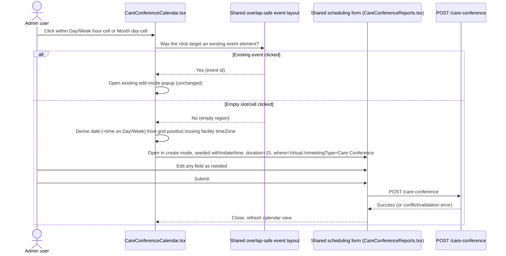

# Technical Design: Care Conference Calendar — Click-to-Create

| Field | Value |
|---|---|
| Source PRD | `SNF/02_prd/enhancements/care-conference-calendar-click-to-create/spec.md` (derived from Enhancement Request v1, Status: Approved) |
| Author | System Architect |
| Status | Approved |
| Reviewers | |
| Product | SNF |
| repo_status | not-promoted |

## Revision history

| Date | Triggered by | What changed | Changed by |
|---|---|---|---|
| — | — | Initial draft | System Architect |
| — | Sathish (direct instruction) | Resolved TD-OQ-02: keyboard focus/ARIA parity not required for the new empty-region click targets, since no existing UI in this codebase (including the calendar's own existing event elements and `TransportCalendar`'s equivalent click targets) provides keyboard-focusable click-to-open behavior — this enhancement matches existing parity, not a new accessibility bar. Updated §7 and §11 accordingly; no change to §10 risk (downgraded from open gap to accepted, documented parity). | System Architect |
| — | Sathish (direct instruction) | Resolved TD-OQ-03: no invocation-source distinction needed between calendar-created and list-screen-created conferences — confirms §9.3's default (not built) as the final position rather than a deferred decision. Updated §9.3 and §11 accordingly. | System Architect |
| — | Sathish (direct instruction) | TD-OQ-01 / EQ-03 (click-target-isolation spike, §3.2) explicitly left open — not resolved here, to be checked by the developer during implementation rather than pre-resolved by this TD. Document status set to Approved on this basis: implementation may proceed, with the spike (§3.2) and its resulting acceptance criteria (§3.5) run as part of the developer's implementation work, per §9.1's existing exit criterion. | System Architect |

## 1. Context and problem statement

`CareConferenceCalendar.tsx` (client-admin-web, `client-admin-web.md` §2.11,
`care-coordination.md` CARE-FR-26a) is currently a browse/edit/delete surface
only: as-built confirms explicitly *"There is no 'create new conference'
action on the calendar itself — new conferences are still scheduled from
'Schedule Care Conference.'"* New conferences must be created from
`CareConferenceReports.tsx`, even though the calendar already imports that
screen's form, `ConflictPanel`, and `JoinByPhoneSection` and edits/deletes
existing conferences directly.

The ER/spec ask for a click-to-create entry point on the calendar itself
(Day/Week hour grid, Month day cell), pre-filled from the clicked
slot/date, bringing this calendar to parity with the pattern
`TransportCalendar` already ships (`transportation.md` TRN-FR-19c: calendar
edit/delete via a reusable `useScheduleTransportModal` hook opened from both
list and calendar).

This needs a design doc, small as the change is, for three reasons the SA
Round 1 PRD review already flagged and this TD must resolve or scope
concretely before estimation:

1. **Click-target isolation is unverified.** As-built describes Day/Week's
   "overlap-safe event layout (same-start-time events split into columns)"
   and Month's "+N more" toggle only in behavioral prose — not as a
   DOM/component-structure guarantee that an *empty* region within an hour
   cell or day cell remains independently clickable once that layout is in
   play. Today there is no create-on-click path at all, so this conflict
   between "click an existing event" and "click empty space" has never had
   to be solved in this codebase.
2. **Create-mode invocation is new integration work**, not a byproduct of
   reusing the existing form. `CareConferenceCalendar.tsx` only opens the
   shared form in **edit** mode today, seeded by fetching an existing
   record. Opening the same form in **create** mode, seeded with
   *synthesized* (not fetched) defaults derived from a clicked grid
   position, is a new invocation path this design must define.
3. **Timezone correctness is a new regression surface.** The as-built
   documents per-calendar timezone conventions that are "inconsistent by
   design pocket" across the app (`client-admin-web.md` §4.6/§4.4) — Rehab's
   UTC-date-key convention vs. the facility-`timeZone` convention this
   calendar already uses for "today" highlighting. A new slot-to-datetime
   derivation is a new place this can regress silently if it isn't pinned
   to the existing convention explicitly.

No backend surface change is required — SA Round 1 review already confirmed
this and nothing in this TD changes that conclusion.

## 2. Goals and non-goals

### 2.1 Goals

- Add a click-to-create entry point on `CareConferenceCalendar.tsx`'s Day,
  Week, and Month views, opening the existing shared scheduling form in a
  new **create mode** it does not currently support from the calendar.
- Pre-fill date (+ time on Day/Week only) from the clicked slot/cell, using
  the facility's configured `timeZone` — the same convention the calendar
  already uses for "today" highlighting/default landing date
  (CARE-FR-26a) — never browser-local time.
- Apply defaults (duration = 15 min, where = Virtual, meetingType = Care
  Conference) on top of the pre-fill, all remaining editable before save.
- Reliably distinguish "empty slot/cell clicked" (→ create mode) from
  "existing conference entry clicked" (→ existing edit-mode popup,
  unchanged) across all layout states: Day/Week overlap-safe column split,
  Month's 0/1–3/4+("+N more" expanded or not) cell states.
- Submit through the existing `POST /care-conference` call, unchanged
  validation, unchanged Zoom >40-minute warning, unchanged schedule-conflict
  check (BR-12).

### 2.2 Non-goals

- No change to the creation form's field set, validation rules, or the
  schedule-conflict detection logic itself — reused as-is (BR-12,
  `client-admin-web.md` §2.11 conflict-check prose).
- No new backend endpoint, no `CareConference` schema change.
- No change to the existing-conference edit/delete popup's content or
  actions — that is the companion enhancement
  `care-conference-edit-delete-group-notifications`'s scope, tracked
  separately.
- No fix to the calendar's pre-existing `COMPLETED`-status filter omission
  (O-11, BR-12) — unrelated, pre-existing.
- No correction of the as-built's inaccurate claim that Month's day-click
  switches to Day view — confirmed false by Sathish directly (view
  switching is a separate control); a documentation fix for
  `client-admin-web.md`, not a code or TD deliverable here.
- No facility-group chat notification wiring — the existing "Schedule"
  notification already fires off the shared `POST /care-conference` call
  regardless of invocation source.

## 3. Proposed design

### 3.1 Architecture overview

No new service, route, or data store. The change is confined to
`CareConferenceCalendar.tsx` (and, depending on the spike's finding in §3.2,
possibly the shared overlap-safe event-layout markup it consumes, since that
markup is shared with `TransportCalendar`). The shared scheduling form
component (from `CareConferenceReports.tsx`) already accepts an
edit-mode/create-mode contract in some form (it is opened in edit mode
today, seeded from a fetched record) — this design extends that contract to
also accept **synthesized** initial values instead of a fetched record, gated
by a `mode: 'create' | 'edit'` (or equivalent) prop rather than inferring
mode from the presence/absence of a record, so the calendar's call site is
unambiguous about intent.

### 3.2 Click-target isolation — spike required before estimation

Per SA Round 1 review, this is explicitly **not** assumed from as-built
prose. Before Day/Week/Month stories are sized, run a spike against the
actual `CareConferenceCalendar.tsx` component and the shared overlap-safe
layout algorithm (shared with `TransportCalendar`) to answer, concretely:

- **(a) Day/Week:** does an hour cell's empty space remain an independently
  clickable region once same-start-time events split into columns within
  it, or does a full-row/full-column click handler currently swallow
  clicks that land in what looks like empty space?
- **(b) Month:** is the empty area of a day cell independently clickable
  both *before* and *after* the "+N more" toggle is expanded (post-expand
  the cell's effective clickable area/child DOM changes)?
- **(c)** do existing event elements need `stopPropagation()` added so an
  event click doesn't also bubble into the new slot/day click handler —
  today there is no create-on-click path at all, so this specific
  event-vs-background click conflict has never existed in this codebase
  and the current markup was never written to prevent it.

**Design implication depending on spike outcome:** if empty regions are
already independently clickable and isolated from event elements, the
calendar-level change is additive (new handler on the existing empty-region
element). If the layout's current markup swallows clicks in what looks like
empty space (e.g. a full-cell click zone with events rendered as
overlaid/absolutely-positioned children with no separate empty-space
element under the pointer), a small refactor of the shared event-layout
markup is required first — and since that markup is shared with
`TransportCalendar`, such a refactor must be verified not to change
`TransportCalendar`'s existing edit/delete click behavior (TRN-FR-19c)
as a side effect. This TD does not resolve which of these two states the
current code is in — that is exactly the spike's job — and treats it as
Open Question TD-OQ-01 below.

### 3.3 Create-mode invocation of the shared scheduling form

`CareConferenceCalendar.tsx` today opens the shared form only in edit mode,
seeded by fetching a `CareConference` record by id. This design adds a
create-mode invocation path:

1. On an empty-slot/cell click (post click-target-isolation resolution,
   §3.2), the calendar computes a `CareConferenceDraft`-shaped object
   (not a fetched record) with: `date`, `time` (Day/Week only, omitted on
   Month), `duration: 15`, `where: 'Virtual'`, `meetingType: 'Care
   Conference'`. All other form fields (residents, care team, family
   members, location, notes) are left unset, exactly as the existing
   "Schedule Care Conference" screen leaves them unset today when opened
   fresh — no default values are invented for fields the ER/spec does not
   specify defaults for.
2. The calendar opens the shared form component with this draft and an
   explicit create-mode signal, rather than a fetched-record id. If the
   shared form's current prop contract only supports
   record-present-implies-edit-mode, that contract needs a small extension
   (an explicit `mode` prop) so the calendar's intent isn't inferred
   implicitly — flagged as new wiring, consistent with SA Round 1's
   framing that this is genuinely new integration work, not a byproduct of
   "the form is unchanged."
3. Submission continues to call the existing `POST /care-conference` —
   unchanged request shape, unchanged validation, unchanged conflict check.
   The calendar's only responsibility is invocation and initial values; the
   form owns everything from validation onward, same as it does today when
   invoked from `CareConferenceReports.tsx`.

### 3.4 Facility-timezone-correct slot-to-datetime derivation

Per BR-CCC-05 (spec.md) and SA Round 1's explicit flag: the pre-filled
date/time must be derived using the facility's configured `timeZone` — the
same convention already used for this calendar's "today"
highlighting/default landing date (CARE-FR-26a) — not browser-local time,
and not the Rehab Calendar's separate UTC-date-key convention
(`client-admin-web.md` §4.4/§4.6). Concretely: whatever grid-position →
date/time derivation this calendar already performs internally for "today"
highlighting is the derivation this new pre-fill logic must reuse or mirror
exactly, not a fresh implementation using `Date` in browser-local time. This
is called out as its own implementation task (not merely a note) because it
is a new code path, and the codebase's own as-built documents this exact
class of regression as a recurring risk across calendars.

### 3.5 Month-view empty-cell click boundary, by cell state

Concrete acceptance criteria, once §3.2's spike confirms what the current
markup allows, must be defined per cell state:

| Cell state | Expected click target for create-mode |
|---|---|
| 0 conferences that day | Entire cell body (minus any date-number/header chrome that already has its own click behavior, if any) |
| 1–3 conferences, unexpanded | Any empty area of the cell not occupied by a rendered conference chip |
| 4+ conferences, "+N more" collapsed | Empty area not occupied by chips or the "+N more" toggle itself (the toggle's own click must continue to expand, not trigger create) |
| 4+ conferences, "+N more" expanded | Empty area of the now-taller cell not occupied by any of the expanded chips |

Day/Week hour cells follow the same principle at hour granularity: any
region of the hour row not occupied by an event column.

## 4. Alternatives considered

| Alternative | Why rejected |
|---|---|
| Add a separate "+ New Conference" button on the calendar toolbar instead of click-to-create | Doesn't meet the ER's explicit ask (parity with `TransportCalendar`'s in-grid click behavior, TRN-FR-19c) or the stated goal of a low-friction, pre-filled entry point; a toolbar button carries no slot/date context so would require the user to manually pick date/time the click would have given for free. Kept as a possible *additional* affordance but not a substitute — not in scope for this ER. |
| Build a new lightweight create-only dialog specific to the calendar, instead of reusing the shared form in a new create mode | Rejected per BR-CCC-01 (spec.md) — the ER is explicit this is new *invocation wiring*, not a new form. A second dialog would duplicate validation, the Zoom warning, and conflict-check logic the shared form already owns, creating exactly the kind of second scheduling engine BR-12 says the calendar must not become. |
| Refactor the shared overlap-safe event-layout markup up front, without first running the click-target-isolation spike | Rejected — pre-committing to a refactor before confirming whether the current markup actually needs one risks unnecessary shared-component churn that could regress `TransportCalendar`'s existing edit/delete click behavior (TRN-FR-19c) for no benefit. The spike (§3.2) is cheaper and answers the question directly. |
| Infer create-vs-edit mode implicitly from whether a record id is present, rather than adding an explicit `mode` prop | Rejected — implicit inference works today only because edit mode is the only mode the calendar has ever invoked; once a create path with synthesized (non-fetched) values exists, an explicit mode signal is clearer for future maintainers than inferring intent from data shape, and cheaper than debugging an ambiguous edge case later. |

## 5. Data model changes

None. No schema change. This enhancement reads/writes the same
`CareConference` entity via the same `/api/care-conference` endpoints
already described in CARE-FR-20/CARE-FR-25/CARE-FR-26a; see §7 and BR-12 for
the relevant constraints this design must not alter.

## 6. API / interface changes

None at the backend/API boundary — the existing `POST /care-conference`
create endpoint is reused unchanged, per BR-CCC-01/BR-CCC-07 (spec.md) and
SA Round 1's confirmation that no new backend route, schema field, or change
to conflict-detection logic is required.

**Frontend-internal interface change:** the shared scheduling form
component (consumed by both `CareConferenceReports.tsx` and
`CareConferenceCalendar.tsx`) gains an explicit create/edit mode contract
(§3.3) and accepts synthesized initial values in create mode instead of
requiring a fetched record. This is a component-prop-contract change, not
an API change, and does not touch authorization: the calendar's create
invocation runs under the same authenticated admin-web session and the same
backend-side STAFF|ADMIN role gate the existing "Schedule Care Conference"
create action already enforces (CARE-FR-26) — no new client- or server-side
authorization check is introduced by this design.

## 7. Non-functional considerations

- **Performance:** not applicable beyond negligible — no new network calls
  beyond the existing `POST /care-conference`; slot-to-datetime derivation
  is a local computation on an already-rendered grid.
- **Scalability:** not applicable — no change to data volume, query shape,
  or backend load characteristics.
- **Security:** not applicable — no new authorization surface (§6); the
  existing "IDT Report and both Care Conference views... have no
  `usePageAccess` gate, rely on nav-level filtering + backend enforcement
  only" condition (`client-admin-web.md` §4.5) is unchanged by this
  enhancement and not remediated by it — pre-existing, out of scope here.
- **Accessibility:** new clickable empty-region targets (hour-cell
  background, day-cell background) are **not** required to be
  keyboard-focusable/ARIA-labeled. Resolved (TD-OQ-02): confirmed there is
  no existing UI in this codebase — not this calendar's existing clickable
  event elements, not `TransportCalendar`'s equivalent click-to-open
  targets — that provides keyboard-focusable/ARIA-labeled click-to-open
  behavior today. This enhancement therefore only needs to match existing
  (mouse-only) parity, not introduce a new accessibility bar the rest of
  the calendar doesn't meet. Not built speculatively.
- **Compliance (HIPAA):** not applicable — no new PHI field, no new PHI
  flow; the created record is the same `CareConference` entity with the
  same fields already covered by existing compliance treatment. No new
  entry needed in `SNF/03_architecture/compliance/hipaa-compliance-register.md`.
- **Audit/data-integrity:** not applicable beyond what CARE-FR-20/21/25
  already provide — a conference created from the calendar is
  indistinguishable, once persisted, from one created via "Schedule Care
  Conference"; no new audit trail requirement falls out of this
  enhancement since both paths converge on the same `POST` call.

## 8. Testing strategy

- **Unit:** slot-to-datetime derivation logic (§3.4) — cover Day/Week
  hour-slot → date+time, Month cell → date-only, and explicit assertion
  that the derivation uses facility `timeZone`, not `Date`
  browser-local construction. Mode-prop branching on the shared form
  component (create vs. edit, synthesized vs. fetched initial values).
- **Integration:** click-target isolation per §3.5's cell-state table —
  empty-region click opens create mode with correct pre-fill; existing-event
  click opens the existing edit popup, in both Day/Week's overlap-column
  layout and each of Month's 0/1–3/4+(collapsed/expanded) states. Also
  verify a create-mode submission and an edit-mode submission both flow
  through the same `POST`/`PATCH` behavior unchanged (no new validation
  bypass, no new conflict-check bypass).
- **End-to-end:** full flow per spec.md's functional spec table (#1–#6) —
  click empty Day slot → pre-filled create dialog → edit → save → new
  event appears on calendar; same for Week and Month; click existing
  conference in any view → confirm it opens the *existing* popup, not
  create mode (regression check, since this is the exact behavior this
  change must not disturb).
- **Regression on `TransportCalendar`:** if §3.2's spike concludes a
  refactor of the shared overlap-safe layout markup is needed, add/run
  `TransportCalendar`'s existing edit/delete click-behavior tests
  (TRN-FR-19c) against the refactored markup before merge, since that
  markup is shared between the two calendars.
- **Test data/environment:** no special environment beyond an admin-web
  session with an existing set of Care Conference records spanning
  same-start-time overlaps (to exercise the column-split layout) and a
  Month day with 4+ conferences (to exercise "+N more").

## 9. Rollout and migration plan

### 9.1 Phased rollout

No phased/staged rollout is warranted for a frontend-only, no-schema-change
enhancement of this size — ship behind the existing facility-config page
gate that already controls whether "Care Conference Calendar" is enabled
for a facility at all (the same gate CARE-FR-26a's view already sits
behind; this enhancement adds behavior to an existing gated page, it does
not introduce a new one). Exit criterion: the full test suite in §8 passes
and Sathish confirms the click-target isolation spike's findings (§3.2) were
implemented per the resulting acceptance criteria (§3.5).

### 9.2 Data migration

Not applicable — no schema change, no existing data to migrate or backfill.
No rollback-cleanliness boundary to define beyond a standard frontend
revert, since no data is written in a new shape.

### 9.3 Observability

No new signal is strictly required — created-via-calendar conferences are
indistinguishable from created-via-list-screen conferences once persisted
(§7), so there is nothing new to alert on at the data layer. **Resolved
(TD-OQ-03):** confirmed no invocation-source distinction is needed between
calendar-originated and list-screen-originated creates — no analytics
tag on the `POST /care-conference` call is added by this design.

## 10. Risks and mitigations

| Risk | Likelihood/Impact | Mitigation |
|---|---|---|
| Current event-layout markup swallows clicks in what looks like empty space (Day/Week column-split or Month cell), making click-target isolation harder than assumed | Medium / Medium — could require a markup refactor shared with `TransportCalendar` | Run the click-target-isolation spike (§3.2) before estimating Day/Week/Month stories; do not assume isolation is free |
| A markup refactor to fix click-target isolation regresses `TransportCalendar`'s existing edit/delete click behavior (TRN-FR-19c), since the overlap-safe layout is shared between the two calendars | Low/Medium — only materializes if the spike concludes a refactor is needed | Explicit regression test pass on `TransportCalendar`'s existing click behavior before merging any shared-layout markup change (§8) |
| Slot-to-datetime derivation is implemented using browser-local time instead of facility `timeZone`, silently producing wrong pre-filled times for facilities outside the browser's local timezone | Medium/High — silent correctness bug, matches a documented recurring pattern in this codebase (`client-admin-web.md` §4.6 "date/timezone handling inconsistent by design pocket") | Explicit unit test asserting facility-`timeZone` usage (§8); code review checklist item citing this exact risk; reuse the calendar's existing "today"-highlighting derivation rather than writing a new one from scratch (§3.4) |
| Create-mode and edit-mode diverge subtly in the shared form component over time (e.g. a future edit-only field added without considering create-mode's synthesized-value path) | Low/Medium — maintainability risk, not a launch-blocking one | Explicit `mode` prop (§3.3) rather than implicit inference, so the two paths stay visibly distinct in code and in review |
| Keyboard-only users have no way to reach create mode via the new clickable empty-region targets | Low/Low — accepted, documented parity gap, not a regression: resolved (TD-OQ-02) that no existing UI in this codebase (including this calendar's own event elements and `TransportCalendar`'s equivalent targets) offers keyboard-focusable click-to-open behavior today | No mitigation required — matches existing app-wide convention; not a new gap introduced by this enhancement |

## 11. Open questions

| ID | Question | Current position | Priority |
|---|---|---|---|
| EQ-01 (from ER/spec) | Month view day-click conflict with view-switching navigation | **Resolved** in the ER — Sathish confirmed Month's day-click has no navigation side effect; view switching is a separate control. Carried forward as Resolved, not re-opened by this TD. | Resolved |
| EQ-02 (from ER/spec) | Month-view navigation trade-off | **Resolved** in the ER — nothing to preserve or replace (BR-CCC-06). Carried forward as Resolved, not re-opened by this TD. | Resolved |
| EQ-03 / TD-OQ-01 (from SA Round 1, spec.md, elaborated here) | Whether Day/Week's empty hour-slot space and Month's empty day-cell area remain independently clickable once the overlap-safe column layout / "+N more" expand are in play, and whether existing event elements need `stopPropagation()` added | **Left open by design decision** (Sathish, direct instruction): not resolved in this TD; explicitly deferred to the developer to check during implementation, per the spike defined in §3.2. The developer must run the spike and confirm which of §3.2's two design-implication branches applies (additive handler vs. shared-layout markup refactor) before Day/Week/Month stories are estimated/built — this is not a blocking condition on TD approval, but is a blocking condition on implementation sizing per §9.1. | High |
| TD-OQ-02 (new, raised by this TD) | Should new create-on-click empty-region targets (hour-cell background, day-cell background) be keyboard-focusable/ARIA-labeled so keyboard-only users can trigger create mode? | **Resolved** (Sathish, direct instruction): keyboard focus/ARIA treatment is **not required** — there is no existing UI in this codebase that does this (not this calendar's existing clickable event elements, not `TransportCalendar`'s equivalent targets). This enhancement matches existing mouse-only parity; it does not need to introduce a new accessibility bar the rest of the calendar doesn't meet. | Resolved |
| TD-OQ-03 (new, raised by this TD) | Should a conference created via the calendar be distinguishable from one created via "Schedule Care Conference" for adoption-analytics purposes (invocation-source tag on the create call)? | **Resolved** (Sathish, direct instruction): no differentiation needed. Confirms §9.3's default as the final position — no analytics tag added by this design. | Resolved |
| (carried from SA Round 1, doc-maintenance, not this TD's to resolve) | `care-coordination.md`'s FR-ID for schedule-conflict detection is dangling — both this ER and the companion ER cite "CARE-FR-25a," but §3A's actual FR sequence has no 25a (conflict-check behavior lives only in `client-admin-web.md` §2.11 prose, un-numbered) | Documentation-maintenance item for whoever maintains `care-coordination.md`; does not block this TD's implementation since the underlying behavior being cited is correctly described regardless of FR-ID. Not actioned by this TD. | Low |
