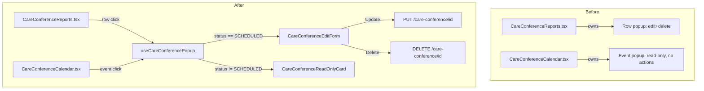
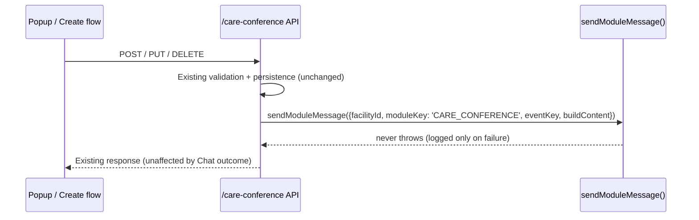

# Technical Design: care-conference-edit-delete-group-notifications

| Field | Value |
|---|---|
| Source PRD | `SNF/02_prd/enhancements/care-conference-edit-delete-group-notifications/enhancement-request-care-conference-edit-delete-group-notifications.md` (v1, Approved); `spec.md` (Draft) |
| Author | System Architect |
| Status | Approved |
| Reviewers | Sathish |
| Product | SNF |

## Revision history

| Date | Triggered by | What changed | Changed by |
|---|---|---|---|
| — | — | Initial draft | System Architect |
| 2026-08-31 | Sathish flagged that Open Questions claimed no source-code read access, when the real repos were reachable at `senior_living_backend/`/`senior_living_admin/` under `/home/sathish/projects/devicethread/shashi.ai/senior-living/` | Read source directly and resolved TD-OQ-01, TD-OQ-02, TD-OQ-04 with citations (§3.1, §3.3, §3.2, §6, §8, §10, §11); corrected `ModuleKey`/`sendModuleMessage()` call-shape assumptions (§3.2) against the actual `moduleMessage.service.ts` signature; downgraded TD-R-03/04/05. TD-OQ-03 (HIPAA register scheduling, a process question) remained open pending Sathish's decision. `shashi-care-sa-config.md` updated with the confirmed repo paths so this doesn't recur. | System Architect |
| 2026-08-31 | Sathish reviewed the new PHI exposure (§7) and accepted it: minimal content (name/date/time only) plus a care-team-primary audience makes the disclosure appropriate for operational coordination; no gate on GA rollout required. | Logged as entry #41 in `SNF/03_architecture/compliance/hipaa-compliance-register.md` with Status `Accepted`, Owner Sathish. Closed TD-OQ-03, TD-R-02, and updated §7/§9.1 accordingly (see below). With all Open Questions now resolved, Status moved to **Approved**. | System Architect |

## 1. Context and problem statement

Care Conference has two admin-web surfaces over the same `CareConference` records:
the list/editor screen (`CareConferenceReports.tsx`, "Schedule Care Conference")
and the calendar (`CareConferenceCalendar.tsx`, "Care Conference Calendar",
CARE-FR-26a). Per Sathish's direct confirmation (ER §1, overriding a stale claim
in `client-admin-web.md` §2.11 — see §4 below), the calendar's event-detail popup
is read-only today: no Update, no Delete, no other action. The list screen's row
popup already has both.

This enhancement (a) gives both surfaces one shared, status-gated popup — edit
mode (Update + Delete) for `SCHEDULED`, the existing read-only detail card for
every other status — instead of the calendar staying permanently read-only or a
second edit surface being hand-built for it; and (b) adds automated
facility-group chat notifications on the conference lifecycle (schedule / edit /
cancel), reusing the `ChatSystemUser`/`sendModuleMessage()` mechanism
Transportation already established (MSG-FR-36, TRN-FR-26).

Non-trivial technical questions this design has to resolve, none of which are
answered by a straightforward reading of the ER or spec alone:

- Whether the two components can converge on shared components as cleanly as the
  ER's phrasing implies, given the as-built's own conflicting signal about how
  much they already share (§3.1, §4).
- Whether `PUT /care-conference/{id}` needs a new status-gating backend change at
  all (BR-04) — the as-built does not document this endpoint's current gating
  explicitly.
- Whether `moduleMessageBindings`/`ChatSystemUser` genuinely generalizes to a
  second `ModuleKey`, given Transportation is documented as "the only consumer so
  far" (MSG-FR-36) with no second-consumer precedent yet observed in the as-built.

## 2. Goals and non-goals

### 2.1 Goals

- One shared, status-gated popup used identically from the List row and the
  Calendar event: `SCHEDULED` → edit-mode form (Update, Delete); every other
  status → the existing read-only detail card (BR-01/BR-02, spec.md).
- No loosening of any existing status gating — Delete's existing
  `SCHEDULED`-only rule is untouched (BR-03); Update gains a `SCHEDULED`-only
  restriction, front end and (if not already present) back end (BR-04).
- A single reusable edit-mode form component and a single reusable read-only
  detail-card component, consumed by both `CareConferenceReports.tsx` and
  `CareConferenceCalendar.tsx` (BR-05).
- Grid Actions column reduced to Delete only; Edit reached via row-click (BR-06).
- A new `'care-conference'` `ModuleKey` on the existing
  `ChatSystemUser`/`Config.chat.moduleMessageBindings`/`sendModuleMessage()`
  mechanism, firing on Schedule/Edit/Cancel, with resident name + date + time
  only in the message body (BR-07, BR-08, BR-09, BR-11).
- A `sendModuleMessage()` failure must never block or fail the calling
  create/update/delete API response (BR-10).

### 2.2 Non-goals

- No admin UI/API to create `ChatSystemUser` identities or manage
  `moduleMessageBindings` — manual provisioning only, same mechanism
  Transportation uses today (BR-09; MSG-FR-36 §9 gap explicitly out of scope for
  this ER per Sathish).
- No change to conference view/visibility rules (`CARE-FR-26`) — this only adds
  a notification side-channel (BR-13).
- No change to the status machine, Zoom/Google Calendar integration, or the
  `COMPLETED`-summary edit/share flow (`CARE-FR-24`).
- No change to the Calendar's click-to-**create** behavior on empty slots — that
  is the separate `care-conference-calendar-click-to-create` enhancement; this TD
  does not reference or reuse that enhancement's TD/tech-spec as authoritative
  for anything here, and any shared-component work should be coordinated (not
  merged) between the two, since they may both touch `CareConferenceCalendar.tsx`.
- No fix to `client-admin-web.md` §2.11's inaccurate "calendar already offers
  Edit and Delete directly" claim, or to CARE-FR-26a's own `COMPLETED`-exclusion
  quirk (O-11) — both are as-built maintenance items independent of this
  enhancement, flagged but not owned here.
- Does not resolve the calendar's `COMPLETED`-conference exclusion from its own
  list query (as-built O-11/BR-12 in `care-coordination.md`) — orthogonal to this
  enhancement's status-gated-popup behavior; a `COMPLETED` conference that *is*
  visible (e.g. via the List screen) still correctly opens read-only per BR-01
  regardless of that separate calendar-fetch quirk.

## 3. Proposed design

### 3.1 Component architecture — shared popup

**As-built starting point.** The as-built (`client-admin-web.md` §2.11,
CARE-FR-26a) documents `CareConferenceCalendar.tsx` as **already importing**
`ModalField`, `ResidentSingleSelect`, `FamilyMultiSelect`, `ConflictPanel`,
`JoinByPhoneSection`, and the meeting-type/duration/location constants directly
from `CareConferenceReports.tsx`'s module — i.e. the two screens already share
form primitives, validation, and conflict-detection machinery at the field
level. The same as-built section also states the calendar "already offers Edit
and Delete directly." **The ER explicitly flags that second claim as inaccurate
per Sathish's direct confirmation** — as of today, the calendar's event-click
opens a read-only card only, with no Update/Delete actions wired up, regardless
of what shared field components exist underneath. This TD treats Sathish's
confirmation as ground truth for current behavior (matching the ER and spec.md)
and treats the as-built's Edit/Delete claim as stale, not re-litigated here — see
§9's "Non-functional considerations" note on documentation debt and the Risks
table (TD-R-01).

**Implication for feasibility — confirmed at source level 2026-08-31
(`senior_living_admin/src/components/CareConferenceCalendar.tsx`,
`CareConferenceReports.tsx`).** The gap is narrower than "build two screens'
worth of divergent logic into one," and narrower even than TD-OQ-02's original
"container to be built" framing. `CareConferenceCalendar.tsx` **already
contains a fully-built, parallel Edit Modal and Delete Confirmation Dialog**
(lines 1021–1138) with their own `editConference`/`confirmDeleteId` state
(lines 311–312), their own `updateConference`/`deleteConference`
`useMutation` hooks calling the identical `PUT /care-conference/:id` /
`DELETE /care-conference/:id` endpoints (lines 427–461, comment at line 424:
"Schedule / Edit / Delete / Share mutations — same flow as
CareConferenceReports"), and `handleUpdate`/`openEdit`-equivalent logic —
this is a near-duplicate of `CareConferenceReports.tsx`'s own edit/delete
flow, not missing logic. **The only thing actually missing is the trigger**:
inside the "Event Detail Popup" (`selectedEvent`, lines 908–1019) there is no
button/onClick that calls `setEditConference(conf)` or
`setConfirmDeleteId(conf._id)` — those setters are only ever called from the
modals' own Cancel handlers (reset to `null`). So today the popup renders,
the edit/delete modals exist and work, but nothing wires the popup to open
them.

This changes the shape of the design, not just its cost: rather than a
worst-case "build a new shared container from scratch," or even the
originally-planned `useCareConferencePopup` extraction as pure new work, the
concrete gap is (a) add the missing trigger(s) — an Update/Delete
affordance in the popup when `status === 'SCHEDULED'` — and (b)
**de-duplicate** the two already-near-identical Edit Modal / Delete Dialog
implementations into the one shared pair BR-05 requires, rather than
building either from nothing. The `useCareConferencePopup` extraction in this
design is still the right target shape (BR-05 requires one shared pair, and
today's calendar-side modal is dead/unwired code, not a second maintained
surface) — but the LOE is materially lower than "build a container," and
TD-R-04's "shared-component refactor scope is larger than assumed" risk is
correspondingly **downgraded**, not eliminated (see updated Risks table,
§10).

**Design: extract a `useCareConferencePopup` hook (Transport-pattern).**
Following `TRN-FR-19c`'s precedent — `useScheduleTransportModal`, extracted so
both the Transport request list and `TransportCalendar` open the identical
modal — this design extracts:

- `useCareConferencePopup(conference)` — decides render mode from
  `conference.status` (`SCHEDULED` → edit; else → read-only), owns open/close
  state, wraps the existing `PUT`/`DELETE` mutations, and triggers a refetch on
  the calling screen on success.
- `<CareConferenceEditForm>` — the edit-mode form (new container component,
  assembled from the already-shared field primitives above), rendering Update +
  Delete actions, wired to the existing validation and `CARE-FR-25a`
  schedule-conflict check (`ConflictPanel`) unchanged.
- `<CareConferenceReadOnlyCard>` — the existing Calendar "Event detail popup"
  card (CARE-FR-26a), extracted as-is (not rebuilt) so it can be rendered from
  either surface without duplicating its resident/status/roster/agenda
  rendering.

Both `CareConferenceReports.tsx` (row click) and `CareConferenceCalendar.tsx`
(event click) call `useCareConferencePopup`, passing the clicked conference;
neither screen owns its own popup-open logic post-refactor. The List screen's
grid keeps its own Delete icon action (BR-06, gated per Delete's existing rule)
independent of the row-click-into-popup path.



### 3.2 Facility-group chat notifications

**Two corrections to this section's assumed call shape, confirmed at source
2026-08-31 (`senior_living_backend/src/services/chat/systemUser/moduleMessage.service.ts`,
`config.model.ts`, `transportationRequest.controller.ts`) — the mechanism and
design intent below are unchanged, only the exact literals/signature are
corrected:**

1. **`ModuleKey` casing.** The existing (and only) member is the
   SCREAMING_CASE `'TRANSPORTATION'` (`config.model.ts` line 73:
   `export type ModuleKey = 'TRANSPORTATION';`), not the lowercase
   `'transportation'` this section assumed throughout. The new member should
   follow the same convention — `'CARE_CONFERENCE'`, not `'care-conference'`
   — for consistency with the existing single member and to avoid a
   mixed-casing `ModuleKey` union. Every `'care-conference'` literal in this
   section (moduleKey values specifically — not `/care-conference` route
   paths, which are unrelated and correct as written) should be read as
   `'CARE_CONFERENCE'` in the tech-spec.
2. **`sendModuleMessage()`'s actual signature is a single object param, not
   positional arguments.** The real shape
   (`moduleMessage.service.ts` lines 39–62) is:
   ```ts
   sendModuleMessage({
     facilityId: string,
     moduleKey: ModuleKey,      // e.g. 'TRANSPORTATION'
     eventKey: string,          // module-owned event vocabulary, e.g. Transport's onCreate/onArrive
     buildContent: () => Promise<{ text: string; mentions: Array<{cName, role}> }>,
   })
   ```
   not `sendModuleMessage('care-conference', <event>, <payload>)` as written
   below. Notably `buildContent` is a **callback**, called at most once and
   only after confirming at least one enabled binding exists — this is a
   real design detail worth preserving (it's why an unconfigured facility's
   `PUT`/`POST`/`DELETE` calls skip resident-name/date/time lookups entirely,
   not just skip sending). `transportationRequest.controller.ts`'s
   `sendTransportChatMessage` (lines 240–254) is the existing call-site
   pattern to mirror exactly.

Follows Transportation's established pattern exactly (TRN-FR-26,
`transportationChatTemplates.ts`):

- Add `'CARE_CONFERENCE'` as a new `ModuleKey` value alongside the existing
  `'TRANSPORTATION'` key consumed by `Config.chat.moduleMessageBindings`
  (single-line type widening, `config.model.ts` line 73 — see TD-OQ-04
  resolution, §11).
- New `careConferenceChatTemplates.ts` (mirrors
  `transportationChatTemplates.ts`) — one shared card-template
  builder/renderer for the three lifecycle events (schedule / edit-reschedule /
  cancel-delete), each event owning its own `resolveMentions` (restricted scope
  — see §6).
- Call sites: the existing `POST /care-conference` (create), `PUT
  /care-conference/{id}` (update), and `DELETE /:id` (soft-cancel) handlers each
  call `sendModuleMessage({ facilityId, moduleKey: 'CARE_CONFERENCE', eventKey:
  <event>, buildContent: ... })` on success, same call-site shape as
  `sendTransportChatMessage` in `transportationRequest.controller.ts`.
- `sendModuleMessage()` itself is unchanged — no new contract, per MSG-FR-36 (it
  "never throws; a chat-automation failure never affects the calling module's
  own API response").
- Content restricted server-side, at template-build time (i.e. inside the
  `buildContent` callback), to resident name + date + time only (BR-08) — no
  notes, agenda, location, or attendee list is read into the template payload
  at all, not merely hidden in rendering.



### 3.3 Backend status gating on `PUT /care-conference/{id}`

**Confirmed at source level 2026-08-31
(`senior_living_backend/src/services/careConference.service.ts`,
`updateCareConference`, lines 684–843): already `SCHEDULED`-only. No backend
change required for BR-04.**

- The scheduling-conflict pre-check (when a scheduling field changes) reads
  the existing document with an explicit `status: CARE_CONFERENCE_STATUS.SCHEDULED`
  filter (line 707) and returns `null` (→ controller's 404) if that filter
  doesn't match.
- The actual persistence call is itself status-scoped:
  `CareConference.findOneAndUpdate({ _id: id, facilityId, status:
  CARE_CONFERENCE_STATUS.SCHEDULED }, ...)` (lines 789–793) — a `PUT` against
  a non-`SCHEDULED` conference matches no document, returns `null`, and the
  controller (`updateCareConference`, `careConference.controller.ts` lines
  189–231) returns a generic `404 { success: false, message: 'Care
  conference not found' }`.
- This is **the exact same pattern** `deleteCareConference` already uses
  (`careConference.service.ts` lines 854–866: identical
  `findOneAndUpdate({..., status: SCHEDULED}, ...)` shape) — so §6's "matching
  `DELETE`'s existing rejection pattern rather than inventing a new error
  shape" is not just a design intent, it is already true today for both
  endpoints, with no code change needed to make it true.

**Correction to this design's error-shape assumption:** neither endpoint
today returns a distinguishable "status mismatch" error — both return the
same generic 404 as an "id not found" case. A caller (UI or API consumer)
cannot currently tell "wrong id" apart from "right id, wrong status" from the
response alone. This TD does not require changing that (BR-04 only asks that
Update be rejected when not `SCHEDULED`, which it already is) — noting it
here so the tech-spec doesn't invent a status-mismatch-specific error
response that doesn't exist in the codebase today (see §8 test note below).

This item is **documentation-only** in the tech-spec: no `careConference.service.ts`
or `careConference.controller.ts` change is required for §6's "possible new
authorization check" — it already exists.

## 4. Alternatives considered

| Alternative | Why rejected |
|---|---|
| Build a second, calendar-specific edit form instead of a shared component pair | Directly contradicts BR-05 (product requirement, settled) and repeats the exact anti-pattern Transportation moved away from at `TRN-FR-19c` — two edit surfaces to keep in sync on every future field/validation change. |
| Leave the Calendar read-only permanently and only fix the List screen's Actions column / notifications | Does not meet the ER's core ask (parity between List and Calendar); explicitly rejected by the ER's business goal statement. |
| Loosen Delete's or introduce a new status gate on Update broader than `SCHEDULED`-only (e.g. also allow from `IN_PROGRESS`) | Explicitly superseded by Sathish's confirmation (BR-02) after an earlier ER draft briefly allowed `IN_PROGRESS` editing — settled product decision, not re-opened here. |
| Build a bespoke notification pipeline for Care Conference instead of reusing `ChatSystemUser`/`moduleMessageBindings` | Would duplicate MSG-FR-36's mechanism, encryption, mention-validation, and delivery/read receipt handling for no functional gain, and breaks the ER's explicit "consistency across modules" business goal (mirrors TRN-FR-26). |
| Include richer notification content (location, agenda, attendee list) matching what the read-only card shows | Rejected per Sathish's explicit minimum-necessary decision (BR-08) — deliberately minimal to bound the new PHI exposure surface (BR-12); not an SA design call. |

## 5. Data model changes

None. No schema change to `CareConference` (spec.md, "Data model diagram
(ERD)"). The only persisted change is a config value: a new
`'care-conference'` entry under the existing `Config.chat.moduleMessageBindings`
shape — same shape Transportation already populates, no new field or collection.

## 6. API / interface changes

| Endpoint | Change |
|---|---|
| `POST /care-conference` (create) | Unchanged contract; new side-effect: calls `sendModuleMessage('care-conference', 'schedule', ...)` on success. |
| `PUT /care-conference/{id}` (update) | Unchanged contract. New side-effect: calls `sendModuleMessage('care-conference', 'edit', ...)` on success. **No new authorization check needed** — confirmed at source (`careConference.service.ts` lines 789–793) that `updateCareConference` already scopes its `findOneAndUpdate` to `status: SCHEDULED`; a non-`SCHEDULED` update already 404s today. §3.3 is documentation-only. |
| `DELETE /care-conference/{id}` (soft-cancel) | Unchanged contract and unchanged existing `SCHEDULED`-only gate (BR-03). New side-effect: calls `sendModuleMessage('care-conference', 'cancel', ...)` on success. |
| `sendModuleMessage()` (`MSG-FR-36`) | No contract change. New caller (Care Conference joins Transportation as the second consumer) and a new `'care-conference'` `ModuleKey`/binding entry. |
| `Config.chat.moduleMessageBindings` | No shape change; new key `'care-conference'` populated via the existing manual-provisioning mechanism (BR-09), same as Transportation's `'transportation'` key. |

No new REST endpoints are introduced by this enhancement.

## 7. Non-functional considerations

- **Performance**: no new query patterns; the shared popup reuses existing
  fetch/mutation calls. No expected regression to the Calendar's existing
  `limit=1000` date-range fetch (CARE-FR-26a) or the List screen's client-side
  `limit: 100` fetch (O-6, unaffected by this enhancement).
- **Security**: the `PUT` status-gating addition (if needed) is a
  server-side authorization tightening, not a relaxation — closes a gap where a
  direct API call could bypass a UI-only restriction (BR-04). No new
  authentication surface; existing `requireAnyRole STAFF|ADMIN` route gating on
  care-conference management routes (`care-coordination.md` §7) is unchanged.
- **Accessibility**: not applicable beyond standard shared-component
  accessibility already expected of `ModalField`/form primitives being reused
  — no new interaction pattern introduced.
- **Compliance (HIPAA)**: BR-12 (spec.md) flags a genuinely new PHI exposure
  surface — posting resident name + date + time into a facility chat group is
  new relative to today's host/care-team-scoped visibility (`CARE-FR-26`).
  **Resolved 2026-08-31**: logged as entry #41 in
  `SNF/03_architecture/compliance/hipaa-compliance-register.md`, reviewed and
  marked **Accepted** by Sathish — minimal content (name/date/time only) and
  care-team-primary audience judged an appropriate minimum-necessary
  disclosure for the operational-coordination purpose. GA rollout is not
  gated on this item (see §9.1). The minimal name/date/time-only
  content set is the ER's own minimum-necessary determination (BR-08), already
  a settled product decision.
- **Audit/data-integrity**: `sendModuleMessage()`'s existing
  fire-and-forget/never-throws behavior (BR-10) means a notification failure
  leaves no record on the calling API response. Per Transportation's established
  precedent, the message itself (once successfully posted) is a first-class chat
  message subject to the same encryption-at-rest, retention (MSG-FR-12/29), and
  delivery/read receipt (MSG-FR-15) guarantees as any other chat message — so
  "was this facility group notified?" remains answerable via the conversation's
  own message history, same as Transportation's card-per-event trail today. No
  additional out-of-band audit log is introduced or required.

## 8. Testing strategy

- **Unit**: `useCareConferencePopup`'s status-branch logic (`SCHEDULED` → edit,
  else → read-only) for all five statuses (`SCHEDULED`, `IN_PROGRESS`,
  `IN_REVIEW`, `COMPLETED`, `CANCELLED`); `careConferenceChatTemplates.ts`'s
  payload construction (only resident name/date/time ever present, verified by
  asserting the template's input type/whitelist, not just its rendered output).
- **Integration**: `PUT /care-conference/{id}` from a non-`SCHEDULED` status —
  an existing-behavior regression test confirming the already-present
  `SCHEDULED`-only `findOneAndUpdate` scoping (§3.3) continues to reject with
  the current generic 404 (not a new status-specific error shape — none
  exists in the codebase today, see §3.3's correction note).
  `sendModuleMessage('care-conference', ...)` call assertions
  at all three lifecycle call sites (create/update/delete), including a
  simulated `sendModuleMessage` failure asserting the calling API response is
  unaffected (BR-10).
- **End-to-end (UI)**: opening a `SCHEDULED` conference from both the List row
  and the Calendar event renders the identical edit form (shared-component
  parity, not just visually similar); opening a non-`SCHEDULED` conference from
  either surface renders the identical read-only card with no Update/Delete
  control present; grid Actions column shows Delete only (BR-06).
- **Manual/facility-config**: with a `'care-conference'` `moduleMessageBindings`
  entry manually provisioned in a test facility, verify exactly one chat card
  posts per lifecycle event (BR-07) with only the three approved fields visible.

## 9. Rollout and migration plan

### 9.1 Phased rollout

| Stage | Exit criterion |
|---|---|
| Internal/dev | Shared popup and status gating pass the test suite in §8 against a facility with no `moduleMessageBindings['CARE_CONFERENCE']` entry configured — chat notification path must be a silent no-op (mirroring `sendModuleMessage`'s existing behavior for an unbound module), confirmed before pilot. |
| Pilot facility | One facility manually provisioned with a `'CARE_CONFERENCE'` `moduleMessageBindings` entry (same manual mechanism as Transportation, BR-09); confirm chat cards post correctly and popup parity holds across List and Calendar for at least one full lifecycle (schedule → edit → cancel) observed live. |
| General availability | Popup/gating change ships to all facilities (code-level, not config-gated — the shared popup and any `PUT` gating tightening apply regardless of chat provisioning); chat notifications remain opt-in per facility via manual `moduleMessageBindings` provisioning, unchanged from Transportation's existing rollout model. Not gated on the HIPAA compliance register (resolved, entry #41, Accepted — §7). |

No feature flag or facility-page gate exists specifically for this enhancement
— gating is achieved entirely through `moduleMessageBindings` presence/absence
for the notification half, and ships unconditionally for the popup/gating half
(same pattern Transportation used; no new gate needs to be introduced).

### 9.2 Data migration

None required — no schema change (§5). The only "migration" is manual
provisioning of `moduleMessageBindings['care-conference']` entries per facility
that wants the notification, which is an operational/config step, not a data
migration, and stays entirely opt-in per facility (an unprovisioned facility
sees the shared-popup change but no new chat behavior). Rollback is clean at any
point prior to a facility's manual binding being provisioned; once a facility
has live chat history containing `'care-conference'` cards, those messages
persist under the same non-destructive retention policy as any other chat
message (MSG-FR-12) — rolling back the code does not and should not delete
them.

### 9.3 Observability

- No new dashboard/metric is introduced by this design. The existing pattern for
  `sendModuleMessage()` failures is "caught and logged only" (MSG-FR-36,
  mirrored from Transportation) — this enhancement does not change that, so a
  `'care-conference'` notification failure surfaces the same way a
  `'transportation'` one does today (application log only, no dedicated alert).
  If Sathish wants proactive alerting on `sendModuleMessage` failure rate, that
  is a platform-level ask spanning both modules, not scoped to this
  enhancement.
- "Was a given lifecycle event notified?" remains answerable via the facility's
  chat conversation history itself (§7 above) rather than a separate audit
  trail — consistent with how Transportation's existing notification history is
  inspected today.

## 10. Risks and mitigations

| Risk | Likelihood/Impact | Mitigation |
|---|---|---|
| TD-R-01 — The as-built's stale "calendar already has Edit/Delete" claim (`client-admin-web.md` §2.11) could mislead a developer picking up this work if they read the as-built before the ER/spec/TD. | Medium likelihood / Low impact (self-correcting once the ER's explicit correction note is read) | ER §1 and this TD both call out the discrepancy explicitly and state Sathish's confirmation as ground truth; the as-built's own correction is flagged as an independent doc-maintenance item, not blocking this enhancement. |
| TD-R-02 — ~~New PHI exposure ships before the HIPAA compliance register entry is added~~ **Resolved 2026-08-31**: register entry #41 added and marked Accepted by Sathish (§7). No residual risk. | ~~Medium/Medium~~ Closed | No action needed; GA rollout (§9.1) is not gated on this item. |
| TD-R-03 — ~~`PUT /care-conference/{id}`'s actual current gating is unconfirmed~~ **Resolved 2026-08-31**: confirmed already `SCHEDULED`-only at source (§3.3) — no residual risk. | ~~Medium/Medium~~ Closed | No action needed; §8's regression test still verifies the existing behavior stays intact through this enhancement's other changes. |
| TD-R-04 — Shared-component refactor scope is larger than the "narrower gap" reasoning in §3.1 suggests, if the List screen's existing row-popup edit flow diverges from the Calendar's shared field primitives more than the as-built's import list implies. | **Downgraded 2026-08-31** (was Low-medium/Medium): confirmed at source that Calendar already has a working, near-duplicate Edit Modal/Delete Dialog (§3.1) — the remaining work is wiring a trigger + de-duplicating two already-similar implementations, not building new logic. Low likelihood / Low-medium impact (mechanical refactor, not net-new feature work). | Still recommend a short read-through to confirm exact field-by-field parity between the two existing edit forms before finalizing the shared component's prop surface — but this is now a scoping/cleanup task, not a discovery task. |
| TD-R-05 — Second-`ModuleKey` extensibility of `moduleMessageBindings`/`ChatSystemUser` is unverified beyond Transportation's single existing consumer; an undocumented Transportation-specific assumption in the binding/template code could surface only when a second module is wired up. | **Downgraded 2026-08-31**: confirmed at source (`config.model.ts` line 73: `export type ModuleKey = 'TRANSPORTATION';` with an explicit doc comment "Extend this union as new modules adopt `sendModuleMessage`") that a second `ModuleKey` is an anticipated, designed-for extension point, not an untested edge case. `resolveChatSystemUsers()` and `sendModuleMessage()` (§3.2) are both already generically `moduleKey`-parameterized with no `'TRANSPORTATION'`-specific branching found in either. Low likelihood / Low impact. | Widen `ModuleKey` to `'TRANSPORTATION' \| 'care-conference'` (single-line type change, `config.model.ts` line 73) and add the new binding; still worth a smoke test on binding resolution as the first real second-consumer exercise, but not a redesign risk. |

## 11. Open questions

All source-verifiable questions below were resolved 2026-08-31 by direct
reads of `senior_living_backend/` and `senior_living_admin/`
(`/home/sathish/projects/devicethread/shashi.ai/senior-living/`) — see
`shashi-care-sa-config.md`'s "Source-code checkouts" section for the path.
TD-OQ-03 (a process/scheduling question, not a code question) was resolved
separately, by Sathish directly. No open questions remain.

| ID | Question | Resolution | Priority |
|---|---|---|---|
| TD-OQ-01 | ~~What is `PUT /care-conference/{id}`'s exact current status gating?~~ | **Resolved.** Already `SCHEDULED`-only — `updateCareConference` (`careConference.service.ts` lines 789–793) scopes its `findOneAndUpdate` to `status: SCHEDULED`; non-`SCHEDULED` updates already 404 today, same pattern as `DELETE`. No backend change needed for BR-04 (§3.3). | Closed |
| TD-OQ-02 | ~~Exact current divergence between `CareConferenceReports.tsx`'s row-popup edit flow and `CareConferenceCalendar.tsx`'s event-click flow~~ | **Resolved.** `CareConferenceCalendar.tsx` already has its own fully-built (but unwired) Edit Modal and Delete Confirmation Dialog (lines 1021–1138), calling the same endpoints as `CareConferenceReports.tsx`. The gap is: (1) no trigger inside the read-only Event Detail Popup to open them, and (2) the two near-duplicate implementations need de-duplicating into BR-05's one shared pair — not building new logic from scratch (§3.1). | Closed |
| TD-OQ-03 | ~~When/how does the HIPAA compliance register entry (BR-12) get added?~~ | **Resolved 2026-08-31.** Logged as entry #41 in `hipaa-compliance-register.md`, reviewed and marked **Accepted** by Sathish: minimal content + care-team-primary audience judged an appropriate minimum-necessary disclosure. GA rollout is not gated on this item. | Closed |
| TD-OQ-04 | ~~Does `moduleMessageBindings`/`ChatSystemUser` genuinely generalize to a second `ModuleKey`?~~ | **Resolved, with one required code change identified.** `ModuleKey` (`config.model.ts` line 73) is currently `type ModuleKey = 'TRANSPORTATION';` — a single-member union, with a doc comment ("Extend this union as new modules adopt `sendModuleMessage`") confirming a second member is the anticipated extension path, not a redesign. `resolveChatSystemUsers()` and `sendModuleMessage()` are already generically keyed with no `'TRANSPORTATION'`-specific branching found. **Action for the tech-spec**: widen line 73 to `'TRANSPORTATION' \| 'care-conference'` (or equivalent) — this is now a known, scoped one-line type change, not an open question about whether the mechanism generalizes. | Closed (carries forward as a concrete tech-spec action item, not an open question) |

Carried forward, already resolved by Sathish — not re-opened here (ER §6 /
spec.md "Open questions", recorded for traceability only):

| ID | Area | Resolution |
|---|---|---|
| EQ-01 | As-built accuracy | Calendar popup has no buttons today; `client-admin-web.md` §2.11's contrary claim is inaccurate, flagged for correction independent of this enhancement (see TD-R-01). |
| EQ-02 | UX | Non-`SCHEDULED` statuses show the existing read-only Calendar detail card, reused as-is (BR-01). |
| EQ-03 | UX | Editing is not allowed on an `IN_PROGRESS` conference — Update, like Delete, is `SCHEDULED`-only (BR-02). |
| EQ-04 | Compliance | Chat message content is restricted to resident name, date, and time only (BR-08). |
| EQ-05 | Platform | Manual provisioning only for `ChatSystemUser`/`moduleMessageBindings`; a self-service admin UI is a candidate future enhancement, not part of this work (BR-09). |
