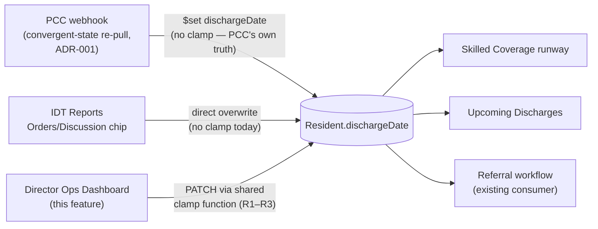

# Technical Design: feature-director-operations-dashboard

| Field | Value |
|---|---|
| Source PRD | `SNF/02_prd/features/director-operations-dashboard/prd-director-operations-dashboard.md`, v1.8 (2026-08-21) — originally authored against v1.3 (2026-08-18); updated per `feature-director-operations-dashboard_PRD-changes-for-SA.md` (§5.4 Post Discharge Follow-up additions only) |
| Author | System Architect |
| Status | Ready for review |
| Reviewers | Sathish, Product Manager |
| Product | SNF |

## 1. Context and problem statement

The PRD specifies a single-role (Director/Admin) operational dashboard for a 100–120 bed skilled nursing facility: a skilled-coverage runway (days used/remaining vs. discharge date and Medicare benefit exhaustion), an upcoming-discharges list, a 28-day post-discharge follow-up survey surface with derived readmission risk, and a facility summary strip (occupancy, census, payer mix, LOS). Nothing in this feature is a small CRUD screen — it's a new data model (skilled days, HMO auth dates, readmission risk, a 4-week survey/task-metadata subsystem), a new facility-local date-authority requirement, a new large-list rendering requirement, and a third independent writer onto a resident field two other features already write to. Each of those needs an explicit design because none of them has an existing pattern to fall back on in this codebase (confirmed by architecture review — see §4 and §10).

This document also resolves the three technical questions Sathish decided on 2026-08-18: (1) build the real PCC Facility Beds integration rather than a resident-derived approximation, (2) build a facility-time layer scoped to this feature rather than wait on ADR-005, (3) add lightweight source/timestamp tracking to `Resident.dischargeDate` rather than accept last-write-wins silently.

**Revision (2026-08-21, first pass):** decision (1) above is superseded. Sathish revised the Facility Beds approach to a resident-derived design — total beds captured once in facility settings, occupancy derived from the active-resident count, no PCC Facility Beds polling or cron. See §3.3 for the current design; §4 and §11 (TD-2) carry the superseded alternative and its retired open question forward for the record.

**Revision (2026-08-21, second pass):** PRD v1.8 adds detail to Section 5.4 (Post Discharge Follow-up) only — a resident-level Follow-up notes panel, a corrected verbatim feedback-task mapping, two new popup subtitles, and a new Discharge Planning dependency (destination). None of it touches the three 2026-08-18 decisions or the first-pass Facility Beds revision above. New design decisions from this pass live in §3.9; see §4, §5, §6, §10, §11 for the rest of the ripple. One net-new decision was Sathish's call, not mine: the Follow-up notes panel's per-week AI summary (PRD Open Question #3) is a deterministic template join of the fixed feedback-task strings, not a real LLM call — decided 2026-08-21 after confirming no internal AI/LLM summarization service exists in this platform to extend (§3.9).

## 2. Goals and non-goals

### 2.1 Goals

- Serve the five screen surfaces in PRD §5 against real facility data, sized to 500 residents/facility (PRD §9).
- Establish a facility-local "today" that both the runway math and the new business-hours cutover (PRD §4.4) can rely on, without waiting on a platform-wide timezone decision.
- Make `Resident.dischargeDate` writes from this feature attributable (who/when), without changing the PRD's specified last-write-wins behavior.
- Derive facility occupancy from a facility-settings bed total and the current active-resident count (PRD §4.1) — no PCC Facility Beds API dependency, no cron (revised 2026-08-21, §3.3).
- Build the reusable client-side primitives (virtualized grid, inline auto-save field) this feature needs, since neither exists in the admin app today, in a form the next admin-app feature can reuse.

### 2.2 Non-goals

- Discharge Planning integration, the stage list, "Start plan," or the diamond's Red/Amber/Green colour logic — Phase 2, per PRD §2.3/§10. This design leaves an explicit seam (§3.4) for it.
- HMO Authorization Review screen and auth-extension workflow — Phase 2, per PRD §2.2/§10.
- Task assignment, ownership, due dates, staff-facing task views — Phase 2, per PRD §5.4/§10.
- Audit logging of revenue-bearing writes — Phase 2 per PRD §9, though this design's source/timestamp fields (§5) are a deliberate down-payment toward it.
- Resolving ADR-005 platform-wide — this design only resolves facility-local time *for this feature's own endpoints* (§3.4) and recommends the ADR-005 owner consider the same approach, but does not change the staff app, mobile apps, or backend cron jobs outside this feature's scope.
- A general Config-editing admin UI — no such UI exists for any `Config` field today (not just business hours); this design does not introduce one (see Finding 4 in the companion SA-comments file for the product decision needed here).

## 3. Proposed design

### 3.1 Where this lives

Frontend: a new view in `senior_living_admin`, registered in the existing `VIEW_COMPONENTS` map (no React Router in this app — state-based `activeView`, per architecture review). Component tree follows the existing shadcn/Radix convention in `src/components/ui/`. State: TanStack React Query for all server data (five new query hooks, one per endpoint in §6), no new Redux slice needed — nothing here is cross-page client state.

Backend: new Express routes under `/director-dashboard/*` and new `PATCH`/`POST`/`DELETE` sub-resources under the existing `/residents/{id}/*` namespace (kept under `residents` rather than a parallel resource, since every write in this feature mutates the `Resident` document — see §5). All routes require `x-facility-id` (existing multi-tenancy convention) and `requireAnyRole(['ADMIN'])` (existing middleware — see §7 for why no new "Director" role is needed).

### 3.2 Facility summary, Skilled Coverage, Upcoming Discharges — query-time aggregation

None of these need a materialized/cached snapshot: 500 residents is small, and the existing KPI Dashboard (`GET /reports/daily-summary`, `dailySummaryReport.controller.ts`) already establishes the precedent of query-time MongoDB aggregation over `Resident` for a facility-scoped operational dashboard, with no cron/materialized store. This design follows that precedent for the same reason it worked there: read-heavy, small-N, freshness matters more than compute cost.

- `GET /director-dashboard/summary` — aggregates `Resident` (occupancy, payer mix, care-type mix, avg LOS over short-stay residents only per PRD §2.1); occupancy is `activeResidentCount / Config.totalBeds` (§3.3) — no separate bed-inventory join.
- `GET /director-dashboard/skilled-coverage` — one row per resident where `trackedForSkilledCoverage=true` (§5), computed runway fields (days used/remaining, coverage-bar colour bands per PRD §5.2) derived at request time from `admissionDate`, `availableSkilledDays`, `dischargeDate`, `hmoAuthEndDate`, evaluated against facility-local "today" (§3.4).
- `GET /director-dashboard/upcoming-discharges` — residents with `dischargeDate` within facility-local next-7-days window (§3.4).

### 3.3 Facility Beds — resident-derived occupancy, no PCC integration

**Revised 2026-08-21** (supersedes the PCC Facility Beds API design below the line): this design no longer integrates PCC's Facility Beds endpoint. Total bed count is a one-time facility-setup value — `Config.totalBeds` (Number, §5) — entered when the facility is configured, the same manual-entry pattern already used for `Config.timeZone` and, per §3.5, `Config.businessHours` (no `Config`-editing UI exists today for any field). It is not expected to change often; if it does, it's an update to the same setup-time value, not a new sync.

Occupancy is derived entirely from `Resident`: the count of currently-active residents (admitted, not yet discharged) at the facility *is* the count of occupied beds. Resident admit/discharge status is already kept current by PCC's existing webhook-driven convergent-state handling (ADR-001, §3.8) — this feature adds no new webhook subscription and no new resident-status field; it only reads a count that's already correct today. `GET /director-dashboard/summary` (§3.2) computes occupancy as `activeResidentCount / Config.totalBeds` at query time, in the same aggregation pass as the payer-mix/care-type-mix/avg-LOS stats it already computes over `Resident`.

This removes the nightly `facilityBeds.cron.ts` poll, the `FacilityBedSnapshot` collection, the "pending PCC approval" fallback state, and the PCC Facility Beds API as an external launch dependency (§9, §10, §11 TD-2) — all superseded by this approach. The trade-off: this design no longer has bed-level detail (held/out-of-service beds, companion beds, per-bed Medicare/Medicaid certification) available to any future surface; nothing in the current PRD needs that detail for occupancy, so it isn't carried as a gap here (recorded as a reopened alternative in §4, not decided).

---

*Superseded design (2026-08-18–2026-08-21), kept for record — see §4 for why it was replaced:*

Confirmed against the contracted PCC REST API spec: `GET /public/preview1/orgs/{orgUuid}/facs/{facId}/beds` (`operationId: getFacilityBeds`), paginated (`page`/`pageSize`, max 200), returns `FacilityBedList` → `RoomWithBeds[]` → `beds[] {id, description, isOccupied, isMedicareCertified, isMedicaidCertified, isCompanionBed}`. This is genuinely new integration surface — nothing in the current PCC sync touches beds — and PCC's own docs flag that "GET Facility Beds end point approval" is separate from whatever access grants already exist (Facility/Floors/Rooms/Units access does not imply Beds access).

Unlike the patient-lifecycle events ADR-001 covers, PCC has no webhook for bed state changes, so this must be a poll, not a push. Design: a new nightly cron (`facilityBeds.cron.ts`, same shape as the existing per-minute/per-5-minute cron jobs in `src/server.ts`) pulls all pages for each facility's `orgUuid`/`facId` and writes one `FacilityBedSnapshot` document per facility per day — same one-doc-per-facility-per-day-with-a-`source`-enum shape as the existing `DiningTrayCard` model, which is the closest existing precedent for "periodic external ingest, not resident-scoped."

Fallback if PCC approval is still pending at launch: the summary endpoint (§3.2) checks for a `FacilityBedSnapshot` less than 48h old; if none exists, occupancy/bed-count cards render a "Bed data pending PCC approval" empty state (same "zero is information, never hidden" principle the PRD already applies to Coverage Expiration Alerts, PRD §5.1) rather than blocking the rest of the dashboard. This is tracked as an external dependency, not a redesign risk (see companion SA-comments Finding 2).

### 3.4 Facility-local "today" — resolved server-side, not in the client

PRD §4.4 requires every date computation (runway, "next 7 days", follow-up windows) to use facility-local time, with a new business-hours cutover for "today." ADR-005 (facility timezone authority) is still `Proposed` and unresolved platform-wide; only `senior_living_staffapp` currently treats facility time as authoritative (via a client-side `@date-fns/tz` layer), and `senior_living_admin` — where this feature lives — is explicitly unaudited.

Per Sathish's decision, this feature does not wait on ADR-005, but it also does not replicate the staff app's client-side timezone library. Instead: the backend, which already resolves `facilityId` from `x-facility-id` per request and already holds `Config.timeZone`, computes "facility-local today" (including the business-hours cutover, §3.5) once per request and uses it to filter/derive every date-dependent field before the response leaves the server. The frontend receives pre-resolved values (a runway day-count, a "next 7 days" membership boolean, a follow-up week index) and only formats them (`mm/dd/yy`, PRD §4.4) — it does no timezone-sensitive computation itself.

This is deliberately different from the staff app's approach, and cheaper for this feature's shape: the staff app renders per-event instant times for a person looking at their own device; this feature answers set-membership questions (is this resident's discharge within the next 7 days *for this facility*) that are naturally a server-side query predicate, not a per-row client render decision. Recorded as an alternative in §4.

This does not resolve ADR-005 platform-wide. It's flagged in the companion SA-comments as worth the ADR-005 owner's attention: a server-side resolution avoids needing a timezone library (and the staff app's documented iOS/Hermes polyfill workaround) in every client, and may be a better candidate for Option C's implementation than replicating the client library everywhere.

### 3.5 Business hours

`Config.businessHours: { open: 'HH:mm', close: 'HH:mm' }` — a new field on the existing `Config` model, shaped like the existing `meals.{breakfast,lunch,dinner}` `TimeRange {from,to}` fields already on `Config` (same pattern, different property names to match the PRD's terminology). "Today" for cutover purposes = the facility-local calendar day, rolling to the next day at `businessHours.close` rather than midnight (PRD §4.4).

No admin UI exists today to edit *any* `Config` field (timeZone included) — every existing field is set via direct DB/API access, a platform-wide gap, not something introduced by this feature. Whether launch needs the platform's first Config-editing affordance or can ship with manual entry (consistent with how `timeZone` is set today) is a product decision, not a technical one — flagged in the companion SA-comments (Finding 4) rather than decided here.

### 3.6 Skilled Coverage grid rendering at 500 rows

No virtualization library exists anywhere in the admin app today (confirmed absent — the codebase's answer to "large list" everywhere else is server-side pagination, which doesn't fit a single continuously-scrollable maximised grid with drag-editable markers). This design introduces `@tanstack/react-virtual` (chosen over `react-window` in §4) as a new, reusable primitive, windowing the maximised Skilled Coverage view's rows while keeping the collapsed 5-row card unvirtualized (PRD §5.2 R5). Filter/sort state (payer chips, status view, column sort) is session-only local component state, per PRD §5.2 ("session-only, not persisted per user") — no new shared filter/sort hook is needed platform-wide, but this feature's implementation should be written as one so the next grid-heavy admin feature isn't starting from zero either.

### 3.7 Inline auto-save

PRD §7 requires "every write saves immediately via API call — no explicit save button, no draft state." The closest existing precedent (`SettingsPage.tsx`'s focus-triggered email field) still requires an explicit Save click — there's no true field-level auto-save pattern in the admin app today. This design adds a small reusable hook (`useInlineFieldSave` or equivalent): on blur/change, PATCH the field, optimistically update the UI, roll back and show an inline error on failure (matching PRD §7's save model exactly). Used by every inline-editable field this feature needs: available skilled days, discharge date (marker/picker/inline), readmission-risk select, HMO auth date, and the Action Taken free-text field.

### 3.8 Discharge-date write path — single clamp function, three writers

`Resident.dischargeDate` is written by three independent paths once this ships:



This feature's own writes (marker drag, date picker, LOS input, inline click-to-edit — PRD §5.2/§7) all route through one server-side clamp function implementing R1–R3 (never later than HMO auth/skilled-day end, whichever is earlier; never earlier than today), rather than each entry point re-implementing the ceiling logic. Every write also sets two new fields (§5): `dischargeDateSource: 'DirectorDashboard'` and `dischargeDateUpdatedAt: <now>`.

This does not change the PRD's specified behavior (last write wins, still true) — it makes it observable. It does not, by itself, make the PCC webhook or IDT Reports' write path set these fields; that requires coordinated follow-up (flagged as a recommended technical story in the companion SA-comments) since IDT Reports' own Technical Design already documented this exact field as an unresolved cross-module risk before this feature existed, and PCC's convergent-state handler (ADR-001) re-derives `dischargeDate` from PCC's own record on every lifecycle event with no awareness of either dashboard's writes.

### 3.9 Post Discharge Follow-up — task dedup, resident-level notes, and the AI-summary decision (PRD v1.8, 2026-08-21)

PRD v1.8 adds a resident-level **Follow-up notes panel** (rolls up all 4 weeks at once) alongside the existing per-week Week check-in panel, and tightens the per-question feedback-task mapping to a fixed, verbatim, 20-entry table. Three of these land on this design's data model; the rest are additive endpoints or pure presentation.

**Feedback-task table collapses to 12 unique strings, not 20.** Cross-referencing the PRD's four per-week tables (§5.4) against `post-discharge-survey-reference.md`: several tasks are verbatim-identical across weeks — "Fall follow-up: notify PCP and request home safety evaluation" appears in all 4 weeks, "Pharmacist medication review call" in weeks 2–4, and three more repeat across weeks 3–4 — leaving 12 distinct task strings behind the 20 (week, question) triggers. This isn't incidental: PRD v1.8's own change #2 says the follow-up task record's natural key should be "(resident, task-text label)," not "(resident, week, question)" — i.e., a fall flagged in Week 1 and again in Week 3 is one task, not two. The 12-string collapse is what makes that key well-defined: it's a static lookup table, `templateKey → { taskText, triggers: [{week, questionKey}, ...] }`, built once directly from the PRD's binding tables (§13 already classifies this text as a rule, not example data — production must render it verbatim) and never re-derived at runtime.

**`createdTasks` moves to the resident level.** The follow-up record's task-creation state moves out of each `weeks[].flaggedTasks` array (this design's pre-v1.8 shape) and into one resident-level `createdTasks` array on `PostDischargeFollowUp` (§5), keyed by `templateKey`. Both write entry points — "Create task"/"Create all tasks" in the Week check-in panel, and the "Add" button in the consolidated Tasks list on the new Follow-up notes panel — call the same idempotent endpoint (§6): creating an already-created `templateKey` is a no-op, not a duplicate. This is what makes "already added" status agree between the two panels without extra query-side reconciliation, and it's what the badge count (§5.4) sums.

**Summary of responses is computed, not generated — no AI/LLM integration.** PRD §5.4/Open Question #3 asks for an AI-generated sentence per High-risk week; I checked this platform's as-built docs for an existing text-summarization capability to extend and found none — the only related precedent, Care Coordination's conference-transcript Lambda (`care-coordination.md` CARE-FR-23), is an external, out-of-repo pipeline built for audio transcription, not something this feature can call into for structured survey answers. **Decided with Sathish (2026-08-21):** since every possible flagged combination for a week resolves to a join of that week's own already-fixed task strings (the same 12-string table above), the "summary sentence" is computed deterministically at read time — join whichever triggered task strings apply, same complexity as the existing `derivedRisk` OR-computation this design already does per week. No new field, no new vendor/BAA dependency, no "summary pending" UI state, no per-open cost. This closes PRD Open Question #3 for this design; if a future release wants freely-worded prose instead of a templated join, that's a new build, not an extension of this one (§4).

**Additional notes is a new resident-level write.** A single free-text field on `PostDischargeFollowUp` (top level, not nested per week), ≤5,000 characters (existing app-wide text-limit convention), distinct from the per-week `actionTakenNote`. New field in §5, new write in §7 (PRD-side), new endpoint in §6.

**Two new derived/hidden subtitle values — no new data dependency for one, an explicit Phase-2 dependency for the other:**
- Week check-in panel's "Week N check-in due `mm/dd/yy`" is `dischargeDate + 7×N`, computed server-side in facility-local time using the same infrastructure §3.4 already built for runway/upcoming-discharge dates — not stored, not a new field.
- Follow-up notes panel's destination segment is hidden this release (no source exists yet) and, once Discharge Planning ships, is sourced from that component's Step 1 "Discharge to" field — added as a new row in this design's dependency inventory (§10), same Phase-2-gated shape as the other Discharge Planning dependencies already in §2.2. Confirmed against `data-schema.md` (IDTReport's `dischargePlanning.destination`, a Social-Worker-entered free-text field on the IDT report) that this is a **distinct field**, not a value this feature or IDT Reports should read from each other — both depend on Discharge Planning as the eventual single source, independently.

## 4. Alternatives considered

| Alternative | Why rejected |
|---|---|
| Materialize a nightly runway/summary snapshot instead of query-time aggregation. | Unnecessary at 500 residents/facility; would add staleness (the dashboard's whole premise is "act on this today") for no real performance win. The existing KPI Dashboard proves query-time aggregation is viable at this scale in this codebase. |
| `react-window` for grid virtualization. | Works, but `@tanstack/react-virtual` shares an ecosystem/API-conventions family with TanStack Query, which this app already depends on for all server state — one less library family for the team to context-switch between, and its row-measurement API fits the variable-content coverage-bar row better than `react-window`'s fixed-size-first model. |
| Client-side facility-time layer (replicate staff app's `@date-fns/tz` + Hermes polyfill approach) in the admin app. | Solves a different problem (per-event instant rendering for a person on a device) than this feature has (set-membership queries: is this within the next 7 days, has "today" rolled over). Resolving it server-side, where `facilityId` and `Config.timeZone` are already available per request, avoids introducing a timezone library and its documented mobile-only polyfill workaround into a web app that doesn't need it. Also avoids adding a second, differently-implemented client-side answer to the same open platform question (ADR-005) that the staff app already answered one way. |
| Add a new `residents.anticipatedSkilledCoverageDischargeDate` field, kept separate from the shared `residents.dischargeDate`, to sidestep the three-writer conflict entirely. | This is exactly the alternative IDT Reports' own design considered and Sathish rejected for the same reason it should be rejected again here: it avoids the conflict by creating a second discharge-date field for every other module (Referral workflow, the daily-summary report's discharged-count query, and now this dashboard) to reconcile against, which is worse than one field with attributable writes. |
| A dedicated `DischargeDateHistory` audit collection (mirroring `ReferralSentHistory`) instead of two scalar fields on `Resident`. | Heavier than what's needed right now — Phase 2 already owns full audit logging for revenue-bearing writes (PRD §9). Two scalar fields give the last-writer's identity and timestamp today at near-zero cost; a full history collection is the right shape for Phase 2's audit work, not a prerequisite for this feature. |
| Real PCC Facility Beds API integration with a nightly cron poll and a `FacilityBedSnapshot` collection (original 2026-08-18 design, superseded 2026-08-21 — §3.3). | Correct at the bed level (held/out-of-service beds, companion beds, per-bed Medicare/Medicaid certification), but that detail isn't required by any surface in the current PRD, and it cost a new poll-based cron, a new collection, and an external approval dependency (PCC Beds API access, separate from existing Facility/Floors/Rooms/Units access) for a number the `Resident` collection can already produce with no new integration at all. Sathish decided the resident-derived count is sufficient (2026-08-21); this alternative would be worth revisiting only if a future surface needs bed-level detail beyond simple occupancy. |
| Real LLM-generated free-text summary for the Follow-up notes panel's per-week High-risk rows (PRD §5.4/Open Question #3), instead of a deterministic join of the fixed feedback-task strings (§3.9). | Reads more naturally, but this platform has no existing internal AI/LLM summarization service to extend — the only related precedent (Care Coordination's transcript-summary Lambda, CARE-FR-23) is external, out-of-repo, and audio-specific. Adopting it now would mean standing up a brand-new vendor integration and, separately, a PHI-to-third-party-vendor question (sending resident health-survey answers to an external LLM API) that this PRD's existing HIPAA carve-out doesn't cover — for a sentence whose entire possible-output space is already a closed set of joins over 12 fixed strings. Sathish decided the deterministic join is sufficient (2026-08-21); revisit only if a future release wants freely-worded prose the fixed-string joins can't produce. |

## 5. Data model changes

All additions are additive (new optional fields / new collections) — no destructive migration.

**`Resident` (existing collection) — new fields:**

| Field | Type | Default | Notes |
|---|---|---|---|
| `availableSkilledDays` | Number | `100` | PRD A3. One-time backfill sets `100` for every existing short-stay resident at rollout. |
| `dischargeDateSource` | enum `['PCC','IDTReports','DirectorDashboard']` | `null` | New. Set by this feature's write path (§3.8); PCC's convergent-state handler and IDT Reports' write path are not updated to set this by this feature alone — see §10 risk. |
| `dischargeDateUpdatedAt` | Date | `null` | New, paired with the above. |
| `readmissionRisk` | enum `['High','Moderate','Low','TBD']` | `'TBD'` | PRD §4.2. Admin-writable this release; becomes read-only once Discharge Planning ships (PRD §2.3) — no schema change needed then, just a permissions change. |
| `hmoAuthEndDate` | Date | `null` | Managed Care only (application-enforced, not a DB constraint — no payer-conditional validation exists elsewhere in the schema either). This is the single field behind both "HMO auth" (PRD §5.2) and "Plan authorisation end date" (PRD §4.1) — see companion SA-comments Finding 7 on the PRD's naming inconsistency. |
| `trackedForSkilledCoverage` | Boolean | see note | `true` by default for residents matching the "short-stay" population rule (**open question — see §11 TD-1**); settable `true` for an individually-added long-term resident (PRD §5.2); on removal, this flips back to `false` and `availableSkilledDays`/`hmoAuthEndDate`/`dischargeDate`-related entries for that resident are reset, per PRD §5.2's confirmation-dialog copy ("skilled days, auth, and discharge entries are discarded"). Follows the existing flat-boolean-on-Resident convention (`shareContact`, `isSynced`, etc.) rather than a join table. |

**New collection: `PostDischargeFollowUp`** — one document per discharge episode (keyed by `residentId` + `dischargeDate`, not just `residentId`, so a resident readmitted and discharged again later gets a fresh episode rather than conflating two follow-up cycles). **Revised 2026-08-21 (§3.9, PRD v1.8):** `flaggedTasks` moves from per-week to resident-level (`createdTasks`), keyed by the collapsed 12-entry `templateKey` set rather than by (week, question), so a task flagged in more than one week dedupes correctly; `additionalNotes` is new, resident-level, distinct from the per-week `actionTakenNote`:

```
{
  facilityId, residentId, dischargeDate,
  weeks: [
    {
      weekNumber: 1-4,
      notificationSentAt, reminderLastSentAt, respondedAt,
      responses: [ { respondent: 'resident' | 'responsibleParty', answers: [{questionId, answer}], submittedAt } ],
      derivedRisk: 'High' | 'Low' | null,
      actionTakenNote, actionTakenUpdatedAt
    }, ...
  ],
  createdTasks: [ { templateKey, createdAt, firstFlaggedWeek } ],   // resident-level, deduped by templateKey — metadata only, per PRD §5.4 — no owner/status/due date
  additionalNotes,            // resident-level free text, ≤5,000 chars — distinct from per-week actionTakenNote
  additionalNotesUpdatedAt,
  timestamps: true
}
```

`templateKey` resolves through a static, code-level lookup table of the 12 unique feedback-task strings (§3.9) — `{templateKey, taskText, triggers: [{week, questionKey}, ...]}` — built once directly from the PRD's binding tables (§5.4/§13) and never re-derived at runtime. The Follow-up notes panel's per-week "summary sentence" and the Week check-in panel's per-week flagged-item list are both computed at read time from `responses` + this lookup table, not stored.

No existing survey/questionnaire schema exists anywhere in the product to reuse. The closest structural precedents informing this shape: `IDTReport`'s embedded named sub-schema pattern (for the per-week structure) and `NotificationSentLog` (`{scheduleId, offsetMinutes, facilityId, sentAt}`) as the dedup/idempotency-marker precedent behind `notificationSentAt`/`reminderLastSentAt`.

**`Config` (existing collection) — new fields:**

| Field | Type | Notes |
|---|---|---|
| `businessHours` | `{ open: 'HH:mm', close: 'HH:mm' }` | §3.5. Shaped like the existing `meals.{breakfast,lunch,dinner}` `TimeRange` fields. No default proposed here — needs an actual per-facility value at rollout (see §9). |
| `totalBeds` | Number | §3.3 (revised 2026-08-21). Set once at facility setup, same manual-entry pattern as `timeZone`/`businessHours`. No default proposed — needs an actual per-facility value before occupancy (§3.2) can be computed correctly (see §9). Supersedes the `FacilityBedSnapshot` collection from the original 2026-08-18 design (§3.3, §4). |

## 6. API / interface changes

All new endpoints are facility-scoped (`x-facility-id` header, existing convention) and `ADMIN`-only (existing `requireAnyRole(['ADMIN'])` middleware — no new role, see §7).

| Endpoint | Purpose |
|---|---|
| `GET /director-dashboard/summary` | Facility summary cards (§3.2) |
| `GET /director-dashboard/skilled-coverage` | Skilled Coverage rows (§3.2), server-resolved facility-local "today" (§3.4) |
| `GET /director-dashboard/upcoming-discharges` | Upcoming Discharges rows (§3.2) |
| `GET /director-dashboard/post-discharge-follow-up` | Follow-up list (28-day scale, §5.4) |
| `PATCH /residents/{id}/skilled-coverage` | Available skilled days, discharge date (routed through the shared clamp function, §3.8), readmission risk, HMO auth date — one endpoint, partial body, so every field-level entry point in §3.7 hits the same validation path |
| `POST /residents/{id}/skilled-coverage/track` | Add a long-term resident to tracking (idempotent — a tracked resident is excluded from the picker per PRD §5.2) |
| `DELETE /residents/{id}/skilled-coverage/track` | Remove from tracking, behind confirmation (client-side dialog); resets fields per §5 |
| `GET /post-discharge-follow-up/{id}/weeks/{n}` | Week check-in panel read: survey answers (read-only), that week's flagged items with `createdTasks` cross-referenced for "already added" status, the derived "check-in due `mm/dd/yy`" subtitle value (§3.9) |
| `PATCH /post-discharge-follow-up/{id}/weeks/{n}` | Write `actionTakenNote` only — never survey answers (enforced server-side, not just by the UI hiding the controls, since PRD §5.4 is explicit that the Admin can never edit survey responses). Task creation moved to the endpoint below (§3.9, PRD v1.8) since it's shared with the Follow-up notes panel. |
| `GET /post-discharge-follow-up/{id}/notes` | **New (PRD v1.8, §3.9).** Follow-up notes panel read: per-week summary sentence (computed, §3.9 — "Not yet responded" / "All OK" / joined task strings), consolidated deduped Tasks list (`createdTasks` ∪ currently-triggered `templateKey`s across all 4 weeks), `additionalNotes`, badge count (`createdTasks.length`). Destination subtitle segment omitted this release (§3.9/§10 — Discharge Planning dependency). |
| `PATCH /post-discharge-follow-up/{id}/notes` | **New (PRD v1.8, §3.9).** Write `additionalNotes` only. |
| `POST /post-discharge-follow-up/{id}/tasks` | **New (PRD v1.8, §3.9).** Body `{templateKey}`. Idempotent upsert into resident-level `createdTasks` — the single write path behind both "Create task"/"Create all tasks" in the Week check-in panel and "Add" in the Follow-up notes panel's Tasks list, so dedup and "already added" status stay correct across both entry points without either one re-deriving it. |

Internal (no external contract): `postDischargeFollowUp.cron.ts` (day-5/12/19/26 push notification + daily reminder-until-response for the current week only, §5.4 delivery rules — modeled on the existing per-minute `notification.cron.ts` offset-fan-out pattern and the care-conference SMS reminder's boolean-dedup-flag pattern for "stop once answered"). No `facilityBeds.cron.ts` and no PCC Facility Beds upstream integration — superseded 2026-08-21, §3.3.

## 7. Non-functional considerations

- **Performance.** 500 residents/facility (PRD §9). Virtualized maximised grid (§3.6). Summary/runway/upcoming-discharge endpoints are single-facility query-time aggregations over a collection already sized for this — no new indexing strategy beyond an index on `Resident.{facilityId, trackedForSkilledCoverage}` and `Resident.{facilityId, dischargeDate}` to keep the runway and upcoming-discharge queries fast at the top of the range. The active-resident count behind occupancy (§3.3) is a `Resident.{facilityId}` scan filtered on the existing admit/discharge status field — the same shape of query the KPI Dashboard's `dailySummaryReport.controller.ts` (§3.2) already runs, so it's covered by whatever index that precedent already relies on rather than needing a new one.
- **Security.** All new endpoints server-side role-gated (existing `requireAnyRole` middleware) — no new authorization model needed since "Director" maps directly onto the existing `ADMIN` Cognito group (confirmed: `persv2 personas-and-roles.md` §"Facility Admin" already covers the SNF resident roster/IDT reports/care-conference surface set this dashboard's Director persona belongs to). The pre-existing gap that the PCC webhook endpoint itself is unauthenticated (ADR-001, CLIN-GAP-15) is not introduced by this feature, but this feature increases how much operationally-and-financially significant behavior depends on that endpoint's integrity: `dischargeDate` correctness feeds directly into the billable-days framing the PRD's business goal is built on, and — since the resident-derived occupancy design (§3.3, revised 2026-08-21) also reads the admit/discharge status that same webhook maintains — occupancy correctness now depends on it too. Worth the platform's attention independent of this feature's own delivery.
- **Concurrency.** PRD A6 (single Admin per facility) matches the platform's existing lack of any optimistic-locking/idempotency model on mutating routes (Technical Debt T-6) — this feature does not need to introduce concurrency control, and doesn't.
- **Accessibility.** Deferred to Phase 2 per PRD §9, including keyboard-equivalent marker drag. Not built in this pass.
- **Audit.** Deferred to Phase 2 per PRD §9. `dischargeDateSource`/`dischargeDateUpdatedAt` (§5) are a partial, deliberate down payment toward it, not full audit logging.
- **HIPAA.** Out of scope for this PRD (§9); all new fields/collections persist to the backend (MongoDB), never browser storage, consistent with the requirement in PRD §9 and §12 (prototype's `localStorage` explicitly called out as not to be carried into production). Deciding against a real LLM call for the Follow-up notes panel's summary sentence (§3.9, §4) also means this feature introduces no new PHI-to-third-party-vendor egress path — resident health-survey answers stay inside the existing backend/MongoDB boundary, same as every other field here.

## 8. Testing strategy

- **Unit.** The shared R1–R3 clamp function (§3.8) — this is the highest-value unit-test target in the whole feature, since every write entry point depends on it being correct, including edge cases (LOS already past `availableSkilledDays`, HMO auth earlier than skilled-day end, attempted backdating). The readmission-risk running-maximum rollup (PRD §4.2) and the 20-question binary risk derivation across 4 weeks (PRD §5.4). The facility-local "today"/business-hours cutover resolution (§3.4). The 12-entry `templateKey` lookup table (§3.9) against every one of the PRD's 20 (week, question) rows — this is the one place a hand-transcription error would silently render the wrong verbatim string, which §13 classifies as a binding rule, not example text. The deterministic per-week summary-sentence join (§3.9) for zero, one, and all-five triggered questions.
- **Integration.** Simulate the three-writer scenario on `dischargeDate` (§3.8/§10): dashboard write, then a PCC convergent-state re-pull, then confirm `dischargeDateSource`/`dischargeDateUpdatedAt` reflect the correct last writer and the clamp still holds. `postDischargeFollowUp.cron.ts`'s dedup/stop-on-response logic under out-of-order or duplicate cron ticks. The `POST /post-discharge-follow-up/{id}/tasks` idempotent-upsert path (§3.9/§6): create the same `templateKey` from the Week check-in panel then again from the Follow-up notes panel (and the reverse order) and confirm `createdTasks` ends up with exactly one entry and the badge count doesn't double-count.
- **Performance.** A 500-resident facility fixture against the maximised Skilled Coverage grid (scroll performance, marker drag responsiveness) — this is the concrete test PRD §9's "virtualisation required if runway can't meet them at that size" is asking for.
- **End-to-end.** The full daily-huddle flow: add a long-term resident → set discharge date/skilled days → confirm it appears correctly on the runway and in Coverage Expiration Alerts → open a follow-up week check-in → create task metadata → save an Action Taken note → confirm the week segment's colour is unaffected by the note (PRD §5.4's explicit "does not alter the week segment's colour" rule).

## 9. Rollout and migration plan

- All schema changes are additive — no destructive migration.
- One-time backfill script: set `availableSkilledDays: 100` and `readmissionRisk: 'TBD'` on every existing resident matching the short-stay population rule (blocked on §11 TD-1 being resolved before this script can be written correctly).
- `Config.businessHours` needs an actual value per facility before this feature's cutover logic (§3.4) can run correctly — set at rollout the same way `timeZone` is set today (manual/API), pending the product decision in §3.5.
- **Configure `Config.totalBeds` per facility before enabling the dashboard for that facility** (§3.3): manual/API entry of the facility's actual bed count, same mechanism as `timeZone`/`businessHours` today, since no `Config`-editing UI exists yet. This is a rollout prerequisite, not a background task — occupancy (§3.2) has no value to show until it's set, so it must be confirmed set (and correct) for a facility before that facility is switched on via the `accessPages` gate below. Going forward, this becomes a step in the standard facility-setup checklist rather than a one-off migration task for existing facilities.
- Staged rollout via the existing per-facility `accessPages` gate (same mechanism every other admin-app module uses) — enable for one facility first, matching how new modules are already rolled out on this platform; confirm `Config.totalBeds` (and `Config.businessHours`) are set for that facility before flipping the gate.

## 10. Risks and mitigations

| Risk | Likelihood/Impact | Mitigation |
|---|---|---|
| No admin UI exists to set `Config.totalBeds` (or any `Config` field) — occupancy depends on manual backend entry per facility, set once at setup. | Low/Medium — a missed or stale `totalBeds` value silently produces wrong occupancy for that facility only; unlike a live PCC feed, it also won't self-correct if the facility's physical bed count later changes (e.g. beds taken out of service) unless someone remembers to update it. | Flagged in the rollout checklist (§9) alongside `businessHours`/`timeZone`; captured as part of facility setup going forward rather than a one-off manual step to remember per launch. |
| `Resident.dischargeDate` now has three unarbitrated writers (PCC convergent-state, IDT Reports, this dashboard) with only this feature's own writes attributable. | Medium/High — a PCC convergent-state re-pull firing after an Admin sets an anticipated discharge date (e.g. triggered by an unrelated `updateResidentInfo` event) silently overwrites it with no record of what happened. | §3.8/§5's source/timestamp fields make this feature's own writes attributable now; full resolution needs IDT Reports' write path and the PCC webhook handler updated to do the same, which is outside this feature's scope — recommended as a follow-up technical story (companion SA-comments). |
| No client-side grid virtualization exists in this codebase today — `@tanstack/react-virtual` integration with drag-editable markers (coverage-bar diamond drag, PRD §5.2) is new, unproven combination in this app. | Medium/Medium — virtualization + drag interaction bugs (marker position drift on scroll, re-render thrash) are a known hard combination. | Dedicated performance/interaction test at the 500-resident fixture (§8) before this ships, not just before Phase 2. |
| No admin UI exists to set `Config.businessHours` (or any `Config` field) — rollout depends on manual backend entry per facility. | Low/Medium — a missed or wrong `businessHours` value silently breaks the "today" cutover for that facility only. | Flagged as a product decision (§3.5, companion SA-comments Finding 4), not silently assumed; rollout checklist (§9) explicitly calls out setting it per facility before enabling. |
| ADR-005 remains unresolved platform-wide; this feature's server-side resolution (§3.4) is a third distinct answer to the same question (staff app's client library, everything else's implicit device-local, now this feature's server-side resolution). | Low/Medium — doesn't break this feature, but risks the platform accumulating divergent partial answers to ADR-005 instead of one. | Flagged to the ADR-005 owner as a candidate direction, not adopted platform-wide unilaterally by this feature. |
| The pre-existing unauthenticated PCC webhook endpoint (ADR-001, CLIN-GAP-15) becomes more consequential now that a resident-facing revenue-tracking surface depends on `dischargeDate` correctness. | Low/Medium — pre-existing gap, not introduced here, but this feature raises the stakes of it going wrong. | Not this feature's fix to make; recommend the platform prioritize CLIN-GAP-15 given the increased business criticality, non-blocking for this feature's own delivery. |
| The exact field(s)/values distinguishing "short-stay" from "long-term/custodial" for default Skilled Coverage population (PRD §5.2) aren't confirmable from the as-built schema reviewed for this design. | Medium/High if wrong — getting this wrong means the primary surface silently shows the wrong resident population at launch. | Open question §11 TD-1 — must be resolved before Epic/Story creation for §5.2, per companion SA-comments. |
| The Follow-up notes panel's destination subtitle segment depends on Discharge Planning's Step 1 "Discharge to" field (PRD v1.8 §2.3/§3.9), which doesn't exist yet. | Low/Low — hidden this release, same Phase-2-gated shape as every other Discharge Planning dependency already in §2.2; nothing to build or maintain until that component ships. | No action needed now; when Discharge Planning ships, wire the subtitle to its Step 1 field — confirmed distinct from `IDTReport.dischargePlanning.destination` (§3.9), so no risk of silently reading the wrong destination source. |

## 11. Open questions

| ID | Question | Current position | Priority |
|---|---|---|---|
| TD-1 | Which existing `Resident` field(s)/values precisely distinguish "short-stay" (default Skilled Coverage population) from "long-term/custodial" (added individually, PRD §5.2/A4)? `careType` is the closest candidate field found in schema review, but its full enum wasn't confirmed. | Blocks writing the default-population query correctly (§5, §9 backfill script) and should be confirmed before Epic/Story creation for §5.2. | High |
| TD-2 (superseded 2026-08-21) | What is PCC's actual approval timeline for the Facility Beds API endpoint for this org? | Moot — this feature no longer integrates the PCC Facility Beds API (§3.3); occupancy is resident-derived. Kept here for record rather than deleted, since it was open as of the 2026-08-18 design. | N/A |
| TD-3 | Should IDT Reports' discharge-date write path (and, eventually, the PCC convergent-state handler) also be updated to set `dischargeDateSource`/`dischargeDateUpdatedAt`, so the attribution this design adds is actually complete across all three writers rather than just this feature's own? | Recommended as a follow-up technical story spanning this feature and IDT Reports (companion SA-comments) — not resolved inside this design, since it touches code this feature doesn't own. | Medium |
| PRD-1 (carried forward) | Follow-up survey notification channel for the responsible party (push channel undecided). PRD §11 item 1. | Doesn't block this design — the day-5/12/19/26 cron (§6) is written against the resident's own FCM channel, which is decided; the responsible-party channel is a parallel addition once decided. | Medium |
| PRD-2 (carried forward) | HMO Authorization Review scope — two candidate Phase 2 directions undecided. PRD §11 item 2. | Doesn't affect this release; this design's HMO-auth-date field/clamps (§5) are unaffected by which direction is eventually chosen. | Low |
| TD-4 (closed 2026-08-21) | Follow-up notes panel per-week AI summary (PRD §5.4/Open Question #3): real LLM generation vs. deterministic template join? | **Closed.** Decided with Sathish: deterministic join of the 12 fixed feedback-task strings (§3.9), computed at read time — no new AI/LLM vendor, no PHI-to-third-party question, no "summary pending" state. Kept here for record since it started as an open PRD question. | N/A |
