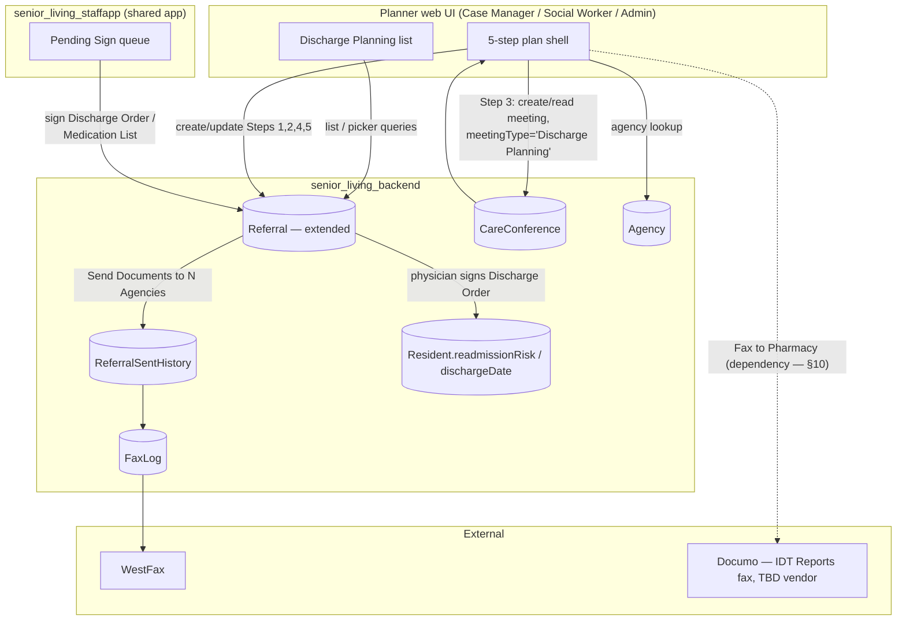

# Technical Design: feature-discharge-planning

| Field | Value |
|---|---|
| Source PRD | `SNF/02_prd/features/discharge-planning/prd-discharge-planning.md`, Draft v2.6 (cleared for Dev/SA review) |
| Author | System Architect |
| Status | Draft — for Sathish / Dev Lead review |
| Reviewers | |
| Product | SNF |

> **Scope note.** This design covers the five-step Safe Discharge Plan workflow only (PRD §§1–11
> excluding §5.8). **LIC 602 A (Form 602) is explicitly out of scope** — it gets its own Technical
> Design against `prd-discharge-planning-annex-a-form602.md`. Every Form-602-only item in the PRD's
> open-questions list (OQ-51, OQ-52, OQ-53, OQ-54) is excluded from this document's open questions and
> risk analysis for the same reason — they are not "resolved," they belong to a different design doc.
> Anywhere the base PRD's Step 1/Step 2/Step 5 behavior *references* Form 602 (the conditional card,
> the Step 5 "Form 602 Signed" checkbox, the ALF-only row in the referral documents table), this design
> treats that reference as an external interface to the Form 602 feature, not something to design here.

## 1. Context and problem statement

The PRD specifies a five-step, stage-gated "Safe Discharge Plan" workflow (Discharge Order → Home
Health Referral → Discharge Planning Meeting → Discharge Medication List → Discharge Checklist),
plus a physician mobile signature loop and read-only PCC integration. Read as a green-field build,
this is a large feature. It is not one.

**Grounding finding (the central fact this design is built around).** `senior_living_backend`
already has a substantially-built `Referral` collection (`src/models/Referral.model.ts`,
`data-schema.md` §2.54) that implements most of what Steps 1, 2 and 4 need: `dischargeTo`,
`dischargeDate` (already floor-validated against `Config.dischargeDateMaxPastDays`, default 28 —
this **is** the PRD's "up to 1 month in the past" rule, already shipped), `homeServices`,
`additionalOrders`, `assignedPhysician`, a `physicianCertification` sub-document (signature S3 key,
signed date, physician name/license) with a `signatureAudit` sub-document (actor, timestamp, IP,
user agent), `unsignedPdfUrl`/`signedPdfUrl`, an `additionalDocuments[]` array shaped exactly like
the PRD's Referral Documents table, and a working WestFax fax-delivery pipeline
(`ReferralSentHistory` + `FaxLog`, `data-schema.md` §§2.61–2.62) that already does record-then-fax,
per-agency/per-document delivery tracking, and manual retry — precisely the behavior PRD §5.4
describes. An `Agency` collection (`data-schema.md` §2.55) already holds exactly the fields PRD
§1.3 assumes for the "Agencies Directory" (name, fax number, address, specialties, status).

This changes the shape of the problem. The job of this design is **not** "design a new discharge
workflow's data model" — it is: (a) decide how the 5-step, independently-gated UI state machine in
PRD §6 sits on top of an existing document whose own `status` field is a single, differently-shaped
enum; (b) identify exactly which pieces are genuinely new (the Care Conference integration for Step
3, the Step 4 medication-list signature loop, the Step 5 checklist, plan-level completion and the
1-month edit window, the multi-agency selection PRD §5.4 requires vs. the single-agency field that
exists today); and (c) resolve the concrete cross-feature collisions this reuse surfaces — most of
which the Director Ops Dashboard and IDT Reports v2 Technical Designs already flagged from their
side before this document existed (§10).

The platform's physician e-signature posture is also more resolved than
`ADR-006-digital-signature-contract.md` (Status: Proposed, 2026-07-12) currently states. The backend
architecture doc's own changelog (`architecture-senior_living_backend.md`, v2.5 delta, 2026-08-08,
pre-production) records a **unified signature service** — `/api/signatures` (`GET /pending`,
`PUT /:id/sign`), serving `directive | referral | medication-list` as three sibling document types,
gated `requireAnyStaffDesignation([DOCTOR, PHYSICIAN])` — and states explicitly that "**Referral
medication list is now a separately physician-signable document**"
(`Referral.medicationListDocId`/`medicationListUnsignedPdfUrl`/`medicationListSignedPdfUrl`/
`medicationListSignatureAudit`). This is the confirmed backend contract ADR-006 was waiting on (its
Option B), and it also means the Pending Sign module already signs medication lists for the current
Home Health Referral feature today — not just the Discharge Order. This closes **TD-DP-4** (§11) and
removes the need for this design to add its own medication-list signature fields (§3.8). One caveat:
the backend doc dates this against `pre-production`, not `production` — worth confirming with
whoever owns the backend that it has actually reached the one live facility before treating it as
unconditionally available (§11).

## 2. Goals and non-goals

### 2.1 Goals

- Implement the Discharge Planning list, new-plan resident picker, and the five-step plan shell
  (PRD §§4, 5.1, 5.2) as a thin UI/state layer over the existing `Referral` backend, extended where
  genuinely new fields are needed.
- Implement Step 1 (Discharge Order), Step 2 (Home Health Referral, including multi-agency fax via
  WestFax), Step 3 (Discharge Planning Meeting, as a Care Conference integration), Step 4 (Discharge
  Medication List, including physician signature and optional pharmacy fax), and Step 5 (Discharge
  Checklist and plan completion) per PRD §5 and the state machines in PRD §6.
- Capture the physician's readmission-risk assessment (PRD §5.9) against the field the Director Ops
  Dashboard design is already introducing for exactly this purpose (§3.9 below), not a new field.
- Reuse, unmodified except where noted: the Agencies Directory (`Agency`), the Care Conference
  feature (`CareConference`), the existing document-viewer component, the existing physician
  Pending Sign / signature-capture module, and the WestFax fax pipeline. Step 3's meeting-completion
  signal depends on a capability `CareConference` does not have today; this design does not build it —
  see the Engineering note in §3.11 and **TD-DP-3**.
- Surface the two concrete integration seams the Director Ops Dashboard design already left open for
  this feature (destination subtitle, `readmissionRisk` permission handoff — §10) and close them from
  this side.

### 2.2 Non-goals

- **LIC 602 A (Form 602)** — separate Technical Design (see scope note above).
- **Building pharmacy contact management or a new fax UI component for Step 4** — per PRD §1.3/§5.6
  this is IDT Reports' responsibility. This design treats it as an external dependency and is more
  pessimistic about its readiness than the PRD is — see §10, this is not a "just wait for it" item.
- **Building the Agencies Directory, the document-viewer component, Care Conference's own
  scheduling/dial-in/recording/transcription/AI-summary infrastructure, or the e-signature capture
  module** — all reused as-is, per PRD §1.2. This includes Care Conference's meeting-completion
  capability: it does not exist today (§3.11), and building it is a note to the Engineering team that
  owns `CareConference` (**TD-DP-3**), not something this design implements.
- **Full audit trail, performance/offline targets, and analytics instrumentation** — explicitly
  deferred to a later phase by the PRD (§§8, 9, 10). This design's data model additions are shaped so
  that deferred audit work has the fields it needs later (see §7 Audit row), but no audit
  infrastructure is built now, consistent with the platform's existing accepted posture
  (`SL-TD-05`/`SL-TD-06`).
- **Platform-level HIPAA safeguards, authentication, session handling, multi-facility scoping** — PRD
  §§7, 11, handled at the platform layer.
- **Resolving the `Referral.selectedHHA` / multi-agency-select tension, the Care Conference
  "Completed" status semantics, or the Referral-workflow-vs-IDT/Director-Ops discharge-date landscape
  platform-wide** — these are flagged and a position is taken for this feature (§§3, 10, 11), but
  fixing the underlying ambiguity for every consumer is out of scope here.

## 3. Proposed design

### 3.1 Architecture summary

No new backend service. This is a schema extension of the existing `Referral` collection inside
`senior_living_backend`, a new `meetingType` value consumed by the existing `CareConference` create
API, and a new admin/staff-web (or wherever the planner-facing surface actually lives — the PRD
calls it "Desktop web," not naming a specific existing app; flagged as **TD-DP-6**, §11) UI
implementing the five-step shell. The physician-facing surface is the existing `senior_living_staffapp`
Pending Sign module, extended to a third document type (medication list) alongside its existing two
(this is already IDT Reports v2's own framing of the same notification workflow — see §3.11 and
§10).



### 3.2 Extending `Referral` in place, not a new collection

**Decision: extend `Referral`, don't create a new `DischargePlan` collection.** `Referral` already
carries `facilityId`, `residentId`, `dischargeTo`, `dischargeDate`, `homeServices`,
`additionalOrders`, `assignedPhysician`, `physicianCertification`, `signatureAudit`,
`unsignedPdfUrl`/`signedPdfUrl`, and `additionalDocuments[]` — i.e., almost the entire Step 1/Step 2
field set already lives here under names that match the PRD field-for-field. Introducing a parallel
`DischargePlan` collection that references `Referral` would mean either duplicating these fields (two
sources of truth for the same discharge order data) or making `DischargePlan` hold only Steps 3–5
while `Referral` holds Steps 1–2 — which fragments one PRD-level "plan" across two collections for no
functional reason. This mirrors the OOO feature's own precedent (extend `Staff.availability` rather
than build a new collection) for the same underlying reason: an as-built field set already covers
most of the new requirement, and duplicating it costs more than reasoning about the divergence.

The one PRD-level identity implication: **"the discharge plan" *is* the resident's `Referral`
document** for this release. The Discharge Planning list query (§3.4) becomes "residents with a
`Referral` document," and "Start a new Safe Discharge Plan" becomes "create a `Referral`." No
Referral currently in production is likely to collide with this reuse — the collection's own staging
history (record-then-fax rework, discharge-date floor, `additionalDocuments[]`) shows it has been
evolving specifically toward this feature's shape already — but see **TD-DP-1** (§11) on confirming
there is no other current consumer of `Referral` that this reuse would surprise.

### 3.3 Field changes on `Referral`

Fields are grouped by one rule: **fields shared across steps stay flat at the root** (Order Summary —
Step 1 — plus identity, since Step 2's packet, Step 5's derived checkboxes, and the physician queue
all read Step 1 data); **fields that already have a shipped shape keep that shape** rather than being
renamed into a nested scheme for consistency's sake; **fields that are genuinely new and step-scoped
nest**, since there's no existing shape to conflict with and it makes the five-step UI's binding
cleaner.

| Field | Status | Notes |
|---|---|---|
| `homeServices.skilledNursingLocationInstructions` | **New** | String, optional. `homeServices` itself already exists as an object of booleans, one per checkbox (Skilled Nursing, Physical Therapy, Occupational Therapy, Medical Social Worker, Speech Therapy, Home Health Aide — PRD §5.3). This is the one addition: an optional free-text field shown when Skilled Nursing is checked, for location/instructions, and retained even if the checkbox is later unchecked. |
| `dischargeOrderStatus` | **New** | enum `In Progress \| Submitted \| Signed`. PRD §5.3 stage status. Default `In Progress`. Root level — Order Summary is shared across steps (§ above). Set explicitly on each transition (§3.6), not derived on read. `Signed` corresponds to the legacy `Referral.status` value `Doctor Approved` (§ below) — both are set by the same physician Pending Sign submit action (§3.6, §3.16); this is a new derived field alongside the legacy one, not a replacement for it. |
| `medicationListStatus` | **New** | enum `Pending \| In Progress \| Submitted \| Signed`. PRD §5.6 stage status. Root level, flat, matching the naming convention of the fields below it (not `medicationList.status`) — see next row. |
| `medicationListDocId` / `medicationListUnsignedPdfUrl` / `medicationListSignedPdfUrl` / `medicationListSignatureAudit` | **Existing — reused, no change** | Already shipped (`architecture-senior_living_backend.md` v2.5 delta, 2026-08-08, pre-production) as part of the platform's unified `/api/signatures` service (§1), flat and prefixed under the platform's own naming convention. `medicationListStatus` (above) is the only genuinely new field this step needs. |
| `homeHealthReferral.status` | **New** | enum `Pending \| In Progress \| Sent`. PRD §5.4 stage status. Nested — see grouping rule above; Step 2 has no existing shape to preserve, so this groups cleanly with the two fields below. |
| `homeHealthReferral.selectedAgencyIds` | **New** | `[ObjectId → Agency]`. See §3.7. This is the field the Step 2 multi-select writes to — the set of agencies the referral is sent to. Not the same thing `selectedHHA` does (below); Step 2 can send to several agencies, Step 5 then narrows to one. |
| `homeHealthReferral.additionalDocuments` | **Existing — relocated** | Was root-level `additionalDocuments[]` (`{name, s3Key, mimeType, sizeBytes, uploadedAt}`); moves under `homeHealthReferral` for the same step-grouping reason as `selectedAgencyIds`. **This is a real data migration, not additive** — see §9.2 and **TD-DP-7** (§11) on confirming what's actually live in production before scoping that script. |
| `selectedHHA` | **Existing — repurposed** | `ObjectId → Agency`. Its old single-primary-agency-at-Step-2 write path is confirmed dead (§3.7) — this design gives it a new purpose instead of adding a new field: it holds the **single agency the planner confirms accepted the referral**, selected in Step 5 (Discharge Checklist) from the full list of agencies the referral was sent to (`homeHealthReferral.selectedAgencyIds`) — see §3.14. |
| `careConferenceId` | **New** | `ObjectId → CareConference`. Root-level pointer (like `residentId`) rather than nested — it's a cross-collection join key, not step-scoped content. This is the **only** field Step 3 adds to `Referral`. Every other piece of the meeting — family members, care team, duration, notes, and completion — lives on `CareConference` itself (§3.11); `Referral` holds nothing pre-schedule and nothing interim. |
| `checklist.dmeStatus` | **New** | enum `Delivered \| Pending \| Loaned \| Not required`. PRD §5.7, default `Delivered`. The only mandatory Step 5 field. |
| `checklist.transportationConfirmed` / `.caregiverTrainingCompleted` / `.followUpAppointmentScheduled` | **New** | Boolean, all manual per PRD §5.7. |
| `checklist.additionalComments` | **New** | String, ≤5,000 chars (the PRD's global free-text limit, §5.3). |
| `checklist.status` | **New** (relocated from `checklistStatus`) | enum `Pending \| In Progress \| Completed`. PRD §5.7 stage status — grouped with the rest of `checklist.*` for consistency, per the same grouping rule. |
| `planCompletedAt` | **New** | Date. Root level — plan-wide, not step-scoped. Set once, on a successful Complete Discharge action (PRD §5.7/§6.1). Drives the 1-month editability window (§3.15) — computed from `dischargeDate`, not from this timestamp (PRD is explicit the window is anchored to the Step 1 Discharge Date). |
| `protectedPdfKey` | **Existing — legacy, marked for deletion** | Confirmed legacy and not in use — **for Engineering to remove** (§11, **TD-DP-9**), not something this design builds against or migrates. |

**The `Referral.status` enum has five values, not four.** `data-schema.md` documents it as
`Incomplete | Pending Signature | Ready to send | Sent`. A signed `Referral` document shows
`status: "Doctor Approved"` — a fifth value `data-schema.md` doesn't list, sitting between
`Pending Signature` and `Ready to send` in the workflow (set once the physician signs, before the
referral is dispatched to agencies): `Incomplete | Pending Signature | Doctor Approved | Ready to
send | Sent`. This design treats `Doctor Approved` as the legacy signal equivalent to its own
`dischargeOrderStatus: Signed` (§3.3's `dischargeOrderStatus` row) — both fire off the same physician
Pending Sign submit action (§3.6, §3.16). This is documentation of an existing, already-shipped
transition, not a new one this design adds.

`Referral.status` itself is **left untouched** — this design adds `dischargeOrderStatus` alongside
it rather than repurposing it, and continues to rely on whatever already sets it (the existing
`ReferralSentHistory` "Sent" transition, per `data-schema.md` §2.61, and evidently whatever sets
`Doctor Approved` on physician sign-off, not yet located in the as-built docs reviewed). This design
does not repurpose it to mean "overall plan status," because the PRD's five independent per-step
machines (§6.2) don't collapse into that single enum without losing information, and because this
design cannot confirm every existing reader of `Referral.status` (**TD-DP-1**, §11) — safer to add
the new fields alongside it than to change what an unverified consumer might depend on.

#### 3.3.1 Quick reference — full `Referral` field shape

The table above is the source of truth for rationale; this is the same information collapsed into
one illustrative document shape, for engineers who just want to see the target schema at a glance.
Comments mark each field's status — they are documentation, not part of the literal schema (Mongoose
doesn't store comments). Fields with no comment are pre-existing, untouched by this feature, and
included only for orientation.

```jsonc
{
  // ── Identity / existing, untouched ──────────────────────────────────────
  "_id": "ObjectId",
  "facilityId": "ObjectId",
  "residentId": "ObjectId",

  // ── Step 1 (Discharge Order) — existing, untouched ──────────────────────
  "dischargeTo": "String",
  "dischargeDate": "Date",
  "homeServices": {                            // existing — object of booleans, one per checkbox (PRD §5.3)
    "skilledNursing": "Boolean",
    "skilledNursingLocationInstructions": "String",  // NEW — optional free text, shown when Skilled
                                                        //   Nursing is checked; retained if unchecked (§3.5)
    "physicalTherapy": "Boolean",
    "occupationalTherapy": "Boolean",
    "medicalSocialWorker": "Boolean",
    "speechTherapy": "Boolean",
    "homeHealthAide": "Boolean"
  },
  "additionalOrders": {                        // existing — target shape, boolean-only, per PRD §5.3
                                                 //   ("DME ordered", "Lab orders for Home Health nurse").
                                                 //   Real data reviewed also carries dmeType/labWorkDetails/
                                                 //   pcpFollowUp — legacy, not part of this shape; flagged
                                                 //   for Engineering cleanup (§3.5, §10, TD-DP-10).
    "dmeOrdered": "Boolean",
    "labOrdersForHomeHealthNurse": "Boolean"
  },
  "assignedPhysician": "ObjectId -> Staff",
  "orderDate": "Date",                        // existing — set/updated each time "Send to Physician for
                                                //   Signature" is used (first send and every resend),
                                                //   not creation and not signing (§3.5)
  "physicianCertification": {                  // existing — Discharge Order certification block
    "physicianNamePrint": "String",
    "licenseNumber": "String",
    "dateSigned": "Date"
  },
  "signatureAudit": {                          // existing — Discharge Order signature audit trail
    "actor": "String",
    "timestamp": "Date",
    "ipAddress": "String",
    "userAgent": "String"
  },
  "unsignedPdfUrl": "String",                  // existing
  "signedPdfUrl": "String",                    // existing
  "protectedPdfKey": "String",                 // LEGACY — confirmed unused, marked for deletion (TD-DP-9).
                                                //   Not part of this design's target shape.

  "dischargeOrderStatus": "In Progress | Submitted | Signed",   // NEW (§3.3) — default "In Progress".
                                                                  //   "Signed" <=> legacy `status:
                                                                  //   "Doctor Approved"` (see below).

  // ── Step 2 (Home Health Referral) ───────────────────────────────────────
  "homeHealthReferral": {
    "status": "Pending | In Progress | Sent",   // NEW, relocated from root `homeHealthReferralStatus`
    "selectedAgencyIds": ["ObjectId -> Agency"], // NEW — the set of agencies Step 2 sends the referral
                                                  //   to. Not the same thing `selectedHHA` does
                                                  //   (below, Step 5) — that's the one agency
                                                  //   confirmed accepted, chosen from this list.
    "additionalDocuments": [                     // EXISTING DATA, RELOCATED from root `additionalDocuments[]`
      {                                          // — real migration, gated on TD-DP-7 (§9.2)
        "name": "String",
        "s3Key": "String",
        "mimeType": "String",
        "sizeBytes": "Number",
        "uploadedAt": "Date"
      }
    ]
  },

  // ── Step 3 (Discharge Planning Meeting) — all NEW ───────────────────────
  "careConferenceId": "ObjectId -> CareConference",  // NEW — root-level join key, set once meeting is scheduled.
                                                       //   The only field this step adds to Referral (§3.11) —
                                                       //   family members, care team, duration, notes, and
                                                       //   completion all live on CareConference itself.

  // ── Step 4 (Discharge Medication List) ──────────────────────────────────
  "medicationListStatus": "Pending | In Progress | Submitted | Signed",  // NEW (§3.3) — the only new field
  "medicationListDocId": "ObjectId",                    // EXISTING — REUSED, no change (unified
  "medicationListUnsignedPdfUrl": "String",             //   /api/signatures service, §3.8).
  "medicationListSignedPdfUrl": "String",
  "medicationListSignatureAudit": {
    "actor": "String",
    "timestamp": "Date",
    "ipAddress": "String",
    "userAgent": "String"
  },

  // ── Step 5 (Discharge Checklist) — all NEW unless noted ─────────────────
  "selectedHHA": "ObjectId -> Agency",          // EXISTING FIELD, REPURPOSED. Was the old
                                                 //   single-primary-agency field (dead write path,
                                                 //   §3.7) — this design reuses it for a new purpose:
                                                 //   the planner's Step 5 pick of which sent-to agency
                                                 //   (from `homeHealthReferral.selectedAgencyIds`,
                                                 //   above) actually accepted.
  "checklist": {
    "dmeStatus": "Delivered | Pending | Loaned | Not required",  // default "Delivered"; only mandatory field
    "transportationConfirmed": "Boolean",
    "caregiverTrainingCompleted": "Boolean",
    "followUpAppointmentScheduled": "Boolean",
    "additionalComments": "String",             // <=5,000 chars, PRD's global free-text limit
    "status": "Pending | In Progress | Completed"  // relocated from root `checklistStatus`
  },

  // ── Plan-wide — NEW ──────────────────────────────────────────────────────
  "planCompletedAt": "Date",                    // NEW — set on successful Complete Discharge (§3.15)

  // ── Legacy — existing, untouched, not repurposed ────────────────────────
  "status": "Incomplete | Pending Signature | Doctor Approved | Ready to send | Sent"
                                                 // existing, five values; NOT overloaded as overall
                                                 // plan status. "Doctor Approved" <=> `dischargeOrderStatus:
                                                 // Signed` above — same trigger, two fields (§3.6).
}
```

### 3.4 Discharge Planning list and resident picker

`GET /api/referrals?facilityId=...` (existing list capability, extended) becomes the Discharge
Planning list's data source: one row per `Referral` document, joined to `Resident` for
name/room/payer/physician/DOB (PRD §5.1's "read from the Shashi Care backend, not PCC directly")
and reading `Resident.readmissionRisk` for the Readmission Risk column (§3.9). Progress (PRD §5.1,
"n of 5 complete") is computed from the five stage-status fields, not stored.

**There is no single field that stores "overall plan status."** Every representation of overall
status is computed at read time from the five stage-status fields (§3.3, §3.6), not stored as its
own value: the **Status badge** is "In progress" until `checklist.status` reaches `Completed` (and
`planCompletedAt` is set), then "Complete" (PRD §5.2); the **Overall Progress** figure is a
percentage — completed steps ÷ 5, rounded (PRD §5.2). `Referral.status` (§ above) is a different,
older enum that predates this feature and tracks the Discharge Order's own signature/send lifecycle
(`Incomplete | Pending Signature | Doctor Approved | Ready to send | Sent`) — it was never the
plan-level status field and this design does not repurpose it to become one, for the reasons given
above (five independent stage machines don't collapse into one four/five-value enum without losing
information).

The new-plan picker's "residents who do not already have a discharge plan" (PRD §5.1) is
`Resident` minus `{residentId: {$in: <all Referral.residentId for this facility>}}` — no new field
needed, since one open `Referral` per resident is already the pattern the collection's existing
`{facilityId, residentId}` index (`data-schema.md` §2.54) supports efficiently. Creating a plan is
`POST /api/referrals` with `residentId` — this endpoint already exists; it needs no new validation
here since one-`Referral`-per-resident is enforced by the picker excluding residents who already have
one, matching the PRD's own note that the picker is the only gate (not a uniqueness constraint) —
**flagged as a gap to close**: without a backend-enforced unique index or pre-check on
`{facilityId, residentId}`, two planners racing the picker could still create two `Referral`
documents for the same resident. Not called out in any as-built doc reviewed, and the PRD doesn't
ask for it either (concurrency is explicitly deferred, PRD §9) — recommended as a technical story
regardless, since it is a correctness gap distinct from the deferred concurrency/UX questions (PRD's
"two planners open on the same resident" is about simultaneous editing, not simultaneous creation).

### 3.5 Step 1 — Discharge Order

Maps directly onto existing `Referral` fields: `dischargeTo`, `dischargeDate` (already floor-validated,
§3.10), `homeServices`, `additionalOrders`, `assignedPhysician` (overridable via the physician-picker,
which already exists as a `Staff` lookup filtered to the doctor designation group per
`isDoctorDesignation()`/`DOCTOR = 'Physician'`, `architecture-senior_living_staffapp.md`), and
`physicianCertification`/`signatureAudit`/`unsignedPdfUrl`/`signedPdfUrl` for the signature loop.

**"Order date" is the date the order was sent for signing, not the creation date and not the
signed date.** `Referral.orderDate` is empty until the first "Send to Physician for Signature"
action, and is set again — not left at its first value — on every subsequent resend (PRD §5.3). It
is not `physicianCertification.dateSigned`: a Referral can show an `orderDate` well before it shows a
`dateSigned`, and a resend after signature (if the workflow ever allows one) would move `orderDate`
forward without touching `dateSigned`. No schema change is needed — `orderDate` already exists — but
this is a behavior this design depends on the backend actually implementing: it has not been
independently confirmed that the current write path updates `orderDate` on every send rather than
only setting it once at Referral creation (flagged as **TD-DP-11**, §11, to verify with whoever owns
the send-for-signature endpoint before this UI mapping is built against it).

**`homeServices` and `additionalOrders` are objects of per-item booleans, not free text or arrays.**
`homeServices` holds one boolean per checkbox — Skilled Nursing, Physical Therapy, Occupational
Therapy, Medical Social Worker, Speech Therapy, Home Health Aide (PRD §5.3) — plus one companion
free-text field, `homeServices.skilledNursingLocationInstructions` (§3.3), shown only when Skilled
Nursing is checked and retained even if it's later unchecked. `additionalOrders` is two booleans,
"DME ordered" and "Lab orders for Home Health nurse," per PRD §5.3 — no DME item list or lab detail
field. This is the target shape this design builds Step 1's UI against.

**A real document reviewed for this design carries extra `additionalOrders` fields
(`dmeType`, `labWorkDetails`, `pcpFollowUp`) that predate this feature and are not part of the target
shape.** That data reflects the current, pre-this-feature state of the field, not a second valid
shape to design around — the PRD's two-boolean shape is what Step 1 is built against. Recommend
Engineering confirm nothing still writes those extra fields and clean up (or migrate/drop) any
existing documents that carry them, the same way `protectedPdfKey` is flagged for cleanup (§3.3,
TD-DP-9) — tracked as **TD-DP-10** (§11).

**"Send to Physician for Signature" validation (PRD OQ-23 — a Blocker per the PRD, not a Form-602
item, so this design does not ignore it).** The PRD confirms today's prototype sends with zero
validation. Recommended minimum for this design, pending Sathish's confirmation: require
`dischargeTo` and `assignedPhysician` to be set (the two fields the signing document cannot render
without) before the send action is enabled; every other Step 1 field stays optional per the PRD's own
field table (§5.3, only Resident/DOB/Attending physician are marked required, and those three are
always present as read-only PCC data). This does not resolve OQ-23 — it is this design's recommended
default, listed in §11 for Sathish to confirm or override before story estimation, per the PRD's own
"Blocker" framing.

Readmission risk is captured on the *physician's* signing screen (§5.9/§3.9), not here — Step 1 only
displays it (PRD §5.1's risk chip).

### 3.6 Stage-status transitions

Each of the five new/extended status fields (§3.3) is set explicitly by the action that PRD §6.2
names as its trigger — never derived by re-evaluating other fields on every read. This matches the
existing `Referral.status`/`ReferralSentHistory.status` pattern (set on creation of a
`ReferralSentHistory` row, not recomputed) rather than introducing a new "compute plan state from
scratch" pattern the codebase doesn't otherwise use for this class of object.

| Field | Trigger | New value |
|---|---|---|
| `dischargeOrderStatus` | "Send to Physician for Signature" | `Submitted` |
| `homeHealthReferral.status` | First `ReferralSentHistory` row created for this Referral where every selected agency is represented | `Sent` |
| Step 3 "Meeting" derived status (badge only — no local status field; see §3.3, §3.11) | Care Conference's own "mark complete" action, or Discharge Planning's manual-fallback action (available once the current date is past the meeting's scheduled date/time, PRD §5.5) | Both triggers are meant to set the same `CareConference.completedAt`/`.completedBy` (§3.11) — but that capability doesn't exist on `CareConference` yet (note to Engineering, TD-DP-3(b), §11). There is deliberately no `Referral`-local field to set instead; Step 3's badge has no working source until Engineering builds it. |
| `medicationListStatus` | "Send to Physician for Signature" (Step 4) | `Submitted` |
| `checklist.status` | "Complete Discharge" confirmed | `Completed` (also sets `planCompletedAt`) |

Signed-state transitions (`dischargeOrderStatus → Signed`, `medicationListStatus → Signed`) are set
by the physician's Pending Sign submit action (§3.16) and do not change any gate, per PRD §6.2 — they
only tick the corresponding Step 5 derived checkbox. The same Discharge Order signing action also
sets legacy `Referral.status` to `Doctor Approved` (§3.3, §11) — an existing transition this design
doesn't add or change, just documents. The two fields move together at the same trigger; nothing in
this design conditions on one without the other.

### 3.7 Multi-agency selection

**Divergence found:** `Referral.selectedHHA` is a single `ObjectId → Agency` reference
(`data-schema.md` §2.54), but PRD §5.4 requires a multi-select ("Select agencies," "Send Documents to
N Agencies"). `ReferralSentHistory.agencies[]` (§2.61) already stores a frozen multi-agency snapshot
*per send* — so the send-history side of this already supports multiple agencies — but there is no
current field representing "the agencies currently selected for this referral, before any send."

**Decision:** add `Referral.homeHealthReferral.selectedAgencyIds: [ObjectId → Agency]` (§3.3) as the
field the Step 2 multi-select chips write to; `ReferralSentHistory.agencies[]` remains the frozen
per-send snapshot exactly as today.

**`selectedHHA`'s old write path is dead, but this design reuses the field rather than adding a new
one.** Its original single-primary-agency semantics is confirmed vestigial
(`architecture-senior_living_backend.md` v2.4 delta, 2026-07-30) — no current flow writes it for that
purpose, and this design doesn't either. Instead it becomes the target of a *new* write, for a
*different* purpose — see §3.14. The planner, in Step 5, picks which one of the (possibly several)
agencies in `homeHealthReferral.selectedAgencyIds` actually accepted the referral, and that pick is
written to `selectedHHA`, not to a new field. This means `selectedHHA` goes from genuinely dead to
live again, just with a new meaning — worth being explicit about, since anyone who encounters the
field name without reading this section would reasonably assume its old, documented meaning ("the
one agency selected at Step 2").

This is why confirming whether anything outside this feature still *reads* `selectedHHA` (**TD-DP-1**,
§11) matters: a stale reader would now see live, structurally valid data with a different meaning
than the one it was written for — a silent-misread risk, not just a dead-field risk. See §10 for the
corresponding risk entry.

### 3.8 Step 4 — Discharge Medication List reuses the platform's existing signature fields

The Home Health Referral feature's existing Pending Sign module already sends the medication list
for signature today, and the backend's own changelog (`architecture-senior_living_backend.md` v2.5
delta, 2026-08-08, pre-production) confirms the fields for it already exist —
`medicationListDocId`, `medicationListUnsignedPdfUrl`, `medicationListSignedPdfUrl`,
`medicationListSignatureAudit` — flat and prefixed, under the platform's unified `/api/signatures`
service (`GET /pending`, `PUT /:id/sign`, serving `directive | referral | medication-list` document
types). This design adds nothing here except `medicationListStatus` (§3.3), the one field PRD §5.6
needs that doesn't already exist: a PRD-defined stage-status enum (`Pending/In Progress/Submitted/
Signed`) distinct from the unified signature service's own internal state.

**Why these stay flat and prefixed rather than nesting under a `medicationList` object.** This
matches `Referral`'s existing root-level convention for the Discharge Order's own signature fields
(`unsignedPdfUrl`, `signedPdfUrl`, `physicianCertification`, `signatureAudit` are root-level too, not
nested under an `order` object), and, more importantly, these exact field names are already shipped
and already read by the Home Health Referral feature's live Pending Sign module today. Renesting them
under `medicationList.*` would be a breaking rename of fields a separate, already-shipped, currently-
consuming component depends on — a real coordination cost with no functional benefit, unlike the
`selectedHHA`/`additionalDocuments` relocations (§3.3, §3.7), which move fields with no other live
consumer. This design keeps the existing flat shape rather than introducing that cost.

**Note for Engineering to decide (TD-DP-12).** This design's recommendation is to leave
`medicationListDocId`/`*UnsignedPdfUrl`/`*SignedPdfUrl`/`*SignatureAudit` exactly as they are, flat
and prefixed, for the coordination-cost reason above. If Engineering later decides the naming
inconsistency (flat/prefixed here vs. nested elsewhere in this design, e.g. `homeHealthReferral.*`,
`checklist.*`) is worth fixing anyway, that is a rename touching a live-consuming component
(`senior_living_staffapp`'s Pending Sign module) and should be scoped as its own follow-up, the same
way TD-DP-8's `Referral` → `Discharge_Plan` rename is — not folded into this feature's build.

The medication list PDF itself is regenerated from current data each time the section is opened (PRD
§5.6) — `medicationListUnsignedPdfUrl` is overwritten on each open/regenerate, consistent with how
`Referral.unsignedPdfUrl` already behaves for the Discharge Order (unchanged this design).

### 3.9 Readmission risk — reuse `Resident.readmissionRisk`, don't add a new field

The Director Ops Dashboard Technical Design is already adding `Resident.readmissionRisk` (enum
`High | Moderate | Low | TBD`, default `TBD`) and states explicitly: "Admin-writable this release;
becomes read-only once Discharge Planning ships (PRD §2.3) — no schema change needed then, just a
permissions change" (`feature-director-operations-dashboard_TD.md` §5). This is precisely the field
PRD §5.9 describes ("saved value stored against that resident's plan... drives the risk chip in both
the Discharge Planning list and the plan header"). This design writes to that same field from the
physician's Discharge-Order-signing screen (mapping PRD's blank/"Not available" state to the existing
`'TBD'` enum value) rather than introducing a second, competing readmission-risk field on `Referral`.

**Sequencing dependency:** this only works once the Director Ops Dashboard's schema change has
shipped. If Discharge Planning ships first, `Resident.readmissionRisk` does not exist yet — flagged
as a cross-feature sequencing risk (§10), not something this design can resolve unilaterally, and as
a required coordination item: Director Ops Dashboard's own admin-write path for this field needs to
become read-only (or physician-write-only) once this feature ships, which is a change on their side,
not this design's to make.

### 3.10 Discharge date — stays on `Referral`, does not touch `Resident.dischargeDate`

`Referral.dischargeDate` already exists and is already validated by
`referral.validation.service.ts`'s `earliestAllowedDischargeDate`/`Config.dischargeDateMaxPastDays`
(default 28 days) — this is the PRD's "up to 1 month in the past, no upper constraint" rule (§5.3),
already shipped, no change needed here.

The Director Ops Dashboard design's own §3.8 ("Discharge-date write path — single clamp function,
three writers") already diagrams the **Referral workflow as an existing consumer** of
`Resident.dischargeDate` — i.e., today's plan-creation flow reads the resident's current
`dischargeDate` once, to prefill Step 1 (PRD §5.1: opening a resident "seeds resident name,
physician and discharge date"), but does not write back to it. This design preserves that: **Step 1's
Discharge Date is read from and written to `Referral.dischargeDate` only.** It deliberately does not
become a fourth writer of `Resident.dischargeDate`, which is already contested between PCC's
convergent-state sync (ADR-001, authoritative on actual discharge), IDT Reports v2's anticipated-date
write, and Director Ops Dashboard's clamped write. Keeping the plan's own date scoped to `Referral`
is the same choice IDT Reports v2 and Director Ops Dashboard's designs each independently converged
on when they considered (and rejected) adding yet another separate date field — the difference here
is that `Referral.dischargeDate` already exists and already serves this exact purpose, so there is
nothing new to add.

### 3.11 Step 3 — Discharge Planning Meeting (Care Conference integration)

`CareConference.meetingType` is a plain, unenumerated `String` field (`data-schema.md` §2.10) — so
introducing `"Discharge Planning"` as a new value requires no schema change, only consistent use of
that literal by whichever service creates the meeting. Care Conference's `residentCNames`,
`familyMemberCNames`, `careTeamCNames`, `date`, `startTime`, `duration`, `where`/`location`,
`conferenceNotes`/`agenda` fields map directly onto the PRD's Step 3 fields.

**`CareConference` is the only place the meeting's data lives; `Referral` stores a reference and
nothing else.** Per PRD §5.5, the Discharge Planning object stores only a reference to the Care
Conference meeting's ID — none of the meeting's own data (family members, care team, duration, notes)
is duplicated or separately persisted on `Referral`. Concretely: Save and "Schedule Meeting" both call
`CareConference`'s own create/update API directly, with whatever Step 3 fields the planner has
entered at that point; `Referral` picks up only `careConferenceId` (§3.3) once the meeting exists.
Before a meeting exists, an unsaved Step 3 form is UI-local state — there is no `Referral`-side draft
field for it. Once `careConferenceId` is set, every Step 3 read and write goes through `CareConference`
via that ID; the plan shell never holds a second, competing copy of the meeting's content.

**Open question — does `CareConference`'s create API accept a plain "Save," before every
schedule-required field is filled?** PRD §5.5 lets a planner Save Step 3 with only some fields
entered, and separately "Schedule Meeting" once the rest are ready. If `CareConference`'s create
endpoint requires all of `date`/`startTime`/`duration` (a real, schedulable meeting) up front, a
plain Save has nothing to call it with. This design assumes `CareConference` can be created in a
partial/unscheduled state (or that the endpoint takes some other set of required fields consistent
with "not yet scheduled") but has not confirmed this against the endpoint's own validation — flagged
as **TD-DP-3(a)** (§11), and this feature's own scope if `CareConference`'s API needs to relax its
validation to support it.

**Note for the Engineering team that owns `CareConference` — it needs a meeting-completion
capability, which does not exist today.** `CareConference` has no field or status value meaning
"finalized/completed" — its cron jobs (`architecture-senior_living_backend.md` §3.8) only reach
`SCHEDULED → IN_PROGRESS` (`careConferenceEnableCron`) and `IN_PROGRESS → IN_REVIEW`
(`careConferenceReviewCron`, once the end time passes); no automatic or existing manual transition
beyond that was found in the reviewed as-built docs. PRD §5.5 describes a user action — "the user
marks the conference complete" — as the primary completion trigger, and this feature separately needs
a manual fallback in Discharge Planning, available once the current date is past the meeting's
scheduled date and time, for the case where that primary trigger hasn't been used. Both need
something to write to on `CareConference` itself — there is deliberately no interim field on
`Referral` (§3.3) to record completion instead.

This design's recommendation to Engineering, not something this design builds: add a
`completedAt` (Date) / `completedBy` (String) pair to `CareConference`, plus the action that sets
them, callable both from Care Conference's own primary "mark complete" trigger and from Discharge
Planning's manual fallback. `completedAt` should be the timestamp the meeting is *marked* complete,
not the meeting's own scheduled date — the two can differ, since marking complete is a status update
that can happen some time after the meeting itself, and the meeting's own date/time already lives in
`date`/`startTime`/`duration`. Once this exists, Step 3's derived "Completed" status reads it directly
via `careConferenceId` — no `Referral`-side field either way. Until Engineering builds it, Step 3 has
no working completion signal at all, from either trigger — this is a **blocking dependency for Step 3**,
not a nice-to-have, tracked as **TD-DP-3(b)** (§11, §10).

### 3.12 Fax — two distinct pipelines, and Step 4's dependency is weaker than the PRD assumes

Two separate fax integrations exist today, not one:

- **WestFax** (`data-schema.md` §§2.61–2.62; `architecture-senior-living-product.md` §2.5) — the
  referral-agency pipeline: record (`ReferralSentHistory`) → dispatch (`POST
  /api/fax/westfax/send`) → per-fax tracking (`FaxLog`) → delivery webhook. This is what Step 2
  already needs and gets unmodified. The delivery webhook's callback URL is config-driven (not
  hardcoded to a staging host, per `architecture-senior_living_backend.md`'s v2.4 delta,
  2026-07-30). `G-28` (`data-schema.md` §2.62) is only half-open: the webhook still performs no
  signature/authenticity verification on inbound callbacks — see §7, §10.
- **Documo** (`architecture-senior-living-product.md` §2.5; `technical-debt.md` `SL-TD-12`/`SL-TD-13`)
  — a simpler `POST /api/fax/send` with no per-recipient tracking model, no retry/idempotency
  (`SL-TD-13`), and a known fail-open bypass flag not gated off in production
  (`SL-TD-12`, `FAX_LOCAL_BYPASS`).

PRD §1.3/§5.6 assumes Step 4's "Fax to Pharmacy" reuses "the existing Fax component already built for
the IDT Reports feature," and that pharmacy contact management is IDT Reports' responsibility
(OQ-67). **Grounding check against IDT Reports v2's own Technical Design says this is not settled
yet, on either count:**

- IDT Reports v2's fax section explicitly says the underlying fax vendor/mechanism is still an open
  Spike ("the exact integration with whatever underlying mechanism actually transmits the fax... a
  one-time fax-vendor discussion in the Spike," `feature-idt-reports-v2_TD.md` §3.4/§6) — i.e., IDT
  Reports v2 has not committed to Documo (or WestFax, or anything else) yet.
- IDT Reports v2's fax UI explicitly **dropped** a saved-contacts shortlist in favor of a single
  free-text fax number ("Fax popover drops its saved-contacts shortlist in favor of a single
  free-text number," same TD). There is no managed pharmacy-contacts list being built there — the
  capability PRD §5.6/OQ-67 is counting on does not exist in IDT Reports v2's actual design as
  reviewed.

This is a real dependency gap, not a "wait for the other PRD to land" formality — treated as a Risk
(§10) and an elevated open question (§11), not folded silently into "reuses an existing component."
**Recommendation for this design:** reuse the already-proven WestFax pipeline for Step 4's pharmacy
fax too (one more `Agency`-shaped-but-pharmacy-scoped recipient, same record-then-fax/`FaxLog`
pattern) rather than building against IDT Reports v2's undecided fax vendor, and treat the managed
pharmacy-contacts list as this feature's own small build (a facility-scoped `PharmacyContact`
collection shaped like `Agency` minus `specialties`) if IDT Reports v2's timeline doesn't resolve
before this feature needs to ship — see Alternatives (§4) and Risks (§10).

### 3.13 Referral documents table

`Referral.additionalDocuments[]` (`{name, s3Key, mimeType, sizeBytes, uploadedAt}`,
`data-schema.md` §2.54) already matches PRD §5.4's Referral Documents table shape exactly (upload,
rename via Edit, delete, unique-by-name-with-replace) for every row except the two system-generated
ones (Discharge Order, Form 602 — the latter out of scope here per the scope note). No schema change
needed; the "auto-save, unlike every other field" behavior PRD §5.4 calls out is already how this
array works today (each upload/delete is its own persisted write, not staged with the rest of the
plan).

### 3.14 Step 5 — Discharge Checklist

`checklist.*` (including `checklist.status`, §3.3) is new. The derived (read-only) checkboxes —
Physician Orders Signed, Referral Sent to Agency, Discharge Medication List Signed — are computed at
read time from `dischargeOrderStatus`/`homeHealthReferral.status`/`medicationListStatus`, not stored
separately, consistent with §3.6's "explicit-transition, not full-recompute" rule for the *stage*
statuses while still avoiding a fourth copy of information already tracked elsewhere.

**Agency confirmation is a single select, sourced from the agencies the referral was sent to, and it
writes to `selectedHHA`.** Step 5 presents the planner with every agency in
`homeHealthReferral.selectedAgencyIds` (the full set the referral was sent to in Step 2, §3.7) and
lets them pick the **one** that actually accepted. That pick is written to root-level `selectedHHA`
(§3.3, §3.7) — reusing the existing field rather than adding a new one, on the reasoning that its old
meaning is confirmed dead and its shape (`ObjectId → Agency`) already fits this new purpose exactly.

The picker itself is only rendered/required as an explicit choice when
`homeHealthReferral.selectedAgencyIds.length > 1` (PRD §5.7); when exactly one agency was selected in
Step 2, `selectedHHA` can default to it without asking the planner to pick again. Worth noting for the
eventual UI: since `selectedHHA` now has a real, current meaning again, any read-only surface that
displays it (a resident summary, a report) should reflect it once Step 5 sets it.

### 3.15 Plan completion and the 1-month edit window

`planCompletedAt` (§3.3) records when Complete Discharge succeeded, but the editability window PRD
§§5.7/6.1 specify is **`Referral.dischargeDate + 1 month`**, not `planCompletedAt + 1 month` — the
PRD is explicit on this distinction. This design computes the window boundary at request time
(`dischargeDate` plus one calendar month) rather than storing a separate `editableUntil` field, since
`dischargeDate` can still be part of Step 1 up until the plan completes and recomputing avoids a
second field that could drift from the source date. Once the window elapses, every mutating endpoint
on this `Referral` (field edits, document actions, re-signing) must reject with the plan's terminal
state — enforced server-side, not just hidden in the UI, consistent with PRD's "editing is blocked
outright" language.

### 3.16 Physician mobile — Pending Sign

Reused as-is. Per IDT Reports v2's own Technical Design, the Pending Sign / staff-app signature
notification workflow already treats "the Health Referral Order Summary and Medication List" as two
existing document types it is joining as a third (`feature-idt-reports-v2_TD.md` §2.1). This is
confirmed directly from the Home Health Referral feature's shipped behavior: **the Pending Sign
module already sends the medication list for signature today**, not just the Discharge Order — i.e.,
both of this design's Step 1 (Discharge Order) and Step 4 (Medication List) signature flows are
already live, established functionality this design is reusing, not building. Combined with the
backend's confirmed unified `/api/signatures` service (§1, §3.8) reading/writing
`physicianCertification`/`signatureAudit` (Discharge Order) and `medicationListDocId`/
`medicationListSignatureAudit` (Medication List), this closes the concrete confirmation ADR-006 was
waiting on (§1, **TD-DP-4**, §11) — no remaining action item here beyond the general
pre-production-vs-production caveat already noted in §1.

## 4. Alternatives considered

| Alternative | Why rejected |
|---|---|
| New `DischargePlan` collection, referencing `Referral` for Steps 1–2. | Fragments one PRD-level "plan" across two collections and two sources of truth for discharge-order data that already lives correctly in `Referral`. See §3.2. |
| Overload the existing `Referral.status` enum to represent overall plan status instead of adding five new stage-status fields. | The enum (`Incomplete/Pending Signature/Doctor Approved/Ready to send/Sent`, §3.3) still cannot represent five independently-gated PRD stages without losing information the state machine (§6.2) requires, and this design could not confirm every existing consumer of that field (TD-DP-1) — safer additive than repurposing. |
| Keep `selectedHHA` as the single source of truth for agency selection at Step 2; require the UI to pick "one primary agency" for that field while tracking the rest only in `ReferralSentHistory`. | Doesn't match PRD §5.4's multi-select requirement, which needs a pre-send "currently selected" set, not just a post-send history. `ReferralSentHistory.agencies[]` is a frozen snapshot per send, not a live selection state. `selectedHHA`'s old write path is confirmed vestigial regardless (§3.7), so there's no live Step-2 consumer to preserve compatibility with — this design instead gives the field a new job at Step 5 (§3.14). |
| Track Step 5 agency confirmation as a multi-accept array — `checklist.homeHealthAgencyAccepted: [{agencyId, accepted}]`. | PRD §5.7's actual need is "which one agency accepted," not a per-agency accept/decline ledger. A single select writing to the existing `selectedHHA` field (§3.7, §3.14) is simpler, matches the real UI need, and avoids adding a new array field when an existing, currently-unused field already has the right shape (`ObjectId → Agency`). |
| Add a new `medicationList.signatureAudit`/`unsignedPdfUrl`/`signedPdfUrl` sub-document for Step 4's signature loop. | This loop and these fields already exist, flat and prefixed (`medicationListDocId` etc.), shipped as part of the platform's unified `/api/signatures` service — building a second, differently-shaped set of fields for the same purpose would fragment the signature data model for no benefit. See §3.8. |
| Wait for IDT Reports v2 to ship its fax component and pharmacy-contacts list before building Step 4's pharmacy fax. | IDT Reports v2's own design shows both are still undecided (fax vendor is an open Spike; no contacts list is being built there at all) — this would leave Step 4 blocked on a dependency with no confirmed delivery shape or date. See §3.12, §10. |
| Build a brand-new fax integration for Step 4 pharmacy fax instead of reusing either existing pipeline. | No justification for a third fax vendor when WestFax's record-then-fax/`FaxLog` pattern already does exactly what a pharmacy fax needs (send, track, retry) and is already proven for Step 2. |
| Store `readmissionRisk` on `Referral` (plan-scoped) instead of reusing `Resident.readmissionRisk`. | Director Ops Dashboard's design is already adding this exact field to `Resident`, explicitly anticipating this feature as its eventual sole writer. A second field would fragment the same fact across two collections and require Director Ops Dashboard's dashboard/list surfaces to somehow reconcile both. |
| Derive all five stage statuses at read time from other fields (no stored status field at all). | Works for the three derived Step 5 checkboxes (§3.14) but not for the stage statuses themselves — several PRD transitions (e.g. "In Progress" starting on first edit vs. on a preceding stage completing, PRD §6.2) depend on *which happened first*, which is only knowable if the transition is recorded when it happens, not recomputed from current field values alone. |

## 5. Data model changes

See §3.3 for the full field table on `Referral`. Summary of collection-level impact:

| Collection | Change |
|---|---|
| `Referral` | Extended, mostly additive (§3.3) — `dischargeOrderStatus`, `medicationListStatus`, `homeHealthReferral.{status, selectedAgencyIds, additionalDocuments}`, `homeServices.skilledNursingLocationInstructions`, `careConferenceId`, `checklist.{dmeStatus, transportationConfirmed, caregiverTrainingCompleted, followUpAppointmentScheduled, additionalComments, status}`, `planCompletedAt`. Step 3 adds only `careConferenceId` — no other new field, since the meeting's own data lives entirely on `CareConference` (§3.11). One relocation, not purely additive: `additionalDocuments[]` moves under `homeHealthReferral` (real migration, §9.2, TD-DP-7). `medicationListDocId`/`*UnsignedPdfUrl`/`*SignedPdfUrl`/`*SignatureAudit` already exist — reused, not added (§3.3, §3.8). `selectedHHA` is repurposed, not left untouched — this design writes it again, for Step 5's single accepted-agency selection (§3.7, §3.14). `Referral.status` remains untouched but its enum runs to five values, including `Doctor Approved` (§3.3), and is not the overall-plan-status field (§3.4). One removal recommended, not made by this design: `protectedPdfKey` is confirmed legacy and unused — flagged for Engineering to delete (§3.3, TD-DP-9). |
| `Resident` | **Dependency, not a change made here.** Reads/writes `readmissionRisk` (§3.9) once Director Ops Dashboard's schema addition ships. Reads (never writes) `dischargeDate` for Step 1 prefill only (§3.10). |
| `Agency` | Unchanged. Read-only lookup for the Step 2 multi-select and (recommended, §3.12) reused for pharmacy fax recipients if the WestFax-reuse alternative is adopted. |
| `CareConference` | **Unchanged by this design; one Engineering-owned dependency.** New consumer: `meetingType: "Discharge Planning"` as a new value of an already-unconstrained String field — no migration, no schema change. Separately, this design depends on `CareConference` gaining a meeting-completion capability (`completedAt`/`completedBy` + a completion action, §3.11) that does not exist today — a note to the Engineering team that owns `CareConference` (**TD-DP-3(b)**), not a change this design implements. |
| `ReferralSentHistory` / `FaxLog` | Unchanged. Existing multi-agency-per-send shape already fits Step 2 as specified. |
| `PharmacyContact` (proposed, conditional) | **New collection, only if the §3.12 recommendation is adopted** (i.e., IDT Reports v2 has not shipped a pharmacy-contacts capability by the time Step 4 needs one). Shape: `{facilityId, name, address, faxNumber, isActive}` — same convention as `Agency` minus `specialties`. Not built unless/until that dependency call is made (§10/§11). |

## 6. API / interface changes

| Endpoint | Change |
|---|---|
| `GET /api/referrals` (existing, extended) | Discharge Planning list source (§3.4) — add resident-picker exclusion support and the new stage-status/readmission-risk fields to the response shape. |
| `POST /api/referrals` (existing) | Plan creation (§3.4). Recommend adding a `{facilityId, residentId}` pre-check or unique index to close the race-condition gap noted in §3.4. |
| `PATCH /api/referrals/:id` (existing, extended) | Steps 1, 2, 5 field writes, including the new `selectedAgencyIds`/`checklist.*` fields, and the Step 5 agency-confirmation write to `selectedHHA` (§3.7, §3.14) — an existing field, but a new write path for it; no separate endpoint needed. |
| `POST /api/referrals/:id/send-signature` (existing pattern, extended) | Discharge Order send (Step 1) — add the minimum-fields validation recommended in §3.5, pending Sathish's confirmation (OQ-23). |
| Medication list send-for-signature | **Not new.** The Home Health Referral feature's existing Pending Sign flow already sends the medication list through the platform's unified `/api/signatures` service. This design adds no new endpoint here — only `medicationListStatus` (§3.3) as a PRD-specific stage-status field for the Discharge Planning UI to set/read alongside the existing flow. |
| `POST /api/fax/westfax/send` (existing, reused) | Step 2 agency dispatch — no change. If §3.12's recommendation is adopted, also the pharmacy fax dispatch path for Step 4. |
| `POST /api/care-conference` (existing, extended usage only) | Step 3 meeting creation — pass `meetingType: "Discharge Planning"`, `residentCNames`, `familyMemberCNames`, `careTeamCNames`, `date`, `startTime`, `duration`, `where`, `conferenceNotes`; store the returned `_id` in `Referral.careConferenceId`. No shape change requested of Care Conference here; whether it accepts a partial/unscheduled create for the plain-"Save" case is open (TD-DP-3(a), §3.11, §11). |
| `PUT /api/care-conference/:id/complete` (proposed) | **Not built by this feature — a note to the Engineering team that owns `CareConference` (§3.11, TD-DP-3(b)).** Would set `completedAt`/`completedBy`, called by both Care Conference's own "mark complete" action and Discharge Planning's manual-fallback action, the latter gated on the current date being past the meeting's scheduled date/time (PRD §5.5). Listed here to show the interface Discharge Planning needs, not as an endpoint this design delivers. |
| `GET /api/referrals/:id/meeting-status` | **New, thin.** Resolves Step 3's derived badge from `CareConference.completedAt` (via `careConferenceId`) — kept as a small dedicated read rather than requiring every Discharge Planning read to join Care Conference itself. |
| `POST /api/referrals/:id/complete` | **New.** Validates Steps 1–4 are all complete and `checklist.dmeStatus` is set (PRD §5.7 gate), sets `checklist.status: Completed` and `planCompletedAt`, rejects if already past the edit window (§3.15). |
| `GET /api/referrals/resident/:residentId/summary` | **New — cross-feature read.** Exposes `{dischargeTo, dischargeDate, planStatus}` for the Director Ops Dashboard's Follow-up notes panel destination subtitle (`feature-director-operations-dashboard_TD.md` §3.9/§10) without denormalizing `dischargeTo` onto `Resident`. Recommended as a joint technical story with the Director Ops Dashboard team (§10) rather than each side inventing its own read path. |

## 7. Non-functional considerations

- **Performance.** Same scale class as the sibling SNF features (hundreds of residents/facility, not
  thousands) — no new indexing strategy beyond `{facilityId, residentId}` (already present on
  `Referral`) and an index on the five new stage-status fields only if list-filtering by status is
  added later (not required by PRD §5.1's current column set). Query-time computation, no
  materialized snapshot, consistent with the precedent both sibling TDs already established for
  this scale.
- **Security.** Reuses existing `authMiddleware`/`facilityMiddleware`/role-gating (the planner roles'
  identical-permissions model, PRD §7, maps onto existing role checks with no new role). One existing,
  partially-tracked gap becomes directly relevant if §3.12's WestFax-reuse recommendation is adopted:
  the WestFax delivery webhook's callback URL is config-driven (`architecture-senior_living_backend.md`'s
  v2.4 delta, 2026-07-30) but still performs no signature/authenticity verification on inbound
  callbacks (`G-28`, `data-schema.md` §2.62, remaining half) — this feature would inherit that
  exposure for pharmacy fax delivery status exactly as Step 2 already does for agency delivery status,
  so it's not a new risk this feature introduces, but it is one this feature would depend on being
  fixed before wider rollout. If Documo is used instead, `SL-TD-12`/`SL-TD-13` (fail-open bypass flag,
  no retry/idempotency) apply instead.
- **Concurrency.** Two planners on the same resident's plan is explicitly deferred (PRD §9). The
  plan-creation race noted in §3.4 is a narrower, correctness-level gap (duplicate plans, not
  conflicting edits) and is flagged as worth fixing regardless of the deferred broader question.
- **Accessibility.** Deferred to a later phase per PRD §9 — not built in this pass.
- **HIPAA / compliance.** Per PRD §11, the full safeguard set is a platform-level concern out of
  scope for this feature. One item this design surfaces that the PRD's own framing doesn't fully
  cover: `physicianCertification`/`signatureAudit`/`medicationListSignatureAudit` already give this
  feature audit-shaped fields (actor, timestamp, IP, user agent) for a legally-relevant document
  class (physician signatures), via the platform's unified `/api/signatures` service — closer to
  ADR-006's Option B than the platform's general "no dedicated audit trail" posture (`SL-TD-05`/
  `SL-TD-06`). This is confirmed resolved for the signature moment itself, with only the
  pre-production-vs-production caveat remaining (TD-DP-4, §11). This design does **not** extend the
  same rigor to every other candidate audit event PRD §8 lists (plan created/opened, field changes,
  document actions, fax events) — those remain deferred per the PRD, consistent with platform
  precedent.
- **Audit/data-integrity.** Not applicable beyond the signature-audit note above — PRD §8 defers
  the full requirement, PRD OQ-70 (whether post-completion edits during the 1-month window are
  audit-logged) is carried forward unresolved (§11), consistent with how OQ-70 is stated in the PRD
  itself.

## 8. Testing strategy

- **Unit.** Each stage-status transition function (§3.6) against every trigger in PRD §6.2's
  transition table, including the "whichever happens first" races (e.g. Step 3 entering In Progress
  on Step 2 completing *or* on first edit). The 1-month edit-window boundary computation (§3.15),
  including the exact-boundary case. The discharge-order-send minimum-fields check (§3.5) once
  Sathish confirms or overrides the recommended default. The derived Step 5 checkbox computations
  (§3.14). The Step 5 agency-select write to `selectedHHA` — confirm it only accepts a value from the
  current `homeHealthReferral.selectedAgencyIds` set (§3.14), and confirm the physician's Pending
  Sign submit action sets both `dischargeOrderStatus: Signed` and legacy `status: 'Doctor Approved'`
  together, not just one (§3.6).
- **Integration.** Multi-agency WestFax dispatch against `selectedAgencyIds` (§3.7) producing one
  `ReferralSentHistory`/`FaxLog` set per agency, matching Step 2's existing per-agency delivery-status
  rollup. Care Conference create/read round-trip with `meetingType: "Discharge Planning"`, confirming
  `careConferenceId` resolves correctly and the derived meeting-status endpoint (§6) reflects
  `CareConference.completedAt` once Engineering's completion capability (§3.11, TD-DP-3(b)) exists —
  covering both the Care-Conference-driven and manual-fallback paths that write to it. The Pending
  Sign queue rendering both Discharge Order and Medication List cards for the same resident
  concurrently, each independently signable.
- **End-to-end.** Full five-step happy path: create plan → send Discharge Order → send referral to
  multiple agencies → schedule and complete the Discharge Planning meeting → send and sign the
  medication list (optionally fax to pharmacy) → complete the checklist and Complete Discharge →
  confirm the plan remains editable until `dischargeDate + 1 month` and is blocked after.
- **Data setup.** Requires Agencies Directory fixtures with fax numbers (existing `Agency` fixtures
  should already cover this) and, if §3.12's WestFax-reuse recommendation is adopted, pharmacy
  contact fixtures in whatever collection is decided there.

## 9. Rollout and migration plan

### 9.1 Phased rollout

1. **Internal** — Steps 1–2 and 5 (Discharge Order, Home Health Referral, Checklist/Completion)
   behind a feature flag, since these are the parts fully backed by existing, already-proven
   infrastructure (`Referral`, WestFax, Agency). Exit criterion: a full create → send-order →
   send-referral → complete-checklist path succeeds against staging data with no Form 602 involved
   (ALF destination excluded from this phase's test set, since Form 602 isn't built by this design).
2. **Pilot facility** — add Step 3 (Care Conference integration) and Step 4 (Medication List
   signature loop, pharmacy fax only if §3.12's dependency has resolved by this point — otherwise
   ship Step 4 without the pharmacy-fax action and treat it as a fast-follow, since PRD §5.6 already
   states faxing to pharmacy "is not a gate of any kind"). Exit criterion: one pilot facility's
   planners complete at least one real resident's plan end-to-end (minus Form 602) with no manual
   data-fix required.
3. **General availability** — remaining facilities, once Form 602's own Technical Design has shipped
   (since ALF-destination plans are otherwise missing a required step) and the readmission-risk
   sequencing dependency (§3.9/§10) has landed on the Director Ops Dashboard side.

### 9.2 Data migration

Most schema changes are additive: new fields default to their stage-appropriate starting value
(`In Progress`/`Pending`, per §3.3) when absent, so pre-existing Referral rows created before this
feature ships are treated as Discharge-Order-only plans that simply haven't progressed past Step 1
yet, which is the correct semantic (they predate the multi-step plan concept, but their existing
Discharge Order data is real). One field is a genuine relocation, not purely additive: root-level
`additionalDocuments[]` moves to `homeHealthReferral.additionalDocuments` (§3.3) — any existing
document rows with this array populated need a migration script that moves the array under the new
nested path, not just a default for absent fields.

**TD-DP-7 (§11) gates scoping that script.** Migration cost is expected to be low, since only one
facility is live today, but this design has not independently confirmed which of the fields discussed
here (`selectedHHA`, `additionalDocuments`, any `medicationList*` fields) are actually populated in
the *production* database today versus only having shipped to pre-production per the backend
changelog. `additionalDocuments` in particular predates this feature and may well have real
production rows. Recommend confirming the live-production field census (TD-DP-7) before writing the
migration script, so its scope (single-facility script vs. something that needs to handle a real,
populated array) is based on what's actually there rather than assumed.

**Rollback:** clean until `planCompletedAt` starts being written for real plans — once a facility has
live completed plans depending on the checklist/completion fields, rolling this feature back would
strand those documents in a state the pre-feature code doesn't understand. The `additionalDocuments`
relocation is a second rollback consideration: rolling back after that migration runs would require
either a reverse migration or leaving pre-feature code unable to find documents it expects at the old
path. Recommend keeping the rollback window to the internal/pilot phases only, before either migration
has touched real data.

### 9.3 Observability

- **WestFax delivery failure rate**, split by Step 2 (agency) vs. Step 4 (pharmacy, if adopted) —
  threshold: alert if failure rate for either exceeds the rate already tolerated for Step 2 alone
  today (establishes its own baseline in phase 1 rollout, §9.1).
- **Pending Sign queue age** for Discharge Order and Medication List items — a document sitting
  unsigned for an unusually long time is an operational signal even though PRD §5.9 explicitly defers
  escalation-on-unsigned to a later phase; this is a metric, not a feature.
- **Manual-fallback completion rate for Step 3**, once Engineering's completion capability (§3.11,
  TD-DP-3(b)) exists — which of its two callers set `completedAt` on a given meeting, Care Conference's
  own primary trigger or Discharge Planning's manual fallback. A persistently high fallback rate would
  mean planners are routinely bypassing Care Conference's own completion trigger, worth surfacing to
  whoever owns that screen rather than only discovering it during support escalations.
- **Discharge-date floor-rejection rate** on `Referral.dischargeDate` writes (existing
  `referral.validation.service.ts` check, §3.10) — already-existing validation, now exercised by a
  new UI surface; worth confirming it doesn't spike unexpectedly once planners start using Step 1
  directly instead of whatever the pre-existing Referral consumer was.

## 10. Risks and mitigations

| Risk | Likelihood/Impact | Mitigation |
|---|---|---|
| Step 4's pharmacy fax depends on IDT Reports v2 capabilities (fax vendor, managed contacts list) that are not actually built or even vendor-decided in IDT Reports v2's own reviewed design, contrary to the PRD's OQ-67 framing that this is simply "pending." | High/Medium — Step 4 could ship without a working pharmacy-fax action, or wait indefinitely on an undated external dependency. | §3.12's recommendation: reuse WestFax (already proven) and, if needed, build a small dedicated `PharmacyContact` collection now rather than block on IDT Reports v2. Confirm direction with Sathish before Epic/Story creation for Step 4 (§11). |
| `Resident.readmissionRisk` (§3.9) does not exist until the Director Ops Dashboard feature ships its own schema change — a sequencing dependency between two SA-authored designs. | Medium/Medium — if Discharge Planning ships first, the physician-signing screen has nowhere to write the risk value. | Sequence Discharge Planning's GA phase (§9.1) after Director Ops Dashboard's `readmissionRisk` field lands; flagged explicitly in the rollout plan. Confirm current relative timelines with Sathish. |
| `CareConference`'s create API may not accept a partial/unscheduled create — needed for Step 3's plain "Save" before all schedule-required fields are filled (§3.11, TD-DP-3(a)). | Medium/Medium — if the endpoint requires a full schedulable meeting up front, a plain Save has nothing to call it with, and Care Conference's own validation would need to relax to support this feature's use case. | Confirm against `CareConference`'s actual create-endpoint validation before Step 3 Epic/Story estimation; coordinate with whoever owns `CareConference` if it needs to change. |
`CareConference` has no meeting-completion capability today, and building one is a note to the Engineering team that owns it, not something this design delivers (§3.11, TD-DP-3(b)). | High/High — Step 3 has no working "Completed" signal, from either the primary trigger or the manual fallback, until this lands. Unlike the readmission-risk sequencing dependency (§3.9), there is no fallback field on `Referral` to lean on in the meantime. | Raise as a blocking dependency for Step 3, not a nice-to-have — sequence the `CareConference` change ahead of Step 3's Epic, owned and estimated by whoever owns `CareConference`, before Step 3 story estimation. |
| A real document reviewed for this design shows `additionalOrders` carrying `dmeType`, `labWorkDetails`, and `pcpFollowUp` alongside the two PRD booleans — legacy data not part of the target shape this design builds Step 1 against (§3.5, TD-DP-10). | Low/Low — this design builds against the PRD's boolean-only shape regardless, so Step 1's UI is not at risk; the residual risk is stale production data outliving the field's documented shape if nobody cleans it up. | Note to Engineering: confirm nothing still writes the extra fields, and migrate/drop them from existing documents (TD-DP-10, §11) — the same pattern as `protectedPdfKey` (TD-DP-9). |
| `Referral.orderDate` is assumed (per the updated PRD, §3.5) to be set on every "Send to Physician for Signature" action, not just at creation — not independently verified against the current backend implementation (TD-DP-11, §11). | Low/Medium — if the backend only sets `orderDate` at creation today, this feature's "Order date" display would be wrong until the backend is updated to match. | Verify with whoever owns the send-for-signature endpoint before Step 1's Order Date display is built (TD-DP-11, §11). |
| `Referral.status` may have consumers outside this feature that this design's review did not surface (TD-DP-1). | Low/Medium — additive changes here are safe regardless, but a future decision to repurpose `status` could break an unseen dependency. | No destructive change made to `status` (§3.3); resolve TD-DP-1 before any follow-up work repurposes it. |
| `selectedHHA` is repurposed by this design (§3.7, §3.14) to hold Step 5's confirmed-agency selection — but its *old* meaning ("the one agency selected at Step 2") is still what `data-schema.md` and any code written against it would assume, and this design's review did not confirm whether anything outside this feature still reads the field. | Medium/Medium — the field goes from unused to holding *live, current* data again. A stale reader expecting the old semantics wouldn't fail loudly (the field is populated, correctly typed, a valid `Agency` reference) — it would silently read the wrong thing: "the agency selected at Step 2" when it's actually "the agency confirmed accepted at Step 5." | Resolve TD-DP-1 (§11) — specifically, whether any other reader exists — before this feature ships, not just before follow-up work; a silent-misread risk is worse than an unused-field risk and deserves resolving pre-launch. |
| Reusing WestFax for pharmacy fax (§3.12) inherits its delivery webhook's remaining gap: no signature/authenticity verification on inbound callbacks (`G-28`, half-resolved — the callback-URL half is already config-driven). | Low/Medium — pre-existing platform gap, not introduced by this feature, but this design would extend its usage surface. | Not this design's fix to make; recommend the platform prioritize closing `G-28`'s remaining half given a second feature would now depend on it, consistent with how the Director Ops Dashboard TD made the same kind of recommendation for the PCC webhook gap it depends on. |
| The plan-creation race (§3.4) could let two concurrent "Start a new Safe Discharge Plan" actions create two `Referral` documents for the same resident. | Low/Medium — PRD doesn't ask for concurrency handling, but a duplicate plan is a data-correctness bug, not a UX nuance. | Add a `{facilityId, residentId}` pre-check or partial unique index as a small technical story, independent of the explicitly-deferred broader concurrency question. |

## 11. Open questions

| ID | Question | Current position | Priority |
|---|---|---|---|
| OQ-01 (PRD, carried) | Scope confirmation. | Already resolved in PRD §1.2 — listed here only because the PRD's own table still marks it Blocker; no action needed from this design. | Resolved |
| OQ-03 (PRD, carried) | Source for family members/relationships and TB test history. | Not resolved by this design. Recommended default if Sathish wants one now: family members captured as Discharge-Planning-scoped free entry (name + relationship, no directory lookup) until a source is confirmed, consistent with how Care Team is a `Staff` lookup but Family isn't described as one anywhere in scope. | Blocker (per PRD) |
| OQ-23 (PRD, carried) | Required fields before "Send to Physician for Signature" (Step 1). | This design's recommended default: `dischargeTo` + `assignedPhysician` required, nothing else (§3.5). Needs Sathish's confirmation before story estimation, per the PRD's own Blocker framing. | Blocker (per PRD) |
| OQ-67 (PRD, carried, elevated) | Pharmacy contact management ownership (PRD frames as "closes once IDT Reports PRD lands"). | **Elevated, not just carried forward** — IDT Reports v2's actual Technical Design does not build this capability and has not decided a fax vendor either (§3.12). Recommend Sathish decide between (a) this feature builds a small `PharmacyContact` collection now, reusing WestFax, or (b) Step 4's pharmacy-fax action ships later as a fast-follow once IDT Reports v2 resolves its own Spike. | High (re-scoped from PRD's Medium) |
| TD-DP-1 | Does anything outside this feature currently *read* `Referral.selectedHHA`, and does anything outside this feature read or write `Referral.status`? | `selectedHHA`'s *old* write path (single agency at Step 2) is confirmed vestigial (backend changelog v2.4 delta, 2026-07-30). This design gives the field a *new* write path (Step 5's confirmed-agency selection, §3.7, §3.14) — so whether anything still reads it under the old meaning is a "field now returns live but differently-meant data" question (§10), not a "field stays quietly empty" question. `Referral.status`'s consumers also remain unconfirmed, and its enum runs to five values, not four (§3.3) — worth re-checking `data-schema.md`/source once this is resolved. | **High → Blocker for `selectedHHA` specifically** — recommend resolving before this feature ships, not just before follow-up work touches the field, given the silent-misread risk (§10). `Referral.status`'s consumer question stays High, not elevated to Blocker, since this design still doesn't write to it. |
| TD-DP-2 | Where should managed pharmacy contacts live, and who builds it — this feature or IDT Reports v2? | See OQ-67 above; same underlying question, listed separately since it's a technical-design-level decision (which collection, which team) rather than the PRD-level "who owns this" framing. | High |
| TD-DP-3 | (a) Does `CareConference`'s create API accept a partial/unscheduled document, so Step 3's plain "Save" (before all schedule-required fields are filled) has something to call? (b) What should the manual-fallback completion action write on `CareConference`? | **(a) open** — not confirmed against `CareConference`'s actual create-endpoint validation. **(b) note to the Engineering team that owns `CareConference`, not resolved by this design:** add a `completedAt`/`completedBy` pair and a completion action on `CareConference` itself (§3.11), callable by both Care Conference's own primary completion trigger and Discharge Planning's manual fallback — this design deliberately adds no interim field on `Referral` (§3.3) as a substitute, so Step 3 has no working completion signal until Engineering builds this. | Medium for (a). **(b): Blocker for Step 3** — flag to whoever owns `CareConference` before Step 3 story estimation (§10). |
| TD-DP-4 | Has ADR-006's digital-signature backend contract question actually been answered by `Referral.physicianCertification`/`signatureAudit` (Discharge Order) and `medicationListDocId`/`medicationListSignatureAudit` (Medication List)? | **Yes, confirmed.** The backend's own changelog documents a unified `/api/signatures` service serving both document types (v2.5 delta, 2026-08-08), and the Home Health Referral feature's Pending Sign module independently confirms it already sends both today. Residual, not a reason to keep this open at High priority: whether the pre-production-dated shipment has reached the production database (folded into the general pre-production-vs-production caveat, §1). | Resolved (residual tracked informally in §1/§10, not as its own blocking item) |
| TD-DP-5 | Should the plan-creation race (§3.4) be closed with a unique index or an application-level pre-check, and is either safe given whatever else currently writes `Referral` documents? | No position taken — flagged as a small technical story (§10) rather than resolved here. | Medium |
| TD-DP-6 | Which existing web application hosts the planner-facing Discharge Planning list/plan-shell UI? The PRD says "Desktop web" without naming `senior_living_admin` or another surface, and the reviewed as-built docs describe `senior_living_admin` as the Director/Admin-facing app (Director Ops Dashboard, IDT Reports) rather than a Case-Manager/Social-Worker planner tool. | Not resolved by this design — assumed to be `senior_living_admin` for planning purposes (same app IDT Reports and Director Ops Dashboard already extend) but not confirmed. Affects §3.1's "no new service" framing if it turns out to be a different, unreviewed surface. | High |
| TD-DP-7 | Of the fields this design relies on as shipped per the backend changelog (`selectedHHA` vestigial, `additionalDocuments[]`, `medicationList*` signature fields), which are actually populated/live in the **production** database today, versus only having shipped to pre-production? Needed to correctly scope the `additionalDocuments` relocation migration (§9.2) — migration cost is expected to be low since only one facility is live, but this design hasn't independently confirmed that against production data. | Not confirmed by this review. | Medium — doesn't block the design, but should resolve before the §9.2 migration script is written. |
| TD-DP-8 | **For Engineering to decide.** Should the `Referral` document be renamed to `Discharge_Plan`? | **Held open — decision owner is Engineering, not this design.** This design's recommendation, offered as input rather than a decision made here: keep `Referral` as the collection/model name. A rename touches every cross-TD reference to "the Referral workflow" in the Director Ops Dashboard and IDT Reports v2 designs (both name it explicitly), every existing endpoint path (`/api/referrals/...`), and the model file itself, for a naming change with no functional effect — real coordination cost across three SA-authored designs for a cosmetic gain. If Engineering decides to proceed anyway, this design can scope it as its own follow-up (migration script, cross-TD reference updates, endpoint versioning or aliasing) once decided. | Engineering team to decide — not blocking |
| TD-DP-9 | **For Engineering to action.** Delete the legacy `Referral.protectedPdfKey` field. | **Confirmed legacy and unused.** Not part of this design's target shape (§3.3, §3.3.1, §5). Recommend Engineering: (a) confirm nothing still writes it (check whatever originally set it — likely an older signed-PDF protection/watermarking step that's since been superseded by `signedPdfUrl`), (b) drop the field from existing documents and from the model/schema, and (c) remove or archive the S3 objects it pointed to (`referrals/<id>/protected.pdf`) if they're not otherwise referenced. This design does not build against it and does not need it deleted before it can ship — a cleanup item, not a blocker. | Engineering team to action — not blocking |
| TD-DP-10 | **For Engineering to action.** Clean up `Referral.additionalOrders` documents that carry `dmeType`, `labWorkDetails`, `pcpFollowUp` — legacy fields outside the PRD's target boolean-only shape (`dmeOrdered`, `labOrdersForHomeHealthNurse`, §3.5). | **Target shape confirmed: the PRD's two booleans.** The extra fields, seen in a real document reviewed for this design, reflect the current pre-this-feature state, not a second valid shape. Recommend Engineering confirm nothing still writes them and migrate/drop them from existing documents, the same pattern as `protectedPdfKey` (TD-DP-9). This design builds Step 1's UI against the target shape either way. | Engineering team to action — not blocking |
| TD-DP-11 | Does the current backend implementation of `Referral.orderDate` already update on every "Send to Physician for Signature" action (first send and every resend), matching the PRD's confirmed semantics (§3.5), or does it only set the field once at Referral creation? | Not independently verified. This design's UI mapping assumes the PRD's semantics are already implemented — if not, the backend needs a change before this feature's Order Date display is correct. | Medium — verify with whoever owns the send-for-signature endpoint before Step 1 estimation (§10). |
| TD-DP-12 | **For Engineering to decide.** Should `medicationListDocId`/`*UnsignedPdfUrl`/`*SignedPdfUrl`/`*SignatureAudit` be renamed/nested under a `medicationList` object, for naming consistency with this design's other step-scoped fields (`homeHealthReferral.*`, `checklist.*`)? | **Held open — decision owner is Engineering, not this design.** This design's recommendation: keep the fields flat and prefixed as they already ship, since they're already read live by `senior_living_staffapp`'s Pending Sign module (§3.8) — a rename would be a breaking change to a live-consuming component for a cosmetic gain, the same trade-off TD-DP-8 weighs for the `Referral` rename. | Engineering team to decide — not blocking |
