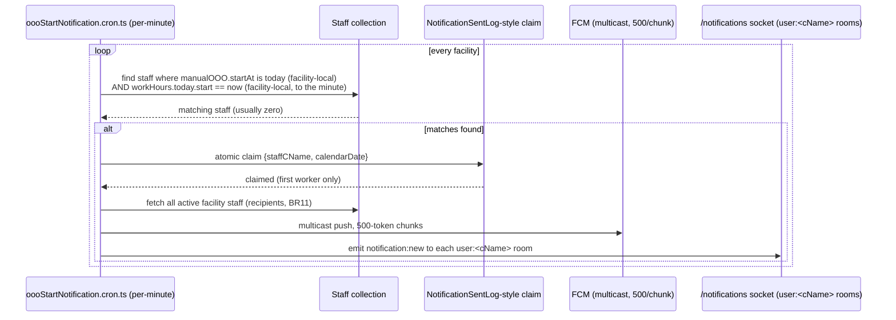

# Technical Design: feature-out-of-office

| Field | Value |
|---|---|
| Source PRD | `SNF/02_prd/features/out-of-office/prd-out-of-office.md`, v1.0 (Draft) |
| Author | System Architect |
| Status | Ready for review |
| Reviewers | Sathish, Product Manager |
| Product | SNF (per PRD header: "sits at the platform-foundation / messaging level," applies to both SAL and SNF; filed under SNF per the doc tree's temporary as-built placement, not a SNF-only feature) |

## 1. Context and problem statement

The PRD specifies two independent OOO triggers (automatic — outside configured Work Hours; manual — a fixed-date vacation/leave record with its own badge/status/delegate), a universal badge that must render on every surface where a staff name/avatar appears across five client surfaces (admin web, staff app ×3 flows, SN/SL resident apps, TV), a facility-wide admin oversight list, and a deliberate, explicit divergence from the platform's default "something changed → push" notification pattern (BR6) with two named exceptions (delegate notification, OOO-start notification).

None of this is small CRUD. Four things need an explicit design because nothing in the codebase gives an off-the-shelf answer:

1. **Data model.** The Staff model already carries an `availability` field (`StaffAvailabilitySchema`, weekly `{MONDAY..SUNDAY:{isAvailable, slots[]}}`) that is structurally close to what "Work Hours" needs — but it backs the buggy, typo'd rehab-therapist slot-booking endpoint (`PUT staff/availabilty/:staffCName`, `technical-debt.md` item 18), a different concern (bookable appointment slots, not a personal in/out-of-office signal). Per Sathish's decision (below), this design extends and repairs that existing field rather than building a second, similarly-shaped collection alongside it.
2. **A read-hot, always-on UI signal.** The badge is evaluated on every name/avatar render across the highest-traffic surfaces in the product (messaging lists, grids, pickers) — the platform has already paid down one round of exactly this kind of badge-performance debt for chat unread counts (`messaging-chat.md` MSG-FR-17a) and shouldn't reintroduce it here.
3. **A facility-time computation with no settled platform answer.** Work Hours and OOO evaluation are defined entirely in facility-local time (PRD A12), but ADR-005 (facility timezone authority) is still `Proposed` — only the staff app currently treats facility time as authoritative; admin web, both resident apps, the TV app, and the backend's own cron scheduling are unverified or known to still run in whatever the server process's local zone is (`announcements-notifications.md` BR6: cron TZ math uses a single process-wide `FACILITY_TIMEZONE` env, not `Config.timeZone` per facility).
4. **A named exception to the platform's own no-push default**, layered onto three existing delivery channels (FCM, Socket.io, `NotificationHistory`) that this feature must partially opt out of (BR6) while still using two of them for its two exceptions (BR6a, BR7).

This document resolves the three technical questions Sathish decided on 2026-08-21: (1) resolve facility-local time server-side, scoped to this feature, rather than waiting on ADR-005 — the same approach already taken by the Director Operations Dashboard TD for the identical gap; (2) extend and repair the existing `Staff.availability` field/endpoint rather than build a separate collection; (3) delegate-assignment and OOO-start notifications are FCM + socket only, with no `NotificationHistory` entry.

## 2. Goals and non-goals

### 2.1 Goals

- Serve Work Hours configuration, manual OOO (badge/status/duration/delegate), and the universal badge read path across every surface named in PRD §5.2, at facility-staff scale (tens to low hundreds of staff per facility — no dedicated performance budget is given in the PRD, but this is the same order of magnitude the platform's other facility-scoped query-time aggregations already handle, e.g. the KPI Dashboard and Director Ops Dashboard).
- Establish one facility-local "now" for Work Hours/OOO evaluation, computed server-side and scoped to this feature's own endpoints and cron jobs — without waiting on ADR-005's platform-wide resolution.
- Extend the existing `Staff.availability` field to house Work Hours + Manual OOO + Delegate, while repairing its underlying naming/endpoint debt (the `availabilty` typo) as part of the same migration, without breaking the existing rehab-therapist slot-booking consumer of that field.
- Build the shared badge/profile-popup component library once, consumed by both React Web and React Native surfaces.
- Implement the two named notification exceptions (delegate assignment, OOO-start) as FCM + socket sends with no `NotificationHistory` row, consistent with Sathish's decision and BR6's stated intent that OOO activity not appear as a persistent inbox item.

### 2.2 Non-goals

- Active coverage — rerouting `assignedStaff[]`, resident chat routing, or Pending Sign visibility to a delegate (PRD §10; deferred, contingent on ADR-006).
- A facility-configurable badge catalog (PRD §2.2) — the catalog is a fixed platform-wide enum, shipped as an app constant, not `Config` data.
- Delegate-of-delegate chain resolution (PRD §2.2/A6).
- Resolving ADR-005 platform-wide — this design resolves facility-local time only for this feature's own endpoints/cron (§3.4), the same seam the Director Ops Dashboard TD already left.
- Resolving ADR-006 (Pending Sign audit posture) — this feature only adds a purely visual, informational badge next to the existing physician-selection and Pending Sign UI (BR9); it does not touch the Referral/ACD signing contract, the `assignedPhysician` field, or ADR-006's open audit questions.
- Any change to the rehab-therapist slot-booking *behavior* — the endpoint is renamed and the schema is restructured for clarity, but the booking semantics and response shape for that use case are preserved exactly (§4, §10).
- A dedicated audit-trail collection for OOO create/edit/admin-override actions — per PRD §9's own recommendation, this follows the platform's existing field-level-timestamp-only posture (`technical-debt.md` SL-TD-05/SL-TD-06/SL-DEF-04), the same posture ADR-006 flags as a live open question for the adjacent Pending Sign feature, not a new precedent set here.

## 3. Proposed design

### 3.1 Where this lives

**Backend:** New Express routes under `/api/staff/{staffCName}/work-hours`, `/api/staff/{staffCName}/availability` (the corrected-spelling successor to the legacy `PUT staff/availabilty/:staffCName`), `/api/staff/{staffCName}/ooo`, plus facility- and staff-scoped read endpoints (§6). All new/renamed routes are facility-scoped via the existing `x-facility-id` convention and reuse existing role middleware — self-service routes require the caller to be the staff member themselves; admin-on-behalf-of routes additionally accept `requireAnyRole(['ADMIN'])`, matching the existing dual self/admin-edit pattern already used for other staff-profile fields.

**Frontend:** A shared component/hook library (`useOOOStatus()`, `useWorkHoursEditor()`, `useDelegatePicker()`; `OOOBadge`, `OOOProfilePopup`, `WorkHoursEditor`, `DelegateSearch`) consumed by both `senior_living_admin` (React Web) and the staff app / `senior_living_reactnative` (React Native), with platform-specific styling only (Tailwind/CSS vs `StyleSheet`). The Account/Settings destination extends the existing admin-web `SettingsPage.tsx` Account tab (PRD A7); on the staff app, only the LEGACY flow has an existing Settings screen, and it doesn't cover this — MIGRATED (and, per PRD A7, possibly CHAT_HOME) need a new Settings destination built. The combined Work Hours + Manual OOO + badge picker + status message + delegate-assignment editor is built as one reusable unit (PRD A7's own instruction), embedded both in Account/Settings and in the admin's Staff-profile edit view (§5.3's admin-set-OOO surface).

### 3.2 Data model — extending `Staff.availability`, not a new collection

Per Sathish's decision, Work Hours, Manual OOO, and Delegate are added as new sub-documents on the existing `Staff.availability` field, and the field's *existing* content (today an undifferentiated `{MONDAY..SUNDAY:{isAvailable, slots[]}}` used only by rehab-therapist slot booking) is renamed into its own explicitly-labeled sub-key rather than left ambiguous:

```
Staff.availability: {
  workHours: {                     // NEW — OOO/Work Hours, single range per day (PRD A13)
    MONDAY:    { isWorkDay: Boolean, start: 'HH:mm', end: 'HH:mm' },
    ...
    SUNDAY:    { isWorkDay: Boolean, start: 'HH:mm', end: 'HH:mm' }
    // default at backfill/creation: Mon–Fri isWorkDay:true 09:00–17:00, Sat/Sun isWorkDay:false (A13)
  },
  therapistBookingSlots: {         // RENAMED, same shape as today's top-level availability — rehab-only, unchanged semantics
    MONDAY:    { isAvailable: Boolean, slots: [{ start: Date, end: Date }] },
    ...
  },
  manualOOO: {                     // NEW — nullable; one active record at a time (BR2)
    startAt: Date, endAt: Date,                     // fixed range, both required together (BR2)
    badge: String (enum, fixed platform catalog),
    statusMessage: String,
    delegateCName: String,                          // Staff ref, facility-wide, no eligibility filter (BR4)
    createdBy: String, createdByType: 'STAFF' | 'ADMIN',
    updatedBy: String, updatedByType: 'STAFF' | 'ADMIN',
    updatedAt: Date                                  // dedicated sub-timestamp — see note below
  },
  workHoursUpdatedAt: Date                           // dedicated sub-timestamp for workHours edits
}
```

**Why a dedicated `updatedAt` per sub-object, not the document-level one.** `Staff.updatedAt` today reflects any profile change (Google/Zoom token refresh, permission edits, profile picture). Once `manualOOO`/`workHours` live on the same document, every OOO save would also bump `Staff.updatedAt` — anything elsewhere in the codebase that treats that field as "profile last touched" (sync logic, caches keyed off it) would misfire. Dedicated sub-timestamps avoid that side effect without needing a schema-wide audit mechanism.

**Why extend rather than add a second collection.** A separate `StaffAvailability` collection (the shape originally sketched before this decision) would need a join/lookup on every high-frequency badge read — extending the document Staff records already load for any staff-scoped query avoids that hop entirely, at the cost of the migration/rename work below (§9, §10).

**Delegate placement.** Nested inside `manualOOO` rather than a sibling field, matching PRD §7's framing ("part of OOO record create/edit") — a delegate only has meaning in the context of a specific OOO period.

**New/adjusted indexes:** `{facilityId, 'manualOOO.endAt'}` (sparse) for the admin OOO-list and any future OOO-expiry sweep; `{facilityId, 'manualOOO.delegateCName'}` (sparse) for the delegate's own reverse "covering for" lookup (§5.1). No new index needed for `workHours`/`therapistBookingSlots` — both are read as part of a normal single-staff-document fetch, never queried against directly.

### 3.3 Badge evaluation and caching

A single pure function, `resolveOOOState(staff, facilityNowMs)`, evaluates BR1: `manualOOO` active (start ≤ now ≤ end) takes precedence; else automatic (now outside `workHours` for today's weekday); else not OOO. This function is the one place BR1's precedence rule lives — every read path (single badge, bulk badge, admin OOO list) calls it, rather than each surface re-implementing "which one wins."

**Cache.** In-memory, key `ooo:{facilityId}:{staffCName}`, populated by `resolveOOOState`, invalidated on any write to that staff's `manualOOO`/`workHours`/delegate (event-driven). This is a read-cache for UI lookups, not a push-payload batcher — a different problem from MSG-FR-17a's batched unread-badge computation (that one batches *outbound* FCM/Web-Push payloads per recipient; this one caches an *inbound* per-render UI value), but the same underlying lesson applies: don't recompute on every render across a high-traffic surface.

**TTL.** A flat 1-hour fallback TTL (the shape originally proposed) would let a badge read as "available" for up to an hour after someone's `workHours` end time, or "OOO" for up to an hour past their next start — sloppier than the granularity the PRD itself asks for (BR6a's OOO-start notification is timed to the minute). Instead: TTL is capped at `min(1 hour, time remaining until this staff member's next workHours boundary today)`. Since `workHours` writes already invalidate the cache immediately, the only staleness this TTL bounds is the routine daily automatic-OOO transition — capping it to the actual next boundary keeps that transition accurate to within a cache-refresh cycle instead of up to an hour. Scale to Redis if/when the platform moves to multi-instance deployment (Phase 2 candidate, not needed today — no multi-instance deployment is in evidence in the reviewed architecture docs).

**Admin OOO staff list (§5.3).** No materialized snapshot — query-time evaluation over `Staff.find({facilityId, active:true})`, running `resolveOOOState` per row in application code, the same "query-time aggregation over a collection already sized for this" pattern already established by the KPI Dashboard and the Director Ops Dashboard TD (§3.2) rather than a new cron/materialized store. Facility-staff counts are far smaller than the 500-resident scale that pattern was already validated against.

### 3.4 Facility-local "now" — resolved server-side, not in the client

Same seam the Director Ops Dashboard TD already cut for the identical ADR-005 gap: the backend already resolves `facilityId` from `x-facility-id` per request and already holds `Config.timeZone`. `resolveOOOState` and the OOO-start cron (§3.5) compute facility-local "now" once, server-side, per call/tick, rather than adopting the staff app's client-side `@date-fns/tz` + iOS Hermes-polyfill layer in every other client. Clients receive pre-resolved booleans/strings (`isOOO`, `badge`, `statusMessage`, `delegateName`) and do no timezone-sensitive computation themselves. This does not resolve ADR-005 platform-wide; it's flagged to the ADR-005 owner in the companion SA-comments file, same as the Director Ops Dashboard TD already did, so the two features aren't independently reinventing slightly different partial answers to the same open question without anyone noticing the pattern repeating.

### 3.5 OOO-start notification — cron design

BR6a fires this notification "when someone's OOO begins (automatic or manual)... at the time their regular work starts." Read literally, "automatic" OOO begins every single evening and every weekend for every staff member — a facility-wide notification firing every single work-day morning for effectively the entire staff would be informationally worthless and a notification-fatigue regression on a platform whose own PRD's stated business goal is *reducing* over-notification. **This design proceeds on the assumption that BR6a's intent is scoped to manual OOO periods beginning today** (the vacation/leave case, which is genuinely infrequent and actionable), not literal automatic day-boundary transitions — flagged as the standout open question for Sathish/Product to confirm before Epic/Story creation (§11 TD-1).

Given that scoping: a new cron, `oooStartNotification.cron.ts`, running every minute (same granularity as the existing reminder-sweep cron), per facility: for each facility, compute facility-local "now" (§3.4); find staff whose `manualOOO.startAt` falls on today (facility-local calendar day) and whose `workHours` start time for today's weekday matches the current minute. Because `workHours` are staff-editable (not hard-coded to a single facility-wide 9 AM, even though A13's default is standard), start times can be staggered across staff, so a single fixed-time daily tick isn't sufficient — the per-minute sweep mirrors the existing reminder-sweep cron's approach for the same reason. Send is deduplicated with the same atomic-claim pattern the platform already uses for reminder sends (`NotificationSentLog`'s unique `{scheduleId, offsetMinutes}` insert, ANN-FR-18) — here, a unique `{staffCName, calendarDate}` claim — so overlapping cron workers can't double-send. Recipients: all active staff at the facility (BR11, no filtering), delivered via the existing FCM multicast-in-chunks-of-500 mechanism (`announcements-notifications.md` — "Multicast chunking"), plus the existing per-user socket room (`/notifications` namespace, `user:<cName>`, per `announcements-notifications.md` ANN-FR-14) for in-app delivery — no `NotificationHistory` row (Sathish's decision).



### 3.6 Delegate assignment notification

Fires synchronously on `PUT /api/staff/{staffCName}/ooo` when `manualOOO.delegateCName` is set or changed (not on every save — BR7/PRD §7). Same FCM + per-user-socket-room delivery as §3.5, no `NotificationHistory` row. This is a distinct code path from `notifyAssignedStaff` (care-coordination's resident-event fan-out, CARE-FR-63) and from referral/ACD doctor-review notifications (REF §5) — those are resident-event-triggered and existing; this is a new, staff-to-staff, assignment-triggered send with its own trigger condition.

### 3.7 Universal badge rendering

The badge/popup surfaces on every location named in PRD §5.2: messaging conversation list/header (admin web + staff app), the new-conversation staff picker, the referral/ACD physician-selection step (§10 TD-3 on exactly which control this is), grid/table columns showing staff (SNF residents table's CM/SW/Doctor columns), and a staff member's own name/avatar. Every consumer calls the bulk endpoint (`GET /facilities/{facilityId}/staff/ooo-status?staffIds=...`) rather than one request per row, the same anti-N+1 shape the platform already uses for other list-scoped lookups. Resident-facing variants (SN/SL apps, TV) render the same popup contract minus staff contact details, plus a facility-contact affordance wired to `Config.facilityPhone` (confirmed present in the existing Config schema, `data-schema.md` §2.31 — resolves PRD's own IQ-04, §11).

## 4. Alternatives considered

| Alternative | Why rejected |
|---|---|
| New `StaffAvailability` collection, joined to `Staff` (the shape originally sketched). | Superseded by Sathish's decision to extend the existing field. Would have avoided the rename/migration risk below, at the cost of a join on every high-frequency badge read — reasonable, but not the direction chosen. |
| Leave `Staff.availability`'s existing shape untouched and add Work Hours/Manual OOO as new sibling top-level fields on `Staff`, without touching the legacy field/endpoint at all. | This is what the PRD's own §4 explicitly recommends ("should not reuse that endpoint or its underlying model; it needs its own"), and is the lower-risk option — but Sathish's decision was to extend/rename the legacy field as part of this work rather than leave two similarly-shaped, separately-named concepts in the schema. Recorded here because it directly contradicts PRD §4/A7 as currently written; flagged for a PRD update in the companion SA-comments file rather than silently landing a design that disagrees with its own source document. |
| Redis-backed OOO cache from day one. | No multi-instance deployment evidence in the reviewed architecture; in-memory is simpler and sufficient today. Revisit if/when the platform scales horizontally. |
| Flat 1-hour cache TTL (originally proposed). | Lets the automatic-OOO transition read stale for up to an hour in either direction. A boundary-aware TTL (§3.3) costs nothing extra and matches the minute-level granularity the PRD itself expects elsewhere (BR6a). |
| Single fixed-time daily cron tick (e.g., "run once at 9 AM") for the OOO-start notification. | Only correct if every staff member's `workHours` start time were identical. PRD A13's *default* is a standard 9–5 shift, but §5.1 still makes Work Hours individually editable — a per-minute sweep (mirroring the existing reminder-sweep cron) handles staggered start times without assuming the default holds for every staff member forever. |
| Literal implementation of BR6a's "(automatic or manual)" OOO-start trigger. | Would fire a facility-wide notification for effectively every staff member every work-day morning (automatic OOO begins every night/weekend for everyone) — a notification-fatigue regression the PRD's own business goal explicitly argues against. Scoped to manual-OOO starts only, flagged as an open question (§11 TD-1) rather than silently decided. |

## 5. Data model changes

All changes are additive at the top level (`Staff.availability` gains `workHours`, `manualOOO`, `workHoursUpdatedAt`) plus one **rename** of existing content (`availability.{DAY}` → `availability.therapistBookingSlots.{DAY}`, same shape, same semantics) — see §9 for the migration script this requires.

**`Staff` (existing collection) — field changes under `availability`:**

| Field | Type | Default | Notes |
|---|---|---|---|
| `availability.workHours` | Object, per-weekday `{isWorkDay, start, end}` | Mon–Fri 09:00–17:00 / Sat–Sun off | New. Backfilled for every existing active staff member at migration (§9), per PRD A13. |
| `availability.therapistBookingSlots` | Object, per-weekday `{isAvailable, slots[]}` | (migrated from existing data) | Renamed from today's top-level `availability.{DAY}` — same shape, same rehab-booking semantics, no behavior change. |
| `availability.manualOOO` | Object, nullable | `null` | New. One active record at a time (BR2); overwritten on edit, not versioned (matches platform's existing no-dedicated-audit-trail posture, PRD §9). |
| `availability.workHoursUpdatedAt` | Date | `null` | New — dedicated timestamp so Work Hours/OOO edits don't bump `Staff.updatedAt` (§3.2 rationale). |

**New indexes:** `{facilityId, 'manualOOO.endAt'}` sparse; `{facilityId, 'manualOOO.delegateCName'}` sparse (for the delegate's own "covering for" reverse lookup).

**Badge catalog:** a fixed enum shipped as an app/shared-package constant (both backend validation and frontend picker), not `Config` data (PRD §2.2, §4) — no schema entry needed beyond the `manualOOO.badge` enum field referencing it.

## 6. API / interface changes

All facility-scoped via existing `x-facility-id` convention; self-service routes require caller == target staff, admin-on-behalf-of routes additionally accept `requireAnyRole(['ADMIN'])` (matching the existing dual-edit pattern elsewhere on the platform).

| Endpoint | Purpose |
|---|---|
| `PUT /api/staff/{staffCName}/work-hours` | Create/update the weekly Work Hours schedule (§5.1) |
| `PUT /api/staff/{staffCName}/availability` | **Renamed successor** to the legacy `PUT staff/availabilty/:staffCName` — rehab-therapist bookable-slots write, unchanged request/response shape |
| `PUT /api/staff/{staffCName}/ooo` | Create/update/cancel the manual OOO record, including badge, status message, and delegate (one combined write, per PRD §7) |
| `GET /api/staff/{staffCName}/ooo-status` | Single-staff resolved OOO state (`resolveOOOState`, cache-backed) |
| `GET /api/facilities/{facilityId}/staff/ooo-status?staffIds=...` | Bulk resolved OOO state — the primary read path for lists/grids/pickers, avoids per-row requests |
| `GET /api/facilities/{facilityId}/ooo-staff` | Admin-facing filterable list of currently-OOO staff (§5.3), query-time evaluation |
| `GET /api/staff/{staffCName}/covering-for` | Delegate's own reverse list — who currently names them as delegate, and for how long (§5.1) |

Deprecated (transition window only, §9): `PUT staff/availabilty/:staffCName` — kept as an alias forwarding to the renamed handler until the rename has been coordinated with the rehab/therapy module's own client code (§10 TD-2), then removed.

Internal (no external contract): `oooStartNotification.cron.ts` (§3.5).

## 7. Non-functional considerations

- **Performance.** Badge/status lookups happen on every name render across the highest-traffic surfaces in the product. Bulk endpoint + in-memory cache with boundary-aware TTL (§3.3) is the mitigation; this is the same class of problem the platform already solved once for chat unread badges (MSG-FR-17a) and shouldn't reintroduce.
- **Data integrity / immutability.** No special requirement beyond standard CRUD; `manualOOO` remains editable up to its own `endAt` (PRD §9).
- **Audit.** Field-level `createdBy`/`updatedBy`/`updatedAt` attribution only (BR8), no dedicated audit log — consistent with the platform's existing posture for comparable PHI-adjacent actions (`technical-debt.md` SL-TD-05/SL-TD-06/SL-DEF-04), the same posture ADR-006 is separately (and still, as of this design) debating for the higher-stakes Pending Sign signature flow. Not decided here; just consistent with current default.
- **Persistence.** Standard backend persistence via the extended `Staff` document; nothing in this feature touches browser/local storage.
- **Accessibility.** The web hover tooltip needs a keyboard/focus-triggered equivalent, not hover-only — implement via the shared `OOOBadge` component's own focus handling so every consumer gets it for free rather than each screen re-solving it.
- **Compliance (HIPAA-adjacent).** `manualOOO.statusMessage` is free text with no format constraint (PRD §9) — no technical enforcement added here; facility guidance against resident-identifying content is a policy matter, not a schema one.
- **Timezone.** Resolved server-side, scoped to this feature (§3.4) — does not resolve ADR-005 platform-wide.
- **Security.** No new authorization model — reuses the existing self-vs-admin dual-edit pattern and existing facility-scoping middleware. The renamed `/availability` endpoint carries forward whatever auth posture the legacy `staff/availabilty` endpoint already had (not independently hardened by this design; if that endpoint currently lacks proper facility-scoping or role checks, that's pre-existing and out of scope here — worth a quick confirmation before the rename ships, §10). Concretely, the write routes compose the existing `requireAnyRole` middleware with a caller-is-target check, rather than introducing a new guard abstraction:

```typescript
// Self-or-admin guard for Work Hours / manualOOO writes — same shape as the
// platform's existing dual self/admin-edit routes (no new middleware pattern)
function requireSelfOrAdmin(req: Request, res: Response, next: NextFunction) {
  const isSelf = req.auth.cName === req.params.staffCName;
  const isAdmin = requireAnyRole(['ADMIN'])(req); // existing middleware, reused as a predicate
  if (!isSelf && !isAdmin) {
    return res.status(403).json({ error: 'Not authorized to edit this staff member\'s availability' });
  }
  next();
}

router.put('/api/staff/:staffCName/work-hours', facilityMiddleware, requireSelfOrAdmin, handleSetWorkHours);
router.put('/api/staff/:staffCName/ooo', facilityMiddleware, requireSelfOrAdmin, handleSetManualOOO);

// Admin-only read
router.get('/api/facilities/:facilityId/ooo-staff', facilityMiddleware, requireAnyRole(['ADMIN']), handleListOOOStaff);
```

## 8. Testing strategy

- **Unit.** `resolveOOOState()` precedence logic (BR1 — manual beats automatic when both are true); Work Hours weekday-boundary math against facility-local time; the OOO-start cron's dedupe-claim logic; cache invalidation triggers (every `workHours`/`manualOOO`/delegate write busts the right cache key).
- **Integration.** Save → cache invalidated → badge reflects the change on every consumer within one request cycle. Delegate notification fires exactly once per assignment/change, never on unrelated saves to the same OOO record. OOO-start cron dedupe under simulated overlapping worker ticks (mirrors the existing `NotificationSentLog` integration-test shape for reminder sends). Migration script: existing `therapistBookingSlots` data round-trips unchanged through the renamed endpoint (§9).
- **Performance.** Bulk badge-status endpoint under a facility-scale staff list, both cache-hit and cache-miss paths, on the messaging conversation list and the SNF residents grid (the two highest-cardinality consumers named in PRD §5.2).
- **End-to-end.** Staff sets Work Hours + manual OOO + badge + status + delegate → badge/popup appear correctly on messaging, the residents grid, the physician-selection step, and Pending Sign, with the resident-app variant correctly omitting contact details and showing the facility-phone affordance → delegate receives a notification, once → admin views the facility OOO list and clears OOO on the staff member's behalf → badge disappears everywhere within the cache's invalidation window → (contingent on §11 TD-1's resolution) colleagues receive the OOO-start notification, once, at the correct facility-local work-start time.

## 9. Rollout and migration plan

- **Schema migration (breaking, needs a script, not just additive):** for every existing `Staff` document, move `availability.{DAY}` → `availability.therapistBookingSlots.{DAY}` (same shape, no data loss), then set `availability.workHours` to the A13 default (Mon–Fri 09:00–17:00, Sat/Sun off) for every active staff member. Run once per environment, same discipline as the existing `migrate-referral-status.ts` precedent (`referrals.md` REF-FR-03) — must run before the renamed endpoints are enabled.
- **Endpoint transition:** `PUT /api/staff/{staffCName}/availability` (correct spelling) goes live alongside a deprecated alias at the legacy `staff/availabilty` path forwarding to the same handler, so any existing rehab/therapy client code keeps working during the transition. Coordinate the actual client-side switch-over and eventual alias removal with whoever owns the rehab/therapy booking flow (§10 TD-2) — this design does not assume that coordination has already happened.
- **No admin UI changes required for the migration itself** — this is a backend/data change; the new Account/Settings UI (§3.1) ships as new, additive screens.
- **Rollback:** the rename is reversible in principle (`therapistBookingSlots` → back to top-level `availability.{DAY}`) but only cleanly before any new `manualOOO`/`workHours` writes have occurred against production data; treat the migration script as one-way in practice once staff begin using Work Hours/OOO.

### 9.1 Phased rollout

- **Phase A — Internal.** Migration script + renamed/new endpoints deployed with the deprecated `staff/availabilty` alias live; Account/Settings UI (badge, Work Hours editor, manual OOO, delegate picker) shipped on admin web + one staff-app flow; badge rendering on messaging only (the single highest-traffic surface, and the one most likely to surface a caching bug). Manual QA against the rehab-therapist slot-booking regression suite specifically (§8, §10), since that's the highest-risk shared surface.
- **Phase B — Pilot facility.** Enable for one facility (behind the feature flag noted below) before the rest. Extend badge rendering to the remaining surfaces (residents grid, physician-selection step, Pending Sign, resident apps, TV) and the admin OOO-staff list. Watch the observability signals below for at least one full facility work-week before expanding, since that's the shortest window that exercises a real automatic-OOO day/night cycle and (contingent on §11 TD-1) an OOO-start notification.
- **Phase C — General availability.** Roll out to all facilities; remove the deprecated `staff/availabilty` alias only after §10 TD-2's coordination with the rehab/therapy module owner confirms no client still depends on it.
- **Feature flag.** This feature doesn't have an existing `accessPages`-style gate to reuse (that mechanism controls *page visibility* for existing nav items, not a net-new backend behavior change on a shared document). A dedicated rollout flag scoped to this feature (checked at the `Staff.availability` write path and at badge-read time) is the recommended substitute — flagged as a technical task in the companion SA-comments file rather than assumed to already exist.

### 9.2 Observability

No dedicated OOO monitoring exists today (there's nothing to extend) — these are net-new signals, scoped to what this feature actually introduces rather than a generic monitoring boilerplate:

| Signal | Threshold worth an alert | Why |
|---|---|---|
| OOO cache hit rate (`ooo:{facilityId}:{staffCName}`) | Below ~80% sustained | The whole point of §3.3's cache is keeping badge reads off the `Staff` document on every render; a sustained drop means either the boundary-aware TTL is thrashing (e.g. a facility with many staff whose `workHours` boundaries cluster) or invalidation is firing more than writes justify. |
| `oooStartNotification.cron.ts` tick duration | Approaching the 1-minute tick interval | Per-minute cron whose own run time approaches 60s will start skipping/overlapping ticks — the same failure mode the platform's existing reminder-sweep cron is already exposed to; worth alerting before it becomes a missed-notification bug rather than after. |
| `oooStartNotification` dedupe-claim conflict rate | Any non-zero rate, tracked not necessarily alerted | Expected to be near-zero in single-instance deployment; a sustained non-zero rate would be the first signal that this has moved to multi-instance and needs the same attention the cache's Redis-migration trigger does (§3.3). |
| Migration script (§9, one-time) | Any document where `therapistBookingSlots` write-back doesn't round-trip the original `availability.{DAY}` shape | This is the single highest-risk step in this rollout (§10) — verify counts before/after, not just "script exited 0," given it touches a live rehab-booking consumer. |

FCM delivery latency/failure rate for the two OOO notification paths (§3.5, §3.6) rides on the platform's existing FCM monitoring (multicast chunking, `announcements-notifications.md`) — no new instrumentation needed there beyond tagging these sends distinguishably from other notification types, so a support question ("did staff X get notified?") is answerable even without a `NotificationHistory` row to check (§7 audit note).

## 10. Risks and mitigations

| Risk | Likelihood/Impact | Mitigation |
|---|---|---|
| Extending/renaming the field behind an existing, already-buggy production endpoint (`staff/availabilty`) regresses rehab-therapist appointment-slot booking, a live consumer this feature doesn't otherwise touch. | Medium/High — the rehab booking flow is real, in-production functionality; a shape/route mistake here breaks a different module. | Migration preserves `therapistBookingSlots`'s exact existing shape (§5, §9); dual-route support during transition; dedicated regression test on rehab slot-booking specifically (§8), not just this feature's own flows; coordinate the client-side switch-over with the rehab/therapy module owner before removing the legacy alias (§11 TD-2). |
| BR6a's literal "(automatic or manual)" OOO-start trigger, if implemented as written, fires a facility-wide notification for nearly every staff member every work-day morning. | High/High if built as literally specified — a notification-fatigue regression contradicting the PRD's own stated business goal. | Scoped to manual-OOO starts only in this design (§3.5); flagged as the standout open question (§11 TD-1) rather than silently decided — must be confirmed before Epic/Story creation for this behavior specifically. |
| Embedding `manualOOO`/`workHours` onto the same `Staff` document risks bumping `Staff.updatedAt` on every OOO edit, with unknown downstream effects on anything keyed off that timestamp (sync logic, other caches). | Low/Medium — no confirmed consumer of `Staff.updatedAt` for this purpose was found in the reviewed architecture docs, but the platform's own review history shows this class of drift (config/interface mismatches, D14/D16) going unnoticed until it bites. | Dedicated sub-timestamps (`manualOOO.updatedAt`, `workHoursUpdatedAt`) instead of relying on the document-level field (§3.2). |
| ADR-005 remains unresolved platform-wide; this feature's server-side resolution (§3.4) is now a third distinct partial answer to the same question (staff app's client library, the Director Ops Dashboard's server-side resolution, now this one). | Low/Medium — doesn't break this feature, but the platform keeps accumulating divergent partial answers instead of one. | Flagged to the ADR-005 owner in the companion SA-comments file, same as the Director Ops Dashboard TD already did — not resolved unilaterally here. |
| The "select physician to send for signature" screen (PRD A9) wasn't independently confirmed as a specific named component during this review — the closest as-built candidate is the referral form's `assignedPhysician` selection (REF-FR-07), not a separately named "physician picker." | Low/Medium if wrong — badge integration targets the wrong control. | Confirm with whoever validated A9 with product before Story-writing for that specific integration point (§11 TD-3). |
| `manualOOO.statusMessage` free text could include resident-identifying detail with no technical guardrail (PRD §9 already flags this, not decided). | Low/Medium — HIPAA-adjacent, informational not enforced. | Facility guidance, not a schema constraint, per PRD's own recommendation; no change proposed here. |

## 11. Open questions

| ID | Question | Current position | Priority |
|---|---|---|---|
| TD-1 | Does BR6a's OOO-start notification really intend to fire for literal automatic (nightly/weekend) OOO transitions as well as manual OOO, or only for manual OOO periods beginning? | This design assumes **manual-OOO-only** (§3.5) — a literal reading would produce a facility-wide notification for nearly every staff member every work-day morning, which contradicts the PRD's own stated goal of not over-notifying. Must be confirmed before Epic/Story creation for the OOO-start notification specifically. | High |
| TD-2 | Does the rehab/therapy module's own client code make any assumption about the current `staff/availabilty` endpoint/response shape that the rename (§9) could break, beyond what's documented in `therapy-rehab.md`? | Not independently verified this pass — `therapy-rehab.md` wasn't reviewed in full for this design. Needs a check with whoever owns that module before the rename ships. | Medium |
| TD-3 | Is the "select physician to send for signature" screen (PRD A9) specifically the referral-creation form's `assignedPhysician` selection (REF-FR-07), or a separate, not-yet-reviewed control? | Assumed to be the referral form's physician-select for this design; not independently confirmed against a named component. | Medium |
| TD-4 (carried forward, resolved) | PRD's own IQ-04 (§11 reference in Data & sources, §4) — which `Config` field backs the resident-app facility-contact affordance? | Resolved during this review: `Config.facilityPhone` exists as a String field (`data-schema.md` §2.31, "Facility identity fields") — recommend the PRD be updated to reflect this rather than left as unconfirmed. | Low |
| TD-5 | Does the legacy `staff/availabilty` endpoint currently have any facility-scoping or role-check gaps that this rename would carry forward unexamined? | Not confirmed — flagged in §7 as a pre-existing-and-out-of-scope risk, but worth a quick look before the rename ships rather than assuming it's fine. | Low |
