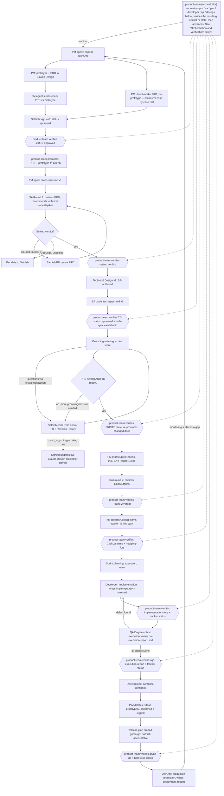

# Shashi Care — Process Walkthrough (Product Manager / System Architect / Project Manager)

Reference document for the full pipeline as it stands after setup. Written to be
read end to end once, then used as a lookup — every stage names the exact file,
folder, and template involved so this doubles as an index.

## The agents

One Cowork-hosted persona — Process Architect — maintains this pipeline. Six
Hermes-hosted personas run everything else: Product Manager, System Architect,
and Project Manager (one shared instance each, moved from Cowork 2026-08-29)
cover Plan/Design; Developer, QA Engineer, and DevOps Engineer (one instance
each per code repo) extend it into Build/Test/Deploy — see Stages 11-14 below
and `_reference/team-structure.md`.

| Agent | Host | Context | Writes to |
|---|---|---|---|
| **Product Manager** | Hermes (shared instance) | `product-engineering/` — PM/SA/PjM's working doc root (see below) | PRDs, Bug Reports, Enhancement Requests, Epics/Stories, test scenarios/cases, roadmap, release plans |
| **System Architect** | Hermes (shared instance) | `product-engineering/` — the working doc root (see below) **plus** local checkouts of all three GitLab repos (Shashi-Care-Core-docs, SAL-docs, SNF-docs) **plus** local checkouts of the application source code under `senior-living/` (see `shashi-care-sa-config.md`'s "Source-code checkouts") | Review-comments files, Technical Designs, technical debt register, compliance register — the working doc root only, **never** commits into the GitLab checkouts or source-code checkouts |
| **Project Manager** | Hermes (shared instance) | `product-engineering/` — the working doc root (see below), plus ClickUp | ClickUp Epics/Stories/Tasks, sprint docs, `mapping-log.md` — `promotion-log.md` is `product-team`'s, see "Document promotion" below |
| **Process Architect** | Cowork | Drive-synced folder | `_agent-instructions/`, `templates/`, `_reference/` — sole author for both Cowork and Hermes; accepts proposals but not edits from either |
| **Developer** | Hermes (per code repo) | Its assigned code repo, plus read access to that slug's tech-spec/spec.md/epics-stories.md | Code, `implementation-note-<slug>.md`; its own tracker item's status only |
| **QA Engineer** | Hermes (per code repo) | Its assigned code repo, plus read access to that slug's test-scenarios/test-cases | `qa-execution-report-<slug>.md`, Bug Reports (via Product Manager's template); its own tracker item's status only |
| **DevOps Engineer** | Hermes (per code repo) | Its assigned code repo, plus the release plan | `deployment-record-<release-slug>.md` in `01_releases/`; executes production promotion |

All seven read from the same underlying content, but not identically: Process
Architect (Cowork) and Developer/QA/DevOps (Hermes) all read `shashi-care-docs`
directly — same content, not a copy, zero drift risk. Product Manager, System
Architect, and Project Manager (Hermes) instead work out of `product-engineering/`
— their actual working doc root, a git repo kept manually synced with
`shashi-care-docs` — a deliberate exception made 2026-08-29 when these three
moved off Cowork, accepted in exchange for a required manual sync step; see
"Hermes copy sync convention" in `shashi-care-process-architect-config.md` for
the drift risk and its mitigation. All product-facing personas read the same
three product folders: `shashi-care-core/`, `SAL/`, `SNF/`.

**Note on the diagram below**: node labels like "PM agent" and "SA agent"
describe responsibilities, not hosting — as of 2026-08-29 these run as
Hermes-hosted Claude Code CLI sessions rather than Cowork chat. That move
changed more than hosting, though: `product-team`, a Hermes orchestrator
profile, now drives this pipeline end to end — invoking each specialist
itself (`pm`, `sa`, `pjm`, and the per-repo `developer`/`qa`/`devops`) and
verifying the resulting artifact or state before advancing, rather than a
specialist finishing its own work being the transition. The document
handoffs and gates below are the same ones this system has always used; the
diagram's `{{verify}}` nodes and the "Orchestration and verification"
section right after it are what changed alongside the Hermes move — see
that section for the full rule.



## Orchestration and verification (applies at every stage transition)

Cross-cutting policy, like the Open Question lifecycle and Document
promotion sections further down — not a new stage, and not specific to
promotion. Applies at every agent-to-agent handoff in Stages 0 through 14,
not just the ones that happen to move a document into GitLab.

**The pattern, every time:**

```text
Specialist (pm / sa / pjm / developer / qa / devops)
  → does its bounded piece of work, produces an artifact or a state change

product-team (orchestrator)
  → observes the resulting artifact/state
  → verifies it actually meets the stage's exit condition
  → advances the workflow to the next stage

Human (Sathish)
  → approval, where a gate requires it — a status field, a go/no-go, a
    disposition — exactly as defined at that gate elsewhere in this document
```

`product-team` is the Hermes orchestrator profile that runs this pipeline
end to end: it invokes each specialist profile itself (`pm`, `sa`, `pjm`,
and the per-repo `developer`/`qa`/`devops`), waits for that specialist's
output, and only then decides whether to advance. Sathish works with
`product-team` for the workflow itself, and drops into a specialist profile
directly only for document-level work — drafting, reviewing, discussing —
that specialist owns.

**What this replaces.** Earlier drafts of this document sometimes read as if
an agent finishing its work *was* the transition — "SA finishes TD →
grooming," "PjM creates ClickUp → next stage," "Developer finishes → QA,"
"QA finishes → development complete." That's not how a handoff actually
completes: an agent reporting work done is not itself the trigger.
`product-team` observing and verifying the resulting artifact or state — the
TD's `status` field, the ClickUp items and `mapping-log.md` entry,
`implementation-note-<slug>.md`, `qa-execution-report-<slug>.md` and the
tracker status — is what actually advances the workflow. This is the same
discipline "Document promotion" below already applies to promotable
documents; this section states that same rule once, for every handoff, not
only the ones that promote to GitLab.

**Examples, non-exhaustive:**
- PM signs off / drafts a document → `product-team` verifies the document's
  own `Status` field before treating it as approved or ready — never infers
  approval from chat discussion or a specialist's own claim.
- SA finishes a Technical Design or tech-spec → `product-team` verifies the
  TD's own `status` field actually reads `approved` (not just that a
  tech-spec file exists) before advancing to grooming or promotion.
- PjM creates ClickUp items → `product-team` verifies the items exist (via
  ClickUp, not just PjM's report) and `mapping-log.md` was updated before
  treating Stage 9 as complete.
- Developer finishes implementation → `product-team` verifies
  `implementation-note-<slug>.md` exists and the tracker item's status
  actually moved before handing off to QA.
- QA finishes execution → `product-team` verifies
  `qa-execution-report-<slug>.md` and the tracker status (all stories
  actually Done, not assumed) before confirming development complete.
- DevOps executes a production promotion → `product-team` verifies
  `deployment-record-<release-slug>.md` was written before considering the
  release stage closed.

**A failed or ambiguous verification is a workflow blocker**, escalated to
Sathish directly — the same rule "Document promotion" below already states
for promotion specifically, generalized here to every stage transition.
`product-team` never advances on a specialist's say-so alone, and never
retries or bypasses a verification failure silently.

This section governs how to read every stage below: where a stage
description says an agent "does X," the actual transition to the next stage
still runs through `product-team`'s verification, even where that isn't
spelled out again in each stage's own text.

---

## Stage 0 — Capture intent

Adapted from Anthropic's AI-Native SDLC playbook (see the alignment note near the
end of this document). Before drafting a full PRD, Enhancement Request, or Bug
Report, PM agent captures the raw idea as `intent.md`
(`templates/intent-template.md`) — problem, proposed outcome, affected
users/systems, constraints, open questions, in the originator's own words.
Common front door to both intake pathways below, not a third pathway. Cheap and
fast on purpose: lets a "worth pursuing?" call happen before committing to fuller
work. Doesn't promote to GitLab; marked `Superseded by PRD` once the fuller
document exists.

## Stage 1 — Origin: prototype and PRD

**New feature** (Design-prototype-first pathway):
- PM (human) designs the prototype in Claude Design, iterates, drafts a PRD there,
  signs off with the Product Manager (human).
- Export the finalized prototype (full HTML/asset export, not just a link — token-
  cost reasons discussed separately) and hand both to the **PM agent**.
- PM agent checks whether a PRD already exists in the export; uses it as the
  starting draft if so, drafts fresh from `templates/prd-template.md` if not.
- **Mandatory cross-check**: PM agent walks the prototype's actual pages against
  the PRD. Checks `// BUSINESS RULE:` and `// PROTOTYPE ONLY:` comments first if
  the team followed `shashi-care-design-standards.md` when building it; falls back
  to inference otherwise. Flags mismatches rather than silently reconciling them.
- Tags each requirement/story with its `prototype_page`. Distinguishes example
  values from actual rules (the "would swapping this value change the behavior"
  test).
- Files the full prototype export at `<slug>/prototype/`, with
  `prototype-meta.md` (`templates/prototype-meta-template.md`) tracking its own
  promotion status independently of the PRD's.

**Skipping the prototype for a feature.** Design-prototype-first is the default
for new features, not a mandatory step for every one of them. Whether a given
feature needs Claude Design first is **Sathish's call, made case by case at
intake** — no fixed rule (no UI-surface test, no size threshold) decides it on
its own. When he decides a feature doesn't need one, it follows the same Direct
intake pathway below as an enhancement or bug: no prototype, no cross-check step,
PRD drafted straight from `templates/prd-template.md` through conversation with
the PM agent.

**Enhancement or bug** (Direct intake pathway):
- No prototype phase. Starts as a conversation with the PM agent.
- Enhancement: `templates/enhancement-intake-questions.md` → drafts using
  `templates/enhancement-request-template.md`.
- Bug: `templates/bug-intake-questions.md` → drafts using
  `templates/bug-report-template.md`.

## Stage 2 — Sathish finalizes with the PM agent

Iterate until `status: approved` on the PRD/ER/BR. This is the promotion trigger.

**Approval carries Open Questions forward, it doesn't resolve them.**
`status: approved` means Sathish accepts the document as ready to promote — not
that every row in its Open Questions section (PRD §11 / ER §6) has been
answered. A question still open at approval is carried forward into whatever
reads this document next (SA Round 1, the Technical Design, `spec.md`, and
eventually `tech-spec-<slug>.md`), not silently resolved or dropped. See "Open
Question lifecycle and the development-readiness gate" below for where this
ultimately has to close out.

## Stage 3 — Promotion to GitLab and the first Spec

- PRD and prototype (each independently) promote to the matching GitLab repo —
  `Shashi-Care-Core-docs`, `SAL-docs`, or `SNF-docs`. The PRD promotes nested by
  category and slug, mirroring the doc root's own shape:
  `prd/{features,enhancements,bugs}/<slug>/prd-<slug>.md`. The prototype stays
  flat, category-and-slug in the folder name:
  `prototypes/<category>-<slug>/` — see
  `_reference/shashi-care-gitlab-binding.md`'s Target structure for both.
- PM agent drafts `spec.md` — a condensed, developer-facing derivative of the
  approved PRD — right away, using `templates/spec-template.md`. This is the
  Spec's **first version**; it exists specifically so it's ready for the
  grooming meeting (Stage 6), not something drafted only after the fact.
- **`spec.md` promotes on its own approval, separate from the PRD's.** Once PM
  agent's `spec.md` reaches its own `Status` field of `Approved` (only
  reachable once the source PRD is at least approved — `templates/spec-template.md`),
  it promotes to `prd/{features,enhancements,bugs}/<slug>/spec.md` — the same
  per-slug folder as the PRD it derives from,
  `_reference/shashi-care-gitlab-binding.md`'s already-defined destination.
  See "Document promotion" below for who does what and the
  verification/escalation rules that apply; the same section covers
  re-promotion whenever the source PRD is later revised.
- **`product-team` performs this promotion mechanically**, once it has
  verified Sathish's approval — see "Document promotion" below. Sathish's
  role is the approval itself, not the Git operations.
- **Grooming doesn't happen yet at this point.** SA reviews the PRD first
  (Stage 4), then a Technical Design and its own developer-facing Tech-Spec get
  a first pass (Stage 5) — only then does the team see it, in Stage 6, with a
  Spec and Tech-Spec pair already in hand.

## Stage 4 — System Architect, Round 1: PRD review

- SA agent reviews the PRD, writes findings to that slug's
  `SA-comments-<slug>.md` (`templates/sa-review-comments-template.md`,
  `03_architecture/{features,enhancements,bugs}/<slug>/`), **PRD Review**
  section.
- Recommends technical epics/stories/spikes *now*, before Epics/Stories formally
  exist — saves a round trip later.
- Verdict: Approved-as-is / Approved-with-changes / Blocked. `review_round`
  tracked in the file's header.
- **3 rounds without a settled verdict → escalate to Sathish directly**, don't keep
  iterating.

## Stage 5 — Technical Design and Tech-Spec (either TD pathway)

- **Before grooming, the Technical Design is normally SA-authored**: Sathish
  works directly with the SA agent, using `templates/technical-design-template.md`
  throughout. This is what makes a first-cut TD — and the Tech-Spec drafted from
  it — possible *before* the dev team has reviewed the requirement in a formal
  setting.
- **Team-submitted** stays available as the other pathway, so the team builds the
  skill — just not usually for this first, pre-grooming TD. It fits two other
  situations: the team revising or replacing the TD themselves once they *do*
  have context (after grooming, after reading the promoted PRD, or after their
  own Notion review); or team-initiated technical work that never went through a
  PRD/grooming cycle in the first place. Submitted via MR into
  `<repo>/architecture-submissions/<category>-<slug>/`, any format.
  - Single permanent branch (`main`) per repo; per-submission branches are
    short-lived. Developers have write access (branches/MRs); Sathish or a team
    lead gates the actual merge.
  - SA agent reads the submission from its **read-only** GitLab checkout Context,
    writes the verdict to the **Technical Design Review** section of the same
    comments file — never edits the submission, never commits into the checkout.
  - SA agent **always asks** whether to convert to the standard template — never
    assumes.
  - Once approved and merged in GitLab, `product-team` promotes it — the same
    mechanical, orchestrator-owned step described in "Document promotion"
    below, run in reverse — into the doc root's (and `product-engineering`'s)
    `03_architecture/{features,enhancements,bugs}/<slug>/TD-<slug>.md`.
    Sathish/the team lead's role is the MR-merge approval, not the copy.
  - The team may also comment on the TD in their own **Notion** copy, ad hoc,
    alongside or instead of commenting directly on the GitLab MR — either is a
    legitimate channel, relayed to SA the same way as any external feedback.
- **Once the TD is approved**, SA agent drafts `tech-spec-<slug>.md` — a
  condensed, developer-facing implementation reference, informally called the
  **Impl Spec** by the team (that's the heading used inside the actual document)
  even though `tech-spec-<slug>.md` stays the canonical filename — using
  `templates/tech-spec-template.md`. References `spec.md`'s Business Rules by ID
  rather than reproducing them, and **must carry forward every unresolved TD open
  question**, especially anything the TD marked High priority. This first
  version doesn't need every question dispositioned yet — full disposition is
  only required at this document's own eventual approval, the
  development-readiness gate described in "Open Question lifecycle and the
  development-readiness gate" below. This is the
  Tech-Spec's **first version**, ready alongside `spec.md` for the grooming
  meeting (Stage 6). **Promotes on its own approval**, separate from the TD's:
  once `tech-spec-<slug>.md`'s own `Status` field reaches `Approved`, it
  promotes to `architecture/{features,enhancements,bugs}/<slug>/tech-spec-<slug>.md`
  — the same per-slug folder as the TD it derives from,
  `_reference/shashi-care-gitlab-binding.md`'s already-defined destination.
  See "Document promotion" below for who does what and the
  verification/escalation rules that apply (`product-team` performs the
  promotion mechanically once approval is verified — Sathish's role stops at
  approval); the same section covers re-promotion whenever the source TD is
  later revised.
- **Revisions after approval**: like the PRD, a TD can be revised after it
  reaches `status: approved` — most often triggered by grooming feedback
  (Stage 6). Log each one in the TD's own **Revision history** section (added to
  `templates/technical-design-template.md`, mirroring the PRD's table: date,
  triggered by, what changed, changed by). `tech-spec-<slug>.md` already knows
  to re-derive itself whenever its source TD picks up a new Revision History
  entry.

## Stage 6 — Grooming meeting and dev-team feedback

By this point: PRD `approved` and SA Round 1-reviewed (Stage 4); Technical Design
`approved` (Stage 5); `spec.md` and `tech-spec-<slug>.md` (Impl Spec) both
drafted at v1. That's deliberate — the team walks into grooming with a PRD that's
already
had a technical pass, plus a Spec/Tech-Spec pair to read alongside it, not a raw,
technically-unreviewed document.

- Manual requirement grooming meeting with the dev team, using the promoted PRD,
  prototype (if one exists), Technical Design, and the Spec/Tech-Spec pair.
- Questions arrive outside any PM/SA working session — chat, email, the grooming
  discussion itself, or **Notion** (the team's preferred way to read and comment
  on a PRD or TD — they own and manage this copy entirely, ad hoc, no fixed
  cadence, no agent involvement). Sathish picks them up, edits the PRD and/or
  Technical Design directly in `product-engineering` (with PM/SA agent help if wanted), and
  **populates that document's own Revision History table** (date, what triggered
  it, what changed, `push_to_prototype` on the PRD's) — this is what survives
  independent of git's commit history, which only says *that* something changed,
  not *why*.
- `spec.md` and `tech-spec-<slug>.md` re-derive per their own standing rule
  (whenever their source document's Revision History gets a new entry) — most
  grooming
  feedback just means re-running that derivation, not a separate manual edit to
  the Spec/Tech-Spec themselves.
- If grooming feedback reopens something SA already signed off on, Sathish
  decides whether that warrants another SA round — governed by the same
  3-round escalation threshold as Stage 4.
- Once settled, `product-team` re-promotes whichever documents changed — the
  same "Document promotion" mechanics below, triggered again by the new
  Revision History entry. Sathish's role stays the content edit and its
  approval, not the GitLab copy.
- **If a Notion export is ever needed**: HTML with "Include comments" enabled —
  Markdown and PDF exports from Notion silently drop comments entirely.

**Keeping the prototype current for demos — a separate, optional track.** Once a
PRD is approved, the PRD is the reference going forward; the prototype's only
ongoing job is demos, done live in Claude Design by Sathish or Product Manager —
never from the archived `product-engineering`/GitLab export —
`product-engineering`'s copy is retained permanently (no scheduled deletion;
see the cheat-sheet), and the GitLab copy stays a static snapshot until its
Stage 13 deletion — regardless of any of this. Most revisions
(`push_to_prototype: No`, the default) have no visual counterpart and need nothing
further. For the ones that do: PM agent generates the update prompt on request
using `templates/claude-design-update-prompt-template.md`, built by quoting the
Revision History row's "What changed" text verbatim — Sathish pastes it into the
live Claude Design session himself.

## Stage 7 — Epics/Stories generation (gated)

**Both** conditions required before PM agent drafts `epics-stories.md`:
1. PRD reached a settled verdict with SA (Stage 4).
2. Technical Design is ready (Stage 5, either pathway).

In practice both conditions are usually already true coming out of Stage 6 —
grooming's whole point is to settle exactly these two things before Epics/Stories
get drafted, removing the old rework risk where SA feedback used to arrive
*after* PM had already drafted Epics/Stories, sometimes invalidating them.

- PM agent drafts using `templates/epics-stories-template.md`, folding in SA's
  Round 1 recommendations directly.
- **SA Round 2**: reviews the actual Epics/Stories, confirms Round 1's
  recommendations were incorporated, reviews PM's functional stories.
- Functional spikes (PM, epic-level) and technical spikes/tasks (SA, epic-level or
  per-story) both live in this same document, visually separated by author.

## Stage 8 — Test scenarios and cases

- PM agent drafts `test-scenarios.md` (`templates/test-scenarios-template.md`) and
  the initial cases directly in `test-cases.xlsx`
  (`templates/test-cases-template.xlsx`), PM-Test-Cases sheet.
- SA agent adds technical scenarios/cases (performance, security, data integrity)
  to the SA-Technical-Test-Cases sheet — kept visually separate.
- QA lead's role is **review and approval only** — `qa_status` field, not
  authorship from scratch.

## Stage 9 — Project Manager: ClickUp creation

- Checks `mapping-log.md` first (idempotency).
- Creates the Epic (List) and Story/Task items — tagged `story` / `bug` / `task` /
  `spike` / `tech_debt` / `test_scenario` as applicable. Statuses: Backlog →
  Development → Review → QA → UAT → Done, plus Blocked.
- Writes `tracker_id` back into `epics-stories.md` next to each item (the one
  narrow, additive exception to never editing another persona's document).
- One `test_scenario`-tagged task per scenario, with `test-cases.xlsx` attached
  directly to it.
- Logs the creation in `mapping-log.md`.
- **`product-engineering`'s `<slug>/prototype/` folder is retained, not
  deleted, at this stage** — Claude Design isn't yet available to the whole
  team, so the archived export stays in place; revisit deleting it once that
  changes. (The GitLab prototype export, promoted separately, still deletes
  at development-complete — see Stage 13.) The live Claude Design project (if
  still used for demos) is untouched either way.

## Stage 10 — Release planning and sprints

- PM agent drafts the Release Plan (`templates/release-plan-template.md`,
  `<Product>-release-plan.xlsx`) — same Draft→Approved flow as a PRD, promoted
  by `product-team` to GitLab's `releases/` folder on approval (see "Document
  promotion" below).
- PjM breaks it into sprints — `templates/sprint-plan-status-template.md`,
  mirrored between the local doc and ClickUp.
- Progress reviewed from **live ClickUp status**, not stale local docs.
- Retrospectives: `templates/sprint-retro-template.md`.
- **First real release-plan drafting for a product is the trigger** to add a
  `Release-blocking`-equivalent field to that product's compliance/technical-debt
  documents, if they don't already carry one (Sathish's decision, 2026-08-29) —
  not before, and not automatically. For SNF specifically, this means
  `_as-built/technical-debt.md` and `hipaa-compliance-register.md` keep using
  DevOps's fallback Severity/Priority proxy (see `skill-devops-discipline.md`)
  until the first real SNF release plan is drafted here, at which point Sathish
  reconciles the field into those two documents as part of that cycle.

## Stage 11 — Development execution

- **Precondition**: `tech-spec-<slug>.md` reached `status: approved` (Stage 5)
  with every significant Open Question carried into it explicitly
  dispositioned — see "Open Question lifecycle and the development-readiness
  gate" below. Development doesn't start against a tech-spec that hasn't
  cleared that gate.
- Developer instance (hosted in Hermes, one per code repo) implements against the
  tech-spec, `spec.md` Business Rules by ID, `epics-stories.md` acceptance
  criteria, and its assigned tracker task.
- Moves its own assigned tracker item's status (Development → Review) — the one
  narrow status-only exception to Project Manager's tracker-write exclusivity;
  see `skill-pjm-discipline.md`'s "Tracker-write exception" section.
- Writes `implementation-note-<slug>.md` in
  `07_build/{features,enhancements,bugs}/<slug>/` as the handoff artifact to QA.
- A behavior, data-model, or API-surface deviation from the tech-spec routes back
  to System Architect; a scope change routes back to Product Manager as a new
  `intent.md` — see `skill-developer-discipline.md`'s "Deviation/return path".

## Stage 12 — QA execution

- QA Engineer instance (hosted in Hermes, one per code repo) executes the
  Product-Manager-authored test scenarios/cases against the implementation.
- Moves its own assigned tracker item's status (Review → QA → UAT/Done, or
  Blocked) — same narrow exception as Development execution above.
- Writes `qa-execution-report-<slug>.md` in the same `07_build/` slug folder,
  recording pass/fail per case and any defects filed.
- Defects are filed as Bug Reports using Product Manager's existing template —
  never a home-grown format.
- QA cannot waive a failing test or decide a defect is non-blocking on its own —
  it records a recommendation only; release go/no-go for gaps found here belongs
  to Sathish per `_reference/team-structure.md`'s RACI. A PHI or compliance
  defect escalates immediately regardless of severity label.

## Stage 13 — Development complete confirmation

- PjM confirms via ClickUp status (all stories under the epic reaching Done, not
  assumed from elapsed time).
- **Deletes the GitLab `prototypes/<category>-<slug>/` folder** — confirmed by
  PjM first; `product-team` verifies the deletion and logs it in
  `promotion-log.md`, the same way it logs every other promotion-log entry
  (see "Document promotion" below). Again, the archived export only — the
  live Claude Design project, if Sathish or Product Manager still use it for
  demos, keeps existing independent of this.

## Stage 14 — Release and deploy

- PM drafts the release plan (Stage 10); PjM/SA/Development/QA/DevOps are
  Consulted, Sathish is Accountable for release go/no-go — see
  `_reference/team-structure.md`'s RACI row 13.
- DevOps Engineer instance (hosted in Hermes, one per code repo) executes the
  production promotion once go/no-go clears.
- **Hard-stop check before promotion**: DevOps checks whatever technical-debt
  and compliance source is actually live for that product today — not every
  product has the generic, `Release-blocking`-column-carrying register yet
  (found 2026-08-29: SNF's real sources are `_as-built/technical-debt.md` and
  `hipaa-compliance-register.md`, each with its own schema; SAL and
  shashi-care-core have no populated source at all yet). A missing register
  escalates rather than reading as "no blockers"; an open Critical/blocking
  item under whichever schema applies is a hard stop without Sathish's
  explicit override — see `skill-devops-discipline.md` and
  `shashi-care-devops-config.md` for the current per-product detail.
- Writes `deployment-record-<release-slug>.md` in `01_releases/` (not
  `07_build/` — a deployment can span multiple slugs) via
  `templates/deployment-record-template.md`.
- A PHI-affecting rollback requires Sathish's approval before executing.
- Post-deploy monitoring findings that surface a scope, behavior, or design gap
  route back to Product Manager (new `intent.md`) or System Architect — the same
  return-path shape used at every other stage, not yet fully autonomous, but no
  longer the dead end the original design left it as.

## On-demand: Finalize a document (PRD / ER / TD)

On request, at any point in a PRD/ER/TD's lifecycle — not gated to a specific stage
or to `status: approved` — cleans up the review-round narration a document
accumulates from PM↔SA (and Sathish) back-and-forth into a first-time-reader-ready
version, in place. Product Manager finalizes PRDs and Enhancement Requests; System
Architect finalizes Technical Designs — each only its own document type, same
authorship boundary as the rest of this system. Open Questions, explicit deferrals,
front-matter, and the companion review-comments/changeset files are never touched.
(See "Open Question lifecycle and the development-readiness gate" below for how
those ultimately get dispositioned — Finalize itself never dispositions them.) A
resolution that reads as expanding scope beyond what the document itself recorded —
even for the same feature — is never folded in or dropped silently; it's escalated to
Sathish, who decides whether it becomes a new Enhancement Request (drafted by Product
Manager, never by System Architect) or an explicit, logged scope expansion of the
same document. See `skill-finalize-document-discipline.md` /
`shashi-care-finalize-config.md`.

## Open Question lifecycle and the development-readiness gate

Cross-cutting policy, not a new stage — applies across Stages 2 through 11
wherever a PRD/ER/BR, Technical Design, or tech-spec/spec carries an Open
Questions section. Written explicitly because a document reaching
`status: approved` is not the same event as its Open Questions being resolved,
and the pipeline needs one place both Sathish and an orchestrator can check to
know whether that's actually true for a given question.

**Explicit, so nothing here reads as implied:**
- A document reaching `status: approved` does not resolve its Open Questions.
- Open Questions may legitimately be carried forward after document approval —
  that's the normal case, not a process failure.
- Specialists may investigate a question and propose an answer or a
  disposition, within their own area of expertise.
- Investigation and evidence are not themselves an authoritative decision —
  they inform one.
- A proposed disposition is not authoritative until Sathish has approved it.
- A **Deferred** disposition does not make the underlying item disappear —
  it durably tracks it elsewhere (Technical Debt, Enhancement, or the
  Deferred Open Questions register), the same way Enhancement and Technical
  Debt already do. A Deferred Open Question row being marked `Dispositioned`
  closes the *question*, not the *work* — see "Tracking the result, not just
  closing the row" below.
- At the Impl-Spec / Tech-Spec development-readiness gate, every significant
  Open Question carried into the tech-spec must have an explicit disposition.
- An undispositioned significant Open Question at that gate blocks
  development and must be escalated to Sathish.

**Three separate things, kept separate:**
1. **The question being answered** — a technical or factual investigation (SA
   traces a data model, PM validates with users, a spike produces evidence).
2. **The product/engineering decision about what to do with the answer** — a
   proposed disposition, not yet authoritative on its own.
3. **Human approval where required** — Sathish accepting that decision,
   explicitly, the same way he accepts everything else in this system.

Conflating these is the failure mode this section exists to prevent: a
specialist's investigation is not itself a disposition, and a proposed
disposition isn't authoritative until Sathish has actually approved it.

**Three dimensions, tracked separately (existing document fields, not new
front-matter):**
- **Document status** (unchanged): Draft → Ready for review → Approved — the
  PRD/ER/BR, TD, and tech-spec/spec's own `Status` field, exactly as today.
- **Open Question status**: Open → Under investigation → Resolved /
  Dispositioned — tracked via the existing "current position" column already in
  the PRD §11 / ER §6 / TD §11 Open Questions table; no new column required to
  start using this.
- **Open Question disposition** — once a question reaches
  Resolved/Dispositioned, record which of: **Resolved in current scope**
  (answered, no further tracked item needed) / **Accepted as-is** (the current
  behavior stands, explicitly) / **Enhancement** (tracked as a new Enhancement
  Request) / **Technical Debt** (logged to
  `03_architecture/technical-debt-register.md`) / **Deferred** (postponed by a
  conscious decision, not resolved — always requires its own durable tracking
  reference, exactly like Enhancement or Technical Debt; see "Tracking the
  result, not just closing the row" below for which one), or another
  disposition Sathish has explicitly approved.

**What makes an Open Question significant.** Judgment, not a Priority lookup —
the existing Priority field (Blocker/High/Medium/Low) stays useful for
sequencing and triage, but it isn't what decides significance here. A question
is significant when its unresolved state can affect product behavior, scope,
acceptance, architecture, implementation, testing, security/compliance, or
operational behavior, or development effort. When it's genuinely unclear
whether a question meets that bar, treat it as significant and escalate
rather than assume it's minor enough to drop.

**The carry-forward rule.** A significant Open Question survives its containing
document's approval. It moves forward into whatever reads that document next —
PRD/ER → SA Round 1 comments and the Technical Design → `spec.md` → TD →
`tech-spec-<slug>.md` — the same way `templates/spec-template.md` and
`templates/tech-spec-template.md` already require ("carry forward any open
question ... still unresolved"). This section generalizes that existing rule
into: carried forward *until dispositioned*, not until someone decides it's
inconvenient to keep listing.

**Specialist behavior.** PM agent and SA agent, at any stage where the process
already gives them a place to write findings (SA Round 1/2, the TD, `spec.md`/
`tech-spec-<slug>.md`):
- identify which of a document's Open Questions are actually significant, not
  just restate the source list;
- preserve a question exactly when it's being intentionally carried forward —
  never silently drop it because the containing document got approved, and
  never invent a resolution it didn't actually reach;
- investigate a question within their own area of expertise where the process
  already permits it (SA on technical questions during Round 1/2 and TD
  authoring, PM on product/user questions during PRD/ER work);
- keep evidence/recommendation visibly separate from an authoritative decision
  — a proposed disposition is written as a proposal, not stated as settled;
- propose a disposition once they have enough information, using the
  categories above — when proposing **Deferred** specifically, also propose
  which of its tracking routes applies (see "Tracking the result, not just
  closing the row" below), not just the label;
- escalate — to the other specialist if the question is outside their own
  expertise, to Sathish if neither specialist can legitimately resolve or
  disposition it — rather than guessing or leaving it silently unresolved.

Specialist-to-specialist autonomous resolution (SA resolving a PM-owned
question, or vice versa, without a human in the loop) is explicitly **not**
introduced here — a future capability, not this one. For now every disposition
still needs Sathish's approval before it's authoritative, same as any other
document decision in this system.

**Tracking the result, not just closing the row.** Where the disposition is
Enhancement, Technical Debt, or Deferred, the Open Question row must
reference the actual resulting item, not just say "closed":
- **Enhancement** → Product Manager drafts a new Enhancement Request
  (`templates/enhancement-request-template.md`); the Open Question row is
  updated to point at its slug.
- **Technical Debt** → logged as its own entry in
  `03_architecture/technical-debt-register.md`
  (`templates/technical-debt-register-template.md`); the Open Question row
  references that entry.
- **Deferred** → never its own dead end. A Deferred disposition still routes
  to whichever of the following actually fits the item, and the choice itself
  needs Sathish's approval alongside the disposition:
  - **Default: Technical Debt.** When the deferred item is known
    technical/product work being consciously postponed — the common case —
    it's logged exactly like a Technical Debt disposition: its own entry in
    `03_architecture/technical-debt-register.md`
    (`templates/technical-debt-register-template.md`), referenced from the
    Open Question row.
  - **Enhancement**, when the deferred item is actually a product capability
    meant for later delivery rather than debt to carry — Product Manager
    drafts a new Enhancement Request the same way, referenced from the Open
    Question row.
  - **Deferred Open Questions register — fallback only.** For an item that's
    genuinely neither technical debt nor a future capability: a decision or a
    piece of evidence that's temporarily unavailable and needs revisiting
    later, not tracked work in its own right. Logged as its own entry in
    `<folder>/deferred-open-questions-register.md` (one running file per
    product folder, same pattern as the technical-debt register — see
    "Ongoing, not tied to one feature's lifecycle" below) recording the
    question, why it's deferred, what would trigger revisiting it, and who
    owns the eventual re-check. The Open Question row references that entry.
    Use this only when Technical Debt and Enhancement genuinely don't fit —
    it is not a default third option.

**Dispositioned is not the same as resolved-in-fact.** Marking an Open
Question row `Dispositioned` — for Enhancement, Technical Debt, or Deferred
alike — closes the *question*: Sathish has decided and approved what happens
to it. It does not close the *work*. The resulting Enhancement Request,
Technical Debt entry, or Deferred Open Questions register entry stays
outstanding, tracked and visible, until it's actually addressed; only the
Open Question row itself is done, and doesn't need revisiting again on its
own once its reference is recorded. This is what keeps a Deferred item from
silently vanishing the moment its OQ row closes.

**The development-readiness gate.** `tech-spec-<slug>.md` — the Impl-Spec — is
the latest point in this pipeline at which every significant Open Question
carried into it must already have an explicit disposition. Its own `Status`
field reaching `Approved` (Stage 5) is where this is actually enforced:
`templates/tech-spec-template.md`'s existing "None — see TD" convention already
covers the fully-resolved case; this generalizes it — every question still on
the list at that point needs one of the named dispositions above, not a blank
"current position" and not an implied one.

An Open Question with no disposition at tech-spec approval time is a
development-readiness blocker — same severity as SA's existing 3-round
escalation threshold — and gets escalated to Sathish rather than either
blocking indefinitely or being waved through.

`Document Approved` (a PRD/ER/TD's own `status: approved`) **is not**
`All Open Questions Resolved`. But `Impl-Spec Approved for development`
**is** `All Significant Open Questions Dispositioned` — the one point in the
pipeline where those two collapse into the same requirement.

**For an orchestrator (e.g. `product-team`) reading this document:**
- A slug's currently-outstanding Open Questions are whatever's still Open or
  Under investigation across its PRD/ER, TD, and tech-spec/spec.
- A question is allowed to be carried forward past any document's approval
  *except* the tech-spec's own.
- A question requires human input whenever no specialist can legitimately
  resolve or disposition it within their own expertise, or whenever a proposed
  disposition hasn't yet been approved by Sathish.
- A downstream stage may proceed past a document's approval with open,
  undispositioned questions still on it — Epics/Stories drafting, grooming, and
  sprint planning are all unaffected by an outstanding Open Question, per the
  approval note in Stage 2.
- The Impl-Spec approval gate specifically is satisfied only when every
  significant Open Question carried into `tech-spec-<slug>.md` shows an
  explicit disposition — otherwise the gate isn't satisfied, regardless of what
  the document's own `Status` field says.
- A **Deferred** disposition satisfies that gate only once its required
  tracking reference (a Technical Debt entry, an Enhancement Request, or a
  Deferred Open Questions register entry) is actually recorded in the Open
  Question row — a bare "Deferred" label with no reference is incomplete, the
  same as an Enhancement or Technical Debt disposition with no reference
  would be.

## Document promotion: PRD, spec.md, Technical Design, tech-spec-<slug>.md, Release Plan

Cross-cutting policy, not a new stage — applies at Stage 3 (PRD, prototype,
`spec.md`), Stage 5 (Technical Design, `tech-spec-<slug>.md`), Stage 6
(re-promotion after grooming edits), and Stage 10 (Release Plan) — every
point in the pipeline where a document reaches its own approval and needs to
move from its working location in the doc root into the destination
`_reference/shashi-care-gitlab-binding.md` already defines for it. Written
explicitly because "the specialist says it's done," "the document is
approved," and "the artifact has actually been promoted to its authoritative
location" are three different events, not one — the same discipline the Open
Question lifecycle section above applies to disposition, and the same
discipline "Orchestration and verification" above applies to every other
stage transition. This section is that general rule applied specifically to
promotion, the one family of stage transitions with an actual mechanical Git
operation attached to it.

**The steps, kept separate:**

```text
Specialist
  → creates/updates the document

Human
  → approves the document

Orchestrator
  → promotes the approved artifact to its authoritative product-doc location

Orchestrator
  → verifies the promotion

Workflow
  → proceeds to the next stage
```

- **Specialist** — PM agent authors and revises the PRD, `spec.md` (Stage 3),
  and the Release Plan (Stage 10); SA agent authors and revises the Technical
  Design and `tech-spec-<slug>.md` (Stage 5); the prototype export itself is
  produced during Stage 1 (PM agent, from the Claude-Design export Sathish
  hands off). Authorship stops there in every case: drafting or revising a
  document, or producing an export, is specialist work; promoting it into
  GitLab is not — same authorship boundary this document uses everywhere
  else, including the Agents table's "never commits into the GitLab
  checkouts" for System Architect.
- **Human** — Sathish, the same approval authority as every other document in
  this system. Every promotable document carries its own approval field —
  `status`/`Status` on the PRD, Technical Design, Release Plan, `spec.md`, and
  `tech-spec-<slug>.md`; `prototype-meta.md`'s own `repo_status` for the
  prototype — and only Sathish setting that field to `approved`/`Approved` (or
  the prototype's equivalent) constitutes approval. A specialist reporting a
  document finished, or Sathish discussing it approvingly in conversation, is
  not the same as the field itself reading approved — this boundary doesn't
  move for any of these documents.
- **Orchestrator** — `product-team`, the Hermes profile that drives this
  pipeline (see "Orchestration and verification" above). A document is never
  promoted merely because a specialist reports it complete, and never
  promoted by Sathish running the Git operations by hand — `product-team` is
  the sole mechanical actor for every promotion in this system, whether the
  document is moving into GitLab or (for a team-submitted Technical Design)
  back into the doc root. Once, and only once, the document's own approval
  field reads approved, `product-team` promotes it to the destination
  `_reference/shashi-care-gitlab-binding.md`'s target structure already
  assigns:
  - PRD → `prd/{features,enhancements,bugs}/<slug>/prd-<slug>.md`
  - `spec.md` → `prd/{features,enhancements,bugs}/<slug>/spec.md` — same
    per-slug folder as its PRD
  - Technical Design → `architecture/{features,enhancements,bugs}/<slug>/TD-<slug>.md`
  - `tech-spec-<slug>.md` → `architecture/{features,enhancements,bugs}/<slug>/tech-spec-<slug>.md`
    — same per-slug folder as its TD
  - Release Plan → `releases/<release-slug>.xlsx`
  - Prototype (full export) → `prototypes/<category>-<slug>/`

  in the matching GitLab repo (`Shashi-Care-Core-docs` / `SAL-docs` /
  `SNF-docs`) — never a new or invented location.
- **Workflow** — proceeds on the pipeline's existing gates exactly as already
  defined, not on promotion itself. Stage 7's Epics/Stories gate (PRD settled
  + TD ready) and Stage 11's development-readiness gate (`tech-spec-<slug>.md`
  at `Status: Approved` with every significant Open Question dispositioned)
  already key off each document's own approval status — not whether its
  GitLab copy has landed yet. Promotion completing is not itself a new gate on
  top of those.

**Promotion rules:**

1. A document is never promoted on a specialist's say-so alone — reporting a
   document drafted, revised, or "ready" is not a trigger. Only the document's
   own `Status` field reading `Approved` triggers promotion.
2. Before promoting, the orchestrator verifies that `Status` field directly —
   never infers approval from stage completion, chat discussion, or a
   specialist's own claim.
3. The destination is whichever path `_reference/shashi-care-gitlab-binding.md`'s
   target structure already assigns to that document type (see the bulleted
   list above) — never a new or ad hoc destination invented for this.
4. Promotion preserves the approved document's content and its existing
   front-matter conventions (`product`, `status`, `repo_status`,
   `last_promoted_revision`, per this document's own "Key conventions
   cheat-sheet" below) exactly as approved — no re-authoring during the copy.
5. After promoting, the orchestrator independently verifies the artifact
   actually landed at that destination — matching source content, correct
   filename and path — before treating promotion as complete. Verification is
   not optional, and is not satisfied merely by the promotion step having run
   without error.
6. A failed or ambiguous promotion (destination unreachable, content mismatch,
   unclear which revision was promoted) is a workflow blocker, escalated to
   Sathish directly — never silently retried, bypassed, or left unresolved.
7. Specialists remain responsible only for authoring and revising their own
   document type — PM agent for the PRD, `spec.md`, and Release Plan; SA agent
   for the Technical Design and `tech-spec-<slug>.md`. Promotion is a
   lifecycle/orchestration operation performed by `product-team` after
   approval, not specialist work, and never blurs into it — and never
   Sathish's own Git operations either, per the ownership boundary in the
   Agents table above.

**Re-promotion.** Exactly as `_reference/shashi-care-gitlab-binding.md`
already states: the PRD, Technical Design, and Release Plan re-promote on any
edit after their own approval; `spec.md` and `tech-spec-<slug>.md` also
re-derive first (from the PRD or TD they came from) whenever their source
document is revised, then re-promote — the same sequence above, run again in
full each time, not skipped because a prior version was already promoted
once. Stage 6's grooming-triggered re-promotion is this same rule, not a
separate mechanism.

## Ongoing, not tied to one feature's lifecycle

- **Technical debt**: surfaced during any SA review, logged to
  `03_architecture/technical-debt-register.md`
  (`templates/technical-debt-register-template.md`) rather than left as a comment
  on one feature's review.
- **Deferred Open Questions**: the fallback tracker for a Deferred Open
  Question disposition that's genuinely neither Technical Debt nor an
  Enhancement (see "Open Question lifecycle and the development-readiness
  gate" above) — logged to `<folder>/deferred-open-questions-register.md`,
  one running file per product folder, same pattern as the technical-debt
  register. Most Deferred items still route to Technical Debt or Enhancement;
  this register exists only for the remainder.
- **Compliance**: `03_architecture/compliance/hipaa-compliance-register.md` —
  converted from the team's Excel worklog (2026-08-28), 39 entries, full
  narrative fidelity per entry. Only Sathish edits this document.
- **Roadmap**: `00_roadmap/product-roadmap.xlsx`, theme-based Now/Next/Later,
  tabs for Shashi-Care-Core / SAL / SNF, kept updated in place by PM.
- **Architecture, API contracts, partner agreements**: `03_architecture/_as-built/`,
  `integrations/pcc/{api-contracts,agreements}/` — all genuinely platform-level,
  temporarily filed under `SNF/` pending real Core separation. SA checks
  `agreements/` before designing against any PCC endpoint — technically reachable
  isn't the same as contractually approved.

---

## Key conventions cheat-sheet

- **Slugs**: unique within their own product folder only, not globally.
- **`category`**: `feature` / `enhancement` / `bug` — lives in the *path* on
  both sides now: the doc root's (`02_prd/{features,enhancements,bugs}/`,
  `03_architecture/{features,enhancements,bugs}/`) and, matching it, GitLab's
  own `prd/{features,enhancements,bugs}/` and
  `architecture/{features,enhancements,bugs}/` — see
  `_reference/shashi-care-gitlab-binding.md`'s Target structure. GitLab's
  `releases/` and `prototypes/` stay flat, category-in-folder-name, as
  before.
- **`-docs` suffix**: GitLab repo names only (`SAL-docs`, not `SAL`) — avoids
  collision with the existing code repo of the same name. Nowhere else.
- **Front-matter**: `product`, `status`, `repo_status`, `last_promoted_revision` on
  every promotable document. `review_round` on the SA comments file.
- **Escalation**: 3 PRD/Epics-Stories review rounds without a settled verdict →
  Sathish decides directly.
- **Open Question disposition**: `status: approved` on a PRD/ER/TD carries
  forward whatever Open Questions are still open — it doesn't resolve them.
  The one point that does require closure is `tech-spec-<slug>.md`'s own
  approval: every significant Open Question carried into it needs an explicit
  disposition (Resolved in current scope / Accepted as-is / Enhancement /
  Technical Debt / Deferred / another Sathish-approved disposition), tracked
  back to the resulting item where one is required — an Enhancement Request,
  a technical-debt-register entry, or, for Deferred specifically, whichever of
  those two or the Deferred Open Questions register actually fits (Deferred
  defaults to Technical Debt; Enhancement or the Deferred Open Questions
  register apply only when that's genuinely the better fit — see "Open
  Question lifecycle" above). A Deferred disposition still requires its own
  tracking reference, the same as Enhancement or Technical Debt — never a
  dead end. An undispositioned question, or a Deferred one with no recorded
  reference, is a development-readiness blocker, escalated to Sathish. See
  "Open Question lifecycle and the development-readiness gate."
- **Deletion**: never automatic, and not symmetric between the two copies.
  `product-engineering`'s prototype/ is retained permanently for now (Claude
  Design isn't yet available to the whole team — revisit once it is); only
  the GitLab prototype export deletes, at development-complete time, PjM
  confirming first and always logging a one-line note in `promotion-log.md`.
  Both are the *archived export*
  only — the live Claude Design project (used for demos, kept current via
  `templates/claude-design-update-prompt-template.md`) is separate and
  unaffected either way.
- **Tracker-write exception**: Project Manager holds exclusive, unconditional
  ownership of tracker item creation, deletion, tagging, re-parenting, and the
  mapping log. Developer and QA Engineer (Hermes) each have one narrow,
  additive exception: moving their own assigned tracker item's *status* only.
  See `skill-pjm-discipline.md`'s "Tracker-write exception" section.
- **Build/Test/Deploy location**: `implementation-note-<slug>.md` and
  `qa-execution-report-<slug>.md` live in
  `07_build/{features,enhancements,bugs}/<slug>/`;
  `deployment-record-<release-slug>.md` lives in `01_releases/` instead, since a
  deployment can span multiple slugs.
- **As-built precedence**: `_as-built/` in `product-engineering` is a
  documentation snapshot of the codebase, not the codebase itself. Where it diverges from what the code
  repo actually shows — as Developer/QA/DevOps instances now observe directly at
  Stages 11-14 — the live repo wins; `_as-built/` is stale until someone updates
  it, not an independent source of truth.
- **Promotion**: PRD, Technical Design, and Release Plan promote on `approved`
  and stay permanently, each into its own per-slug folder
  (`prd/{features,enhancements,bugs}/<slug>/`,
  `architecture/{features,enhancements,bugs}/<slug>/`) or, for the Release
  Plan, `releases/`. `spec.md` and `tech-spec-<slug>.md` each promote on their
  own `Status: Approved` (separate from their source PRD/TD's approval) into
  that same per-slug folder alongside the PRD or TD they derive from, and also
  stay permanently once promoted. `product-team` performs every one of these
  promotions mechanically, once Sathish's approval is verified — see
  "Document promotion" above for the Specialist/Human/Orchestrator split and
  verification rules. Prototype promotes on its own schedule (flat,
  `prototypes/<category>-<slug>/`) and is deleted later — the one promoted
  artifact that isn't permanent.
- **Notion**: team-owned, ad hoc, both PRD and TD — no agent touches it. Sathish
  reads their comments and edits the PRD/TD accordingly (Stage 6); the
  resulting re-promotion into GitLab is `product-team`'s mechanical job, same
  as every other promotion — see "Document promotion" above. If an export is
  ever needed: **HTML with "Include comments" enabled** — Markdown and PDF
  exports from Notion silently drop comments.

## AI-Native SDLC alignment (Anthropic's playbook)
Checked against Anthropic's "AI-Native SDLC playbook"
(claude.com/blog/the-ai-native-sdlc-playbook) — a six-stage
Plan/Design/Build/Test/Deploy/Maintain loop with version-controlled artifacts
(`intent.md` → `spec.md` → `plan.md` → tests/evals → PR review/deploy gates →
autonomous monitoring that writes a fresh `intent.md`).

- **Adopted**: `intent.md` (Stage 0 above) — adapted, not copied verbatim.
- **Deliberately not adopted**: the playbook's `spec.md` merges requirements and
  design into one artifact. We keep PRD and Technical Design separate — that
  split is what the two-pass SA review, the escalation threshold, and the PM/SA
  authorship boundary all depend on.
- **The boundary, settled explicitly (updated 2026-08-29)**: this system
  originally covered only Plan and Design — everything through Epics/Stories
  reaching `ready` and the ClickUp handoff, with Build/Test/Deploy/Maintain left
  entirely to the dev team. That boundary has since moved: three new personas —
  Developer, QA Engineer, DevOps Engineer, all hosted in Hermes rather than
  Cowork — now extend this system into Build (Stage 11), Test execution
  (Stage 12), and Deploy (Stage 14), one instance per code repo. Maintain
  (production monitoring feeding a fresh `intent.md`) is partially covered —
  DevOps's monitoring return-path — but not fully autonomous yet. A code repo's
  own `CLAUDE.md` and Claude Code skills (including any code-side HIPAA check)
  remain the dev team's own tooling, not authored here.
- **A real return path now exists where none did before.** A Developer/QA/DevOps
  instance that surfaces a scope, behavior, or design gap writes back to Product
  Manager or System Architect per its own discipline file's "Deviation/return
  path" section, rather than relying solely on the informal dev-team feedback
  channel (chat, email, Notion) this note originally described.
- **Adopted, differently**: the playbook's "skills as institutional knowledge"
  concept — but only for genuinely cross-cutting policy, never for
  persona-defining behavior. See the HIPAA compliance skill below for why the
  distinction matters.

## Cross-cutting policy: the HIPAA compliance Skill
Unlike everything else in this system, this is an actual installable Cowork
**Skill** (`hipaa-compliance-check-skill.zip` → `SKILL.md`), not text pasted into
a project's Instructions field. The distinction matters mechanically, not just
semantically:

- **Instructions are project-scoped** — what governs Product Manager only
  applies in the Product Manager project. This is exactly right for
  persona-defining rules (the whole reason PM and SA's authorship boundary works
  is that neither's rules leak into the other's project).
- **Skills are account-scoped and auto-invoke by relevance** — installed once,
  they can fire in *any* session, including both PM's and SA's, wherever the
  content looks relevant. That's the wrong property for persona rules (risk of
  PM's rules firing inside an SA session or vice versa) but the *right* property
  for a policy that should apply identically regardless of which persona is
  doing the drafting — a HIPAA check on a PRD should look the same as a HIPAA
  check on a Technical Design, because it's the same policy, not persona logic.

Install via Customize → Skills → "+" → Create skill → upload the zip, at the
account level so it's available across all four projects. Advisory only — it
surfaces gaps and logs them to the compliance register, it doesn't approve
anything; sign-off stays with System Architect and Sathish as always.

## Open worklog items (carried forward)
1. Sprint-boundary status snapshots — not yet designed.
2. **Technical-debt/compliance initial logging pass — SAL and shashi-care-core**
   (added 2026-08-29). Neither product has any `03_architecture/` content yet,
   so DevOps's production-promotion hard-stop check (Stage 14) will escalate on
   every attempt for either product until this is done. Sathish confirmed
   2026-08-29: System Architect completes an initial
   `technical-debt-register.md` and `compliance-register.md` pass (generic
   template shape, including the `Release-blocking` column) for each product
   before its first real deployment. Not yet scheduled or started as of this
   note.
3. **Release-blocking field for SNF's real documents** (added 2026-08-29).
   `_as-built/technical-debt.md` and `hipaa-compliance-register.md` predate the
   generic `Release-blocking` column and use their own schemas. Sathish decided
   2026-08-29: add the field only when SNF's first real release-plan drafting
   with PjM begins (Stage 10) — not pre-emptively. Until then, DevOps continues
   using the Severity/Priority fallback proxy documented in
   `skill-devops-discipline.md`.
4. ~~Architecture-side folder structure~~ — resolved 2026-08-29: `03_architecture`
   now splits by category and slug the same way `02_prd` does, with slug-suffixed
   filenames too, same rationale as `02_prd`'s `prd-<slug>.md`
   (`03_architecture/{features,enhancements,bugs}/<slug>/{TD-<slug>.md,
   tech-spec-<slug>.md, SA-comments-<slug>.md}`), replacing the old flat
   `technical-designs/` + `review-comments/` pair with category-prefixed
   filenames. Existing documents move via a one-time migration script Sathish
   runs by hand against the actual Drive folder — not yet run as of this note.

## File index

| File | Purpose |
|---|---|
| `skill-pm-discipline.md` / `shashi-care-pm-config.md` | Product Manager agent instructions |
| `skill-sa-discipline.md` / `shashi-care-sa-config.md` | System Architect agent instructions |
| `skill-pjm-discipline.md` / `shashi-care-pjm-config.md` | Project Manager agent instructions |
| `skill-finalize-document-discipline.md` / `shashi-care-finalize-config.md` | Shared Finalize procedure Product Manager and System Architect each reference for their own document types |
| `shashi-care-doc-tree.md` | Full canonical (Google Drive / `product-engineering`) + GitLab folder structure |
| `shashi-care-clickup-binding.md` | ClickUp hierarchy, tags, statuses |
| `shashi-care-gitlab-binding.md` | GitLab promotion rules, repos, access model |
| `shashi-care-design-standards.md` | Prototype-authoring standards for the team |
| `_reference/team-structure.md` | Real, filled roster + RACI for all 7 personas across both hosting systems |
| `skill-developer-discipline.md` / `shashi-care-developer-config.md` | Developer agent instructions (Hermes, one instance per code repo) |
| `skill-qa-discipline.md` / `shashi-care-qa-config.md` | QA Engineer agent instructions (Hermes, one instance per code repo) |
| `skill-devops-discipline.md` / `shashi-care-devops-config.md` | DevOps Engineer agent instructions (Hermes, one instance per code repo) |
| `templates/*.md`, `templates/*.xlsx` | All document templates referenced above, including `implementation-note-template.md`, `qa-execution-report-template.md`, `deployment-record-template.md` |
| `cowork-instructions-ProcessArchitect.md` | Paste-ready, pre-concatenated Instructions for the one remaining Cowork project |
| `cowork-instructions-{PM,SA,PjM}.md` | Frozen as of 2026-08-29 when these three moved to Hermes — dormant-fallback artifacts only, not part of the active rebuild convention; would need a manual rebuild + re-paste before that fallback could be reactivated |
| `hipaa-compliance-check-skill.zip` | Installable Cowork Skill (account-level, not Instructions) — cross-cutting HIPAA checks across all sessions |
