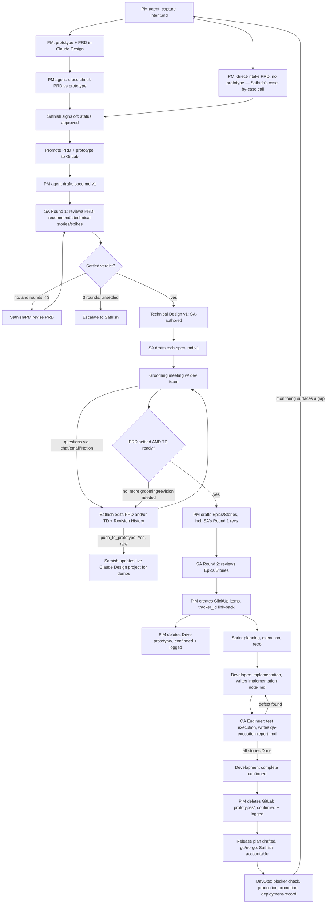

# Shashi Care — Process Walkthrough (Product Manager / System Architect / Project Manager)

Reference document for the full pipeline as it stands after setup. Written to be
read end to end once, then used as a lookup — every stage names the exact file,
folder, and template involved so this doubles as an index.

## The agents

Four Cowork-hosted personas run the Plan/Design portion of this pipeline; three
Hermes-hosted personas (one instance each per code repo) extend it into
Build/Test/Deploy — see Stages 11-14 below and `_reference/team-structure.md`.

| Agent | Host | Context | Writes to |
|---|---|---|---|
| **Product Manager** | Cowork | Drive-synced `shashi-care-docs/` only | PRDs, Bug Reports, Enhancement Requests, Epics/Stories, test scenarios/cases, roadmap, release plans |
| **System Architect** | Cowork | Drive-synced folder **plus** local checkouts of all three GitLab repos (Shashi-Care-Core-docs, SAL-docs, SNF-docs) | Review-comments files, Technical Designs, technical debt register, compliance register — Drive only, **never** commits into the GitLab checkouts |
| **Project Manager** | Cowork | Drive-synced folder, plus ClickUp | ClickUp Epics/Stories/Tasks, sprint docs, the two sync logs (mapping-log.md, promotion-log.md) |
| **Process Architect** | Cowork | Drive-synced folder | `_agent-instructions/`, `templates/`, `_reference/` — sole author for both Cowork and Hermes; accepts proposals but not edits from either |
| **Developer** | Hermes (per code repo) | Its assigned code repo, plus read access to that slug's tech-spec/spec.md/epics-stories.md | Code, `implementation-note-<slug>.md`; its own tracker item's status only |
| **QA Engineer** | Hermes (per code repo) | Its assigned code repo, plus read access to that slug's test-scenarios/test-cases | `qa-execution-report-<slug>.md`, Bug Reports (via Product Manager's template); its own tracker item's status only |
| **DevOps Engineer** | Hermes (per code repo) | Its assigned code repo, plus the release plan | `deployment-record-<release-slug>.md` in `01_releases/`; executes production promotion |

All seven read from the same shared `shashi-care-docs` files — Cowork through
pasted Instructions, Hermes by reading the files directly (same content, not a
copy). All product-facing personas read the same three product folders:
`shashi-care-core/`, `SAL/`, `SNF/`.

---

## Stage 0 — Capture intent

Adapted from Anthropic's AI-Native SDLC playbook (see the alignment note near the
end of this document). Before drafting a full PRD, Enhancement Request, or Bug
Report, PM agent captures the raw idea as `intent.md`
(`templates/intent-template.md`) — problem, proposed outcome, affected
users/systems, constraints, open questions, in the originator's own words.
Common front door to both intake pathways below, not a third pathway. Cheap and
fast on purpose: lets a "worth pursuing?" call happen before committing to fuller
work. Doesn't promote to GitLab; marked `Superseded by PRD` once the fuller
document exists.

## Stage 1 — Origin: prototype and PRD

**New feature** (Design-prototype-first pathway):
- PM (human) designs the prototype in Claude Design, iterates, drafts a PRD there,
  signs off with the Product Manager (human).
- Export the finalized prototype (full HTML/asset export, not just a link — token-
  cost reasons discussed separately) and hand both to the **PM agent**.
- PM agent checks whether a PRD already exists in the export; uses it as the
  starting draft if so, drafts fresh from `templates/prd-template.md` if not.
- **Mandatory cross-check**: PM agent walks the prototype's actual pages against
  the PRD. Checks `// BUSINESS RULE:` and `// PROTOTYPE ONLY:` comments first if
  the team followed `shashi-care-design-standards.md` when building it; falls back
  to inference otherwise. Flags mismatches rather than silently reconciling them.
- Tags each requirement/story with its `prototype_page`. Distinguishes example
  values from actual rules (the "would swapping this value change the behavior"
  test).
- Files the full prototype export at `<slug>/prototype/`, with
  `prototype-meta.md` (`templates/prototype-meta-template.md`) tracking its own
  promotion status independently of the PRD's.

**Skipping the prototype for a feature.** Design-prototype-first is the default
for new features, not a mandatory step for every one of them. Whether a given
feature needs Claude Design first is **Sathish's call, made case by case at
intake** — no fixed rule (no UI-surface test, no size threshold) decides it on
its own. When he decides a feature doesn't need one, it follows the same Direct
intake pathway below as an enhancement or bug: no prototype, no cross-check step,
PRD drafted straight from `templates/prd-template.md` through conversation with
the PM agent.

**Enhancement or bug** (Direct intake pathway):
- No prototype phase. Starts as a conversation with the PM agent.
- Enhancement: `templates/enhancement-intake-questions.md` → drafts using
  `templates/enhancement-request-template.md`.
- Bug: `templates/bug-intake-questions.md` → drafts using
  `templates/bug-report-template.md`.

## Stage 2 — Sathish finalizes with the PM agent

Iterate until `status: approved` on the PRD/ER/BR. This is the promotion trigger.

## Stage 3 — Promotion to GitLab and the first Spec

- PRD and prototype (each independently) promote to the matching GitLab repo —
  `Shashi-Care-Core-docs`, `SAL-docs`, or `SNF-docs` — flattened by document type:
  `prd/<category>-<slug>-PRD.md`, `prototypes/<category>-<slug>/`.
- PM agent drafts `spec.md` — a condensed, developer-facing derivative of the
  approved PRD — right away, using `templates/spec-template.md`. This is the
  Spec's **first version**; it exists specifically so it's ready for the
  grooming meeting (Stage 6), not something drafted only after the fact.
- Currently manual: Sathish copies, reviews diff, commits, pushes.
- **Grooming doesn't happen yet at this point.** SA reviews the PRD first
  (Stage 4), then a Technical Design and its own developer-facing Tech-Spec get
  a first pass (Stage 5) — only then does the team see it, in Stage 6, with a
  Spec and Tech-Spec pair already in hand.

## Stage 4 — System Architect, Round 1: PRD review

- SA agent reviews the PRD, writes findings to that slug's
  `SA-comments-<slug>.md` (`templates/sa-review-comments-template.md`,
  `03_architecture/{features,enhancements,bugs}/<slug>/`), **PRD Review**
  section.
- Recommends technical epics/stories/spikes *now*, before Epics/Stories formally
  exist — saves a round trip later.
- Verdict: Approved-as-is / Approved-with-changes / Blocked. `review_round`
  tracked in the file's header.
- **3 rounds without a settled verdict → escalate to Sathish directly**, don't keep
  iterating.

## Stage 5 — Technical Design and Tech-Spec (either TD pathway)

- **Before grooming, the Technical Design is normally SA-authored**: Sathish
  works directly with the SA agent, using `templates/technical-design-template.md`
  throughout. This is what makes a first-cut TD — and the Tech-Spec drafted from
  it — possible *before* the dev team has reviewed the requirement in a formal
  setting.
- **Team-submitted** stays available as the other pathway, so the team builds the
  skill — just not usually for this first, pre-grooming TD. It fits two other
  situations: the team revising or replacing the TD themselves once they *do*
  have context (after grooming, after reading the promoted PRD, or after their
  own Notion review); or team-initiated technical work that never went through a
  PRD/grooming cycle in the first place. Submitted via MR into
  `<repo>/architecture-submissions/<category>-<slug>/`, any format.
  - Single permanent branch (`main`) per repo; per-submission branches are
    short-lived. Developers have write access (branches/MRs); Sathish or a team
    lead gates the actual merge.
  - SA agent reads the submission from its **read-only** GitLab checkout Context,
    writes the verdict to the **Technical Design Review** section of the same
    comments file — never edits the submission, never commits into the checkout.
  - SA agent **always asks** whether to convert to the standard template — never
    assumes.
  - Once approved and merged in GitLab, Sathish manually copies it into Drive's
    `03_architecture/{features,enhancements,bugs}/<slug>/TD-<slug>.md`.
  - The team may also comment on the TD in their own **Notion** copy, ad hoc,
    alongside or instead of commenting directly on the GitLab MR — either is a
    legitimate channel, relayed to SA the same way as any external feedback.
- **Once the TD is approved**, SA agent drafts `tech-spec-<slug>.md` — a
  condensed, developer-facing implementation reference, informally called the
  **Impl Spec** by the team (that's the heading used inside the actual document)
  even though `tech-spec-<slug>.md` stays the canonical filename — using
  `templates/tech-spec-template.md`. References `spec.md`'s Business Rules by ID
  rather than reproducing them, and **must carry forward every unresolved TD open
  question**, especially anything the TD marked High priority. This is the
  Tech-Spec's **first version**, ready alongside `spec.md` for the grooming
  meeting (Stage 6). Promotes to `specs/<category>-<slug>-tech-spec.md`.
- **Revisions after approval**: like the PRD, a TD can be revised after it
  reaches `status: approved` — most often triggered by grooming feedback
  (Stage 6). Log each one in the TD's own **Revision history** section (added to
  `templates/technical-design-template.md`, mirroring the PRD's table: date,
  triggered by, what changed, changed by). `tech-spec-<slug>.md` already knows
  to re-derive itself whenever its source TD picks up a new Revision History
  entry.

## Stage 6 — Grooming meeting and dev-team feedback

By this point: PRD `approved` and SA Round 1-reviewed (Stage 4); Technical Design
`approved` (Stage 5); `spec.md` and `tech-spec-<slug>.md` (Impl Spec) both
drafted at v1. That's deliberate — the team walks into grooming with a PRD that's
already
had a technical pass, plus a Spec/Tech-Spec pair to read alongside it, not a raw,
technically-unreviewed document.

- Manual requirement grooming meeting with the dev team, using the promoted PRD,
  prototype (if one exists), Technical Design, and the Spec/Tech-Spec pair.
- Questions arrive outside any Cowork session — chat, email, the grooming
  discussion itself, or **Notion** (the team's preferred way to read and comment
  on a PRD or TD — they own and manage this copy entirely, ad hoc, no fixed
  cadence, no agent involvement). Sathish picks them up, edits the **Drive** PRD
  and/or Technical Design directly (with PM/SA agent help if wanted), and
  **populates that document's own Revision History table** (date, what triggered
  it, what changed, `push_to_prototype` on the PRD's) — this is what survives
  independent of git's commit history, which only says *that* something changed,
  not *why*.
- `spec.md` and `tech-spec-<slug>.md` re-derive per their own standing rule
  (whenever their source document's Revision History gets a new entry) — most
  grooming
  feedback just means re-running that derivation, not a separate manual edit to
  the Spec/Tech-Spec themselves.
- If grooming feedback reopens something SA already signed off on, Sathish
  decides whether that warrants another SA round — governed by the same
  3-round escalation threshold as Stage 4.
- Once settled, Sathish manually overrides the GitLab copies of whichever
  documents changed.
- **If a Notion export is ever needed**: HTML with "Include comments" enabled —
  Markdown and PDF exports from Notion silently drop comments entirely.

**Keeping the prototype current for demos — a separate, optional track.** Once a
PRD is approved, the PRD is the reference going forward; the prototype's only
ongoing job is demos, done live in Claude Design by Sathish or Product Manager —
never from the archived Drive/GitLab export, which stays a static snapshot on its
own deletion schedule (Stages 9 and 11) regardless of any of this. Most revisions
(`push_to_prototype: No`, the default) have no visual counterpart and need nothing
further. For the ones that do: PM agent generates the update prompt on request
using `templates/claude-design-update-prompt-template.md`, built by quoting the
Revision History row's "What changed" text verbatim — Sathish pastes it into the
live Claude Design session himself.

## Stage 7 — Epics/Stories generation (gated)

**Both** conditions required before PM agent drafts `epics-stories.md`:
1. PRD reached a settled verdict with SA (Stage 4).
2. Technical Design is ready (Stage 5, either pathway).

In practice both conditions are usually already true coming out of Stage 6 —
grooming's whole point is to settle exactly these two things before Epics/Stories
get drafted, removing the old rework risk where SA feedback used to arrive
*after* PM had already drafted Epics/Stories, sometimes invalidating them.

- PM agent drafts using `templates/epics-stories-template.md`, folding in SA's
  Round 1 recommendations directly.
- **SA Round 2**: reviews the actual Epics/Stories, confirms Round 1's
  recommendations were incorporated, reviews PM's functional stories.
- Functional spikes (PM, epic-level) and technical spikes/tasks (SA, epic-level or
  per-story) both live in this same document, visually separated by author.

## Stage 8 — Test scenarios and cases

- PM agent drafts `test-scenarios.md` (`templates/test-scenarios-template.md`) and
  the initial cases directly in `test-cases.xlsx`
  (`templates/test-cases-template.xlsx`), PM-Test-Cases sheet.
- SA agent adds technical scenarios/cases (performance, security, data integrity)
  to the SA-Technical-Test-Cases sheet — kept visually separate.
- QA lead's role is **review and approval only** — `qa_status` field, not
  authorship from scratch.

## Stage 9 — Project Manager: ClickUp creation

- Checks `mapping-log.md` first (idempotency).
- Creates the Epic (List) and Story/Task items — tagged `story` / `bug` / `task` /
  `spike` / `tech_debt` / `test_scenario` as applicable. Statuses: Backlog →
  Development → Review → QA → UAT → Done, plus Blocked.
- Writes `tracker_id` back into `epics-stories.md` next to each item (the one
  narrow, additive exception to never editing another persona's document).
- One `test_scenario`-tagged task per scenario, with `test-cases.xlsx` attached
  directly to it.
- Logs the creation in `mapping-log.md`.
- **Deletes the Drive `prototype/` folder at this same moment** — confirmed first,
  one-line note logged in the same `mapping-log.md` entry. This is the archived
  export only; the live Claude Design project (if still used for demos) is
  untouched.

## Stage 10 — Release planning and sprints

- PM agent drafts the Release Plan (`templates/release-plan-template.md`,
  `<Product>-release-plan.xlsx`) — same Draft→Approved flow as a PRD, promotes to
  GitLab's `releases/` folder on approval.
- PjM breaks it into sprints — `templates/sprint-plan-status-template.md`,
  mirrored between the local doc and ClickUp.
- Progress reviewed from **live ClickUp status**, not stale local docs.
- Retrospectives: `templates/sprint-retro-template.md`.
- **First real release-plan drafting for a product is the trigger** to add a
  `Release-blocking`-equivalent field to that product's compliance/technical-debt
  documents, if they don't already carry one (Sathish's decision, 2026-08-29) —
  not before, and not automatically. For SNF specifically, this means
  `_as-built/technical-debt.md` and `hipaa-compliance-register.md` keep using
  DevOps's fallback Severity/Priority proxy (see `skill-devops-discipline.md`)
  until the first real SNF release plan is drafted here, at which point Sathish
  reconciles the field into those two documents as part of that cycle.

## Stage 11 — Development execution

- Developer instance (hosted in Hermes, one per code repo) implements against the
  tech-spec, `spec.md` Business Rules by ID, `epics-stories.md` acceptance
  criteria, and its assigned tracker task.
- Moves its own assigned tracker item's status (Development → Review) — the one
  narrow status-only exception to Project Manager's tracker-write exclusivity;
  see `skill-pjm-discipline.md`'s "Tracker-write exception" section.
- Writes `implementation-note-<slug>.md` in
  `07_build/{features,enhancements,bugs}/<slug>/` as the handoff artifact to QA.
- A behavior, data-model, or API-surface deviation from the tech-spec routes back
  to System Architect; a scope change routes back to Product Manager as a new
  `intent.md` — see `skill-developer-discipline.md`'s "Deviation/return path".

## Stage 12 — QA execution

- QA Engineer instance (hosted in Hermes, one per code repo) executes the
  Product-Manager-authored test scenarios/cases against the implementation.
- Moves its own assigned tracker item's status (Review → QA → UAT/Done, or
  Blocked) — same narrow exception as Development execution above.
- Writes `qa-execution-report-<slug>.md` in the same `07_build/` slug folder,
  recording pass/fail per case and any defects filed.
- Defects are filed as Bug Reports using Product Manager's existing template —
  never a home-grown format.
- QA cannot waive a failing test or decide a defect is non-blocking on its own —
  it records a recommendation only; release go/no-go for gaps found here belongs
  to Sathish per `_reference/team-structure.md`'s RACI. A PHI or compliance
  defect escalates immediately regardless of severity label.

## Stage 13 — Development complete confirmation

- PjM confirms via ClickUp status (all stories under the epic reaching Done, not
  assumed from elapsed time).
- **Deletes the GitLab `prototypes/<category>-<slug>/` folder** — confirmed, logged
  in `promotion-log.md`. Again, the archived export only — the live Claude Design
  project, if Sathish or Product Manager still use it for demos, keeps existing
  independent of this.

## Stage 14 — Release and deploy

- PM drafts the release plan (Stage 10); PjM/SA/Development/QA/DevOps are
  Consulted, Sathish is Accountable for release go/no-go — see
  `_reference/team-structure.md`'s RACI row 13.
- DevOps Engineer instance (hosted in Hermes, one per code repo) executes the
  production promotion once go/no-go clears.
- **Hard-stop check before promotion**: DevOps checks whatever technical-debt
  and compliance source is actually live for that product today — not every
  product has the generic, `Release-blocking`-column-carrying register yet
  (found 2026-08-29: SNF's real sources are `_as-built/technical-debt.md` and
  `hipaa-compliance-register.md`, each with its own schema; SAL and
  shashi-care-core have no populated source at all yet). A missing register
  escalates rather than reading as "no blockers"; an open Critical/blocking
  item under whichever schema applies is a hard stop without Sathish's
  explicit override — see `skill-devops-discipline.md` and
  `shashi-care-devops-config.md` for the current per-product detail.
- Writes `deployment-record-<release-slug>.md` in `01_releases/` (not
  `07_build/` — a deployment can span multiple slugs) via
  `templates/deployment-record-template.md`.
- A PHI-affecting rollback requires Sathish's approval before executing.
- Post-deploy monitoring findings that surface a scope, behavior, or design gap
  route back to Product Manager (new `intent.md`) or System Architect — the same
  return-path shape used at every other stage, not yet fully autonomous, but no
  longer the dead end the original design left it as.

## On-demand: Finalize a document (PRD / ER / TD)

On request, at any point in a PRD/ER/TD's lifecycle — not gated to a specific stage
or to `status: approved` — cleans up the review-round narration a document
accumulates from PM↔SA (and Sathish) back-and-forth into a first-time-reader-ready
version, in place. Product Manager finalizes PRDs and Enhancement Requests; System
Architect finalizes Technical Designs — each only its own document type, same
authorship boundary as the rest of this system. Open Questions, explicit deferrals,
front-matter, and the companion review-comments/changeset files are never touched. A
resolution that reads as expanding scope beyond what the document itself recorded —
even for the same feature — is never folded in or dropped silently; it's escalated to
Sathish, who decides whether it becomes a new Enhancement Request (drafted by Product
Manager, never by System Architect) or an explicit, logged scope expansion of the
same document. See `skill-finalize-document-discipline.md` /
`shashi-care-finalize-config.md`.

## Ongoing, not tied to one feature's lifecycle

- **Technical debt**: surfaced during any SA review, logged to
  `03_architecture/technical-debt-register.md`
  (`templates/technical-debt-register-template.md`) rather than left as a comment
  on one feature's review.
- **Compliance**: `03_architecture/compliance/hipaa-compliance-register.md` —
  converted from the team's Excel worklog (2026-08-28), 39 entries, full
  narrative fidelity per entry. Only Sathish edits this document.
- **Roadmap**: `00_roadmap/product-roadmap.xlsx`, theme-based Now/Next/Later,
  tabs for Shashi-Care-Core / SAL / SNF, kept updated in place by PM.
- **Architecture, API contracts, partner agreements**: `03_architecture/_as-built/`,
  `integrations/pcc/{api-contracts,agreements}/` — all genuinely platform-level,
  temporarily filed under `SNF/` pending real Core separation. SA checks
  `agreements/` before designing against any PCC endpoint — technically reachable
  isn't the same as contractually approved.

---

## Key conventions cheat-sheet

- **Slugs**: unique within their own product folder only, not globally.
- **`category`**: `feature` / `enhancement` / `bug` — lives in the *path* on the
  Drive side, where every top-level folder now splits by category
  (`02_prd/{features,enhancements,bugs}/`, `03_architecture/
  {features,enhancements,bugs}/`); lives in the *filename*
  (`<category>-<slug>`) only on the GitLab side, where `prd/`/`architecture/`
  stay flat.
- **`-docs` suffix**: GitLab repo names only (`SAL-docs`, not `SAL`) — avoids
  collision with the existing code repo of the same name. Nowhere else.
- **Front-matter**: `product`, `status`, `repo_status`, `last_promoted_revision` on
  every promotable document. `review_round` on the SA comments file.
- **Escalation**: 3 PRD/Epics-Stories review rounds without a settled verdict →
  Sathish decides directly.
- **Deletion**: never automatic. PjM always confirms first, always logs a
  one-line note. Drive prototype deletes at ClickUp-creation time; GitLab
  prototype deletes at development-complete time. Both are the *archived export*
  only — the live Claude Design project (used for demos, kept current via
  `templates/claude-design-update-prompt-template.md`) is separate and unaffected.
- **Tracker-write exception**: Project Manager holds exclusive, unconditional
  ownership of tracker item creation, deletion, tagging, re-parenting, and the
  mapping log. Developer and QA Engineer (Hermes) each have one narrow,
  additive exception: moving their own assigned tracker item's *status* only.
  See `skill-pjm-discipline.md`'s "Tracker-write exception" section.
- **Build/Test/Deploy location**: `implementation-note-<slug>.md` and
  `qa-execution-report-<slug>.md` live in
  `07_build/{features,enhancements,bugs}/<slug>/`;
  `deployment-record-<release-slug>.md` lives in `01_releases/` instead, since a
  deployment can span multiple slugs.
- **As-built precedence**: `_as-built/` in Drive is a documentation snapshot of
  the codebase, not the codebase itself. Where it diverges from what the code
  repo actually shows — as Developer/QA/DevOps instances now observe directly at
  Stages 11-14 — the live repo wins; `_as-built/` is stale until someone updates
  it, not an independent source of truth.
- **Promotion**: PRD, Technical Design, and Release Plan promote on `approved` and
  stay permanently. Prototype promotes on its own schedule and is deleted later —
  the one promoted artifact that isn't permanent.
- **Notion**: team-owned, ad hoc, both PRD and TD — no agent touches it. Sathish
  reads their comments and handles all sync back into Drive/GitLab himself. If an
  export is ever needed: **HTML with "Include comments" enabled** — Markdown and
  PDF exports from Notion silently drop comments.

## AI-Native SDLC alignment (Anthropic's playbook)
Checked against Anthropic's "AI-Native SDLC playbook"
(claude.com/blog/the-ai-native-sdlc-playbook) — a six-stage
Plan/Design/Build/Test/Deploy/Maintain loop with version-controlled artifacts
(`intent.md` → `spec.md` → `plan.md` → tests/evals → PR review/deploy gates →
autonomous monitoring that writes a fresh `intent.md`).

- **Adopted**: `intent.md` (Stage 0 above) — adapted, not copied verbatim.
- **Deliberately not adopted**: the playbook's `spec.md` merges requirements and
  design into one artifact. We keep PRD and Technical Design separate — that
  split is what the two-pass SA review, the escalation threshold, and the PM/SA
  authorship boundary all depend on.
- **The boundary, settled explicitly (updated 2026-08-29)**: this system
  originally covered only Plan and Design — everything through Epics/Stories
  reaching `ready` and the ClickUp handoff, with Build/Test/Deploy/Maintain left
  entirely to the dev team. That boundary has since moved: three new personas —
  Developer, QA Engineer, DevOps Engineer, all hosted in Hermes rather than
  Cowork — now extend this system into Build (Stage 11), Test execution
  (Stage 12), and Deploy (Stage 14), one instance per code repo. Maintain
  (production monitoring feeding a fresh `intent.md`) is partially covered —
  DevOps's monitoring return-path — but not fully autonomous yet. A code repo's
  own `CLAUDE.md` and Claude Code skills (including any code-side HIPAA check)
  remain the dev team's own tooling, not authored here.
- **A real return path now exists where none did before.** A Developer/QA/DevOps
  instance that surfaces a scope, behavior, or design gap writes back to Product
  Manager or System Architect per its own discipline file's "Deviation/return
  path" section, rather than relying solely on the informal dev-team feedback
  channel (chat, email, Notion) this note originally described.
- **Adopted, differently**: the playbook's "skills as institutional knowledge"
  concept — but only for genuinely cross-cutting policy, never for
  persona-defining behavior. See the HIPAA compliance skill below for why the
  distinction matters.

## Cross-cutting policy: the HIPAA compliance Skill
Unlike everything else in this system, this is an actual installable Cowork
**Skill** (`hipaa-compliance-check-skill.zip` → `SKILL.md`), not text pasted into
a project's Instructions field. The distinction matters mechanically, not just
semantically:

- **Instructions are project-scoped** — what governs Product Manager only
  applies in the Product Manager project. This is exactly right for
  persona-defining rules (the whole reason PM and SA's authorship boundary works
  is that neither's rules leak into the other's project).
- **Skills are account-scoped and auto-invoke by relevance** — installed once,
  they can fire in *any* session, including both PM's and SA's, wherever the
  content looks relevant. That's the wrong property for persona rules (risk of
  PM's rules firing inside an SA session or vice versa) but the *right* property
  for a policy that should apply identically regardless of which persona is
  doing the drafting — a HIPAA check on a PRD should look the same as a HIPAA
  check on a Technical Design, because it's the same policy, not persona logic.

Install via Customize → Skills → "+" → Create skill → upload the zip, at the
account level so it's available across all four projects. Advisory only — it
surfaces gaps and logs them to the compliance register, it doesn't approve
anything; sign-off stays with System Architect and Sathish as always.

## Open worklog items (carried forward)
1. Sprint-boundary status snapshots — not yet designed.
2. **Technical-debt/compliance initial logging pass — SAL and shashi-care-core**
   (added 2026-08-29). Neither product has any `03_architecture/` content yet,
   so DevOps's production-promotion hard-stop check (Stage 14) will escalate on
   every attempt for either product until this is done. Sathish confirmed
   2026-08-29: System Architect completes an initial
   `technical-debt-register.md` and `compliance-register.md` pass (generic
   template shape, including the `Release-blocking` column) for each product
   before its first real deployment. Not yet scheduled or started as of this
   note.
3. **Release-blocking field for SNF's real documents** (added 2026-08-29).
   `_as-built/technical-debt.md` and `hipaa-compliance-register.md` predate the
   generic `Release-blocking` column and use their own schemas. Sathish decided
   2026-08-29: add the field only when SNF's first real release-plan drafting
   with PjM begins (Stage 10) — not pre-emptively. Until then, DevOps continues
   using the Severity/Priority fallback proxy documented in
   `skill-devops-discipline.md`.
4. ~~Architecture-side folder structure~~ — resolved 2026-08-29: `03_architecture`
   now splits by category and slug the same way `02_prd` does, with slug-suffixed
   filenames too, same rationale as `02_prd`'s `prd-<slug>.md`
   (`03_architecture/{features,enhancements,bugs}/<slug>/{TD-<slug>.md,
   tech-spec-<slug>.md, SA-comments-<slug>.md}`), replacing the old flat
   `technical-designs/` + `review-comments/` pair with category-prefixed
   filenames. Existing documents move via a one-time migration script Sathish
   runs by hand against the actual Drive folder — not yet run as of this note.

## File index

| File | Purpose |
|---|---|
| `skill-pm-discipline.md` / `shashi-care-pm-config.md` | Product Manager agent instructions |
| `skill-sa-discipline.md` / `shashi-care-sa-config.md` | System Architect agent instructions |
| `skill-pjm-discipline.md` / `shashi-care-pjm-config.md` | Project Manager agent instructions |
| `skill-finalize-document-discipline.md` / `shashi-care-finalize-config.md` | Shared Finalize procedure Product Manager and System Architect each reference for their own document types |
| `shashi-care-doc-tree.md` | Full Drive + GitLab folder structure |
| `shashi-care-clickup-binding.md` | ClickUp hierarchy, tags, statuses |
| `shashi-care-gitlab-binding.md` | GitLab promotion rules, repos, access model |
| `shashi-care-design-standards.md` | Prototype-authoring standards for the team |
| `_reference/team-structure.md` | Real, filled roster + RACI for all 7 personas across both hosting systems |
| `skill-developer-discipline.md` / `shashi-care-developer-config.md` | Developer agent instructions (Hermes, one instance per code repo) |
| `skill-qa-discipline.md` / `shashi-care-qa-config.md` | QA Engineer agent instructions (Hermes, one instance per code repo) |
| `skill-devops-discipline.md` / `shashi-care-devops-config.md` | DevOps Engineer agent instructions (Hermes, one instance per code repo) |
| `templates/*.md`, `templates/*.xlsx` | All document templates referenced above, including `implementation-note-template.md`, `qa-execution-report-template.md`, `deployment-record-template.md` |
| `cowork-instructions-{PM,SA,PjM,ProcessArchitect}.md` | Paste-ready, pre-concatenated Instructions for each Cowork project |
| `hipaa-compliance-check-skill.zip` | Installable Cowork Skill (account-level, not Instructions) — cross-cutting HIPAA checks across all sessions |
