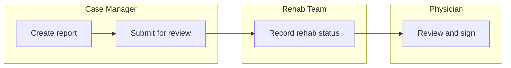

# PRD Template

Derived from a reviewed real-world PRD and checked against standard SaaS PRD
practice. Keep the header table, the numbered assumptions/rules convention, and the
"known prototype artifacts" section — these are stronger than generic PRD templates
and exist for specific reasons noted inline. The one gap filled versus the source
document is an explicit success-metrics field; everything else was already sound.

**Save as**: `prd-<slug>.md`, in `02_prd/features/<slug>/` — never a bare `PRD.md`.

```markdown
# <Feature Name>

**<Product> | Product Requirements | v<version>**

| Field | Value |
|---|---|
| Status | Draft / Ready for review / Approved |
| Audience | Product Manager (review & sign-off) → System Architect (Epic & Story creation) |
| Business goal | The outcome this exists to produce, one or two sentences |
| Success metrics | How you'll know it worked — specific and measurable, not "improve X" |
| Release shape | What ships, how many surfaces/screens, one release or phased |
| Sources | Prototype link (project-level, not per-page — see intake convention), upstream systems of record |
| Related | Other PRDs this depends on or overlaps with, PLUS an explicit boundary statement of what it does NOT touch |
| Open questions | Count, and which ones block story creation |
| repo_status | not-promoted / promoted — set by whoever runs the promotion step, not by this persona (see intake pathway A) |
| last_promoted_revision | Timestamp/version last pushed to the code repo, if promoted. If this is older than the document's last-modified time, a re-promotion is due. |

> **How to read this document** (optional — use for dense/complex PRDs only): orient
> the reader to any non-obvious convention the document uses before they hit it.

## Workflow diagram (swim lane)
A quick-glance view of the end-to-end process this feature supports, across the
personas involved — placed here, before any detailed requirements, specifically so
anyone opening the PRD gets oriented in seconds rather than having to read §3 and
§5 first to piece the flow together themselves.

**Ground this in the PRD's actual §3 Personas and §5 Functional specification —
don't produce a generic-looking process diagram disconnected from what this
specific feature actually does.** Same discipline as everything else in this
document: derive it from the real content, don't invent a plausible-looking flow.

**Keep it to the primary, happy-path sequence only.** Every branch, exception, and
edge case belongs in §5/§6, not here — a diagram trying to show every case stops
being a quick-glance aid and becomes something that needs its own explanation.

One lane per persona, using Mermaid subgraphs (renders natively in GitLab, and is
readable as structured text even where it isn't rendered):


*(illustrative placeholder — replace persona names and steps with this feature's
actual ones)*

## Revision history
Populated once a PRD is revised after `status: approved` — most often triggered by
a dev-team question raised outside this document (chat, email, a grooming
session), not by anything inside the doc-tree workflow itself. Capture *why* a
change happened, not just that it did — git/commit history already answers "what
changed and when"; this table exists specifically to answer "what question or
session prompted it," which commit history alone doesn't carry.

The prototype itself is used for live demos (by Sathish or Product Manager only),
kept current by hand via `templates/claude-design-update-prompt-template.md` — the
`push_to_prototype` column below flags which revisions actually warrant that.
Default is **No**: most revisions (a clarified assumption, a tightened NFR, a
reworded open question) have no visual counterpart and shouldn't trigger it.

| Date | Triggered by | What changed | Changed by | push_to_prototype |
|---|---|---|---|---|
| | e.g. "dev-team question via Slack — clarify status transition on cancel" | | | No (default) |

## 1. Assumptions
Numbered (A1, A2, ...). Foundational truths the requirements depend on. Explicitly
call out anywhere a prototype behaves differently than production must (e.g.
"prototype persists to browser storage; production must persist server-side —
nothing in this document may be implemented against local storage").

## 2. Scope
### 2.1 In scope
### 2.2 Out of scope
Both as bullet lists. Out-of-scope deserves the same specificity as in-scope — vague
scope boundaries are a common source of story creep later.

## 3. Personas
Table: Persona | Release (this phase / next phase) | Use of the feature.

## 4. Data & sources
What's read from where, what's authoritative vs. a point-in-time snapshot vs. live,
and what the update/refresh semantics are. Keep this section even for features that
aren't data-heavy — there's almost always at least one "where does this value
actually come from" question worth answering explicitly rather than assuming.

## 5. Functional specification
Screen-by-screen or flow-by-flow, as tables: Element | Behaviour & rules. If sourced
from a multi-page prototype, tag each row/section with which prototype page it
corresponds to (`prototype_page:` convention) rather than re-deriving it later.

## 6. Business rules / state model
Anywhere multiple things can be true at once — status models, permission matrices,
editability rules — gets its own numbered rule, not prose buried in a paragraph.
State the rule, then exactly what's permitted under it. If a rule exists because of a
prior failure mode, say so — that context is what stops someone "simplifying" the
rule away later without realizing why it's there.

## 7. Data writes / mutations
Table: Write | Trigger | Constraints. What does this feature actually change in the
system of record, and under what conditions.

## 8. Permissions
Table: Action | Role A | Role B | Role C ...

## 9. Non-functional requirements
Performance, data integrity/immutability, audit, persistence, accessibility,
compliance (e.g. HIPAA, SOC2, GDPR as applicable). State "Next phase" or "Platform
level, not specified here" explicitly for anything not addressed — don't just omit
the row, since an omitted row reads as "not considered" rather than "considered and
deferred."

## 10. Next phase / explicitly deferred
Bullet list. Keep this distinct from §2.2 Out of scope: deferred means "yes, later
for this feature"; out of scope means "not part of this feature, possibly never."

## 11. Open questions
Table: ID (IQ-01, ...) | Area | Question and current position | Priority
(Blocker/High/Medium/Low). The "current position" column is what lets story creation
proceed around non-blocking questions instead of stalling on every open item.

## 12. Known prototype artifacts
Mandatory whenever `source: prototype-first`. Bullet list of prototype-only
behavior — fixed fixtures, simulated flows, local storage, pinned dates — that must
NOT be carried into requirements or stories. This is the PM persona's own
cross-check output (see intake pathway A), not a courtesy note.

> **Next step** callout: what must resolve before story creation proceeds, and
> confirmation of what's already storyable now.
```
